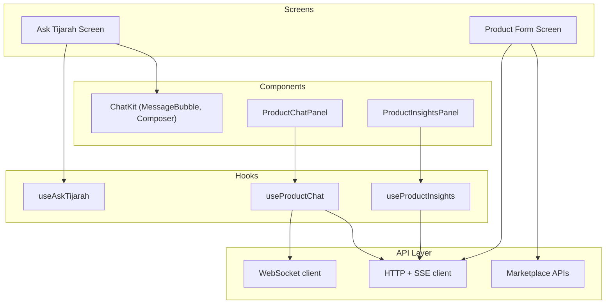
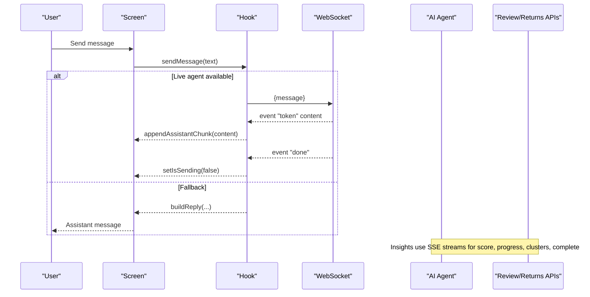
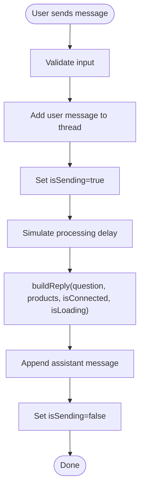
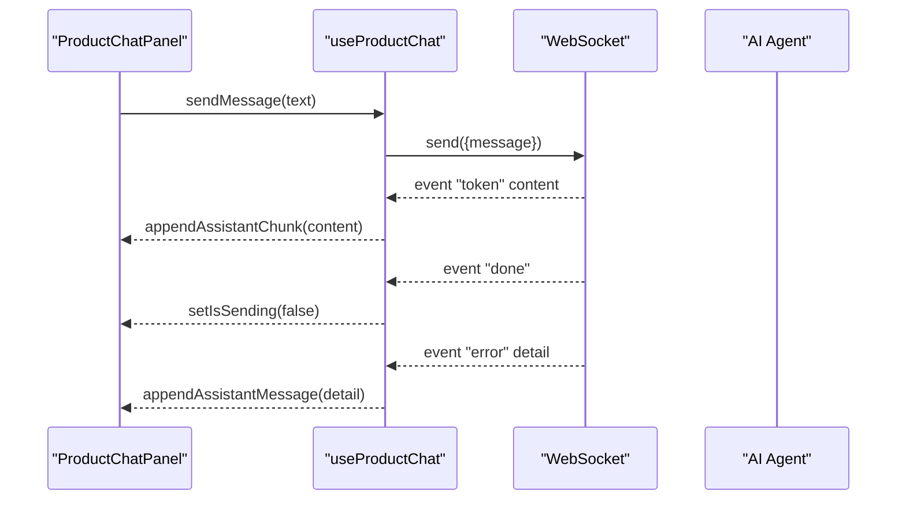
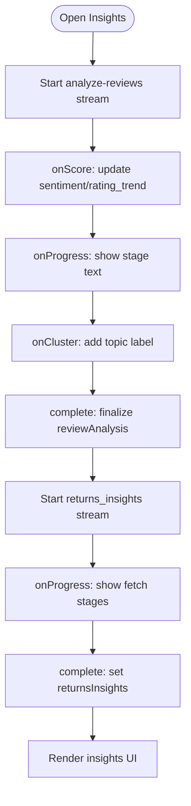
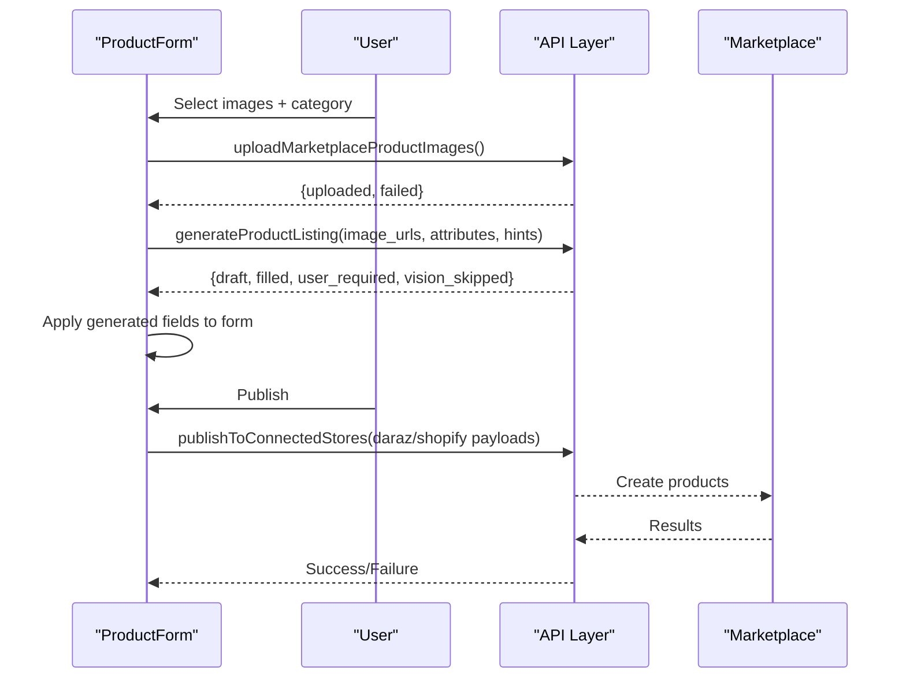
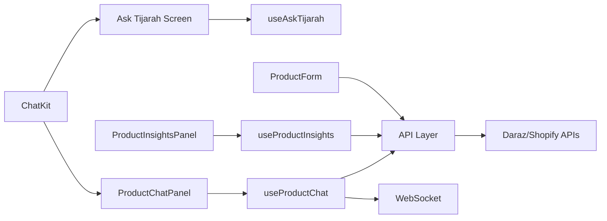

# AI-Powered Features

<cite>
**Referenced Files in This Document**
- [ask-tijarah.tsx](file://src/app/(app)/(tabs)/ask-tijarah.tsx)
- [use-ask-tijarah.ts](file://src/hooks/use-ask-tijarah.ts)
- [chat-kit.tsx](file://src/components/chat-kit.tsx)
- [product-chat.tsx](file://src/components/product-chat.tsx)
- [use-product-chat.ts](file://src/hooks/use-product-chat.ts)
- [use-product-insights.ts](file://src/hooks/use-product-insights.ts)
- [product-insights.tsx](file://src/components/product-insights.tsx)
- [api.ts](file://src/lib/api.ts)
- [api.ts (constants)](file://src/constants/api.ts)
- [product-form.tsx](file://src/app/(app)/product-form.tsx)
</cite>

## Table of Contents
1. Introduction
2. Project Structure
3. Core Components
4. Architecture Overview
5. Detailed Component Analysis
6. Dependency Analysis
7. Performance Considerations
8. Troubleshooting Guide
9. Conclusion

## Introduction
This document explains the AI-powered features in the application, focusing on:
- Ask Tijarah chat interface with streaming responses and real-time communication
- Product listing generation from images using AI
- Business insights and recommendations engine powered by AI analysis
- Integration patterns for external AI services and handling streaming responses
- Chat component architecture and message handling patterns
- Performance considerations and response caching strategies
- Configuration of AI service endpoints and managing API quotas
- Troubleshooting connectivity and response formatting issues

## Project Structure
The AI features are implemented across screens, hooks, components, and a shared API layer:
- Screens: Ask Tijarah tab and product form for listing generation
- Hooks: Real-time chat, insights streaming, and data fetching
- Components: Shared chat UI and insights visualization
- API layer: HTTP requests, SSE streaming, WebSocket chat, and marketplace integrations

**Diagram sources**
- [ask-tijarah.tsx:18-120](file://src/app/(app)/(tabs)/ask-tijarah.tsx#L18-L120)
- [product-form.tsx:409-472](file://src/app/(app)/product-form.tsx#L409-L472)
- [use-ask-tijarah.ts:77-109](file://src/hooks/use-ask-tijarah.ts#L77-L109)
- [use-product-chat.ts:169-319](file://src/hooks/use-product-chat.ts#L169-L319)
- [use-product-insights.ts:92-277](file://src/hooks/use-product-insights.ts#L92-L277)
- [chat-kit.tsx:10-131](file://src/components/chat-kit.tsx#L10-L131)
- [product-chat.tsx:54-175](file://src/components/product-chat.tsx#L54-L175)
- [product-insights.tsx:99-403](file://src/components/product-insights.tsx#L99-L403)
- [api.ts:53-286](file://src/lib/api.ts#L53-L286)

**Section sources**
- [ask-tijarah.tsx:18-120](file://src/app/(app)/(tabs)/ask-tijarah.tsx#L18-L120)
- [product-form.tsx:409-472](file://src/app/(app)/product-form.tsx#L409-L472)
- [use-product-chat.ts:169-319](file://src/hooks/use-product-chat.ts#L169-L319)
- [use-product-insights.ts:92-277](file://src/hooks/use-product-insights.ts#L92-L277)
- [api.ts:53-286](file://src/lib/api.ts#L53-L286)

## Core Components
- Ask Tijarah screen: Store-wide AI chat grounded in connected catalog; shows suggested groups and handles user messages.
- Product chat panel: Per-product AI chat with streaming tokens via WebSocket; falls back to deterministic local replies when live agent is unavailable.
- Insights panel: Displays AI-generated review sentiment, topics, rating trends, return analytics, and recommendations with streaming progress.
- Listing generator: Uploads images, calls AI to generate optimized listing fields, and supports publishing to Daraz/Shopify.

Key responsibilities:
- Message composition and rendering (shared chat UI)
- Streaming token updates and error handling
- SSE-driven insights with incremental updates
- Image upload and AI listing generation workflow

**Section sources**
- [ask-tijarah.tsx:18-120](file://src/app/(app)/(tabs)/ask-tijarah.tsx#L18-L120)
- [product-chat.tsx:54-175](file://src/components/product-chat.tsx#L54-L175)
- [product-insights.tsx:99-403](file://src/components/product-insights.tsx#L99-L403)
- [product-form.tsx:409-472](file://src/app/(app)/product-form.tsx#L409-L472)

## Architecture Overview
The system combines three main flows:
- Real-time chat: WebSocket-based streaming tokens with fallback local logic
- Insights streaming: Server-sent events (SSE) for review analysis and returns insights
- Listing generation: Image upload, AI draft generation, and marketplace publishing

**Diagram sources**
- [use-product-chat.ts:229-319](file://src/hooks/use-product-chat.ts#L229-L319)
- [api.ts:215-286](file://src/lib/api.ts#L215-L286)
- [use-product-insights.ts:165-255](file://src/hooks/use-product-insights.ts#L165-L255)

## Detailed Component Analysis

### Ask Tijarah Chat Interface
- Purpose: Store-wide AI assistant that answers questions about catalog size, average price, stock levels, and out-of-stock items based on connected products.
- Behavior:
  - Shows suggested prompt groups when no conversation exists
  - Adds user messages immediately and simulates assistant thinking
  - Uses deterministic local responder grounded in connected catalog data
- Streaming: Not used here; responses are generated locally after a short delay.

**Diagram sources**
- [use-ask-tijarah.ts:84-109](file://src/hooks/use-ask-tijarah.ts#L84-L109)

**Section sources**
- [ask-tijarah.tsx:18-120](file://src/app/(app)/(tabs)/ask-tijarah.tsx#L18-L120)
- [use-ask-tijarah.ts:19-70](file://src/hooks/use-ask-tijarah.ts#L19-L70)
- [use-ask-tijarah.ts:77-109](file://src/hooks/use-ask-tijarah.ts#L77-L109)

### Product Chat Panel with Streaming Responses
- Purpose: Per-product AI chat grounded in product-specific insights (reviews, returns).
- Streaming:
  - Establishes a WebSocket connection with authentication headers
  - Parses incoming frames (JSON or SSE-style) into events
  - Appends token chunks incrementally to a single assistant message bubble
  - Handles done/error/close events gracefully
- Fallback: When live agent is unavailable (web platform or missing tokens), uses deterministic local replies based on product data.

**Diagram sources**
- [use-product-chat.ts:229-319](file://src/hooks/use-product-chat.ts#L229-L319)
- [product-chat.tsx:54-175](file://src/components/product-chat.tsx#L54-L175)

**Section sources**
- [use-product-chat.ts:21-87](file://src/hooks/use-product-chat.ts#L21-L87)
- [use-product-chat.ts:169-319](file://src/hooks/use-product-chat.ts#L169-L319)
- [product-chat.tsx:25-51](file://src/components/product-chat.tsx#L25-L51)

### Business Insights and Recommendations Engine
- Purpose: Analyze product reviews and return/refund data to provide sentiment scores, recurring themes, rating trends, and actionable recommendations.
- Streaming:
  - Review analysis stream emits score, progress, cluster events, then completes with full analysis
  - Returns insights stream emits progress events while fetching returns/orders, then completes with insights
- UI:
  - Displays sentiment meter, summary, topics, rating trend sparkline, recommended actions
  - Shows return metrics, top reasons, monthly trend, and recommendations

**Diagram sources**
- [use-product-insights.ts:165-255](file://src/hooks/use-product-insights.ts#L165-L255)
- [product-insights.tsx:99-403](file://src/components/product-insights.tsx#L99-L403)

**Section sources**
- [use-product-insights.ts:14-71](file://src/hooks/use-product-insights.ts#L14-L71)
- [use-product-insights.ts:92-277](file://src/hooks/use-product-insights.ts#L92-L277)
- [product-insights.tsx:99-403](file://src/components/product-insights.tsx#L99-L403)

### Product Listing Generation from Images
- Purpose: Generate optimized listing details from uploaded images and category attributes.
- Workflow:
  - Validates image selection and category attributes
  - Uploads images to storage and obtains public URLs
  - Calls AI endpoint to generate draft listing fields and metadata
  - Applies generated values to form fields and highlights AI-filled fields
  - Supports publishing to Daraz and/or Shopify with validation and migration steps

**Diagram sources**
- [product-form.tsx:409-472](file://src/app/(app)/product-form.tsx#L409-L472)
- [api.ts:629-638](file://src/lib/api.ts#L629-L638)
- [api.ts:821-900](file://src/lib/api.ts#L821-L900)

**Section sources**
- [product-form.tsx:368-472](file://src/app/(app)/product-form.tsx#L368-L472)
- [api.ts:629-638](file://src/lib/api.ts#L629-L638)
- [api.ts:821-900](file://src/lib/api.ts#L821-L900)

## Dependency Analysis
- Chat UI components are reused across Ask Tijarah and per-product contexts
- Hooks encapsulate state, streaming, and network concerns
- API layer centralizes HTTP/SSE/WebSocket logic and error normalization
- Marketplace integrations depend on authenticated connections and tokens

**Diagram sources**
- [chat-kit.tsx:10-131](file://src/components/chat-kit.tsx#L10-L131)
- [ask-tijarah.tsx:18-120](file://src/app/(app)/(tabs)/ask-tijarah.tsx#L18-L120)
- [product-chat.tsx:54-175](file://src/components/product-chat.tsx#L54-L175)
- [use-product-chat.ts:169-319](file://src/hooks/use-product-chat.ts#L169-L319)
- [use-product-insights.ts:92-277](file://src/hooks/use-product-insights.ts#L92-L277)
- [product-form.tsx:409-472](file://src/app/(app)/product-form.tsx#L409-L472)
- [api.ts:53-286](file://src/lib/api.ts#L53-L286)

**Section sources**
- [chat-kit.tsx:10-131](file://src/components/chat-kit.tsx#L10-L131)
- [use-product-chat.ts:169-319](file://src/hooks/use-product-chat.ts#L169-L319)
- [use-product-insights.ts:92-277](file://src/hooks/use-product-insights.ts#L92-L277)
- [api.ts:53-286](file://src/lib/api.ts#L53-L286)

## Performance Considerations
- Streaming efficiency:
  - Token-by-token updates minimize perceived latency in chat
  - SSE streams provide incremental progress without blocking UI
- Memory and re-renders:
  - Append chunk function ensures rapid token updates do not spawn multiple bubbles
  - Debounce or throttle could be added if token rate is very high
- Caching strategies:
  - Insights hook avoids refetching by tracking productId:reloadKey pairs
  - Prepared images are cached within a session to avoid redundant uploads
- Network resilience:
  - WebSocket close handlers detect unexpected disconnects and surface friendly messages
  - SSE errors are normalized and surfaced to users with retry options

[No sources needed since this section provides general guidance]

## Troubleshooting Guide
Common issues and resolutions:
- Connectivity problems:
  - Backend unreachable: Check API base URL configuration and device network settings
  - WebSocket handshake failures: Ensure access tokens and marketplace tokens are present before connecting
- Response formatting issues:
  - SSE parsing tolerates JSON objects and SSE frames; ensure backend emits proper event/data lines
  - Normalize Python dict-like payloads by replacing quotes where necessary
- Quota and rate limits:
  - Implement client-side retries with exponential backoff for transient errors
  - Surface quota exceeded messages from API errors and guide users to retry later
- Image upload constraints:
  - Validate file types and sizes before upload; enforce marketplace-specific limits
  - Clean up uploaded images on failure to avoid orphaned assets

Configuration tips:
- Set EXPO_PUBLIC_API_URL for non-local environments
- Use platform-specific defaults for Android emulator vs physical devices
- Ensure CORS and headers are configured correctly for WebSocket and SSE endpoints

**Section sources**
- [api.ts:53-77](file://src/lib/api.ts#L53-L77)
- [api.ts:116-204](file://src/lib/api.ts#L116-L204)
- [api.ts:215-286](file://src/lib/api.ts#L215-L286)
- [api.ts:821-900](file://src/lib/api.ts#L821-L900)
- [api.ts (constants):1-16](file://src/constants/api.ts#L1-L16)

## Conclusion
The AI-powered features combine real-time chat, streaming insights, and intelligent listing generation to streamline merchant workflows. The architecture separates concerns across screens, hooks, components, and a robust API layer, enabling scalable integration with external AI services. Proper configuration, performance tuning, and troubleshooting practices ensure reliable operation across platforms and environments.

[No sources needed since this section summarizes without analyzing specific files]