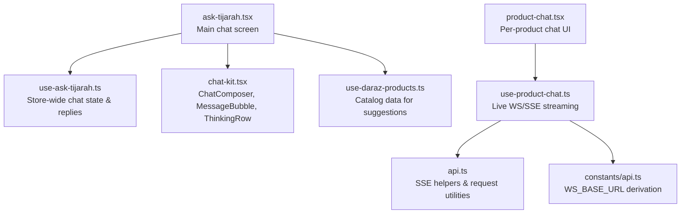
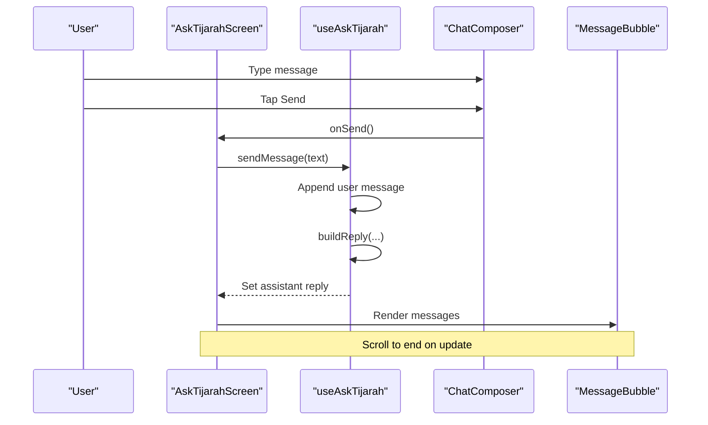
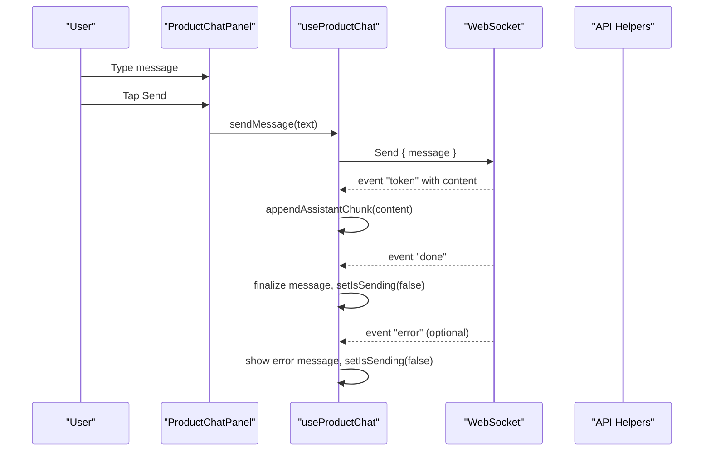
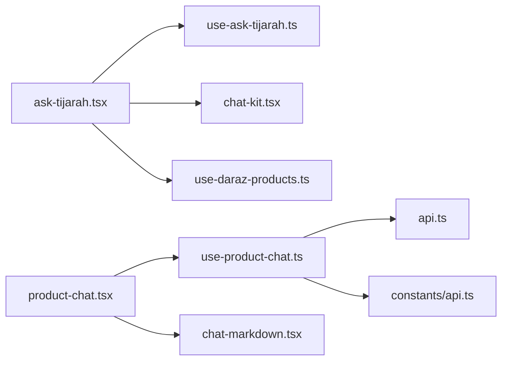

# Ask Tijarah Chat Interface

<cite>
**Referenced Files in This Document**
- [ask-tijarah.tsx](file://src/app/(app)/(tabs)/ask-tijarah.tsx)
- [use-ask-tijarah.ts](file://src/hooks/use-ask-tijarah.ts)
- [chat-kit.tsx](file://src/components/chat-kit.tsx)
- [product-chat.tsx](file://src/components/product-chat.tsx)
- [use-product-chat.ts](file://src/hooks/use-product-chat.ts)
- [chat-markdown.tsx](file://src/components/chat-markdown.tsx)
- [api.ts](file://src/lib/api.ts)
- [use-daraz-products.ts](file://src/hooks/use-daraz-products.ts)
- [api.ts (constants)](file://src/constants/api.ts)
</cite>

## Table of Contents
1. Introduction
2. Project Structure
3. Core Components
4. Architecture Overview
5. Detailed Component Analysis
6. Dependency Analysis
7. Performance Considerations
8. Troubleshooting Guide
9. Conclusion

## Introduction
This document explains the Ask Tijarah chat interface, focusing on the main chat screen, message handling, conversation management, and real-time streaming responses. It details the useAskTijarah hook for store-wide AI chat, the ChatComposer input component, and MessageBubble display components. It also covers integration points with AI services via WebSocket and Server-Sent Events (SSE), conversation reset behavior, keyboard handling patterns, and performance considerations for large histories and streaming.

## Project Structure
The Ask Tijarah feature spans a tab screen, a stateful hook, reusable chat UI components, and an optional per-product chat panel that demonstrates live streaming to an AI agent.

**Diagram sources**
- [ask-tijarah.tsx:18-120](file://src/app/(app)/(tabs)/ask-tijarah.tsx#L18-L120)
- [use-ask-tijarah.ts:77-109](file://src/hooks/use-ask-tijarah.ts#L77-L109)
- [chat-kit.tsx:22-131](file://src/components/chat-kit.tsx#L22-L131)
- [use-daraz-products.ts:120-183](file://src/hooks/use-daraz-products.ts#L120-L183)
- [product-chat.tsx:54-175](file://src/components/product-chat.tsx#L54-L175)
- [use-product-chat.ts:169-319](file://src/hooks/use-product-chat.ts#L169-L319)
- [api.ts:79-286](file://src/lib/api.ts#L79-L286)
- [api.ts (constants):10-15](file://src/constants/api.ts#L10-L15)

**Section sources**
- [ask-tijarah.tsx:18-120](file://src/app/(app)/(tabs)/ask-tijarah.tsx#L18-L120)
- [use-ask-tijarah.ts:77-109](file://src/hooks/use-ask-tijarah.ts#L77-L109)
- [chat-kit.tsx:22-131](file://src/components/chat-kit.tsx#L22-L131)
- [use-daraz-products.ts:120-183](file://src/hooks/use-daraz-products.ts#L120-L183)
- [product-chat.tsx:54-175](file://src/components/product-chat.tsx#L54-L175)
- [use-product-chat.ts:169-319](file://src/hooks/use-product-chat.ts#L169-L319)
- [api.ts:79-286](file://src/lib/api.ts#L79-L286)
- [api.ts (constants):10-15](file://src/constants/api.ts#L10-L15)

## Core Components
- Main chat screen: Renders header, scrollable message list, suggested prompt groups when empty, and the ChatComposer at the bottom. It uses KeyboardAvoidingView for platform-aware keyboard handling and scrolls to the end on new messages or while sending.
- useAskTijarah hook: Manages messages, suggestedGroups, isSending, sendMessage, and resetConversation. Provides deterministic local replies grounded in connected catalog data.
- ChatComposer: Multiline TextInput with send button, focus styling, and safe area padding.
- MessageBubble: Displays user messages as bubbles and assistant messages with an accent rule and label.
- Per-product chat panel: Demonstrates live streaming via WebSocket and SSE parsing, with fallback local replies when live agent is unavailable.

**Section sources**
- [ask-tijarah.tsx:18-120](file://src/app/(app)/(tabs)/ask-tijarah.tsx#L18-L120)
- [use-ask-tijarah.ts:77-109](file://src/hooks/use-ask-tijarah.ts#L77-L109)
- [chat-kit.tsx:22-131](file://src/components/chat-kit.tsx#L22-L131)
- [product-chat.tsx:54-175](file://src/components/product-chat.tsx#L54-L175)
- [use-product-chat.ts:169-319](file://src/hooks/use-product-chat.ts#L169-L319)

## Architecture Overview
The Ask Tijarah flow supports two modes:
- Store-wide chat (Ask Tijarah tab): Local deterministic responder using connected product catalog data.
- Per-product chat: Optional live agent via WebSocket with token streaming; falls back to local responder if not available.

**Diagram sources**
- [ask-tijarah.tsx:34-84](file://src/app/(app)/(tabs)/ask-tijarah.tsx#L34-L84)
- [use-ask-tijarah.ts:84-102](file://src/hooks/use-ask-tijarah.ts#L84-L102)
- [chat-kit.tsx:68-131](file://src/components/chat-kit.tsx#L68-L131)
- [chat-kit.tsx:22-48](file://src/components/chat-kit.tsx#L22-L48)

## Detailed Component Analysis

### AskTijarahScreen (Main Chat Screen)
Responsibilities:
- Compose and render the chat thread with MessageBubble.
- Show suggested prompt groups when no conversation exists yet.
- Handle sending messages via useAskTijarah.
- Provide a reset button to start a new conversation.
- Manage keyboard avoidance and auto-scrolling.

Key behaviors:
- Auto-scroll on message changes or while sending.
- Conditional rendering of suggested groups only when messages.length <= 1.
- Header includes brand mark and reset action.

Keyboard handling:
- Uses KeyboardAvoidingView with platform-specific behavior (iOS padding vs Android height).
- SafeAreaView edges applied to avoid notch/keyboard overlap.

Reset functionality:
- Resets conversation to welcome message based on connection status.

**Section sources**
- [ask-tijarah.tsx:18-120](file://src/app/(app)/(tabs)/ask-tijarah.tsx#L18-L120)
- [ask-tijarah.tsx:124-200](file://src/app/(app)/(tabs)/ask-tijarah.tsx#L124-L200)

### useAskTijarah Hook
Responsibilities:
- Maintain messages array with initial welcome message.
- Track isSending state during processing.
- Generate suggestedGroups for empty state.
- Implement sendMessage that appends user message, simulates delay, and appends assistant reply.
- Provide resetConversation to restore welcome message.

Data grounding:
- Replies are built from connected products, stock levels, and pricing.
- Supports queries about catalog size, average price, out-of-stock, and low-stock items.

Streaming note:
- Currently uses a simulated delay; no real-time streaming in this hook.

**Section sources**
- [use-ask-tijarah.ts:7-29](file://src/hooks/use-ask-tijarah.ts#L7-L29)
- [use-ask-tijarah.ts:31-70](file://src/hooks/use-ask-tijarah.ts#L31-L70)
- [use-ask-tijarah.ts:77-109](file://src/hooks/use-ask-tijarah.ts#L77-L109)

### ChatComposer Component
Responsibilities:
- Provide multiline text input with placeholder.
- Enable/disable send button based on content and sending state.
- Apply focus styles and safe area padding.

Integration:
- Exposes value, onChangeText, onSend, isSending, and placeholder props.
- Used by both Ask Tijarah screen and per-product chat panel.

**Section sources**
- [chat-kit.tsx:68-131](file://src/components/chat-kit.tsx#L68-L131)

### MessageBubble Component
Responsibilities:
- Render user messages as filled bubbles.
- Render assistant messages with an accent rule and label.
- Keep consistent visual grammar across chat surfaces.

**Section sources**
- [chat-kit.tsx:22-48](file://src/components/chat-kit.tsx#L22-L48)

### ThinkingRow Component
Responsibilities:
- Display a transient “Thinking…” indicator aligned with assistant style.

Usage:
- Shown while isSending is true in the Ask Tijarah screen.

**Section sources**
- [chat-kit.tsx:50-66](file://src/components/chat-kit.tsx#L50-L66)

### Product Chat Panel and Streaming
Responsibilities:
- Provide per-product context strip with image, title, and price.
- Render messages and optional suggested prompts.
- Manage local draft and focus state.
- Integrate with useProductChat for live streaming or fallback replies.

Streaming implementation:
- Establishes a WebSocket connection to /reviews/product_chat with authentication headers.
- Parses events (token, done, error) and updates messages incrementally.
- Falls back to local responder when live agent is unavailable (web platform or missing tokens).

Markdown rendering:
- Uses ChatMarkdown to render assistant responses with paragraphs, lists, and bold inline formatting.

**Section sources**
- [product-chat.tsx:25-51](file://src/components/product-chat.tsx#L25-L51)
- [product-chat.tsx:54-175](file://src/components/product-chat.tsx#L54-L175)
- [use-product-chat.ts:169-319](file://src/hooks/use-product-chat.ts#L169-L319)
- [chat-markdown.tsx:11-134](file://src/components/chat-markdown.tsx#L11-L134)

### Real-Time Streaming Flow (Per-Product Chat)

**Diagram sources**
- [use-product-chat.ts:229-286](file://src/hooks/use-product-chat.ts#L229-L286)
- [use-product-chat.ts:288-319](file://src/hooks/use-product-chat.ts#L288-L319)
- [api.ts:79-286](file://src/lib/api.ts#L79-L286)
- [api.ts (constants):10-15](file://src/constants/api.ts#L10-L15)

## Dependency Analysis
- ask-tijarah.tsx depends on:
  - useAskTijarah for state and logic
  - ChatComposer and MessageBubble for UI
  - useDarazProducts for catalog data and connection status
- use-ask-tijarah.ts depends on:
  - Product types and helpers for formatting and stock level checks
- product-chat.tsx depends on:
  - useProductChat for streaming and fallback logic
  - ChatMarkdown for rich text rendering
- use-product-chat.ts depends on:
  - WebSocket and SSE parsing utilities in api.ts
  - Authentication and marketplace access hooks

**Diagram sources**
- [ask-tijarah.tsx:18-120](file://src/app/(app)/(tabs)/ask-tijarah.tsx#L18-L120)
- [use-ask-tijarah.ts:77-109](file://src/hooks/use-ask-tijarah.ts#L77-L109)
- [chat-kit.tsx:22-131](file://src/components/chat-kit.tsx#L22-L131)
- [use-daraz-products.ts:120-183](file://src/hooks/use-daraz-products.ts#L120-L183)
- [product-chat.tsx:54-175](file://src/components/product-chat.tsx#L54-L175)
- [use-product-chat.ts:169-319](file://src/hooks/use-product-chat.ts#L169-L319)
- [chat-markdown.tsx:11-134](file://src/components/chat-markdown.tsx#L11-L134)
- [api.ts:79-286](file://src/lib/api.ts#L79-L286)
- [api.ts (constants):10-15](file://src/constants/api.ts#L10-L15)

**Section sources**
- [ask-tijarah.tsx:18-120](file://src/app/(app)/(tabs)/ask-tijarah.tsx#L18-L120)
- [use-ask-tijarah.ts:77-109](file://src/hooks/use-ask-tijarah.ts#L77-L109)
- [product-chat.tsx:54-175](file://src/components/product-chat.tsx#L54-L175)
- [use-product-chat.ts:169-319](file://src/hooks/use-product-chat.ts#L169-L319)
- [api.ts:79-286](file://src/lib/api.ts#L79-L286)

## Performance Considerations
Large message histories:
- The screen renders all messages in a ScrollView. For very long conversations, consider virtualization or pagination to reduce re-renders and memory usage.
- Avoid unnecessary recompositions by memoizing expensive computations (e.g., suggested prompts) where applicable.

Streaming response optimization:
- In per-product chat, streaming chunks are appended to a single assistant message using a stable id reference to prevent duplicate bubbles.
- Debounce or batch small chunks if needed to reduce frequent state updates.
- Ensure WebSocket cleanup on unmount to prevent leaks.

Input handling:
- Use multiline TextInput with a max height to constrain layout and improve scrolling performance.
- Disable send button while sending to prevent duplicate requests.

Network and platform differences:
- Live agent requires native WebSocket support with custom headers; web fallback uses local responder.
- SSE consumption uses different paths for web vs React Native; ensure proper error handling and stream termination.

[No sources needed since this section provides general guidance]

## Troubleshooting Guide
Common issues and resolutions:
- No connection to Daraz:
  - Welcome message instructs connecting Daraz from the Products tab. Verify useDarazProducts returns isConnected and non-empty products.
- Loading state:
  - If isLoading is true, the hook returns a waiting message. Wait until catalog loads before asking questions.
- Empty catalog:
  - If products array is empty, the hook informs the user there is nothing to report on.
- WebSocket errors:
  - On error events, the per-product chat shows a friendly message and resets sending state. Check network connectivity and tokens.
- Lost connection:
  - If the WebSocket closes unexpectedly while sending, the hook notifies the user to try again.

Error handling utilities:
- API layer extracts human-readable messages from backend errors and wraps them in ApiError for consistent handling.
- SSE parsing handles malformed payloads gracefully and normalizes Python dict syntax when encountered.

**Section sources**
- [use-ask-tijarah.ts:31-70](file://src/hooks/use-ask-tijarah.ts#L31-L70)
- [use-product-chat.ts:250-286](file://src/hooks/use-product-chat.ts#L250-L286)
- [api.ts:15-51](file://src/lib/api.ts#L15-L51)
- [api.ts:79-108](file://src/lib/api.ts#L79-L108)

## Conclusion
The Ask Tijarah chat interface combines a clean, accessible UI with robust state management and optional live streaming. The store-wide chat provides immediate, grounded answers using connected catalog data, while the per-product chat demonstrates advanced real-time interactions with an AI agent. By following the patterns outlined here—clear separation of concerns, thoughtful keyboard handling, and resilient streaming—you can extend the chat experience with additional features while maintaining performance and reliability.

[No sources needed since this section summarizes without analyzing specific files]