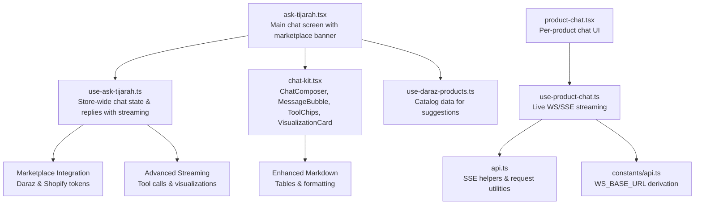
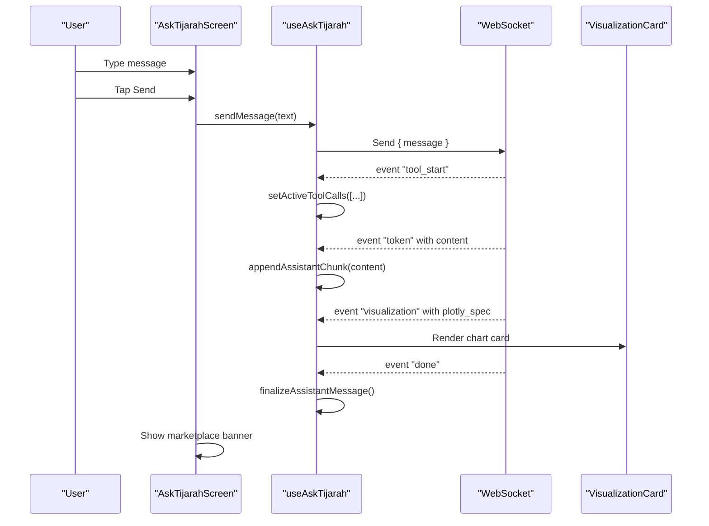
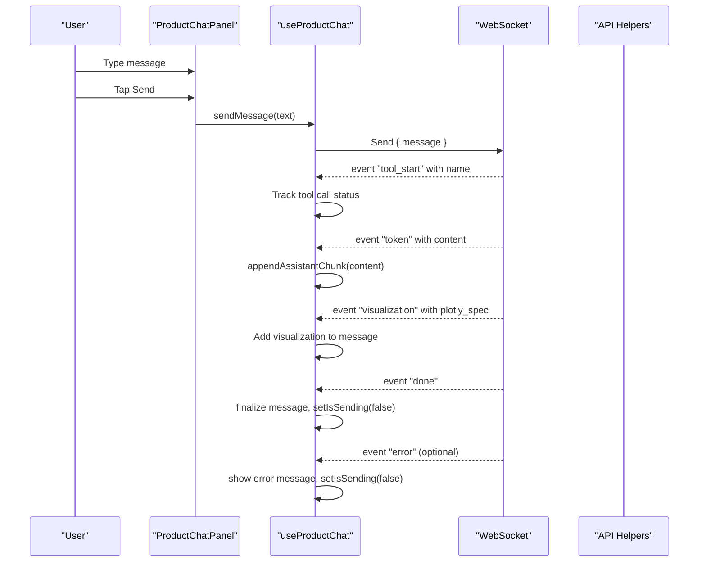
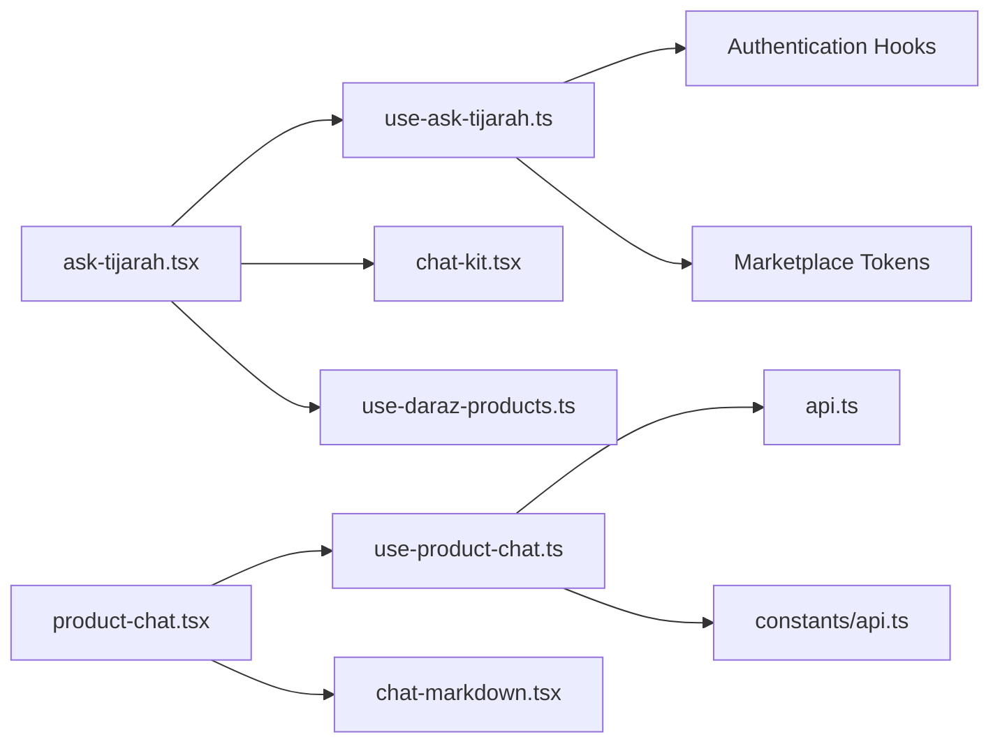

# Ask Tijarah Chat Interface

<cite>
**Referenced Files in This Document**
- [ask-tijarah.tsx](file://src/app/(app)/(tabs)/ask-tijarah.tsx)
- [use-ask-tijarah.ts](file://src/hooks/use-ask-tijarah.ts)
- [chat-kit.tsx](file://src/components/chat-kit.tsx)
- [product-chat.tsx](file://src/components/product-chat.tsx)
- [use-product-chat.ts](file://src/hooks/use-product-chat.ts)
- [chat-markdown.tsx](file://src/components/chat-markdown.tsx)
- [api.ts](file://src/lib/api.ts)
- [api.ts (constants)](file://src/constants/api.ts)
</cite>

## Update Summary
**Changes Made**
- Enhanced marketplace integration with real-time connection status and multi-marketplace support
- Added advanced tool call visualization with running/done status indicators
- Implemented comprehensive streaming support with visualization cards and chart rendering
- Enhanced markdown rendering with table support and improved formatting
- Sophisticated keyboard handling with platform-specific behavior and auto-scroll management
- Rich response processing with Python literal parsing and event frame handling
- Improved error handling and connection recovery mechanisms

## Table of Contents
1. Introduction
2. Project Structure
3. Core Components
4. Architecture Overview
5. Detailed Component Analysis
6. Dependency Analysis
7. Performance Considerations
8. Troubleshooting Guide
9. Conclusion

## Introduction
This document explains the enhanced Ask Tijarah chat interface, focusing on the main chat screen, message handling, conversation management, and real-time streaming responses. It details the useAskTijarah hook for store-wide AI chat with marketplace integration, the ChatComposer input component, and MessageBubble display components. The system now supports advanced features including tool call visualization, streaming visualizations, enhanced markdown rendering with tables, sophisticated keyboard handling, and rich response processing capabilities.

## Project Structure
The Ask Tijarah feature spans a tab screen with marketplace integration, a stateful hook with advanced streaming capabilities, reusable chat UI components, and an optional per-product chat panel that demonstrates live streaming to an AI agent.

**Diagram sources**
- [ask-tijarah.tsx:18-120](file://src/app/(app)/(tabs)/ask-tijarah.tsx#L18-L120)
- [use-ask-tijarah.ts:237-581](file://src/hooks/use-ask-tijarah.ts#L237-L581)
- [chat-kit.tsx:22-491](file://src/components/chat-kit.tsx#L22-L491)
- [product-chat.tsx:54-175](file://src/components/product-chat.tsx#L54-L175)
- [use-product-chat.ts:169-320](file://src/hooks/use-product-chat.ts#L169-L320)
- [api.ts:113-156](file://src/lib/api.ts#L113-L156)
- [api.ts (constants):10-15](file://src/constants/api.ts#L10-L15)

**Section sources**
- [ask-tijarah.tsx:18-120](file://src/app/(app)/(tabs)/ask-tijarah.tsx#L18-L120)
- [use-ask-tijarah.ts:237-581](file://src/hooks/use-ask-tijarah.ts#L237-L581)
- [chat-kit.tsx:22-491](file://src/components/chat-kit.tsx#L22-L491)
- [product-chat.tsx:54-175](file://src/components/product-chat.tsx#L54-L175)
- [use-product-chat.ts:169-320](file://src/hooks/use-product-chat.ts#L169-L320)
- [api.ts:113-156](file://src/lib/api.ts#L113-L156)
- [api.ts (constants):10-15](file://src/constants/api.ts#L10-L15)

## Core Components
- **Enhanced Main Chat Screen**: Renders header with marketplace connection status, scrollable message list with tool call visualization, suggested prompt groups when empty, and the ChatComposer at the bottom with sophisticated keyboard handling.
- **Advanced useAskTijarah Hook**: Manages messages, suggestedGroups, isSending, sendMessage, resetConversation, activeToolCalls, and marketplaces. Provides real-time streaming with visualization support and marketplace integration.
- **Enhanced ChatComposer**: Multiline TextInput with send button, focus styling, safe area padding, and dynamic bottom inset handling for keyboard events.
- **Rich MessageBubble**: Displays user messages as bubbles and assistant messages with accent rule, label, tool call chips, and visualization cards.
- **ToolChips Component**: Shows running tool calls with formatted names and status indicators during processing.
- **VisualizationCard Component**: Renders Plotly chart specifications as interactive SVG charts with legends and responsive sizing.
- **Enhanced Markdown Renderer**: Supports paragraphs, lists, tables, and bold inline formatting with sophisticated parsing.

**Section sources**
- [ask-tijarah.tsx:18-120](file://src/app/(app)/(tabs)/ask-tijarah.tsx#L18-L120)
- [use-ask-tijarah.ts:237-581](file://src/hooks/use-ask-tijarah.ts#L237-L581)
- [chat-kit.tsx:22-491](file://src/components/chat-kit.tsx#L22-L491)
- [product-chat.tsx:54-175](file://src/components/product-chat.tsx#L54-L175)
- [use-product-chat.ts:169-320](file://src/hooks/use-product-chat.ts#L169-L320)
- [chat-markdown.tsx:14-244](file://src/components/chat-markdown.tsx#L14-L244)

## Architecture Overview
The enhanced Ask Tijarah flow supports two modes with advanced capabilities:
- **Store-wide chat (Ask Tijarah tab)**: Real-time WebSocket connection to multi-marketplace AI agent with streaming responses, tool call visualization, and chart rendering.
- **Per-product chat**: Optional live agent via WebSocket with token streaming; falls back to local responder if not available.

**Diagram sources**
- [ask-tijarah.tsx:52-120](file://src/app/(app)/(tabs)/ask-tijarah.tsx#L52-L120)
- [use-ask-tijarah.ts:529-564](file://src/hooks/use-ask-tijarah.ts#L529-L564)
- [use-ask-tijarah.ts:427-507](file://src/hooks/use-ask-tijarah.ts#L427-L507)
- [chat-kit.tsx:173-329](file://src/components/chat-kit.tsx#L173-L329)

## Detailed Component Analysis

### Enhanced AskTijarahScreen (Main Chat Screen)
Responsibilities:
- Compose and render the chat thread with MessageBubble and ToolChips.
- Display marketplace connection status banner when connected.
- Show suggested prompt groups when no conversation exists yet.
- Handle sending messages via useAskTijarah with sophisticated keyboard handling.
- Provide a reset button to start a new conversation.
- Manage keyboard avoidance with platform-specific behavior and auto-scrolling.

**Updated** Enhanced with marketplace integration banner, tool call visualization, and advanced keyboard handling.

Key behaviors:
- Auto-scroll on message changes or while sending with smart scroll detection.
- Conditional rendering of suggested groups only when messages.length <= 1.
- Header includes brand mark, reset action, and marketplace connection status.
- Dynamic keyboard offset handling with platform-specific behavior.

Keyboard handling:
- Uses KeyboardAvoidingView with platform-specific behavior (iOS padding vs Android height).
- SafeAreaView edges applied to avoid notch/keyboard overlap.
- Real-time keyboard event listeners for smooth transitions.

Reset functionality:
- Resets conversation to welcome message based on connection status.

**Section sources**
- [ask-tijarah.tsx:18-120](file://src/app/(app)/(tabs)/ask-tijarah.tsx#L18-L120)
- [ask-tijarah.tsx:124-200](file://src/app/(app)/(tabs)/ask-tijarah.tsx#L124-L200)

### Advanced useAskTijarah Hook
Responsibilities:
- Maintain messages array with initial welcome message and marketplace connection status.
- Track isSending state, activeToolCalls, and marketplaces during processing.
- Generate suggestedGroups for empty state with categorized prompts.
- Implement sendMessage that appends user message, handles streaming, and manages tool calls.
- Provide resetConversation to restore welcome message.
- Connect to WebSocket with authentication headers and marketplace tokens.

**Updated** Enhanced with marketplace integration, streaming visualizations, tool call tracking, and advanced event parsing.

Data grounding:
- Replies are built from connected products, stock levels, and pricing across multiple marketplaces.
- Supports queries about catalog size, average price, out-of-stock, and low-stock items.
- Real-time streaming with visualization support and tool call feedback.

Streaming implementation:
- Establishes WebSocket connection with authentication and marketplace tokens.
- Parses events (connected, tool_start, tool_end, token, visualization, done, error).
- Handles Python literal parsing for backend compatibility.
- Falls back to local responder when WebSocket unavailable.

**Section sources**
- [use-ask-tijarah.ts:237-581](file://src/hooks/use-ask-tijarah.ts#L237-L581)

### Enhanced ChatComposer Component
Responsibilities:
- Provide multiline text input with placeholder and dynamic bottom inset handling.
- Enable/disable send button based on content and sending state.
- Apply focus styles and safe area padding with keyboard awareness.
- Support dynamic bottomInset parameter for keyboard event handling.

**Updated** Enhanced with dynamic bottom inset handling and improved keyboard integration.

Integration:
- Exposes value, onChangeText, onSend, isSending, placeholder, and bottomInset props.
- Used by both Ask Tijarah screen and per-product chat panel.

**Section sources**
- [chat-kit.tsx:331-398](file://src/components/chat-kit.tsx#L331-L398)

### Rich MessageBubble Component
Responsibilities:
- Render user messages as filled bubbles.
- Render assistant messages with accent rule, label, tool call chips, and visualization cards.
- Keep consistent visual grammar across chat surfaces.

**Updated** Enhanced with tool call chips and visualization card support.

**Section sources**
- [chat-kit.tsx:27-60](file://src/components/chat-kit.tsx#L27-L60)

### ToolChips Component
Responsibilities:
- Display running tool calls with formatted names and status indicators.
- Show progress during complex operations like financial analysis or catalog queries.

Usage:
- Shown while isSending is true with active tool calls in the Ask Tijarah screen.

**Section sources**
- [chat-kit.tsx:101-120](file://src/components/chat-kit.tsx#L101-L120)

### VisualizationCard Component
Responsibilities:
- Render Plotly chart specifications as interactive SVG charts.
- Support line and bar charts with legends, gridlines, and responsive sizing.
- Handle multiple traces and provide visual feedback for data analysis.

**New Feature** Advanced chart rendering capability for data visualization.

**Section sources**
- [chat-kit.tsx:173-329](file://src/components/chat-kit.tsx#L173-L329)

### Enhanced Product Chat Panel and Streaming
Responsibilities:
- Provide per-product context strip with image, title, and price.
- Render messages and optional suggested prompts.
- Manage local draft and focus state.
- Integrate with useProductChat for live streaming or fallback replies.

**Updated** Enhanced with improved streaming and better error handling.

Streaming implementation:
- Establishes WebSocket connection to /reviews/product_chat with authentication headers.
- Parses events (token, done, error) and updates messages incrementally.
- Falls back to local responder when live agent is unavailable.

Markdown rendering:
- Uses ChatMarkdown to render assistant responses with paragraphs, lists, tables, and bold inline formatting.

**Section sources**
- [product-chat.tsx:54-175](file://src/components/product-chat.tsx#L54-L175)
- [use-product-chat.ts:169-320](file://src/hooks/use-product-chat.ts#L169-L320)

### Enhanced Markdown Rendering
Responsibilities:
- Parse and render markdown content with support for paragraphs, ordered lists, bullet lists, and tables.
- Handle inline bold formatting with proper styling.
- Provide responsive table rendering with headers and rows.

**New Feature** Comprehensive markdown parsing with table support.

**Section sources**
- [chat-markdown.tsx:14-244](file://src/components/chat-markdown.tsx#L14-L244)

### Real-Time Streaming Flow (Enhanced)

**Diagram sources**
- [use-product-chat.ts:288-320](file://src/hooks/use-product-chat.ts#L288-L320)
- [use-ask-tijarah.ts:427-507](file://src/hooks/use-ask-tijarah.ts#L427-L507)
- [api.ts:113-156](file://src/lib/api.ts#L113-L156)

## Dependency Analysis
- ask-tijarah.tsx depends on:
  - useAskTijarah for state and logic with marketplace integration
  - ChatComposer, MessageBubble, ToolChips for UI
  - useDarazProducts for catalog data and connection status
- use-ask-tijarah.ts depends on:
  - Authentication hooks for access tokens
  - Marketplace token hooks for Daraz and Shopify
  - WebSocket utilities for real-time communication
- product-chat.tsx depends on:
  - useProductChat for streaming and fallback logic
  - ChatMarkdown for rich text rendering
- use-product-chat.ts depends on:
  - WebSocket and SSE parsing utilities in api.ts
  - Authentication and marketplace access hooks

**Diagram sources**
- [ask-tijarah.tsx:18-120](file://src/app/(app)/(tabs)/ask-tijarah.tsx#L18-L120)
- [use-ask-tijarah.ts:237-581](file://src/hooks/use-ask-tijarah.ts#L237-L581)
- [chat-kit.tsx:22-491](file://src/components/chat-kit.tsx#L22-L491)
- [product-chat.tsx:54-175](file://src/components/product-chat.tsx#L54-L175)
- [use-product-chat.ts:169-320](file://src/hooks/use-product-chat.ts#L169-L320)
- [chat-markdown.tsx:14-244](file://src/components/chat-markdown.tsx#L14-L244)
- [api.ts:113-156](file://src/lib/api.ts#L113-L156)

**Section sources**
- [ask-tijarah.tsx:18-120](file://src/app/(app)/(tabs)/ask-tijarah.tsx#L18-L120)
- [use-ask-tijarah.ts:237-581](file://src/hooks/use-ask-tijarah.ts#L237-L581)
- [product-chat.tsx:54-175](file://src/components/product-chat.tsx#L54-L175)
- [use-product-chat.ts:169-320](file://src/hooks/use-product-chat.ts#L169-L320)
- [api.ts:113-156](file://src/lib/api.ts#L113-L156)

## Performance Considerations
Large message histories:
- The screen renders all messages in a ScrollView with virtualization considerations for long conversations.
- Avoid unnecessary recompositions by memoizing expensive computations (e.g., suggested prompts, chart traces).
- Use stable ID references for streaming messages to prevent duplicate bubbles.

Streaming response optimization:
- In per-product chat, streaming chunks are appended to a single assistant message using stable ID references.
- Debounce or batch small chunks if needed to reduce frequent state updates.
- Ensure WebSocket cleanup on unmount to prevent memory leaks.
- Visualization rendering uses memoized trace extraction for performance.

Input handling:
- Use multiline TextInput with max height constraints to improve scrolling performance.
- Disable send button while sending to prevent duplicate requests.
- Dynamic bottom inset handling prevents layout shifts during keyboard events.

Network and platform differences:
- Live agent requires native WebSocket support with custom headers; web fallback uses local responder.
- SSE consumption uses different paths for web vs React Native with proper error handling.
- Python literal parsing ensures compatibility with backend response formats.

**Section sources**
- [use-ask-tijarah.ts:264-323](file://src/hooks/use-ask-tijarah.ts#L264-L323)
- [chat-kit.tsx:173-329](file://src/components/chat-kit.tsx#L173-L329)
- [use-product-chat.ts:196-224](file://src/hooks/use-product-chat.ts#L196-L224)

## Troubleshooting Guide
Common issues and resolutions:
- **No marketplace connection**: Welcome message instructs connecting marketplaces from the Products tab. Verify useDarazProducts returns isConnected and non-empty products.
- **WebSocket connection failures**: Check network connectivity, authentication tokens, and marketplace access tokens.
- **Streaming interruptions**: Connection loss shows friendly error messages and allows retry.
- **Chart rendering issues**: VisualizationCard handles malformed Plotly specs gracefully with fallback messages.
- **Markdown parsing errors**: Enhanced parser handles various markdown formats and falls back to plain text.

Error handling utilities:
- API layer extracts human-readable messages from backend errors and wraps them in ApiError for consistent handling.
- SSE parsing handles malformed payloads gracefully and normalizes Python dict syntax when encountered.
- WebSocket handlers include try-catch blocks for robust error management.

**Section sources**
- [use-ask-tijarah.ts:491-518](file://src/hooks/use-ask-tijarah.ts#L491-L518)
- [use-product-chat.ts:261-278](file://src/hooks/use-product-chat.ts#L261-L278)
- [api.ts:113-156](file://src/lib/api.ts#L113-L156)

## Conclusion
The enhanced Ask Tijarah chat interface combines a clean, accessible UI with robust state management, marketplace integration, and advanced real-time streaming capabilities. The store-wide chat provides immediate, grounded answers using connected marketplace data with live tool call feedback and visualization support, while the per-product chat demonstrates sophisticated real-time interactions with an AI agent. The system now includes comprehensive markdown rendering with table support, sophisticated keyboard handling, and resilient streaming with automatic reconnection. By following the patterns outlined here—clear separation of concerns, thoughtful keyboard handling, marketplace integration, and resilient streaming—you can extend the chat experience with additional features while maintaining performance and reliability.