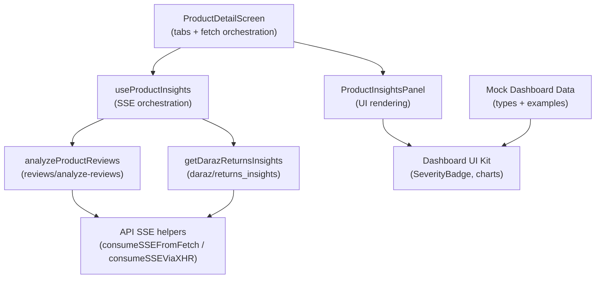
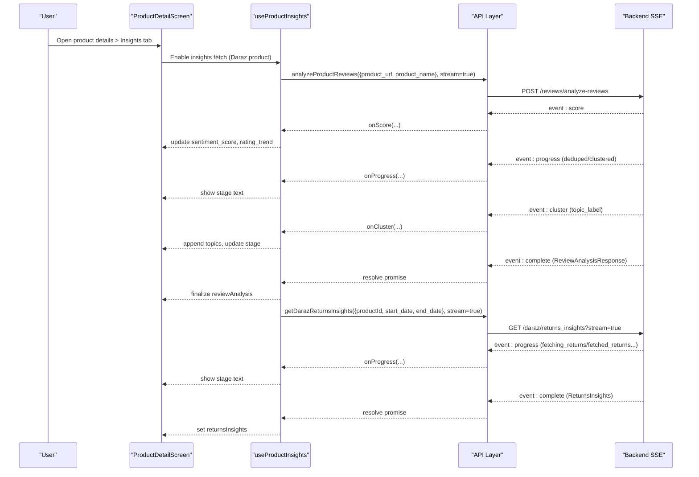
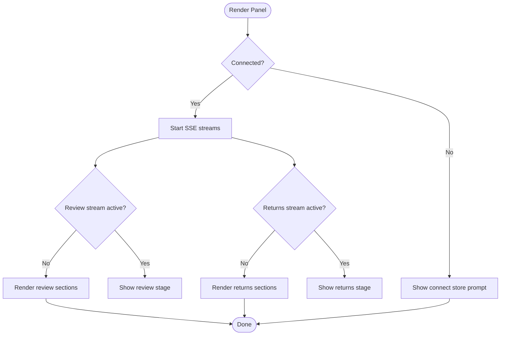
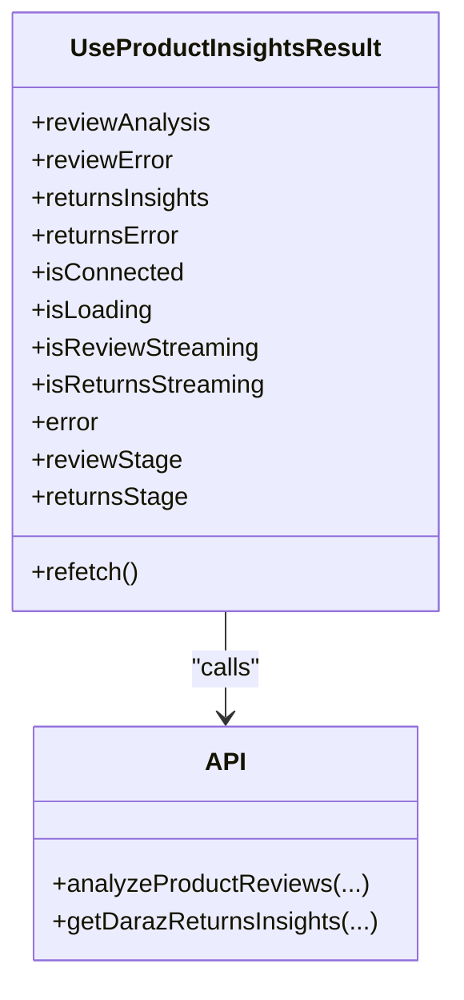
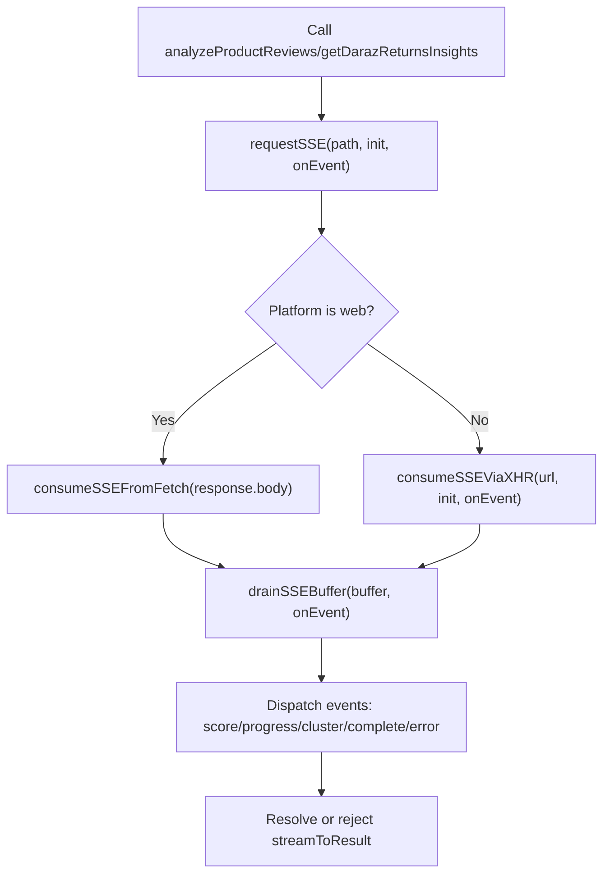
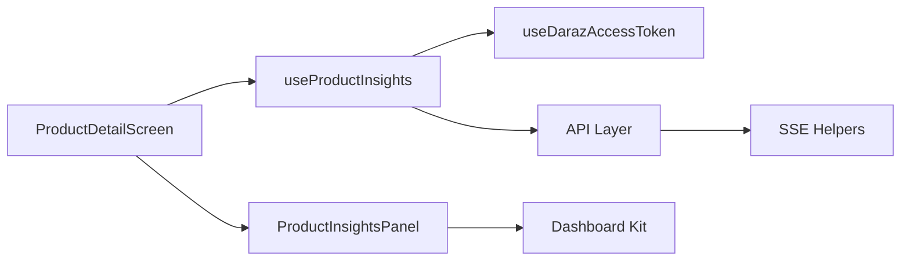

# Business Insights & Recommendations

<cite>
**Referenced Files in This Document**
- [product-insights.tsx](file://src/components/product-insights.tsx)
- [use-product-insights.ts](file://src/hooks/use-product-insights.ts)
- [api.ts](file://src/lib/api.ts)
- [dashboard-mock.ts](file://src/constants/dashboard-mock.ts)
- [dashboard-kit.tsx](file://src/components/dashboard-kit.tsx)
- [product-detail.tsx](file://src/app/(app)/product-detail.tsx)
- [insights.tsx](file://src/app/(app)/(tabs)/insights.tsx)
- [use-daraz-access-token.ts](file://src/hooks/use-daraz-access-token.ts)
</cite>

## Table of Contents
1. [Introduction](#introduction)
2. [Project Structure](#project-structure)
3. [Core Components](#core-components)
4. [Architecture Overview](#architecture-overview)
5. [Detailed Component Analysis](#detailed-component-analysis)
6. [Dependency Analysis](#dependency-analysis)
7. [Performance Considerations](#performance-considerations)
8. [Troubleshooting Guide](#troubleshooting-guide)
9. [Conclusion](#conclusion)
10. [Appendices](#appendices)

## Introduction
This document explains the business insights and recommendations engine that transforms raw marketplace data into actionable insights for merchants. It focuses on how AI analyzes product reviews, sentiment, and return/refund analytics to generate recommendations, and how those insights are presented to users through a dedicated product insights panel. It also documents the data processing pipeline, mock data used during development, and guidance for extending the engine with custom rules and algorithms.

## Project Structure
The insights feature spans UI components, hooks, and API utilities:
- Product detail screen orchestrates tabs (details, insights, chat) and owns insight fetching lifecycle.
- The insights hook coordinates SSE streams for review analysis and returns insights.
- The API layer provides typed requests, streaming helpers, and response normalization.
- Mock dashboard data models define insight shapes and example scenarios for development.

**Diagram sources**
- [product-detail.tsx:25-65](file://src/app/(app)/product-detail.tsx#L25-L65)
- [use-product-insights.ts:92-165](file://src/hooks/use-product-insights.ts#L92-L165)
- [api.ts:116-286](file://src/lib/api.ts#L116-L286)
- [product-insights.tsx:99-181](file://src/components/product-insights.tsx#L99-L181)
- [dashboard-kit.tsx:61-71](file://src/components/dashboard-kit.tsx#L61-L71)
- [dashboard-mock.ts:52-62](file://src/constants/dashboard-mock.ts#L52-L62)

**Section sources**
- [product-detail.tsx:25-65](file://src/app/(app)/product-detail.tsx#L25-L65)
- [use-product-insights.ts:92-165](file://src/hooks/use-product-insights.ts#L92-L165)
- [api.ts:116-286](file://src/lib/api.ts#L116-L286)
- [product-insights.tsx:99-181](file://src/components/product-insights.tsx#L99-L181)
- [dashboard-kit.tsx:61-71](file://src/components/dashboard-kit.tsx#L61-L71)
- [dashboard-mock.ts:52-62](file://src/constants/dashboard-mock.ts#L52-L62)

## Core Components
- ProductInsightsPanel: Renders sentiment score, recurring themes, rating trend sparkline, recommended actions, returns metrics, monthly returns trend, top return reasons, and recommendations. It handles loading, streaming status, errors, and empty states.
- useProductInsights: Orchestrates two independent SSE streams (review analysis and returns insights), updates incremental state, surfaces per-source errors, and exposes refetch capability.
- API layer: Provides request helpers, SSE consumption across web and React Native, typed types for review analysis and returns insights, and stream-to-result wrapper.
- Mock dashboard data: Defines shared types (Severity, Tone, AgentId) and example insight cards, inventory risks, and graphs used by dashboard components.

Key responsibilities:
- Streaming UX: Show progress stages while long-running analyses run.
- Resilience: One failing source does not hide the other; separate error states.
- Presentation: Visualize trends and recommendations with consistent tone mapping.

**Section sources**
- [product-insights.tsx:99-403](file://src/components/product-insights.tsx#L99-L403)
- [use-product-insights.ts:48-117](file://src/hooks/use-product-insights.ts#L48-L117)
- [api.ts:116-286](file://src/lib/api.ts#L116-L286)
- [dashboard-mock.ts:52-62](file://src/constants/dashboard-mock.ts#L52-L62)

## Architecture Overview
The insights engine uses server-sent events to provide real-time feedback during AI analysis:
- Review analysis: Streams preliminary sentiment score, progress events, topic clusters, and final result.
- Returns insights: Streams fetch stages for returns and orders, then returns aggregated metrics and recommendations.

**Diagram sources**
- [use-product-insights.ts:165-255](file://src/hooks/use-product-insights.ts#L165-L255)
- [api.ts:1342-1364](file://src/lib/api.ts#L1342-L1364)
- [api.ts:1257-1281](file://src/lib/api.ts#L1257-L1281)
- [api.ts:116-286](file://src/lib/api.ts#L116-L286)

## Detailed Component Analysis

### ProductInsightsPanel
- Displays sentiment meter, summary, recurring themes, rating trend sparkline, recommended actions sorted by severity, returns metrics, monthly returns trend, top return reasons, and recommendations.
- Handles connection gating (requires Daraz connection), initial loading, streaming status, and retry flows.
- Uses shared theme tokens and chart components for consistent visuals.

**Diagram sources**
- [product-insights.tsx:99-181](file://src/components/product-insights.tsx#L99-L181)
- [product-insights.tsx:196-403](file://src/components/product-insights.tsx#L196-L403)

**Section sources**
- [product-insights.tsx:99-403](file://src/components/product-insights.tsx#L99-L403)

### useProductInsights Hook
- Coordinates SSE streams for review analysis and returns insights using Promise.allSettled to isolate failures.
- Maintains incremental state for streaming updates and final results.
- Exposes refetch and connection status via dependency on Daraz access token resolution.

**Diagram sources**
- [use-product-insights.ts:48-117](file://src/hooks/use-product-insights.ts#L48-L117)
- [use-product-insights.ts:165-255](file://src/hooks/use-product-insights.ts#L165-L255)
- [api.ts:1342-1364](file://src/lib/api.ts#L1342-L1364)
- [api.ts:1257-1281](file://src/lib/api.ts#L1257-L1281)

**Section sources**
- [use-product-insights.ts:92-277](file://src/hooks/use-product-insights.ts#L92-L277)

### API Layer and SSE Pipeline
- Centralized request helper with robust error extraction from backend responses.
- SSE consumer supports both web (ReadableStream) and React Native (XHR onprogress).
- streamToResult wraps SSE calls to resolve on “complete” and reject on “error”.
- Typed interfaces for review analysis and returns insights ensure type safety across the app.

**Diagram sources**
- [api.ts:116-286](file://src/lib/api.ts#L116-L286)
- [api.ts:215-286](file://src/lib/api.ts#L215-L286)

**Section sources**
- [api.ts:53-77](file://src/lib/api.ts#L53-L77)
- [api.ts:116-286](file://src/lib/api.ts#L116-L286)
- [api.ts:1342-1364](file://src/lib/api.ts#L1342-L1364)
- [api.ts:1257-1281](file://src/lib/api.ts#L1257-L1281)

### Mock Data and Types
- Shared types Severity, Tone, AgentId unify visual semantics across dashboards and insights.
- Example insight cards, inventory risks, and graphs demonstrate expected structures and tones for future integration.

**Section sources**
- [dashboard-mock.ts:52-62](file://src/constants/dashboard-mock.ts#L52-L62)
- [dashboard-mock.ts:101-131](file://src/constants/dashboard-mock.ts#L101-L131)
- [dashboard-mock.ts:137-149](file://src/constants/dashboard-mock.ts#L137-L149)
- [dashboard-mock.ts:151-161](file://src/constants/dashboard-mock.ts#L151-L161)
- [dashboard-mock.ts:181-248](file://src/constants/dashboard-mock.ts#L181-L248)
- [dashboard-mock.ts:250-295](file://src/constants/dashboard-mock.ts#L250-L295)

## Dependency Analysis
- ProductDetailScreen depends on useProductInsights to enable insights only when needed and shares the result between Insights and Chat tabs.
- useProductInsights depends on useDarazAccessToken to gate functionality until a valid marketplace connection exists.
- Both SSE endpoints depend on the API layer’s streaming infrastructure.
- UI components depend on dashboard kit for consistent badges, charts, and layout primitives.

**Diagram sources**
- [product-detail.tsx:25-65](file://src/app/(app)/product-detail.tsx#L25-L65)
- [use-product-insights.ts:92-165](file://src/hooks/use-product-insights.ts#L92-L165)
- [use-daraz-access-token.ts:18-66](file://src/hooks/use-daraz-access-token.ts#L18-L66)
- [api.ts:116-286](file://src/lib/api.ts#L116-L286)
- [product-insights.tsx:99-181](file://src/components/product-insights.tsx#L99-L181)
- [dashboard-kit.tsx:61-71](file://src/components/dashboard-kit.tsx#L61-L71)

**Section sources**
- [product-detail.tsx:25-65](file://src/app/(app)/product-detail.tsx#L25-L65)
- [use-product-insights.ts:92-165](file://src/hooks/use-product-insights.ts#L92-L165)
- [use-daraz-access-token.ts:18-66](file://src/hooks/use-daraz-access-token.ts#L18-L66)
- [api.ts:116-286](file://src/lib/api.ts#L116-L286)
- [product-insights.tsx:99-181](file://src/components/product-insights.tsx#L99-L181)
- [dashboard-kit.tsx:61-71](file://src/components/dashboard-kit.tsx#L61-L71)

## Performance Considerations
- Parallel SSE streams: Review analysis and returns insights are fetched concurrently to reduce total load time.
- Incremental updates: SSE events update UI progressively, improving perceived performance.
- Conditional fetching: Insights are enabled only when the relevant tabs are open to avoid unnecessary network usage.
- Error isolation: Independent failure modes prevent one source’s error from blocking the other.

[No sources needed since this section provides general guidance]

## Troubleshooting Guide
Common issues and resolutions:
- No data shown: Ensure a Daraz connection exists; the panel prompts to connect stores if missing.
- Streaming stuck: Check network connectivity; SSE relies on persistent connections.
- Partial failures: If review analysis fails but returns succeed (or vice versa), each error is surfaced independently; use the provided retry action.
- Connection errors: Token resolution failures surface as a unified error; refresh the token and retry.

**Section sources**
- [product-insights.tsx:130-161](file://src/components/product-insights.tsx#L130-L161)
- [product-insights.tsx:183-194](file://src/components/product-insights.tsx#L183-L194)
- [product-insights.tsx:317-330](file://src/components/product-insights.tsx#L317-L330)
- [use-product-insights.ts:228-255](file://src/hooks/use-product-insights.ts#L228-L255)
- [use-daraz-access-token.ts:38-57](file://src/hooks/use-daraz-access-token.ts#L38-L57)

## Conclusion
The insights engine combines real-time SSE streams with a resilient UI to deliver actionable business insights. It integrates AI-driven review analysis and marketplace return analytics, presenting them in a clear, interactive format. With well-defined types and modular components, it is straightforward to extend with new recommendation algorithms and custom analysis rules.

[No sources needed since this section summarizes without analyzing specific files]

## Appendices

### Examples of Insight Types
- Pricing recommendations: Derived from sentiment and return trends; surfaced as recommended actions tied to severity.
- Inventory alerts: Modeled in mock data as inventory risks with severity and detail; can be extended to integrate live stock levels.
- Marketing suggestions: Generated from recurring themes and sentiment summaries; can guide messaging adjustments.

**Section sources**
- [product-insights.tsx:276-301](file://src/components/product-insights.tsx#L276-L301)
- [dashboard-mock.ts:137-149](file://src/constants/dashboard-mock.ts#L137-L149)
- [dashboard-mock.ts:151-161](file://src/constants/dashboard-mock.ts#L151-L161)

### Extending the Insights Engine
- Add new recommendation algorithms:
  - Introduce new SSE events in the backend and handle them in useProductInsights via additional handlers.
  - Update ReviewAnalysisResponse or ReturnsInsights types to include new fields.
  - Extend ProductInsightsPanel to render new insight sections with existing dashboard kit components.
- Implement custom analysis rules:
  - Leverage existing severity and tone mappings to classify new insights consistently.
  - Use mock data patterns to prototype new insight cards before integrating with live data.

**Section sources**
- [use-product-insights.ts:165-255](file://src/hooks/use-product-insights.ts#L165-L255)
- [api.ts:1300-1364](file://src/lib/api.ts#L1300-L1364)
- [api.ts:1221-1281](file://src/lib/api.ts#L1221-L1281)
- [dashboard-mock.ts:101-131](file://src/constants/dashboard-mock.ts#L101-L131)