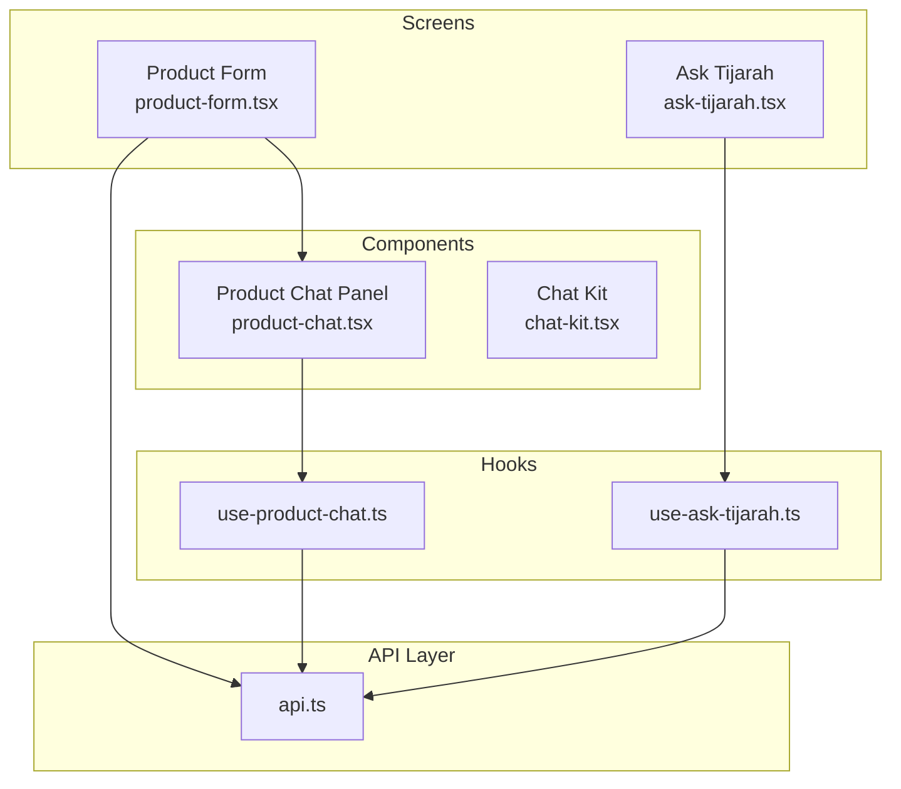
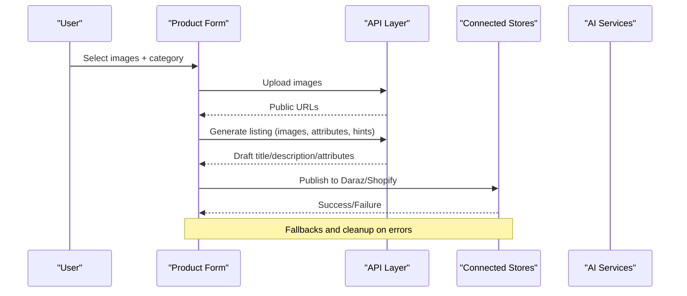
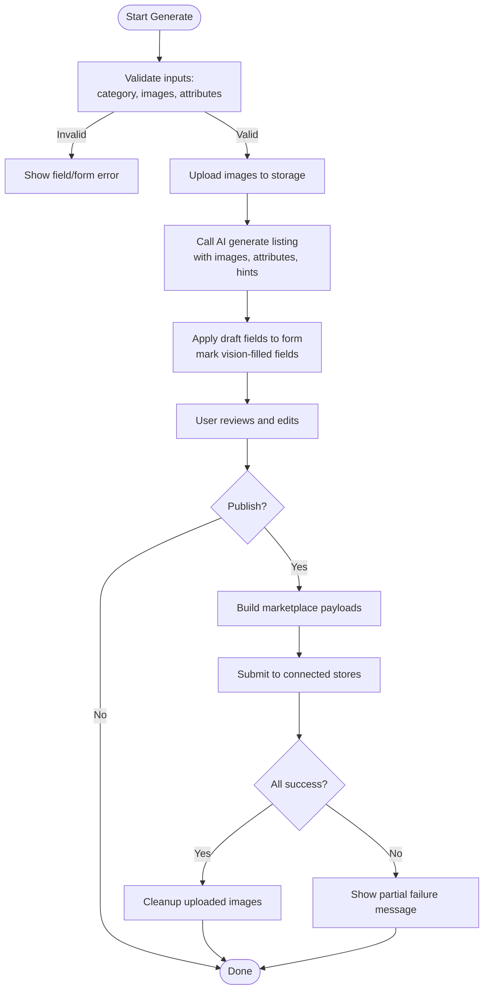
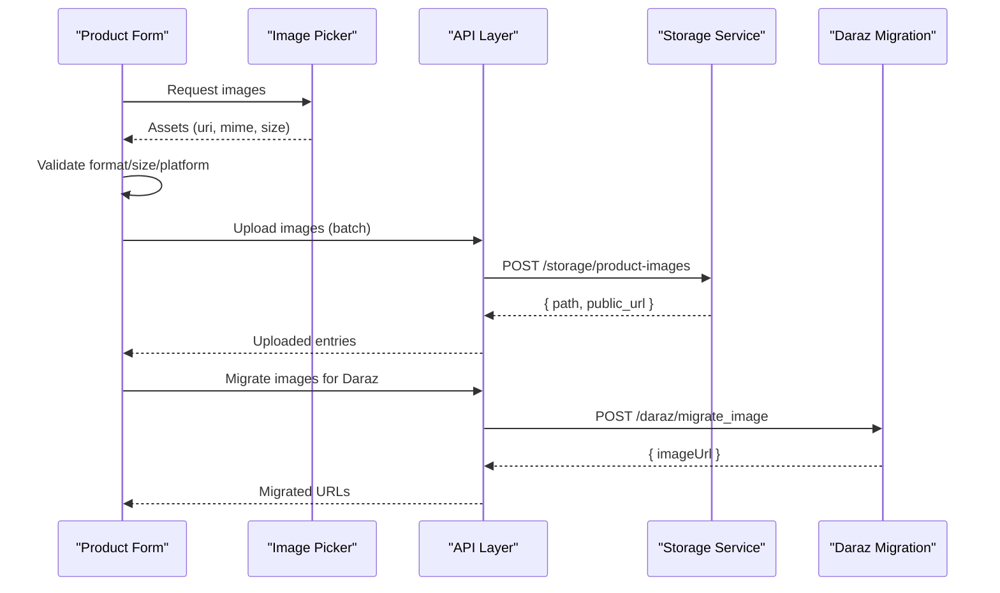
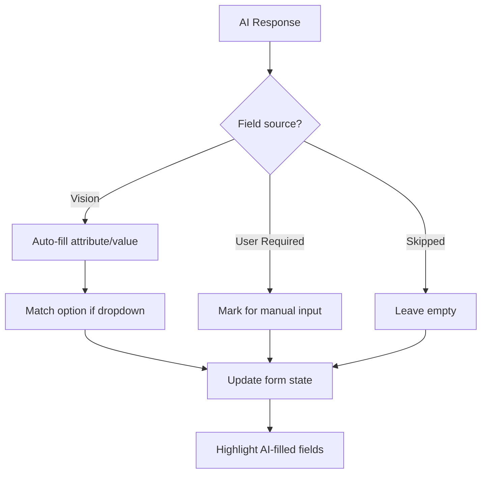
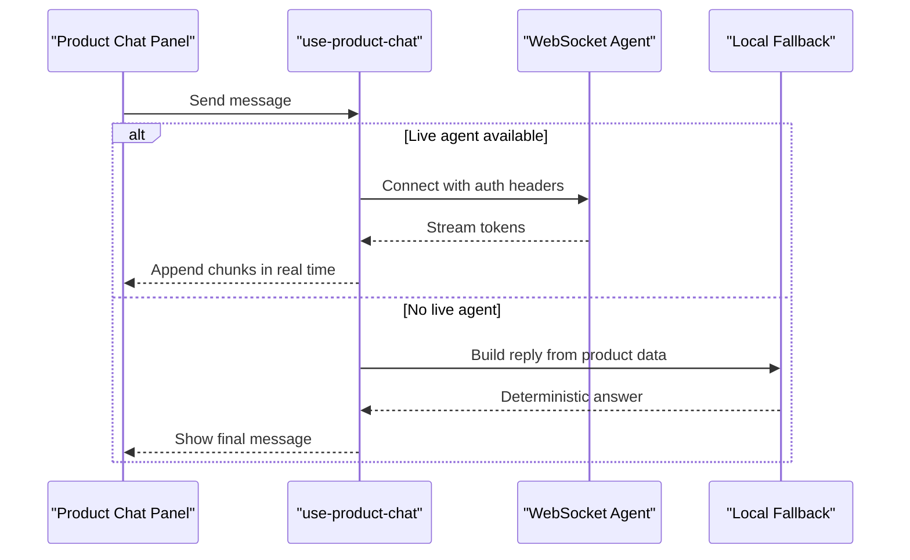
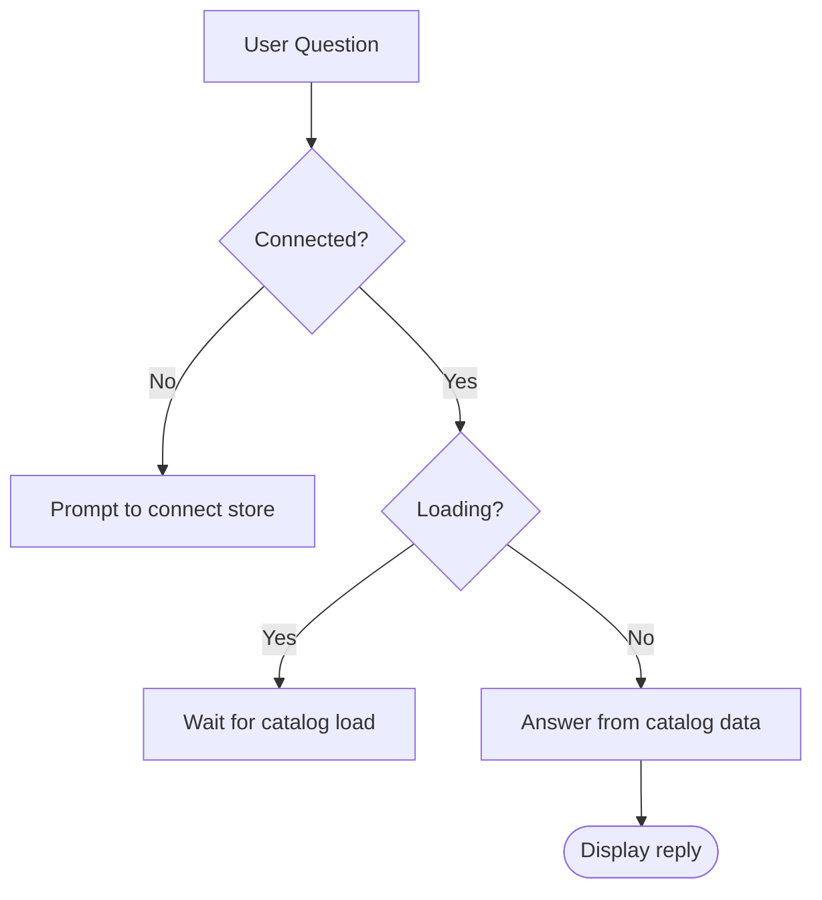
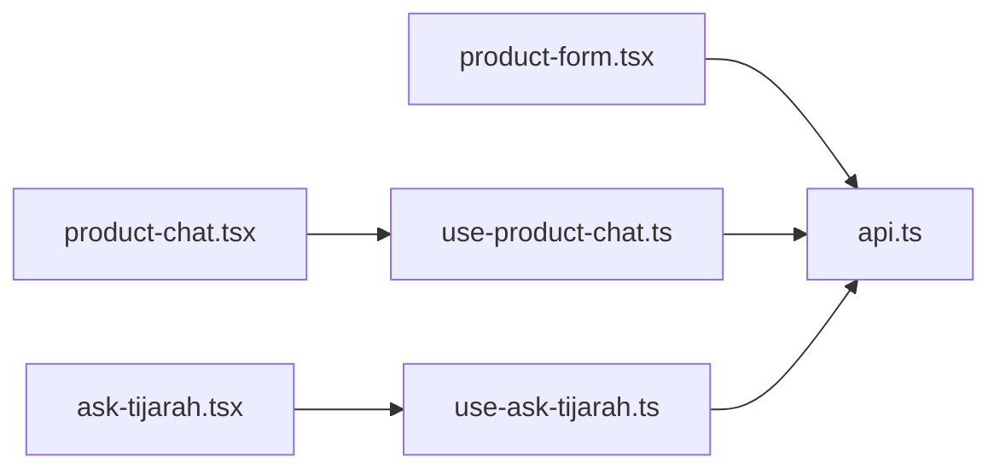

# Product Listing Generation

<cite>
**Referenced Files in This Document**
- [product-form.tsx](file://src/app/(app)/product-form.tsx)
- [api.ts](file://src/lib/api.ts)
- [product-chat.tsx](file://src/components/product-chat.tsx)
- [use-product-chat.ts](file://src/hooks/use-product-chat.ts)
- [ask-tijarah.tsx](file://src/app/(app)/(tabs)/ask-tijarah.tsx)
- [use-ask-tijarah.ts](file://src/hooks/use-ask-tijarah.ts)
- [chat-kit.tsx](file://src/components/chat-kit.tsx)
</cite>

## Table of Contents
1. Introduction
2. Project Structure
3. Core Components
4. Architecture Overview
5. Detailed Component Analysis
6. Dependency Analysis
7. Performance Considerations
8. Troubleshooting Guide
9. Conclusion
10. Appendices

## Introduction
This document explains the AI-powered product listing generation system that transforms product images into optimized marketplace listings using computer vision and natural language processing. It covers:
- How image upload, metadata extraction, and listing optimization work end-to-end
- The product chat feature for interactive AI-assisted improvements
- Integration between product forms and backend AI services
- Error handling and fallback mechanisms when AI requests fail
- Guidance on configuring AI service parameters and customizing generated content templates

## Project Structure
The application is an Expo-based React Native app with a clear separation between UI screens, reusable components, hooks for business logic, and a centralized API layer.

**Diagram sources**
- [product-form.tsx:1-120](file://src/app/(app)/product-form.tsx#L1-L120)
- [api.ts:52-77](file://src/lib/api.ts#L52-L77)
- [product-chat.tsx:53-175](file://src/components/product-chat.tsx#L53-L175)
- [use-product-chat.ts:169-319](file://src/hooks/use-product-chat.ts#L169-L319)
- [ask-tijarah.tsx:14-120](file://src/app/(app)/(tabs)/ask-tijarah.tsx#L14-L120)
- [use-ask-tijarah.ts:72-109](file://src/hooks/use-ask-tijarah.ts#L72-L109)

**Section sources**
- [product-form.tsx:1-120](file://src/app/(app)/product-form.tsx#L1-L120)
- [api.ts:52-77](file://src/lib/api.ts#L52-L77)

## Core Components
- Product form screen orchestrates image selection, category selection, attribute mapping, AI-driven listing generation, and publishing to Daraz and Shopify.
- API layer provides typed functions for uploads, migrations, AI listing generation, marketplace integrations, and streaming endpoints.
- Product chat panel enables per-product AI conversations grounded in reviews, returns, pricing, and stock data.
- Ask Tijarah tab provides store-wide catalog and stock Q&A with deterministic local responses.

Key responsibilities:
- Image validation and upload pipeline
- Category and attribute discovery for Daraz
- AI listing generation via backend service
- Publishing to connected stores (Daraz/Shopify)
- Streaming chat with live agent or deterministic fallback

**Section sources**
- [product-form.tsx:274-472](file://src/app/(app)/product-form.tsx#L274-L472)
- [api.ts:821-900](file://src/lib/api.ts#L821-L900)
- [api.ts:629-638](file://src/lib/api.ts#L629-L638)
- [product-chat.tsx:53-175](file://src/components/product-chat.tsx#L53-L175)
- [use-product-chat.ts:169-319](file://src/hooks/use-product-chat.ts#L169-L319)
- [ask-tijarah.tsx:14-120](file://src/app/(app)/(tabs)/ask-tijarah.tsx#L14-L120)
- [use-ask-tijarah.ts:72-109](file://src/hooks/use-ask-tijarah.ts#L72-L109)

## Architecture Overview
The system follows a layered architecture:
- UI screens handle user interactions and state
- Hooks encapsulate business logic and streaming protocols
- API layer abstracts HTTP/SSE/WebSocket calls and normalizes responses
- Backend services perform computer vision/NLP to generate listings and power chat agents

**Diagram sources**
- [product-form.tsx:409-472](file://src/app/(app)/product-form.tsx#L409-L472)
- [api.ts:821-900](file://src/lib/api.ts#L821-L900)
- [api.ts:629-638](file://src/lib/api.ts#L629-L638)
- [api.ts:1101-1107](file://src/lib/api.ts#L1101-L1107)

## Detailed Component Analysis

### AI-Powered Listing Generation Flow
The product form drives the AI listing generation workflow:
- Validates and prepares images (format, size, platform constraints)
- Fetches Daraz categories and required attributes
- Calls the AI endpoint with image URLs, category, attributes, and optional hints
- Applies generated fields to the form, marking which were filled by vision
- Supports publishing to one or both marketplaces

**Diagram sources**
- [product-form.tsx:274-323](file://src/app/(app)/product-form.tsx#L274-L323)
- [product-form.tsx:409-472](file://src/app/(app)/product-form.tsx#L409-L472)
- [api.ts:821-900](file://src/lib/api.ts#L821-L900)
- [api.ts:629-638](file://src/lib/api.ts#L629-L638)
- [api.ts:1101-1107](file://src/lib/api.ts#L1101-L1107)

**Section sources**
- [product-form.tsx:274-323](file://src/app/(app)/product-form.tsx#L274-L323)
- [product-form.tsx:409-472](file://src/app/(app)/product-form.tsx#L409-L472)
- [api.ts:821-900](file://src/lib/api.ts#L821-L900)
- [api.ts:629-638](file://src/lib/api.ts#L629-L638)

### Image Upload Processing and Metadata Extraction
- Image picker enforces permissions and limits (up to 8 images)
- Validation checks MIME type, file size, and platform-specific rules (e.g., Daraz JPEG/PNG under 1 MB)
- Uploads are batched with progress callbacks; failures are captured and cleaned up
- For Daraz, images are migrated to a marketplace-compatible URL before publishing

**Diagram sources**
- [product-form.tsx:274-323](file://src/app/(app)/product-form.tsx#L274-L323)
- [api.ts:821-900](file://src/lib/api.ts#L821-L900)
- [api.ts:915-952](file://src/lib/api.ts#L915-L952)

**Section sources**
- [product-form.tsx:274-323](file://src/app/(app)/product-form.tsx#L274-L323)
- [api.ts:821-900](file://src/lib/api.ts#L821-L900)
- [api.ts:915-952](file://src/lib/api.ts#L915-L952)

### Listing Optimization Algorithms and Field Mapping
- The AI response includes a draft with title, description, attributes, and SKU details
- Fields marked as “vision” are auto-filled from image analysis; others may require user input
- Attribute options are matched case-insensitively to ensure valid values
- Brand hint can be provided to improve generated content

**Diagram sources**
- [product-form.tsx:433-464](file://src/app/(app)/product-form.tsx#L433-L464)
- [api.ts:585-638](file://src/lib/api.ts#L585-L638)

**Section sources**
- [product-form.tsx:433-464](file://src/app/(app)/product-form.tsx#L433-L464)
- [api.ts:585-638](file://src/lib/api.ts#L585-L638)

### Product Chat Functionality
- Per-product chat panel shows context (thumbnail, title, price) and streams assistant replies
- Uses WebSocket to connect to a live agent when available; otherwise falls back to deterministic local responder
- Suggested prompts adapt based on review analysis and returns insights
- Messages are streamed token-by-token for real-time UX

**Diagram sources**
- [product-chat.tsx:53-175](file://src/components/product-chat.tsx#L53-L175)
- [use-product-chat.ts:169-319](file://src/hooks/use-product-chat.ts#L169-L319)

**Section sources**
- [product-chat.tsx:53-175](file://src/components/product-chat.tsx#L53-L175)
- [use-product-chat.ts:169-319](file://src/hooks/use-product-chat.ts#L169-L319)

### Store-Wide Chat (Ask Tijarah)
- Provides catalog and stock Q&A grounded in connected products
- Uses deterministic local logic to answer questions about counts, average prices, low/out-of-stock items
- Displays suggested prompt groups to guide users

**Diagram sources**
- [use-ask-tijarah.ts:31-70](file://src/hooks/use-ask-tijarah.ts#L31-L70)
- [ask-tijarah.tsx:14-120](file://src/app/(app)/(tabs)/ask-tijarah.tsx#L14-L120)

**Section sources**
- [use-ask-tijarah.ts:31-70](file://src/hooks/use-ask-tijarah.ts#L31-L70)
- [ask-tijarah.tsx:14-120](file://src/app/(app)/(tabs)/ask-tijarah.tsx#L14-L120)

## Dependency Analysis
- Product form depends on API functions for uploads, migrations, AI generation, and publishing
- Product chat depends on WebSocket integration and local fallback logic
- API layer centralizes error extraction, SSE parsing, and normalization across platforms

**Diagram sources**
- [product-form.tsx:1-120](file://src/app/(app)/product-form.tsx#L1-L120)
- [api.ts:52-77](file://src/lib/api.ts#L52-L77)
- [product-chat.tsx:53-175](file://src/components/product-chat.tsx#L53-L175)
- [use-product-chat.ts:169-319](file://src/hooks/use-product-chat.ts#L169-L319)
- [ask-tijarah.tsx:14-120](file://src/app/(app)/(tabs)/ask-tijarah.tsx#L14-L120)
- [use-ask-tijarah.ts:72-109](file://src/hooks/use-ask-tijarah.ts#L72-L109)

**Section sources**
- [product-form.tsx:1-120](file://src/app/(app)/product-form.tsx#L1-L120)
- [api.ts:52-77](file://src/lib/api.ts#L52-L77)

## Performance Considerations
- Batch image uploads with progress callbacks to keep users informed
- Reuse prepared images within a session to avoid redundant uploads
- Stream chat responses token-by-token for perceived responsiveness
- Normalize and deduplicate category/attribute lists to reduce UI churn
- Clean up temporary images after successful publish to free storage

[No sources needed since this section provides general guidance]

## Troubleshooting Guide
Common issues and resolutions:
- Image upload fails: Check MIME type, file size limits, and platform-specific constraints; clean up any partially uploaded files
- AI generation blocked: Ensure a Daraz category is selected, attributes loaded, and images present; address missing mandatory attributes
- Publishing fails: Verify connections are active, required attributes complete, and prices/inventory valid; inspect partial failure messages
- Chat connection lost: If WebSocket closes unexpectedly, a friendly message is shown; retry sending the question

Error handling patterns:
- Centralized error extraction from JSON bodies and nested structures
- SSE error events converted to user-friendly messages
- Unsupported backend capabilities surfaced with explicit errors

**Section sources**
- [api.ts:15-51](file://src/lib/api.ts#L15-L51)
- [api.ts:206-213](file://src/lib/api.ts#L206-L213)
- [api.ts:258-286](file://src/lib/api.ts#L258-L286)
- [product-form.tsx:466-472](file://src/app/(app)/product-form.tsx#L466-L472)
- [use-product-chat.ts:261-277](file://src/hooks/use-product-chat.ts#L261-L277)

## Conclusion
The system integrates image processing, AI-driven listing generation, and marketplace publishing into a cohesive workflow. Users can start from images, receive optimized drafts, and publish directly to connected stores. The product chat offers interactive assistance grounded in real product data, with robust fallbacks ensuring reliability.

[No sources needed since this section summarizes without analyzing specific files]

## Appendices

### Configuration and Customization Guidance
- AI service parameters: Provide primary category ID, image URLs, attribute definitions, and optional hints (title, brand) to tailor generated content
- Content templates: Adjust how generated fields map to marketplace attributes; use option matching for dropdowns and enforce mandatory fields before publishing
- Marketplace settings: Ensure correct platform selection (Daraz/Shopify), validate image constraints per marketplace, and configure inventory/pricing appropriately

[No sources needed since this section provides general guidance]