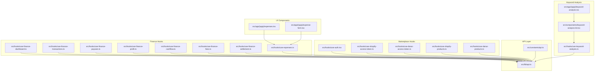
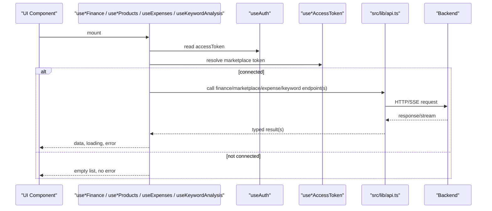
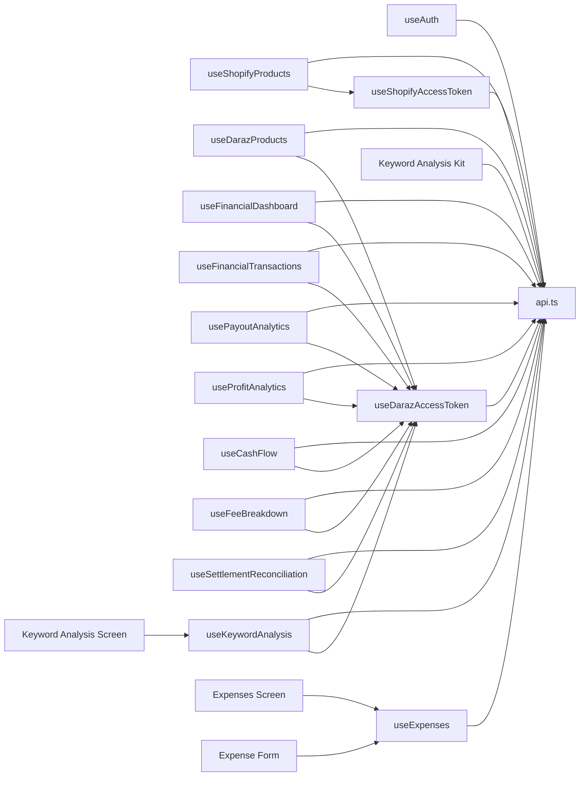
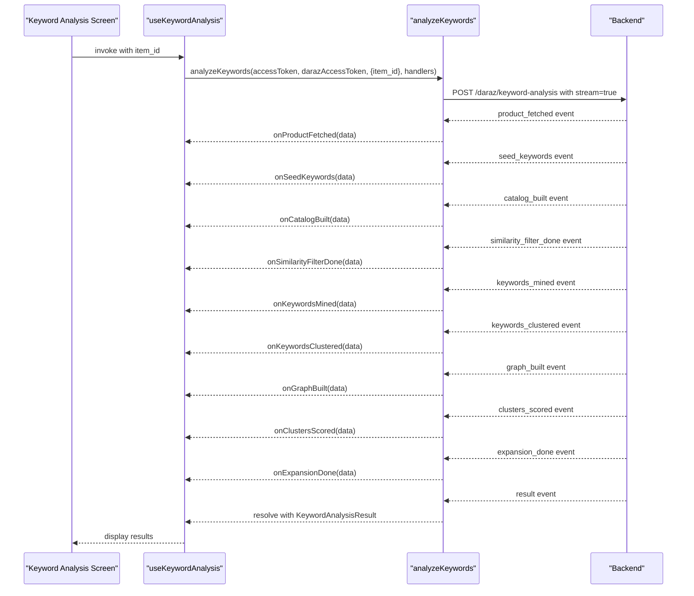
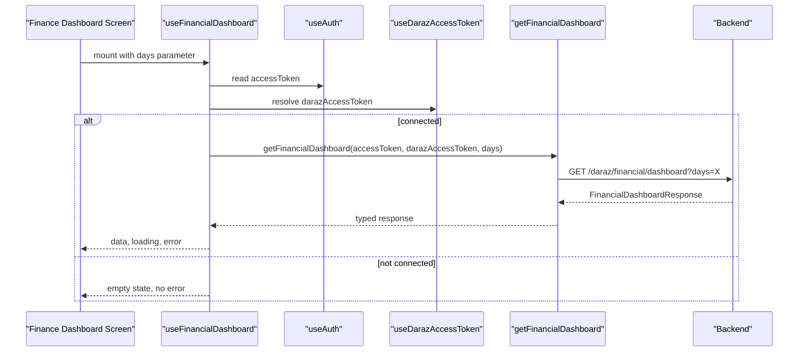
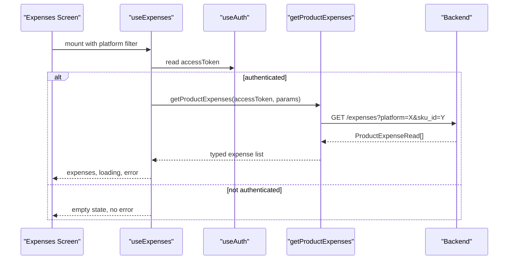

# API Integration

<cite>
**Referenced Files in This Document**
- [api.ts](file://src/lib/api.ts)
- [api.ts](file://src/constants/api.ts)
- [use-shopify-products.ts](file://src/hooks/use-shopify-products.ts)
- [use-daraz-products.ts](file://src/hooks/use-daraz-products.ts)
- [use-shopify-access-token.ts](file://src/hooks/use-shopify-access-token.ts)
- [use-daraz-access-token.ts](file://src/hooks/use-daraz-access-token.ts)
- [use-auth.tsx](file://src/hooks/use-auth.tsx)
- [use-finance-dashboard.ts](file://src/hooks/use-finance-dashboard.ts)
- [use-finance-transactions.ts](file://src/hooks/use-finance-transactions.ts)
- [use-finance-payouts.ts](file://src/hooks/use-finance-payouts.ts)
- [use-finance-profit.ts](file://src/hooks/use-finance-profit.ts)
- [use-finance-cashflow.ts](file://src/hooks/use-finance-cashflow.ts)
- [use-finance-fees.ts](file://src/hooks/use-finance-fees.ts)
- [use-finance-settlement.ts](file://src/hooks/use-finance-settlement.ts)
- [use-expenses.ts](file://src/hooks/use-expenses.ts)
- [use-keyword-analysis.ts](file://src/hooks/use-keyword-analysis.ts)
- [keyword-analysis-kit.tsx](file://src/components/keyword-analysis-kit.tsx)
- [keyword-analysis.tsx](file://src/app/(app)/keyword-analysis.tsx)
- [expenses.tsx](file://src/app/(app)/expenses.tsx)
- [expense-form.tsx](file://src/app/(app)/expense-form.tsx)
</cite>

## Update Summary
**Changes Made**
- Added comprehensive finance data retrieval functions with over 230 new lines of code
- Enhanced error handling for FastAPI responses with improved detail extraction
- Added specialized endpoints for dashboard, transactions, payouts, and settlement data
- Implemented SSE streaming support for real-time financial updates
- Created dedicated hooks for each finance module (dashboard, transactions, payouts, profit, cashflow, fees, settlement)
- **Added expense management system with full CRUD operations for product expenses**
- **Added comprehensive keyword analysis workflow with real-time SSE streaming and progress tracking**
- Updated architecture to support both marketplace integrations and finance data access

## Table of Contents
1. [Introduction](#introduction)
2. [Project Structure](#project-structure)
3. [Core Components](#core-components)
4. [Architecture Overview](#architecture-overview)
5. [Detailed Component Analysis](#detailed-component-analysis)
6. [Finance Data Layer](#finance-data-layer)
7. [Expense Management System](#expense-management-system)
8. [Keyword Analysis Workflow](#keyword-analysis-workflow)
9. [Dependency Analysis](#dependency-analysis)
10. [Performance Considerations](#performance-considerations)
11. [Troubleshooting Guide](#troubleshooting-guide)
12. [Conclusion](#conclusion)
13. [Appendices](#appendices)

## Introduction
This document explains the enhanced API integration patterns used in the application, focusing on the centralized API client with comprehensive finance data retrieval capabilities, authentication and headers, marketplace-specific hooks for Shopify and Daraz, real-time updates via Server-Sent Events (SSE), error handling strategies, and guidance for adding new endpoints and maintaining backward compatibility. The system now includes a complete expense management solution for tracking product costs across different marketplaces and a sophisticated keyword analysis workflow that provides real-time insights into competitive positioning.

## Project Structure
The API layer is now a comprehensive module that provides typed functions for HTTP requests, SSE streaming, marketplace integrations, extensive finance data operations, expense management, and keyword analysis workflows. Hooks encapsulate platform-specific flows (Shopify, Daraz) and finance modules, composing them with authentication state to fetch products, manage connections, retrieve financial analytics, handle expense operations, and perform keyword analysis with real-time progress updates.

**Diagram sources**
- [api.ts:1-800](file://src/lib/api.ts#L1-L800)
- [api.ts:2122-2231](file://src/lib/api.ts#L2122-L2231)
- [use-auth.tsx:1-91](file://src/hooks/use-auth.tsx#L1-L91)
- [use-shopify-access-token.ts:1-31](file://src/hooks/use-shopify-access-token.ts#L1-L31)
- [use-daraz-access-token.ts:1-66](file://src/hooks/use-daraz-access-token.ts#L1-L66)
- [use-shopify-products.ts:1-50](file://src/hooks/use-shopify-products.ts#L1-L50)
- [use-daraz-products.ts:1-184](file://src/hooks/use-daraz-products.ts#L1-L184)
- [use-finance-dashboard.ts:1-76](file://src/hooks/use-finance-dashboard.ts#L1-L76)
- [use-finance-transactions.ts:1-86](file://src/hooks/use-finance-transactions.ts#L1-L86)
- [use-finance-payouts.ts:1-78](file://src/hooks/use-finance-payouts.ts#L1-L78)
- [use-finance-profit.ts:1-78](file://src/hooks/use-finance-profit.ts#L1-L78)
- [use-finance-cashflow.ts:1-70](file://src/hooks/use-finance-cashflow.ts#L1-L70)
- [use-finance-fees.ts:1-78](file://src/hooks/use-finance-fees.ts#L1-L78)
- [use-finance-settlement.ts:1-74](file://src/hooks/use-finance-settlement.ts#L1-L74)
- [use-expenses.ts:1-100](file://src/hooks/use-expenses.ts#L1-L100)
- [use-keyword-analysis.ts:1-183](file://src/hooks/use-keyword-analysis.ts#L1-L183)
- [keyword-analysis-kit.tsx:1-512](file://src/components/keyword-analysis-kit.tsx#L1-L512)
- [keyword-analysis.tsx:1-307](file://src/app/(app)/keyword-analysis.tsx#L1-L307)
- [expenses.tsx:1-293](file://src/app/(app)/expenses.tsx#L1-L293)
- [expense-form.tsx:1-574](file://src/app/(app)/expense-form.tsx#L1-L574)

**Section sources**
- [api.ts:1-800](file://src/lib/api.ts#L1-L800)
- [api.ts:2122-2231](file://src/lib/api.ts#L2122-L2231)
- [use-auth.tsx:1-91](file://src/hooks/use-auth.tsx#L1-L91)
- [use-shopify-access-token.ts:1-31](file://src/hooks/use-shopify-access-token.ts#L1-L31)
- [use-daraz-access-token.ts:1-66](file://src/hooks/use-daraz-access-token.ts#L1-L66)
- [use-shopify-products.ts:1-50](file://src/hooks/use-shopify-products.ts#L1-L50)
- [use-daraz-products.ts:1-184](file://src/hooks/use-daraz-products.ts#L1-L184)
- [use-finance-dashboard.ts:1-76](file://src/hooks/use-finance-dashboard.ts#L1-L76)
- [use-finance-transactions.ts:1-86](file://src/hooks/use-finance-transactions.ts#L1-L86)
- [use-finance-payouts.ts:1-78](file://src/hooks/use-finance-payouts.ts#L1-L78)
- [use-finance-profit.ts:1-78](file://src/hooks/use-finance-profit.ts#L1-L78)
- [use-finance-cashflow.ts:1-70](file://src/hooks/use-finance-cashflow.ts#L1-L70)
- [use-finance-fees.ts:1-78](file://src/hooks/use-finance-fees.ts#L1-L78)
- [use-finance-settlement.ts:1-74](file://src/hooks/use-finance-settlement.ts#L1-L74)
- [use-expenses.ts:1-100](file://src/hooks/use-expenses.ts#L1-L100)
- [use-keyword-analysis.ts:1-183](file://src/hooks/use-keyword-analysis.ts#L1-L183)
- [keyword-analysis-kit.tsx:1-512](file://src/components/keyword-analysis-kit.tsx#L1-L512)
- [keyword-analysis.tsx:1-307](file://src/app/(app)/keyword-analysis.tsx#L1-L307)
- [expenses.tsx:1-293](file://src/app/(app)/expenses.tsx#L1-L293)
- [expense-form.tsx:1-574](file://src/app/(app)/expense-form.tsx#L1-L574)

## Core Components
- Centralized HTTP client with unified error handling and JSON parsing.
- SSE streaming support for both web and React Native environments.
- Marketplace adapters for Shopify and Daraz with typed request/response models.
- Finance data layer with comprehensive endpoints for dashboard, transactions, payouts, profit analysis, cash flow, fee breakdown, and settlement reconciliation.
- **Expense management system with full CRUD operations for product expenses.**
- **Keyword analysis workflow with real-time SSE streaming and comprehensive progress tracking.**
- Authentication context providing bearer tokens for protected endpoints.
- Constants for base URL configuration across platforms.

Key responsibilities:
- Normalize and parse responses from different marketplaces into a consistent Product model.
- Manage connection tokens for each marketplace.
- Provide typed helpers for creating, updating, deleting, and publishing products.
- Stream long-running operations (e.g., returns insights, review analysis, keyword analysis) with progress events.
- Retrieve comprehensive financial analytics and reconciliation data.
- **Manage product expenses with filtering by platform and SKU, including optimistic UI updates.**
- **Execute keyword analysis pipelines with real-time progress updates and detailed competitive insights.**

**Section sources**
- [api.ts:53-77](file://src/lib/api.ts#L53-L77)
- [api.ts:79-286](file://src/lib/api.ts#L79-L286)
- [api.ts:2122-2231](file://src/lib/api.ts#L2122-L2231)
- [use-auth.tsx:27-79](file://src/hooks/use-auth.tsx#L27-L79)
- [api.ts:10-16](file://src/constants/api.ts#L10-L16)

## Architecture Overview
The architecture separates concerns into three layers:
- API client: low-level HTTP and SSE primitives with enhanced finance data support, expense management, and keyword analysis capabilities.
- Hooks: stateful composition of auth, marketplace connections, finance modules, expense operations, keyword analysis workflows, and data fetching.
- UI: consumes hooks to render product lists, financial dashboards, expense management screens, keyword analysis results, and actions.

**Diagram sources**
- [use-shopify-products.ts:27-49](file://src/hooks/use-shopify-products.ts#L27-L49)
- [use-daraz-products.ts:120-183](file://src/hooks/use-daraz-products.ts#L120-L183)
- [use-finance-dashboard.ts:33-72](file://src/hooks/use-finance-dashboard.ts#L33-L72)
- [use-finance-transactions.ts:42-82](file://src/hooks/use-finance-transactions.ts#L42-L82)
- [use-expenses.ts:40-65](file://src/hooks/use-expenses.ts#L40-L65)
- [use-keyword-analysis.ts:112-166](file://src/hooks/use-keyword-analysis.ts#L112-L166)
- [use-auth.tsx:31-79](file://src/hooks/use-auth.tsx#L31-L79)
- [use-shopify-access-token.ts:14-29](file://src/hooks/use-shopify-access-token.ts#L14-L29)
- [use-daraz-access-token.ts:29-64](file://src/hooks/use-daraz-access-token.ts#L29-L64)
- [api.ts:53-77](file://src/lib/api.ts#L53-L77)
- [api.ts:215-286](file://src/lib/api.ts#L215-L286)

## Detailed Component Analysis

### Centralized API Client (src/lib/api.ts)
- HTTP request wrapper:
  - Builds URLs using the base URL constant.
  - Parses JSON only when content-type indicates JSON.
  - Throws a typed ApiError with status and human-readable message extracted from backend error bodies.
- Enhanced error extraction:
  - Handles FastAPI-style detail strings, validation arrays, and nested structures including marketplace-specific details.
  - Improved handling of `daraz_details` arrays with field-specific error messages.
- SSE streaming:
  - Web path reads ReadableStream chunks and parses frames separated by blank lines.
  - React Native path uses XMLHttpRequest onprogress to incrementally parse frames.
  - Normalizes event names (defaults to "message") and joins multiple data lines before JSON parsing.
- Streaming result helper:
  - Wraps SSE streams to resolve on "complete", reject on "error", or if stream ends without either.
  - Exposes an onEvent callback for intermediate progress events.

Authentication headers:
- All protected endpoints include Authorization: Bearer <token>.
- Marketplace-specific headers:
  - x-daraz-access-token for Daraz endpoints.
  - x-shopify-access-token for Shopify endpoints.

Enhanced endpoints covered include:
- Authentication: signup, login, get current user.
- Marketplace management: supported marketplaces, connections, OAuth authorize URLs.
- Products: local CRUD, Shopify and Daraz product retrieval, categories, collections, orders.
- Publishing: publish to connected stores.
- Storage: upload/cleanup images, migrate image sources.
- Analytics/insights: returns insights and review analysis via SSE.
- **Finance data**: dashboard, transactions, payouts, profit analysis, cash flow, fee breakdown, settlement reconciliation.
- **Expense management**: CRUD operations for product expenses with filtering capabilities.
- **Keyword analysis**: comprehensive SEO analysis with real-time SSE streaming and progress tracking.

Complexity notes:
- Response normalization functions handle varying field names and nesting to ensure stable types for callers.
- Deduplication utilities prevent duplicate products when sources return overlapping IDs.
- **Finance data normalization** handles complex financial structures with proper type safety.
- **Expense operations include query parameter building for platform and SKU filtering.**
- **Keyword analysis streaming supports multiple pipeline stages with detailed progress events.**

**Section sources**
- [api.ts:5-13](file://src/lib/api.ts#L5-L13)
- [api.ts:15-51](file://src/lib/api.ts#L15-L51)
- [api.ts:53-77](file://src/lib/api.ts#L53-L77)
- [api.ts:79-137](file://src/lib/api.ts#L79-L137)
- [api.ts:144-204](file://src/lib/api.ts#L144-L204)
- [api.ts:206-286](file://src/lib/api.ts#L206-L286)
- [api.ts:317-436](file://src/lib/api.ts#L317-L436)
- [api.ts:448-459](file://src/lib/api.ts#L448-L459)
- [api.ts:468-505](file://src/lib/api.ts#L468-L505)
- [api.ts:629-638](file://src/lib/api.ts#L629-L638)
- [api.ts:722-784](file://src/lib/api.ts#L722-L784)
- [api.ts:821-908](file://src/lib/api.ts#L821-908)
- [api.ts:915-1006](file://src/lib/api.ts#L915-L1006)
- [api.ts:1072-1107](file://src/lib/api.ts#L1072-L1107)
- [api.ts:1109-1153](file://src/lib/api.ts#L1109-L1153)
- [api.ts:1196-1207](file://src/lib/api.ts#L1196-L1207)
- [api.ts:1257-1281](file://src/lib/api.ts#L1257-L1281)
- [api.ts:1342-1364](file://src/lib/api.ts#L1342-L1364)
- [api.ts:1556-1582](file://src/lib/api.ts#L1556-L1582)
- [api.ts:1700-1912](file://src/lib/api.ts#L1700-L1912)
- [api.ts:2122-2231](file://src/lib/api.ts#L2122-L2231)

### API Constants and Base URL (src/constants/api.ts)
- Base URL selection:
  - Uses environment variable when available.
  - Defaults to a LAN IP suitable for Android emulator and iOS simulator; adjust for physical devices.
- Logging for debugging network configuration.

Best practices:
- Override EXPO_PUBLIC_API_URL for production or remote backends.
- Ensure trailing slash removal to avoid double slashes in URLs.

**Section sources**
- [api.ts:10-16](file://src/constants/api.ts#L10-L16)

### Authentication Flow (src/hooks/use-auth.tsx)
- Persists access token securely and hydrates session on app start.
- Provides sign-up, sign-in, and sign-out methods that update persisted token and session.
- Supplies accessToken to all downstream hooks and API calls.

Error handling:
- Invalid/expired tokens are cleared automatically.
- Errors during hydration do not crash the app; they reset to unauthenticated state.

**Section sources**
- [use-auth.tsx:13-29](file://src/hooks/use-auth.tsx#L13-L29)
- [use-auth.tsx:31-79](file://src/hooks/use-auth.tsx#L31-L79)
- [use-auth.tsx:84-91](file://src/hooks/use-auth.tsx#L84-L91)

### Marketplace Access Token Resolution
- Shopify:
  - Fetches marketplace connections and finds the Shopify connection with an encrypted access token.
  - Exposes isConnected flag based on presence of token.
- Daraz:
  - Similar logic for Daraz connection token.
  - Exposes isConnected, isLoading, and error states for consumers.

These hooks centralize connection discovery so product hooks can focus on data mapping and presentation.

**Section sources**
- [use-shopify-access-token.ts:1-31](file://src/hooks/use-shopify-access-token.ts#L1-L31)
- [use-daraz-access-token.ts:1-66](file://src/hooks/use-daraz-access-token.ts#L1-L66)

### Shopify Products Hook (src/hooks/use-shopify-products.ts)
- Maps raw Shopify product payloads to the shared Product type.
- Fetches products when authenticated and connected.
- De-duplicates products by ID and manages loading/error states.
- Supports refetching by toggling a reload key and refreshing connection state.

Data mapping highlights:
- Aggregates images from variants and featured image.
- Derives price from first variant.
- Sets category from product type or category name.

**Section sources**
- [use-shopify-products.ts:7-25](file://src/hooks/use-shopify-products.ts#L7-L25)
- [use-shopify-products.ts:27-49](file://src/hooks/use-shopify-products.ts#L27-L49)

### Daraz Products Hook (src/hooks/use-daraz-products.ts)
- Extracts product arrays from varied response shapes returned by the backend.
- Maps Daraz items to the shared Product type, preferring English attributes when available.
- Computes stock quantity by summing SKU quantities.
- Manages connection resolution and product fetching lifecycle.

Robustness:
- Gracefully handles missing fields and inconsistent casing in marketplace responses.
- De-duplicates products after mapping.

**Section sources**
- [use-daraz-products.ts:19-96](file://src/hooks/use-daraz-products.ts#L19-L96)
- [use-daraz-products.ts:98-113](file://src/hooks/use-daraz-products.ts#L98-L113)
- [use-daraz-products.ts:120-183](file://src/hooks/use-daraz-products.ts#L120-L183)

### Real-Time Features Using SSE
- Returns insights and review analysis endpoints stream progress events and a final result.
- Keyword analysis endpoint streams comprehensive pipeline progress with detailed stage information.
- The streaming helper normalizes events and resolves/rejects promises consistently.
- Callers receive incremental updates (e.g., stages, counts, clusters) before completion.

Platform considerations:
- On web, uses ReadableStream for efficient streaming.
- On React Native, falls back to XMLHttpRequest onprogress to emulate streaming.

Usage pattern:
- Provide handlers for named events (progress, score, cluster).
- Handle complete or error outcomes uniformly.

**Section sources**
- [api.ts:79-137](file://src/lib/api.ts#L79-L137)
- [api.ts:144-204](file://src/lib/api.ts#L144-L204)
- [api.ts:215-286](file://src/lib/api.ts#L215-L286)
- [api.ts:1257-1281](file://src/lib/api.ts#L1257-L1281)
- [api.ts:1342-1364](file://src/lib/api.ts#L1342-L1364)
- [api.ts:2197-2231](file://src/lib/api.ts#L2197-L2231)

### Adding New API Endpoints
Steps to add a new endpoint:
1. Define TypeScript types for request and response in api.ts.
2. Implement a function that calls the request helper with appropriate method, headers, and body.
3. If the endpoint requires marketplace tokens, include the relevant header (e.g., x-daraz-access-token or x-shopify-access-token).
4. For long-running tasks, expose an SSE-based function using streamToResult and define progress event types.
5. Create a hook to encapsulate state, loading, errors, and refetch behavior.
6. Map backend responses to shared types where necessary to maintain consistency.

Example patterns:
- Simple GET/POST: see product CRUD and marketplace listing functions.
- SSE streaming: see returns insights, review analysis, and keyword analysis functions.
- **Finance endpoints**: see dashboard, transactions, payouts, profit, cashflow, fees, and settlement functions.
- **Expense endpoints**: see CRUD operations with query parameter filtering.

**Section sources**
- [api.ts:1109-1153](file://src/lib/api.ts#L1109-L1153)
- [api.ts:1257-1281](file://src/lib/api.ts#L1257-L1281)
- [api.ts:1342-1364](file://src/lib/api.ts#L1342-L1364)
- [api.ts:1700-1912](file://src/lib/api.ts#L1700-L1912)
- [api.ts:2197-2231](file://src/lib/api.ts#L2197-L2231)

### Handling Different Response Formats
- Many marketplace responses vary in structure; normalization functions extract arrays and fields robustly.
- Examples include extracting product arrays from nested objects and normalizing catalog search results.
- Deduplication ensures stable lists even when sources overlap.

**Section sources**
- [use-daraz-products.ts:98-113](file://src/hooks/use-daraz-products.ts#L98-L113)
- [api.ts:1526-1554](file://src/lib/api.ts#L1526-L1554)
- [api.ts:496-505](file://src/lib/api.ts#L496-L505)

### Error Handling Strategies
- Network failures throw ApiError with status 0 and a user-friendly message.
- Non-OK responses parse error bodies to extract detailed messages.
- SSE streams convert server-side errors into rejections with normalized messages.
- Hooks catch ApiError instances and surface readable messages to the UI.

Retry logic:
- No built-in retry is implemented in the client.
- Recommended approach: wrap calls in hooks with exponential backoff and jitter, and debounce rapid retries.

Offline support:
- No offline caching is implemented in the API client.
- Recommended approach: cache successful responses locally and serve stale data while refetching when online.

**Section sources**
- [api.ts:53-77](file://src/lib/api.ts#L53-L77)
- [api.ts:206-286](file://src/lib/api.ts#L206-L286)
- [use-shopify-products.ts:36-49](file://src/hooks/use-shopify-products.ts#L36-L49)
- [use-daraz-products.ts:139-183](file://src/hooks/use-daraz-products.ts#L139-L183)

### API Versioning and Backward Compatibility
- Maintain backward compatibility by:
  - Keeping response normalization flexible to accept multiple field names and nesting levels.
  - Avoiding breaking changes to shared types like Product.
  - Using optional fields and defaults in mapped outputs.
- When introducing new endpoints:
  - Add new routes rather than modifying existing ones.
  - Provide deprecation timelines for legacy endpoints.
  - Keep versioned query parameters or route prefixes if needed.

**Section sources**
- [api.ts:651-726](file://src/lib/api.ts#L651-L726)
- [api.ts:743-784](file://src/lib/api.ts#L743-L784)
- [api.ts:1526-1554](file://src/lib/api.ts#L1526-L1554)

## Finance Data Layer
The enhanced API layer now includes comprehensive finance data retrieval capabilities with specialized endpoints for different financial aspects:

### Financial Dashboard
- Provides overall financial overview including revenue, payouts, fees, and profit metrics.
- Returns aggregated data with recent payouts and cash flow trends.
- Supports configurable time periods through the days parameter.

### Transactions Management
- Retrieves detailed transaction records with pagination support.
- Filters transactions by date range with customizable page sizes.
- Returns structured transaction data including order information, fees, and payment details.

### Payout Analytics
- Tracks payout statements with status categorization (paid, upcoming, pending, failed).
- Provides amount summaries for different payout statuses.
- Enables filtering by date ranges for historical analysis.

### Profit Analysis
- Calculates net profit and profit margins over specified periods.
- Includes total revenue, costs, and order count metrics.
- Supports date-range filtering for trend analysis.

### Cash Flow Tracking
- Monitors daily inflows, outflows, and net cash positions.
- Configurable time periods for cash flow analysis.
- Returns chronological cash flow entries for visualization.

### Fee Breakdown
- Detailed breakdown of all fees including commissions, payment fees, shipping, penalties, and discounts.
- Calculates effective fee rates and net payout amounts.
- Provides comprehensive fee analysis for cost optimization.

### Settlement Reconciliation
- Reconciles payout amounts with calculated values from individual orders.
- Identifies discrepancies between expected and actual payouts.
- Returns detailed order-level breakdown for audit purposes.

All finance endpoints use a consistent header pattern with both Bearer authentication and Daraz access tokens for secure financial data access.

**Section sources**
- [api.ts:1700-1817](file://src/lib/api.ts#L1700-L1817)
- [use-finance-dashboard.ts:1-76](file://src/hooks/use-finance-dashboard.ts#L1-L76)
- [use-finance-transactions.ts:1-86](file://src/hooks/use-finance-transactions.ts#L1-L86)
- [use-finance-payouts.ts:1-78](file://src/hooks/use-finance-payouts.ts#L1-L78)
- [use-finance-profit.ts:1-78](file://src/hooks/use-finance-profit.ts#L1-L78)
- [use-finance-cashflow.ts:1-70](file://src/hooks/use-finance-cashflow.ts#L1-L70)
- [use-finance-fees.ts:1-78](file://src/hooks/use-finance-fees.ts#L1-L78)
- [use-finance-settlement.ts:1-74](file://src/hooks/use-finance-settlement.ts#L1-L74)

## Expense Management System
The expense management system provides comprehensive CRUD operations for tracking product expenses across different marketplaces.

### Expense Types and Structure
- **ProductExpenseCreate**: Required fields include sku_id, platform, category, and amount, with optional description.
- **ProductExpenseUpdate**: Optional fields for partial updates to existing expenses.
- **ProductExpenseRead**: Complete expense record with metadata including timestamps and merchant association.

### API Endpoints
- **GET /expenses**: Retrieve expenses with optional filtering by platform and SKU.
- **GET /expenses/{id}**: Get specific expense by ID.
- **POST /expenses/**: Create new expense record.
- **PUT /expenses/{id}**: Update existing expense.
- **DELETE /expenses/{id}**: Remove expense record.

### Hook Implementation (use-expenses.ts)
- Automatic expense fetching on component mount with authentication check.
- Optimistic UI updates for create, edit, and delete operations.
- Platform and SKU filtering support through query parameters.
- Comprehensive error handling with user-friendly messages.
- Loading state management and refetch capabilities.

### UI Components
- **Expenses Screen**: Displays expense list with platform filtering, total calculations, and deletion functionality.
- **Expense Form**: Full-featured form for creating and editing expenses with product picker integration.
- **Product Integration**: Seamless integration with marketplace product catalogs for expense attribution.

**Updated** Added comprehensive expense management system with full CRUD operations, filtering capabilities, and integrated UI components.

**Section sources**
- [api.ts:2033-2120](file://src/lib/api.ts#L2033-L2120)
- [use-expenses.ts:1-100](file://src/hooks/use-expenses.ts#L1-L100)
- [expenses.tsx:1-293](file://src/app/(app)/expenses.tsx#L1-L293)
- [expense-form.tsx:1-574](file://src/app/(app)/expense-form.tsx#L1-L574)

## Keyword Analysis Workflow
The keyword analysis workflow provides comprehensive SEO analysis with real-time progress tracking and competitive insights.

### Pipeline Stages
The analysis pipeline consists of nine distinct stages:
1. **Fetching Product**: Retrieves user's product information from Daraz
2. **Extracting Seed Keywords**: Identifies initial keywords from product title and description
3. **Building Catalog**: Scans competitor products in the same category
4. **Filtering by Similarity**: Filters relevant products based on similarity scoring
5. **Mining Keywords**: Discovers potential keywords from competitor analysis
6. **Clustering Keywords**: Groups keywords by intent and semantic similarity
7. **Building Keyword Graph**: Creates relationships between keywords and identifies communities
8. **Scoring Clusters**: Ranks keyword clusters based on competition and relevance
9. **Iterative Expansion**: Expands search through iterative refinement

### Core Types and Interfaces
- **SeedKeyword**: Represents initial keywords extracted from product data with source attribution
- **WinningKeyword**: High-scoring keywords with detailed metrics including relevance scores, competition counts, and example products
- **RepeatProduct**: Competitor products that appear frequently in keyword analysis with appearance counts and matching keywords
- **UserProductInfo**: User's product information including item ID, title, description, price, and category
- **KeywordAnalysisResult**: Complete analysis result containing user product, seed keywords, winning keywords, repeat products, and iteration metrics

### Real-Time Progress Tracking
The workflow provides comprehensive progress tracking through SSE events:
- **Product Fetched**: Initial product data retrieved
- **Seed Keywords**: List of extracted seed keywords
- **Catalog Built**: Total number of competitor products scanned
- **Similarity Filter Done**: Number of relevant products identified
- **Keywords Mined**: Count of candidate keywords discovered
- **Keywords Clustered**: Number of keyword clusters formed
- **Graph Built**: Community count in keyword graph
- **Clusters Scored**: Number of scored keyword clusters
- **Expansion Done**: Final iteration count and catalog size

### Hook Implementation (use-keyword-analysis.ts)
- Automatic keyword analysis execution with authentication and marketplace token resolution
- Real-time progress updates through SSE streaming
- Comprehensive error handling with user-friendly messages
- State management for loading, streaming, and result states
- Refetch capabilities for re-running analysis

### UI Components
- **AnalysisProgressStepper**: Visual stepper showing pipeline progress with completion indicators
- **AnalysisSummaryCard**: Summary statistics including catalog size, relevant products, iterations, and seed keywords
- **WinningKeywordRow**: Detailed display of top-performing keywords with metrics and example products
- **TopCompetitorCard**: Competitor product cards with ratings, reviews, and matched keywords

**Updated** Added comprehensive keyword analysis workflow with real-time SSE streaming, detailed progress tracking, and sophisticated competitive analysis capabilities.

**Section sources**
- [api.ts:2122-2231](file://src/lib/api.ts#L2122-L2231)
- [use-keyword-analysis.ts:1-183](file://src/hooks/use-keyword-analysis.ts#L1-L183)
- [keyword-analysis-kit.tsx:1-512](file://src/components/keyword-analysis-kit.tsx#L1-L512)
- [keyword-analysis.tsx:1-307](file://src/app/(app)/keyword-analysis.tsx#L1-L307)

## Dependency Analysis
The following diagram shows how hooks depend on the API client and authentication context, including the new finance, expense, and keyword analysis modules.

**Diagram sources**
- [use-auth.tsx:31-79](file://src/hooks/use-auth.tsx#L31-L79)
- [use-shopify-access-token.ts:14-29](file://src/hooks/use-shopify-access-token.ts#L14-L29)
- [use-daraz-access-token.ts:29-64](file://src/hooks/use-daraz-access-token.ts#L29-L64)
- [use-shopify-products.ts:27-49](file://src/hooks/use-shopify-products.ts#L27-L49)
- [use-daraz-products.ts:120-183](file://src/hooks/use-daraz-products.ts#L120-L183)
- [use-finance-dashboard.ts:33-72](file://src/hooks/use-finance-dashboard.ts#L33-L72)
- [use-finance-transactions.ts:42-82](file://src/hooks/use-finance-transactions.ts#L42-L82)
- [use-finance-payouts.ts:40-74](file://src/hooks/use-finance-payouts.ts#L40-L74)
- [use-finance-profit.ts:40-74](file://src/hooks/use-finance-profit.ts#L40-L74)
- [use-finance-cashflow.ts:33-66](file://src/hooks/use-finance-cashflow.ts#L33-L66)
- [use-finance-fees.ts:40-74](file://src/hooks/use-finance-fees.ts#L40-L74)
- [use-finance-settlement.ts:35-70](file://src/hooks/use-finance-settlement.ts#L35-L70)
- [use-expenses.ts:30-65](file://src/hooks/use-expenses.ts#L30-L65)
- [use-keyword-analysis.ts:68-73](file://src/hooks/use-keyword-analysis.ts#L68-L73)
- [keyword-analysis-kit.tsx:11-12](file://src/components/keyword-analysis-kit.tsx#L11-L12)
- [keyword-analysis.tsx:17-18](file://src/app/(app)/keyword-analysis.tsx#L17-L18)
- [expenses.tsx:30-34](file://src/app/(app)/expenses.tsx#L30-L34)
- [expense-form.tsx:47-47](file://src/app/(app)/expense-form.tsx#L47-L47)
- [api.ts:53-77](file://src/lib/api.ts#L53-L77)

**Section sources**
- [use-auth.tsx:31-79](file://src/hooks/use-auth.tsx#L31-L79)
- [use-shopify-access-token.ts:14-29](file://src/hooks/use-shopify-access-token.ts#L14-L29)
- [use-daraz-access-token.ts:29-64](file://src/hooks/use-daraz-access-token.ts#L29-L64)
- [use-shopify-products.ts:27-49](file://src/hooks/use-shopify-products.ts#L27-L49)
- [use-daraz-products.ts:120-183](file://src/hooks/use-daraz-products.ts#L120-L183)
- [use-finance-dashboard.ts:33-72](file://src/hooks/use-finance-dashboard.ts#L33-L72)
- [use-finance-transactions.ts:42-82](file://src/hooks/use-finance-transactions.ts#L42-L82)
- [use-finance-payouts.ts:40-74](file://src/hooks/use-finance-payouts.ts#L40-L74)
- [use-finance-profit.ts:40-74](file://src/hooks/use-finance-profit.ts#L40-L74)
- [use-finance-cashflow.ts:33-66](file://src/hooks/use-finance-cashflow.ts#L33-L66)
- [use-finance-fees.ts:40-74](file://src/hooks/use-finance-fees.ts#L40-L74)
- [use-finance-settlement.ts:35-70](file://src/hooks/use-finance-settlement.ts#L35-L70)
- [use-expenses.ts:30-65](file://src/hooks/use-expenses.ts#L30-L65)
- [use-keyword-analysis.ts:68-73](file://src/hooks/use-keyword-analysis.ts#L68-L73)
- [keyword-analysis-kit.tsx:11-12](file://src/components/keyword-analysis-kit.tsx#L11-L12)
- [keyword-analysis.tsx:17-18](file://src/app/(app)/keyword-analysis.tsx#L17-L18)
- [expenses.tsx:30-34](file://src/app/(app)/expenses.tsx#L30-L34)
- [expense-form.tsx:47-47](file://src/app/(app)/expense-form.tsx#L47-L47)
- [api.ts:53-77](file://src/lib/api.ts#L53-L77)

## Performance Considerations
- Prefer streaming for long-running operations to improve perceived performance and allow incremental UI updates.
- De-duplicate products client-side to avoid redundant renders.
- Minimize network calls by caching connection tokens and reusing them until refetch is triggered.
- Use environment variables to configure base URLs per environment to reduce misconfiguration overhead.
- **Finance data optimization**: Leverage pagination for large transaction datasets and implement efficient date range filtering.
- **Expense management optimization**: Implement optimistic UI updates for better user experience and reduce unnecessary re-renders.
- **Keyword analysis optimization**: Utilize SSE streaming for real-time progress updates and implement efficient state management for pipeline stages.

## Troubleshooting Guide
Common issues and resolutions:
- Cannot reach server:
  - Verify API_BASE_URL configuration and network connectivity.
  - Check CORS settings for web builds and host accessibility for mobile devices.
- Authentication errors:
  - Ensure access token is present and valid; re-login if expired.
  - Confirm Authorization header is set for protected endpoints.
- Marketplace connection not found:
  - Verify marketplace connections exist and have stored tokens.
  - Re-initiate OAuth flow for the respective marketplace.
- SSE stream ends without result:
  - Check backend logs for stream termination conditions.
  - Ensure handlers for "complete" and "error" events are implemented.
- **Finance data issues**:
  - Verify Daraz connection token is properly configured for finance endpoints.
  - Check date range parameters for transaction and analytics queries.
  - Ensure proper error handling for financial data transformations.
- **Expense management issues**:
  - Verify product SKU IDs match between expense records and marketplace products.
  - Check platform filtering parameters when querying expenses.
  - Ensure proper validation of expense amounts and required fields.
- **Keyword analysis issues**:
  - Verify product has valid item_id and exists on Daraz platform.
  - Check marketplace connection status and token validity.
  - Monitor SSE event handlers for proper progress tracking.
  - Ensure sufficient product data (title, description) for meaningful keyword extraction.

**Section sources**
- [api.ts:53-77](file://src/lib/api.ts#L53-L77)
- [api.ts:215-286](file://src/lib/api.ts#L215-L286)
- [use-auth.tsx:31-79](file://src/hooks/use-auth.tsx#L31-L79)
- [use-shopify-access-token.ts:14-29](file://src/hooks/use-shopify-access-token.ts#L14-L29)
- [use-daraz-access-token.ts:29-64](file://src/hooks/use-daraz-access-token.ts#L29-L64)

## Conclusion
The enhanced API integration layer provides a robust, typed, and extensible foundation for interacting with the backend and marketplace services. It standardizes error handling, supports real-time updates via SSE, abstracts marketplace differences through normalization and hooks, and now includes comprehensive finance data capabilities, a complete expense management system, and sophisticated keyword analysis workflows. By following the patterns outlined here, you can confidently add new endpoints, maintain backward compatibility, and deliver responsive user experiences across platforms with full financial analytics, expense tracking, and competitive keyword analysis support.

## Appendices

### Example: Implementing a New Endpoint
- Define types for request and response.
- Create a function that calls the request helper with proper headers and body.
- If streaming, use streamToResult and define progress event types.
- Wrap in a hook to manage loading, error, and refetch states.
- Map responses to shared types to keep UI code simple.
- **For finance endpoints**: Include both Bearer and Daraz access tokens in headers.
- **For expense endpoints**: Support query parameter filtering for platform and SKU.
- **For keyword analysis endpoints**: Implement comprehensive SSE streaming with detailed progress events.

**Section sources**
- [api.ts:1109-1153](file://src/lib/api.ts#L1109-L1153)
- [api.ts:1257-1281](file://src/lib/api.ts#L1257-L1281)
- [api.ts:1342-1364](file://src/lib/api.ts#L1342-L1364)
- [api.ts:1700-1912](file://src/lib/api.ts#L1700-L1912)
- [api.ts:2197-2231](file://src/lib/api.ts#L2197-L2231)

### Example: SSE Sequence for Keyword Analysis

**Diagram sources**
- [api.ts:2197-2231](file://src/lib/api.ts#L2197-L2231)
- [use-keyword-analysis.ts:112-166](file://src/hooks/use-keyword-analysis.ts#L112-L166)

### Example: Finance Dashboard Implementation

**Diagram sources**
- [use-finance-dashboard.ts:33-72](file://src/hooks/use-finance-dashboard.ts#L33-L72)
- [api.ts:1723-1732](file://src/lib/api.ts#L1723-L1732)

### Example: Expense Management Implementation

**Diagram sources**
- [use-expenses.ts:40-65](file://src/hooks/use-expenses.ts#L40-L65)
- [api.ts:2061-2072](file://src/lib/api.ts#L2061-L2072)
- [expenses.tsx:30-34](file://src/app/(app)/expenses.tsx#L30-L34)