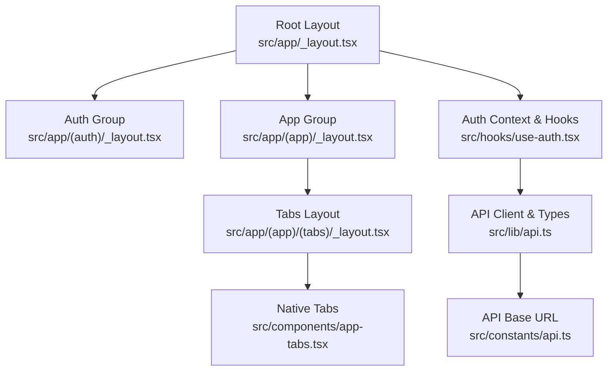
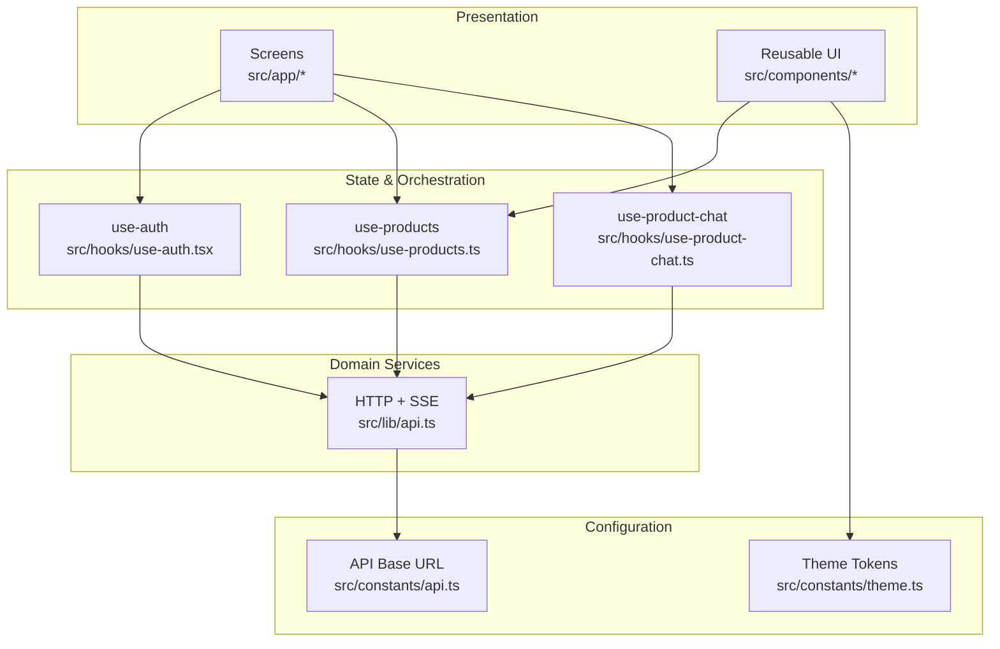
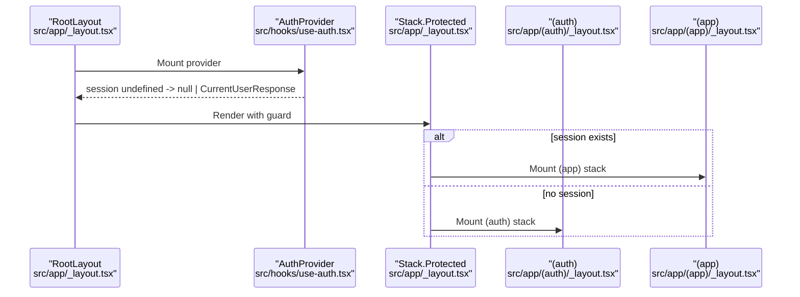
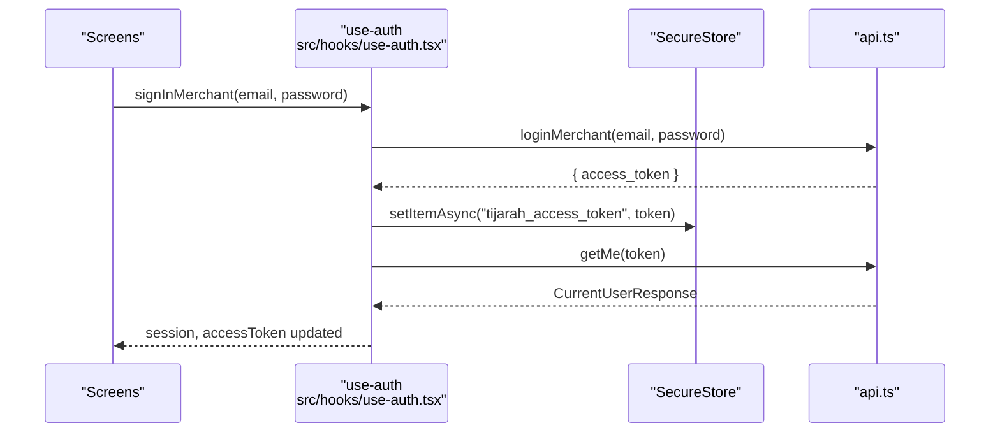
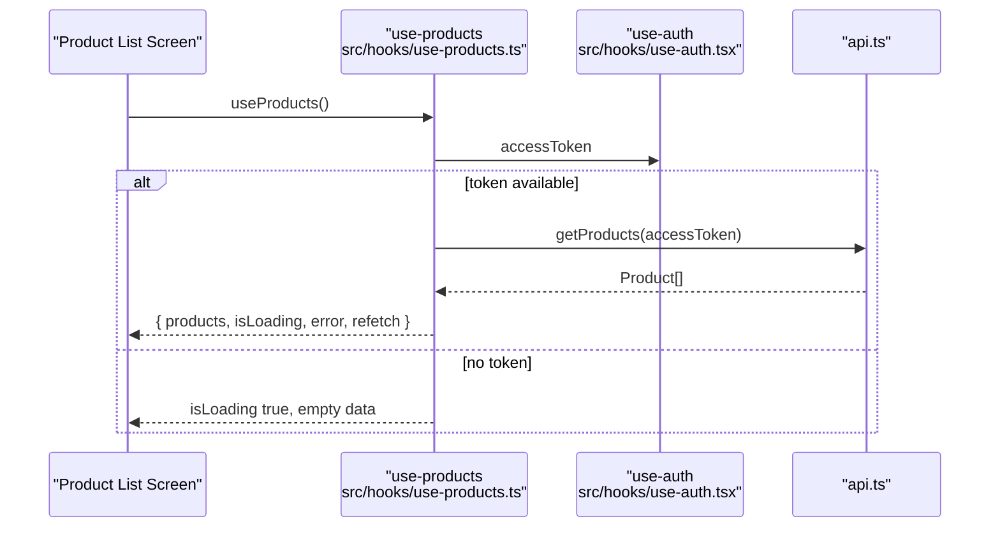
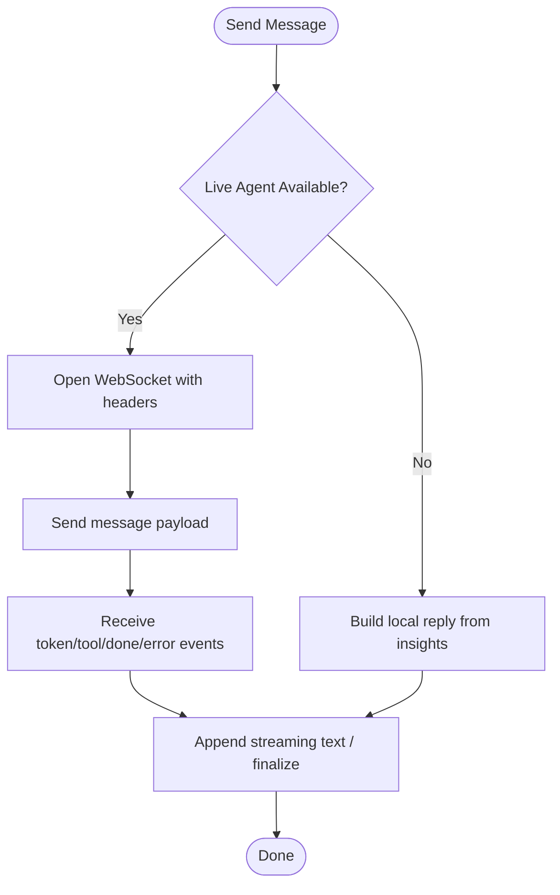
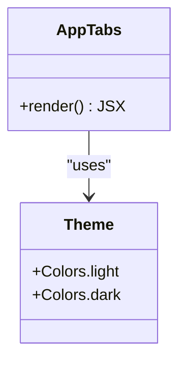
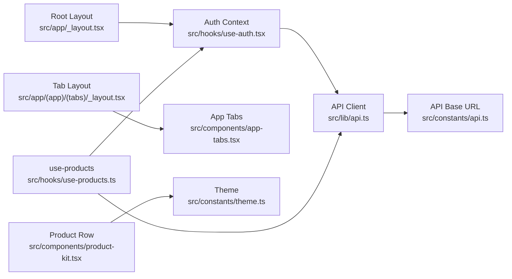

# Architecture Overview

<cite>
**Referenced Files in This Document**
- [src/app/_layout.tsx](file://src/app/_layout.tsx)
- [src/app/(app)/_layout.tsx](file://src/app/(app)/_layout.tsx)
- [src/app/(auth)/_layout.tsx](file://src/app/(auth)/_layout.tsx)
- [src/app/(app)/(tabs)/_layout.tsx](file://src/app/(app)/(tabs)/_layout.tsx)
- [src/hooks/use-auth.tsx](file://src/hooks/use-auth.tsx)
- [src/lib/api.ts](file://src/lib/api.ts)
- [src/constants/api.ts](file://src/constants/api.ts)
- [src/hooks/use-products.ts](file://src/hooks/use-products.ts)
- [src/components/product-kit.tsx](file://src/components/product-kit.tsx)
- [src/components/app-tabs.tsx](file://src/components/app-tabs.tsx)
- [src/hooks/use-product-chat.ts](file://src/hooks/use-product-chat.ts)
- [package.json](file://package.json)
</cite>

## Table of Contents
1. Introduction
2. Project Structure
3. Core Components
4. Architecture Overview
5. Detailed Component Analysis
6. Dependency Analysis
7. Performance Considerations
8. Troubleshooting Guide
9. Conclusion

## Introduction
This document describes the high-level architecture of the Tijarah AI App built with React Native and Expo, following Expo Router file-based routing and a component-based pattern with clear separation of concerns. It explains how screens, reusable UI components, custom hooks, configuration, and core utilities are organized; how navigation is protected by authentication state; how data flows from API calls through hooks to components; and how authentication and token management work end-to-end.

## Project Structure
The app follows a feature-oriented layout under src:
- src/app: File-based routes via Expo Router. Groups include (auth) for unauthenticated screens and (app) for authenticated screens. The root layout wires up theming, splash, and auth context before mounting either group based on session state.
- src/components: Reusable UI primitives and screen-specific kits (e.g., product list rows, tabs, chat UI).
- src/hooks: Custom React hooks encapsulating business logic and side effects (authentication, data fetching, streaming chat, marketplace integrations).
- src/constants: Configuration such as theme tokens and API base URL.
- src/lib: Core utilities including HTTP client, error handling, SSE streaming helpers, and typed API functions.

**Diagram sources**
- [src/app/_layout.tsx:18-81](file://src/app/_layout.tsx#L18-L81)
- [src/app/(auth)/_layout.tsx:6-13](file://src/app/(auth)/_layout.tsx#L6-L13)
- [src/app/(app)/_layout.tsx:6-20](file://src/app/(app)/_layout.tsx#L6-L20)
- [src/app/(app)/(tabs)/_layout.tsx:5-7](file://src/app/(app)/(tabs)/_layout.tsx#L5-L7)
- [src/components/app-tabs.tsx:7-63](file://src/components/app-tabs.tsx#L7-L63)
- [src/hooks/use-auth.tsx:31-81](file://src/hooks/use-auth.tsx#L31-L81)
- [src/lib/api.ts:53-77](file://src/lib/api.ts#L53-L77)
- [src/constants/api.ts:10-15](file://src/constants/api.ts#L10-L15)

**Section sources**
- [src/app/_layout.tsx:18-81](file://src/app/_layout.tsx#L18-L81)
- [src/app/(auth)/_layout.tsx:6-13](file://src/app/(auth)/_layout.tsx#L6-L13)
- [src/app/(app)/_layout.tsx:6-20](file://src/app/(app)/_layout.tsx#L6-L20)
- [src/app/(app)/(tabs)/_layout.tsx:5-7](file://src/app/(app)/(tabs)/_layout.tsx#L5-L7)
- [src/components/app-tabs.tsx:7-63](file://src/components/app-tabs.tsx#L7-L63)
- [src/hooks/use-auth.tsx:31-81](file://src/hooks/use-auth.tsx#L31-L81)
- [src/lib/api.ts:53-77](file://src/lib/api.ts#L53-L77)
- [src/constants/api.ts:10-15](file://src/constants/api.ts#L10-L15)

## Core Components
- Root navigator and protected groups: The root layout mounts an AuthProvider and decides whether to render the (auth) or (app) stack using Stack.Protected guards based on the current session.
- Tabbed shell: The authenticated tab group renders a native tab bar that provides primary navigation across Home, Insights, Ask Tijarah, Products, and More.
- Authentication context: Provides session, access token, sign-in, sign-up, and sign-out, persisting tokens securely and hydrating user info on launch.
- Data hooks: Encapsulate fetching, loading states, errors, and refetch triggers for features like products and chat.
- API layer: Centralized HTTP client with robust error extraction, SSE streaming support for server-sent events, and typed endpoints for marketplace integrations.

**Section sources**
- [src/app/_layout.tsx:44-81](file://src/app/_layout.tsx#L44-L81)
- [src/app/(app)/(tabs)/_layout.tsx:5-7](file://src/app/(app)/(tabs)/_layout.tsx#L5-L7)
- [src/components/app-tabs.tsx:7-63](file://src/components/app-tabs.tsx#L7-L63)
- [src/hooks/use-auth.tsx:31-81](file://src/hooks/use-auth.tsx#L31-L81)
- [src/hooks/use-products.ts:16-57](file://src/hooks/use-products.ts#L16-L57)
- [src/lib/api.ts:53-77](file://src/lib/api.ts#L53-L77)

## Architecture Overview
The app uses a layered architecture:
- Presentation: Screens in src/app and reusable UI in src/components.
- State and orchestration: Custom hooks in src/hooks manage data fetching, streaming, and side effects.
- Domain services: src/lib/api exposes typed functions and utilities for backend communication.
- Configuration: src/constants holds environment-dependent values like API base URL and design tokens.

**Diagram sources**
- [src/hooks/use-auth.tsx:31-81](file://src/hooks/use-auth.tsx#L31-L81)
- [src/hooks/use-products.ts:16-57](file://src/hooks/use-products.ts#L16-L57)
- [src/hooks/use-product-chat.ts:169-319](file://src/hooks/use-product-chat.ts#L169-L319)
- [src/lib/api.ts:53-77](file://src/lib/api.ts#L53-L77)
- [src/constants/api.ts:10-15](file://src/constants/api.ts#L10-L15)

## Detailed Component Analysis

### Navigation and Protected Routes
- Root layout wraps the app with ThemeProvider and AuthProvider, then conditionally mounts either the (auth) or (app) stack using Stack.Protected based on session state. This ensures mutually exclusive branches and prevents back-navigation leaks across auth boundaries.
- The (app) stack registers all authenticated screens and nested tabs. The (auth) stack registers welcome, login, and signup.
- The tab layout delegates to a native tab component for consistent platform behavior.

**Diagram sources**
- [src/app/_layout.tsx:44-81](file://src/app/_layout.tsx#L44-L81)
- [src/app/(auth)/_layout.tsx:6-13](file://src/app/(auth)/_layout.tsx#L6-L13)
- [src/app/(app)/_layout.tsx:6-20](file://src/app/(app)/_layout.tsx#L6-L20)

**Section sources**
- [src/app/_layout.tsx:44-81](file://src/app/_layout.tsx#L44-L81)
- [src/app/(auth)/_layout.tsx:6-13](file://src/app/(auth)/_layout.tsx#L6-L13)
- [src/app/(app)/_layout.tsx:6-20](file://src/app/(app)/_layout.tsx#L6-L20)

### Authentication Flow and Token Management
- On app start, the auth context reads a stored access token from secure storage. If present, it validates by calling the current user endpoint and sets session and token; otherwise, it clears state.
- Sign-in/sign-up flow obtains a token from the backend, stores it securely, hydrates the user profile, and updates context so navigation can switch to the app group.
- Sign-out clears the token and resets session and token to null.

**Diagram sources**
- [src/hooks/use-auth.tsx:31-81](file://src/hooks/use-auth.tsx#L31-L81)
- [src/lib/api.ts:325-342](file://src/lib/api.ts#L325-L342)

**Section sources**
- [src/hooks/use-auth.tsx:31-81](file://src/hooks/use-auth.tsx#L31-L81)
- [src/lib/api.ts:325-342](file://src/lib/api.ts#L325-L342)

### Data Flow: API to Hooks to Components
- Data hooks consume the auth context to obtain the access token and call typed API functions. They manage loading states, errors, and provide refetch capabilities.
- Components consume hook results to render lists, details, and interactive elements. For example, product list rows display images, stock status, price, and marketplace badges.

**Diagram sources**
- [src/hooks/use-products.ts:16-57](file://src/hooks/use-products.ts#L16-L57)
- [src/hooks/use-auth.tsx:31-81](file://src/hooks/use-auth.tsx#L31-L81)
- [src/lib/api.ts:53-77](file://src/lib/api.ts#L53-L77)

**Section sources**
- [src/hooks/use-products.ts:16-57](file://src/hooks/use-products.ts#L16-L57)
- [src/components/product-kit.tsx:26-127](file://src/components/product-kit.tsx#L26-L127)

### Streaming Chat and Real-time Updates
- The product chat hook manages a WebSocket connection when conditions allow (native platform, connected marketplace, valid tokens). It parses both JSON and SSE-style frames, streams assistant responses incrementally, and falls back to a deterministic local responder when live agent is unavailable.
- Events include token streaming, tool activity markers, completion, and errors.

**Diagram sources**
- [src/hooks/use-product-chat.ts:169-319](file://src/hooks/use-product-chat.ts#L169-L319)

**Section sources**
- [src/hooks/use-product-chat.ts:169-319](file://src/hooks/use-product-chat.ts#L169-L319)

### UI Shell and Tabs
- The tab layout renders a native tab bar with labels and icons for primary sections. Colors and indicators adapt to the active color scheme.

**Diagram sources**
- [src/components/app-tabs.tsx:7-63](file://src/components/app-tabs.tsx#L7-L63)

**Section sources**
- [src/components/app-tabs.tsx:7-63](file://src/components/app-tabs.tsx#L7-L63)

## Dependency Analysis
- Routing depends on Expo Router and React Navigation primitives.
- Authentication depends on SecureStore for persistence and the API client for validation and login/signup.
- Data hooks depend on the API client and auth context.
- UI components depend on theme constants and reusable primitives.

**Diagram sources**
- [src/app/_layout.tsx:44-81](file://src/app/_layout.tsx#L44-L81)
- [src/hooks/use-auth.tsx:31-81](file://src/hooks/use-auth.tsx#L31-L81)
- [src/lib/api.ts:53-77](file://src/lib/api.ts#L53-L77)
- [src/constants/api.ts:10-15](file://src/constants/api.ts#L10-L15)
- [src/app/(app)/(tabs)/_layout.tsx:5-7](file://src/app/(app)/(tabs)/_layout.tsx#L5-L7)
- [src/components/app-tabs.tsx:7-63](file://src/components/app-tabs.tsx#L7-L63)
- [src/hooks/use-products.ts:16-57](file://src/hooks/use-products.ts#L16-L57)
- [src/components/product-kit.tsx:26-127](file://src/components/product-kit.tsx#L26-L127)

**Section sources**
- [src/app/_layout.tsx:44-81](file://src/app/_layout.tsx#L44-L81)
- [src/hooks/use-auth.tsx:31-81](file://src/hooks/use-auth.tsx#L31-L81)
- [src/lib/api.ts:53-77](file://src/lib/api.ts#L53-L77)
- [src/constants/api.ts:10-15](file://src/constants/api.ts#L10-L15)
- [src/app/(app)/(tabs)/_layout.tsx:5-7](file://src/app/(app)/(tabs)/_layout.tsx#L5-L7)
- [src/components/app-tabs.tsx:7-63](file://src/components/app-tabs.tsx#L7-L63)
- [src/hooks/use-products.ts:16-57](file://src/hooks/use-products.ts#L16-L57)
- [src/components/product-kit.tsx:26-127](file://src/components/product-kit.tsx#L26-L127)

## Performance Considerations
- Avoid rendering heavy UI until fonts and splash are ready to prevent flashes and layout shifts.
- Guard network requests until the access token is available to prevent unnecessary failures.
- Use streaming for long-running operations to keep the UI responsive and informative.
- Prefer native tabs for performance and consistency on mobile platforms.
- Deduplicate and normalize external marketplace payloads to reduce downstream processing overhead.

[No sources needed since this section provides general guidance]

## Troubleshooting Guide
- Network reachability: The API client throws a specific error when the server cannot be reached; surface a friendly message to users.
- SSE streaming errors: When streaming ends without a result or encounters an error event, handle gracefully and inform the user.
- Authentication state: If session remains undefined at startup, ensure SecureStore initialization completes before rendering navigators.
- Marketplace connections: Ensure required tokens (e.g., marketplace access tokens) are resolved before enabling live agent features.

**Section sources**
- [src/lib/api.ts:53-77](file://src/lib/api.ts#L53-L77)
- [src/lib/api.ts:215-286](file://src/lib/api.ts#L215-L286)
- [src/hooks/use-auth.tsx:31-81](file://src/hooks/use-auth.tsx#L31-L81)

## Conclusion
The Tijarah AI App adopts a clean, layered architecture aligned with React Native and Expo best practices. File-based routing with protected groups separates authenticated and unauthenticated experiences. Custom hooks encapsulate data and streaming logic, while a centralized API layer standardizes HTTP and SSE interactions. The result is a maintainable, scalable codebase where screens focus on presentation, hooks manage state and side effects, and shared utilities provide consistent behavior across the app.