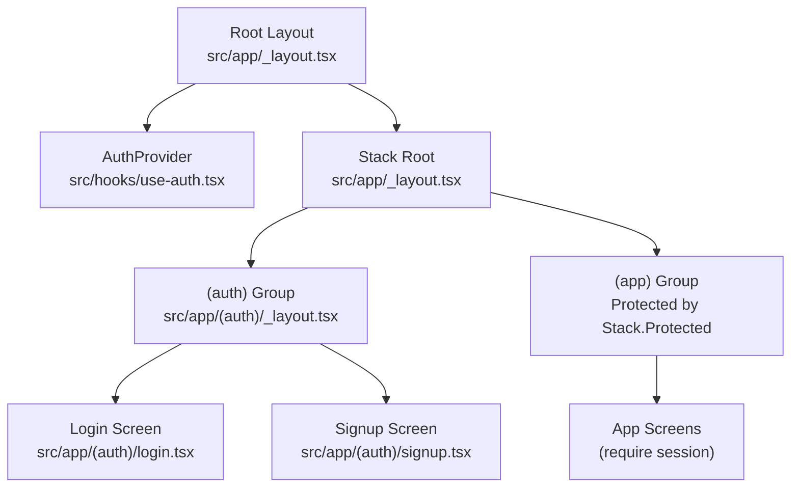
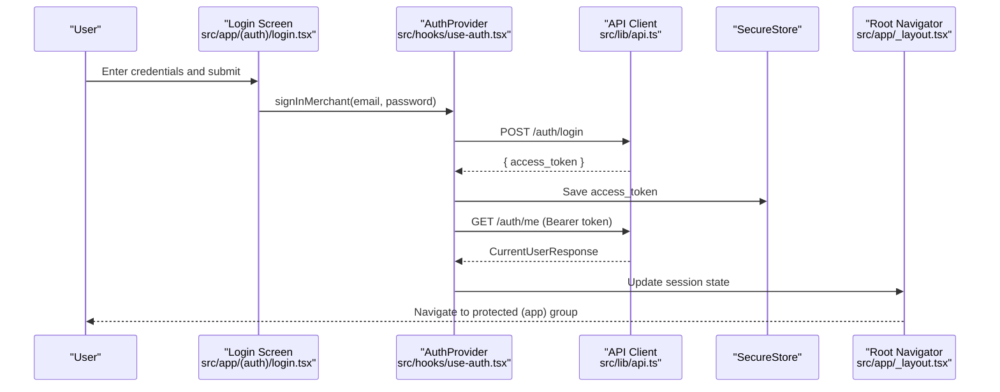
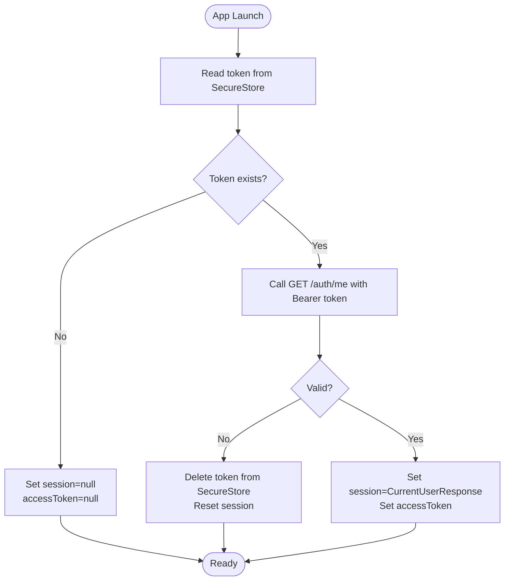
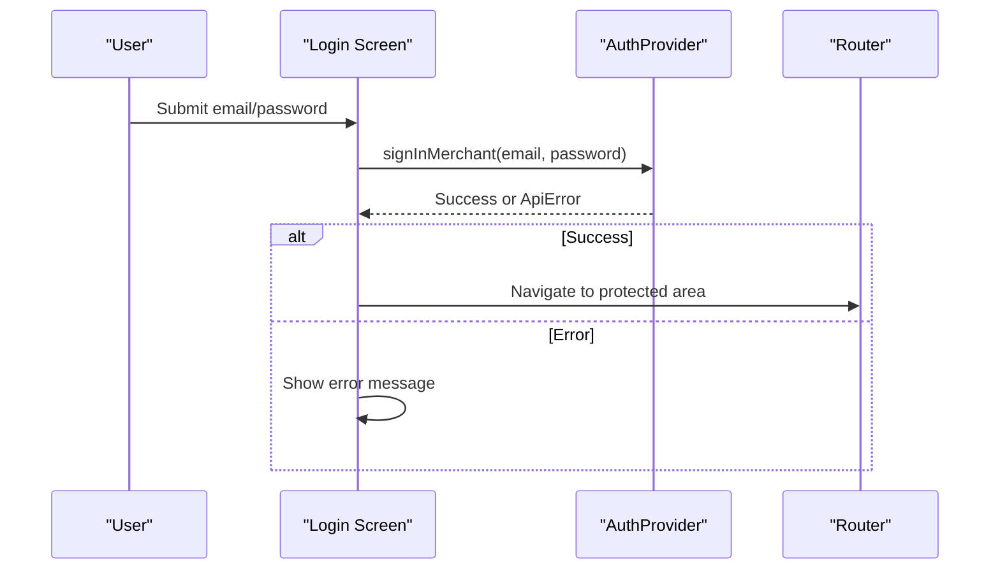
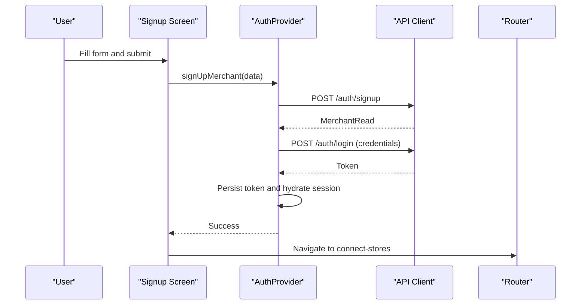
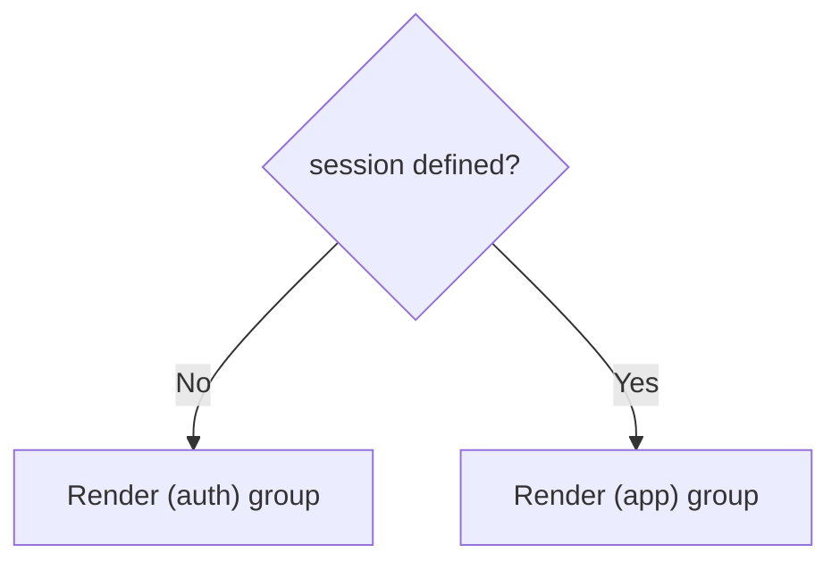
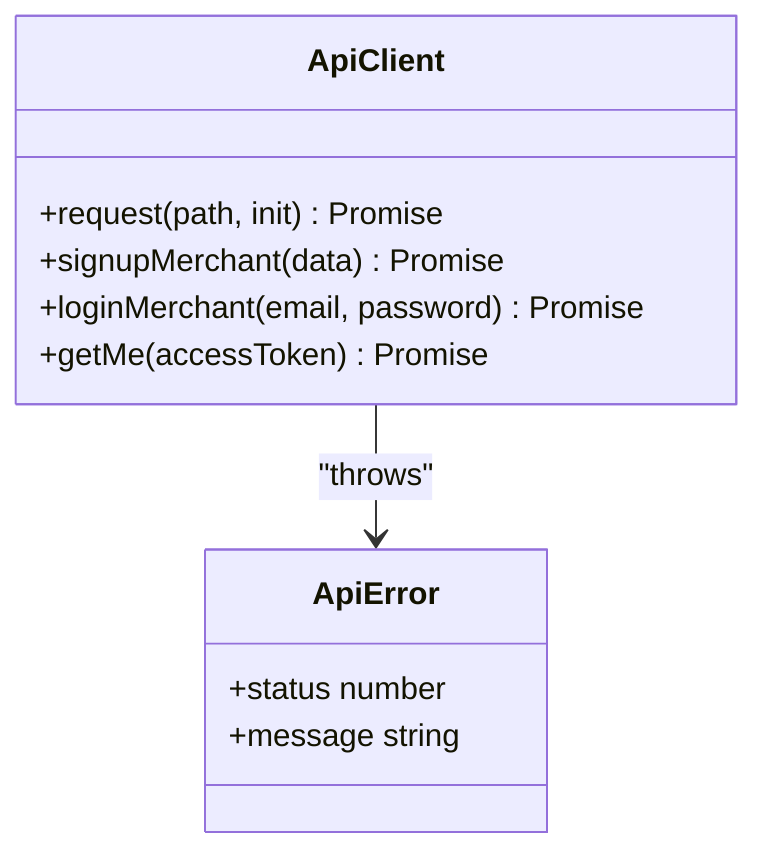
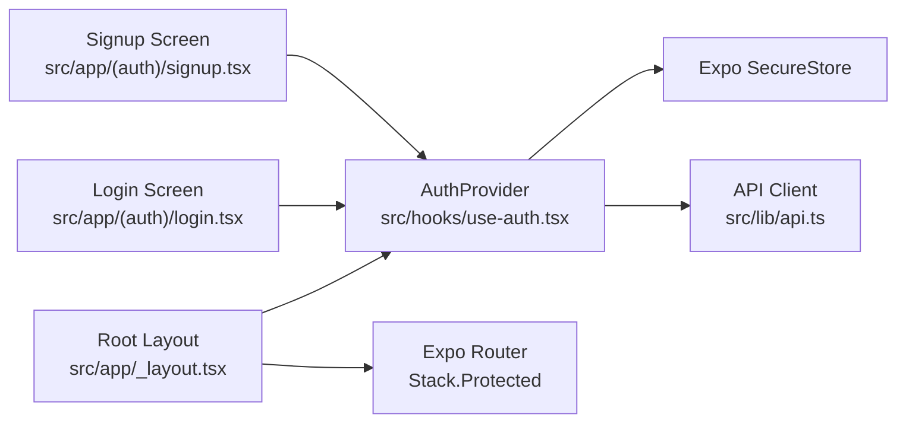

# Authentication Flow

<cite>
**Referenced Files in This Document**
- [src/hooks/use-auth.tsx](file://src/hooks/use-auth.tsx)
- [src/app/_layout.tsx](file://src/app/_layout.tsx)
- [src/app/(auth)/_layout.tsx](file://src/app/(auth)/_layout.tsx)
- [src/app/(auth)/login.tsx](file://src/app/(auth)/login.tsx)
- [src/app/(auth)/signup.tsx](file://src/app/(auth)/signup.tsx)
- [src/lib/api.ts](file://src/lib/api.ts)
- [src/constants/api.ts](file://src/constants/api.ts)
- [src/components/auth-kit.tsx](file://src/components/auth-kit.tsx)
</cite>

## Table of Contents
1. Introduction
2. Project Structure
3. Core Components
4. Architecture Overview
5. Detailed Component Analysis
6. Dependency Analysis
7. Performance Considerations
8. Troubleshooting Guide
9. Conclusion

## Introduction
This document explains the authentication flow and security architecture of the Tijarah AI App. It covers token-based authentication using Expo SecureStore for secure storage, session management, protected route guards, login/signup flows, error handling, and how authentication state is synchronized across the application. It also details integration with backend authentication APIs and provides security considerations and best practices for token management.

## Project Structure
The app uses file-based routing with two mutually exclusive groups:
- (auth): Unauthenticated screens such as welcome, login, and signup.
- (app): Protected screens that require an active session.

A root layout mounts an AuthProvider to manage authentication state and uses Stack.Protected to ensure only the appropriate group is visible based on the current session.

**Diagram sources**
- [src/app/_layout.tsx:35-81](file://src/app/_layout.tsx#L35-L81)
- [src/app/(auth)/_layout.tsx:1-15](file://src/app/(auth)/_layout.tsx#L1-L15)

**Section sources**
- [src/app/_layout.tsx:35-81](file://src/app/_layout.tsx#L35-L81)
- [src/app/(auth)/_layout.tsx:1-15](file://src/app/(auth)/_layout.tsx#L1-L15)

## Core Components
- Authentication context and provider: Centralizes session state, access token, sign-in, sign-up, and sign-out logic. Uses Expo SecureStore to persist the access token and hydrates the session on launch by calling the backend’s user info endpoint.
- API client: Encapsulates HTTP requests, error extraction, and typed endpoints for authentication and other features. Adds Authorization headers where required.
- Routing guards: The root navigator conditionally renders either the (auth) or (app) stack based on the session, preventing unauthorized access to protected routes.
- UI scaffolding: Reusable auth form components used by login and signup screens.

Key responsibilities:
- Secure token storage and retrieval via SecureStore.
- Hydration of user session from stored token at startup.
- Sign-in/sign-up flows that update both local state and persistent storage.
- Route protection through Stack.Protected guards.

**Section sources**
- [src/hooks/use-auth.tsx:1-91](file://src/hooks/use-auth.tsx#L1-L91)
- [src/lib/api.ts:1-800](file://src/lib/api.ts#L1-L800)
- [src/app/_layout.tsx:35-81](file://src/app/_layout.tsx#L35-L81)
- [src/components/auth-kit.tsx:65-229](file://src/components/auth-kit.tsx#L65-L229)

## Architecture Overview
The authentication architecture follows a clear separation of concerns:
- UI screens trigger actions (sign-in, sign-up, sign-out).
- The AuthProvider coordinates state changes and persists tokens securely.
- The API layer handles network calls and error normalization.
- The router enforces access control based on session state.

**Diagram sources**
- [src/app/(auth)/login.tsx:28-39](file://src/app/(auth)/login.tsx#L28-L39)
- [src/hooks/use-auth.tsx:66-70](file://src/hooks/use-auth.tsx#L66-L70)
- [src/lib/api.ts:325-342](file://src/lib/api.ts#L325-L342)
- [src/app/_layout.tsx:64-81](file://src/app/_layout.tsx#L64-L81)

## Detailed Component Analysis

### Authentication Provider and Session Management
- On mount, the provider reads the stored token from SecureStore. If present, it validates the token by fetching the current user profile; if invalid or expired, it clears the token and sets an unauthenticated state.
- Sign-in stores the access token, fetches the user profile, and updates the session.
- Sign-up creates the merchant account, logs them in, stores the token, and hydrates the session.
- Sign-out deletes the token and resets the session.

**Diagram sources**
- [src/hooks/use-auth.tsx:35-53](file://src/hooks/use-auth.tsx#L35-L53)
- [src/lib/api.ts:338-342](file://src/lib/api.ts#L338-L342)

**Section sources**
- [src/hooks/use-auth.tsx:15-91](file://src/hooks/use-auth.tsx#L15-L91)

### Login Flow
- Validates email format and non-empty password.
- Calls the sign-in method in the AuthProvider.
- On success, navigates to protected areas; on failure, displays a user-friendly error message derived from ApiError.

**Diagram sources**
- [src/app/(auth)/login.tsx:28-39](file://src/app/(auth)/login.tsx#L28-L39)
- [src/hooks/use-auth.tsx:66-70](file://src/hooks/use-auth.tsx#L66-L70)

**Section sources**
- [src/app/(auth)/login.tsx:15-127](file://src/app/(auth)/login.tsx#L15-L127)
- [src/hooks/use-auth.tsx:66-70](file://src/hooks/use-auth.tsx#L66-L70)

### Signup Flow
- Collects full name, business name, email, password, and agreement to terms.
- Creates the merchant account via the API.
- After successful creation, redirects to store connection flow.

**Diagram sources**
- [src/app/(auth)/signup.tsx:48-65](file://src/app/(auth)/signup.tsx#L48-L65)
- [src/hooks/use-auth.tsx:59-65](file://src/hooks/use-auth.tsx#L59-L65)
- [src/lib/api.ts:317-336](file://src/lib/api.ts#L317-L336)

**Section sources**
- [src/app/(auth)/signup.tsx:26-200](file://src/app/(auth)/signup.tsx#L26-L200)
- [src/hooks/use-auth.tsx:55-65](file://src/hooks/use-auth.tsx#L55-L65)

### Protected Routes and Navigation Guards
- The root navigator conditionally renders either the (auth) or (app) stack based on the session.
- Stack.Protected ensures that:
  - When session is null/undefined, only (auth) screens are accessible.
  - When session exists, only (app) screens are accessible.
- This prevents back-navigation leaks between auth and app states.

**Diagram sources**
- [src/app/_layout.tsx:64-81](file://src/app/_layout.tsx#L64-L81)

**Section sources**
- [src/app/_layout.tsx:64-81](file://src/app/_layout.tsx#L64-L81)
- [src/app/(auth)/_layout.tsx:1-15](file://src/app/(auth)/_layout.tsx#L1-L15)

### Backend Integration and Token Usage
- Authentication endpoints:
  - POST /auth/signup: Create merchant account.
  - POST /auth/login: Exchange credentials for an access token.
  - GET /auth/me: Retrieve current user profile using Bearer token.
- Other protected endpoints include marketplace operations and product listing generation, all requiring Authorization: Bearer <token>.
- The API client normalizes errors into ApiError instances with status codes and human-readable messages.

**Diagram sources**
- [src/lib/api.ts:5-77](file://src/lib/api.ts#L5-L77)
- [src/lib/api.ts:317-342](file://src/lib/api.ts#L317-L342)

**Section sources**
- [src/lib/api.ts:5-77](file://src/lib/api.ts#L5-L77)
- [src/lib/api.ts:317-342](file://src/lib/api.ts#L317-L342)

### Security Considerations and Best Practices
- Secure storage: Access tokens are stored using Expo SecureStore, which leverages platform-native secure storage mechanisms.
- Minimal exposure: Tokens are only kept in memory within the AuthProvider and persisted securely; they are not logged or exposed in UI.
- Validation on launch: On app start, the stored token is validated against the backend; invalid tokens are cleared automatically.
- Protected navigation: Stack.Protected ensures that sensitive screens are only reachable when authenticated.
- Error handling: Network and server errors are normalized and surfaced to users without leaking sensitive details.
- Token refresh: The current implementation does not implement automatic token refresh. If backend tokens expire, consider adding a refresh flow that re-authenticates silently or prompts the user to log in again.

[No sources needed since this section provides general guidance]

## Dependency Analysis
The authentication system depends on:
- Expo SecureStore for secure token persistence.
- React Context for sharing authentication state across components.
- Expo Router for navigation and route protection.
- API client for backend communication and error handling.

**Diagram sources**
- [src/hooks/use-auth.tsx:1-91](file://src/hooks/use-auth.tsx#L1-L91)
- [src/app/_layout.tsx:35-81](file://src/app/_layout.tsx#L35-L81)
- [src/app/(auth)/login.tsx:15-127](file://src/app/(auth)/login.tsx#L15-L127)
- [src/app/(auth)/signup.tsx:26-200](file://src/app/(auth)/signup.tsx#L26-L200)
- [src/lib/api.ts:317-342](file://src/lib/api.ts#L317-L342)

**Section sources**
- [src/hooks/use-auth.tsx:1-91](file://src/hooks/use-auth.tsx#L1-L91)
- [src/app/_layout.tsx:35-81](file://src/app/_layout.tsx#L35-L81)
- [src/lib/api.ts:317-342](file://src/lib/api.ts#L317-L342)

## Performance Considerations
- Hydration cost: Fetching the user profile on launch adds one network call; consider caching or optimistic UI if needed.
- Avoid redundant requests: Ensure components do not repeatedly trigger sign-in or profile fetches unnecessarily.
- Minimize re-renders: The AuthProvider memoizes its value to reduce unnecessary updates in consumers.

[No sources needed since this section provides general guidance]

## Troubleshooting Guide
Common issues and resolutions:
- Invalid or expired token:
  - Symptom: App shows unauthenticated state after launch.
  - Cause: Stored token failed validation on GET /auth/me.
  - Resolution: Token is automatically deleted; prompt user to log in again.
- Network errors:
  - Symptom: “Could not reach the server” or generic request failures.
  - Cause: Connectivity issues or backend unreachable.
  - Resolution: Check network settings and retry.
- Incorrect credentials:
  - Symptom: Login fails with a specific error message.
  - Cause: Backend returns an error detail.
  - Resolution: Display the ApiError message to the user and allow retries.

**Section sources**
- [src/hooks/use-auth.tsx:35-53](file://src/hooks/use-auth.tsx#L35-L53)
- [src/lib/api.ts:53-77](file://src/lib/api.ts#L53-L77)
- [src/app/(auth)/login.tsx:28-39](file://src/app/(auth)/login.tsx#L28-L39)

## Conclusion
Tijarah AI App implements a robust, secure authentication flow using token-based authentication with Expo SecureStore for safe storage. The AuthProvider centralizes session management, while the root navigator enforces protected routes via Stack.Protected. Login and signup flows integrate cleanly with backend endpoints, and errors are normalized for consistent user feedback. For enhanced resilience, consider implementing token refresh mechanisms and additional safeguards such as token expiration checks before each request.

[No sources needed since this section summarizes without analyzing specific files]