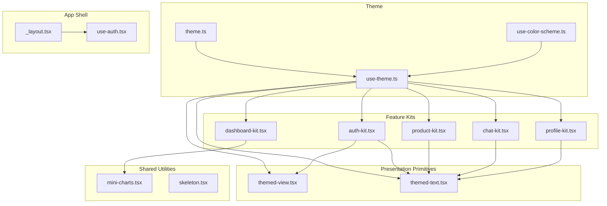
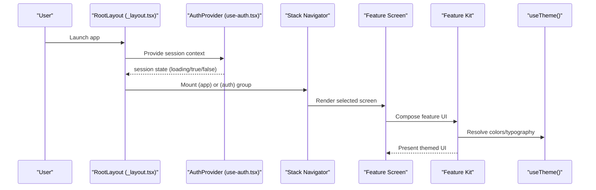
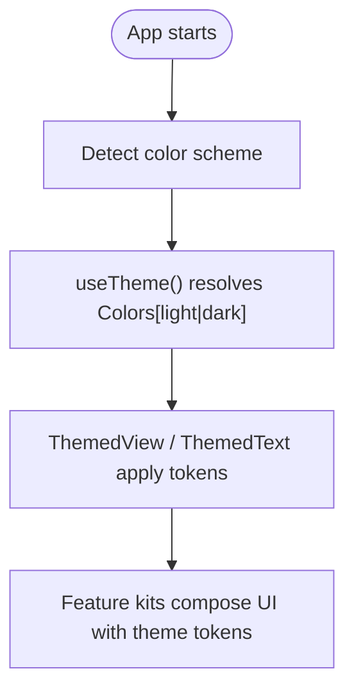
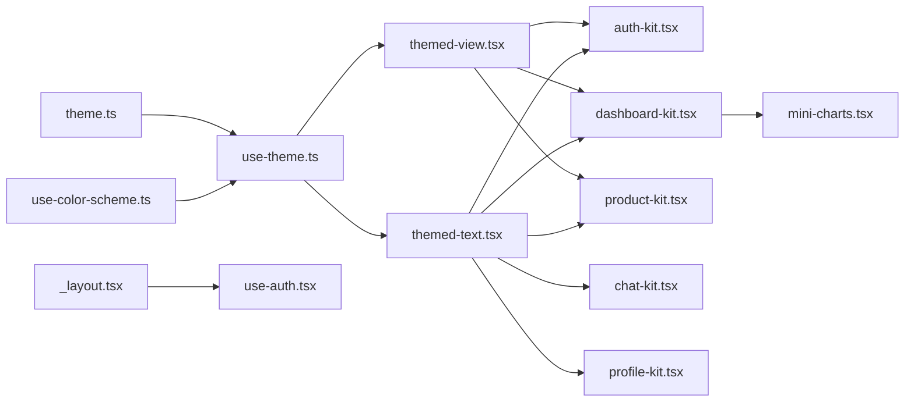

# Component Architecture

<cite>
**Referenced Files in This Document**
- [theme.ts](file://src/constants/theme.ts)
- [use-theme.ts](file://src/hooks/use-theme.ts)
- [use-color-scheme.ts](file://src/hooks/use-color-scheme.ts)
- [themed-text.tsx](file://src/components/themed-text.tsx)
- [themed-view.tsx](file://src/components/themed-view.tsx)
- [auth-kit.tsx](file://src/components/auth-kit.tsx)
- [dashboard-kit.tsx](file://src/components/dashboard-kit.tsx)
- [product-kit.tsx](file://src/components/product-kit.tsx)
- [chat-kit.tsx](file://src/components/chat-kit.tsx)
- [profile-kit.tsx](file://src/components/profile-kit.tsx)
- [mini-charts.tsx](file://src/components/mini-charts.tsx)
- [skeleton.tsx](file://src/components/skeleton.tsx)
- [_layout.tsx](file://src/app/_layout.tsx)
- [use-auth.tsx](file://src/hooks/use-auth.tsx)
</cite>

## Table of Contents
1. [Introduction](#introduction)
2. [Project Structure](#project-structure)
3. [Core Components](#core-components)
4. [Architecture Overview](#architecture-overview)
5. [Detailed Component Analysis](#detailed-component-analysis)
6. [Dependency Analysis](#dependency-analysis)
7. [Performance Considerations](#performance-considerations)
8. [Troubleshooting Guide](#troubleshooting-guide)
9. [Conclusion](#conclusion)
10. [Appendices](#appendices)

## Introduction
This document explains the component architecture of the Tijarah AI App with a focus on:
- How reusable UI primitives are composed into feature-specific kits
- The theming system and how components adapt to light/dark modes
- Separation between presentation components and feature kits
- Guidelines for creating new components, defining prop interfaces, and testing strategies
- Examples of composition patterns and best practices for consistency

The goal is to help developers build consistent, accessible, and maintainable UI while keeping feature logic separate from shared presentation concerns.

## Project Structure
At a high level:
- Theme tokens (colors, typography, spacing, radius) live in constants
- A theme hook provides the active color palette based on the current color scheme
- Presentation primitives (ThemedView, ThemedText) consume the theme
- Feature kits encapsulate domain-specific UI building blocks (Auth, Dashboard, Product, Chat, Profile)
- Shared utilities like charts and skeletons support multiple features without duplication
- Root layout wires up fonts, navigation groups, and authentication gating

**Diagram sources**
- [theme.ts:1-263](file://src/constants/theme.ts#L1-L263)
- [use-theme.ts:1-15](file://src/hooks/use-theme.ts#L1-L15)
- [use-color-scheme.ts:1-2](file://src/hooks/use-color-scheme.ts#L1-L2)
- [themed-view.tsx:1-17](file://src/components/themed-view.tsx#L1-L17)
- [themed-text.tsx:1-100](file://src/components/themed-text.tsx#L1-L100)
- [auth-kit.tsx:1-336](file://src/components/auth-kit.tsx#L1-L336)
- [dashboard-kit.tsx:1-604](file://src/components/dashboard-kit.tsx#L1-L604)
- [product-kit.tsx:1-206](file://src/components/product-kit.tsx#L1-L206)
- [chat-kit.tsx:1-186](file://src/components/chat-kit.tsx#L1-L186)
- [profile-kit.tsx:1-246](file://src/components/profile-kit.tsx#L1-L246)
- [mini-charts.tsx:1-108](file://src/components/mini-charts.tsx#L1-L108)
- [skeleton.tsx:1-139](file://src/components/skeleton.tsx#L1-L139)
- [_layout.tsx:1-82](file://src/app/_layout.tsx#L1-L82)
- [use-auth.tsx:1-91](file://src/hooks/use-auth.tsx#L1-L91)

**Section sources**
- [_layout.tsx:1-82](file://src/app/_layout.tsx#L1-L82)
- [theme.ts:1-263](file://src/constants/theme.ts#L1-L263)

## Core Components
- ThemedView: A thin wrapper around View that applies background colors from the theme via a type token or explicit light/dark colors. It centralizes surface/background usage across screens.
- ThemedText: Centralizes typography scale and text color selection. Supports legacy types and an additive design-system scale, ensuring consistent headings, body, labels, and code styles.

These primitives are the foundation for all feature kits. They ensure every screen inherits theme-aware styling without duplicating color/typography decisions.

**Section sources**
- [themed-view.tsx:1-17](file://src/components/themed-view.tsx#L1-L17)
- [themed-text.tsx:1-100](file://src/components/themed-text.tsx#L1-L100)

## Architecture Overview
The app follows a layered approach:
- Theme layer: Design tokens and theme resolution
- Primitive layer: Theme-aware View and Text
- Utility layer: Charts and skeletons used by multiple features
- Feature kit layer: Domain-specific composable components (Auth, Dashboard, Product, Chat, Profile)
- App shell: Navigation and auth gating

**Diagram sources**
- [_layout.tsx:1-82](file://src/app/_layout.tsx#L1-L82)
- [use-auth.tsx:1-91](file://src/hooks/use-auth.tsx#L1-L91)
- [use-theme.ts:1-15](file://src/hooks/use-theme.ts#L1-L15)

## Detailed Component Analysis

### Theming System
- Tokens: Colors (light/dark), Typography (Manrope family per weight), Radius, Spacing
- Resolution: useColorScheme selects light/dark; useTheme returns the active palette
- Usage: ThemedView and ThemedText consume the theme via props; feature kits call useTheme directly for semantic colors

**Diagram sources**
- [use-color-scheme.ts:1-2](file://src/hooks/use-color-scheme.ts#L1-L2)
- [use-theme.ts:1-15](file://src/hooks/use-theme.ts#L1-L15)
- [theme.ts:1-263](file://src/constants/theme.ts#L1-L263)
- [themed-view.tsx:1-17](file://src/components/themed-view.tsx#L1-L17)
- [themed-text.tsx:1-100](file://src/components/themed-text.tsx#L1-L100)

**Section sources**
- [theme.ts:1-263](file://src/constants/theme.ts#L1-L263)
- [use-theme.ts:1-15](file://src/hooks/use-theme.ts#L1-L15)
- [use-color-scheme.ts:1-2](file://src/hooks/use-color-scheme.ts#L1-L2)

### Presentation Primitives
- ThemedView
  - Props: style, lightColor, darkColor, type
  - Behavior: Applies theme background based on type or explicit colors
- ThemedText
  - Props: style, type (legacy + design-system scale), themeColor
  - Behavior: Applies typography scale and text color from theme

Best practices:
- Prefer ThemedText over raw Text to inherit typography and color
- Use ThemedView for containers to keep backgrounds consistent
- Avoid hardcoding colors; use theme tokens or semantic mappings

**Section sources**
- [themed-view.tsx:1-17](file://src/components/themed-view.tsx#L1-L17)
- [themed-text.tsx:1-100](file://src/components/themed-text.tsx#L1-L100)

### Feature Kits

#### Auth Kit
- Provides form scaffolding, branded inputs, and social sign-in button
- Uses animated press feedback and theme-aware borders/colors
- Exposes reusable fields with validation hints and helper text

Composition pattern:
- Scaffold wraps content with safe area and scroll
- Fields compose label, input, error/helper, and adornments
- Buttons provide consistent press animation and disabled states

**Section sources**
- [auth-kit.tsx:1-336](file://src/components/auth-kit.tsx#L1-L336)

#### Dashboard Kit
- Presents executive dashboard elements: badges, metric cards, insight cards, sentiment, activity lists, graphs
- Maps semantic tones (success/warning/danger/aiInsight/neutral) to theme colors
- Reuses mini-charts for sparklines and distribution bars

Composition pattern:
- Cards combine header, metrics, actions, and captions
- Lists render items with separators and view-all affordances
- Graphs delegate rendering to mini-charts

**Section sources**
- [dashboard-kit.tsx:1-604](file://src/components/dashboard-kit.tsx#L1-L604)
- [mini-charts.tsx:1-108](file://src/components/mini-charts.tsx#L1-L108)

#### Product Kit
- Renders product rows with thumbnail, marketplace badge, stock status, price capsule
- Computes stock levels and formats currency consistently
- Adds subtle press animations and shadow/border themes

Composition pattern:
- Row composes image, metadata, stock indicator, and trailing price
- Helpers encapsulate formatting and state mapping

**Section sources**
- [product-kit.tsx:1-206](file://src/components/product-kit.tsx#L1-L206)

#### Chat Kit
- Defines message bubble grammar: user bubbles vs assistant rule+label
- Includes thinking placeholder and composer with send affordance
- Ensures consistent visual language across chat surfaces

Composition pattern:
- MessageBubble switches rendering by role
- Composer integrates safe area insets and focus states

**Section sources**
- [chat-kit.tsx:1-186](file://src/components/chat-kit.tsx#L1-L186)

#### Profile Kit
- Avatar initials, plan badge, editable/static account rows, subscription card
- Inline editing with save/cancel flows
- Consistent row separators and touch affordances

**Section sources**
- [profile-kit.tsx:1-246](file://src/components/profile-kit.tsx#L1-L246)

#### Mini Charts
- Sparkline and DistributionBar built from Views
- Tone-to-color mapping via resolveToneColor/useToneColor
- Minimal footprint without external chart libraries

**Section sources**
- [mini-charts.tsx:1-108](file://src/components/mini-charts.tsx#L1-L108)

#### Skeletons
- Pulsing placeholders for list and detail loading states
- Prebuilt skeletons for product rows and detail screens

**Section sources**
- [skeleton.tsx:1-139](file://src/components/skeleton.tsx#L1-L139)

### Composition Patterns and Best Practices
- Favor composition: Build complex screens by composing small, single-purpose components from kits
- Keep feature kits focused: Each kit owns its domain UI; avoid cross-feature coupling
- Use theme tokens exclusively: Never hardcode colors; rely on theme or mapped semantics
- Define clear prop interfaces: Type your props explicitly; prefer enums or union types for options
- Separate concerns: Presentation in kits; data fetching/state in hooks/screens
- Maintain accessibility: Provide labels, states, and keyboard-friendly interactions where applicable

Examples:
- Dashboard insight card composes AgentBadge, SeverityBadge, MetricCard, and ActionButton
- Auth form composes AuthFormScaffold, AuthField, PasswordVisibilityToggle, OrDivider, GoogleButton
- Product list composes ProductRow and ProductListSkeleton for loading states

**Section sources**
- [dashboard-kit.tsx:1-604](file://src/components/dashboard-kit.tsx#L1-L604)
- [auth-kit.tsx:1-336](file://src/components/auth-kit.tsx#L1-L336)
- [product-kit.tsx:1-206](file://src/components/product-kit.tsx#L1-L206)
- [skeleton.tsx:1-139](file://src/components/skeleton.tsx#L1-L139)

## Dependency Analysis
- Theme dependency chain: theme.ts defines tokens; use-color-scheme.ts exposes platform color scheme; use-theme.ts resolves active palette
- Presentation primitives depend on theme; feature kits depend on primitives and theme
- Feature kits may depend on shared utilities (charts, skeletons)
- App shell depends on auth provider to gate navigation

**Diagram sources**
- [theme.ts:1-263](file://src/constants/theme.ts#L1-L263)
- [use-theme.ts:1-15](file://src/hooks/use-theme.ts#L1-L15)
- [use-color-scheme.ts:1-2](file://src/hooks/use-color-scheme.ts#L1-L2)
- [themed-view.tsx:1-17](file://src/components/themed-view.tsx#L1-L17)
- [themed-text.tsx:1-100](file://src/components/themed-text.tsx#L1-L100)
- [auth-kit.tsx:1-336](file://src/components/auth-kit.tsx#L1-L336)
- [dashboard-kit.tsx:1-604](file://src/components/dashboard-kit.tsx#L1-L604)
- [mini-charts.tsx:1-108](file://src/components/mini-charts.tsx#L1-L108)
- [product-kit.tsx:1-206](file://src/components/product-kit.tsx#L1-L206)
- [chat-kit.tsx:1-186](file://src/components/chat-kit.tsx#L1-L186)
- [profile-kit.tsx:1-246](file://src/components/profile-kit.tsx#L1-L246)
- [_layout.tsx:1-82](file://src/app/_layout.tsx#L1-L82)
- [use-auth.tsx:1-91](file://src/hooks/use-auth.tsx#L1-L91)

**Section sources**
- [theme.ts:1-263](file://src/constants/theme.ts#L1-L263)
- [use-theme.ts:1-15](file://src/hooks/use-theme.ts#L1-L15)
- [use-color-scheme.ts:1-2](file://src/hooks/use-color-scheme.ts#L1-L2)

## Performance Considerations
- Prefer memoization for expensive computations in feature kits when necessary
- Use reduced motion where available to respect user preferences
- Avoid re-renders by lifting state to appropriate layers (hooks/screens) and passing stable props
- Keep charts minimal and data-driven; compute ranges and colors efficiently
- Use skeletons to mask network latency without blocking UI

[No sources needed since this section provides general guidance]

## Troubleshooting Guide
Common issues and resolutions:
- Incorrect theme colors: Ensure components use theme tokens via ThemedView/ThemedText or useTheme; avoid hardcoded values
- Dark mode mismatches: Verify useColorScheme and useTheme are applied; check platform-specific font selections
- Navigation leaks across auth boundary: Confirm Stack.Protected guards in root layout and that session state drives group mounting
- Token persistence errors: Validate SecureStore operations in auth provider and handle invalid/expired tokens gracefully

**Section sources**
- [_layout.tsx:1-82](file://src/app/_layout.tsx#L1-L82)
- [use-auth.tsx:1-91](file://src/hooks/use-auth.tsx#L1-L91)

## Conclusion
The Tijarah AI App’s component architecture centers on a strong theme system and clear separation between presentation primitives and feature kits. By composing small, theme-aware components and keeping feature logic in dedicated kits, the app maintains consistency, readability, and scalability. Following the guidelines here will help you create new components that integrate seamlessly with existing patterns and uphold visual and behavioral standards across light and dark modes.

[No sources needed since this section summarizes without analyzing specific files]

## Appendices

### Creating New Components: Guidelines
- Start with a purpose: Decide if it belongs in presentation primitives, shared utilities, or a feature kit
- Define props with TypeScript: Use union types for options; default values where sensible
- Consume theme via useTheme or primitives; never hardcode colors
- Compose rather than duplicate: Reuse ThemedView/ThemedText and kit components
- Add accessibility: Labels, roles, and keyboard support where applicable
- Test strategy:
  - Unit test pure helpers (e.g., formatPrice, getStockLevel)
  - Snapshot tests for static UI structures
  - Interaction tests for buttons, inputs, and toggles using a test renderer
  - Theme tests: Render under light/dark schemes and assert correct tokens

[No sources needed since this section provides general guidance]