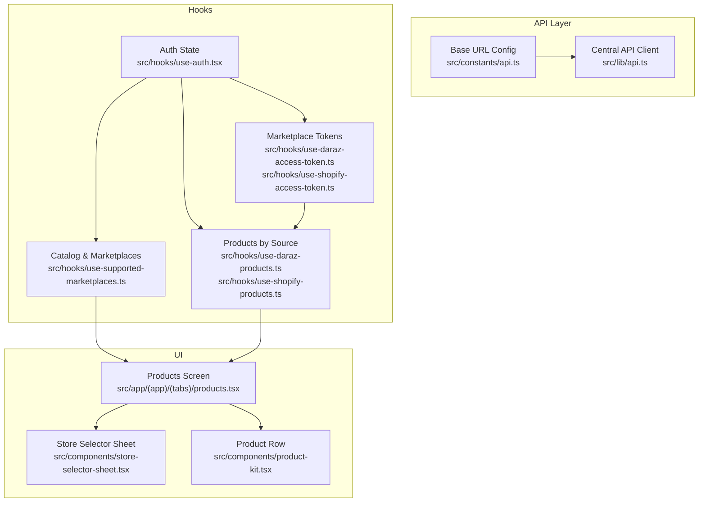
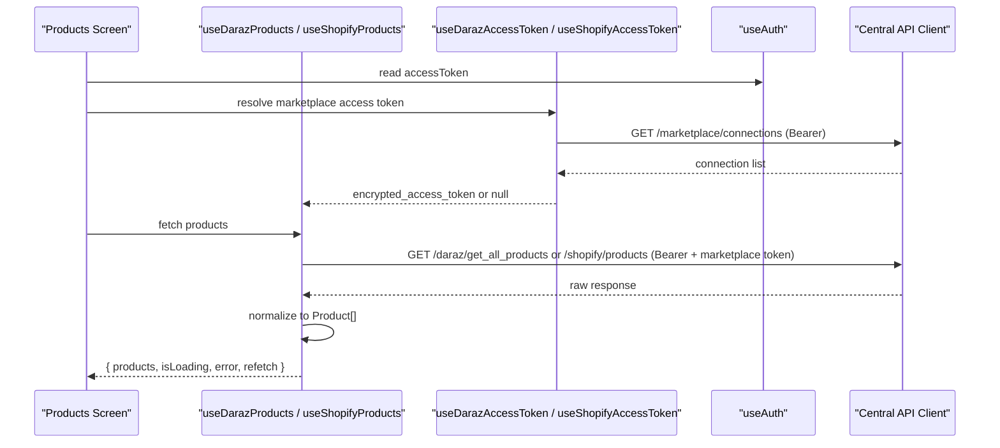
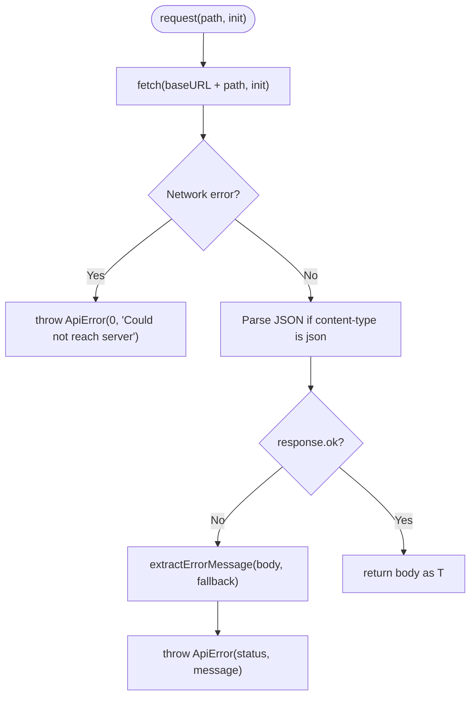
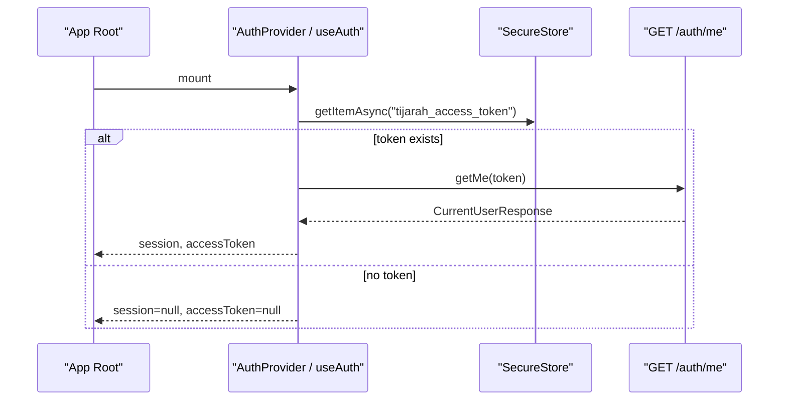
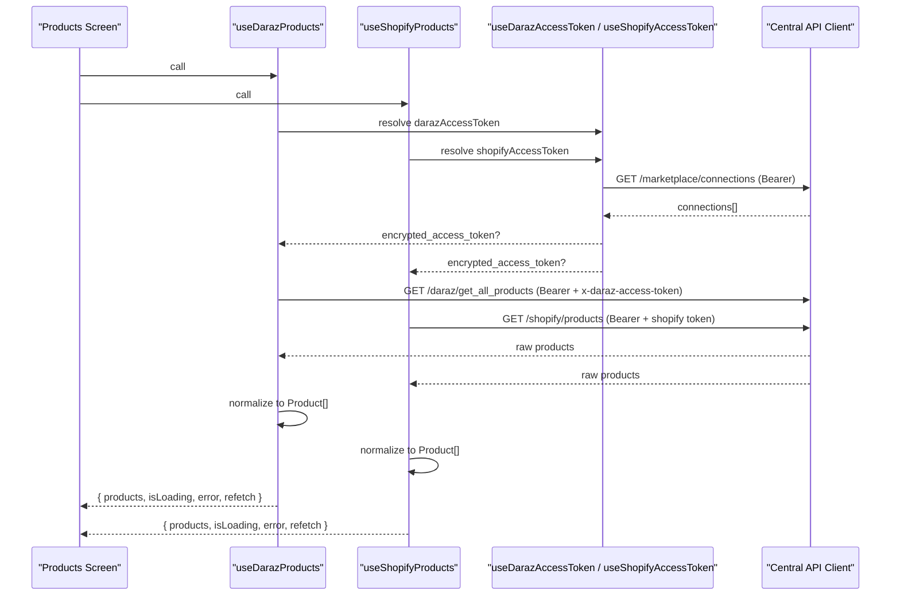
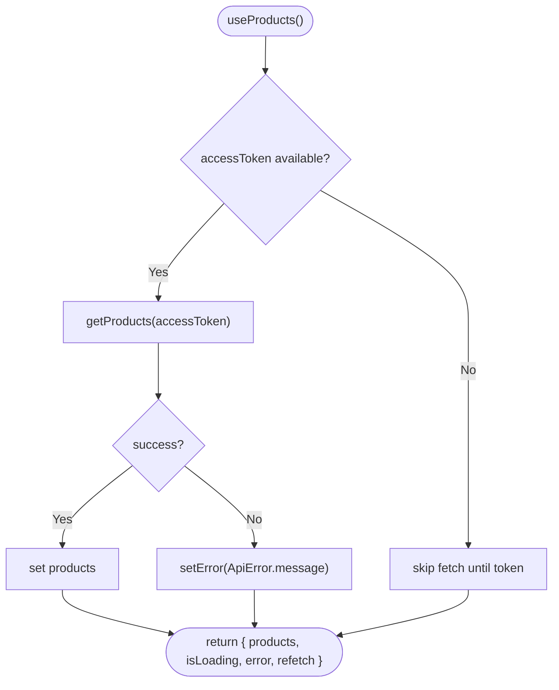
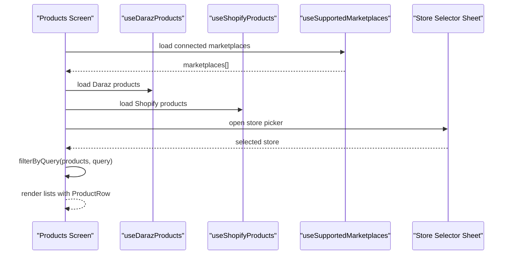
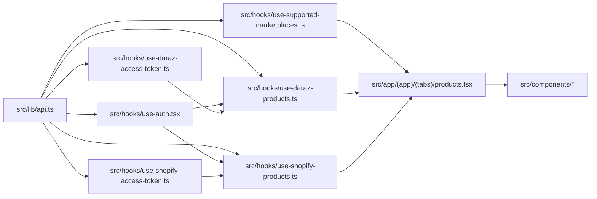

# Data Flow Patterns

<cite>
**Referenced Files in This Document**
- [api.ts](file://src/lib/api.ts)
- [api.ts (constants)](file://src/constants/api.ts)
- [use-auth.tsx](file://src/hooks/use-auth.tsx)
- [use-products.ts](file://src/hooks/use-products.ts)
- [use-shopify-access-token.ts](file://src/hooks/use-shopify-access-token.ts)
- [use-daraz-access-token.ts](file://src/hooks/use-daraz-access-token.ts)
- [use-shopify-products.ts](file://src/hooks/use-shopify-products.ts)
- [use-daraz-products.ts](file://src/hooks/use-daraz-products.ts)
- [use-supported-marketplaces.ts](file://src/hooks/use-supported-marketplaces.ts)
- [products.tsx](file://src/app/(app)/(tabs)/products.tsx)
- [store-selector-sheet.tsx](file://src/components/store-selector-sheet.tsx)
- [product-kit.tsx](file://src/components/product-kit.tsx)
</cite>

## Table of Contents
1. [Introduction](#introduction)
2. [Project Structure](#project-structure)
3. [Core Components](#core-components)
4. [Architecture Overview](#architecture-overview)
5. [Detailed Component Analysis](#detailed-component-analysis)
6. [Dependency Analysis](#dependency-analysis)
7. [Performance Considerations](#performance-considerations)
8. [Troubleshooting Guide](#troubleshooting-guide)
9. [Conclusion](#conclusion)

## Introduction
This document explains how data flows through the Tijarah AI App from API calls to React components, following a clear separation of concerns:
- A centralized API client handles HTTP requests, streaming responses, and error normalization.
- Custom hooks encapsulate asynchronous data fetching, token resolution, and state management.
- UI components consume hook results to render product listings, authentication status, and marketplace connections.

The app supports multiple marketplaces (Daraz and Shopify), with each feature isolated in its own hook that composes auth tokens, marketplace access tokens, and product data into a consistent Product model for rendering.

## Project Structure
At a high level:
- src/lib/api.ts: Centralized HTTP client, types, and endpoint functions.
- src/constants/api.ts: Backend base URL configuration.
- src/hooks/*: Feature-specific hooks for auth, marketplace tokens, products, and catalog search.
- src/components/*: Presentational components that consume hooks.
- src/app/(app)/(tabs)/products.tsx: Main screen composing marketplace product hooks and marketplace metadata.

**Diagram sources**
- [api.ts](file://src/lib/api.ts)
- [api.ts (constants)](file://src/constants/api.ts)
- [use-auth.tsx](file://src/hooks/use-auth.tsx)
- [use-daraz-access-token.ts](file://src/hooks/use-daraz-access-token.ts)
- [use-shopify-access-token.ts](file://src/hooks/use-shopify-access-token.ts)
- [use-daraz-products.ts](file://src/hooks/use-daraz-products.ts)
- [use-shopify-products.ts](file://src/hooks/use-shopify-products.ts)
- [use-supported-marketplaces.ts](file://src/hooks/use-supported-marketplaces.ts)
- [products.tsx](file://src/app/(app)/(tabs)/products.tsx)
- [store-selector-sheet.tsx](file://src/components/store-selector-sheet.tsx)
- [product-kit.tsx](file://src/components/product-kit.tsx)

**Section sources**
- [api.ts](file://src/lib/api.ts)
- [api.ts (constants)](file://src/constants/api.ts)
- [use-auth.tsx](file://src/hooks/use-auth.tsx)
- [use-daraz-access-token.ts](file://src/hooks/use-daraz-access-token.ts)
- [use-shopify-access-token.ts](file://src/hooks/use-shopify-access-token.ts)
- [use-daraz-products.ts](file://src/hooks/use-daraz-products.ts)
- [use-shopify-products.ts](file://src/hooks/use-shopify-products.ts)
- [use-supported-marketplaces.ts](file://src/hooks/use-supported-marketplaces.ts)
- [products.tsx](file://src/app/(app)/(tabs)/products.tsx)
- [store-selector-sheet.tsx](file://src/components/store-selector-sheet.tsx)
- [product-kit.tsx](file://src/components/product-kit.tsx)

## Core Components
- Centralized API client:
  - Normalizes errors into a typed ApiError with status and message.
  - Provides request helpers for JSON and Server-Sent Events (SSE).
  - Exposes typed endpoints for auth, marketplace connections, and product operations.
- Auth context and hook:
  - Persists and hydrates session using secure storage.
  - Provides sign-in, sign-up, sign-out, and current user retrieval.
- Marketplace token hooks:
  - Resolve per-marketplace access tokens from stored connections.
- Product hooks:
  - Fetch and normalize marketplace products into a unified Product type.
  - Provide loading, error, and refetch capabilities.
- UI composition:
  - Products screen composes marketplace hooks and renders lists with filtering and store selection.
  - Store selector sheet displays connected stores and allows navigation to manage connections.
  - Product row presents product details with stock indicators and pricing.

**Section sources**
- [api.ts](file://src/lib/api.ts)
- [use-auth.tsx](file://src/hooks/use-auth.tsx)
- [use-daraz-access-token.ts](file://src/hooks/use-daraz-access-token.ts)
- [use-shopify-access-token.ts](file://src/hooks/use-shopify-access-token.ts)
- [use-daraz-products.ts](file://src/hooks/use-daraz-products.ts)
- [use-shopify-products.ts](file://src/hooks/use-shopify-products.ts)
- [use-supported-marketplaces.ts](file://src/hooks/use-supported-marketplaces.ts)
- [products.tsx](file://src/app/(app)/(tabs)/products.tsx)
- [store-selector-sheet.tsx](file://src/components/store-selector-sheet.tsx)
- [product-kit.tsx](file://src/components/product-kit.tsx)

## Architecture Overview
The application follows a layered architecture:
- API layer: Single source of truth for network calls, error handling, and SSE streaming.
- Hooks layer: Encapsulates async logic, token resolution, and local state; exposes stable interfaces to components.
- UI layer: Pure consumption of hook results; minimal business logic.

**Diagram sources**
- [use-daraz-products.ts](file://src/hooks/use-daraz-products.ts)
- [use-shopify-products.ts](file://src/hooks/use-shopify-products.ts)
- [use-daraz-access-token.ts](file://src/hooks/use-daraz-access-token.ts)
- [use-shopify-access-token.ts](file://src/hooks/use-shopify-access-token.ts)
- [use-auth.tsx](file://src/hooks/use-auth.tsx)
- [api.ts](file://src/lib/api.ts)

## Detailed Component Analysis

### Centralized API Client
Responsibilities:
- Base URL resolution from environment/platform.
- Typed request wrapper with robust error extraction and network failure handling.
- SSE support for streaming events across web and React Native via platform-specific strategies.
- Endpoint functions for authentication, marketplace connections, and product operations.

Key patterns:
- Error normalization: All non-OK responses throw ApiError with human-readable messages extracted from backend payloads.
- Streaming: SSE frames are parsed incrementally; on RN, XHR onprogress is used; on web, ReadableStream is consumed.
- Type safety: Strongly typed request/response shapes for auth, marketplace, and product domains.

**Diagram sources**
- [api.ts](file://src/lib/api.ts)

**Section sources**
- [api.ts](file://src/lib/api.ts)
- [api.ts (constants)](file://src/constants/api.ts)

### Authentication State Management
Flow:
- On app start, the auth hook reads a stored token and hydrates the session by calling the current user endpoint.
- Sign-in/sign-up persists the token and updates session state.
- Sign-out clears the token and resets session.

Components consume:
- accessToken for protected API calls.
- session for user identity and role-based behavior.

**Diagram sources**
- [use-auth.tsx](file://src/hooks/use-auth.tsx)
- [api.ts](file://src/lib/api.ts)

**Section sources**
- [use-auth.tsx](file://src/hooks/use-auth.tsx)
- [api.ts](file://src/lib/api.ts)

### Marketplace Data Synchronization (Daraz and Shopify)
Pattern:
- Each marketplace has an access token hook that resolves the encrypted token from marketplace connections.
- Product hooks depend on both auth and marketplace token hooks to fetch normalized products.
- Products are deduplicated and mapped to a unified Product shape for consistent rendering.

**Diagram sources**
- [use-daraz-products.ts](file://src/hooks/use-daraz-products.ts)
- [use-shopify-products.ts](file://src/hooks/use-shopify-products.ts)
- [use-daraz-access-token.ts](file://src/hooks/use-daraz-access-token.ts)
- [use-shopify-access-token.ts](file://src/hooks/use-shopify-access-token.ts)
- [api.ts](file://src/lib/api.ts)

**Section sources**
- [use-daraz-products.ts](file://src/hooks/use-daraz-products.ts)
- [use-shopify-products.ts](file://src/hooks/use-shopify-products.ts)
- [use-daraz-access-token.ts](file://src/hooks/use-daraz-access-token.ts)
- [use-shopify-access-token.ts](file://src/hooks/use-shopify-access-token.ts)
- [api.ts](file://src/lib/api.ts)

### Product Listing Retrieval (Local Products)
A generic hook pattern demonstrates fetching local products:
- Waits for auth token before making requests.
- Manages loading and error states.
- Exposes refetch to trigger re-fetches.

**Diagram sources**
- [use-products.ts](file://src/hooks/use-products.ts)
- [api.ts](file://src/lib/api.ts)

**Section sources**
- [use-products.ts](file://src/hooks/use-products.ts)
- [api.ts](file://src/lib/api.ts)

### UI Consumption and Filtering
The Products screen composes marketplace hooks and renders filtered lists:
- Uses store selector to filter by connected marketplace.
- Applies local text search across titles and categories.
- Displays skeletons during loading and retry prompts on errors.

**Diagram sources**
- [products.tsx](file://src/app/(app)/(tabs)/products.tsx)
- [use-daraz-products.ts](file://src/hooks/use-daraz-products.ts)
- [use-shopify-products.ts](file://src/hooks/use-shopify-products.ts)
- [use-supported-marketplaces.ts](file://src/hooks/use-supported-marketplaces.ts)
- [store-selector-sheet.tsx](file://src/components/store-selector-sheet.tsx)
- [product-kit.tsx](file://src/components/product-kit.tsx)

**Section sources**
- [products.tsx](file://src/app/(app)/(tabs)/products.tsx)
- [store-selector-sheet.tsx](file://src/components/store-selector-sheet.tsx)
- [product-kit.tsx](file://src/components/product-kit.tsx)

## Dependency Analysis
Coupling and cohesion:
- Hooks are cohesive around specific features (auth, marketplace tokens, products).
- The API client is a single dependency for all network operations, ensuring consistent error handling and types.
- UI components depend only on hook outputs, keeping presentation logic minimal.

**Diagram sources**
- [api.ts](file://src/lib/api.ts)
- [use-auth.tsx](file://src/hooks/use-auth.tsx)
- [use-daraz-access-token.ts](file://src/hooks/use-daraz-access-token.ts)
- [use-shopify-access-token.ts](file://src/hooks/use-shopify-access-token.ts)
- [use-daraz-products.ts](file://src/hooks/use-daraz-products.ts)
- [use-shopify-products.ts](file://src/hooks/use-shopify-products.ts)
- [use-supported-marketplaces.ts](file://src/hooks/use-supported-marketplaces.ts)
- [products.tsx](file://src/app/(app)/(tabs)/products.tsx)

**Section sources**
- [api.ts](file://src/lib/api.ts)
- [use-auth.tsx](file://src/hooks/use-auth.tsx)
- [use-daraz-access-token.ts](file://src/hooks/use-daraz-access-token.ts)
- [use-shopify-access-token.ts](file://src/hooks/use-shopify-access-token.ts)
- [use-daraz-products.ts](file://src/hooks/use-daraz-products.ts)
- [use-shopify-products.ts](file://src/hooks/use-shopify-products.ts)
- [use-supported-marketplaces.ts](file://src/hooks/use-supported-marketplaces.ts)
- [products.tsx](file://src/app/(app)/(tabs)/products.tsx)

## Performance Considerations
- Avoid redundant requests:
  - Hooks guard against firing when tokens are still resolving.
  - Use reload keys to trigger controlled refetches rather than unmount/remount.
- Deduplication:
  - Product lists are deduplicated by ID to prevent duplicates from marketplace feeds.
- Streaming:
  - SSE is handled efficiently with incremental parsing; ensure consumers handle partial frames correctly.
- UI responsiveness:
  - Skeletons and loading states improve perceived performance.
  - Local filtering avoids unnecessary re-renders by memoizing filtered lists.

[No sources needed since this section provides general guidance]

## Troubleshooting Guide
Common issues and resolutions:
- Network connectivity:
  - The API client throws ApiError with a user-friendly message when the server is unreachable.
  - Verify base URL configuration for the target platform (web vs Android emulator).
- Authentication failures:
  - Invalid or expired tokens result in session reset; users should re-sign in.
  - Ensure SecureStore contains a valid token after sign-in.
- Marketplace connection errors:
  - If marketplace connections fail, display error and provide retry actions.
  - Confirm that encrypted_access_token exists for the marketplace.
- Product fetch errors:
  - Normalize errors to readable messages; show retry buttons in UI.
  - For marketplace-specific errors, surface contextual messages.

**Section sources**
- [api.ts](file://src/lib/api.ts)
- [use-auth.tsx](file://src/hooks/use-auth.tsx)
- [use-daraz-access-token.ts](file://src/hooks/use-daraz-access-token.ts)
- [use-shopify-access-token.ts](file://src/hooks/use-shopify-access-token.ts)
- [use-daraz-products.ts](file://src/hooks/use-daraz-products.ts)
- [use-shopify-products.ts](file://src/hooks/use-shopify-products.ts)
- [use-supported-marketplaces.ts](file://src/hooks/use-supported-marketplaces.ts)
- [products.tsx](file://src/app/(app)/(tabs)/products.tsx)

## Conclusion
The Tijarah AI App implements a clean, scalable data flow:
- Centralized API client ensures consistent networking and error handling.
- Hooks encapsulate async logic, token resolution, and state management.
- UI components remain focused on presentation, consuming stable hook interfaces.
This separation of concerns enables maintainability, testability, and extensibility as new marketplaces and features are added.

[No sources needed since this section summarizes without analyzing specific files]