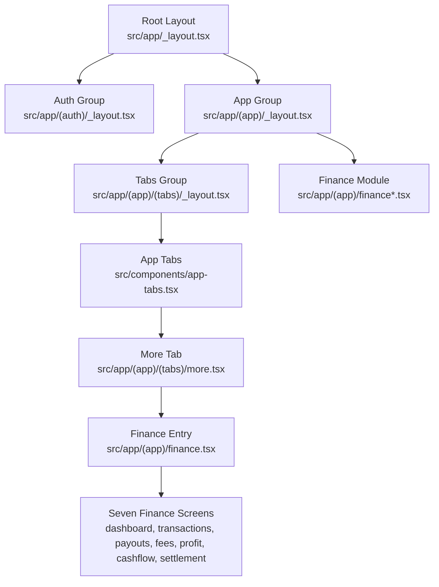
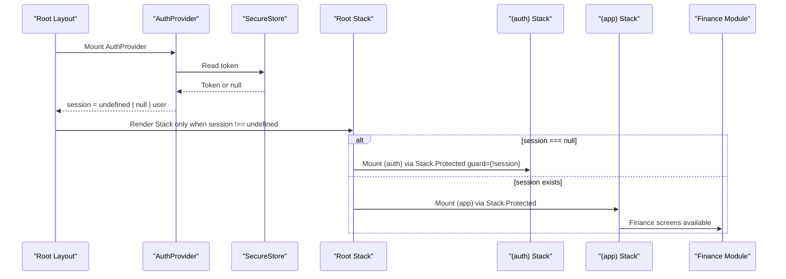
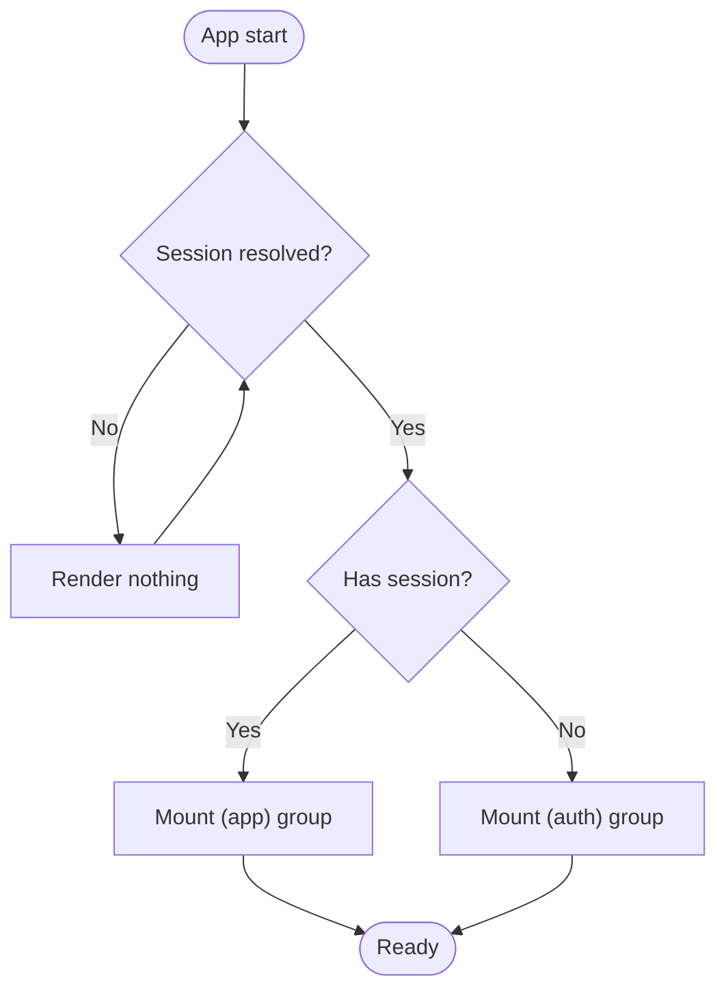
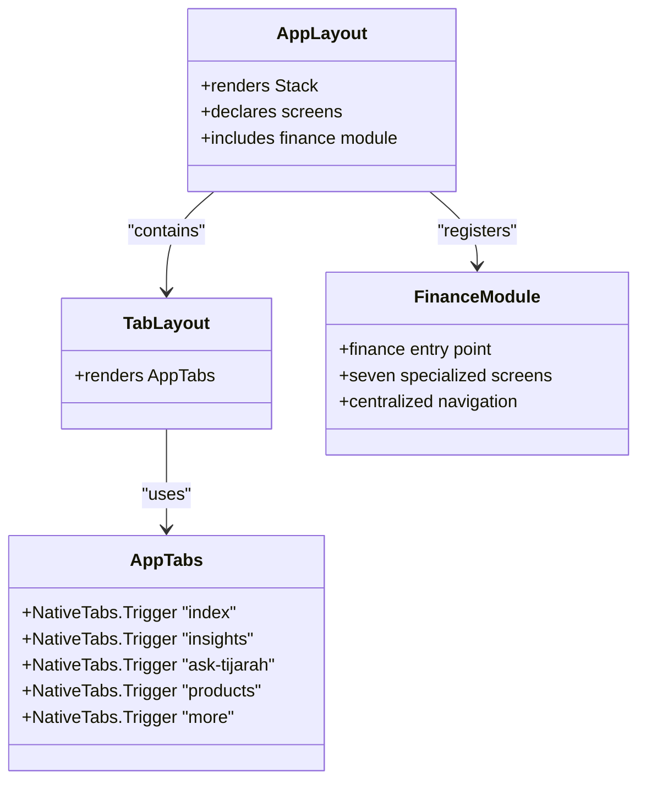
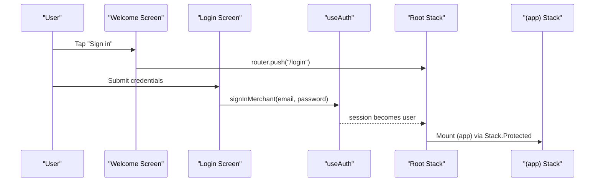
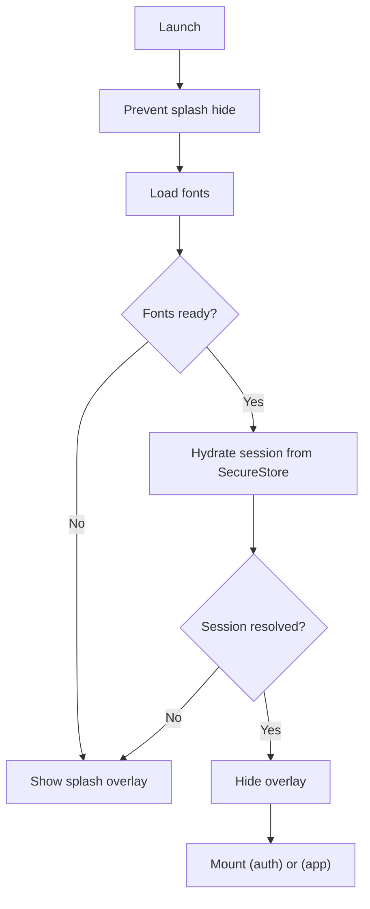
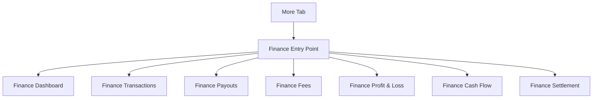
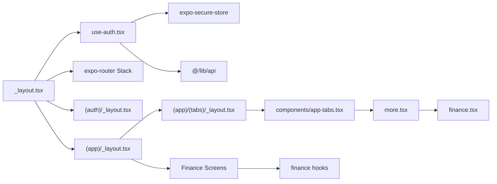

# Navigation Architecture

<cite>
**Referenced Files in This Document**
- [src/app/_layout.tsx](file://src/app/_layout.tsx)
- [src/app/(app)/_layout.tsx](file://src/app/(app)/_layout.tsx)
- [src/app/(auth)/_layout.tsx](file://src/app/(auth)/_layout.tsx)
- [src/app/(app)/(tabs)/_layout.tsx](file://src/app/(app)/(tabs)/_layout.tsx)
- [src/hooks/use-auth.tsx](file://src/hooks/use-auth.tsx)
- [src/components/app-tabs.tsx](file://src/components/app-tabs.tsx)
- [src/app/(app)/(tabs)/index.tsx](file://src/app/(app)/(tabs)/index.tsx)
- [src/app/(app)/(tabs)/more.tsx](file://src/app/(app)/(tabs)/more.tsx)
- [src/app/(auth)/welcome.tsx](file://src/app/(auth)/welcome.tsx)
- [src/app/(auth)/login.tsx](file://src/app/(auth)/login.tsx)
- [src/lib/catalog-navigation.ts](file://src/lib/catalog-navigation.ts)
- [src/app/(app)/finance.tsx](file://src/app/(app)/finance.tsx)
- [src/app/(app)/finance-dashboard.tsx](file://src/app/(app)/finance-dashboard.tsx)
- [src/hooks/use-finance-dashboard.ts](file://src/hooks/use-finance-dashboard.ts)
</cite>

## Update Summary
**Changes Made**
- Added comprehensive documentation for the integrated finance navigation system
- Updated app group layout to include seven specialized finance screens
- Documented the finance entry point and navigation patterns from the "More" tab
- Added detailed coverage of finance-specific routing and state management
- Enhanced navigation flow documentation to include finance feature access

## Table of Contents
1. Introduction
2. Project Structure
3. Core Components
4. Architecture Overview
5. Detailed Component Analysis
6. Finance Navigation System
7. Dependency Analysis
8. Performance Considerations
9. Troubleshooting Guide
10. Conclusion

## Introduction
This document explains the navigation architecture of Tijarah AI App built with Expo Router. It covers:
- File-based routing using Expo Router groups and stacks
- Authentication-based navigation at the root level using Stack.Protected guards
- Tab-based navigation inside the authenticated app group
- **New**: Integrated finance navigation system with dedicated entry point and seven specialized finance screens
- The end-to-end flow from splash screen through authentication to main app screens
- Route definitions, navigation patterns, and how navigation state is managed across app states

## Project Structure
The app uses Expo Router's file-based routing with two top-level route groups:
- (auth): Unauthenticated screens such as welcome, login, signup
- (app): Authenticated screens including a tab navigator, finance module, and feature stacks

At the root layout, a single Stack decides which group to mount based on the current session. Inside the authenticated group, a nested stack hosts a tabs group plus additional feature screens including the comprehensive finance module.

**Diagram sources**
- [src/app/_layout.tsx:64-80](file://src/app/_layout.tsx#L64-L80)
- [src/app/(auth)/_layout.tsx:6-13](file://src/app/(auth)/_layout.tsx#L6-L13)
- [src/app/(app)/_layout.tsx:6-21](file://src/app/(app)/_layout.tsx#L6-L21)
- [src/app/(app)/(tabs)/_layout.tsx:5-7](file://src/app/(app)/(tabs)/_layout.tsx#L5-L7)
- [src/components/app-tabs.tsx:7-64](file://src/components/app-tabs.tsx#L7-L64)
- [src/app/(app)/(tabs)/more.tsx:24-25](file://src/app/(app)/(tabs)/more.tsx#L24-L25)
- [src/app/(app)/finance.tsx:19-62](file://src/app/(app)/finance.tsx#L19-L62)

**Section sources**
- [src/app/_layout.tsx:18-81](file://src/app/_layout.tsx#L18-L81)
- [src/app/(auth)/_layout.tsx:1-14](file://src/app/(auth)/_layout.tsx#L1-L14)
- [src/app/(app)/_layout.tsx:1-31](file://src/app/(app)/_layout.tsx#L1-L31)
- [src/app/(app)/(tabs)/_layout.tsx:1-8](file://src/app/(app)/(tabs)/_layout.tsx#L1-L8)

## Core Components
- Root layout and shell:
  - Provides theme provider and auth provider
  - Shows an animated splash overlay until SecureStore resolves
  - Renders a root Stack that mounts either (auth) or (app) via Stack.Protected
- Auth context:
  - Hydrates session from a stored token
  - Exposes sign-in, sign-up, and sign-out
  - Emits undefined while loading, null when not logged in, and user object when authenticated
- Auth group:
  - Declares unauthenticated routes: welcome, login, signup
- App group:
  - Declares authenticated routes: tabs, store flows, profile, notifications, product details, catalog detail, **and comprehensive finance module**
- Tabs group:
  - Hosts NativeTabs for Home, Insights, Ask Tijarah, Products, More
- **Finance module:**
  - Centralized finance entry point with grid navigation
  - Seven specialized finance screens: dashboard, transactions, payouts, fees, profit, cashflow, settlement

Key behaviors:
- While session is undefined, the root renders nothing to avoid flashing any group before auth state is known
- When session changes, the inactive group is fully unmounted, clearing its navigation history and preventing back-navigation leaks across the auth boundary
- **Finance navigation provides centralized access to all financial analytics through a dedicated entry point accessible from the "More" tab**

**Section sources**
- [src/app/_layout.tsx:18-81](file://src/app/_layout.tsx#L18-L81)
- [src/hooks/use-auth.tsx:31-81](file://src/hooks/use-auth.tsx#L31-L81)
- [src/app/(auth)/_layout.tsx:6-13](file://src/app/(auth)/_layout.tsx#L6-L13)
- [src/app/(app)/_layout.tsx:6-31](file://src/app/(app)/_layout.tsx#L6-L31)
- [src/app/(app)/(tabs)/_layout.tsx:5-7](file://src/app/(app)/(tabs)/_layout.tsx#L5-L7)
- [src/app/(app)/finance.tsx:19-62](file://src/app/(app)/finance.tsx#L19-L62)

## Architecture Overview
The navigation architecture centers on a single root Stack that conditionally mounts one of two mutually exclusive branches:
- Protected branch for authenticated users: (app)
- Protected branch for unauthenticated users: (auth)

Inside (app), a nested Stack hosts a tabs group, several feature screens, **and a comprehensive finance module**. The tabs group renders a native tab bar with five destinations. **The finance module provides centralized access to seven specialized financial analytics screens.**

**Diagram sources**
- [src/app/_layout.tsx:35-80](file://src/app/_layout.tsx#L35-L80)
- [src/hooks/use-auth.tsx:35-53](file://src/hooks/use-auth.tsx#L35-L53)
- [src/app/(app)/_layout.tsx:20-27](file://src/app/(app)/_layout.tsx#L20-L27)

**Section sources**
- [src/app/_layout.tsx:35-80](file://src/app/_layout.tsx#L35-L80)
- [src/hooks/use-auth.tsx:31-81](file://src/hooks/use-auth.tsx#L31-L81)

## Detailed Component Analysis

### Root Navigation and Authentication Guards
- The root Stack uses Stack.Protected to mount either (auth) or (app) based on session
- While session is undefined, no group is mounted to prevent flash
- Switching session unmounts the inactive group entirely, clearing its history and preventing back-navigation leaks

**Diagram sources**
- [src/app/_layout.tsx:44-80](file://src/app/_layout.tsx#L44-L80)

**Section sources**
- [src/app/_layout.tsx:44-80](file://src/app/_layout.tsx#L44-L80)

### Authenticated App Group and Tabs
- The (app) group defines a Stack with the tabs group, feature screens, **and comprehensive finance module**
- The tabs group renders a NativeTabs component with five triggers mapped to routes: index (Home), insights, ask-tijarah, products, more
- Each tab trigger corresponds to a file under (app)/(tabs)
- **Finance screens are registered directly in the app group stack for direct navigation access**

**Diagram sources**
- [src/app/(app)/_layout.tsx:6-31](file://src/app/(app)/_layout.tsx#L6-L31)
- [src/app/(app)/(tabs)/_layout.tsx:5-7](file://src/app/(app)/(tabs)/_layout.tsx#L5-L7)
- [src/components/app-tabs.tsx:7-64](file://src/components/app-tabs.tsx#L7-L64)
- [src/app/(app)/finance.tsx:19-62](file://src/app/(app)/finance.tsx#L19-L62)

**Section sources**
- [src/app/(app)/_layout.tsx:6-31](file://src/app/(app)/_layout.tsx#L6-L31)
- [src/app/(app)/(tabs)/_layout.tsx:5-7](file://src/app/(app)/(tabs)/_layout.tsx#L5-L7)
- [src/components/app-tabs.tsx:7-64](file://src/components/app-tabs.tsx#L7-L64)

### Unauthenticated Flow and Screens
- The (auth) group declares welcome, login, and signup
- Welcome navigates to signup or login using router.push
- Login calls sign-in and relies on auth context to set session; once session is set, root navigation switches to (app)

**Diagram sources**
- [src/app/(auth)/welcome.tsx:58-79](file://src/app/(auth)/welcome.tsx#L58-L79)
- [src/app/(auth)/login.tsx:28-39](file://src/app/(auth)/login.tsx#L28-L39)
- [src/hooks/use-auth.tsx:66-70](file://src/hooks/use-auth.tsx#L66-L70)
- [src/app/_layout.tsx:64-80](file://src/app/_layout.tsx#L64-L80)

**Section sources**
- [src/app/(auth)/welcome.tsx:58-79](file://src/app/(auth)/welcome.tsx#L58-L79)
- [src/app/(auth)/login.tsx:28-39](file://src/app/(auth)/login.tsx#L28-L39)
- [src/hooks/use-auth.tsx:66-70](file://src/hooks/use-auth.tsx#L66-L70)
- [src/app/_layout.tsx:64-80](file://src/app/_layout.tsx#L64-L80)

### Navigation Patterns and Examples
- Programmatic navigation within screens uses router.push with pathname and optional params
  - Example: navigate to notifications from dashboard
  - Example: navigate to product detail with params
  - Example: navigate to catalog product detail with serialized payload
- Link components can open external URLs in-app browser on native platforms
- **Finance navigation uses centralized entry point with grid-based navigation to specialized screens**

Examples by path:
- Dashboard to notifications: [src/app/(app)/(tabs)/index.tsx:138-152](file://src/app/(app)/(tabs)/index.tsx#L138-L152)
- Dashboard to product form: [src/app/(app)/(tabs)/index.tsx:224-234](file://src/app/(app)/(tabs)/index.tsx#L224-L234)
- Dashboard to product detail with params: [src/app/(app)/(tabs)/index.tsx:264-272](file://src/app/(app)/(tabs)/index.tsx#L264-L272)
- **More tab to finance entry point: [src/app/(app)/(tabs)/more.tsx:25](file://src/app/(app)/(tabs)/more.tsx#L25)**
- **Finance entry to specialized screens: [src/app/(app)/finance.tsx:77-81](file://src/app/(app)/finance.tsx#L77-L81)**
- Catalog navigation helper: [src/lib/catalog-navigation.ts:7-12](file://src/lib/catalog-navigation.ts#L7-L12)

**Section sources**
- [src/app/(app)/(tabs)/index.tsx:138-152](file://src/app/(app)/(tabs)/index.tsx#L138-L152)
- [src/app/(app)/(tabs)/index.tsx:224-234](file://src/app/(app)/(tabs)/index.tsx#L224-L234)
- [src/app/(app)/(tabs)/index.tsx:264-272](file://src/app/(app)/(tabs)/index.tsx#L264-L272)
- [src/app/(app)/(tabs)/more.tsx:24-25](file://src/app/(app)/(tabs)/more.tsx#L24-L25)
- [src/app/(app)/finance.tsx:77-81](file://src/app/(app)/finance.tsx#L77-L81)
- [src/lib/catalog-navigation.ts:7-12](file://src/lib/catalog-navigation.ts#L7-L12)

### Splash Screen and Initial Load
- The root layout prevents auto-hide of the splash screen and shows an animated overlay until fonts load and SecureStore resolves
- Once fonts are loaded and session is resolved, the overlay hides and the appropriate group mounts

**Diagram sources**
- [src/app/_layout.tsx:13-41](file://src/app/_layout.tsx#L13-L41)
- [src/hooks/use-auth.tsx:35-53](file://src/hooks/use-auth.tsx#L35-L53)

**Section sources**
- [src/app/_layout.tsx:13-41](file://src/app/_layout.tsx#L13-L41)
- [src/hooks/use-auth.tsx:35-53](file://src/hooks/use-auth.tsx#L35-L53)

## Finance Navigation System

### Finance Entry Point and Navigation Hub
The finance module provides a centralized entry point accessible from the "More" tab, featuring a grid-based navigation interface to seven specialized finance screens:

- **Dashboard**: Comprehensive overview of revenue, profit, fees, and cash flow
- **Transactions**: Browse and filter all Daraz transactions
- **Payouts**: Track payout statements and status
- **Fee Breakdown**: Commission, shipping, penalties and discounts analysis
- **Profit & Loss**: Revenue vs costs with margin analysis
- **Cash Flow**: Daily inflow and outflow trends
- **Settlement**: Settlement tracking and management

**Diagram sources**
- [src/app/(app)/(tabs)/more.tsx:25](file://src/app/(app)/(tabs)/more.tsx#L25)
- [src/app/(app)/finance.tsx:19-62](file://src/app/(app)/finance.tsx#L19-L62)

### Finance Screen Implementation
Each finance screen follows a consistent pattern:
- Uses custom hooks for data management (e.g., `useFinancialDashboard`, `useCashFlow`)
- Implements error handling with retry functionality
- Provides loading states with skeleton components
- Uses shared finance UI components for consistency
- Integrates with authentication context for API access

### Finance Data Management
- **Authentication integration**: Finance screens use `useAuth` hook to access authentication tokens
- **Marketplace integration**: Leverages `useDarazAccessToken` for marketplace-specific data
- **Error handling**: Comprehensive error states with retry mechanisms
- **Loading states**: Skeleton loaders and empty states for better UX

**Section sources**
- [src/app/(app)/(tabs)/more.tsx:24-25](file://src/app/(app)/(tabs)/more.tsx#L24-L25)
- [src/app/(app)/finance.tsx:19-62](file://src/app/(app)/finance.tsx#L19-L62)
- [src/app/(app)/finance-dashboard.tsx:24-27](file://src/app/(app)/finance-dashboard.tsx#L24-L27)
- [src/hooks/use-finance-dashboard.ts:18-76](file://src/hooks/use-finance-dashboard.ts#L18-L76)

## Dependency Analysis
- Root layout depends on:
  - Theme provider for UI colors
  - Auth provider for session state
  - Animated splash overlay for UX during boot
  - Root Stack for conditional mounting
- Auth provider depends on:
  - SecureStore for persistent token
  - API functions to hydrate user and perform auth actions
- App and Auth groups depend on:
  - Expo Router Stack and Screen declarations
  - **Finance module dependencies for comprehensive financial analytics**
- Tabs group depends on:
  - NativeTabs and per-tab screens
  - **More tab with finance navigation integration**

**Diagram sources**
- [src/app/_layout.tsx:1-41](file://src/app/_layout.tsx#L1-L41)
- [src/hooks/use-auth.tsx:1-11](file://src/hooks/use-auth.tsx#L1-L11)
- [src/app/(auth)/_layout.tsx:1-13](file://src/app/(auth)/_layout.tsx#L1-L13)
- [src/app/(app)/_layout.tsx:1-31](file://src/app/(app)/_layout.tsx#L1-L31)
- [src/app/(app)/(tabs)/_layout.tsx:1-8](file://src/app/(app)/(tabs)/_layout.tsx#L1-L8)
- [src/components/app-tabs.tsx:1-65](file://src/components/app-tabs.tsx#L1-L65)
- [src/app/(app)/(tabs)/more.tsx:1-59](file://src/app/(app)/(tabs)/more.tsx#L1-L59)
- [src/app/(app)/finance.tsx:1-150](file://src/app/(app)/finance.tsx#L1-L150)
- [src/hooks/use-finance-dashboard.ts:1-76](file://src/hooks/use-finance-dashboard.ts#L1-L76)

**Section sources**
- [src/app/_layout.tsx:1-81](file://src/app/_layout.tsx#L1-L81)
- [src/hooks/use-auth.tsx:1-91](file://src/hooks/use-auth.tsx#L1-L91)
- [src/app/(auth)/_layout.tsx:1-14](file://src/app/(auth)/_layout.tsx#L1-L14)
- [src/app/(app)/_layout.tsx:1-31](file://src/app/(app)/_layout.tsx#L1-L31)
- [src/app/(app)/(tabs)/_layout.tsx:1-8](file://src/app/(app)/(tabs)/_layout.tsx#L1-L8)
- [src/components/app-tabs.tsx:1-65](file://src/components/app-tabs.tsx#L1-L65)
- [src/app/(app)/(tabs)/more.tsx:1-59](file://src/app/(app)/(tabs)/more.tsx#L1-L59)
- [src/app/(app)/finance.tsx:1-150](file://src/app/(app)/finance.tsx#L1-L150)
- [src/hooks/use-finance-dashboard.ts:1-76](file://src/hooks/use-finance-dashboard.ts#L1-L76)

## Performance Considerations
- Avoid rendering any group while session is undefined to prevent flashes
- Use Stack.Protected to mount entire groups rather than per-screen checks; this unmounts inactive groups and clears their navigation history efficiently
- Keep heavy work off the critical path: font loading and SecureStore hydration occur before rendering the active group
- Prefer programmatic navigation with router.push for deep links and parameterized routes to reduce re-renders
- **Finance module uses lazy loading patterns with skeleton components to maintain performance during data fetching**
- **Centralized finance navigation reduces redundant navigation logic and improves maintainability**

[No sources needed since this section provides general guidance]

## Troubleshooting Guide
Common issues and resolutions:
- Blank screen on launch:
  - Ensure session is resolved before mounting groups; root renders nothing while session is undefined
  - Verify SecureStore token retrieval and error handling in auth provider
- Back navigation leaking across auth boundary:
  - Confirm that only one group is mounted at a time via Stack.Protected; switching session should unmount the inactive group
- Unexpected redirects after sign-in:
  - Ensure sign-in sets session; root will then mount (app) automatically
- Deep link parameters lost:
  - Use router.push with explicit params and ensure target screens parse them correctly
- **Finance navigation issues:**
  - Verify finance screens are properly registered in the app group layout
  - Check that finance hooks have proper authentication context access
  - Ensure marketplace tokens are available for finance data requests

**Section sources**
- [src/app/_layout.tsx:44-80](file://src/app/_layout.tsx#L44-L80)
- [src/hooks/use-auth.tsx:35-53](file://src/hooks/use-auth.tsx#L35-L53)
- [src/lib/catalog-navigation.ts:20-33](file://src/lib/catalog-navigation.ts#L20-L33)
- [src/app/(app)/_layout.tsx:20-27](file://src/app/(app)/_layout.tsx#L20-L27)
- [src/hooks/use-finance-dashboard.ts:33-72](file://src/hooks/use-finance-dashboard.ts#L33-L72)

## Conclusion
Tijarah AI App uses a clean, scalable navigation architecture:
- A single root Stack controls access to two mutually exclusive groups based on authentication state
- Stack.Protected ensures secure, efficient mounting and unmounting of groups
- A nested tab structure organizes core features behind the authenticated boundary
- **Integrated finance navigation system provides centralized access to seven specialized financial analytics screens**
- Programmatic navigation with router.push enables flexible routing and parameter passing
- **Finance module demonstrates modular architecture with reusable components and hooks**
- Splash and auth hydration are coordinated to provide a smooth initial experience

The addition of the comprehensive finance navigation system enhances the app's capabilities by providing merchants with detailed financial insights through an intuitive, centralized interface accessible from the main application navigation.

[No sources needed since this section summarizes without analyzing specific files]