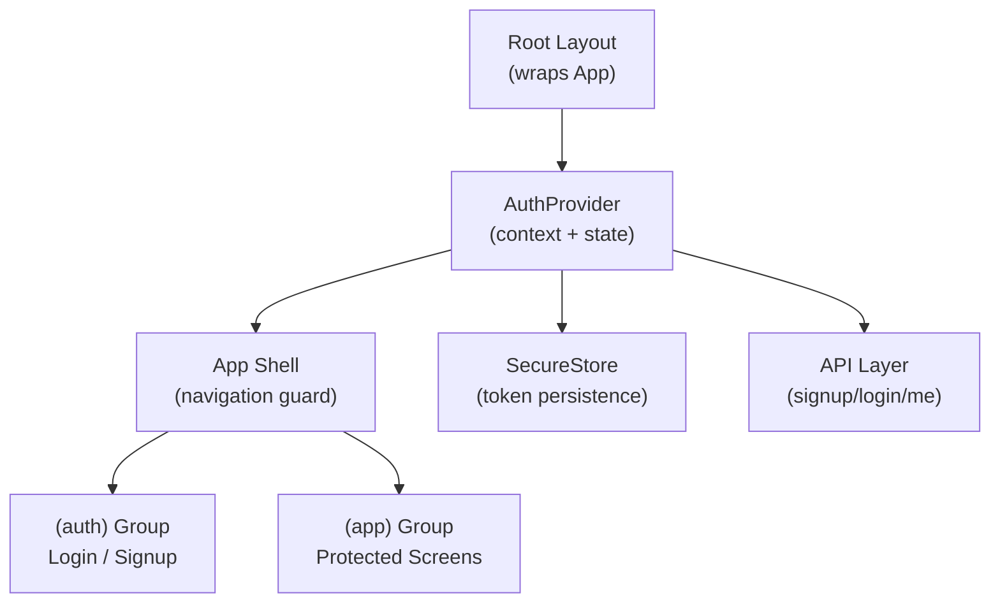
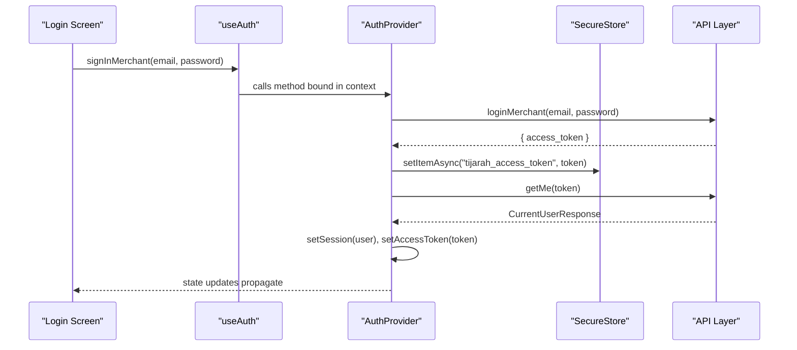
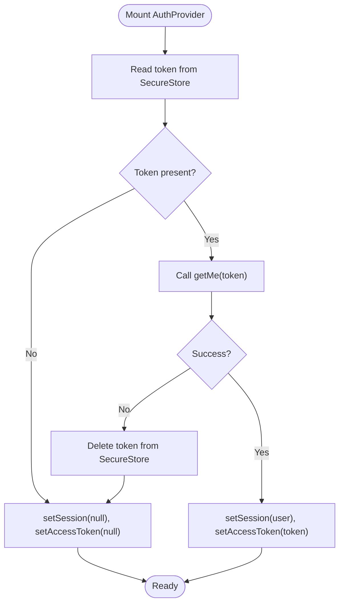
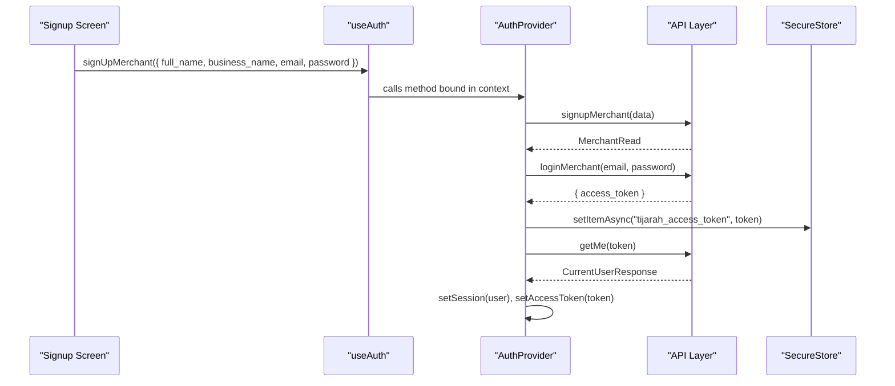
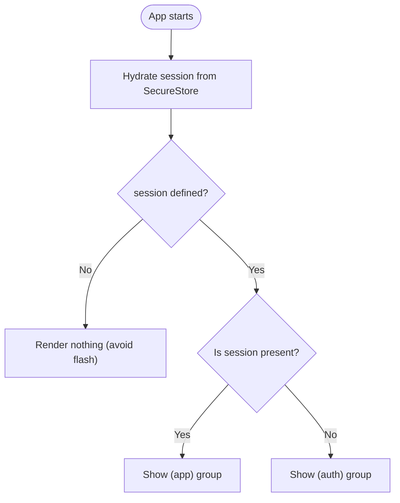
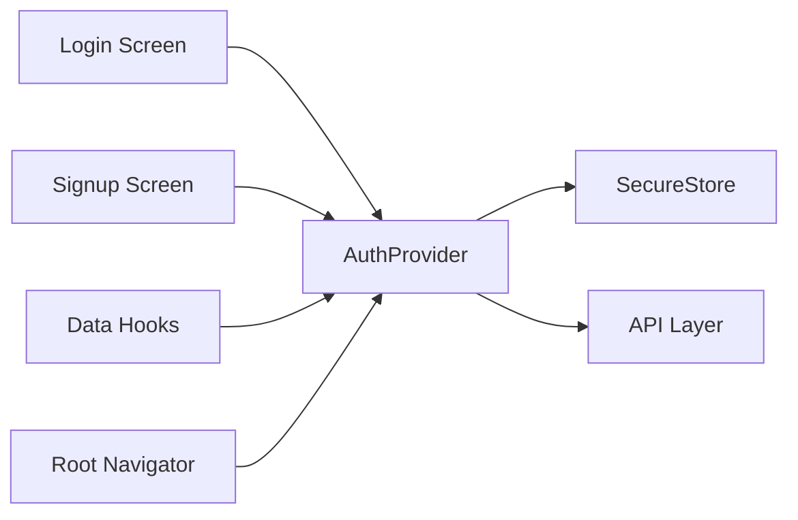

# Auth Context Provider

<cite>
**Referenced Files in This Document**
- [use-auth.tsx](file://src/hooks/use-auth.tsx)
- [_layout.tsx](file://src/app/_layout.tsx)
- [login.tsx](file://src/app/(auth)/login.tsx)
- [signup.tsx](file://src/app/(auth)/signup.tsx)
- [api.ts](file://src/lib/api.ts)
- [use-products.ts](file://src/hooks/use-products.ts)
</cite>

## Table of Contents
1. [Introduction](#introduction)
2. [Project Structure](#project-structure)
3. [Core Components](#core-components)
4. [Architecture Overview](#architecture-overview)
5. [Detailed Component Analysis](#detailed-component-analysis)
6. [Dependency Analysis](#dependency-analysis)
7. [Performance Considerations](#performance-considerations)
8. [Troubleshooting Guide](#troubleshooting-guide)
9. [Conclusion](#conclusion)

## Introduction
This document explains the authentication context provider implementation used to manage merchant sessions and access tokens across the application. It covers the AuthProvider component, the React context and state model for session and token, the useAuth hook that exposes authentication methods (signUpMerchant, signInMerchant, signOut), the initial token hydration on app launch, and how consuming components can read authentication state and protect routes.

## Project Structure
The authentication system is centered around a single hook file that creates a React context and provides authenticated state and actions. The root layout wraps the entire app with this provider so all screens can consume it. Authentication flows are implemented in dedicated auth screens, while protected areas are guarded at the router level using the session state.

**Diagram sources**
- [_layout.tsx:36-81](file://src/app/_layout.tsx#L36-L81)
- [use-auth.tsx:31-82](file://src/hooks/use-auth.tsx#L31-L82)
- [api.ts:317-342](file://src/lib/api.ts#L317-L342)

**Section sources**
- [_layout.tsx:36-81](file://src/app/_layout.tsx#L36-L81)
- [use-auth.tsx:31-82](file://src/hooks/use-auth.tsx#L31-L82)

## Core Components
- AuthProvider: Creates a React context, manages session and accessToken state, hydrates from SecureStore on mount, and exposes signUpMerchant, signInMerchant, and signOut.
- useAuth: Consumes the context and throws if used outside AuthProvider; returns the same value as provided by AuthProvider.
- API integration: Uses signupMerchant, loginMerchant, and getMe to perform authentication and profile retrieval.
- Token storage: Uses SecureStore to persist the access token across app launches.

Key responsibilities:
- Hydration: On first render, reads the stored token, validates it via getMe, and sets session and accessToken accordingly.
- State management: Holds session (user profile) and accessToken, both initially undefined until hydration completes.
- Actions: Encapsulate signing up, signing in, and signing out, including token persistence and session refresh.

**Section sources**
- [use-auth.tsx:15-29](file://src/hooks/use-auth.tsx#L15-L29)
- [use-auth.tsx:31-82](file://src/hooks/use-auth.tsx#L31-L82)
- [api.ts:317-342](file://src/lib/api.ts#L317-L342)

## Architecture Overview
The authentication flow integrates three layers:
- UI layer: Login and Signup screens call useAuth methods.
- Context layer: AuthProvider coordinates state changes and persists tokens.
- API layer: Performs network requests and returns typed responses or errors.

**Diagram sources**
- [use-auth.tsx:66-70](file://src/hooks/use-auth.tsx#L66-L70)
- [api.ts:325-342](file://src/lib/api.ts#L325-L342)

## Detailed Component Analysis

### AuthProvider: Context Creation and State Management
- Context creation: A typed context holds session, accessToken, and action functions.
- State:
  - session: User profile object or null/undefined during hydration.
  - accessToken: Bearer token string or null/undefined during hydration.
- Hydration effect:
  - Reads token from SecureStore.
  - If no token, sets session and accessToken to null.
  - If token exists, calls getMe to validate and populate session; on failure, clears token and resets state.
- Memoized context value:
  - useMemo ensures stable reference for consumers unless session or accessToken change.
  - Exposes signUpMerchant, signInMerchant, signOut.

**Diagram sources**
- [use-auth.tsx:35-53](file://src/hooks/use-auth.tsx#L35-L53)

**Section sources**
- [use-auth.tsx:15-29](file://src/hooks/use-auth.tsx#L15-L29)
- [use-auth.tsx:31-82](file://src/hooks/use-auth.tsx#L31-L82)

### useAuth Hook: Accessing Authentication Methods
- Provides session, accessToken, and methods to consume components.
- Throws an error if used outside AuthProvider to catch misconfiguration early.

Usage patterns:
- Reading session to determine navigation guards.
- Calling signUpMerchant/signInMerchant to authenticate.
- Using accessToken in data hooks to make authenticated requests.

**Section sources**
- [use-auth.tsx:84-88](file://src/hooks/use-auth.tsx#L84-L88)
- [use-products.ts:16-28](file://src/hooks/use-products.ts#L16-L28)

### Authentication Flows: Sign Up and Sign In
- Sign up:
  - Calls signupMerchant to create account.
  - Immediately logs in with credentials to obtain access token.
  - Persists token and hydrates session via getMe.
- Sign in:
  - Calls loginMerchant to obtain access token.
  - Persists token and hydrates session via getMe.

**Diagram sources**
- [use-auth.tsx:59-65](file://src/hooks/use-auth.tsx#L59-L65)
- [api.ts:317-342](file://src/lib/api.ts#L317-L342)

**Section sources**
- [use-auth.tsx:59-70](file://src/hooks/use-auth.tsx#L59-L70)
- [api.ts:317-342](file://src/lib/api.ts#L317-L342)

### Root Navigation Guard: Protecting Routes
- The root layout mounts AuthProvider and uses session to decide which route group to show.
- While session is undefined (hydration in progress), nothing is rendered to avoid flashing unauthenticated content.
- Protected groups:
  - (app): shown when session is truthy.
  - (auth): shown when session is falsy.

**Diagram sources**
- [_layout.tsx:44-81](file://src/app/_layout.tsx#L44-L81)

**Section sources**
- [_layout.tsx:44-81](file://src/app/_layout.tsx#L44-L81)

### Consuming Authentication in Child Components
- Login screen:
  - Retrieves signInMerchant from useAuth.
  - Validates form fields and calls signInMerchant on submit.
  - Displays ApiError messages when login fails.
- Signup screen:
  - Retrieves signUpMerchant from useAuth.
  - Validates form fields and calls signUpMerchant on submit.
  - Navigates to connect-stores after successful signup.
- Data hooks:
  - Use accessToken from useAuth to gate requests until hydration completes.

Examples of usage patterns:
- Wrapping application components:
  - Wrap the root with AuthProvider in the main layout so all children can consume authentication state.
- Accessing state in child components:
  - Call useAuth to read session and accessToken.
- Conditional rendering:
  - Render protected UI only when session is truthy; otherwise navigate to login/signup.

**Section sources**
- [login.tsx:15-39](file://src/app/(auth)/login.tsx#L15-L39)
- [signup.tsx:26-65](file://src/app/(auth)/signup.tsx#L26-L65)
- [use-products.ts:16-28](file://src/hooks/use-products.ts#L16-L28)

## Dependency Analysis
- AuthProvider depends on:
  - SecureStore for token persistence.
  - API module for signup, login, and profile retrieval.
- Consumers depend on:
  - useAuth to access session, accessToken, and actions.
- Router-level guards depend on:
  - session state to mount appropriate route groups.

**Diagram sources**
- [use-auth.tsx:31-82](file://src/hooks/use-auth.tsx#L31-L82)
- [_layout.tsx:44-81](file://src/app/_layout.tsx#L44-L81)

**Section sources**
- [use-auth.tsx:31-82](file://src/hooks/use-auth.tsx#L31-L82)
- [_layout.tsx:44-81](file://src/app/_layout.tsx#L44-L81)

## Performance Considerations
- useMemo optimization:
  - The context value is memoized based on session and accessToken to minimize re-renders in consumers.
- Avoid premature requests:
  - Data hooks wait for accessToken before making network calls to prevent unauthenticated requests during hydration.
- Efficient hydration:
  - Single SecureStore read on mount reduces redundant I/O.

[No sources needed since this section provides general guidance]

## Troubleshooting Guide
Common issues and resolutions:
- Invalid or expired token:
  - Hydration attempts getMe; on failure, the token is deleted and state resets to null. Ensure network connectivity and server availability.
- Missing AuthProvider:
  - useAuth throws if called outside AuthProvider. Verify the root layout wraps the app with AuthProvider.
- Form errors:
  - Login and Signup screens catch ApiError and display user-friendly messages. Check backend responses and input validation.
- Unauthenticated API calls:
  - Data hooks guard requests until accessToken is available. Ensure you do not bypass useAuth checks.

**Section sources**
- [use-auth.tsx:35-53](file://src/hooks/use-auth.tsx#L35-L53)
- [use-auth.tsx:84-88](file://src/hooks/use-auth.tsx#L84-L88)
- [login.tsx:28-39](file://src/app/(auth)/login.tsx#L28-L39)
- [signup.tsx:48-65](file://src/app/(auth)/signup.tsx#L48-L65)
- [use-products.ts:25-54](file://src/hooks/use-products.ts#L25-L54)

## Conclusion
The authentication context provider centralizes session and token management, offering a clean interface for authentication flows and protecting routes through session-based guards. By leveraging SecureStore for persistence, React context for state distribution, and memoization for performance, the implementation provides a robust foundation for authenticated experiences across the application.

[No sources needed since this section summarizes without analyzing specific files]