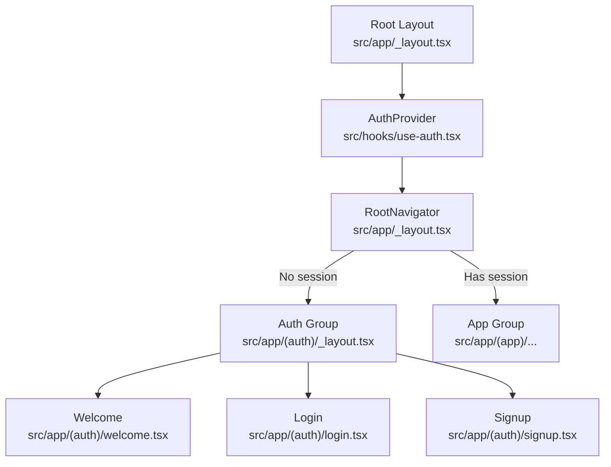
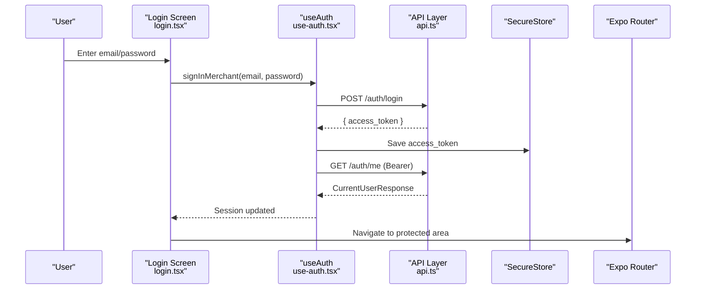
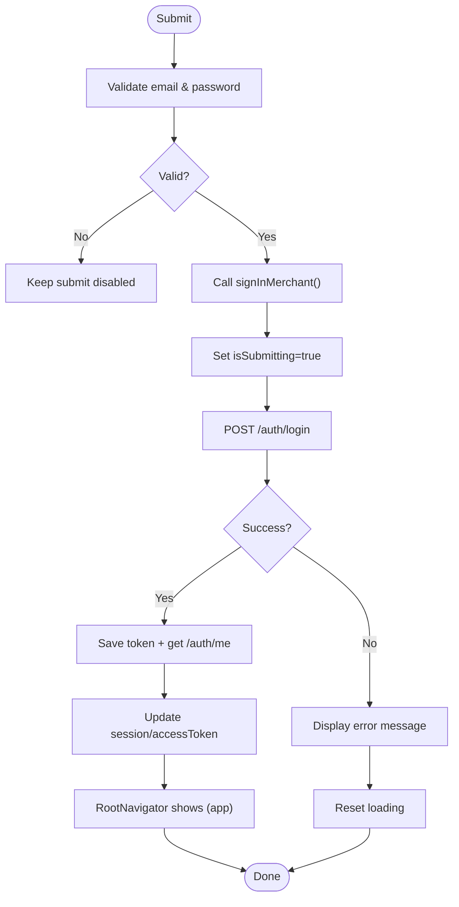
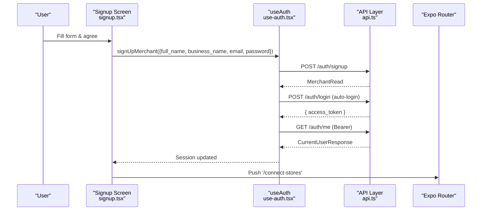
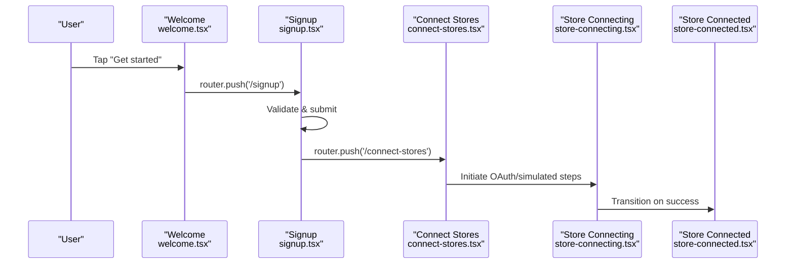
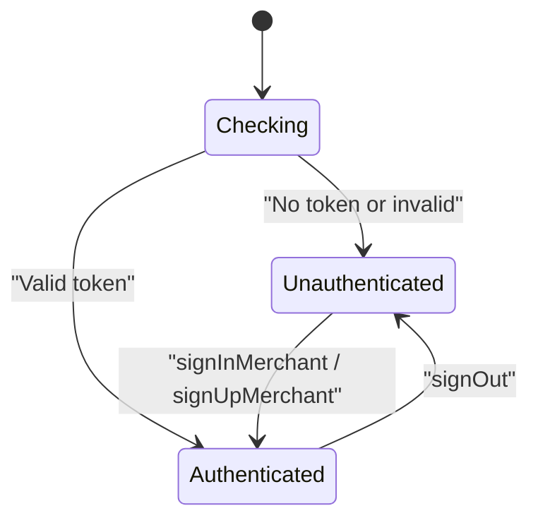
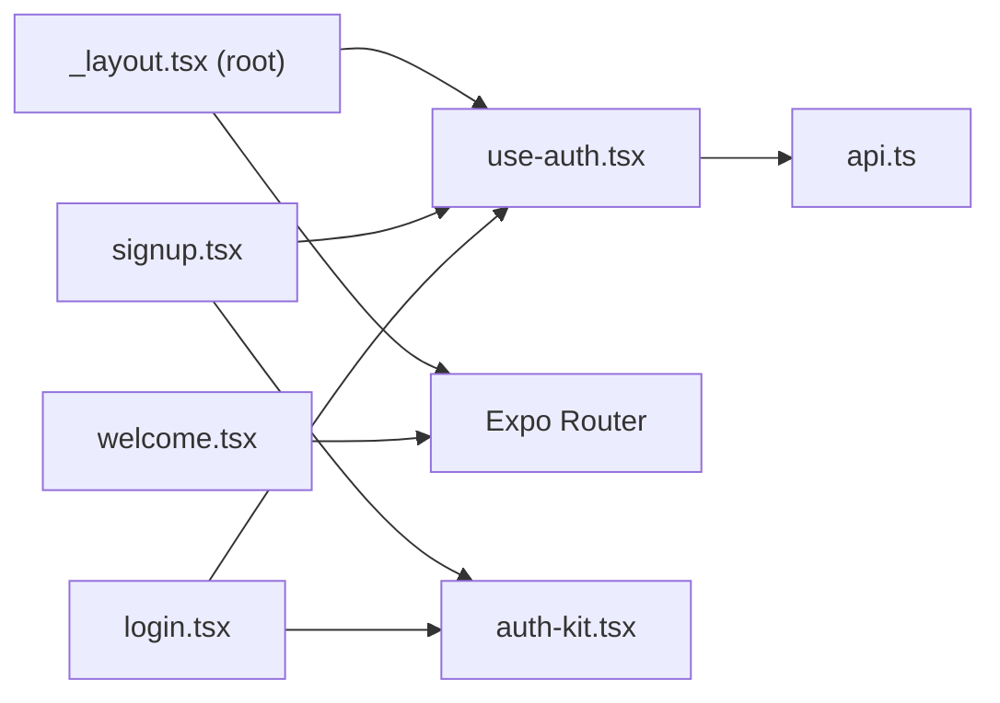

# Authentication Flow

<cite>
**Referenced Files in This Document**
- [login.tsx](file://src/app/(auth)/login.tsx)
- [signup.tsx](file://src/app/(auth)/signup.tsx)
- [welcome.tsx](file://src/app/(auth)/welcome.tsx)
- [_layout.tsx (auth)](file://src/app/(auth)/_layout.tsx)
- [_layout.tsx (root)](file://src/app/_layout.tsx)
- [use-auth.tsx](file://src/hooks/use-auth.tsx)
- [api.ts](file://src/lib/api.ts)
- [auth-kit.tsx](file://src/components/auth-kit.tsx)
- [connect-stores.tsx](file://src/app/(app)/connect-stores.tsx)
- [store-connecting.tsx](file://src/app/(app)/store-connecting.tsx)
- [store-connected.tsx](file://src/app/(app)/store-connected.tsx)
</cite>

## Table of Contents
1. [Introduction](#introduction)
2. [Project Structure](#project-structure)
3. [Core Components](#core-components)
4. [Architecture Overview](#architecture-overview)
5. [Detailed Component Analysis](#detailed-component-analysis)
6. [Dependency Analysis](#dependency-analysis)
7. [Performance Considerations](#performance-considerations)
8. [Troubleshooting Guide](#troubleshooting-guide)
9. [Conclusion](#conclusion)
10. [Appendices](#appendices)

## Introduction
This document explains the complete authentication flow from unauthenticated entry to authenticated application access. It covers:
- Login and signup screens, including form validation, error handling, and navigation patterns
- The welcome screen for new users and how it integrates with onboarding
- API integration for authentication endpoints
- State management during authentication (loading, success, error)
- Redirects based on authentication status

## Project Structure
The authentication experience is split into two mutually exclusive route groups:
- (auth): Welcome, login, signup
- (app): Protected routes after successful authentication

At app startup, a root layout mounts an AuthProvider that hydrates session state from secure storage. Based on whether a valid session exists, the root navigator renders either the protected (app) group or the unauthenticated (auth) group.

**Diagram sources**
- [_layout.tsx (root):18-81](file://src/app/_layout.tsx#L18-L81)
- [_layout.tsx (auth):1-15](file://src/app/(auth)/_layout.tsx#L1-L15)

**Section sources**
- [_layout.tsx (root):18-81](file://src/app/_layout.tsx#L18-L81)
- [_layout.tsx (auth):1-15](file://src/app/(auth)/_layout.tsx#L1-L15)

## Core Components
- Auth context and persistence:
  - Provides session, accessToken, signUpMerchant, signInMerchant, signOut
  - Persists token securely and hydrates user profile on launch
- API layer:
  - Encapsulates HTTP requests, SSE streaming, and typed endpoints for auth
  - Centralizes error extraction and network failure handling
- UI kit:
  - Reusable form scaffold, fields, password visibility toggle, brand mark, Google button, animated pressable

Key responsibilities:
- use-auth.tsx: manages auth state, token lifecycle, and hydration
- api.ts: implements /auth/signup, /auth/login, /auth/me and error handling
- auth-kit.tsx: shared UI primitives used by login, signup, and other flows

**Section sources**
- [use-auth.tsx:15-81](file://src/hooks/use-auth.tsx#L15-L81)
- [api.ts:5-77](file://src/lib/api.ts#L5-L77)
- [api.ts:317-342](file://src/lib/api.ts#L317-L342)
- [auth-kit.tsx:65-200](file://src/components/auth-kit.tsx#L65-L200)

## Architecture Overview
The authentication architecture uses React Context for state, SecureStore for persistence, and Expo Router for navigation. The root navigator conditionally mounts either the (auth) or (app) stack based on session state.

**Diagram sources**
- [login.tsx:28-39](file://src/app/(auth)/login.tsx#L28-L39)
- [use-auth.tsx:66-71](file://src/hooks/use-auth.tsx#L66-L71)
- [api.ts:325-342](file://src/lib/api.ts#L325-L342)

**Section sources**
- [_layout.tsx (root):58-81](file://src/app/_layout.tsx#L58-L81)
- [use-auth.tsx:31-81](file://src/hooks/use-auth.tsx#L31-L81)

## Detailed Component Analysis

### Welcome Screen Flow
Purpose:
- Introduce the product value proposition
- Provide clear paths to sign up or sign in

Behavior:
- Renders hero content and channel convergence graphic
- Navigates to signup via router.push('/signup')
- Allows returning users to navigate to login via router.push('/login')

Navigation:
- Uses Expo Router to move between welcome, signup, and login

Accessibility:
- Respects reduced motion settings for animations

**Section sources**
- [welcome.tsx:15-85](file://src/app/(auth)/welcome.tsx#L15-L85)

### Login Screen
Form validation:
- Email format validated using a regex pattern
- Password must be non-empty
- Submit disabled while submitting or when invalid

State management:
- Local state tracks email, password, visibility, submission, and form errors
- Disables submit during network request

Error handling:
- Catches ApiError from useAuth.signInMerchant
- Displays user-friendly message; falls back to generic message

Navigation:
- On success, navigation is handled by the root navigator switching to the (app) group
- Includes “Forgot password?” link placeholder
- Links to signup via router.replace('/signup')

UI:
- Uses AuthFormScaffold, AuthField, PasswordVisibilityToggle, PressableScale, OrDivider, GoogleButton

**Diagram sources**
- [login.tsx:25-39](file://src/app/(auth)/login.tsx#L25-L39)
- [use-auth.tsx:66-71](file://src/hooks/use-auth.tsx#L66-L71)
- [api.ts:325-342](file://src/lib/api.ts#L325-L342)

**Section sources**
- [login.tsx:15-127](file://src/app/(auth)/login.tsx#L15-L127)
- [auth-kit.tsx:120-200](file://src/components/auth-kit.tsx#L120-L200)

### Signup Screen
Form validation:
- Full name required
- Business name length > 1
- Email format validated
- Password minimum length enforced
- Terms checkbox required
- Submit disabled while submitting or when invalid

Password strength:
- Real-time feedback with visual meter
- Strength categories: Weak, Good, Strong

State management:
- Tracks full name, business name, email, password, visibility, agreement, submission, and form errors

Error handling:
- Catches ApiError from useAuth.signUpMerchant
- Displays user-friendly message; falls back to generic message

Navigation:
- On success, navigates to connect-stores for onboarding
- Includes “Sign up with Google” placeholder
- Links to login via router.replace('/login')

**Diagram sources**
- [signup.tsx:48-65](file://src/app/(auth)/signup.tsx#L48-L65)
- [use-auth.tsx:59-65](file://src/hooks/use-auth.tsx#L59-L65)
- [api.ts:317-342](file://src/lib/api.ts#L317-L342)

**Section sources**
- [signup.tsx:26-200](file://src/app/(auth)/signup.tsx#L26-L200)
- [auth-kit.tsx:202-257](file://src/components/auth-kit.tsx#L202-L257)

### Welcome Screen Integration with Onboarding
- Welcome provides a high-level introduction and directs users to signup
- After signup, the flow continues into store connection onboarding
- The onboarding process includes connecting marketplaces and confirming connections

**Diagram sources**
- [welcome.tsx:58-80](file://src/app/(auth)/welcome.tsx#L58-L80)
- [signup.tsx:53-60](file://src/app/(auth)/signup.tsx#L53-L60)
- [connect-stores.tsx:25-33](file://src/app/(app)/connect-stores.tsx#L25-L33)
- [store-connecting.tsx:19-89](file://src/app/(app)/store-connecting.tsx#L19-L89)
- [store-connected.tsx:14-31](file://src/app/(app)/store-connected.tsx#L14-L31)

**Section sources**
- [welcome.tsx:15-85](file://src/app/(auth)/welcome.tsx#L15-L85)
- [connect-stores.tsx:25-33](file://src/app/(app)/connect-stores.tsx#L25-L33)
- [store-connecting.tsx:19-89](file://src/app/(app)/store-connecting.tsx#L19-L89)
- [store-connected.tsx:14-31](file://src/app/(app)/store-connected.tsx#L14-L31)

### Authentication State Management and Redirects
- Initial state:
  - session and accessToken are undefined until SecureStore is read
- Hydration:
  - On mount, reads stored token, validates via /auth/me, sets session and token
  - Invalid/expired tokens are cleared automatically
- Successful auth:
  - Tokens saved to SecureStore
  - Session hydrated; root navigator switches to (app) group
- Sign out:
  - Clears token and resets session to null
- Navigation guards:
  - Root navigator conditionally mounts (auth) or (app) stacks using Stack.Protected

**Diagram sources**
- [use-auth.tsx:31-53](file://src/hooks/use-auth.tsx#L31-L53)
- [_layout.tsx (root):58-81](file://src/app/_layout.tsx#L58-L81)

**Section sources**
- [use-auth.tsx:31-81](file://src/hooks/use-auth.tsx#L31-L81)
- [_layout.tsx (root):58-81](file://src/app/_layout.tsx#L58-L81)

## Dependency Analysis
- Screens depend on:
  - useAuth for actions and state
  - API layer for endpoints and error types
  - AuthKit for consistent UI components
- API layer depends on:
  - Constants for base URL
  - Platform-specific streaming behavior
- Root layout depends on:
  - AuthProvider to gate navigation

**Diagram sources**
- [login.tsx:1-12](file://src/app/(auth)/login.tsx#L1-L12)
- [signup.tsx:1-12](file://src/app/(auth)/signup.tsx#L1-L12)
- [welcome.tsx:1-13](file://src/app/(auth)/welcome.tsx#L1-L13)
- [use-auth.tsx:1-12](file://src/hooks/use-auth.tsx#L1-L12)
- [api.ts:1-4](file://src/lib/api.ts#L1-L4)
- [auth-kit.tsx:1-29](file://src/components/auth-kit.tsx#L1-L29)
- [_layout.tsx (root):1-12](file://src/app/_layout.tsx#L1-L12)

**Section sources**
- [login.tsx:1-12](file://src/app/(auth)/login.tsx#L1-L12)
- [signup.tsx:1-12](file://src/app/(auth)/signup.tsx#L1-L12)
- [welcome.tsx:1-13](file://src/app/(auth)/welcome.tsx#L1-L13)
- [use-auth.tsx:1-12](file://src/hooks/use-auth.tsx#L1-L12)
- [api.ts:1-4](file://src/lib/api.ts#L1-L4)
- [auth-kit.tsx:1-29](file://src/components/auth-kit.tsx#L1-L29)
- [_layout.tsx (root):1-12](file://src/app/_layout.tsx#L1-L12)

## Performance Considerations
- Avoid unnecessary re-renders:
  - Form inputs update local state only; submit logic is guarded by canSubmit
- Minimize network calls:
  - Token hydration occurs once at app start
  - Subsequent sessions rely on cached token until expiration
- Respect reduced motion:
  - Animations are skipped when OS setting prefers reduced motion
- Efficient error parsing:
  - Centralized error extraction reduces duplication and improves consistency

[No sources needed since this section provides general guidance]

## Troubleshooting Guide
Common issues and resolutions:
- Network unreachable:
  - API layer throws ApiError with a friendly message; ensure device connectivity and correct API_BASE_URL
- Invalid or expired token:
  - AuthProvider clears token and resets session; prompt user to sign in again
- Form submission fails:
  - Check field validation rules and ensure terms are agreed on signup
  - Inspect ApiError details for server-side validation messages
- Navigation not updating:
  - Confirm root navigator has finished hydrating session before expecting protected routes
- Store connection failures:
  - For Shopify, verify shop domain input and OAuth flow completion
  - For other platforms, confirm simulated steps complete and redirect to connected state

**Section sources**
- [api.ts:53-77](file://src/lib/api.ts#L53-L77)
- [use-auth.tsx:35-53](file://src/hooks/use-auth.tsx#L35-L53)
- [signup.tsx:48-65](file://src/app/(auth)/signup.tsx#L48-L65)
- [store-connecting.tsx:19-89](file://src/app/(app)/store-connecting.tsx#L19-L89)

## Conclusion
The authentication flow is designed around a clean separation of concerns:
- UI screens handle validation and user interactions
- use-auth centralizes state and token lifecycle
- api.ts encapsulates networking and error handling
- Root navigation ensures users see the correct screens based on authentication status

This structure supports a smooth user journey from welcome through signup/login to onboarding and protected app access, with robust error handling and clear redirects.

[No sources needed since this section summarizes without analyzing specific files]

## Appendices

### API Endpoints Used by Authentication
- POST /auth/signup
- POST /auth/login
- GET /auth/me

These are implemented in the API layer and consumed by the auth context.

**Section sources**
- [api.ts:317-342](file://src/lib/api.ts#L317-L342)