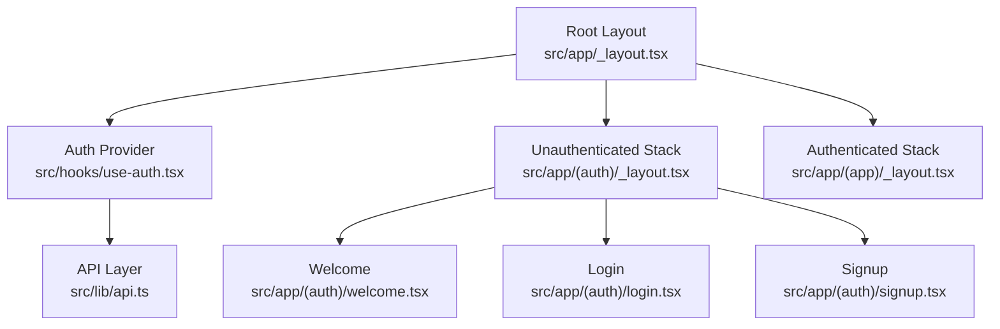
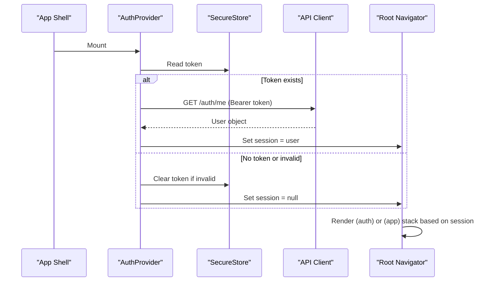
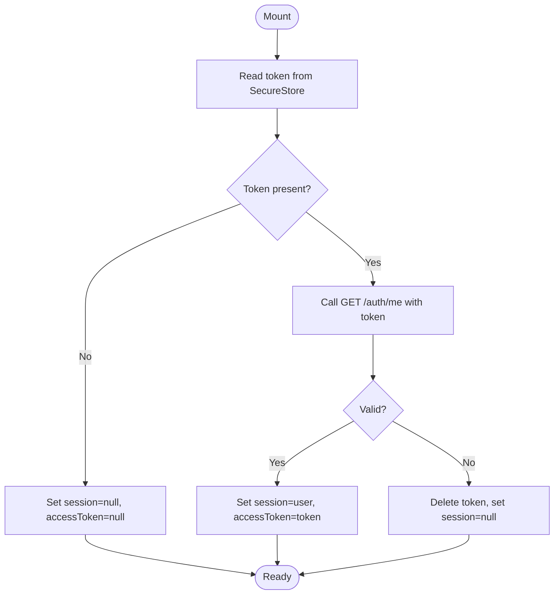
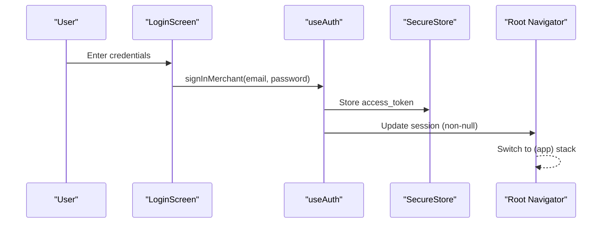
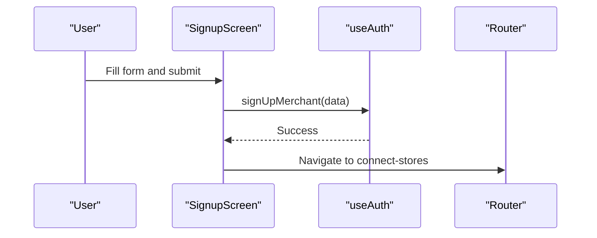
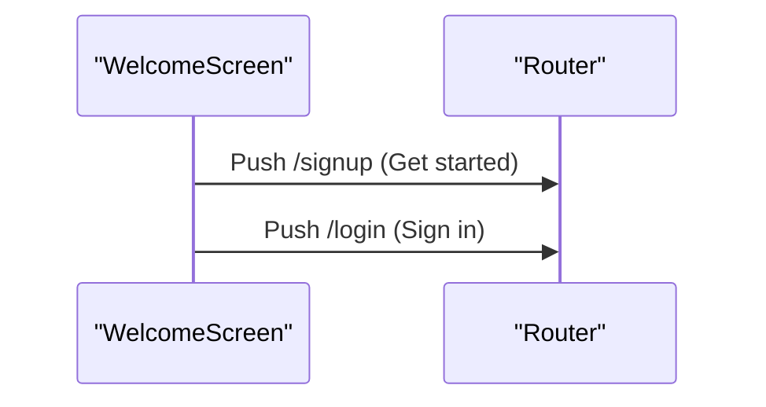
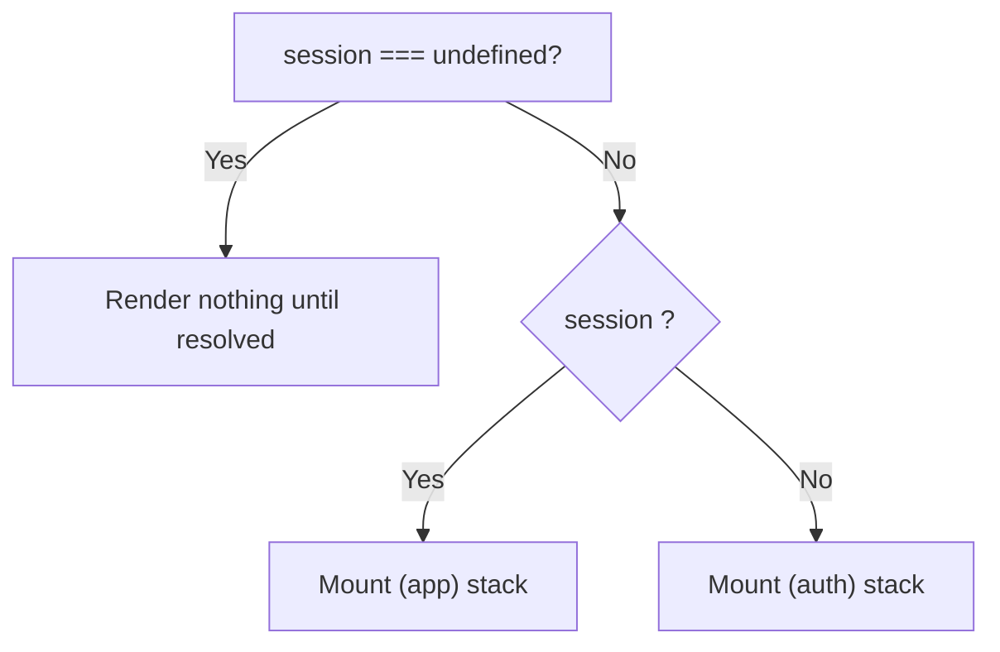
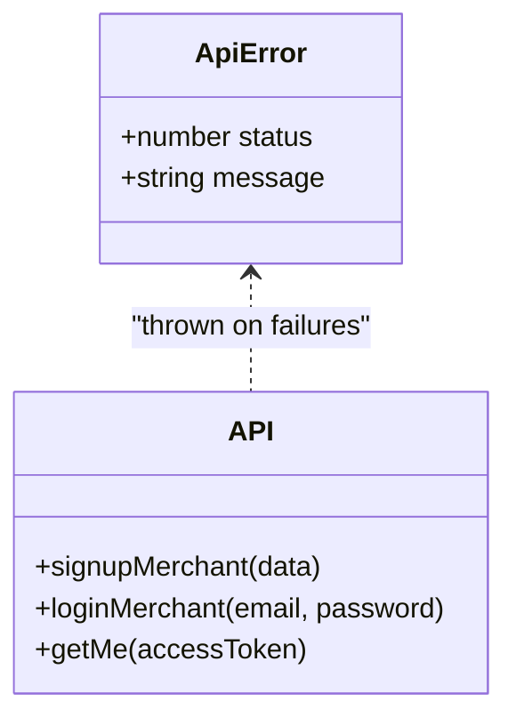
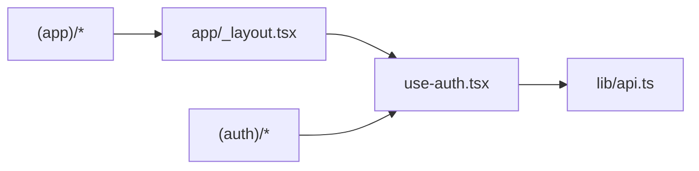

# Authentication System

<cite>
**Referenced Files in This Document**
- [use-auth.tsx](file://src/hooks/use-auth.tsx)
- [api.ts](file://src/lib/api.ts)
- [_layout.tsx](file://src/app/_layout.tsx)
- [_layout.tsx](file://src/app/(auth)/_layout.tsx)
- [_layout.tsx](file://src/app/(app)/_layout.tsx)
- [login.tsx](file://src/app/(auth)/login.tsx)
- [signup.tsx](file://src/app/(auth)/signup.tsx)
- [welcome.tsx](file://src/app/(auth)/welcome.tsx)
- [api.ts](file://src/constants/api.ts)
</cite>

## Table of Contents
1. [Introduction](#introduction)
2. [Project Structure](#project-structure)
3. [Core Components](#core-components)
4. [Architecture Overview](#architecture-overview)
5. [Detailed Component Analysis](#detailed-component-analysis)
6. [Dependency Analysis](#dependency-analysis)
7. [Performance Considerations](#performance-considerations)
8. [Troubleshooting Guide](#troubleshooting-guide)
9. [Conclusion](#conclusion)

## Introduction
This document explains the secure, token-based authentication system used by the application. It covers how user sessions are created and persisted across app restarts using Expo SecureStore, how the root layout guards protected routes, and how screens implement login, signup, and a welcome flow for new users. It also provides guidance on implementing protected routes, handling authentication errors gracefully, and security best practices for token storage and session validation.

## Project Structure
Authentication spans three layers:
- UI layer: Auth screens (welcome, login, signup) under the (auth) route group.
- State layer: use-auth hook providing context for session state and actions.
- Routing layer: Root layout mounts either the authenticated or unauthenticated stack based on session state.

**Diagram sources**
- [_layout.tsx:35-81](file://src/app/_layout.tsx#L35-L81)
- [use-auth.tsx:31-82](file://src/hooks/use-auth.tsx#L31-L82)
- [_layout.tsx:1-15](file://src/app/(auth)/_layout.tsx#L1-L15)
- [_layout.tsx:1-23](file://src/app/(app)/_layout.tsx#L1-L23)

**Section sources**
- [_layout.tsx:35-81](file://src/app/_layout.tsx#L35-L81)
- [_layout.tsx:1-15](file://src/app/(auth)/_layout.tsx#L1-L15)
- [_layout.tsx:1-23](file://src/app/(app)/_layout.tsx#L1-L23)

## Core Components
- AuthProvider and useAuth: Manage session lifecycle, persist tokens via SecureStore, hydrate user info on launch, and expose sign-in/sign-up/sign-out actions.
- API client: Provides typed functions for signup, login, and current user retrieval; centralizes error handling and network requests.
- Root navigator: Uses Stack.Protected to mount either the (auth) or (app) groups based on session state, ensuring only appropriate screens are reachable.

Key responsibilities:
- Persist access tokens securely with SecureStore.
- Validate stored tokens on app start by calling the server to fetch current user.
- Provide a unified context for all screens to read session state and trigger auth actions.
- Guard navigation so that authenticated features are inaccessible without a valid session.

**Section sources**
- [use-auth.tsx:1-91](file://src/hooks/use-auth.tsx#L1-L91)
- [api.ts:317-342](file://src/lib/api.ts#L317-L342)
- [_layout.tsx:58-81](file://src/app/_layout.tsx#L58-L81)

## Architecture Overview
The authentication architecture follows a clear separation of concerns:
- The root layout wraps the app in a theme provider and the AuthProvider.
- On startup, the AuthProvider reads any stored token from SecureStore and validates it against the backend.
- Based on the resolved session, the root navigator renders either the unauthenticated stack (welcome/login/signup) or the authenticated stack (tabs and feature screens).
- Screens call useAuth methods to perform login/signup and navigate accordingly.

**Diagram sources**
- [use-auth.tsx:35-53](file://src/hooks/use-auth.tsx#L35-L53)
- [api.ts:338-342](file://src/lib/api.ts#L338-L342)
- [_layout.tsx:64-81](file://src/app/_layout.tsx#L64-L81)

## Detailed Component Analysis

### Authentication Hook (use-auth)
- Session hydration: On mount, reads the token from SecureStore and calls getMe to validate it. If validation fails, the token is cleared and session set to null.
- Sign up flow: Creates a merchant account, immediately logs them in to obtain an access token, stores it securely, and hydrates the session.
- Sign in flow: Authenticates with email/password, stores the access token, and hydrates the session.
- Sign out flow: Deletes the stored token and clears session state.
- Context value: Exposes session, accessToken, and action functions to consumers.

**Diagram sources**
- [use-auth.tsx:35-53](file://src/hooks/use-auth.tsx#L35-L53)

**Section sources**
- [use-auth.tsx:15-23](file://src/hooks/use-auth.tsx#L15-L23)
- [use-auth.tsx:31-82](file://src/hooks/use-auth.tsx#L31-L82)

### Login Screen
- Validates email format and password presence before submission.
- Calls signInMerchant from useAuth and handles ApiError messages for user feedback.
- Navigates automatically after successful sign-in because the root navigator switches to the authenticated stack when session becomes non-null.

**Diagram sources**
- [login.tsx:28-39](file://src/app/(auth)/login.tsx#L28-L39)
- [use-auth.tsx:66-70](file://src/hooks/use-auth.tsx#L66-L70)
- [_layout.tsx:64-81](file://src/app/_layout.tsx#L64-L81)

**Section sources**
- [login.tsx:15-39](file://src/app/(auth)/login.tsx#L15-L39)

### Signup Screen
- Enforces stronger validation: full name, business name, email, minimum password length, and agreement checkbox.
- Calls signUpMerchant to create the account, then navigates to store connection flow.
- Displays a visual password strength meter and handles ApiError messages.

**Diagram sources**
- [signup.tsx:48-65](file://src/app/(auth)/signup.tsx#L48-L65)

**Section sources**
- [signup.tsx:26-65](file://src/app/(auth)/signup.tsx#L26-L65)

### Welcome Screen
- Entry point for first-time users.
- Provides “Get started” to navigate to signup and “Sign in” to navigate to login.
- Uses animations and branding elements to introduce the product.

**Diagram sources**
- [welcome.tsx:58-79](file://src/app/(auth)/welcome.tsx#L58-L79)

**Section sources**
- [welcome.tsx:15-84](file://src/app/(auth)/welcome.tsx#L15-L84)

### Protected Routes and Navigation Guards
- The root layout uses Stack.Protected to ensure:
  - Unauthenticated screens are mounted only when session is null.
  - Authenticated screens are mounted only when session is non-null.
- This approach avoids per-screen checks and prevents back-navigation leaks between groups.

**Diagram sources**
- [_layout.tsx:64-81](file://src/app/_layout.tsx#L64-L81)

**Section sources**
- [_layout.tsx:58-81](file://src/app/_layout.tsx#L58-L81)

### API Layer and Error Handling
- Centralized request function throws ApiError with status and human-readable messages extracted from server responses.
- Authentication endpoints:
  - signupMerchant: POST /auth/signup
  - loginMerchant: POST /auth/login (OAuth password grant)
  - getMe: GET /auth/me with Authorization header
- Network errors produce a friendly message guiding users to check connectivity.

**Diagram sources**
- [api.ts:5-13](file://src/lib/api.ts#L5-L13)
- [api.ts:317-342](file://src/lib/api.ts#L317-L342)

**Section sources**
- [api.ts:53-77](file://src/lib/api.ts#L53-L77)
- [api.ts:317-342](file://src/lib/api.ts#L317-L342)

## Dependency Analysis
- use-auth depends on:
  - expo-secure-store for persistent token storage.
  - api module for authentication endpoints and error types.
- Root layout depends on:
  - use-auth to determine which stack to render.
  - expo-router Stack.Protected for declarative route guards.
- Auth screens depend on:
  - use-auth for actions and session state.
  - expo-router for navigation.

**Diagram sources**
- [use-auth.tsx:1-11](file://src/hooks/use-auth.tsx#L1-L11)
- [_layout.tsx:11-12](file://src/app/_layout.tsx#L11-L12)
- [_layout.tsx:64-81](file://src/app/_layout.tsx#L64-L81)

**Section sources**
- [use-auth.tsx:1-11](file://src/hooks/use-auth.tsx#L1-L11)
- [_layout.tsx:11-12](file://src/app/_layout.tsx#L11-L12)

## Performance Considerations
- Avoid redundant re-renders by memoizing context value and relying on React’s context updates only when session or accessToken change.
- Defer rendering of both stacks until session is resolved to prevent flash of unauthenticated content.
- Use minimal network calls: only validate stored token once on launch; subsequent requests rely on the cached accessToken.

[No sources needed since this section provides general guidance]

## Troubleshooting Guide
Common issues and debugging techniques:
- Blank screen on launch:
  - Ensure fonts are loaded before rendering the shell to avoid early unmounts.
  - Confirm that session resolves to null or user; if undefined persists, check SecureStore availability and async initialization.
- Invalid/expired token:
  - The hook clears the token and sets session to null; verify that the backend returns a proper error for expired tokens.
- Network connectivity:
  - ApiError includes a friendly message for unreachable servers; confirm API_BASE_URL configuration for your environment.
- Navigation not switching:
  - Verify that session becomes non-null after login and that the root navigator conditionally mounts the correct stack.

Practical steps:
- Inspect SecureStore contents during development to confirm token persistence.
- Log API_BASE_URL to ensure it points to the intended backend.
- Catch ApiError in screens to display meaningful messages to users.

**Section sources**
- [api.ts:53-77](file://src/lib/api.ts#L53-L77)
- [api.ts:338-342](file://src/lib/api.ts#L338-L342)
- [api.ts:10-16](file://src/constants/api.ts#L10-L16)

## Conclusion
The authentication system combines a robust context-driven state model with secure token persistence and declarative route guards. The use-auth hook encapsulates session lifecycle and integrates tightly with the API layer, while the root layout ensures that only appropriate screens are accessible based on authentication state. By following the patterns outlined here—using SecureStore for tokens, validating sessions on launch, and leveraging Stack.Protected—you can maintain a secure, user-friendly experience across app restarts and navigation flows.