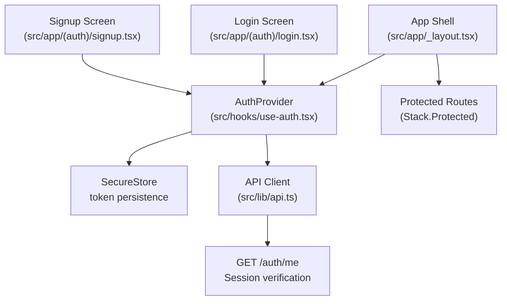
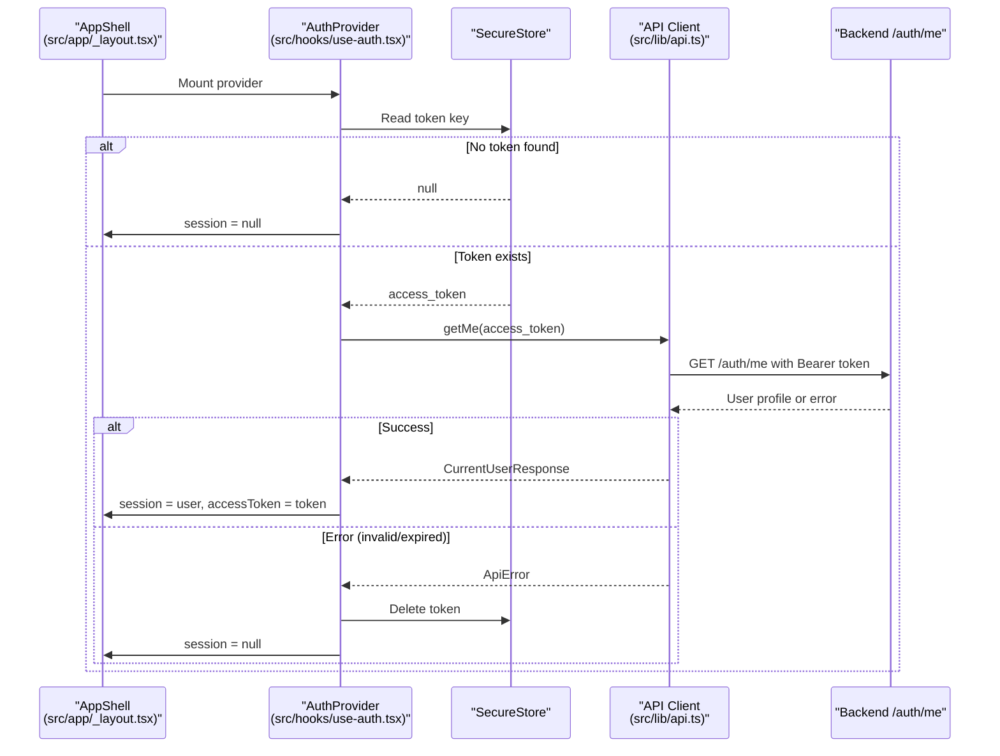
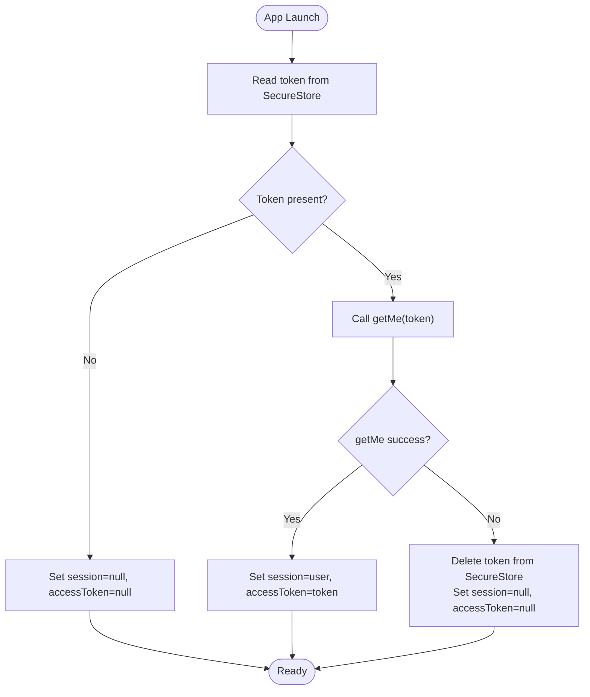
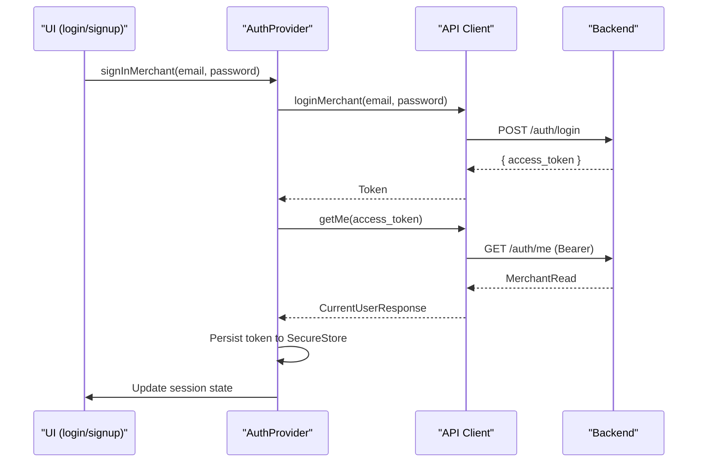
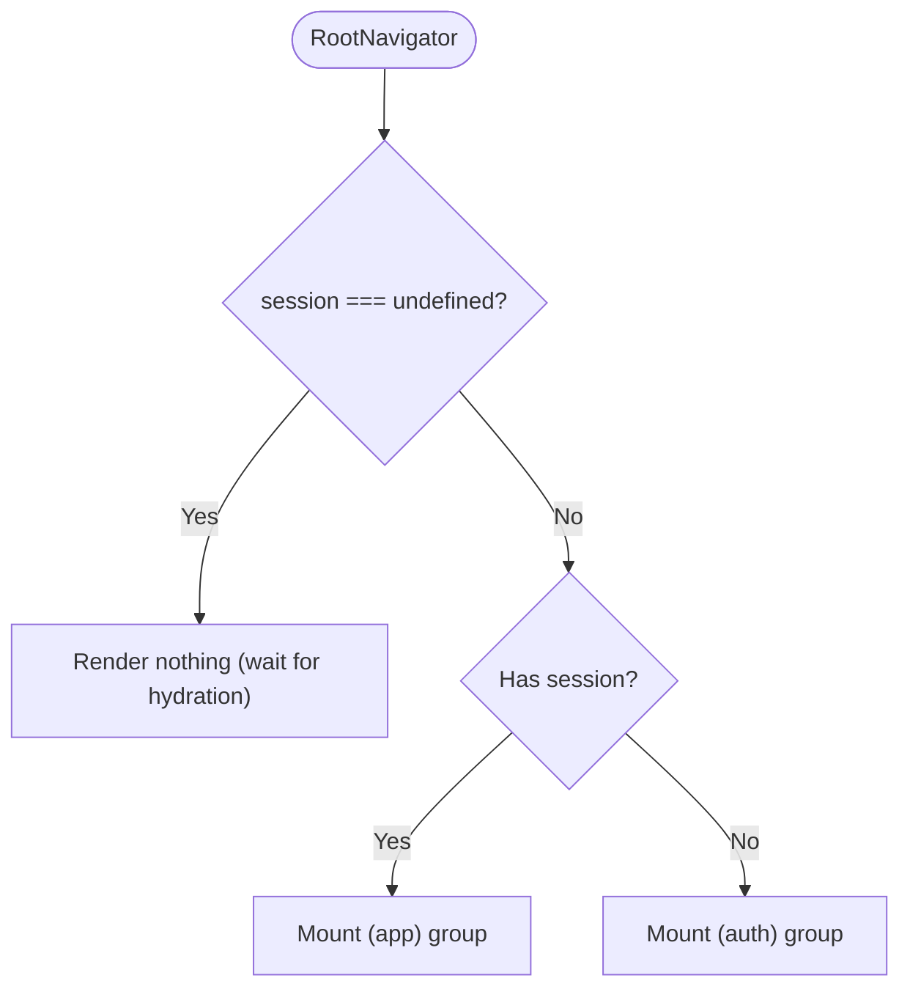

# Token Management

<cite>
**Referenced Files in This Document**
- [use-auth.tsx](file://src/hooks/use-auth.tsx)
- [api.ts](file://src/lib/api.ts)
- [_layout.tsx](file://src/app/_layout.tsx)
- [login.tsx](file://src/app/(auth)/login.tsx)
- [signup.tsx](file://src/app/(auth)/signup.tsx)
- [api.ts (constants)](file://src/constants/api.ts)
</cite>

## Table of Contents
1. [Introduction](#introduction)
2. [Project Structure](#project-structure)
3. [Core Components](#core-components)
4. [Architecture Overview](#architecture-overview)
5. [Detailed Component Analysis](#detailed-component-analysis)
6. [Dependency Analysis](#dependency-analysis)
7. [Performance Considerations](#performance-considerations)
8. [Troubleshooting Guide](#troubleshooting-guide)
9. [Conclusion](#conclusion)

## Introduction
This document explains how the app manages authentication tokens using Expo SecureStore, including secure storage, automatic hydration on launch, session persistence across restarts, token validation and cleanup, usage of the getMe endpoint for session verification, and the hydrateFromToken function. It also covers protected routing via the authentication context, error handling patterns, debugging techniques, and guidance for implementing protected routes and token refresh scenarios.

## Project Structure
The token management spans a small set of focused modules:
- Authentication context and lifecycle: src/hooks/use-auth.tsx
- API client and endpoints: src/lib/api.ts
- Root layout and protected navigation: src/app/_layout.tsx
- Auth screens that trigger sign-in/sign-up flows: src/app/(auth)/login.tsx, src/app/(auth)/signup.tsx
- Backend base URL configuration: src/constants/api.ts

**Diagram sources**
- [_layout.tsx:35-81](file://src/app/_layout.tsx#L35-L81)
- [use-auth.tsx:31-81](file://src/hooks/use-auth.tsx#L31-L81)
- [api.ts:338-342](file://src/lib/api.ts#L338-L342)

**Section sources**
- [_layout.tsx:35-81](file://src/app/_layout.tsx#L35-L81)
- [use-auth.tsx:31-81](file://src/hooks/use-auth.tsx#L31-L81)
- [api.ts:338-342](file://src/lib/api.ts#L338-L342)

## Core Components
- AuthProvider and useAuth hook: Manage session state, access token, and provide sign-in, sign-up, and sign-out actions. On app launch, it reads the stored token from SecureStore, validates it via getMe, and sets up the authenticated session or clears invalid tokens.
- API client: Centralizes HTTP requests, error mapping to ApiError, and exposes auth endpoints including login, signup, and getMe.
- Protected routing: The root navigator mounts either the authenticated or unauthenticated route groups based on session state, ensuring only logged-in users can access app screens.

Key responsibilities:
- Secure token storage and retrieval with Expo SecureStore
- Automatic hydration on app start by validating the stored token
- Session persistence across app restarts
- Clean invalid/expired token handling
- Consistent error handling via ApiError

**Section sources**
- [use-auth.tsx:1-90](file://src/hooks/use-auth.tsx#L1-L90)
- [api.ts:5-77](file://src/lib/api.ts#L5-L77)
- [_layout.tsx:64-81](file://src/app/_layout.tsx#L64-L81)

## Architecture Overview
The authentication flow integrates UI, context, and API layers:

**Diagram sources**
- [use-auth.tsx:35-53](file://src/hooks/use-auth.tsx#L35-L53)
- [api.ts:338-342](file://src/lib/api.ts#L338-L342)

## Detailed Component Analysis

### Authentication Context and Lifecycle (use-auth.tsx)
- Stores the access token under a single key in SecureStore.
- On mount, attempts to hydrate the session by calling getMe with the stored token.
- If getMe fails (e.g., 401), deletes the token and resets session to null.
- Provides signUpMerchant and signInMerchant which:
  - Call backend endpoints to create/log in the merchant
  - Persist the returned access token to SecureStore
  - Validate the token via getMe and update session/state
- Provides signOut which clears the token and resets session.

**Diagram sources**
- [use-auth.tsx:35-53](file://src/hooks/use-auth.tsx#L35-L53)

**Section sources**
- [use-auth.tsx:13-29](file://src/hooks/use-auth.tsx#L13-L29)
- [use-auth.tsx:31-81](file://src/hooks/use-auth.tsx#L31-L81)

### API Client and getMe Endpoint (api.ts)
- request helper wraps fetch, maps non-OK responses to ApiError, and parses JSON bodies when available.
- loginMerchant posts credentials and returns an access token.
- signupMerchant creates a merchant account.
- getMe validates the bearer token against /auth/me and returns the current user profile.

**Diagram sources**
- [api.ts:325-342](file://src/lib/api.ts#L325-L342)
- [use-auth.tsx:66-70](file://src/hooks/use-auth.tsx#L66-L70)

**Section sources**
- [api.ts:53-77](file://src/lib/api.ts#L53-L77)
- [api.ts:325-342](file://src/lib/api.ts#L325-L342)

### Protected Routing and Navigation (_layout.tsx)
- The root navigator conditionally mounts either the authenticated or unauthenticated route group based on session state.
- While session is undefined (hydration in progress), no routes are mounted to avoid flashes.
- Stack.Protected enforces guards for both groups, ensuring mutual exclusivity and preventing back-navigation leaks.

**Diagram sources**
- [_layout.tsx:64-81](file://src/app/_layout.tsx#L64-L81)

**Section sources**
- [_layout.tsx:35-81](file://src/app/_layout.tsx#L35-L81)

### Auth Screens Integration (login.tsx, signup.tsx)
- Login screen calls signInMerchant and displays ApiError messages on failure.
- Signup screen calls signUpMerchant, then navigates to store connection flow on success.
- Both screens rely on the AuthContext for state updates and do not directly handle token storage.

**Section sources**
- [login.tsx:28-39](file://src/app/(auth)/login.tsx#L28-L39)
- [signup.tsx:48-65](file://src/app/(auth)/signup.tsx#L48-L65)

## Dependency Analysis
- use-auth.tsx depends on:
  - expo-secure-store for persistent token storage
  - @/lib/api for authentication endpoints and error types
- api.ts depends on:
  - constants/api.ts for API_BASE_URL
  - Platform-specific streaming logic (not directly relevant to token flow)
- _layout.tsx depends on:
  - use-auth.tsx for session state and providers
  - expo-router’s Stack.Protected for guarded navigation

**Diagram sources**
- [_layout.tsx:35-81](file://src/app/_layout.tsx#L35-L81)
- [use-auth.tsx:1-11](file://src/hooks/use-auth.tsx#L1-L11)
- [api.ts:1-3](file://src/lib/api.ts#L1-L3)
- [api.ts (constants):1-15](file://src/constants/api.ts#L1-L15)

**Section sources**
- [_layout.tsx:35-81](file://src/app/_layout.tsx#L35-L81)
- [use-auth.tsx:1-11](file://src/hooks/use-auth.tsx#L1-L11)
- [api.ts:1-3](file://src/lib/api.ts#L1-L3)
- [api.ts (constants):1-15](file://src/constants/api.ts#L1-L15)

## Performance Considerations
- Hydration occurs once at app launch; ensure getMe is lightweight to minimize startup time.
- Avoid redundant network calls by relying on the persisted token until explicit sign-out or invalidation.
- Keep UI responsive during hydration by deferring navigation until session is resolved.

[No sources needed since this section provides general guidance]

## Troubleshooting Guide
Common issues and remedies:
- Invalid or expired token on launch:
  - Symptom: App shows unauthenticated state immediately after restart.
  - Cause: Stored token failed getMe validation; token is deleted automatically.
  - Resolution: Re-authenticate via login; verify backend token validity.
- Network errors during hydration:
  - Symptom: App remains blank or redirects to auth flow unexpectedly.
  - Cause: Could not reach server; ApiError thrown by request helper.
  - Resolution: Check connectivity and API_BASE_URL configuration; retry.
- Sign-in failures:
  - Symptom: Error message displayed on login screen.
  - Cause: Backend rejected credentials or returned an ApiError.
  - Resolution: Inspect ApiError.message; confirm credentials and server status.

Debugging tips:
- Log API_BASE_URL to ensure correct backend target in development.
- Wrap critical calls in try/catch and log ApiError details for faster triage.
- Use React DevTools to inspect AuthContext values (session, accessToken) during hydration.

**Section sources**
- [api.ts:53-77](file://src/lib/api.ts#L53-L77)
- [api.ts (constants):10-15](file://src/constants/api.ts#L10-L15)
- [login.tsx:28-39](file://src/app/(auth)/login.tsx#L28-L39)

## Conclusion
The app implements a robust token management strategy using Expo SecureStore and a centralized authentication context. Tokens are securely persisted, validated on launch via getMe, and cleaned up when invalid. Protected routing ensures only authenticated users access app features. Errors are consistently handled through ApiError, enabling clear feedback and debugging. For future enhancements, consider adding token refresh flows and offline resilience while maintaining these security and reliability practices.

[No sources needed since this section summarizes without analyzing specific files]