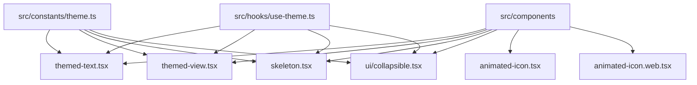
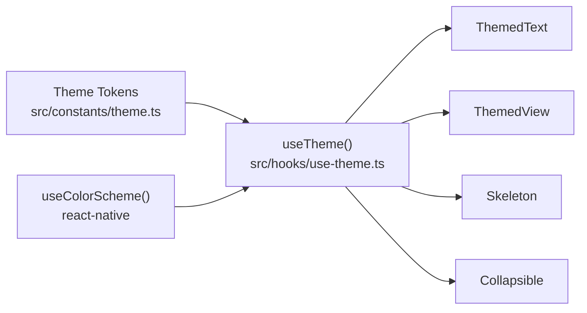
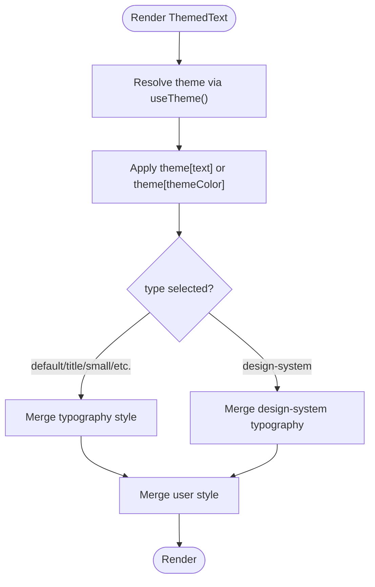
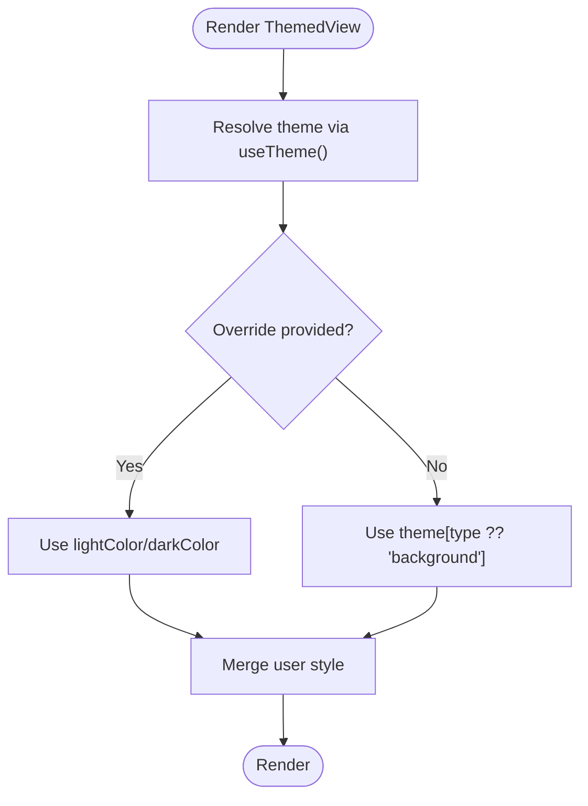
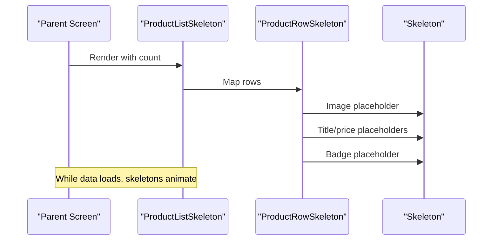
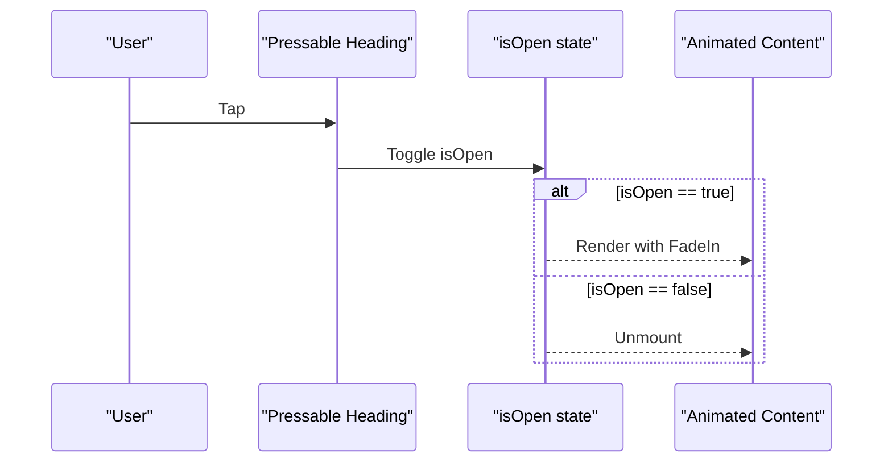
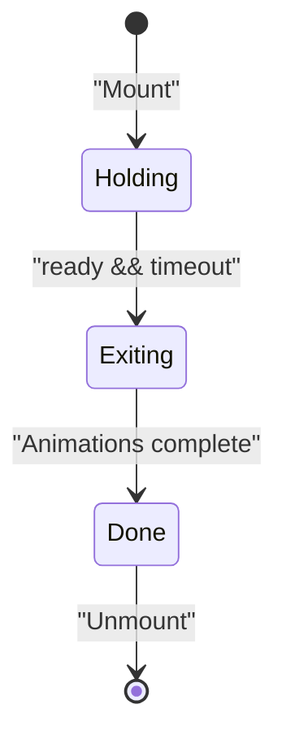
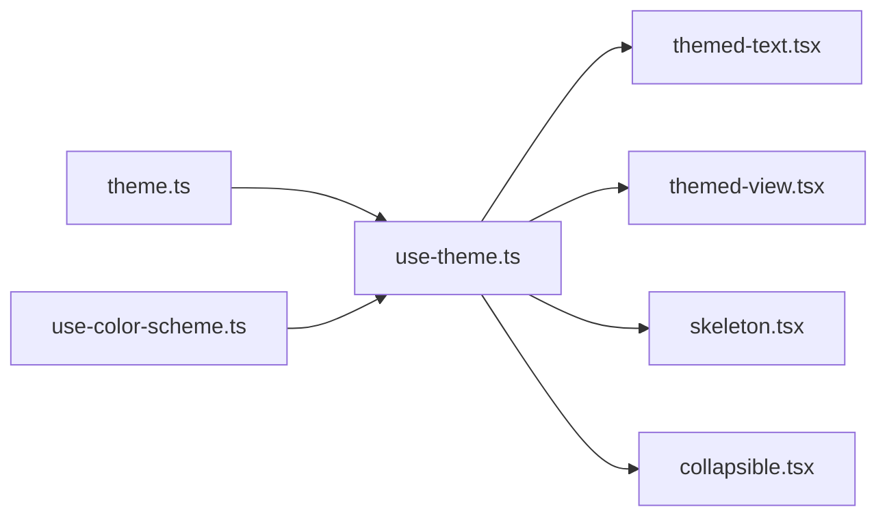

# Component Library

<cite>
**Referenced Files in This Document**
- [themed-text.tsx](file://src/components/themed-text.tsx)
- [themed-view.tsx](file://src/components/themed-view.tsx)
- [skeleton.tsx](file://src/components/skeleton.tsx)
- [collapsible.tsx](file://src/components/ui/collapsible.tsx)
- [animated-icon.tsx](file://src/components/animated-icon.tsx)
- [animated-icon.web.tsx](file://src/components/animated-icon.web.tsx)
- [theme.ts](file://src/constants/theme.ts)
- [use-theme.ts](file://src/hooks/use-theme.ts)
- [use-color-scheme.ts](file://src/hooks/use-color-scheme.ts)
- [segmented-tabs.tsx](file://src/components/segmented-tabs.tsx)
</cite>

## Table of Contents
1. [Introduction](#introduction)
2. [Project Structure](#project-structure)
3. [Core Components](#core-components)
4. [Architecture Overview](#architecture-overview)
5. [Detailed Component Analysis](#detailed-component-analysis)
6. [Dependency Analysis](#dependency-analysis)
7. [Performance Considerations](#performance-considerations)
8. [Troubleshooting Guide](#troubleshooting-guide)
9. [Conclusion](#conclusion)
10. [Appendices](#appendices)

## Introduction
This document describes the reusable component library used across the application. It focuses on themed primitives, skeleton loading components, UI primitives (including collapsible), and animated icon components with cross-platform implementations. It also provides guidance on composition patterns, theming customization, consistency, and accessibility compliance.

## Project Structure
The component library lives primarily under src/components, with shared theming constants and hooks under src/constants and src/hooks. The ui subfolder contains higher-level UI primitives such as collapsible sections.

**Diagram sources**
- [themed-text.tsx:1-100](file://src/components/themed-text.tsx#L1-L100)
- [themed-view.tsx:1-17](file://src/components/themed-view.tsx#L1-L17)
- [skeleton.tsx:1-139](file://src/components/skeleton.tsx#L1-L139)
- [collapsible.tsx:1-66](file://src/components/ui/collapsible.tsx#L1-L66)
- [animated-icon.tsx:1-172](file://src/components/animated-icon.tsx#L1-L172)
- [animated-icon.web.tsx:1-157](file://src/components/animated-icon.web.tsx#L1-L157)
- [theme.ts:1-263](file://src/constants/theme.ts#L1-L263)
- [use-theme.ts:1-15](file://src/hooks/use-theme.ts#L1-L15)

**Section sources**
- [themed-text.tsx:1-100](file://src/components/themed-text.tsx#L1-L100)
- [themed-view.tsx:1-17](file://src/components/themed-view.tsx#L1-L17)
- [skeleton.tsx:1-139](file://src/components/skeleton.tsx#L1-L139)
- [collapsible.tsx:1-66](file://src/components/ui/collapsible.tsx#L1-L66)
- [animated-icon.tsx:1-172](file://src/components/animated-icon.tsx#L1-L172)
- [animated-icon.web.tsx:1-157](file://src/components/animated-icon.web.tsx#L1-L157)
- [theme.ts:1-263](file://src/constants/theme.ts#L1-L263)
- [use-theme.ts:1-15](file://src/hooks/use-theme.ts#L1-L15)

## Core Components
This section summarizes the core building blocks and their props.

- ThemedText
  - Purpose: Styled text that adapts to theme tokens and typography scale.
  - Key props: type (text style presets), themeColor (color token), plus standard TextProps.
  - Behavior: Applies a base color from theme and merges selected typography styles; supports legacy and design-system typography types.

- ThemedView
  - Purpose: View wrapper that applies background colors based on theme tokens.
  - Key props: lightColor, darkColor, type (theme token), plus standard ViewProps.
  - Behavior: Resolves background color from theme or overrides via light/dark color props.

- Skeleton
  - Purpose: Animated placeholder for loading states.
  - Key props: width, height, radius, style.
  - Behavior: Pulsing opacity animation using theme’s backgroundElement; composable into list/detail skeletons.

- Collapsible
  - Purpose: Expandable content block with an animated chevron and fade-in content.
  - Props: title, children.
  - Behavior: Toggles visibility; uses themed containers and typography.

- AnimatedIcon / AnimatedSplashOverlay
  - Purpose: Cross-platform animated logo overlay and static icon container.
  - Props: ready (controls lifecycle).
  - Behavior: Animated entrance, breathing pulse/glow, and exit transition; hides native splash when ready.

**Section sources**
- [themed-text.tsx:6-57](file://src/components/themed-text.tsx#L6-L57)
- [themed-view.tsx:6-16](file://src/components/themed-view.tsx#L6-L16)
- [skeleton.tsx:9-39](file://src/components/skeleton.tsx#L9-L39)
- [collapsible.tsx:11-41](file://src/components/ui/collapsible.tsx#L11-L41)
- [animated-icon.tsx:32-126](file://src/components/animated-icon.tsx#L32-L126)
- [animated-icon.web.tsx:25-112](file://src/components/animated-icon.web.tsx#L25-L112)

## Architecture Overview
Theming is centralized in constants and accessed via a hook. Components consume theme tokens to ensure consistent appearance across light and dark modes.

**Diagram sources**
- [theme.ts:117-143](file://src/constants/theme.ts#L117-L143)
- [use-theme.ts:9-14](file://src/hooks/use-theme.ts#L9-L14)
- [use-color-scheme.ts:1-2](file://src/hooks/use-color-scheme.ts#L1-L2)
- [themed-text.tsx:1-57](file://src/components/themed-text.tsx#L1-L57)
- [themed-view.tsx:1-16](file://src/components/themed-view.tsx#L1-L16)
- [skeleton.tsx:1-39](file://src/components/skeleton.tsx#L1-L39)
- [collapsible.tsx:1-41](file://src/components/ui/collapsible.tsx#L1-L41)

## Detailed Component Analysis

### ThemedText
- Props
  - type: Preset typography styles including legacy types and design-system scale.
  - themeColor: Token key mapped to theme color.
  - Inherits all TextProps.
- Styling
  - Base color resolved from theme via themeColor or default text token.
  - Typography styles applied conditionally by type.
- Usage pattern
  - Use type to select semantic text size/weight instead of inline styles.
  - Prefer themeColor over hard-coded colors for consistency.

**Diagram sources**
- [themed-text.tsx:29-57](file://src/components/themed-text.tsx#L29-L57)

**Section sources**
- [themed-text.tsx:6-57](file://src/components/themed-text.tsx#L6-L57)
- [theme.ts:183-235](file://src/constants/theme.ts#L183-L235)

### ThemedView
- Props
  - type: Background token key.
  - lightColor/darkColor: Optional overrides per color scheme.
  - Inherits all ViewProps.
- Styling
  - Background color resolves from theme[type] or provided overrides.
- Usage pattern
  - Wrap surfaces with ThemedView to inherit background tokens consistently.

**Diagram sources**
- [themed-view.tsx:12-16](file://src/components/themed-view.tsx#L12-L16)

**Section sources**
- [themed-view.tsx:6-16](file://src/components/themed-view.tsx#L6-L16)
- [theme.ts:117-143](file://src/constants/theme.ts#L117-L143)

### Skeleton Loading Components
- Skeleton
  - Animated pulsing placeholder with configurable width, height, radius, and style.
  - Uses theme.backgroundElement for consistent surface color.
- ProductRowSkeleton
  - Composed layout mimicking a product row with image, text lines, and badge.
- ProductListSkeleton
  - Renders multiple ProductRowSkeleton instances for list placeholders.
- ProductDetailSkeleton
  - Full-page detail placeholder with image, header, badges, list items, and description.

**Diagram sources**
- [skeleton.tsx:42-99](file://src/components/skeleton.tsx#L42-L99)
- [skeleton.tsx:9-39](file://src/components/skeleton.tsx#L9-L39)

**Section sources**
- [skeleton.tsx:9-99](file://src/components/skeleton.tsx#L9-L99)

### Collapsible UI Primitive
- Props
  - title: Header text displayed alongside chevron.
  - children: Content shown when expanded.
- Behavior
  - Pressing the heading toggles open state.
  - Chevron rotates to indicate state.
  - Content fades in with animation.
- Composition
  - Built on ThemedView and ThemedText for consistent styling.

**Diagram sources**
- [collapsible.tsx:11-41](file://src/components/ui/collapsible.tsx#L11-L41)

**Section sources**
- [collapsible.tsx:11-66](file://src/components/ui/collapsible.tsx#L11-L66)

### Animated Icon Components (Cross-Platform)
- AnimatedSplashOverlay
  - Provides an animated overlay with entrance, breathing pulse/glow, and exit transitions.
  - Integrates with native splash screen on mobile; web variant omits native splash calls.
  - Controlled by ready prop to hide overlay once app is ready.
- AnimatedIcon
  - Static centered icon container for branding surfaces.

**Diagram sources**
- [animated-icon.tsx:32-126](file://src/components/animated-icon.tsx#L32-L126)
- [animated-icon.web.tsx:25-112](file://src/components/animated-icon.web.tsx#L25-L112)

**Section sources**
- [animated-icon.tsx:1-172](file://src/components/animated-icon.tsx#L1-L172)
- [animated-icon.web.tsx:1-157](file://src/components/animated-icon.web.tsx#L1-L157)

### Composition Patterns and Best Practices
- Compose complex screens from small primitives
  - Example: SegmentedTabs composes ThemedText and theme tokens to create a pill-style tab switcher.
- Favor theme tokens over hard-coded values
  - Use themeColor/type for text and type/background for views to maintain consistency.
- Keep animations performant
  - Use reanimated shared values and avoid heavy work on the JS thread where possible.
- Provide accessible labels and semantics
  - Ensure interactive elements have appropriate roles and labels; test with assistive technologies.

**Section sources**
- [segmented-tabs.tsx:13-41](file://src/components/segmented-tabs.tsx#L13-L41)
- [themed-text.tsx:29-57](file://src/components/themed-text.tsx#L29-L57)
- [themed-view.tsx:12-16](file://src/components/themed-view.tsx#L12-L16)

## Dependency Analysis
Components depend on a small set of shared modules:

**Diagram sources**
- [theme.ts:117-143](file://src/constants/theme.ts#L117-L143)
- [use-theme.ts:9-14](file://src/hooks/use-theme.ts#L9-L14)
- [use-color-scheme.ts:1-2](file://src/hooks/use-color-scheme.ts#L1-L2)
- [themed-text.tsx:1-57](file://src/components/themed-text.tsx#L1-L57)
- [themed-view.tsx:1-16](file://src/components/themed-view.tsx#L1-L16)
- [skeleton.tsx:1-39](file://src/components/skeleton.tsx#L1-L39)
- [collapsible.tsx:1-41](file://src/components/ui/collapsible.tsx#L1-L41)

**Section sources**
- [theme.ts:117-143](file://src/constants/theme.ts#L117-L143)
- [use-theme.ts:9-14](file://src/hooks/use-theme.ts#L9-L14)
- [use-color-scheme.ts:1-2](file://src/hooks/use-color-scheme.ts#L1-L2)

## Performance Considerations
- Animations
  - Use reanimated shared values for smooth transitions; avoid recalculating expensive logic in render.
- Skeletons
  - Limit the number of skeleton rows; consider virtualization for long lists.
- Theming
  - Centralized tokens reduce redundant computations; prefer token lookups over inline color calculations.
- Platform differences
  - Web vs native variants are separated to avoid unnecessary platform-specific code paths.

## Troubleshooting Guide
- Colors not updating in dark mode
  - Verify that components use useTheme() and theme tokens rather than hard-coded colors.
- Skeleton flickering or layout shifts
  - Ensure fixed dimensions or aspect ratios are set for skeleton blocks to prevent reflows.
- Collapsible content not animating
  - Confirm that the parent allows layout changes and that no overflow constraints hide the animated region.
- AnimatedSplashOverlay not hiding
  - Check that ready becomes true and that the native splash is hidden on mobile platforms.

**Section sources**
- [use-theme.ts:9-14](file://src/hooks/use-theme.ts#L9-L14)
- [skeleton.tsx:9-39](file://src/components/skeleton.tsx#L9-L39)
- [collapsible.tsx:11-41](file://src/components/ui/collapsible.tsx#L11-L41)
- [animated-icon.tsx:70-84](file://src/components/animated-icon.tsx#L70-L84)
- [animated-icon.web.tsx:62-76](file://src/components/animated-icon.web.tsx#L62-L76)

## Conclusion
The component library provides a cohesive, theme-driven foundation with reusable primitives for text, views, skeletons, collapsibles, and animated icons. By composing these components and adhering to the theming system, teams can build consistent, accessible, and performant interfaces across platforms.

## Appendices

### Theming Support and Customization
- Theme tokens
  - Colors.light and Colors.dark define palettes and aliases consumed by components.
  - Typography, Radius, and Spacing provide consistent scales.
- Extending themes
  - Add new tokens to Colors and expose them via useTheme().
  - Introduce new typography entries in Typography and add corresponding type options to ThemedText if needed.
- Overriding per-screen
  - Use lightColor/darkColor on ThemedView to override backgrounds for specific contexts.

**Section sources**
- [theme.ts:117-143](file://src/constants/theme.ts#L117-L143)
- [theme.ts:183-259](file://src/constants/theme.ts#L183-L259)
- [themed-view.tsx:6-16](file://src/components/themed-view.tsx#L6-L16)

### Accessibility Compliance Guidelines
- Text
  - Use ThemedText with semantic types to convey hierarchy; ensure sufficient contrast via theme tokens.
- Interactive elements
  - Ensure pressables have clear affordances; test focus order and keyboard navigation.
- Motion
  - Respect reduced motion preferences where applicable; keep animations subtle and purposeful.
- Labels
  - Provide descriptive titles for collapsibles and meaningful labels for icons/buttons.

[No sources needed since this section provides general guidance]