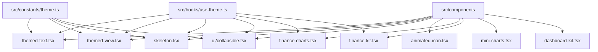
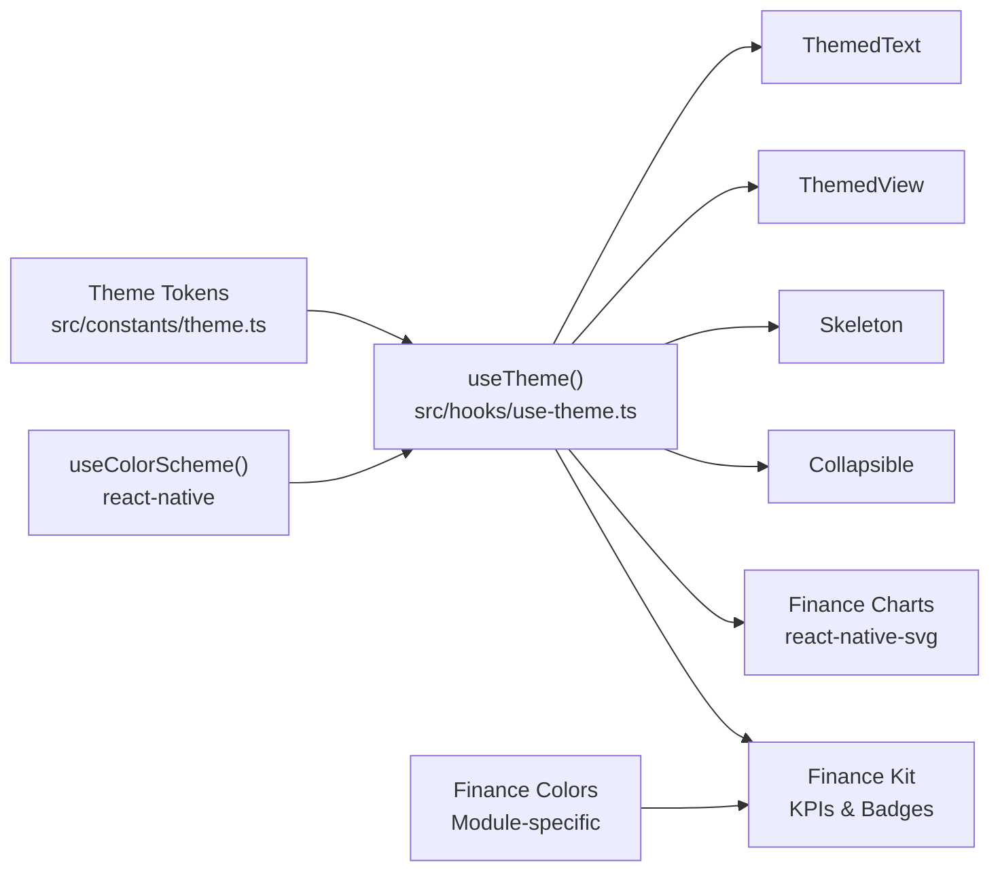
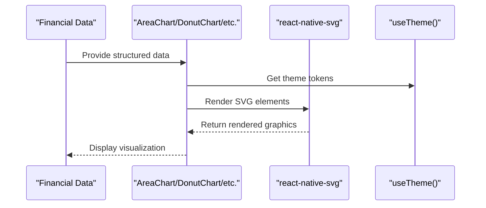
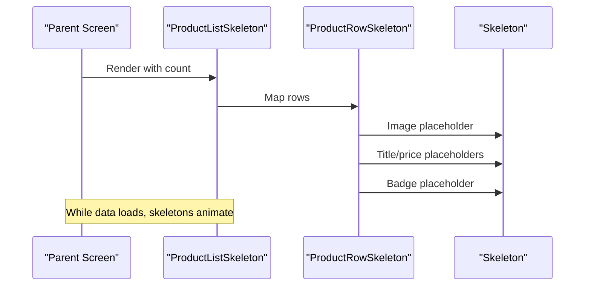
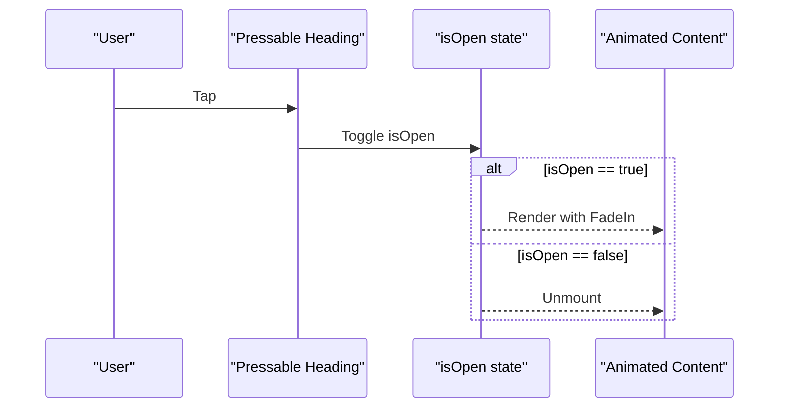
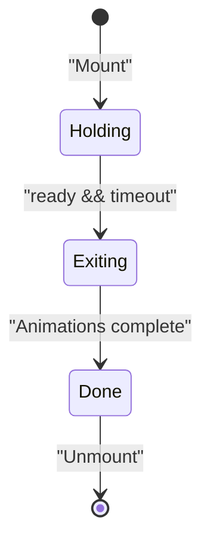
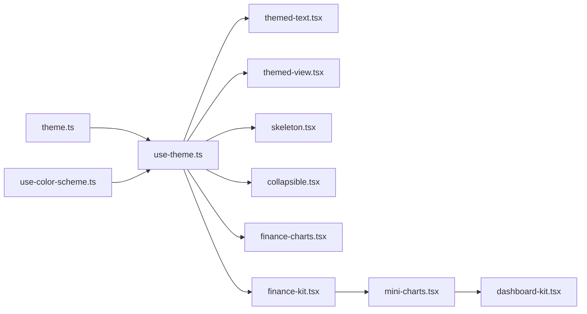

# Component Library

<cite>
**Referenced Files in This Document**
- [themed-text.tsx](file://src/components/themed-text.tsx)
- [themed-view.tsx](file://src/components/themed-view.tsx)
- [skeleton.tsx](file://src/components/skeleton.tsx)
- [collapsible.tsx](file://src/components/ui/collapsible.tsx)
- [animated-icon.tsx](file://src/components/animated-icon.tsx)
- [animated-icon.web.tsx](file://src/components/animated-icon.web.tsx)
- [finance-charts.tsx](file://src/components/finance-charts.tsx)
- [finance-kit.tsx](file://src/components/finance-kit.tsx)
- [mini-charts.tsx](file://src/components/mini-charts.tsx)
- [dashboard-kit.tsx](file://src/components/dashboard-kit.tsx)
- [theme.ts](file://src/constants/theme.ts)
- [use-theme.ts](file://src/hooks/use-theme.ts)
- [use-color-scheme.ts](file://src/hooks/use-color-scheme.ts)
- [segmented-tabs.tsx](file://src/components/segmented-tabs.tsx)
</cite>

## Update Summary
**Changes Made**
- Added comprehensive documentation for finance-specific chart components (AreaChart, DonutChart, HorizontalBarChart, GroupedBarChart, StackedBarChart)
- Documented KPI cards, status badges, date range selectors, and gauge bars
- Added mini-chart components (Sparkline, DistributionBar) for dashboard usage
- Enhanced skeleton loading components with finance-specific variants
- Updated architecture diagrams to include new finance component ecosystem

## Table of Contents
1. [Introduction](#introduction)
2. [Project Structure](#project-structure)
3. [Core Components](#core-components)
4. [Finance-Specific Components](#finance-specific-components)
5. [Architecture Overview](#architecture-overview)
6. [Detailed Component Analysis](#detailed-component-analysis)
7. [Dependency Analysis](#dependency-analysis)
8. [Performance Considerations](#performance-considerations)
9. [Troubleshooting Guide](#troubleshooting-guide)
10. [Conclusion](#conclusion)
11. [Appendices](#appendices)

## Introduction
This document describes the reusable component library used across the application. It focuses on themed primitives, skeleton loading components, UI primitives (including collapsible), animated icon components with cross-platform implementations, and a comprehensive suite of finance-specific components including charts, KPI cards, status indicators, and data visualization tools built with react-native-svg. It also provides guidance on composition patterns, theming customization, consistency, and accessibility compliance.

## Project Structure
The component library lives primarily under src/components, with shared theming constants and hooks under src/constants and src/hooks. The ui subfolder contains higher-level UI primitives such as collapsible sections. Finance-specific components are organized into specialized modules for charts, KPIs, and dashboard elements.



**Diagram sources**
- [themed-text.tsx:1-100](file://src/components/themed-text.tsx#L1-L100)
- [themed-view.tsx:1-17](file://src/components/themed-view.tsx#L1-L17)
- [skeleton.tsx:1-139](file://src/components/skeleton.tsx#L1-L139)
- [collapsible.tsx:1-66](file://src/components/ui/collapsible.tsx#L1-L66)
- [animated-icon.tsx:1-172](file://src/components/animated-icon.tsx#L1-L172)
- [finance-charts.tsx:1-396](file://src/components/finance-charts.tsx#L1-L396)
- [finance-kit.tsx:1-608](file://src/components/finance-kit.tsx#L1-L608)
- [mini-charts.tsx:1-108](file://src/components/mini-charts.tsx#L1-L108)
- [dashboard-kit.tsx:1-604](file://src/components/dashboard-kit.tsx#L1-L604)
- [theme.ts:1-263](file://src/constants/theme.ts#L1-L263)
- [use-theme.ts:1-15](file://src/hooks/use-theme.ts#L1-L15)

**Section sources**
- [themed-text.tsx:1-100](file://src/components/themed-text.tsx#L1-L100)
- [themed-view.tsx:1-17](file://src/components/themed-view.tsx#L1-L17)
- [skeleton.tsx:1-139](file://src/components/skeleton.tsx#L1-L139)
- [collapsible.tsx:1-66](file://src/components/ui/collapsible.tsx#L1-L66)
- [animated-icon.tsx:1-172](file://src/components/animated-icon.tsx#L1-L172)
- [finance-charts.tsx:1-396](file://src/components/finance-charts.tsx#L1-L396)
- [finance-kit.tsx:1-608](file://src/components/finance-kit.tsx#L1-L608)
- [mini-charts.tsx:1-108](file://src/components/mini-charts.tsx#L1-L108)
- [dashboard-kit.tsx:1-604](file://src/components/dashboard-kit.tsx#L1-L604)
- [theme.ts:1-263](file://src/constants/theme.ts#L1-L263)
- [use-theme.ts:1-15](file://src/hooks/use-theme.ts#L1-L15)

## Core Components
This section summarizes the core building blocks and their props.

- ThemedText
  - Purpose: Styled text that adapts to theme tokens and typography scale.
  - Key props: type (text style presets), themeColor (color token), plus standard TextProps.
  - Behavior: Applies a base color from theme and merges selected typography styles; supports legacy and design-system typography types.

- ThemedView
  - Purpose: View wrapper that applies background colors based on theme tokens.
  - Key props: lightColor, darkColor, type (theme token), plus standard ViewProps.
  - Behavior: Resolves background color from theme or overrides via light/dark color props.

- Skeleton
  - Purpose: Animated placeholder for loading states.
  - Key props: width, height, radius, style.
  - Behavior: Pulsing opacity animation using theme's backgroundElement; composable into list/detail skeletons.

- Collapsible
  - Purpose: Expandable content block with an animated chevron and fade-in content.
  - Props: title, children.
  - Behavior: Toggles visibility; uses themed containers and typography.

- AnimatedIcon / AnimatedSplashOverlay
  - Purpose: Cross-platform animated logo overlay and static icon container.
  - Props: ready (controls lifecycle).
  - Behavior: Animated entrance, breathing pulse/glow, and exit transition; hides native splash when ready.

**Section sources**
- [themed-text.tsx:6-57](file://src/components/themed-text.tsx#L6-L57)
- [themed-view.tsx:6-16](file://src/components/themed-view.tsx#L6-L16)
- [skeleton.tsx:9-39](file://src/components/skeleton.tsx#L9-L39)
- [collapsible.tsx:11-41](file://src/components/ui/collapsible.tsx#L11-L41)
- [animated-icon.tsx:32-126](file://src/components/animated-icon.tsx#L32-L126)
- [animated-icon.web.tsx:25-112](file://src/components/animated-icon.web.tsx#L25-L112)

## Finance-Specific Components
The finance module provides a comprehensive set of components for financial data visualization and presentation.

### Chart Components (Built with react-native-svg)
- AreaChart
  - Purpose: Dual-series area chart showing inflow/outflow trends with gradient fills.
  - Props: data (Array<{x, inflow, outflow}>), height, inflowColor, outflowColor.
  - Features: Gradient fills, grid lines, axis labels, responsive sizing.

- DonutChart
  - Purpose: Pie chart with inner radius and center text display.
  - Props: data (Array<{label, value, color}>), size, centerLabel, centerValue.
  - Features: Customizable segments, center text, stroke borders.

- HorizontalBarChart
  - Purpose: Horizontal bar chart for fee categories as proportion of revenue.
  - Props: data (Array<{label, value, color}>), height.
  - Features: Background tracks, rounded corners, label positioning.

- GroupedBarChart
  - Purpose: Grouped bar chart comparing metrics like Revenue vs Costs vs Net Profit.
  - Props: data (Array<{label, value, color}>), height.
  - Features: Baseline, value labels, grouped layout.

- StackedBarChart
  - Purpose: Stacked bar chart for payout breakdown visualization.
  - Props: data (Array<{label, segments: Array<{value, color}>}>), height.
  - Features: Multi-segment stacking, proportional heights.

- ChartLegend
  - Purpose: Reusable legend component for chart series identification.
  - Props: items (Array<{label, color}>).
  - Features: Responsive wrapping, consistent styling.

### KPI Cards and Status Indicators
- FinanceKPICard
  - Purpose: Financial metric card with icon, value, and subtitle.
  - Props: title, value, subtitle?, icon?, tone ('revenue' | 'fees' | 'profit' | 'warning' | 'neutral' | 'primary').
  - Features: Semantic color mapping, icon support, responsive layout.

- FinanceStatusBadge
  - Purpose: Status indicator for financial transactions and settlements.
  - Props: status ('paid' | 'upcoming' | 'reconciled' | 'discrepancy' | 'returned' | 'pending').
  - Features: Color-coded status, dot indicators, pill styling.

### Date Range Selector
- DateRangeSelector
  - Purpose: Preset date range picker for financial data filtering.
  - Props: value (DateRangePreset), onChange callback.
  - Features: 7D/15D/30D/60D/90D options, active state styling.

### Gauge and Progress Indicators
- FeeGaugeBar
  - Purpose: Visual indicator for effective fee rate with color zones.
  - Props: rate (number, 0-50%).
  - Features: Color-coded zones (Healthy/Moderate/High), progress fill, legend.

- ProfitMarginRing
  - Purpose: Circular progress indicator for profit margins.
  - Props: margin (number, 0-100%).
  - Features: Animated progress, color coding, centered percentage display.

### Mini Charts for Dashboards
- Sparkline
  - Purpose: Minimal bar-style sparkline for trend visualization.
  - Props: points (number[]), tone, height.
  - Features: Compact design, semantic tones, opacity gradients.

- DistributionBar
  - Purpose: Compact horizontal stacked bar for count distributions.
  - Props: segments (Array<{label, count, tone}>).
  - Features: Proportional segments, semantic coloring.

### Skeleton Loaders
- FinanceKPISkeleton
  - Purpose: Loading placeholder for KPI cards.
  - Features: Structured skeleton matching KPI card layout.

- FinanceChartSkeleton
  - Purpose: Loading placeholder for chart components.
  - Props: height (default 200).

- FinanceTableSkeleton
  - Purpose: Loading placeholder for financial tables.
  - Props: rows (default 5).

**Section sources**
- [finance-charts.tsx:22-396](file://src/components/finance-charts.tsx#L22-L396)
- [finance-kit.tsx:58-608](file://src/components/finance-kit.tsx#L58-L608)
- [mini-charts.tsx:35-108](file://src/components/mini-charts.tsx#L35-L108)

## Architecture Overview
Theming is centralized in constants and accessed via a hook. Components consume theme tokens to ensure consistent appearance across light and dark modes. The finance module extends this with module-specific semantic colors while maintaining compatibility with the core theming system.



**Diagram sources**
- [theme.ts:117-143](file://src/constants/theme.ts#L117-L143)
- [use-theme.ts:9-14](file://src/hooks/use-theme.ts#L9-L14)
- [use-color-scheme.ts:1-2](file://src/hooks/use-color-scheme.ts#L1-L2)
- [themed-text.tsx:1-57](file://src/components/themed-text.tsx#L1-L57)
- [themed-view.tsx:1-16](file://src/components/themed-view.tsx#L1-L16)
- [skeleton.tsx:1-39](file://src/components/skeleton.tsx#L1-L39)
- [collapsible.tsx:1-41](file://src/components/ui/collapsible.tsx#L1-L41)
- [finance-charts.tsx:1-396](file://src/components/finance-charts.tsx#L1-L396)
- [finance-kit.tsx:1-608](file://src/components/finance-kit.tsx#L1-L608)

## Detailed Component Analysis

### ThemedText
- Props
  - type: Preset typography styles including legacy types and design-system scale.
  - themeColor: Token key mapped to theme color.
  - Inherits all TextProps.
- Styling
  - Base color resolved from theme via themeColor or default text token.
  - Typography styles applied conditionally by type.
- Usage pattern
  - Use type to select semantic text size/weight instead of inline styles.
  - Prefer themeColor over hard-coded colors for consistency.


**Diagram sources**
- [themed-text.tsx:29-57](file://src/components/themed-text.tsx#L29-L57)

**Section sources**
- [themed-text.tsx:6-57](file://src/components/themed-text.tsx#L6-L57)
- [theme.ts:183-235](file://src/constants/theme.ts#L183-L235)

### ThemedView
- Props
  - type: Background token key.
  - lightColor/darkColor: Optional overrides per color scheme.
  - Inherits all ViewProps.
- Styling
  - Background color resolves from theme[type] or provided overrides.
- Usage pattern
  - Wrap surfaces with ThemedView to inherit background tokens consistently.


**Diagram sources**
- [themed-view.tsx:12-16](file://src/components/themed-view.tsx#L12-L16)

**Section sources**
- [themed-view.tsx:6-16](file://src/components/themed-view.tsx#L6-L16)
- [theme.ts:117-143](file://src/constants/theme.ts#L117-L143)

### Finance Chart Components
- AreaChart
  - Data structure: Array of {x, inflow, outflow} objects.
  - Rendering: SVG-based with gradient fills and grid lines.
  - Performance: Uses useMemo for path calculations.

- DonutChart
  - Data structure: Array of {label, value, color} objects.
  - Rendering: SVG paths with calculated arc segments.
  - Features: Center text support, customizable sizing.

- Bar Charts (Horizontal, Grouped, Stacked)
  - Common features: Theme integration, responsive sizing, label positioning.
  - Data structures: Vary by chart type but follow consistent patterns.
  - Performance: Efficient SVG rendering with minimal re-renders.



**Diagram sources**
- [finance-charts.tsx:22-396](file://src/components/finance-charts.tsx#L22-L396)

**Section sources**
- [finance-charts.tsx:22-396](file://src/components/finance-charts.tsx#L22-L396)

### KPI Cards and Status Indicators
- FinanceKPICard
  - Semantic color system: Maps financial concepts (revenue, fees, profit) to specific colors.
  - Layout: Icon + title + value + optional subtitle structure.
  - Accessibility: Proper text hierarchy and contrast ratios.

- FinanceStatusBadge
  - Status mapping: Normalizes various status strings to predefined configurations.
  - Visual encoding: Color + dot + text combination for clear status indication.

**Section sources**
- [finance-kit.tsx:58-168](file://src/components/finance-kit.tsx#L58-L168)

### Skeleton Loading Components
- Skeleton
  - Animated pulsing placeholder with configurable width, height, radius, and style.
  - Uses theme.backgroundElement for consistent surface color.
- ProductRowSkeleton
  - Composed layout mimicking a product row with image, text lines, and badge.
- ProductListSkeleton
  - Renders multiple ProductRowSkeleton instances for list placeholders.
- ProductDetailSkeleton
  - Full-page detail placeholder with image, header, badges, list items, and description.
- Finance-specific skeletons: FinanceKPISkeleton, FinanceChartSkeleton, FinanceTableSkeleton



**Diagram sources**
- [skeleton.tsx:42-99](file://src/components/skeleton.tsx#L42-L99)
- [skeleton.tsx:9-39](file://src/components/skeleton.tsx#L9-L39)

**Section sources**
- [skeleton.tsx:9-99](file://src/components/skeleton.tsx#L9-L99)

### Collapsible UI Primitive
- Props
  - title: Header text displayed alongside chevron.
  - children: Content shown when expanded.
- Behavior
  - Pressing the heading toggles open state.
  - Chevron rotates to indicate state.
  - Content fades in with animation.
- Composition
  - Built on ThemedView and ThemedText for consistent styling.



**Diagram sources**
- [collapsible.tsx:11-41](file://src/components/ui/collapsible.tsx#L11-L41)

**Section sources**
- [collapsible.tsx:11-66](file://src/components/ui/collapsible.tsx#L11-L66)

### Animated Icon Components (Cross-Platform)
- AnimatedSplashOverlay
  - Provides an animated overlay with entrance, breathing pulse/glow, and exit transitions.
  - Integrates with native splash screen on mobile; web variant omits native splash calls.
  - Controlled by ready prop to hide overlay once app is ready.
- AnimatedIcon
  - Static centered icon container for branding surfaces.



**Diagram sources**
- [animated-icon.tsx:32-126](file://src/components/animated-icon.tsx#L32-L126)
- [animated-icon.web.tsx:25-112](file://src/components/animated-icon.web.tsx#L25-L112)

**Section sources**
- [animated-icon.tsx:1-172](file://src/components/animated-icon.tsx#L1-L172)
- [animated-icon.web.tsx:1-157](file://src/components/animated-icon.web.tsx#L1-L157)

### Composition Patterns and Best Practices
- Compose complex screens from small primitives
  - Example: SegmentedTabs composes ThemedText and theme tokens to create a pill-style tab switcher.
  - Finance dashboards compose multiple chart types with consistent spacing and styling.
- Favor theme tokens over hard-coded values
  - Use themeColor/type for text and type/background for views to maintain consistency.
  - Finance module uses semantic colors while respecting core theme tokens.
- Keep animations performant
  - Use reanimated shared values and avoid heavy work on the JS thread where possible.
  - SVG-based charts optimize rendering through efficient path calculations.
- Provide accessible labels and semantics
  - Ensure interactive elements have appropriate roles and labels; test with assistive technologies.
  - Financial data visualizations include proper labeling and contrast ratios.

**Section sources**
- [segmented-tabs.tsx:13-41](file://src/components/segmented-tabs.tsx#L13-L41)
- [themed-text.tsx:29-57](file://src/components/themed-text.tsx#L29-L57)
- [themed-view.tsx:12-16](file://src/components/themed-view.tsx#L12-L16)
- [finance-charts.tsx:1-396](file://src/components/finance-charts.tsx#L1-L396)

## Dependency Analysis
Components depend on a small set of shared modules with finance-specific extensions:



**Diagram sources**
- [theme.ts:117-143](file://src/constants/theme.ts#L117-L143)
- [use-theme.ts:9-14](file://src/hooks/use-theme.ts#L9-L14)
- [use-color-scheme.ts:1-2](file://src/hooks/use-color-scheme.ts#L1-L2)
- [themed-text.tsx:1-57](file://src/components/themed-text.tsx#L1-L57)
- [themed-view.tsx:1-16](file://src/components/themed-view.tsx#L1-L16)
- [skeleton.tsx:1-39](file://src/components/skeleton.tsx#L1-L39)
- [collapsible.tsx:1-41](file://src/components/ui/collapsible.tsx#L1-L41)
- [finance-charts.tsx:1-396](file://src/components/finance-charts.tsx#L1-L396)
- [finance-kit.tsx:1-608](file://src/components/finance-kit.tsx#L1-L608)
- [mini-charts.tsx:1-108](file://src/components/mini-charts.tsx#L1-L108)
- [dashboard-kit.tsx:1-604](file://src/components/dashboard-kit.tsx#L1-L604)

**Section sources**
- [theme.ts:117-143](file://src/constants/theme.ts#L117-L143)
- [use-theme.ts:9-14](file://src/hooks/use-theme.ts#L9-L14)
- [use-color-scheme.ts:1-2](file://src/hooks/use-color-scheme.ts#L1-L2)

## Performance Considerations
- Animations
  - Use reanimated shared values for smooth transitions; avoid recalculating expensive logic in render.
  - SVG-based charts use useMemo for path calculations to prevent unnecessary re-renders.
- Skeletons
  - Limit the number of skeleton rows; consider virtualization for long lists.
  - Finance-specific skeletons match expected layouts to prevent layout shifts.
- Theming
  - Centralized tokens reduce redundant computations; prefer token lookups over inline color calculations.
  - Finance module maintains performance while adding semantic color layers.
- Platform differences
  - Web vs native variants are separated to avoid unnecessary platform-specific code paths.
  - SVG charts provide consistent rendering across platforms.
- Data Visualization
  - Chart components optimize data processing with efficient algorithms.
  - Responsive sizing prevents performance issues on different screen sizes.

## Troubleshooting Guide
- Colors not updating in dark mode
  - Verify that components use useTheme() and theme tokens rather than hard-coded colors.
  - Check finance-specific color mappings in FinanceColors constant.
- Skeleton flickering or layout shifts
  - Ensure fixed dimensions or aspect ratios are set for skeleton blocks to prevent reflows.
  - Finance skeletons should match the exact dimensions of their target components.
- Collapsible content not animating
  - Confirm that the parent allows layout changes and that no overflow constraints hide the animated region.
- AnimatedSplashOverlay not hiding
  - Check that ready becomes true and that the native splash is hidden on mobile platforms.
- Chart rendering issues
  - Verify data structure matches component expectations (e.g., AreaChart expects {x, inflow, outflow}).
  - Check that SVG libraries are properly configured and dependencies are installed.
- Performance problems with large datasets
  - Consider implementing pagination or virtualization for large financial datasets.
  - Use memoization hooks to prevent unnecessary re-renders of chart components.

**Section sources**
- [use-theme.ts:9-14](file://src/hooks/use-theme.ts#L9-L14)
- [skeleton.tsx:9-39](file://src/components/skeleton.tsx#L9-L39)
- [collapsible.tsx:11-41](file://src/components/ui/collapsible.tsx#L11-L41)
- [animated-icon.tsx:70-84](file://src/components/animated-icon.tsx#L70-L84)
- [animated-icon.web.tsx:62-76](file://src/components/animated-icon.web.tsx#L62-L76)
- [finance-charts.tsx:1-396](file://src/components/finance-charts.tsx#L1-L396)

## Conclusion
The component library provides a cohesive, theme-driven foundation with reusable primitives for text, views, skeletons, collapsibles, and animated icons. The enhanced finance module adds comprehensive data visualization capabilities with SVG-based charts, KPI cards, status indicators, and dashboard components. By composing these components and adhering to the theming system, teams can build consistent, accessible, and performant interfaces across platforms with sophisticated financial data presentation.

## Appendices

### Theming Support and Customization
- Theme tokens
  - Colors.light and Colors.dark define palettes and aliases consumed by components.
  - Typography, Radius, and Spacing provide consistent scales.
- Extending themes
  - Add new tokens to Colors and expose them via useTheme().
  - Introduce new typography entries in Typography and add corresponding type options to ThemedText if needed.
- Overriding per-screen
  - Use lightColor/darkColor on ThemedView to override backgrounds for specific contexts.
- Finance-specific theming
  - FinanceColors provides module-specific semantic colors while maintaining compatibility with core theme.
  - Financial components respect both core theme tokens and finance-specific color mappings.

**Section sources**
- [theme.ts:117-143](file://src/constants/theme.ts#L117-L143)
- [theme.ts:183-259](file://src/constants/theme.ts#L183-L259)
- [themed-view.tsx:6-16](file://src/components/themed-view.tsx#L6-L16)
- [finance-kit.tsx:27-34](file://src/components/finance-kit.tsx#L27-L34)

### Accessibility Compliance Guidelines
- Text
  - Use ThemedText with semantic types to convey hierarchy; ensure sufficient contrast via theme tokens.
  - Financial data displays should include proper ARIA labels and screen reader support.
- Interactive elements
  - Ensure pressables have clear affordances; test focus order and keyboard navigation.
  - Chart components should be navigable and interpretable by assistive technologies.
- Motion
  - Respect reduced motion preferences where applicable; keep animations subtle and purposeful.
  - Financial animations should not obscure important data or cause disorientation.
- Labels
  - Provide descriptive titles for collapsibles and meaningful labels for icons/buttons.
  - Chart legends and data labels should be clear and accessible.
- Financial data visualization
  - Ensure color choices meet contrast requirements for financial information.
  - Provide alternative text descriptions for complex charts and graphs.
  - Test financial dashboards with screen readers and keyboard navigation.

### Finance Component Usage Examples
- Basic AreaChart usage:
  ```typescript
  <AreaChart 
    data={cashFlowData}
    height={200}
    inflowColor={FinanceColors.revenue}
    outflowColor={FinanceColors.fees}
  />
  ```
- KPI Card with semantic coloring:
  ```typescript
  <FinanceKPICard
    title="Total Revenue"
    value={formatPKR(data.total_revenue)}
    icon="trending-up"
    tone="revenue"
  />
  ```
- Status Badge implementation:
  ```typescript
  <FinanceStatusBadge status="paid" />
  ```

**Section sources**
- [finance-charts.tsx:22-121](file://src/components/finance-charts.tsx#L22-L121)
- [finance-kit.tsx:58-95](file://src/components/finance-kit.tsx#L58-L95)
- [finance-kit.tsx:138-150](file://src/components/finance-kit.tsx#L138-L150)