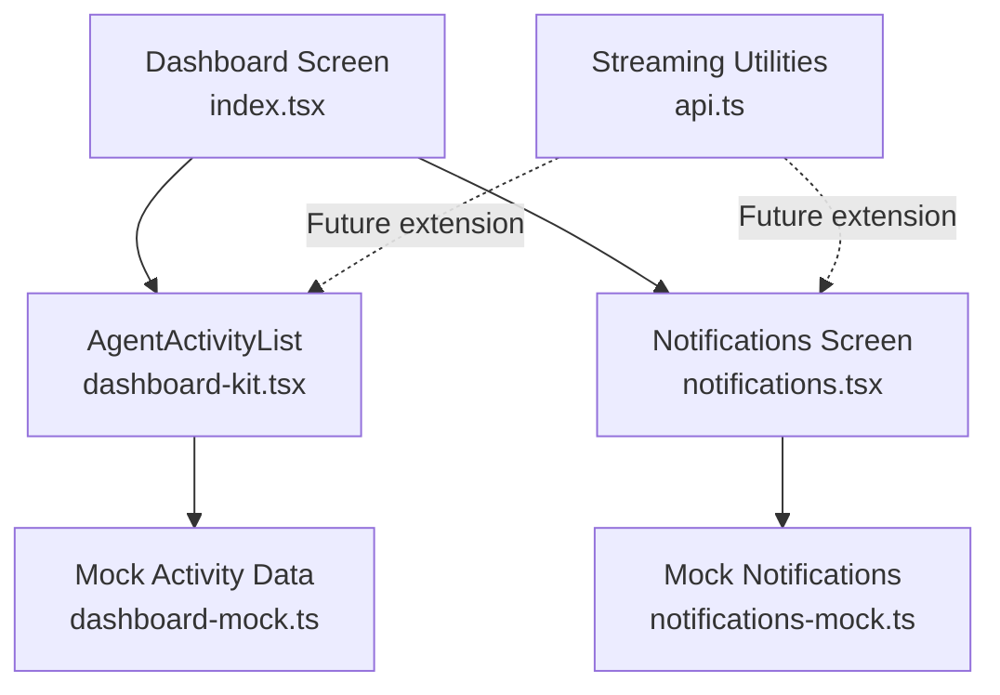
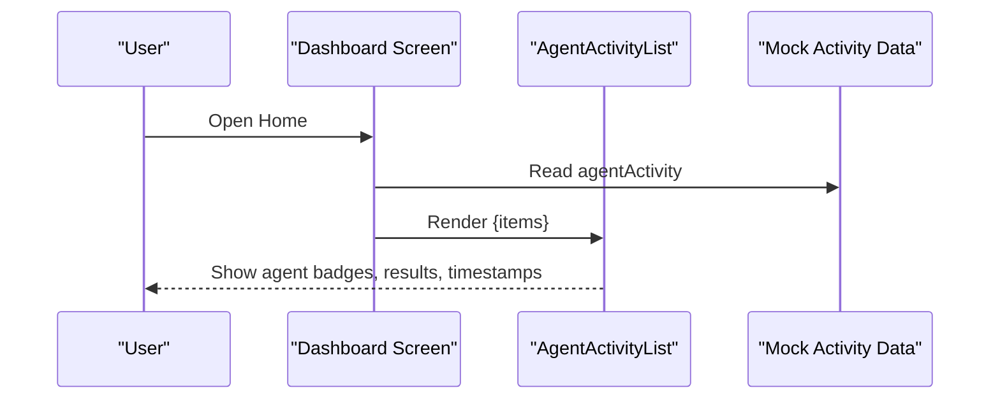
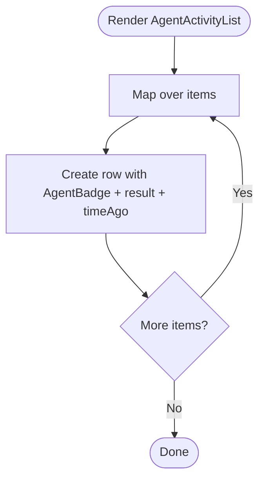
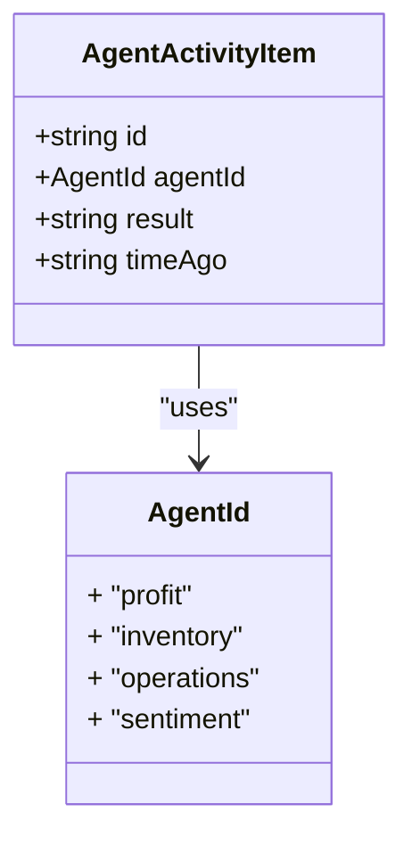
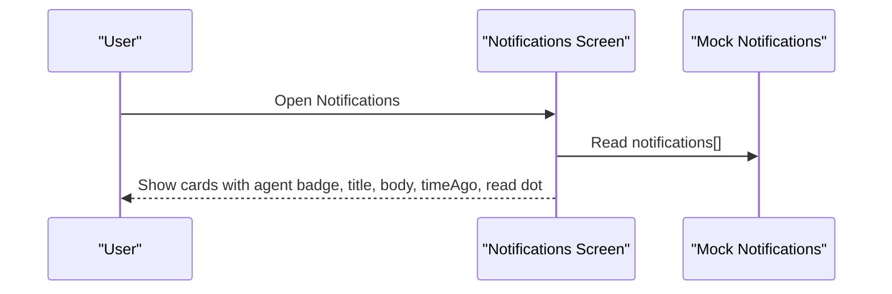
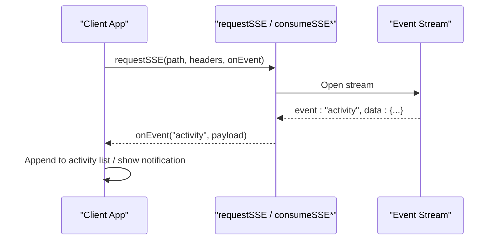
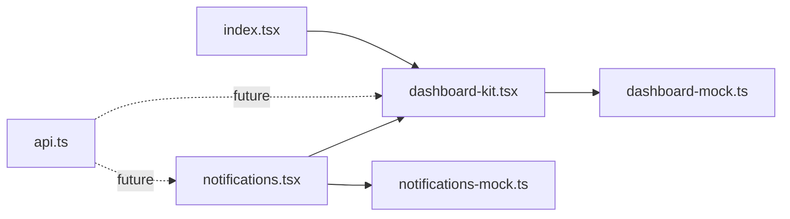

# Agent Activity Tracking

<cite>
**Referenced Files in This Document**
- [dashboard-kit.tsx](file://src/components/dashboard-kit.tsx)
- [dashboard-mock.ts](file://src/constants/dashboard-mock.ts)
- [index.tsx](file://src/app/(app)/(tabs)/index.tsx)
- [notifications.tsx](file://src/app/(app)/notifications.tsx)
- [notifications-mock.ts](file://src/constants/notifications-mock.ts)
- [api.ts](file://src/lib/api.ts)
- [use-product-chat.ts](file://src/hooks/use-product-chat.ts)
</cite>

## Table of Contents
1. [Introduction](#introduction)
2. [Project Structure](#project-structure)
3. [Core Components](#core-components)
4. [Architecture Overview](#architecture-overview)
5. [Detailed Component Analysis](#detailed-component-analysis)
6. [Dependency Analysis](#dependency-analysis)
7. [Performance Considerations](#performance-considerations)
8. [Troubleshooting Guide](#troubleshooting-guide)
9. [Conclusion](#conclusion)
10. [Appendices](#appendices)

## Introduction
This document explains the agent activity tracking system as implemented in the application. It focuses on how the AgentActivityList component monitors and displays automated agent actions, AI-driven tasks, and system-generated activities. It documents the activity types, timestamps, and action details shown to users; describes current filtering, sorting, and search capabilities; provides guidance for logging new activity types and customizing display formats; and outlines real-time update mechanisms and notification systems that can be used to surface important agent activities. Finally, it addresses performance considerations for high-frequency activity streams and efficient pagination strategies.

## Project Structure
The agent activity tracking spans a few key areas:
- Data model and mock data define activity items and agents.
- The dashboard screen composes the UI and renders the AgentActivityList.
- The AgentActivityList component renders each activity with an agent badge, result text, and time ago label.
- A notifications screen shows agent-driven alerts with read/unread state and timestamps.
- Streaming infrastructure (SSE and WebSocket) exists in the API layer and is used elsewhere in the app; it can be extended to power live activity feeds.

**Diagram sources**
- [index.tsx:219-222](file://src/app/(app)/(tabs)/index.tsx#L219-L222)
- [dashboard-kit.tsx:333-356](file://src/components/dashboard-kit.tsx#L333-L356)
- [dashboard-mock.ts:163-179](file://src/constants/dashboard-mock.ts#L163-L179)
- [notifications.tsx:27-53](file://src/app/(app)/notifications.tsx#L27-L53)
- [notifications-mock.ts:18-51](file://src/constants/notifications-mock.ts#L18-L51)
- [api.ts:79-250](file://src/lib/api.ts#L79-L250)

**Section sources**
- [index.tsx:219-222](file://src/app/(app)/(tabs)/index.tsx#L219-L222)
- [dashboard-kit.tsx:333-356](file://src/components/dashboard-kit.tsx#L333-L356)
- [dashboard-mock.ts:163-179](file://src/constants/dashboard-mock.ts#L163-L179)
- [notifications.tsx:27-53](file://src/app/(app)/notifications.tsx#L27-L53)
- [notifications-mock.ts:18-51](file://src/constants/notifications-mock.ts#L18-L51)
- [api.ts:79-250](file://src/lib/api.ts#L79-L250)

## Core Components
- AgentActivityList: Renders a list of recent agent activities. Each row shows an agent badge, the activity result, and a relative timestamp.
- AgentBadge: Displays the agent identity (e.g., Profit Agent, Inventory Agent).
- Notifications screen: Shows agent-driven notifications with title, body, agent identity, timestamp, and read status.
- Mock data: Provides typed structures and sample entries for agent activity and notifications.

Key responsibilities:
- Presentational rendering of activity rows and badges.
- Composition within the dashboard screen under “Recent agent activity.”
- Displaying notifications with visual indicators for unread items.

**Section sources**
- [dashboard-kit.tsx:49-59](file://src/components/dashboard-kit.tsx#L49-L59)
- [dashboard-kit.tsx:333-356](file://src/components/dashboard-kit.tsx#L333-L356)
- [notifications.tsx:27-53](file://src/app/(app)/notifications.tsx#L27-L53)
- [dashboard-mock.ts:55-62](file://src/constants/dashboard-mock.ts#L55-L62)
- [dashboard-mock.ts:163-179](file://src/constants/dashboard-mock.ts#L163-L179)
- [notifications-mock.ts:9-16](file://src/constants/notifications-mock.ts#L9-L16)

## Architecture Overview
At present, the activity feed is driven by static mock data rendered directly in the dashboard screen. The streaming infrastructure exists in the API layer and can be leveraged to implement real-time updates for both activity lists and notifications.

**Diagram sources**
- [index.tsx:219-222](file://src/app/(app)/(tabs)/index.tsx#L219-L222)
- [dashboard-kit.tsx:333-356](file://src/components/dashboard-kit.tsx#L333-L356)
- [dashboard-mock.ts:163-179](file://src/constants/dashboard-mock.ts#L163-L179)

## Detailed Component Analysis

### AgentActivityList
- Inputs: An array of activity items with id, agentId, result, and timeAgo.
- Rendering: For each item, displays an AgentBadge, the result text, and a secondary timestamp line.
- Styling: Uses consistent spacing and borders between rows.

**Diagram sources**
- [dashboard-kit.tsx:333-356](file://src/components/dashboard-kit.tsx#L333-L356)

**Section sources**
- [dashboard-kit.tsx:333-356](file://src/components/dashboard-kit.tsx#L333-L356)

### Activity Data Model
- AgentId: Enumerates supported agents (profit, inventory, operations, sentiment).
- AgentActivityItem: Contains id, agentId, result, timeAgo.
- Sample entries demonstrate typical activities such as flagged orders, reorders, and price adjustments.

**Diagram sources**
- [dashboard-mock.ts:55-62](file://src/constants/dashboard-mock.ts#L55-L62)
- [dashboard-mock.ts:163-179](file://src/constants/dashboard-mock.ts#L163-L179)

**Section sources**
- [dashboard-mock.ts:55-62](file://src/constants/dashboard-mock.ts#L55-L62)
- [dashboard-mock.ts:163-179](file://src/constants/dashboard-mock.ts#L163-L179)

### Notifications System
- Notifications screen renders a list of notifications with agent identity, title, body, timestamp, and read indicator.
- Mock notifications reuse the same AgentId to keep identity consistent across the app.

**Diagram sources**
- [notifications.tsx:27-53](file://src/app/(app)/notifications.tsx#L27-L53)
- [notifications-mock.ts:18-51](file://src/constants/notifications-mock.ts#L18-L51)

**Section sources**
- [notifications.tsx:27-53](file://src/app/(app)/notifications.tsx#L27-L53)
- [notifications-mock.ts:18-51](file://src/constants/notifications-mock.ts#L18-L51)

### Real-Time Update Mechanisms
- The API layer includes robust Server-Sent Events (SSE) parsing and consumption for both web and React Native environments, plus WebSocket handling in the product chat hook.
- These primitives can be reused to stream new agent activities or notifications into the UI without full page reloads.

**Diagram sources**
- [api.ts:79-250](file://src/lib/api.ts#L79-L250)
- [use-product-chat.ts:22-66](file://src/hooks/use-product-chat.ts#L22-L66)
- [use-product-chat.ts:222-286](file://src/hooks/use-product-chat.ts#L222-L286)

**Section sources**
- [api.ts:79-250](file://src/lib/api.ts#L79-L250)
- [use-product-chat.ts:22-66](file://src/hooks/use-product-chat.ts#L22-L66)
- [use-product-chat.ts:222-286](file://src/hooks/use-product-chat.ts#L222-L286)

## Dependency Analysis
- Dashboard screen imports and renders AgentActivityList with mock data.
- AgentActivityList depends on AgentBadge and theme utilities.
- Notifications screen depends on AgentBadge and mock notifications.
- Streaming utilities are independent but available for future integration.

**Diagram sources**
- [index.tsx:8-20](file://src/app/(app)/(tabs)/index.tsx#L8-L20)
- [index.tsx:219-222](file://src/app/(app)/(tabs)/index.tsx#L219-L222)
- [dashboard-kit.tsx:19-35](file://src/components/dashboard-kit.tsx#L19-L35)
- [notifications.tsx:5-10](file://src/app/(app)/notifications.tsx#L5-L10)
- [api.ts:79-250](file://src/lib/api.ts#L79-L250)

**Section sources**
- [index.tsx:8-20](file://src/app/(app)/(tabs)/index.tsx#L8-L20)
- [index.tsx:219-222](file://src/app/(app)/(tabs)/index.tsx#L219-L222)
- [dashboard-kit.tsx:19-35](file://src/components/dashboard-kit.tsx#L19-L35)
- [notifications.tsx:5-10](file://src/app/(app)/notifications.tsx#L5-L10)
- [api.ts:79-250](file://src/lib/api.ts#L79-L250)

## Performance Considerations
Current implementation uses small mock datasets and simple mapping for rendering. For high-frequency activity streams:
- Prefer virtualized lists or windowed rendering to avoid rendering large DOM trees.
- Debounce or throttle incoming events to reduce re-renders during bursts.
- Use stable keys (id) to minimize reconciliation overhead.
- Batch state updates when multiple events arrive close together.
- Implement server-side pagination or cursor-based fetching if loading historical activity.
- Offload heavy formatting (e.g., timeAgo computation) to memoized functions or precomputed values from the backend.

[No sources needed since this section provides general guidance]

## Troubleshooting Guide
- If activity items do not appear, verify that the dashboard screen passes a non-empty items array to AgentActivityList.
- If agent badges are incorrect, ensure agentId values match the defined AgentId enum and Agents mapping.
- For notifications, confirm that read flags and timeAgo fields are set correctly in the data source.
- When integrating streaming, handle error events and connection closures gracefully using existing patterns in the API layer and product chat hook.

**Section sources**
- [dashboard-mock.ts:55-62](file://src/constants/dashboard-mock.ts#L55-L62)
- [dashboard-mock.ts:163-179](file://src/constants/dashboard-mock.ts#L163-L179)
- [notifications-mock.ts:9-16](file://src/constants/notifications-mock.ts#L9-L16)
- [api.ts:206-250](file://src/lib/api.ts#L206-L250)
- [use-product-chat.ts:250-286](file://src/hooks/use-product-chat.ts#L250-L286)

## Conclusion
The agent activity tracking system currently presents recent agent actions via a simple list powered by mock data. The UI components are well-structured and reusable, and the codebase already includes robust streaming infrastructure that can be extended to support real-time updates for both activity lists and notifications. With minimal changes, you can integrate live streams, add filtering/sorting/search, and implement pagination to handle large volumes efficiently.

[No sources needed since this section summarizes without analyzing specific files]

## Appendices

### Activity Types, Timestamps, and Action Details
- Activity types are represented by agentId values: profit, inventory, operations, sentiment.
- Each activity includes:
  - id: unique identifier
  - agentId: identifies the agent responsible
  - result: human-readable description of the action
  - timeAgo: relative timestamp string
- Example entries demonstrate typical outcomes like flagged orders, stock reorders, and price adjustments.

**Section sources**
- [dashboard-mock.ts:55-62](file://src/constants/dashboard-mock.ts#L55-L62)
- [dashboard-mock.ts:163-179](file://src/constants/dashboard-mock.ts#L163-L179)

### Filtering, Sorting, and Search
- Current implementation does not include built-in filtering, sorting, or search for the activity list.
- To add these features:
  - Introduce local state for filters (agent type), sort order (newest first), and search query (match against result text).
  - Apply transformations before rendering to produce filtered/sorted subsets.
  - Consider debouncing search input to optimize performance.

[No sources needed since this section proposes enhancements without analyzing specific files]

### Logging New Activity Types
- Extend the AgentActivityItem structure to include additional fields if needed (e.g., category, severity, metadata).
- Add new agentId values to the AgentId enum and corresponding entries in the Agents mapping.
- Update mock data or integrate a backend endpoint to supply new activity types.

**Section sources**
- [dashboard-mock.ts:55-62](file://src/constants/dashboard-mock.ts#L55-L62)
- [dashboard-mock.ts:163-179](file://src/constants/dashboard-mock.ts#L163-L179)

### Customizing Activity Display Formats
- Modify AgentActivityList to render different layouts based on activity properties (e.g., severity, category).
- Reuse AgentBadge for consistent agent identity presentation.
- Adjust styles to accommodate longer descriptions or additional metadata.

**Section sources**
- [dashboard-kit.tsx:333-356](file://src/components/dashboard-kit.tsx#L333-L356)
- [dashboard-kit.tsx:49-59](file://src/components/dashboard-kit.tsx#L49-L59)

### Real-Time Updates and Notifications
- Use the existing SSE utilities to subscribe to a stream of activity events and append them to the activity list.
- For critical activities, push notifications via the notifications screen pattern, marking them as unread until viewed.
- Leverage WebSocket patterns demonstrated in the product chat hook for bidirectional communication if needed.

**Section sources**
- [api.ts:79-250](file://src/lib/api.ts#L79-L250)
- [use-product-chat.ts:22-66](file://src/hooks/use-product-chat.ts#L22-L66)
- [use-product-chat.ts:222-286](file://src/hooks/use-product-chat.ts#L222-L286)
- [notifications.tsx:27-53](file://src/app/(app)/notifications.tsx#L27-L53)

### Pagination Strategies
- For large historical activity sets, implement cursor-based pagination or offset/limit queries.
- On the client, load initial pages and fetch subsequent pages on scroll or user action.
- Combine with virtualization to maintain smooth scrolling performance.

[No sources needed since this section provides general guidance]