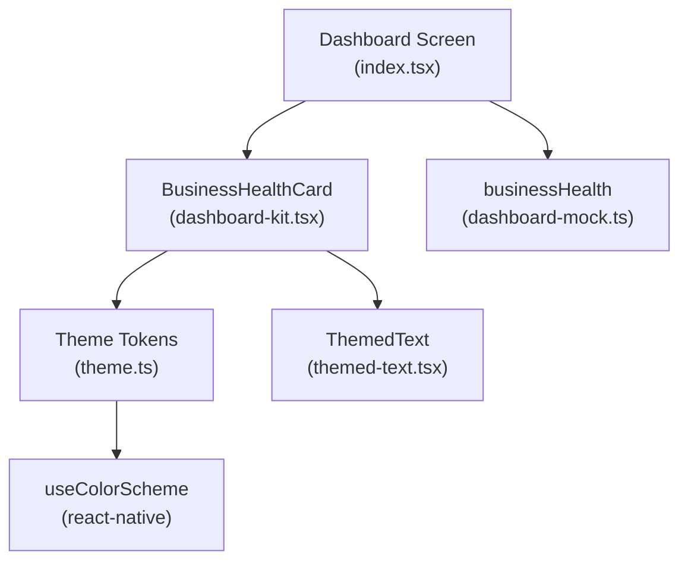
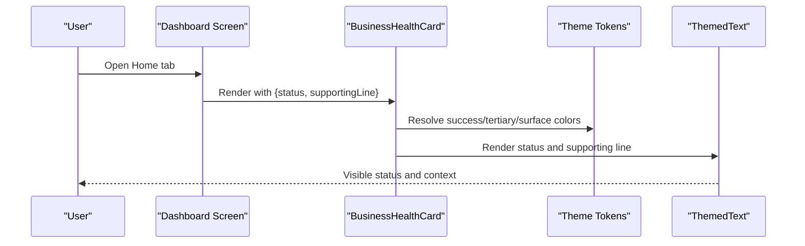
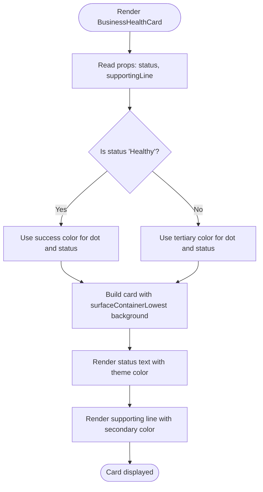
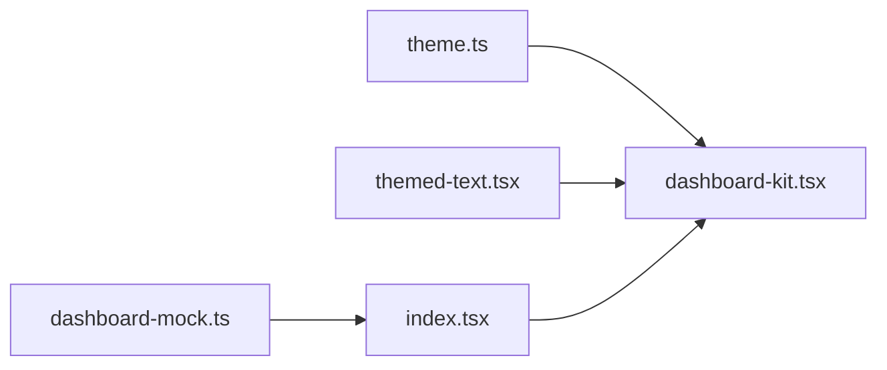

# Business Health Overview

<cite>
**Referenced Files in This Document**
- [dashboard-kit.tsx](file://src/components/dashboard-kit.tsx)
- [index.tsx](file://src/app/(app)/(tabs)/index.tsx)
- [dashboard-mock.ts](file://src/constants/dashboard-mock.ts)
- [theme.ts](file://src/constants/theme.ts)
- [use-theme.ts](file://src/hooks/use-theme.ts)
- [themed-text.tsx](file://src/components/themed-text.tsx)
</cite>

## Table of Contents
1. [Introduction](#introduction)
2. [Project Structure](#project-structure)
3. [Core Components](#core-components)
4. [Architecture Overview](#architecture-overview)
5. [Detailed Component Analysis](#detailed-component-analysis)
6. [Dependency Analysis](#dependency-analysis)
7. [Performance Considerations](#performance-considerations)
8. [Troubleshooting Guide](#troubleshooting-guide)
9. [Conclusion](#conclusion)
10. [Appendices](#appendices)

## Introduction
This document explains the Business Health Overview component, centered on the BusinessHealthCard. It covers how the card displays overall business status, supporting metrics and context, visual states and color schemes, responsive behavior across screen sizes and platforms, accessibility considerations, and theme support for different user preferences. It also provides guidance for customizing the health status display and integrating with real-time data sources.

## Project Structure
The Business Health Overview is composed of:
- A presentational card component that renders the health status and supporting line
- A dashboard screen that composes the card alongside other KPIs and insights
- Mock data that defines the current health state and supporting text
- Theme tokens that define colors for healthy and warning states, plus light/dark variants
- Typography and text components used to render status and supporting lines consistently

**Diagram sources**
- [index.tsx:103-177](file://src/app/(app)/(tabs)/index.tsx#L103-L177)
- [dashboard-kit.tsx:85-103](file://src/components/dashboard-kit.tsx#L85-L103)
- [dashboard-mock.ts:64-72](file://src/constants/dashboard-mock.ts#L64-L72)
- [theme.ts:117-141](file://src/constants/theme.ts#L117-L141)
- [themed-text.tsx:29-56](file://src/components/themed-text.tsx#L29-L56)

**Section sources**
- [index.tsx:103-177](file://src/app/(app)/(tabs)/index.tsx#L103-L177)
- [dashboard-kit.tsx:85-103](file://src/components/dashboard-kit.tsx#L85-L103)
- [dashboard-mock.ts:64-72](file://src/constants/dashboard-mock.ts#L64-L72)
- [theme.ts:117-141](file://src/constants/theme.ts#L117-L141)
- [themed-text.tsx:29-56](file://src/components/themed-text.tsx#L29-L56)

## Core Components
- BusinessHealthCard: Renders a compact status banner with an indicator dot, the status label, and a supporting line that provides context about performance or system state.
- Dashboard screen: Composes the BusinessHealthCard at the top of the Home tab, followed by key metrics (e.g., True Profit), primary insight, and additional sections.
- Mock data: Provides the initial business health object including status and supportingLine.
- Theme: Supplies semantic color tokens (success for healthy, tertiary for warning) and surface/background tokens for consistent appearance in light and dark modes.
- ThemedText: Applies typography scale and theme-aware colors to ensure readability and consistency.

Key responsibilities:
- Status rendering: The card maps the incoming status to a visual indicator and color.
- Supporting line: Displays contextual information about business performance or connectivity.
- Theming: Uses theme tokens to adapt to light/dark mode and maintain contrast.
- Responsiveness: Leverages flexible layout and typography scale to work across devices.

**Section sources**
- [dashboard-kit.tsx:85-103](file://src/components/dashboard-kit.tsx#L85-L103)
- [index.tsx:176-178](file://src/app/(app)/(tabs)/index.tsx#L176-L178)
- [dashboard-mock.ts:64-72](file://src/constants/dashboard-mock.ts#L64-L72)
- [theme.ts:117-141](file://src/constants/theme.ts#L117-L141)
- [themed-text.tsx:29-56](file://src/components/themed-text.tsx#L29-L56)

## Architecture Overview
The Business Health Overview follows a simple, composable architecture:
- Data layer: Mock data defines the current health state and supporting message.
- Presentation layer: BusinessHealthCard renders the status and supporting line using theme tokens and typography.
- Composition layer: The dashboard screen imports and mounts the card, passing data from mock or future real-time sources.

**Diagram sources**
- [index.tsx:176-178](file://src/app/(app)/(tabs)/index.tsx#L176-L178)
- [dashboard-kit.tsx:85-103](file://src/components/dashboard-kit.tsx#L85-L103)
- [theme.ts:117-141](file://src/constants/theme.ts#L117-L141)
- [themed-text.tsx:29-56](file://src/components/themed-text.tsx#L29-L56)

## Detailed Component Analysis

### BusinessHealthCard
Responsibilities:
- Display a small colored dot indicating health state
- Show the status label with appropriate color
- Render a supporting line that provides context about performance or connectivity

Visual states and color mapping:
- Healthy: Indicator dot and status text use the success token; background uses a low-surface container for subtle separation.
- Needs attention: Indicator dot and status text use the tertiary token (amber accent); background remains a low-surface container.

Supporting line:
- Displays contextual information such as margin stability and store sync status.
- Uses secondary text color for lower emphasis while maintaining readability.

Responsive design:
- Uses flexible row layout with gap spacing to accommodate varying content widths.
- Relies on typography scale for readable text at different sizes.
- Card padding and border radius follow the design system’s spacing and radius tokens.

Accessibility:
- Semantic text hierarchy via type tokens ensures proper font sizing and weight.
- High contrast between status text and background due to theme tokens.
- Clear visual distinction between states through color and dot indicator.

Integration points:
- Consumes theme tokens for colors and surfaces.
- Uses ThemedText for consistent typography and color application.

Customization examples:
- Extend supported statuses by adding new branches in the status-to-color logic and updating the mock data type accordingly.
- Replace the supporting line with dynamic content fetched from APIs or websockets for real-time updates.
- Add icons or badges next to the status to indicate sub-states (e.g., “synced”, “delayed”).

Real-time integration:
- Replace mock data with a hook that fetches business health metrics from your backend.
- Update the card props reactively when new data arrives.
- Debounce frequent updates to avoid excessive re-renders.

**Diagram sources**
- [dashboard-kit.tsx:85-103](file://src/components/dashboard-kit.tsx#L85-L103)
- [theme.ts:117-141](file://src/constants/theme.ts#L117-L141)

**Section sources**
- [dashboard-kit.tsx:85-103](file://src/components/dashboard-kit.tsx#L85-L103)
- [dashboard-mock.ts:64-72](file://src/constants/dashboard-mock.ts#L64-L72)
- [theme.ts:117-141](file://src/constants/theme.ts#L117-L141)
- [themed-text.tsx:29-56](file://src/components/themed-text.tsx#L29-L56)

### Dashboard Screen Integration
Responsibilities:
- Import and mount BusinessHealthCard
- Pass mock data (or real-time data) as props
- Arrange the card within the scrollable dashboard layout

Behavior:
- The card appears near the top of the Home tab, above key metrics and insights.
- Layout uses consistent spacing and alignment to maintain visual rhythm.

**Section sources**
- [index.tsx:103-177](file://src/app/(app)/(tabs)/index.tsx#L103-L177)

### Mock Data Model
Responsibilities:
- Define the shape of business health data: status and supportingLine
- Provide default values for development and testing

Extensibility:
- Expand the type to include additional fields like timestamp, source marketplace, or severity level if needed.
- Swap mock data with live data without changing the card’s interface.

**Section sources**
- [dashboard-mock.ts:64-72](file://src/constants/dashboard-mock.ts#L64-L72)

### Theme and Colors
Responsibilities:
- Provide semantic color tokens for success (healthy) and tertiary (warning)
- Supply surface containers for backgrounds and borders for structure
- Support light and dark modes via useTheme

Notes:
- Success and tertiary tokens are used to differentiate healthy vs. needs attention states.
- SurfaceContainerLowest ensures the card stands out subtly against the page background.

**Section sources**
- [theme.ts:117-141](file://src/constants/theme.ts#L117-L141)
- [use-theme.ts:9-14](file://src/hooks/use-theme.ts#L9-L14)

### Typography and Text Rendering
Responsibilities:
- Apply consistent typography scale and theme-aware colors
- Ensure readability across platforms and themes

Usage:
- Status text uses a medium body style with bold weight for emphasis.
- Supporting line uses a smaller body style with secondary color for lower emphasis.

**Section sources**
- [themed-text.tsx:29-56](file://src/components/themed-text.tsx#L29-L56)
- [theme.ts:183-235](file://src/constants/theme.ts#L183-L235)

## Dependency Analysis
The Business Health Overview has clear, minimal dependencies:
- BusinessHealthCard depends on theme tokens and ThemedText
- Dashboard screen composes the card and supplies data
- Mock data provides initial values but can be replaced with real-time sources

**Diagram sources**
- [dashboard-kit.tsx:85-103](file://src/components/dashboard-kit.tsx#L85-L103)
- [index.tsx:176-178](file://src/app/(app)/(tabs)/index.tsx#L176-L178)
- [dashboard-mock.ts:64-72](file://src/constants/dashboard-mock.ts#L64-L72)
- [theme.ts:117-141](file://src/constants/theme.ts#L117-L141)
- [themed-text.tsx:29-56](file://src/components/themed-text.tsx#L29-L56)

**Section sources**
- [dashboard-kit.tsx:85-103](file://src/components/dashboard-kit.tsx#L85-L103)
- [index.tsx:176-178](file://src/app/(app)/(tabs)/index.tsx#L176-L178)
- [dashboard-mock.ts:64-72](file://src/constants/dashboard-mock.ts#L64-L72)
- [theme.ts:117-141](file://src/constants/theme.ts#L117-L141)
- [themed-text.tsx:29-56](file://src/components/themed-text.tsx#L29-L56)

## Performance Considerations
- Minimal re-renders: The card is lightweight and only re-renders when props change.
- Avoid heavy computations inside render: Keep status determination simple and move complex logic to hooks or memoized functions.
- Debounce real-time updates: If integrating with streaming data, debounce updates to prevent excessive UI refreshes.
- Use stable keys and lists: When expanding the dashboard, ensure list items have stable identifiers.

[No sources needed since this section provides general guidance]

## Troubleshooting Guide
Common issues and resolutions:
- Incorrect color for status: Verify the status value matches expected strings and that theme tokens resolve correctly in both light and dark modes.
- Missing supporting line: Ensure the supportingLine prop is provided and not undefined.
- Theme mismatch: Confirm useTheme returns the correct scheme and that Colors contain the required tokens (success, tertiary, surfaceContainerLowest).
- Accessibility concerns: Check contrast ratios between status text and background; adjust tokens if necessary.

**Section sources**
- [dashboard-kit.tsx:85-103](file://src/components/dashboard-kit.tsx#L85-L103)
- [theme.ts:117-141](file://src/constants/theme.ts#L117-L141)
- [use-theme.ts:9-14](file://src/hooks/use-theme.ts#L9-L14)

## Conclusion
The Business Health Overview component provides a concise, accessible, and theme-aware status indicator for business performance. It uses a simple status-to-color mapping, supports responsive layouts, and integrates cleanly with the dashboard. With minimal changes, it can be extended to support additional states, richer context, and real-time data sources while maintaining accessibility and theming consistency.

[No sources needed since this section summarizes without analyzing specific files]

## Appendices

### Customization Examples
- Add a new status: Extend the status check and map to a new color token; update mock data types accordingly.
- Dynamic supporting line: Fetch context from APIs and update the supportingLine prop reactively.
- Real-time integration: Use a WebSocket or polling hook to update status and supporting line without manual refresh.

[No sources needed since this section provides general guidance]

### Responsive Design Patterns
- Flexible row layout with gap spacing adapts to narrow and wide screens.
- Typography scale ensures readability across devices.
- Consistent padding and border radius maintain visual cohesion.

[No sources needed since this section provides general guidance]

### Accessibility and Theme Support
- Semantic typography and theme colors ensure readability and contrast.
- Light/dark mode support via useTheme and Colors.
- Clear visual indicators (dot + color) aid quick comprehension.

[No sources needed since this section provides general guidance]