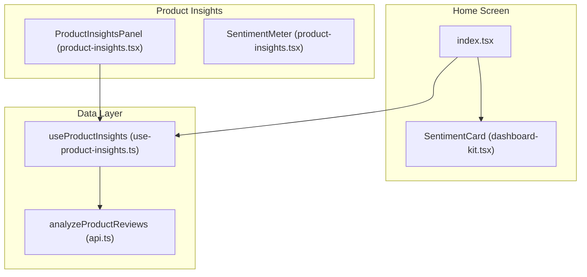
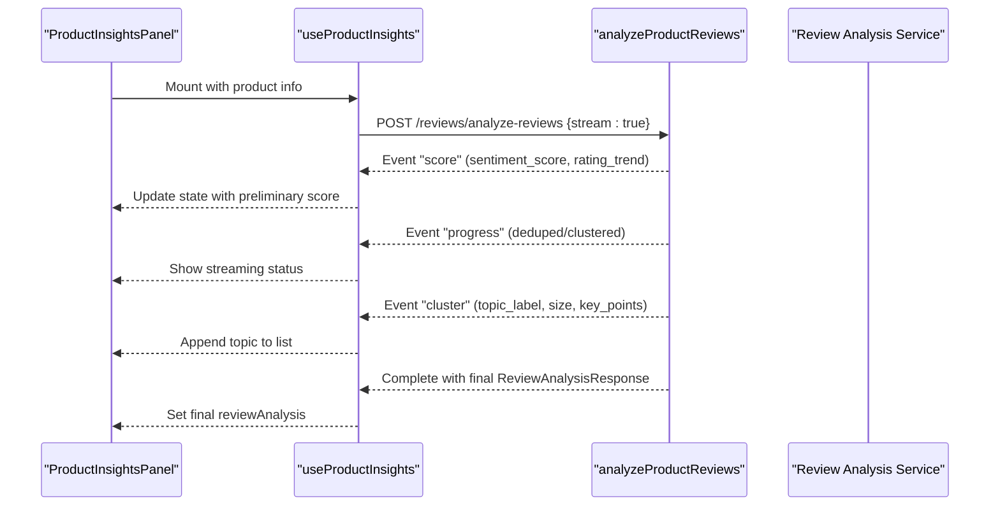
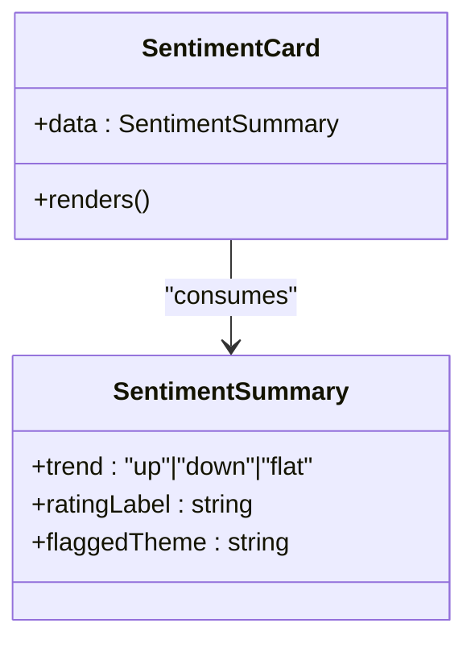
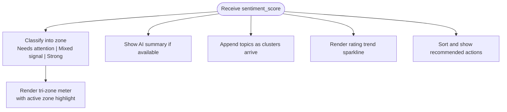
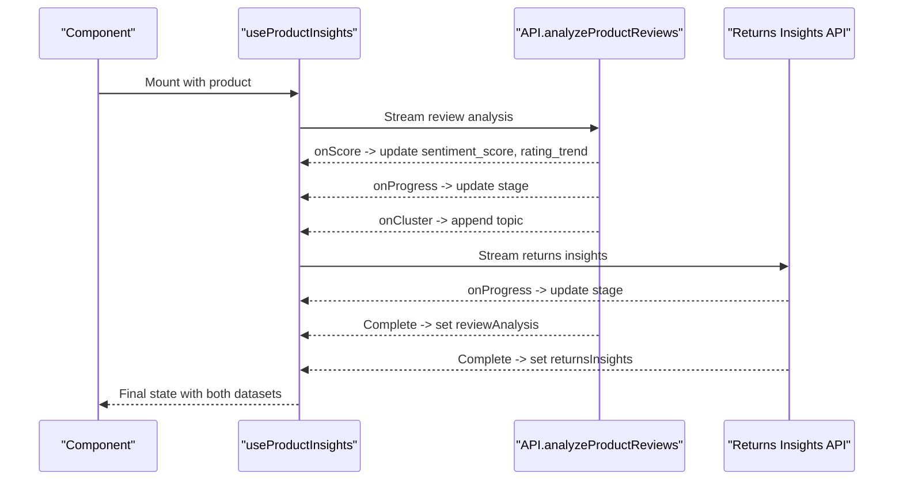
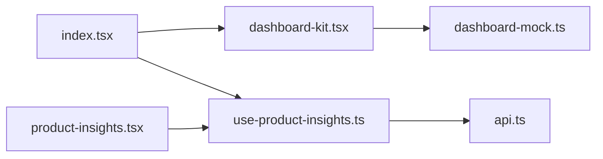

# Customer Sentiment Analysis

<cite>
**Referenced Files in This Document**
- [dashboard-kit.tsx](file://src/components/dashboard-kit.tsx)
- [product-insights.tsx](file://src/components/product-insights.tsx)
- [use-product-insights.ts](file://src/hooks/use-product-insights.ts)
- [api.ts](file://src/lib/api.ts)
- [dashboard-mock.ts](file://src/constants/dashboard-mock.ts)
- [index.tsx](file://src/app/(app)/(tabs)/index.tsx)
</cite>

## Table of Contents
1. [Introduction](#introduction)
2. [Project Structure](#project-structure)
3. [Core Components](#core-components)
4. [Architecture Overview](#architecture-overview)
5. [Detailed Component Analysis](#detailed-component-analysis)
6. [Dependency Analysis](#dependency-analysis)
7. [Performance Considerations](#performance-considerations)
8. [Troubleshooting Guide](#troubleshooting-guide)
9. [Conclusion](#conclusion)
10. [Appendices](#appendices)

## Introduction
This document explains the customer sentiment analysis feature implemented in the application. It covers how sentiment data is fetched, processed, and displayed to users; how scores are classified into zones; how trends are visualized; and how the system integrates with marketplace review data. It also provides guidance on customizing thresholds, configuring alerts for significant changes, addressing data privacy, and extending the system with custom NLP models or third-party services.

## Project Structure
The sentiment feature spans UI components, a React hook for data fetching, and API utilities:
- Dashboard-level sentiment card displays a high-level summary on the Home screen.
- Product-level insights panel shows detailed sentiment score, rating trend, topics, and recommended actions for a specific product.
- A hook orchestrates streaming review analysis and returns insights from the backend.
- API types and functions define the contract for review analysis events and responses.
- Mock dashboard data demonstrates the expected shape of sentiment summaries used by the Home screen.

**Diagram sources**
- [index.tsx:214-217](file://src/app/(app)/(tabs)/index.tsx#L214-L217)
- [dashboard-kit.tsx:311-331](file://src/components/dashboard-kit.tsx#L311-L331)
- [product-insights.tsx:99-229](file://src/components/product-insights.tsx#L99-L229)
- [use-product-insights.ts:165-224](file://src/hooks/use-product-insights.ts#L165-L224)
- [api.ts:1342-1364](file://src/lib/api.ts#L1342-L1364)

**Section sources**
- [index.tsx:214-217](file://src/app/(app)/(tabs)/index.tsx#L214-L217)
- [dashboard-kit.tsx:311-331](file://src/components/dashboard-kit.tsx#L311-L331)
- [product-insights.tsx:99-229](file://src/components/product-insights.tsx#L99-L229)
- [use-product-insights.ts:165-224](file://src/hooks/use-product-insights.ts#L165-L224)
- [api.ts:1342-1364](file://src/lib/api.ts#L1342-L1364)

## Core Components
- SentimentCard (dashboard): Displays overall sentiment trend, rating label, and a flagged theme for the merchant’s portfolio.
- ProductInsightsPanel: Shows per-product sentiment score, a tri-zone meter, AI summary, recurring themes, rating trend sparkline, and recommended actions.
- useProductInsights: Orchestrates SSE-based review analysis and returns insights, handling streaming progress and errors independently.
- API layer: Defines event types for streaming review analysis and exposes analyzeProductReviews to fetch real-time updates.

Key responsibilities:
- Fetching and streaming review analysis results.
- Classifying sentiment into zones for consistent UX.
- Visualizing rating trends over time.
- Presenting actionable insights derived from review clustering.

**Section sources**
- [dashboard-kit.tsx:311-331](file://src/components/dashboard-kit.tsx#L311-L331)
- [product-insights.tsx:19-32](file://src/components/product-insights.tsx#L19-L32)
- [product-insights.tsx:59-97](file://src/components/product-insights.tsx#L59-L97)
- [product-insights.tsx:99-229](file://src/components/product-insights.tsx#L99-L229)
- [use-product-insights.ts:14-25](file://src/hooks/use-product-insights.ts#L14-L25)
- [use-product-insights.ts:165-224](file://src/hooks/use-product-insights.ts#L165-L224)
- [api.ts:1300-1364](file://src/lib/api.ts#L1300-L1364)

## Architecture Overview
The feature uses server-sent events (SSE) to stream partial results during review analysis. The hook initiates two independent streams:
- Review analysis: emits early score, progress, and cluster events before completing.
- Returns insights: emits progress events while fetching marketplace data.

**Diagram sources**
- [use-product-insights.ts:165-224](file://src/hooks/use-product-insights.ts#L165-L224)
- [api.ts:1342-1364](file://src/lib/api.ts#L1342-L1364)
- [product-insights.tsx:163-229](file://src/components/product-insights.tsx#L163-L229)

## Detailed Component Analysis

### SentimentCard (Dashboard)
- Purpose: Provide a compact overview of overall sentiment trend and a highlighted theme for the merchant.
- Inputs: SentimentSummary including trend direction, rating label, and flagged theme.
- Behavior: Renders an arrow indicating trend direction, the rating label, and a short text describing the most notable theme.

**Diagram sources**
- [dashboard-kit.tsx:311-331](file://src/components/dashboard-kit.tsx#L311-L331)
- [dashboard-mock.ts:151-161](file://src/constants/dashboard-mock.ts#L151-L161)

**Section sources**
- [dashboard-kit.tsx:311-331](file://src/components/dashboard-kit.tsx#L311-L331)
- [dashboard-mock.ts:151-161](file://src/constants/dashboard-mock.ts#L151-L161)
- [index.tsx:214-217](file://src/app/(app)/(tabs)/index.tsx#L214-L217)

### ProductInsightsPanel and SentimentMeter
- Purpose: Display per-product sentiment score, classification zone, AI summary, recurring themes, rating trend, and recommended actions.
- Classification: Uses a tri-zone threshold model to map numeric scores to “Needs attention,” “Mixed signal,” and “Strong.”
- Trend visualization: Renders a sparkline of monthly average ratings derived from rating_trend.
- Streaming UX: Shows live status messages while analysis is in progress.

**Diagram sources**
- [product-insights.tsx:19-32](file://src/components/product-insights.tsx#L19-L32)
- [product-insights.tsx:59-97](file://src/components/product-insights.tsx#L59-L97)
- [product-insights.tsx:163-229](file://src/components/product-insights.tsx#L163-L229)
- [product-insights.tsx:231-301](file://src/components/product-insights.tsx#L231-L301)

**Section sources**
- [product-insights.tsx:19-32](file://src/components/product-insights.tsx#L19-L32)
- [product-insights.tsx:59-97](file://src/components/product-insights.tsx#L59-L97)
- [product-insights.tsx:99-229](file://src/components/product-insights.tsx#L99-L229)
- [product-insights.tsx:231-301](file://src/components/product-insights.tsx#L231-L301)

### Data Flow: useProductInsights and API
- Responsibilities:
  - Resolve authentication and marketplace connection.
  - Initiate streaming review analysis and returns insights concurrently.
  - Handle partial updates via SSE events and finalize when complete.
  - Surface independent error states for each source.
- Key events:
  - Score: early sentiment_score and rating_trend.
  - Progress: pipeline stages like deduplication and clustering.
  - Cluster: discovered topics with metadata.

**Diagram sources**
- [use-product-insights.ts:165-224](file://src/hooks/use-product-insights.ts#L165-L224)
- [api.ts:1342-1364](file://src/lib/api.ts#L1342-L1364)

**Section sources**
- [use-product-insights.ts:14-25](file://src/hooks/use-product-insights.ts#L14-L25)
- [use-product-insights.ts:165-224](file://src/hooks/use-product-insights.ts#L165-L224)
- [api.ts:1300-1364](file://src/lib/api.ts#L1300-L1364)

## Dependency Analysis
- UI depends on:
  - dashboard-kit.tsx for SentimentCard.
  - product-insights.tsx for detailed sentiment display and classification.
- Hooks depend on:
  - api.ts for streaming review analysis and returns insights.
- Constants provide mock shapes for dashboard-level sentiment summary.

**Diagram sources**
- [index.tsx:214-217](file://src/app/(app)/(tabs)/index.tsx#L214-L217)
- [dashboard-kit.tsx:311-331](file://src/components/dashboard-kit.tsx#L311-L331)
- [product-insights.tsx:99-229](file://src/components/product-insights.tsx#L99-L229)
- [use-product-insights.ts:165-224](file://src/hooks/use-product-insights.ts#L165-L224)
- [api.ts:1342-1364](file://src/lib/api.ts#L1342-L1364)
- [dashboard-mock.ts:151-161](file://src/constants/dashboard-mock.ts#L151-L161)

**Section sources**
- [index.tsx:214-217](file://src/app/(app)/(tabs)/index.tsx#L214-L217)
- [dashboard-kit.tsx:311-331](file://src/components/dashboard-kit.tsx#L311-L331)
- [product-insights.tsx:99-229](file://src/components/product-insights.tsx#L99-L229)
- [use-product-insights.ts:165-224](file://src/hooks/use-product-insights.ts#L165-L224)
- [api.ts:1342-1364](file://src/lib/api.ts#L1342-L1364)
- [dashboard-mock.ts:151-161](file://src/constants/dashboard-mock.ts#L151-L161)

## Performance Considerations
- Streaming updates reduce perceived latency by showing preliminary scores and progress immediately.
- Independent failure handling ensures one failing source does not hide successful data from the other.
- Debouncing or throttling could be considered if frequent cluster events cause excessive re-renders.
- Sparkline rendering should remain lightweight; ensure points arrays are precomputed and minimal.

[No sources needed since this section provides general guidance]

## Troubleshooting Guide
Common issues and resolutions:
- No data shown: Ensure the marketplace connection is established and the product has a valid URL. The hook checks for accessToken and darazAccessToken before initiating requests.
- Streaming never completes: Verify network connectivity and that the backend SSE endpoint is reachable. Check for cancellation flags if the component unmounts prematurely.
- Errors surfaced: Each source sets its own error message; retry functionality is provided to reattempt failed calls.

Operational tips:
- Use the “Try again” action to refetch when errors occur.
- Monitor streaming status labels to understand current pipeline stage.

**Section sources**
- [use-product-insights.ts:127-145](file://src/hooks/use-product-insights.ts#L127-L145)
- [use-product-insights.ts:225-255](file://src/hooks/use-product-insights.ts#L225-L255)
- [product-insights.tsx:148-161](file://src/components/product-insights.tsx#L148-L161)

## Conclusion
The sentiment analysis feature delivers timely, actionable insights through streaming review analysis and clear visualizations. Scores are mapped to intuitive zones, trends are plotted over time, and topics are surfaced as recurring themes. The architecture separates concerns between UI, data orchestration, and API contracts, enabling extensibility and robust error handling.

[No sources needed since this section summarizes without analyzing specific files]

## Appendices

### Customizing Sentiment Thresholds
- Location: Tri-zone thresholds are defined in the product insights component.
- How to customize: Adjust the ceiling values and labels in the sentiment zones configuration to align with your business needs.
- Impact: Changes will affect the meter fill color and active zone label across the product insights panel.

**Section sources**
- [product-insights.tsx:19-32](file://src/components/product-insights.tsx#L19-L32)

### Configuring Alert Triggers for Significant Sentiment Changes
- Current behavior: The app surfaces trending information and recommended actions based on review analysis outputs.
- Suggested approach: Implement client-side logic to compare current sentiment_score against previous values and trigger alerts when changes exceed configured thresholds. You can extend the hook to store historical scores and emit notifications when thresholds are breached.

[No sources needed since this section proposes implementation guidance]

### Integrating with Review Platforms and Social Media Monitoring Tools
- Current integration: The feature consumes review analysis from a backend endpoint that aggregates reviews for Daraz products.
- Extending to additional platforms: Add new endpoints or adapters in the API layer to normalize inputs and outputs from other marketplaces or social media tools. Map their outputs to the existing ReviewAnalysisResponse shape to reuse UI components.

**Section sources**
- [api.ts:1342-1364](file://src/lib/api.ts#L1342-L1364)
- [use-product-insights.ts:165-224](file://src/hooks/use-product-insights.ts#L165-L224)

### Data Privacy and Secure Handling Practices
- Authentication: Requests include Authorization headers using access tokens obtained via the auth flow.
- Token management: Access tokens are resolved through dedicated hooks before initiating requests.
- Recommendations:
  - Store tokens securely and rotate them regularly.
  - Minimize logging of sensitive payloads.
  - Enforce HTTPS and validate server certificates.
  - Apply least-privilege scopes for marketplace integrations.

**Section sources**
- [use-product-insights.ts:97-104](file://src/hooks/use-product-insights.ts#L97-L104)
- [api.ts:1342-1364](file://src/lib/api.ts#L1342-L1364)

### Extending with Custom NLP Models or Third-Party Services
- Strategy:
  - Create a wrapper around the existing analyzeProductReviews function to call a custom NLP service.
  - Normalize the service response to match ReviewAnalysisResponse fields (sentiment_score, rating_trend, summary, topics, action_plan).
  - Keep SSE streaming semantics intact to preserve UX.
- Validation:
  - Ensure all required fields are present and correctly typed.
  - Test edge cases such as empty topics or missing rating_trend entries.

**Section sources**
- [api.ts:1300-1364](file://src/lib/api.ts#L1300-L1364)
- [use-product-insights.ts:165-224](file://src/hooks/use-product-insights.ts#L165-L224)