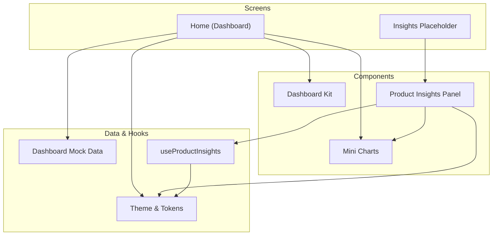
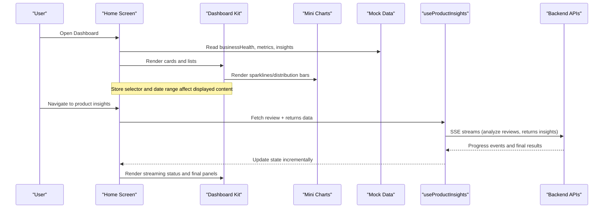
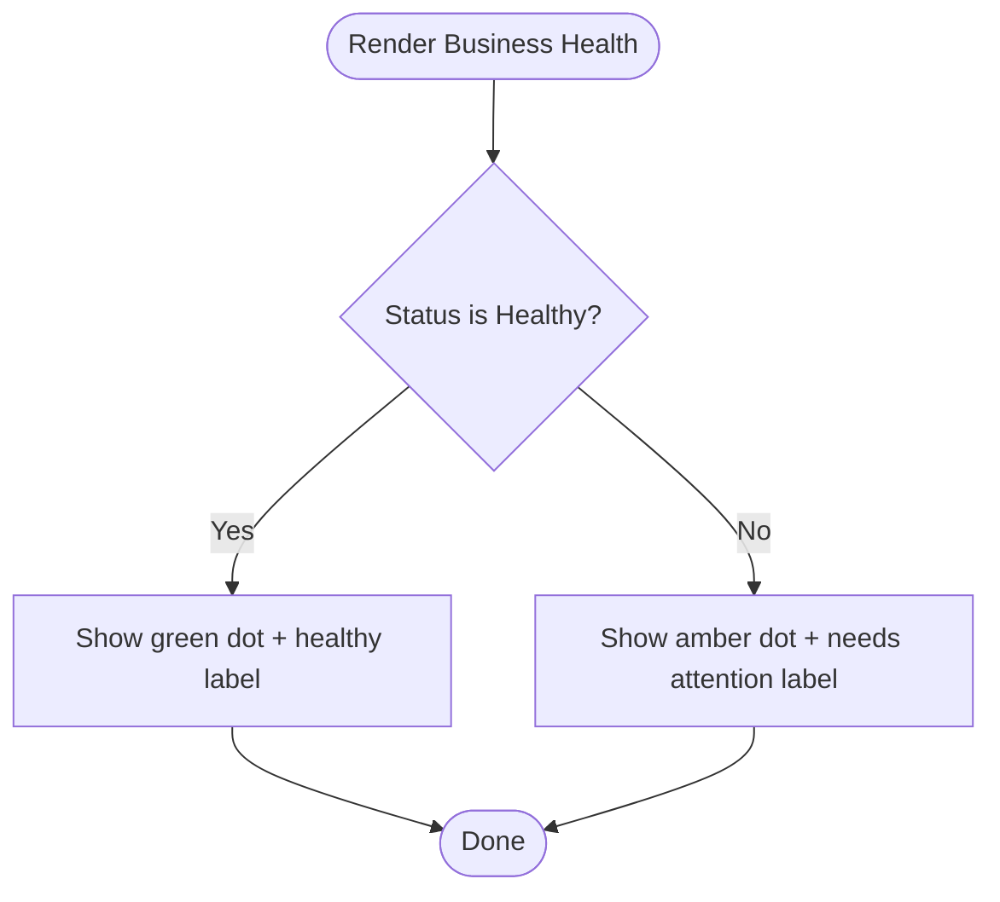
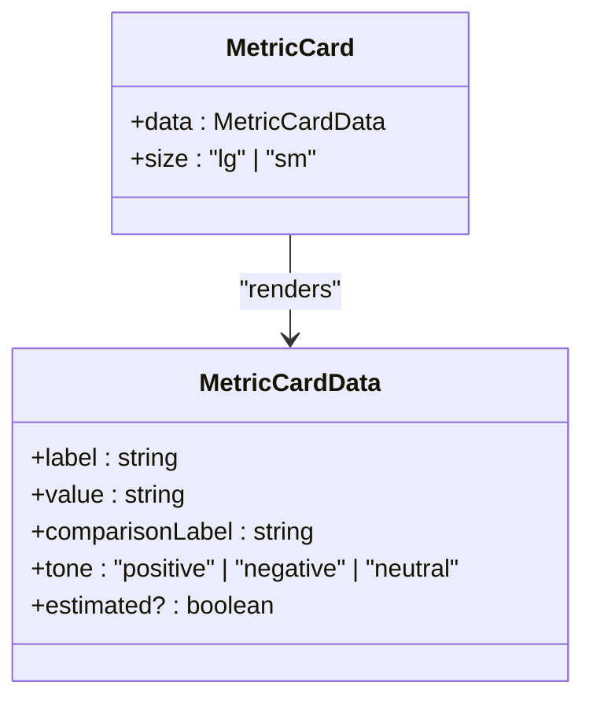
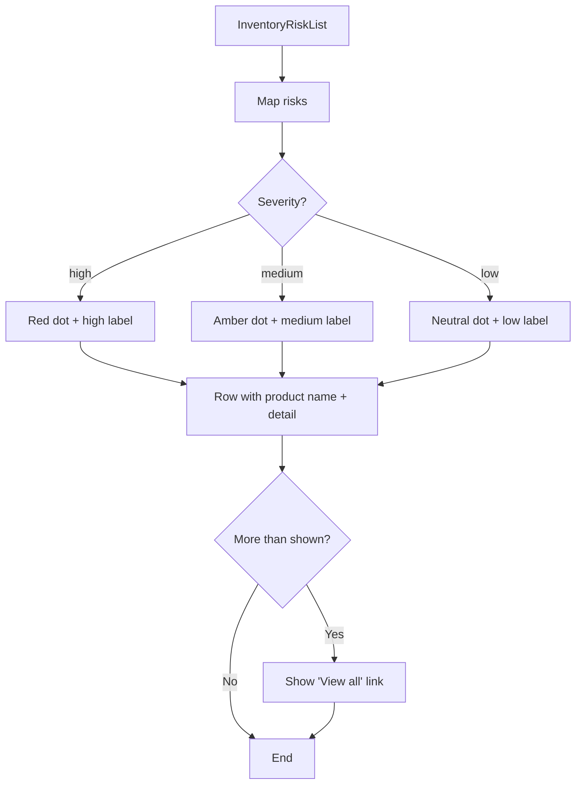
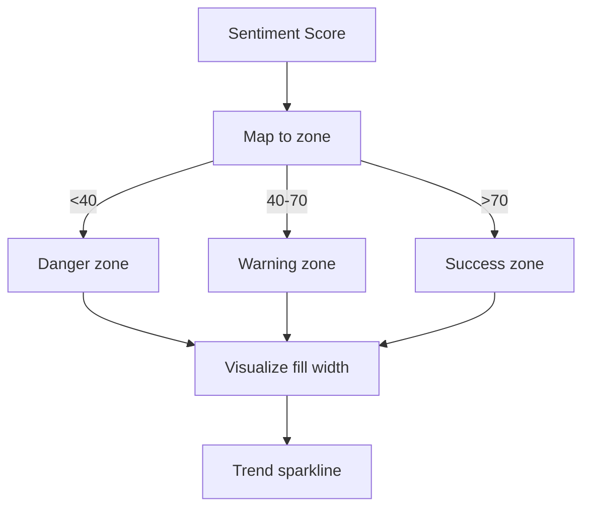
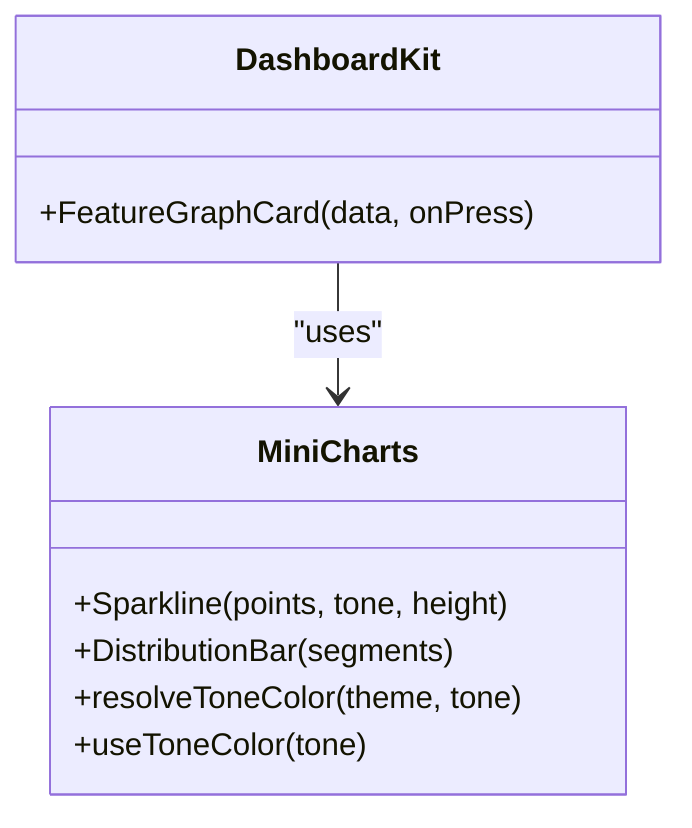
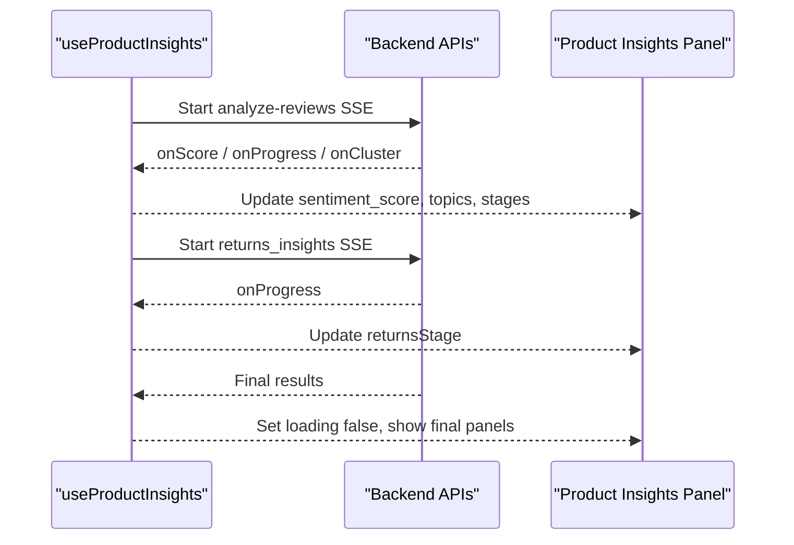
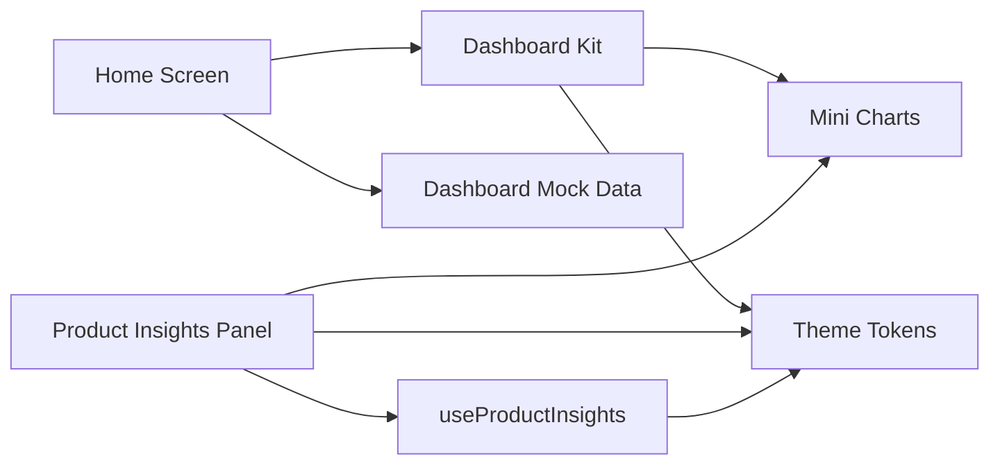

# Dashboard & Analytics

<cite>
**Referenced Files in This Document**
- [index.tsx](file://src/app/(app)/(tabs)/index.tsx)
- [insights.tsx](file://src/app/(app)/(tabs)/insights.tsx)
- [dashboard-kit.tsx](file://src/components/dashboard-kit.tsx)
- [mini-charts.tsx](file://src/components/mini-charts.tsx)
- [product-insights.tsx](file://src/components/product-insights.tsx)
- [use-product-insights.ts](file://src/hooks/use-product-insights.ts)
- [dashboard-mock.ts](file://src/constants/dashboard-mock.ts)
- [theme.ts](file://src/constants/theme.ts)
</cite>

## Table of Contents
1. [Introduction](#introduction)
2. [Project Structure](#project-structure)
3. [Core Components](#core-components)
4. [Architecture Overview](#architecture-overview)
5. [Detailed Component Analysis](#detailed-component-analysis)
6. [Dependency Analysis](#dependency-analysis)
7. [Performance Considerations](#performance-considerations)
8. [Troubleshooting Guide](#troubleshooting-guide)
9. [Conclusion](#conclusion)
10. [Appendices](#appendices)

## Introduction
This document explains the dashboard and analytics functionality, focusing on:
- Business health overview with performance metrics, inventory risk monitoring, and customer sentiment analysis
- The dashboard kit component structure and how it displays key business indicators
- Mock data implementation for development and testing
- How to add new metrics and customize the dashboard layout
- Responsive design patterns across screen sizes and platforms
- Data visualization components and customization options
- Performance considerations for large datasets and real-time updates
- Guidance for integrating with actual backend APIs for production data

## Project Structure
The dashboard is implemented as a tabbed screen that composes presentational components from a shared dashboard kit, driven by typed mock data. A separate product insights panel provides deep-dive analytics for individual products using live hooks and streaming APIs.

**Diagram sources**
- [index.tsx:1-444](file://src/app/(app)/(tabs)/index.tsx#L1-L444)
- [insights.tsx:1-13](file://src/app/(app)/(tabs)/insights.tsx#L1-L13)
- [dashboard-kit.tsx:1-604](file://src/components/dashboard-kit.tsx#L1-L604)
- [mini-charts.tsx:1-108](file://src/components/mini-charts.tsx#L1-L108)
- [product-insights.tsx:1-526](file://src/components/product-insights.tsx#L1-L526)
- [use-product-insights.ts:1-277](file://src/hooks/use-product-insights.ts#L1-L277)
- [dashboard-mock.ts:1-296](file://src/constants/dashboard-mock.ts#L1-L296)
- [theme.ts:1-263](file://src/constants/theme.ts#L1-L263)

**Section sources**
- [index.tsx:1-444](file://src/app/(app)/(tabs)/index.tsx#L1-L444)
- [dashboard-mock.ts:1-296](file://src/constants/dashboard-mock.ts#L1-L296)

## Core Components
- Business Health Card: Shows overall store health status and supporting context.
- Metric Cards: Display KPIs such as True Profit, Revenue, Orders, Net Margin with comparison labels and tone.
- Primary Insight Card: Highlights the most important AI insight with actions and explanation.
- Inventory Risk List: Surfaces near-term stockout risks with severity indicators.
- Sentiment Card: Summarizes customer sentiment trend and flagged themes.
- Agent Activity List: Recent automated actions taken by agents.
- Feature Graph Cards: Sparkline or distribution charts for quick trends and breakdowns.
- Product Insights Panel: Deep analytics including review sentiment meter, rating trends, return analytics, and recommendations.

These components are theme-aware, accessible, and designed to be composed into the Home dashboard and product detail flows.

**Section sources**
- [dashboard-kit.tsx:85-385](file://src/components/dashboard-kit.tsx#L85-L385)
- [product-insights.tsx:58-403](file://src/components/product-insights.tsx#L58-L403)

## Architecture Overview
The Home dashboard composes dashboard kit components and renders mock-driven sections. It also integrates live marketplace and product data where available. The product insights panel uses a hook to stream review analysis and returns data, rendering them through mini charts and themed UI.

**Diagram sources**
- [index.tsx:51-320](file://src/app/(app)/(tabs)/index.tsx#L51-L320)
- [dashboard-kit.tsx:183-385](file://src/components/dashboard-kit.tsx#L183-L385)
- [mini-charts.tsx:35-84](file://src/components/mini-charts.tsx#L35-L84)
- [use-product-insights.ts:92-277](file://src/hooks/use-product-insights.ts#L92-L277)

## Detailed Component Analysis

### Business Health Overview
- Status indicator shows Healthy or Needs attention with contextual text.
- Tone mapping aligns success/warning/danger to theme tokens for consistency.
- Integrates with store connectivity state to provide relevant messaging.

**Diagram sources**
- [dashboard-kit.tsx:85-103](file://src/components/dashboard-kit.tsx#L85-L103)
- [dashboard-mock.ts:64-72](file://src/constants/dashboard-mock.ts#L64-L72)

**Section sources**
- [dashboard-kit.tsx:85-103](file://src/components/dashboard-kit.tsx#L85-L103)
- [dashboard-mock.ts:64-72](file://src/constants/dashboard-mock.ts#L64-L72)

### Performance Metrics
- True Profit card highlights estimated profit with period-over-period change.
- Period metrics row shows Revenue, Orders, Net Margin with comparative labels and tone.
- Cards support size variants and estimated tags to distinguish confirmed vs. estimated values.

**Diagram sources**
- [dashboard-kit.tsx:105-126](file://src/components/dashboard-kit.tsx#L105-L126)
- [dashboard-mock.ts:74-94](file://src/constants/dashboard-mock.ts#L74-L94)

**Section sources**
- [dashboard-kit.tsx:105-126](file://src/components/dashboard-kit.tsx#L105-L126)
- [dashboard-mock.ts:74-94](file://src/constants/dashboard-mock.ts#L74-L94)

### Inventory Risk Monitoring
- Lists upcoming stockouts and low-stock items with severity badges.
- Supports “View all” navigation to the Insights feed.
- Uses semantic tones to highlight urgency.

**Diagram sources**
- [dashboard-kit.tsx:276-309](file://src/components/dashboard-kit.tsx#L276-L309)
- [dashboard-mock.ts:137-149](file://src/constants/dashboard-mock.ts#L137-L149)

**Section sources**
- [dashboard-kit.tsx:276-309](file://src/components/dashboard-kit.tsx#L276-L309)
- [dashboard-mock.ts:137-149](file://src/constants/dashboard-mock.ts#L137-L149)

### Customer Sentiment Analysis
- High-level sentiment card shows trend arrow, rating label, and flagged theme.
- Product-level sentiment meter maps score to zones (Needs attention, Mixed signal, Strong).
- Rating trend sparkline visualizes monthly changes.

**Diagram sources**
- [product-insights.tsx:19-32](file://src/components/product-insights.tsx#L19-L32)
- [product-insights.tsx:58-97](file://src/components/product-insights.tsx#L58-L97)
- [dashboard-kit.tsx:311-331](file://src/components/dashboard-kit.tsx#L311-L331)
- [dashboard-mock.ts:151-161](file://src/constants/dashboard-mock.ts#L151-L161)

**Section sources**
- [product-insights.tsx:19-97](file://src/components/product-insights.tsx#L19-L97)
- [dashboard-kit.tsx:311-331](file://src/components/dashboard-kit.tsx#L311-L331)
- [dashboard-mock.ts:151-161](file://src/constants/dashboard-mock.ts#L151-L161)

### Data Visualization Components
- Sparkline: Minimal bar-style trend visualization built from Views; supports height and tone.
- DistributionBar: Horizontal stacked bar representing counts per segment with proportional widths.
- Tone resolution: Centralized mapping from semantic tones to theme colors ensures consistent visuals.

**Diagram sources**
- [mini-charts.tsx:7-84](file://src/components/mini-charts.tsx#L7-L84)
- [dashboard-kit.tsx:358-385](file://src/components/dashboard-kit.tsx#L358-L385)

**Section sources**
- [mini-charts.tsx:7-84](file://src/components/mini-charts.tsx#L7-L84)
- [dashboard-kit.tsx:358-385](file://src/components/dashboard-kit.tsx#L358-L385)

### Real-Time Updates and Streaming
- Review analysis and returns insights use server-sent events to stream progress and partial results.
- UI shows incremental updates and stage messages while streaming.
- Errors are isolated per source so one failure does not hide the other.

**Diagram sources**
- [use-product-insights.ts:165-255](file://src/hooks/use-product-insights.ts#L165-L255)
- [product-insights.tsx:117-161](file://src/components/product-insights.tsx#L117-L161)

**Section sources**
- [use-product-insights.ts:165-255](file://src/hooks/use-product-insights.ts#L165-L255)
- [product-insights.tsx:117-161](file://src/components/product-insights.tsx#L117-L161)

## Dependency Analysis
- Home screen depends on dashboard kit components and mock data for initial layout and content.
- Dashboard kit depends on mini charts for visualizations and theme tokens for styling.
- Product insights panel depends on useProductInsights hook for live data and mini charts for trends.
- Theme constants define color tokens, spacing, radius, and typography used across components.

**Diagram sources**
- [index.tsx:1-444](file://src/app/(app)/(tabs)/index.tsx#L1-L444)
- [dashboard-kit.tsx:1-604](file://src/components/dashboard-kit.tsx#L1-L604)
- [mini-charts.tsx:1-108](file://src/components/mini-charts.tsx#L1-L108)
- [product-insights.tsx:1-526](file://src/components/product-insights.tsx#L1-L526)
- [use-product-insights.ts:1-277](file://src/hooks/use-product-insights.ts#L1-L277)
- [dashboard-mock.ts:1-296](file://src/constants/dashboard-mock.ts#L1-L296)
- [theme.ts:1-263](file://src/constants/theme.ts#L1-L263)

**Section sources**
- [index.tsx:1-444](file://src/app/(app)/(tabs)/index.tsx#L1-L444)
- [dashboard-kit.tsx:1-604](file://src/components/dashboard-kit.tsx#L1-L604)
- [mini-charts.tsx:1-108](file://src/components/mini-charts.tsx#L1-L108)
- [product-insights.tsx:1-526](file://src/components/product-insights.tsx#L1-L526)
- [use-product-insights.ts:1-277](file://src/hooks/use-product-insights.ts#L1-L277)
- [dashboard-mock.ts:1-296](file://src/constants/dashboard-mock.ts#L1-L296)
- [theme.ts:1-263](file://src/constants/theme.ts#L1-L263)

## Performance Considerations
- Keep charts minimal: Sparkline and DistributionBar are lightweight and avoid heavy chart libraries.
- Stream incremental updates: Use SSE to update UI progressively without blocking.
- Isolate errors: Separate error states for review analysis and returns insights prevent cascading failures.
- Avoid re-fetching: The hook caches fetches per productId and reloadKey to prevent redundant network calls.
- Responsive layout: Use flex-based grids and constrained max widths for readability across devices.
- Reduce motion: Respect reduced motion settings for animations in product insights.

[No sources needed since this section provides general guidance]

## Troubleshooting Guide
- No stores connected: Home shows a prompt to connect stores; navigate to connect flow.
- No products found: If no Daraz connection, fallback to dummy products preview; otherwise show empty state message.
- Streaming delays: While SSE streams are active, UI shows stage messages; ensure network connectivity and retry if needed.
- API errors: Each data source surfaces its own error with a retry action; check token validity and product URL availability.
- Accessibility: Ensure screen readers announce metric values and sentiment scores via accessibility props.

**Section sources**
- [index.tsx:156-174](file://src/app/(app)/(tabs)/index.tsx#L156-L174)
- [index.tsx:240-256](file://src/app/(app)/(tabs)/index.tsx#L240-L256)
- [product-insights.tsx:130-161](file://src/components/product-insights.tsx#L130-L161)
- [use-product-insights.ts:225-255](file://src/hooks/use-product-insights.ts#L225-L255)

## Conclusion
The dashboard combines a clear business health overview, actionable insights, and concise visualizations to help merchants monitor performance, manage inventory risk, and understand customer sentiment. The modular dashboard kit and mini charts enable easy extension and customization. For production, replace mock data with live endpoints and leverage streaming for real-time updates while maintaining performance and accessibility.

[No sources needed since this section summarizes without analyzing specific files]

## Appendices

### Adding New Metrics
- Define a new metric object in mock data with label, value, comparisonLabel, tone, and optional estimated flag.
- Add a corresponding MetricCard instance in the Home screen’s metrics row.
- Optionally include a feature graph card to visualize trends or distributions.

**Section sources**
- [dashboard-mock.ts:74-94](file://src/constants/dashboard-mock.ts#L74-L94)
- [index.tsx:203-207](file://src/app/(app)/(tabs)/index.tsx#L203-L207)
- [dashboard-kit.tsx:105-126](file://src/components/dashboard-kit.tsx#L105-L126)

### Customizing Dashboard Layout
- Adjust grid spacing and wrap behavior for graph cards to fit different screen sizes.
- Use SectionHeading to group subsections consistently.
- Leverage theme tokens for consistent borders, backgrounds, and typography.

**Section sources**
- [index.tsx:283-290](file://src/app/(app)/(tabs)/index.tsx#L283-L290)
- [dashboard-kit.tsx:392-604](file://src/components/dashboard-kit.tsx#L392-L604)
- [theme.ts:237-263](file://src/constants/theme.ts#L237-L263)

### Responsive Design Patterns
- Max content width centers content on larger screens.
- Flex rows and wrap handle varying numbers of cards and graphs.
- Platform-specific insets ensure safe areas on iOS and Android.

**Section sources**
- [index.tsx:323-338](file://src/app/(app)/(tabs)/index.tsx#L323-L338)
- [theme.ts:261-263](file://src/constants/theme.ts#L261-L263)

### Integrating With Backend APIs
- Replace mock data with real fetches in the Home screen and product insights panel.
- Use existing hooks like useProducts and useDarazProducts to integrate marketplace data.
- For AI insights, implement endpoints mirroring the SSE contract used by useProductInsights.
- Maintain error handling and streaming UX similar to the current implementation.

**Section sources**
- [index.tsx:51-79](file://src/app/(app)/(tabs)/index.tsx#L51-L79)
- [use-product-insights.ts:92-164](file://src/hooks/use-product-insights.ts#L92-L164)