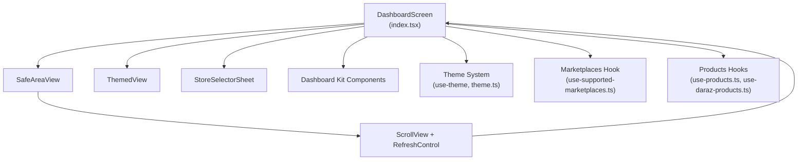
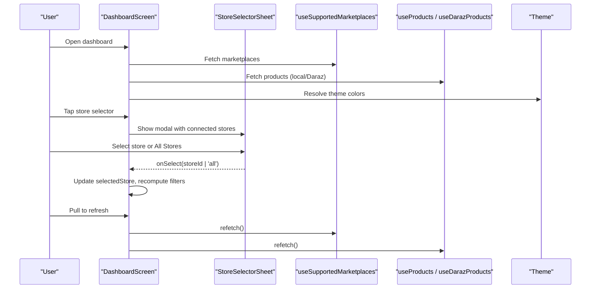
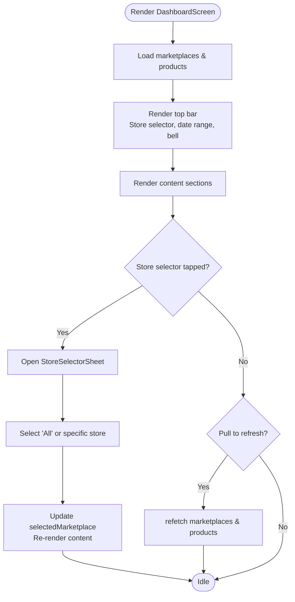
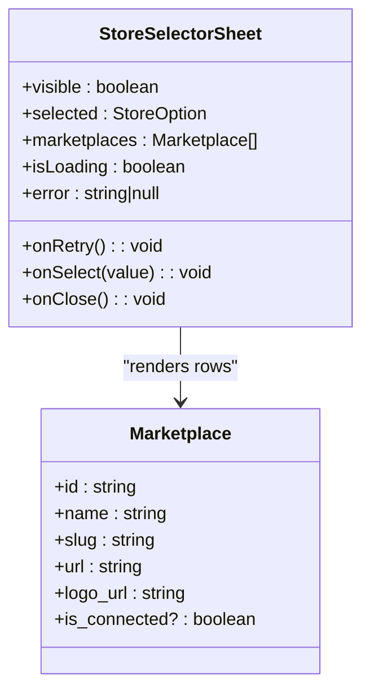
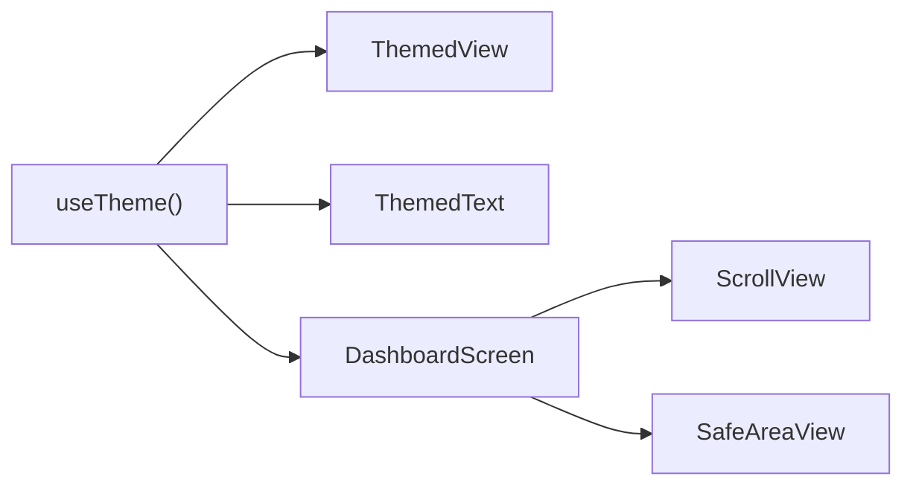
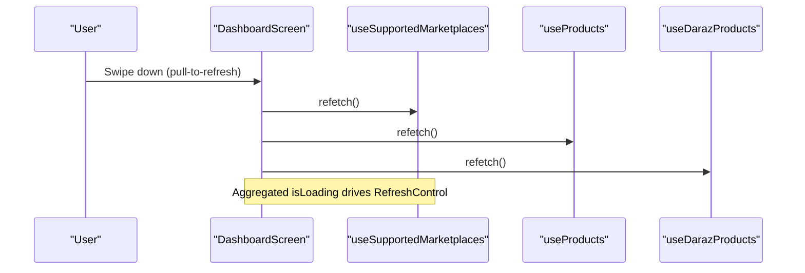
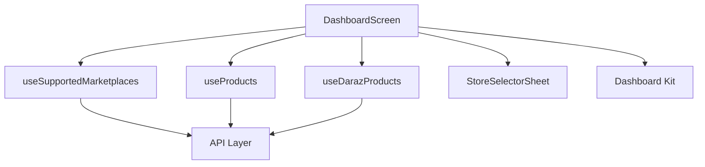

# Dashboard Layout & Navigation

<cite>
**Referenced Files in This Document**
- [index.tsx](file://src/app/(app)/(tabs)/index.tsx)
- [dashboard-kit.tsx](file://src/components/dashboard-kit.tsx)
- [store-selector-sheet.tsx](file://src/components/store-selector-sheet.tsx)
- [theme.ts](file://src/constants/theme.ts)
- [themed-view.tsx](file://src/components/themed-view.tsx)
- [themed-text.tsx](file://src/components/themed-text.tsx)
- [use-theme.ts](file://src/hooks/use-theme.ts)
- [use-supported-marketplaces.ts](file://src/hooks/use-supported-marketplaces.ts)
- [use-products.ts](file://src/hooks/use-products.ts)
- [use-daraz-products.ts](file://src/hooks/use-daraz-products.ts)
- [api.ts](file://src/lib/api.ts)
</cite>

## Table of Contents
1. [Introduction](#introduction)
2. [Project Structure](#project-structure)
3. [Core Components](#core-components)
4. [Architecture Overview](#architecture-overview)
5. [Detailed Component Analysis](#detailed-component-analysis)
6. [Dependency Analysis](#dependency-analysis)
7. [Performance Considerations](#performance-considerations)
8. [Troubleshooting Guide](#troubleshooting-guide)
9. [Conclusion](#conclusion)

## Introduction
This document explains the dashboard layout and navigation system, focusing on the main DashboardScreen component, its top bar (store selector, date range picker, notification bell), responsive layout patterns using ScrollView and SafeAreaView with themed styling, store selection via StoreSelectorSheet, filtering by connected marketplaces, adding new navigation elements, customizing the header, mobile-first design principles, cross-platform considerations, refresh behavior including pull-to-refresh, and performance guidance for long lists.

## Project Structure
The dashboard is implemented as a tab screen that composes:
- A top bar with store selector, date range selector, and notification bell
- A scrollable content area with business health, metrics, insights, inventory risks, sentiment, agent activity, products preview, graphs, and all-insights feed
- A modal bottom sheet for selecting stores/marketplaces
- Themed UI primitives for consistent appearance across light/dark modes

**Diagram sources**
- [index.tsx:103-319](file://src/app/(app)/(tabs)/index.tsx#L103-L319)
- [store-selector-sheet.tsx:22-131](file://src/components/store-selector-sheet.tsx#L22-L131)
- [dashboard-kit.tsx:40-390](file://src/components/dashboard-kit.tsx#L40-L390)
- [use-theme.ts:9-14](file://src/hooks/use-theme.ts#L9-L14)
- [theme.ts:117-141](file://src/constants/theme.ts#L117-L141)
- [use-supported-marketplaces.ts:16-53](file://src/hooks/use-supported-marketplaces.ts#L16-L53)
- [use-products.ts:16-57](file://src/hooks/use-products.ts#L16-L57)
- [use-daraz-products.ts:120-183](file://src/hooks/use-daraz-products.ts#L120-L183)

**Section sources**
- [index.tsx:103-319](file://src/app/(app)/(tabs)/index.tsx#L103-L319)
- [theme.ts:117-141](file://src/constants/theme.ts#L117-L141)

## Core Components
- DashboardScreen: Orchestrates state for selected store, date range, loading states, and renders the top bar, content sections, and store picker modal. It wires pull-to-refresh to refetch marketplaces and product data.
- StoreSelectorSheet: Modal bottom sheet listing “All Stores” and each connected marketplace with logos; supports retry on error and navigation to connect stores.
- Dashboard Kit: Presentational components for insight cards, metric cards, inventory risk list, sentiment card, agent activity list, feature graph cards, and section headings.
- Theme System: Centralized color tokens, typography scale, spacing, radius, and platform-aware font families; consumed via ThemedView and ThemedText.

Key responsibilities:
- Top bar: store selector button, date range cycling, notification bell with unread indicator
- Content: business health, true profit, primary insight, impact strip, period metrics, inventory risks, sentiment, agent activity, products preview, graphs, all insights
- Store selection: filter by connected marketplace or aggregate across all
- Refresh: single handler triggers multiple data refetches

**Section sources**
- [index.tsx:51-101](file://src/app/(app)/(tabs)/index.tsx#L51-L101)
- [index.tsx:103-319](file://src/app/(app)/(tabs)/index.tsx#L103-L319)
- [store-selector-sheet.tsx:22-131](file://src/components/store-selector-sheet.tsx#L22-L131)
- [dashboard-kit.tsx:40-390](file://src/components/dashboard-kit.tsx#L40-L390)
- [themed-view.tsx:12-16](file://src/components/themed-view.tsx#L12-L16)
- [themed-text.tsx:29-56](file://src/components/themed-text.tsx#L29-L56)
- [use-theme.ts:9-14](file://src/hooks/use-theme.ts#L9-L14)

## Architecture Overview
The dashboard follows a container/presentational pattern:
- Container: DashboardScreen manages data fetching, user interactions, and state
- Presentational: Dashboard kit components render UI based on props
- Data layer: React hooks encapsulate API calls and state for marketplaces and products
- Theming: Consistent colors and typography via theme constants and hooks

**Diagram sources**
- [index.tsx:51-101](file://src/app/(app)/(tabs)/index.tsx#L51-L101)
- [index.tsx:103-319](file://src/app/(app)/(tabs)/index.tsx#L103-L319)
- [store-selector-sheet.tsx:22-131](file://src/components/store-selector-sheet.tsx#L22-L131)
- [use-supported-marketplaces.ts:16-53](file://src/hooks/use-supported-marketplaces.ts#L16-L53)
- [use-products.ts:16-57](file://src/hooks/use-products.ts#L16-L57)
- [use-daraz-products.ts:120-183](file://src/hooks/use-daraz-products.ts#L120-L183)

## Detailed Component Analysis

### DashboardScreen: Top Bar and Scrollable Layout
- Uses SafeAreaView to avoid notches and safe edges
- ScrollView wraps content with RefreshControl for pull-to-refresh
- Top bar contains:
  - Store selector: shows logo and name when a specific marketplace is selected; otherwise “All Stores”
  - Date range selector: cycles through preset ranges
  - Notification bell: navigates to notifications and shows an unread dot when applicable
- Content sections include business health, true profit, primary insight, impact strip, metrics, inventory risks, sentiment, agent activity, products preview, graphs, and all insights
- Store selection updates a computed selectedMarketplace used to display context-specific information

**Diagram sources**
- [index.tsx:103-319](file://src/app/(app)/(tabs)/index.tsx#L103-L319)

**Section sources**
- [index.tsx:51-101](file://src/app/(app)/(tabs)/index.tsx#L51-L101)
- [index.tsx:103-319](file://src/app/(app)/(tabs)/index.tsx#L103-L319)

### Store Selection via StoreSelectorSheet
- Modal bottom sheet presents “All Stores” plus each connected marketplace
- Displays marketplace logos and selection state
- Provides error handling with retry and a link to manage connections
- On selection, DashboardScreen updates selectedStore and recomputes selectedMarketplace

**Diagram sources**
- [store-selector-sheet.tsx:22-131](file://src/components/store-selector-sheet.tsx#L22-L131)
- [api.ts:344-357](file://src/lib/api.ts#L344-L357)

**Section sources**
- [store-selector-sheet.tsx:22-131](file://src/components/store-selector-sheet.tsx#L22-L131)
- [index.tsx:76-88](file://src/app/(app)/(tabs)/index.tsx#L76-L88)

### Themed Styling and Responsive Patterns
- ThemedView applies background colors from the current theme
- ThemedText applies typography scale and text colors from the theme
- Theme provides light/dark palettes, typography scale, spacing, radius, and platform-specific fonts
- ScrollView and SafeAreaView ensure proper scrolling and safe areas across devices

**Diagram sources**
- [use-theme.ts:9-14](file://src/hooks/use-theme.ts#L9-L14)
- [themed-view.tsx:12-16](file://src/components/themed-view.tsx#L12-L16)
- [themed-text.tsx:29-56](file://src/components/themed-text.tsx#L29-L56)
- [theme.ts:117-141](file://src/constants/theme.ts#L117-L141)
- [index.tsx:103-109](file://src/app/(app)/(tabs)/index.tsx#L103-L109)

**Section sources**
- [themed-view.tsx:12-16](file://src/components/themed-view.tsx#L12-L16)
- [themed-text.tsx:29-56](file://src/components/themed-text.tsx#L29-L56)
- [theme.ts:117-141](file://src/constants/theme.ts#L117-L141)
- [index.tsx:103-109](file://src/app/(app)/(tabs)/index.tsx#L103-L109)

### Adding New Navigation Elements and Customizing Header
- To add a new top bar element:
  - Add a Pressable inside the top bar container
  - Use ThemedText for labels and icons
  - Navigate via router.push to the target route
- To customize the header:
  - Adjust spacing and alignment in the top bar styles
  - Integrate additional controls like segmented tabs or filters
  - Ensure accessibility and hitSlop for touch targets

Example references:
- Top bar structure and right-side controls are defined in the dashboard screen’s JSX and styles
- Navigation uses expo-router’s router.push

**Section sources**
- [index.tsx:110-154](file://src/app/(app)/(tabs)/index.tsx#L110-L154)
- [index.tsx:323-386](file://src/app/(app)/(tabs)/index.tsx#L323-L386)

### Mobile-First Design and Cross-Platform Compatibility
- Mobile-first:
  - ScrollView-based vertical flow optimized for thumb reach
  - Compact badges, pills, and cards for dense information
  - Bottom sheet for store selection to minimize navigation overhead
- Cross-platform:
  - Platform-specific font families via theme
  - SafeAreaView handles device notches and insets
  - Icons use SymbolView with fallbacks for platforms without native symbols

**Section sources**
- [theme.ts:145-168](file://src/constants/theme.ts#L145-L168)
- [index.tsx:138-152](file://src/app/(app)/(tabs)/index.tsx#L138-L152)

### Refresh Mechanism and Pull-to-Refresh
- Pull-to-refresh triggers a unified handleRefresh that refetches:
  - Supported marketplaces
  - Local products
  - Daraz products (if connected)
- Loading state aggregates isLoading flags to show RefreshControl state consistently

**Diagram sources**
- [index.tsx:51-68](file://src/app/(app)/(tabs)/index.tsx#L51-L68)
- [index.tsx:103-109](file://src/app/(app)/(tabs)/index.tsx#L103-L109)
- [use-supported-marketplaces.ts:16-53](file://src/hooks/use-supported-marketplaces.ts#L16-L53)
- [use-products.ts:16-57](file://src/hooks/use-products.ts#L16-L57)
- [use-daraz-products.ts:120-183](file://src/hooks/use-daraz-products.ts#L120-L183)

**Section sources**
- [index.tsx:51-68](file://src/app/(app)/(tabs)/index.tsx#L51-L68)
- [index.tsx:103-109](file://src/app/(app)/(tabs)/index.tsx#L103-L109)

## Dependency Analysis
- DashboardScreen depends on:
  - useSupportedMarketplaces for marketplace list and connection status
  - useProducts and useDarazProducts for product data
  - StoreSelectorSheet for store selection modal
  - Dashboard kit components for presentational rendering
  - Theme system for consistent styling
- Marketplaces hook fetches GET /marketplace/ with Bearer token
- Products hooks fetch local products and Daraz catalog, normalizing responses

**Diagram sources**
- [index.tsx:51-101](file://src/app/(app)/(tabs)/index.tsx#L51-L101)
- [use-supported-marketplaces.ts:16-53](file://src/hooks/use-supported-marketplaces.ts#L16-L53)
- [use-products.ts:16-57](file://src/hooks/use-products.ts#L16-L57)
- [use-daraz-products.ts:120-183](file://src/hooks/use-daraz-products.ts#L120-L183)
- [api.ts:344-357](file://src/lib/api.ts#L344-L357)

**Section sources**
- [index.tsx:51-101](file://src/app/(app)/(tabs)/index.tsx#L51-L101)
- [use-supported-marketplaces.ts:16-53](file://src/hooks/use-supported-marketplaces.ts#L16-L53)
- [use-products.ts:16-57](file://src/hooks/use-products.ts#L16-L57)
- [use-daraz-products.ts:120-183](file://src/hooks/use-daraz-products.ts#L120-L183)
- [api.ts:344-357](file://src/lib/api.ts#L344-L357)

## Performance Considerations
- Optimize scroll performance:
  - Keep contentContainer width constrained and centered for large screens
  - Avoid heavy computations inside render; memoize derived values where appropriate
  - Use flat lists for very long product feeds if needed
- Memory management:
  - Reuse images via caching libraries already in use
  - Avoid unnecessary re-renders by keeping state minimal and colocated
  - Cancel in-flight requests on unmount to prevent memory leaks (hooks already implement cancellation logic)
- Network efficiency:
  - Aggregate refetch into a single refresh action
  - Prefer selective updates (e.g., only refresh products when store changes)

[No sources needed since this section provides general guidance]

## Troubleshooting Guide
- No stores connected:
  - The dashboard shows a prompt to connect your first store; navigate to connect-stores
- Error loading marketplaces:
  - StoreSelectorSheet displays an error message with a retry option
- Product loading issues:
  - If no products are found locally or on Daraz, placeholder messages guide users to add products or connect Daraz
- Notifications:
  - Unread count shown on bell; navigate to notifications screen

**Section sources**
- [index.tsx:156-174](file://src/app/(app)/(tabs)/index.tsx#L156-L174)
- [store-selector-sheet.tsx:80-91](file://src/components/store-selector-sheet.tsx#L80-L91)
- [index.tsx:240-256](file://src/app/(app)/(tabs)/index.tsx#L240-L256)

## Conclusion
The dashboard integrates a cohesive top bar, scrollable content, and a store selection modal to deliver a mobile-first, themed experience. It leverages hooks for data fetching, a robust theme system for consistency, and clear navigation patterns. Pull-to-refresh centralizes data updates, while presentational components keep the UI modular and maintainable. For long lists, consider virtualization and careful state management to preserve performance.

[No sources needed since this section summarizes without analyzing specific files]