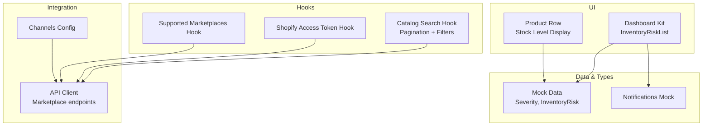
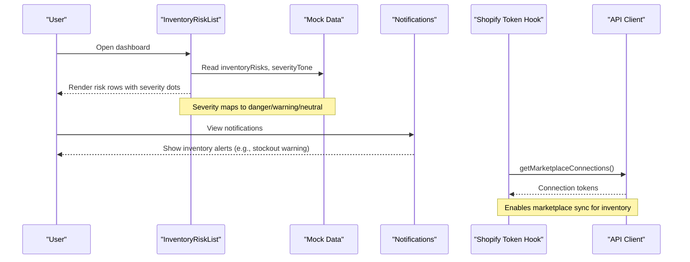
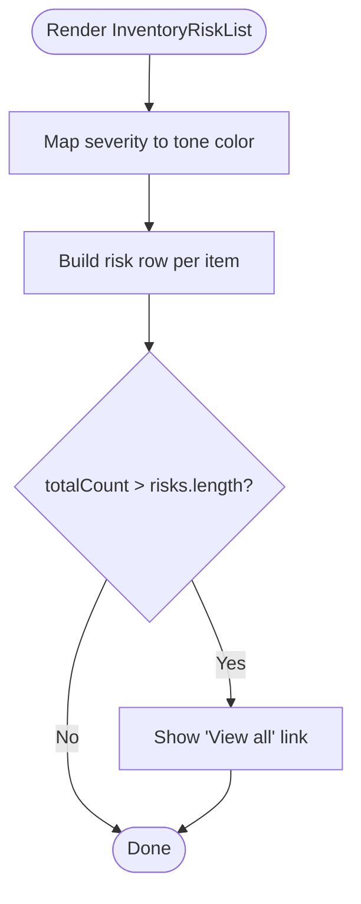
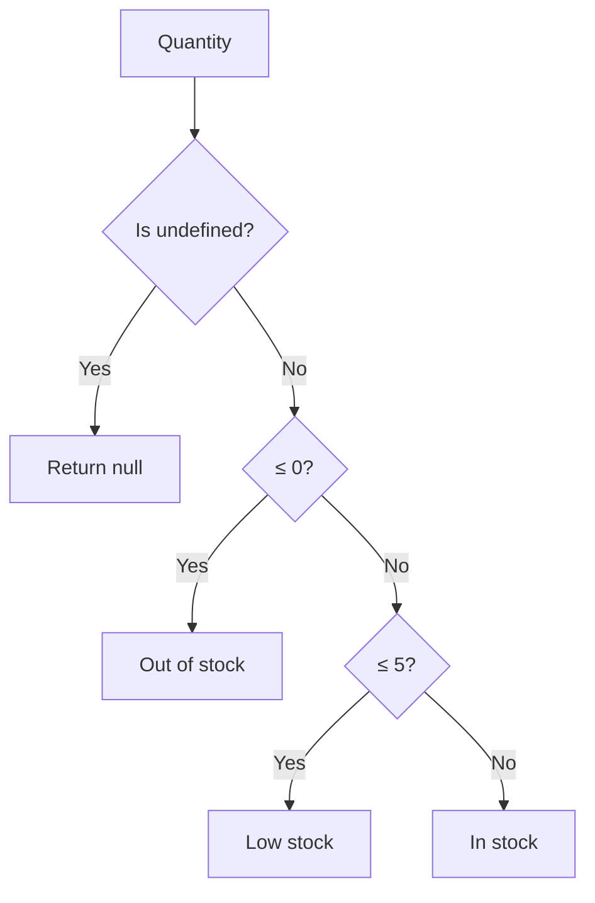
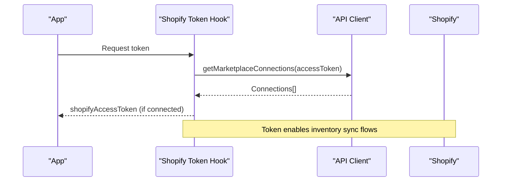
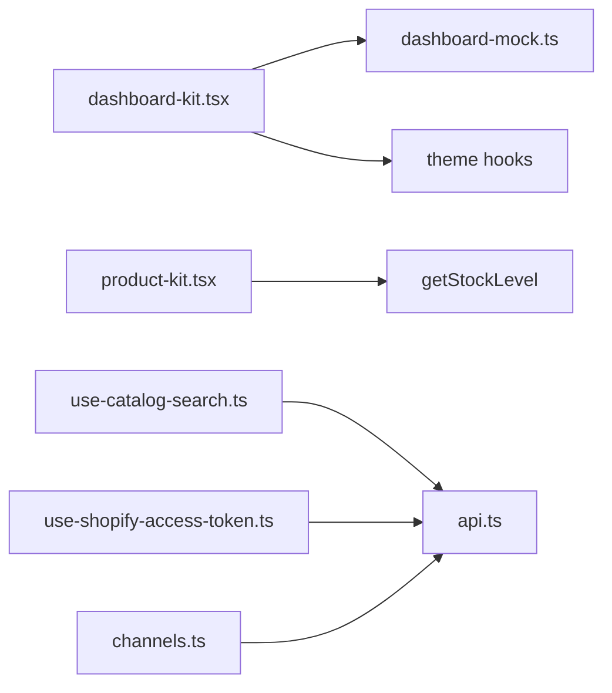

# Inventory Risk Monitoring

<cite>
**Referenced Files in This Document**
- [dashboard-kit.tsx](file://src/components/dashboard-kit.tsx)
- [dashboard-mock.ts](file://src/constants/dashboard-mock.ts)
- [product-kit.tsx](file://src/components/product-kit.tsx)
- [use-catalog-search.ts](file://src/hooks/use-catalog-search.ts)
- [products.tsx](file://src/app/(app)/(tabs)/products.tsx)
- [channels.ts](file://src/constants/channels.ts)
- [api.ts](file://src/lib/api.ts)
- [use-shopify-access-token.ts](file://src/hooks/use-shopify-access-token.ts)
- [use-supported-marketplaces.ts](file://src/hooks/use-supported-marketplaces.ts)
- [notifications-mock.ts](file://src/constants/notifications-mock.ts)
</cite>

## Table of Contents
1. [Introduction](#introduction)
2. [Project Structure](#project-structure)
3. [Core Components](#core-components)
4. [Architecture Overview](#architecture-overview)
5. [Detailed Component Analysis](#detailed-component-analysis)
6. [Dependency Analysis](#dependency-analysis)
7. [Performance Considerations](#performance-considerations)
8. [Troubleshooting Guide](#troubleshooting-guide)
9. [Conclusion](#conclusion)

## Introduction
This document explains the inventory risk monitoring system as implemented in the application. It focuses on how the InventoryRiskList component displays potential inventory issues, stock levels, and supply chain risks; how severity is mapped to visual tones; and how marketplace integrations and real-time synchronization are wired into the product catalog and insights. It also covers performance considerations for large datasets, filtering, and sorting capabilities used across the app.

## Project Structure
The inventory risk feature spans a few key areas:
- UI components that render risk lists and insight cards
- Mock data types and sample risk items
- Stock level classification logic
- Catalog search and pagination hooks for performance
- Marketplace connection utilities and API clients

**Diagram sources**
- [dashboard-kit.tsx:276-309](file://src/components/dashboard-kit.tsx#L276-L309)
- [dashboard-mock.ts:137-149](file://src/constants/dashboard-mock.ts#L137-L149)
- [product-kit.tsx:15-23](file://src/components/product-kit.tsx#L15-L23)
- [use-catalog-search.ts:38-148](file://src/hooks/use-catalog-search.ts#L38-L148)
- [use-shopify-access-token.ts:6-30](file://src/hooks/use-shopify-access-token.ts#L6-L30)
- [use-supported-marketplaces.ts:35-53](file://src/hooks/use-supported-marketplaces.ts#L35-L53)
- [channels.ts:1-25](file://src/constants/channels.ts#L1-L25)
- [api.ts:344-372](file://src/lib/api.ts#L344-L372)

**Section sources**
- [dashboard-kit.tsx:276-309](file://src/components/dashboard-kit.tsx#L276-L309)
- [dashboard-mock.ts:137-149](file://src/constants/dashboard-mock.ts#L137-L149)
- [product-kit.tsx:15-23](file://src/components/product-kit.tsx#L15-L23)
- [use-catalog-search.ts:38-148](file://src/hooks/use-catalog-search.ts#L38-L148)
- [use-shopify-access-token.ts:6-30](file://src/hooks/use-shopify-access-token.ts#L6-L30)
- [use-supported-marketplaces.ts:35-53](file://src/hooks/use-supported-marketplaces.ts#L35-L53)
- [channels.ts:1-25](file://src/constants/channels.ts#L1-L25)
- [api.ts:344-372](file://src/lib/api.ts#L344-L372)

## Core Components
- InventoryRiskList renders a list of inventory risks with severity indicators and a “View all” action when more risks exist than shown.
- Severity mapping converts severity values (high, medium, low) into tone colors for consistent visual signaling.
- Product Row uses a stock level classifier to show out-of-stock, low stock, or in-stock states per product.
- Mock data defines the InventoryRisk type and sample risk entries, plus an inventory health distribution graph.
- Notifications mock includes inventory-related alerts such as stockout warnings.

Key responsibilities:
- Presentational rendering of risk rows and severity dots
- Mapping severity to theme-aware colors
- Providing a navigation entry point via “View all”
- Displaying product stock status using thresholds

**Section sources**
- [dashboard-kit.tsx:37-38](file://src/components/dashboard-kit.tsx#L37-L38)
- [dashboard-kit.tsx:276-309](file://src/components/dashboard-kit.tsx#L276-L309)
- [product-kit.tsx:15-23](file://src/components/product-kit.tsx#L15-L23)
- [dashboard-mock.ts:137-149](file://src/constants/dashboard-mock.ts#L137-L149)
- [notifications-mock.ts:18-34](file://src/constants/notifications-mock.ts#L18-L34)

## Architecture Overview
The inventory risk flow combines UI presentation, data modeling, and marketplace integration:

**Diagram sources**
- [dashboard-kit.tsx:276-309](file://src/components/dashboard-kit.tsx#L276-L309)
- [dashboard-mock.ts:137-149](file://src/constants/dashboard-mock.ts#L137-L149)
- [notifications-mock.ts:18-34](file://src/constants/notifications-mock.ts#L18-L34)
- [use-shopify-access-token.ts:6-30](file://src/hooks/use-shopify-access-token.ts#L6-L30)
- [api.ts:344-372](file://src/lib/api.ts#L344-L372)

## Detailed Component Analysis

### InventoryRiskList Component
- Displays each risk with a severity dot, product name, and detail text.
- Uses a severity-to-tone mapping to colorize the dot consistently with the theme.
- Shows a “View all {totalCount} risks” link when there are more risks than currently rendered.

**Diagram sources**
- [dashboard-kit.tsx:276-309](file://src/components/dashboard-kit.tsx#L276-L309)
- [dashboard-kit.tsx:37-38](file://src/components/dashboard-kit.tsx#L37-L38)

**Section sources**
- [dashboard-kit.tsx:276-309](file://src/components/dashboard-kit.tsx#L276-L309)
- [dashboard-kit.tsx:37-38](file://src/components/dashboard-kit.tsx#L37-L38)

### Severity and Tone Mapping
- Severity values: high, medium, low.
- Tone mapping: high → danger, medium → warning, low → neutral.
- Labels: High, Medium, Low.

This mapping ensures consistent visual cues across insight cards and risk rows.

**Section sources**
- [dashboard-kit.tsx:37-38](file://src/components/dashboard-kit.tsx#L37-L38)
- [dashboard-mock.ts:52-53](file://src/constants/dashboard-mock.ts#L52-L53)

### Stock Levels and Thresholds
- Stock level classifier buckets raw quantities into:
  - Out of stock: quantity ≤ 0
  - Low stock: quantity between 1 and 5
  - In stock: quantity > 5
- Used by product rows and chat responses to surface actionable stock information.

**Diagram sources**
- [product-kit.tsx:15-23](file://src/components/product-kit.tsx#L15-L23)

**Section sources**
- [product-kit.tsx:15-23](file://src/components/product-kit.tsx#L15-L23)

### Risk Categories and Examples
- The mock dataset defines example inventory risks with details like “Stockout in X days” and “Y units left, selling fast.”
- An inventory health distribution graph segment categorizes products into Healthy, Low, and At risk.

These examples illustrate how risk items are structured and presented.

**Section sources**
- [dashboard-mock.ts:137-149](file://src/constants/dashboard-mock.ts#L137-L149)
- [dashboard-mock.ts:217-229](file://src/constants/dashboard-mock.ts#L217-L229)

### Alert Notifications
- Notifications include inventory-related messages such as stockout warnings tied to specific products and timeframes.
- These notifications reuse the same agent identity model for consistency.

**Section sources**
- [notifications-mock.ts:18-34](file://src/constants/notifications-mock.ts#L18-L34)

### Marketplace Integration and Real-Time Sync
- Supported channels include Shopify, Daraz, and Amazon, each with benefits describing automatic syncing of listings, orders, and inventory.
- Hooks retrieve marketplace connections and access tokens required for syncing inventory from connected stores.
- API client exposes endpoints for retrieving supported marketplaces and connections.

**Diagram sources**
- [use-shopify-access-token.ts:6-30](file://src/hooks/use-shopify-access-token.ts#L6-L30)
- [api.ts:344-372](file://src/lib/api.ts#L344-L372)
- [channels.ts:1-25](file://src/constants/channels.ts#L1-L25)

**Section sources**
- [channels.ts:1-25](file://src/constants/channels.ts#L1-L25)
- [use-shopify-access-token.ts:6-30](file://src/hooks/use-shopify-access-token.ts#L6-L30)
- [use-supported-marketplaces.ts:35-53](file://src/hooks/use-supported-marketplaces.ts#L35-L53)
- [api.ts:344-372](file://src/lib/api.ts#L344-L372)

## Dependency Analysis
- InventoryRiskList depends on:
  - Severity and tone mappings
  - Theme utilities for colors
  - Mock data for risk items and counts
- Product Row depends on:
  - Stock level classifier
  - Theme and formatting utilities
- Hooks depend on:
  - Authentication context
  - API client for marketplace operations
  - Channel configuration for supported platforms

**Diagram sources**
- [dashboard-kit.tsx:276-309](file://src/components/dashboard-kit.tsx#L276-L309)
- [dashboard-mock.ts:137-149](file://src/constants/dashboard-mock.ts#L137-L149)
- [product-kit.tsx:15-23](file://src/components/product-kit.tsx#L15-L23)
- [use-catalog-search.ts:38-148](file://src/hooks/use-catalog-search.ts#L38-L148)
- [use-shopify-access-token.ts:6-30](file://src/hooks/use-shopify-access-token.ts#L6-L30)
- [channels.ts:1-25](file://src/constants/channels.ts#L1-L25)
- [api.ts:344-372](file://src/lib/api.ts#L344-L372)

**Section sources**
- [dashboard-kit.tsx:276-309](file://src/components/dashboard-kit.tsx#L276-L309)
- [product-kit.tsx:15-23](file://src/components/product-kit.tsx#L15-L23)
- [use-catalog-search.ts:38-148](file://src/hooks/use-catalog-search.ts#L38-L148)
- [use-shopify-access-token.ts:6-30](file://src/hooks/use-shopify-access-token.ts#L6-L30)
- [channels.ts:1-25](file://src/constants/channels.ts#L1-L25)
- [api.ts:344-372](file://src/lib/api.ts#L344-L372)

## Performance Considerations
- Pagination and deduplication:
  - The catalog search hook paginates results and deduplicates products by item_id to avoid duplicates while appending pages.
  - It limits pages per request to reduce payload size and improve responsiveness.
- Filtering and sorting:
  - Supports query normalization, price range filters, and sort options passed to the backend search endpoint.
  - Results are refreshed when filters change, ensuring accurate views without unnecessary re-renders.
- Marketplace selection:
  - The products tab conditionally shows marketplace-specific catalogs based on connected stores, reducing irrelevant data loads.

Recommendations:
- Keep page sizes small and leverage server-side sorting/filtering where possible.
- Debounce rapid filter changes to minimize network requests.
- Use memoization for derived lists (e.g., filtered products) to avoid recomputation.

**Section sources**
- [use-catalog-search.ts:6-148](file://src/hooks/use-catalog-search.ts#L6-L148)
- [products.tsx:61-82](file://src/app/(app)/(tabs)/products.tsx#L61-L82)

## Troubleshooting Guide
Common issues and resolutions:
- No marketplace connected:
  - Ensure marketplace connections are retrieved successfully and access tokens are present before attempting inventory sync.
- Empty or stale inventory data:
  - Refetch marketplace connections and verify connectivity; check error states returned by hooks.
- Incorrect stock display:
  - Verify that product.stockQuantity is correctly populated and that the stock level classifier thresholds align with business expectations.

Operational tips:
- Use the “View all” action to navigate to detailed risk lists for deeper inspection.
- Monitor notifications for inventory alerts and act on them promptly.

**Section sources**
- [use-shopify-access-token.ts:6-30](file://src/hooks/use-shopify-access-token.ts#L6-L30)
- [use-catalog-search.ts:38-148](file://src/hooks/use-catalog-search.ts#L38-L148)
- [notifications-mock.ts:18-34](file://src/constants/notifications-mock.ts#L18-L34)

## Conclusion
The inventory risk monitoring system provides a clear, theme-consistent view of at-risk inventory through the InventoryRiskList component, backed by severity mapping and mock risk data. Stock levels are classified using simple thresholds and integrated into product listings and conversational features. Marketplace integration hooks enable retrieval of connection tokens necessary for syncing inventory from connected stores. Performance is addressed via pagination, deduplication, and conditional loading based on connected marketplaces. For production readiness, consider implementing server-side risk scoring, configurable thresholds, and robust alerting pipelines.