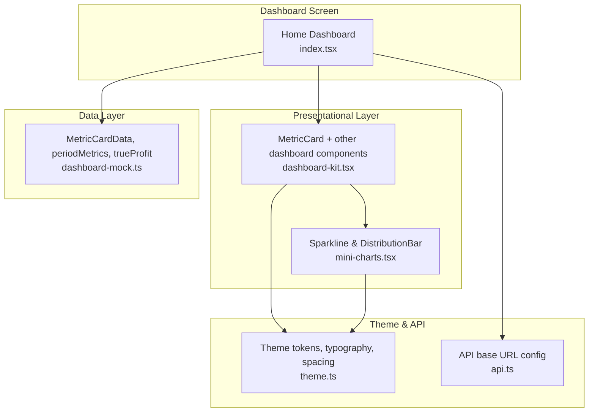
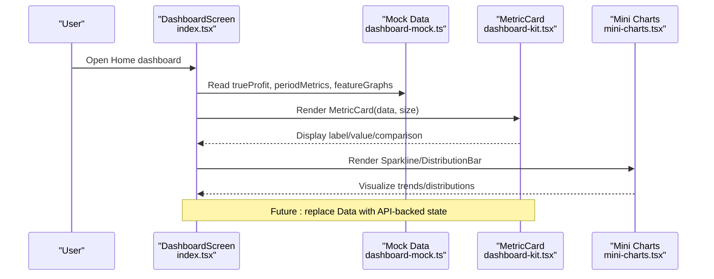
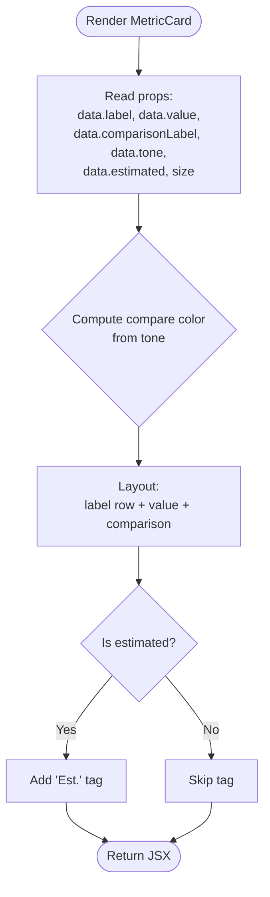
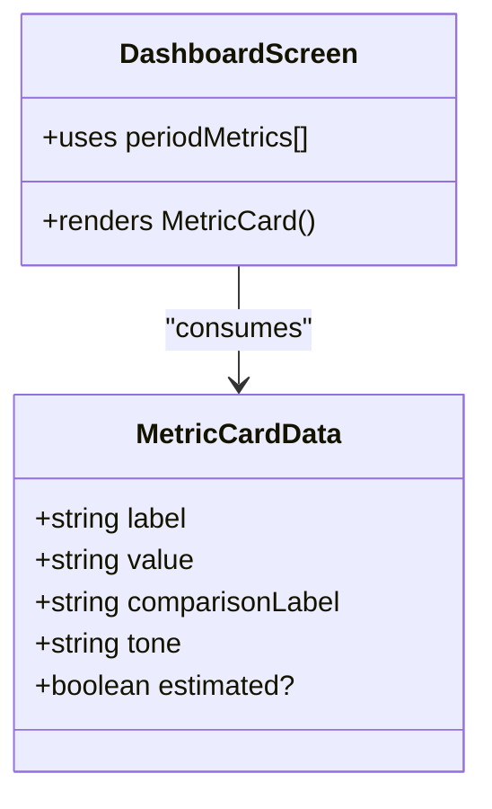
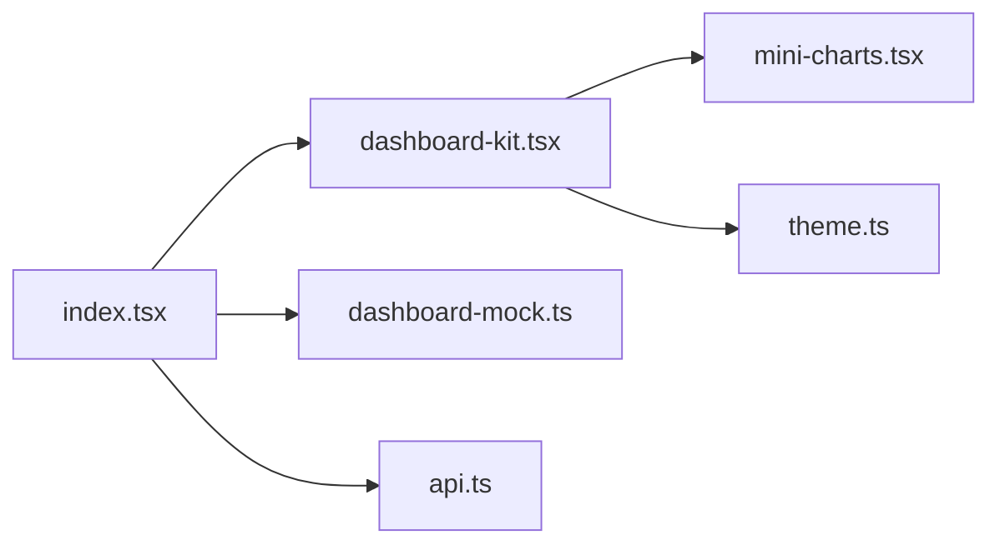

# Performance Metrics

<cite>
**Referenced Files in This Document**
- [dashboard-kit.tsx](file://src/components/dashboard-kit.tsx)
- [dashboard-mock.ts](file://src/constants/dashboard-mock.ts)
- [index.tsx](file://src/app/(app)/(tabs)/index.tsx)
- [mini-charts.tsx](file://src/components/mini-charts.tsx)
- [theme.ts](file://src/constants/theme.ts)
- [api.ts](file://src/constants/api.ts)
</cite>

## Table of Contents
1. [Introduction](#introduction)
2. [Project Structure](#project-structure)
3. [Core Components](#core-components)
4. [Architecture Overview](#architecture-overview)
5. [Detailed Component Analysis](#detailed-component-analysis)
6. [Dependency Analysis](#dependency-analysis)
7. [Performance Considerations](#performance-considerations)
8. [Troubleshooting Guide](#troubleshooting-guide)
9. [Conclusion](#conclusion)
10. [Appendices](#appendices)

## Introduction
This document explains the performance metrics system used on the Home dashboard. It focuses on how business KPIs such as true profit, revenue, orders, and net margin are presented using a consistent MetricCard component, how period comparisons and trend indicators are shown, and how to extend the system with new custom metrics. It also covers sizing options, visual presentation patterns, performance considerations for rendering multiple metrics at once, and guidance for integrating with backend APIs to support real-time updates.

## Project Structure
The metrics system is composed of:
- A presentational layer that renders metric cards and charts
- A typed data layer that defines the shape of metric objects and provides mock data
- A screen that composes these components into the Home dashboard
- Shared theming and chart utilities

**Diagram sources**
- [index.tsx:8-39](file://src/app/(app)/(tabs)/index.tsx#L8-L39)
- [dashboard-kit.tsx:19-35](file://src/components/dashboard-kit.tsx#L19-L35)
- [dashboard-mock.ts:74-94](file://src/constants/dashboard-mock.ts#L74-L94)
- [mini-charts.tsx:1-28](file://src/components/mini-charts.tsx#L1-L28)
- [theme.ts:117-141](file://src/constants/theme.ts#L117-L141)
- [api.ts:1-15](file://src/constants/api.ts#L1-L15)

**Section sources**
- [index.tsx:8-39](file://src/app/(app)/(tabs)/index.tsx#L8-L39)
- [dashboard-kit.tsx:19-35](file://src/components/dashboard-kit.tsx#L19-L35)
- [dashboard-mock.ts:74-94](file://src/constants/dashboard-mock.ts#L74-L94)
- [mini-charts.tsx:1-28](file://src/components/mini-charts.tsx#L1-L28)
- [theme.ts:117-141](file://src/constants/theme.ts#L117-L141)
- [api.ts:1-15](file://src/constants/api.ts#L1-L15)

## Core Components
- MetricCard: Renders a single KPI card with label, value, comparison text, optional “Est.” tag, and tone-based color for the comparison line. Supports two sizes: small (default) and large.
- Period metrics: An array of MetricCardData instances representing time-based comparisons (e.g., revenue vs last period).
- Feature graphs: Sparkline and distribution bar components visualize trends and distributions alongside metrics.

Key responsibilities:
- Presentational only: MetricCard does not fetch or compute data; it consumes typed data from the data layer.
- Visual consistency: Uses theme tokens for colors, typography scale, and spacing.
- Extensibility: New metrics can be added by creating new MetricCardData entries and rendering them via MetricCard.

**Section sources**
- [dashboard-kit.tsx:105-126](file://src/components/dashboard-kit.tsx#L105-L126)
- [dashboard-mock.ts:74-94](file://src/constants/dashboard-mock.ts#L74-L94)
- [mini-charts.tsx:30-84](file://src/components/mini-charts.tsx#L30-L84)
- [theme.ts:177-259](file://src/constants/theme.ts#L177-L259)

## Architecture Overview
The Home dashboard composes metric cards and feature graphs from typed data. The data layer currently uses static mock data but is structured so it can be swapped for live API responses without changing presentational components.

**Diagram sources**
- [index.tsx:176-207](file://src/app/(app)/(tabs)/index.tsx#L176-L207)
- [dashboard-mock.ts:74-94](file://src/constants/dashboard-mock.ts#L74-L94)
- [dashboard-kit.tsx:105-126](file://src/components/dashboard-kit.tsx#L105-L126)
- [mini-charts.tsx:30-84](file://src/components/mini-charts.tsx#L30-L84)

## Detailed Component Analysis

### MetricCard Component
MetricCard displays a single KPI with:
- Label: uppercase title row
- Value: primary number displayed with a larger font when size is large
- Comparison label: trend text colored by tone (positive/negative/neutral)
- Optional “Est.” tag: shown when the value is estimated

Sizing options:
- Small (default): compact layout suitable for rows of metrics
- Large: increased padding and larger value font for emphasis (used for True Profit)

Visual presentation patterns:
- Tone-driven color mapping for comparison text
- Consistent spacing and border radius from theme
- Estimated values are visually distinguished with an outlined tag

**Diagram sources**
- [dashboard-kit.tsx:105-126](file://src/components/dashboard-kit.tsx#L105-L126)
- [dashboard-kit.tsx:73-83](file://src/components/dashboard-kit.tsx#L73-L83)

**Section sources**
- [dashboard-kit.tsx:105-126](file://src/components/dashboard-kit.tsx#L105-L126)
- [dashboard-kit.tsx:73-83](file://src/components/dashboard-kit.tsx#L73-L83)

### Metric Data Format
The data format is a simple, typed object:
- label: string (metric name)
- value: string (formatted display value)
- comparisonLabel: string (period comparison text)
- tone: positive | negative | neutral (drives color)
- estimated?: boolean (optional flag to show “Est.” tag)

Examples in the codebase include:
- True Profit: a large emphasized card with an estimated indicator
- Period metrics: Revenue, Orders, Net Margin with percentage or point changes

Adding a new custom metric:
- Create a new MetricCardData object with the required fields
- Render it using MetricCard with appropriate size
- Optionally group it with other period metrics in a row

**Section sources**
- [dashboard-mock.ts:74-94](file://src/constants/dashboard-mock.ts#L74-L94)
- [index.tsx:176-207](file://src/app/(app)/(tabs)/index.tsx#L176-L207)

### Period Metrics Implementation
Period metrics demonstrate time-based comparisons:
- Each metric includes a comparisonLabel indicating change versus a prior period
- Tone indicates directionality (positive/negative/neutral)
- They are rendered in a horizontal row for quick scanning

Trend indicators:
- Color-coded comparison text based on tone
- Optional sparklines in feature graphs for richer trend visualization

**Diagram sources**
- [dashboard-mock.ts:74-94](file://src/constants/dashboard-mock.ts#L74-L94)
- [index.tsx:203-207](file://src/app/(app)/(tabs)/index.tsx#L203-L207)

**Section sources**
- [dashboard-mock.ts:74-94](file://src/constants/dashboard-mock.ts#L74-L94)
- [index.tsx:203-207](file://src/app/(app)/(tabs)/index.tsx#L203-L207)

### Mini Charts Integration
Feature graphs complement metrics with:
- Sparkline: minimal bar-style trend visualization
- DistributionBar: stacked segments showing proportions

These are used in the dashboard to visualize topics like True Profit trends, top product shares, inventory health, operations exceptions, and customer sentiment.

**Section sources**
- [mini-charts.tsx:30-84](file://src/components/mini-charts.tsx#L30-L84)
- [dashboard-kit.tsx:358-385](file://src/components/dashboard-kit.tsx#L358-L385)
- [dashboard-mock.ts:181-248](file://src/constants/dashboard-mock.ts#L181-L248)

## Dependency Analysis
- Dashboard screen imports MetricCard and related components from the dashboard kit
- Dashboard kit depends on mini-charts for sparklines and distribution bars
- All components consume theme tokens for consistent styling
- Data layer types and examples are defined centrally and consumed by the screen and components

**Diagram sources**
- [index.tsx:8-39](file://src/app/(app)/(tabs)/index.tsx#L8-L39)
- [dashboard-kit.tsx:19-35](file://src/components/dashboard-kit.tsx#L19-L35)
- [dashboard-mock.ts:74-94](file://src/constants/dashboard-mock.ts#L74-L94)
- [mini-charts.tsx:1-28](file://src/components/mini-charts.tsx#L1-L28)
- [theme.ts:117-141](file://src/constants/theme.ts#L117-L141)
- [api.ts:1-15](file://src/constants/api.ts#L1-L15)

**Section sources**
- [index.tsx:8-39](file://src/app/(app)/(tabs)/index.tsx#L8-L39)
- [dashboard-kit.tsx:19-35](file://src/components/dashboard-kit.tsx#L19-L35)
- [dashboard-mock.ts:74-94](file://src/constants/dashboard-mock.ts#L74-L94)
- [mini-charts.tsx:1-28](file://src/components/mini-charts.tsx#L1-L28)
- [theme.ts:117-141](file://src/constants/theme.ts#L117-L141)
- [api.ts:1-15](file://src/constants/api.ts#L1-L15)

## Performance Considerations
Rendering multiple metrics simultaneously requires attention to:
- Minimal re-renders: Keep MetricCard pure and avoid heavy computations inside render
- Efficient lists: Use stable keys (e.g., metric.label) when mapping arrays
- Avoid unnecessary allocations: Precompute derived values outside render where possible
- Chart performance: Sparkline and DistributionBar are lightweight Views; keep points arrays reasonable in size
- Themed styles: Leverage precomputed style objects from theme constants

Recommendations:
- Memoize expensive calculations in the screen or hooks before passing data to MetricCard
- Batch UI updates when refreshing multiple metrics
- Defer non-critical chart rendering until after initial paint if needed

[No sources needed since this section provides general guidance]

## Troubleshooting Guide
Common issues and resolutions:
- Incorrect tone coloring: Ensure tone is one of positive, negative, or neutral; otherwise comparison text defaults to neutral color
- Missing “Est.” tag: Verify the estimated flag is set on the metric data when applicable
- Inconsistent sizing: Confirm size prop is either sm or lg; default is sm
- Chart anomalies: Check that sparkline points are numeric and non-empty; distribution segments have valid counts

Validation tips:
- Inspect the MetricCardData object passed to MetricCard
- Review tone mapping logic in the component
- Confirm theme tokens exist and are correctly applied

**Section sources**
- [dashboard-kit.tsx:105-126](file://src/components/dashboard-kit.tsx#L105-L126)
- [dashboard-kit.tsx:73-83](file://src/components/dashboard-kit.tsx#L73-L83)
- [mini-charts.tsx:30-84](file://src/components/mini-charts.tsx#L30-L84)

## Conclusion
The performance metrics system centers around a clean, typed MetricCard component that consistently presents KPIs with clear labels, values, and trend indicators. Period metrics provide time-based context, while mini charts add visual trend insights. The architecture separates presentation from data, enabling straightforward integration with backend APIs for real-time updates. By following the provided patterns and performance recommendations, teams can confidently extend the system with new metrics and maintain a smooth user experience.

[No sources needed since this section summarizes without analyzing specific files]

## Appendices

### Adding a New Custom Metric
Steps:
- Define a new MetricCardData object with label, value, comparisonLabel, tone, and optional estimated
- Import and render it using MetricCard in the dashboard screen
- Group it with other period metrics if appropriate

Example references:
- Data structure and examples: [dashboard-mock.ts:74-94](file://src/constants/dashboard-mock.ts#L74-L94)
- Rendering usage: [index.tsx:203-207](file://src/app/(app)/(tabs)/index.tsx#L203-L207)

**Section sources**
- [dashboard-mock.ts:74-94](file://src/constants/dashboard-mock.ts#L74-L94)
- [index.tsx:203-207](file://src/app/(app)/(tabs)/index.tsx#L203-L207)

### Configuring Metric Calculations
Current implementation uses static data. To integrate backend APIs:
- Replace mock data with fetched results in the dashboard screen
- Map API responses to MetricCardData shape
- Handle loading and error states appropriately
- Use the existing API base URL configuration for endpoint calls

References:
- API base URL configuration: [api.ts:1-15](file://src/constants/api.ts#L1-L15)
- Dashboard screen composition: [index.tsx:176-207](file://src/app/(app)/(tabs)/index.tsx#L176-L207)

**Section sources**
- [api.ts:1-15](file://src/constants/api.ts#L1-L15)
- [index.tsx:176-207](file://src/app/(app)/(tabs)/index.tsx#L176-L207)