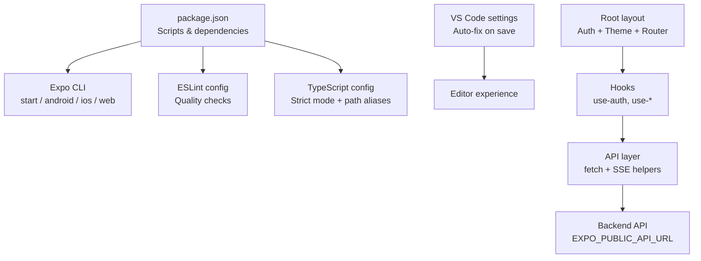
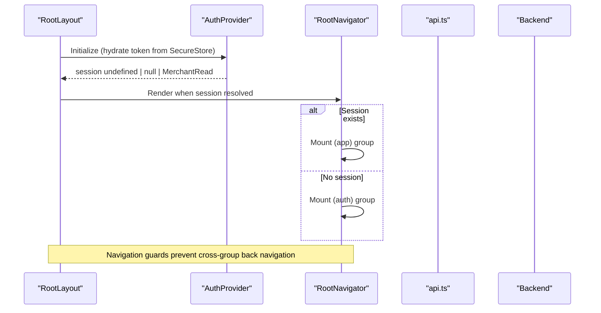
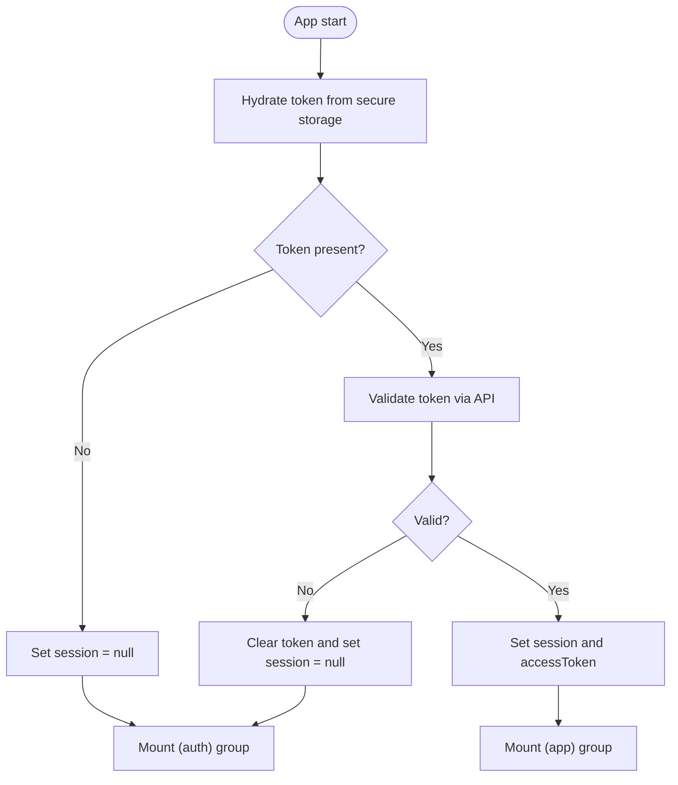
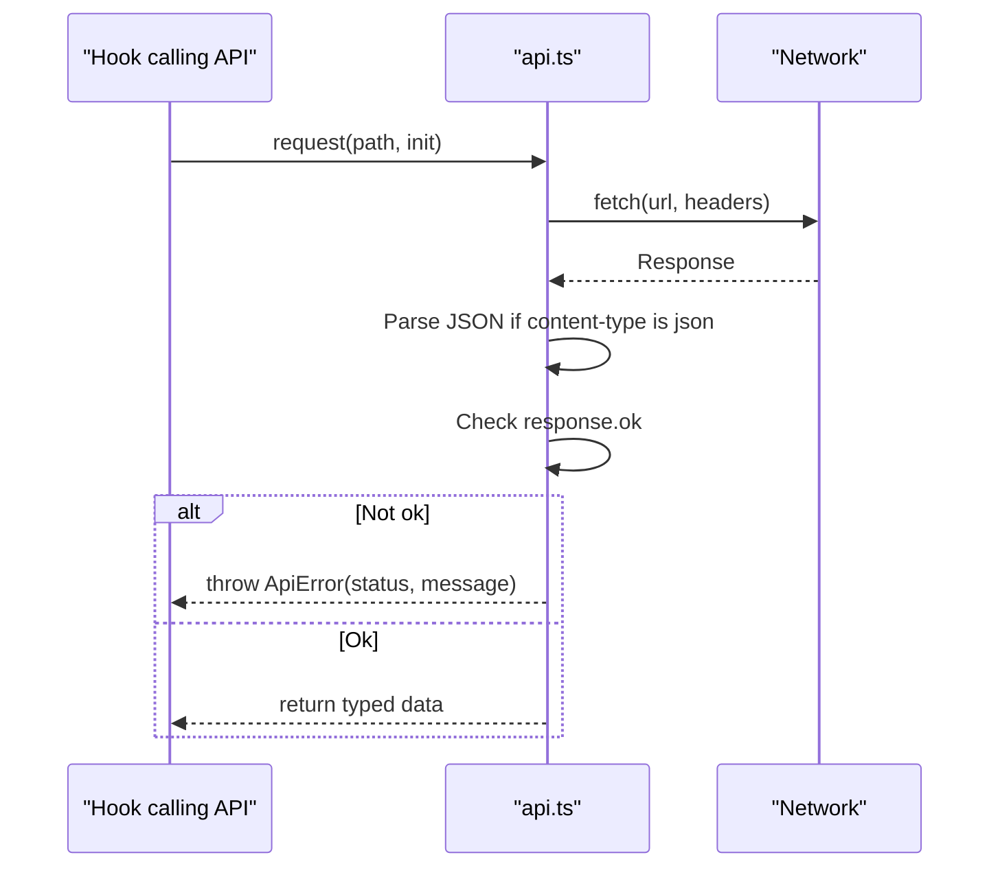
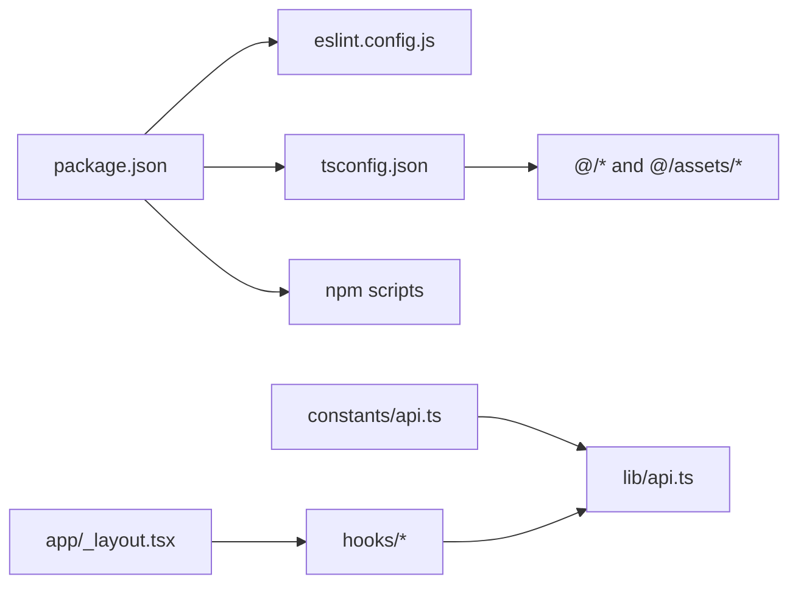

# Development Guide

<cite>
**Referenced Files in This Document**
- [package.json](file://package.json)
- [tsconfig.json](file://tsconfig.json)
- [eslint.config.js](file://eslint.config.js)
- [README.md](file://README.md)
- [scripts/reset-project.js](file://scripts/reset-project.js)
- [_vscode/settings.json](file://_vscode/settings.json)
- [_vscode/extensions.json](file://_vscode/extensions.json)
- [src/app/_layout.tsx](file://src/app/_layout.tsx)
- [src/constants/theme.ts](file://src/constants/theme.ts)
- [src/hooks/use-auth.tsx](file://src/hooks/use-auth.tsx)
- [src/lib/api.ts](file://src/lib/api.ts)
- [src/constants/api.ts](file://src/constants/api.ts)
- [AGENTS.md](file://AGENTS.md)
</cite>

## Table of Contents
1. [Introduction](#introduction)
2. [Project Structure](#project-structure)
3. [Core Components](#core-components)
4. [Architecture Overview](#architecture-overview)
5. [Detailed Component Analysis](#detailed-component-analysis)
6. [Dependency Analysis](#dependency-analysis)
7. [Performance Considerations](#performance-considerations)
8. [Troubleshooting Guide](#troubleshooting-guide)
9. [Conclusion](#conclusion)
10. [Appendices](#appendices)

## Introduction
This guide helps contributors and maintainers set up the environment, follow coding standards, understand TypeScript configuration, run development tasks, write tests, debug effectively, profile performance, and collaborate via Git with clear quality gates. It also provides patterns for adding new features consistently.

## Project Structure
The project is an Expo-based React Native app using file-based routing under src/app. Shared UI lives in src/components, business logic and data access are primarily in src/hooks and src/lib, and design tokens live in src/constants. Configuration files include package scripts, ESLint, TypeScript, and VS Code settings to streamline development.

**Diagram sources**
- [package.json:43-50](file://package.json#L43-L50)
- [eslint.config.js:1-11](file://eslint.config.js#L1-L11)
- [tsconfig.json:1-21](file://tsconfig.json#L1-L21)
- [_vscode/settings.json:1-8](file://_vscode/settings.json#L1-L8)
- [src/app/_layout.tsx:1-82](file://src/app/_layout.tsx#L1-L82)
- [src/hooks/use-auth.tsx:1-91](file://src/hooks/use-auth.tsx#L1-L91)
- [src/lib/api.ts:53-77](file://src/lib/api.ts#L53-L77)
- [src/constants/api.ts:1-16](file://src/constants/api.ts#L1-L16)

**Section sources**
- [package.json:1-52](file://package.json#L1-L52)
- [README.md:1-57](file://README.md#L1-L57)
- [tsconfig.json:1-21](file://tsconfig.json#L1-L21)
- [eslint.config.js:1-11](file://eslint.config.js#L1-L11)
- [_vscode/settings.json:1-8](file://_vscode/settings.json#L1-L8)
- [_vscode/extensions.json:1-2](file://_vscode/extensions.json#L1-L2)
- [src/app/_layout.tsx:1-82](file://src/app/_layout.tsx#L1-L82)

## Core Components
- Root layout and navigation: Provides theme provider, auth provider, splash handling, and mutually exclusive (auth) vs (app) route groups based on session state.
- Authentication context: Manages token persistence, hydration on launch, sign-in/sign-up/sign-out flows, and exposes a typed context value.
- API layer: Centralized fetch wrapper, error normalization, streaming (SSE) support across platforms, and typed endpoints for marketplace integrations.
- Design system: Centralized color tokens, typography scale, spacing, radii, and platform-specific font families.

Key responsibilities:
- Keep authentication state consistent across restarts and routes.
- Normalize backend errors into user-friendly messages.
- Provide reusable UI tokens to ensure visual consistency.

**Section sources**
- [src/app/_layout.tsx:1-82](file://src/app/_layout.tsx#L1-L82)
- [src/hooks/use-auth.tsx:1-91](file://src/hooks/use-auth.tsx#L1-L91)
- [src/lib/api.ts:53-77](file://src/lib/api.ts#L53-L77)
- [src/constants/theme.ts:1-263](file://src/constants/theme.ts#L1-L263)

## Architecture Overview
The app bootstraps with a root layout that sets up theming and authentication before rendering either the authenticated or unauthenticated route group. Hooks consume the API layer for data operations, including streaming responses where applicable. The API layer abstracts network details and normalizes errors.

**Diagram sources**
- [src/app/_layout.tsx:18-82](file://src/app/_layout.tsx#L18-L82)
- [src/hooks/use-auth.tsx:31-82](file://src/hooks/use-auth.tsx#L31-L82)

## Detailed Component Analysis

### Authentication Flow
- On launch, the auth provider reads a stored token and hydrates the current user. If invalid, it clears storage and sets session to null.
- Sign-in/sign-up store the token and hydrate the user; sign-out clears storage and resets state.
- The root navigator mounts either the (auth) or (app) route group based on session, ensuring clean navigation boundaries.

**Diagram sources**
- [src/hooks/use-auth.tsx:31-82](file://src/hooks/use-auth.tsx#L31-L82)
- [src/app/_layout.tsx:64-82](file://src/app/_layout.tsx#L64-L82)

**Section sources**
- [src/hooks/use-auth.tsx:1-91](file://src/hooks/use-auth.tsx#L1-L91)
- [src/app/_layout.tsx:1-82](file://src/app/_layout.tsx#L1-L82)

### API Layer and Streaming
- request<T>: Wraps fetch with JSON parsing and throws ApiError on non-ok responses, extracting human-readable messages.
- SSE support: Two paths—ReadableStream on web and XMLHttpRequest on native—parse event frames and dispatch events. streamToResult resolves on "complete" and rejects on "error" or stream end without result.
- Endpoints: Auth, marketplace connections, product listing generation, Daraz/Shopify OAuth flows, category and attribute normalization.

**Diagram sources**
- [src/lib/api.ts:53-77](file://src/lib/api.ts#L53-L77)

**Section sources**
- [src/lib/api.ts:53-77](file://src/lib/api.ts#L53-L77)
- [src/lib/api.ts:79-137](file://src/lib/api.ts#L79-L137)
- [src/lib/api.ts:139-204](file://src/lib/api.ts#L139-L204)
- [src/lib/api.ts:215-286](file://src/lib/api.ts#L215-L286)

### Design System Usage
- Colors: Light/dark palettes with semantic tokens (surface, primary, error, etc.).
- Typography: Platform-aware font families and a type scale (display, headline, body, label).
- Spacing and radius: Consistent spacing scale and border radii.

Use these tokens in components to ensure consistent visuals across platforms and themes.

**Section sources**
- [src/constants/theme.ts:1-263](file://src/constants/theme.ts#L1-L263)

## Dependency Analysis
- Scripts: start, reset-project, android, ios, web, lint.
- Linting: Uses Expo’s flat ESLint config.
- TypeScript: Extends Expo base config, enables strict mode, defines path aliases (@/* -> ./src/*, @/assets/* -> ./assets/*).
- Environment: Backend URL configured via EXPO_PUBLIC_API_URL with platform defaults.

**Diagram sources**
- [package.json:37-50](file://package.json#L37-L50)
- [tsconfig.json:1-21](file://tsconfig.json#L1-L21)
- [src/constants/api.ts:1-16](file://src/constants/api.ts#L1-L16)
- [src/lib/api.ts:53-77](file://src/lib/api.ts#L53-L77)
- [src/app/_layout.tsx:1-82](file://src/app/_layout.tsx#L1-L82)

**Section sources**
- [package.json:1-52](file://package.json#L1-L52)
- [tsconfig.json:1-21](file://tsconfig.json#L1-L21)
- [eslint.config.js:1-11](file://eslint.config.js#L1-L11)
- [src/constants/api.ts:1-16](file://src/constants/api.ts#L1-L16)

## Performance Considerations
- Prefer hooks for data fetching to co-locate state and side effects near consumers.
- Use memoization (e.g., useMemo) for expensive computations or stable context values.
- Avoid unnecessary re-renders by keeping component trees minimal and leveraging navigation guards that mount/unmount branches appropriately.
- For streaming, prefer SSE for long-running operations to keep UI responsive and show incremental progress.
- Profile UI with React DevTools Profiler and measure render times during feature changes.

[No sources needed since this section provides general guidance]

## Troubleshooting Guide
- Cannot reach backend:
  - Verify EXPO_PUBLIC_API_URL is set correctly for your device/emulator.
  - Ensure network connectivity and firewall rules allow requests to the backend host/port.
- Token issues:
  - If login fails repeatedly, check that SecureStore contains a valid token and that the server validates it.
  - On invalid/expired tokens, the app clears storage and resets session automatically.
- Streaming not working:
  - On native, streaming uses XHR; ensure the environment supports it and CORS allows text/event-stream.
  - On web, confirm ReadableStream is available and the server sends proper SSE framing.
- Linting/type errors:
  - Run npm run lint and npx tsc --noEmit to catch issues early.
  - Fix auto-fixable issues via editor actions configured in VS Code.

**Section sources**
- [src/constants/api.ts:1-16](file://src/constants/api.ts#L1-L16)
- [src/hooks/use-auth.tsx:31-82](file://src/hooks/use-auth.tsx#L31-L82)
- [src/lib/api.ts:139-204](file://src/lib/api.ts#L139-L204)
- [package.json:43-50](file://package.json#L43-L50)

## Conclusion
Follow the established patterns for authentication, API usage, and theming to maintain consistency. Use the provided scripts and tooling to keep code quality high, validate types, and streamline development. Adhere to Git and PR guidelines for smooth collaboration.

[No sources needed since this section summarizes without analyzing specific files]

## Appendices

### Coding Standards and ESLint
- Linting: Uses Expo’s flat ESLint configuration. Run npm run lint to enforce style and catch issues.
- Editor automation: VS Code is configured to fix all source issues, organize imports, and sort members on save.
- Recommendations:
  - Keep imports organized and grouped.
  - Prefer explicit types and avoid any where possible.
  - Use the design tokens from constants/theme.ts for colors, typography, spacing, and radii.

**Section sources**
- [eslint.config.js:1-11](file://eslint.config.js#L1-L11)
- [_vscode/settings.json:1-8](file://_vscode/settings.json#L1-L8)
- [src/constants/theme.ts:1-263](file://src/constants/theme.ts#L1-L263)

### TypeScript Configuration and Type Safety
- Strict mode enabled for safer code.
- Path aliases:
  - @/* maps to ./src/*
  - @/assets/* maps to ./assets/*
- Include patterns cover .ts and .tsx files plus generated types.
- Practices:
  - Define explicit types for API responses and props.
  - Use discriminated unions or enums where appropriate.
  - Leverage path aliases to keep imports clean and relative paths short.

**Section sources**
- [tsconfig.json:1-21](file://tsconfig.json#L1-L21)

### Development Workflow and Common Tasks
- Install dependencies and start the dev server per README instructions.
- Reset project: Use npm run reset-project to move or delete existing src/scripts and scaffold a fresh app directory.
- Lint: Run npm run lint before committing.
- Target platforms: Use npm run android, npm run ios, npm run web.

**Section sources**
- [README.md:5-42](file://README.md#L5-L42)
- [scripts/reset-project.js:1-115](file://scripts/reset-project.js#L1-L115)
- [package.json:43-50](file://package.json#L43-L50)

### Writing Tests
- No automated test framework is currently configured.
- Before submitting changes, run lint and type checks, then manually exercise affected flows on at least one target platform.
- If adding tests, place them beside the source as *.test.ts or *.test.tsx and document the runner command in package.json and AGENTS.md.

**Section sources**
- [AGENTS.md:21-27](file://AGENTS.md#L21-L27)

### Debugging Techniques
- Network debugging:
  - Inspect API_BASE_URL and ensure it points to the correct backend for your environment.
  - For streaming, verify server sends proper SSE frames and headers.
- State debugging:
  - Log session transitions in the auth provider to track token lifecycle.
- UI debugging:
  - Use React DevTools to inspect component trees and performance.
  - Confirm theme tokens are applied consistently across screens.

**Section sources**
- [src/constants/api.ts:1-16](file://src/constants/api.ts#L1-L16)
- [src/hooks/use-auth.tsx:31-82](file://src/hooks/use-auth.tsx#L31-L82)
- [src/lib/api.ts:79-137](file://src/lib/api.ts#L79-L137)

### Performance Profiling
- Use React DevTools Profiler to identify slow renders and excessive re-renders.
- Measure time-to-first-render and interaction responsiveness during key flows (auth, product listing generation).
- For long-running operations, leverage streaming to provide immediate feedback and reduce perceived latency.

[No sources needed since this section provides general guidance]

### Git Workflow and Contribution Guidelines
- Commit messages: Use short, imperative Conventional Commits (feat:, fix:, refactor:) with scoped summaries when useful.
- Pull requests: Explain user-visible effects, list validation performed, platforms tested, link related issues, and include screenshots or recordings for UI changes.
- Security: Do not commit secrets; use EXPO_PUBLIC_* env variables carefully (they are bundled into the client).

**Section sources**
- [AGENTS.md:25-32](file://AGENTS.md#L25-L32)

### Quality Assurance Steps
- Pre-commit checklist:
  - npm run lint
  - npx tsc --noEmit
  - Manual testing on target platforms
- Code review expectations:
  - Changes should be focused and well-scoped.
  - Highlight configuration or API-contract changes explicitly.
  - Include evidence of testing (screenshots, logs, or manual steps).

**Section sources**
- [AGENTS.md:21-32](file://AGENTS.md#L21-L32)

### Adding New Features: Patterns and Conventions
- Create a hook for data/state in src/hooks if it involves async operations or shared state.
- Add or extend API functions in src/lib/api.ts with typed requests and error handling.
- Use the design system tokens from src/constants/theme.ts for styling.
- Wire up navigation in src/app if adding new screens, respecting the (auth) vs (app) grouping.
- Update environment configuration if needed (e.g., EXPO_PUBLIC_API_URL), and document changes in PR description.

**Section sources**
- [src/hooks/use-auth.tsx:1-91](file://src/hooks/use-auth.tsx#L1-L91)
- [src/lib/api.ts:53-77](file://src/lib/api.ts#L53-L77)
- [src/constants/theme.ts:1-263](file://src/constants/theme.ts#L1-L263)
- [src/app/_layout.tsx:1-82](file://src/app/_layout.tsx#L1-L82)
- [src/constants/api.ts:1-16](file://src/constants/api.ts#L1-L16)