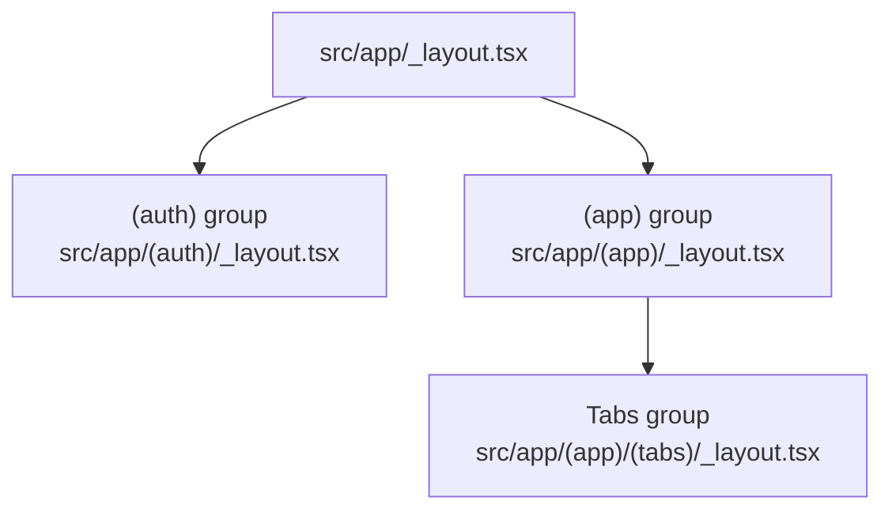
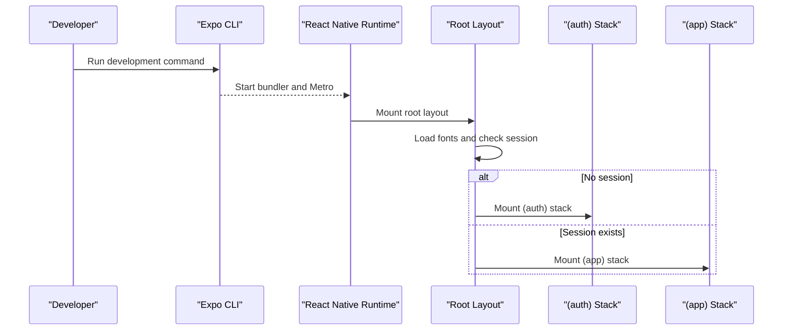
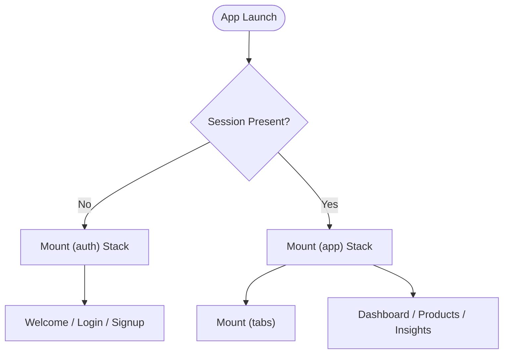
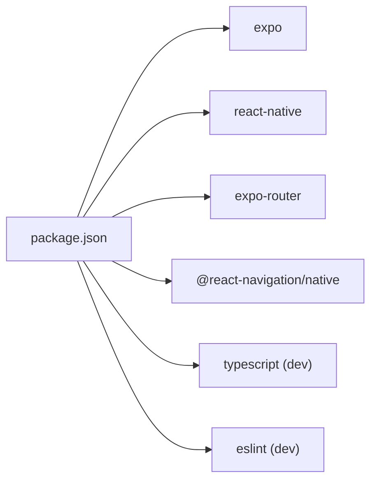

# Getting Started

<cite>
**Referenced Files in This Document**
- [README.md](file://README.md)
- [package.json](file://package.json)
- [app.json](file://app.json)
- [tsconfig.json](file://tsconfig.json)
- [src/app/_layout.tsx](file://src/app/_layout.tsx)
- [src/app/(app)/_layout.tsx](file://src/app/(app)/_layout.tsx)
- [src/app/(auth)/_layout.tsx](file://src/app/(auth)/_layout.tsx)
- [src/app/(app)/(tabs)/_layout.tsx](file://src/app/(app)/(tabs)/_layout.tsx)
- [src/constants/api.ts](file://src/constants/api.ts)
- [AGENTS.md](file://AGENTS.md)
</cite>

## Table of Contents
1. Introduction
2. Project Structure
3. Core Components
4. Architecture Overview
5. Detailed Component Analysis
6. Dependency Analysis
7. Performance Considerations
8. Troubleshooting Guide
9. Conclusion
10. Appendices

## Introduction
This guide helps you set up and run the Tijarah AI App quickly. It covers prerequisites, installation, running on different platforms, understanding the file-based routing, and troubleshooting common setup issues. The app is built with Expo Router and React Native, so you can develop for Android, iOS, and web from a single codebase.

## Project Structure
The project follows an Expo Router file-based routing convention under src/app. Grouped routes organize authentication and authenticated flows:
- src/app/(auth): Unauthenticated screens (welcome, login, signup)
- src/app/(app): Authenticated screens (tabs, product flows, store connections)
- src/app/(app)/(tabs): Tabbed navigation for main features

Configuration files:
- package.json: Scripts to start, run on Android/iOS/web, lint, and reset the project
- app.json: App metadata, icons, splash screen, and plugins
- tsconfig.json: TypeScript paths mapping @/* to src/*

**Diagram sources**
- [src/app/_layout.tsx:64-81](file://src/app/_layout.tsx#L64-L81)
- [src/app/(auth)/_layout.tsx:6-14](file://src/app/(auth)/_layout.tsx#L6-L14)
- [src/app/(app)/_layout.tsx:6-22](file://src/app/(app)/_layout.tsx#L6-L22)
- [src/app/(app)/(tabs)/_layout.tsx:5-7](file://src/app/(app)/(tabs)/_layout.tsx#L5-L7)

**Section sources**
- [README.md:5-26](file://README.md#L5-L26)
- [package.json:43-50](file://package.json#L43-L50)
- [app.json:1-52](file://app.json#L1-L52)
- [tsconfig.json:1-21](file://tsconfig.json#L1-L21)

## Core Components
- Routing shell: Root layout sets theme, fonts, splash behavior, and mounts either the auth or app stack based on session state.
- Auth flow: Protected stack ensures unauthenticated users see only welcome/login/signup until they sign in.
- App flow: Protected stack exposes tabs and additional screens like connect-stores, notifications, and product details.
- Tabs: The tab group renders the main navigation container used by the app.

Key behaviors:
- Splash screen remains visible until fonts and initial auth state are ready.
- Navigation groups are mutually exclusive via guards, preventing back-navigation leaks across auth boundaries.

**Section sources**
- [src/app/_layout.tsx:18-81](file://src/app/_layout.tsx#L18-L81)
- [src/app/(auth)/_layout.tsx:6-14](file://src/app/(auth)/_layout.tsx#L6-L14)
- [src/app/(app)/_layout.tsx:6-22](file://src/app/(app)/_layout.tsx#L6-L22)
- [src/app/(app)/(tabs)/_layout.tsx:5-7](file://src/app/(app)/(tabs)/_layout.tsx#L5-L7)

## Architecture Overview
At runtime, the root layout decides which route group to mount:
- If no session exists, the (auth) group is mounted.
- Once a session is present, the (app) group is mounted and its tabs become available.

**Diagram sources**
- [src/app/_layout.tsx:18-81](file://src/app/_layout.tsx#L18-L81)
- [src/app/(auth)/_layout.tsx:6-14](file://src/app/(auth)/_layout.tsx#L6-L14)
- [src/app/(app)/_layout.tsx:6-22](file://src/app/(app)/_layout.tsx#L6-L22)

## Detailed Component Analysis

### Prerequisites
- Node.js and npm: Required to install dependencies and run scripts.
- Expo CLI: Used to start the development server and launch targets.
- Platform toolchains:
  - Android: Android Studio and emulator recommended.
  - iOS: macOS with Xcode required for simulator builds.
  - Web: Any modern browser; Expo supports web output.

Install steps:
1. Install dependencies:
   - npm install
2. Start the development server:
   - npx expo start

Development options shown by the CLI:
- Development build
- Android emulator
- iOS simulator
- Expo Go (limited sandbox)

You can also use convenience scripts:
- npm run android
- npm run ios
- npm run web
- npm run lint

**Section sources**
- [README.md:5-26](file://README.md#L5-L26)
- [package.json:43-50](file://package.json#L43-L50)

### File-Based Routing and Navigation
Routing is driven by the file structure under src/app:
- Groups in parentheses define logical sections:
  - (auth): Unauthenticated screens
  - (app): Authenticated screens
  - (tabs): Tabbed interface inside the app group
- The root layout uses protected stacks to ensure only appropriate screens are reachable based on authentication state.

Navigation patterns:
- Use router.push to navigate between screens within the same group or across groups when permitted by guards.
- Tabs provide persistent bottom navigation for core features.

**Diagram sources**
- [src/app/_layout.tsx:64-81](file://src/app/_layout.tsx#L64-L81)
- [src/app/(auth)/_layout.tsx:6-14](file://src/app/(auth)/_layout.tsx#L6-L14)
- [src/app/(app)/_layout.tsx:6-22](file://src/app/(app)/_layout.tsx#L6-L22)
- [src/app/(app)/(tabs)/_layout.tsx:5-7](file://src/app/(app)/(tabs)/_layout.tsx#L5-L7)

**Section sources**
- [src/app/_layout.tsx:18-81](file://src/app/_layout.tsx#L18-L81)
- [src/app/(auth)/_layout.tsx:6-14](file://src/app/(auth)/_layout.tsx#L6-L14)
- [src/app/(app)/_layout.tsx:6-22](file://src/app/(app)/_layout.tsx#L6-L22)
- [src/app/(app)/(tabs)/_layout.tsx:5-7](file://src/app/(app)/(tabs)/_layout.tsx#L5-L7)

### Running Targets
- Expo Go: Quick iteration without native builds; limited capabilities.
- Development build: Custom native build for full feature access.
- Android emulator: Use Android Studio’s emulator to test Android flows.
- iOS simulator: Requires macOS and Xcode to run iOS builds.
- Web: Run the web target to preview in a browser.

Use commands:
- npx expo start (interactive menu)
- npm run android
- npm run ios
- npm run web

**Section sources**
- [README.md:19-26](file://README.md#L19-L26)
- [package.json:43-50](file://package.json#L43-L50)

### Environment and Backend URL
- Backend base URL is configured via environment variables.
- For local development, the app expects a backend at a specific address. On Android emulator, special host aliases may be needed; on physical devices, use your machine’s LAN IP.
- You can override the backend URL using EXPO_PUBLIC_API_URL in an untracked .env file.

Important notes:
- EXPO_PUBLIC_* values are bundled into the client and are not secret.
- Ensure your backend is reachable from the device or emulator.

**Section sources**
- [src/constants/api.ts:1-15](file://src/constants/api.ts#L1-L15)
- [AGENTS.md:29-32](file://AGENTS.md#L29-L32)

## Dependency Analysis
Core runtime dependencies include Expo, React Native, Expo Router, and related UI/navigation libraries. Development-time tools include TypeScript and ESLint.

**Diagram sources**
- [package.json:6-42](file://package.json#L6-L42)

**Section sources**
- [package.json:6-42](file://package.json#L6-L42)

## Performance Considerations
- Keep the number of heavy components in the initial render minimal to reduce startup time.
- Use lazy loading for non-critical screens where possible.
- Prefer memoization for expensive computations in list items or dashboards.
- Avoid unnecessary re-renders by lifting state carefully and using stable references.

[No sources needed since this section provides general guidance]

## Troubleshooting Guide
Common setup issues and resolutions:

- Dependencies fail to install:
  - Clear caches and reinstall: remove node_modules and lockfiles, then run npm install again.
  - Ensure Node.js version meets project requirements.

- Cannot reach backend:
  - Verify EXPO_PUBLIC_API_URL points to a reachable endpoint.
  - On Android emulator, use the correct host alias or LAN IP for your machine.
  - Confirm firewall or network settings allow inbound connections.

- Android emulator cannot connect to localhost:
  - Use the platform-specific host alias instead of localhost when targeting your dev machine.

- iOS simulator requires macOS:
  - Ensure you are on a Mac with Xcode installed to build and run iOS targets.

- Expo Go limitations:
  - Some native modules are not supported in Expo Go; use a development build if you encounter missing functionality.

- Linting and type errors:
  - Run npm run lint and fix reported issues.
  - Use TypeScript checks to catch type-related problems early.

- Resetting the project:
  - Use the provided script to move starter code and create a fresh app directory when starting over.

**Section sources**
- [README.md:28-42](file://README.md#L28-L42)
- [src/constants/api.ts:1-15](file://src/constants/api.ts#L1-L15)
- [AGENTS.md:29-32](file://AGENTS.md#L29-L32)

## Conclusion
You now have everything needed to install, run, and navigate the Tijarah AI App. Start with npm install and npx expo start, choose your target (Android, iOS, web, or Expo Go), and explore the file-based routing under src/app. Configure your backend URL appropriately and use the troubleshooting tips to resolve common issues. As you grow the app, leverage the modular layout and protected stacks to keep navigation clean and secure.

## Appendices

### Quick Commands Reference
- Install dependencies: npm install
- Start development server: npx expo start
- Run on Android: npm run android
- Run on iOS: npm run ios
- Run on Web: npm run web
- Lint: npm run lint
- Reset project: npm run reset-project

**Section sources**
- [README.md:5-42](file://README.md#L5-L42)
- [package.json:43-50](file://package.json#L43-L50)