# Hooks & State Management

<cite>
**Referenced Files in This Document**
- [use-theme.ts](file://src/hooks/use-theme.ts)
- [use-color-scheme.ts](file://src/hooks/use-color-scheme.ts)
- [use-color-scheme.web.ts](file://src/hooks/use-color-scheme.web.ts)
- [theme.ts](file://src/constants/theme.ts)
- [use-stagger.ts](file://src/hooks/use-stagger.ts)
- [use-catalog-search.ts](file://src/hooks/use-catalog-search.ts)
- [use-auth.tsx](file://src/hooks/use-auth.tsx)
- [use-products.ts](file://src/hooks/use-products.ts)
- [use-product.ts](file://src/hooks/use-product.ts)
- [use-daraz-access-token.ts](file://src/hooks/use-daraz-access-token.ts)
- [use-shopify-access-token.ts](file://src/hooks/use-shopify-access-token.ts)
- [use-daraz-products.ts](file://src/hooks/use-daraz-products.ts)
- [use-shopify-products.ts](file://src/hooks/use-shopify-products.ts)
- [use-finance-dashboard.ts](file://src/hooks/use-finance-dashboard.ts)
- [use-finance-transactions.ts](file://src/hooks/use-finance-transactions.ts)
- [use-finance-payouts.ts](file://src/hooks/use-finance-payouts.ts)
- [use-finance-fees.ts](file://src/hooks/use-finance-fees.ts)
- [use-finance-profit.ts](file://src/hooks/use-finance-profit.ts)
- [use-finance-cashflow.ts](file://src/hooks/use-finance-cashflow.ts)
- [use-finance-settlement.ts](file://src/hooks/use-finance-settlement.ts)
- [use-expenses.ts](file://src/hooks/use-expenses.ts)
- [use-keyword-analysis.ts](file://src/hooks/use-keyword-analysis.ts)
- [keyword-analysis.tsx](file://src/app/(app)/keyword-analysis.tsx)
- [keyword-analysis-kit.tsx](file://src/components/keyword-analysis-kit.tsx)
- [expenses.tsx](file://src/app/(app)/expenses.tsx)
- [expense-form.tsx](file://src/app/(app)/expense-form.tsx)
- [finance-kit.tsx](file://src/components/finance-kit.tsx)
- [finance-charts.tsx](file://src/components/finance-charts.tsx)
- [api.ts](file://src/lib/api.ts)
</cite>

## Update Summary
**Changes Made**
- Added comprehensive documentation for the new use-keyword-analysis hook implementing sophisticated nine-stage analysis pipeline with real-time progress tracking, error handling, and streaming capabilities
- Updated architecture overview to include keyword analysis integration
- Enhanced data fetching patterns section with keyword analysis examples
- Added keyword analysis-specific state management patterns and SSE streaming
- Included keyword analysis component integration examples with progress tracking and result visualization

## Table of Contents
1. Introduction
2. Project Structure
3. Core Components
4. Architecture Overview
5. Detailed Component Analysis
6. Finance Module Hooks
7. Expense Management Hook
8. Keyword Analysis Hook
9. Dependency Analysis
10. Performance Considerations
11. Troubleshooting Guide
12. Conclusion
13. Appendices

## Introduction
This document explains the custom hooks and state management patterns used across the application, with a focus on:
- Theme management (light/dark mode) via use-theme and use-color-scheme
- Utility hooks for animations (use-stagger) and search (use-catalog-search)
- A consistent data fetching pattern for API interactions
- Comprehensive finance module hooks for Daraz marketplace financial data
- **New**: Expense management hook (use-expenses) providing full CRUD operations with optimistic UI updates
- **New**: Keyword analysis hook (use-keyword-analysis) implementing sophisticated nine-stage analysis pipeline with real-time progress tracking and streaming
- State synchronization strategies and performance optimizations
- Error handling and loading states
- Guidance for creating new custom hooks, testing them, and debugging state issues

## Project Structure
The hooks live under src/hooks and are organized by feature or concern:
- Theming: use-theme, use-color-scheme (platform-specific), theme constants
- Utilities: use-stagger for animation timing
- Data fetching: use-auth, use-products, use-product, marketplace token resolvers, platform product fetchers, catalog search
- Finance Module: Seven specialized hooks for financial dashboard, transactions, payouts, fees, profit analytics, cash flow, and settlement reconciliation
- **Expense Management**: Dedicated hook for product expense tracking with CRUD operations and optimistic UI updates
- **Keyword Analysis**: Advanced hook for AI-powered keyword analysis with nine-stage pipeline processing and real-time progress tracking
- API layer: centralized request helpers, error types, streaming support

```mermaid
graph TB
subgraph "Theming"
T1["use-theme.ts"]
T2["use-color-scheme.ts / .web.ts"]
T3["constants/theme.ts"]
end
subgraph "Utilities"
U1["use-stagger.ts"]
U2["use-catalog-search.ts"]
end
subgraph "Auth & Data"
A1["use-auth.tsx"]
D1["use-products.ts"]
D2["use-product.ts"]
M1["use-daraz-access-token.ts"]
M2["use-shopify-access-token.ts"]
P1["use-daraz-products.ts"]
P2["use-shopify-products.ts"]
end
subgraph "Finance Module"
F1["use-finance-dashboard.ts"]
F2["use-finance-transactions.ts"]
F3["use-finance-payouts.ts"]
F4["use-finance-fees.ts"]
F5["use-finance-profit.ts"]
F6["use-finance-cashflow.ts"]
F7["use-finance-settlement.ts"]
end
subgraph "Expense Management"
E1["use-expenses.ts"]
E2["expenses.tsx"]
E3["expense-form.tsx"]
end
subgraph "Keyword Analysis"
K1["use-keyword-analysis.ts"]
K2["keyword-analysis.tsx"]
K3["keyword-analysis-kit.tsx"]
end
L1["lib/api.ts"]
T1 --> T2
T1 --> T3
U2 --> A1
D1 --> A1
D2 --> A1
P1 --> M1
P2 --> M2
D1 --> L1
D2 --> L1
P1 --> L1
P2 --> L1
U2 --> L1
F1 --> M1
F2 --> M1
F3 --> M1
F4 --> M1
F5 --> M1
F6 --> M1
F7 --> M1
E1 --> A1
E1 --> L1
E2 --> E1
E3 --> E1
K1 --> A1
K1 --> M1
K1 --> L1
K2 --> K1
K3 --> K1
F1 --> L1
F2 --> L1
F3 --> L1
F4 --> L1
F5 --> L1
F6 --> L1
F7 --> L1
```

**Diagram sources**
- [use-theme.ts:9-14](file://src/hooks/use-theme.ts#L9-L14)
- [use-color-scheme.ts:1-2](file://src/hooks/use-color-scheme.ts#L1-L2)
- [use-color-scheme.web.ts:7-21](file://src/hooks/use-color-scheme.web.ts#L7-L21)
- [theme.ts:117-141](file://src/constants/theme.ts#L117-L141)
- [use-stagger.ts:9-13](file://src/hooks/use-stagger.ts#L9-L13)
- [use-catalog-search.ts:38-149](file://src/hooks/use-catalog-search.ts#L38-L149)
- [use-auth.tsx:31-88](file://src/hooks/use-auth.tsx#L31-L88)
- [use-products.ts:16-57](file://src/hooks/use-products.ts#L16-L57)
- [use-product.ts:16-51](file://src/hooks/use-product.ts#L16-L51)
- [use-daraz-access-token.ts:19-65](file://src/hooks/use-daraz-access-token.ts#L19-L65)
- [use-shopify-access-token.ts:6-30](file://src/hooks/use-shopify-access-token.ts#L6-L30)
- [use-daraz-products.ts:120-183](file://src/hooks/use-daraz-products.ts#L120-L183)
- [use-shopify-products.ts:27-49](file://src/hooks/use-shopify-products.ts#L27-L49)
- [use-finance-dashboard.ts:18-75](file://src/hooks/use-finance-dashboard.ts#L18-L75)
- [use-finance-transactions.ts:25-85](file://src/hooks/use-finance-transactions.ts#L25-85)
- [use-finance-payouts.ts:23-77](file://src/hooks/use-finance-payouts.ts#L23-L77)
- [use-finance-fees.ts:23-77](file://src/hooks/use-finance-fees.ts#L23-L77)
- [use-finance-profit.ts:23-77](file://src/hooks/use-finance-profit.ts#L23-L77)
- [use-finance-cashflow.ts:18-69](file://src/hooks/use-finance-cashflow.ts#L18-L69)
- [use-finance-settlement.ts:18-73](file://src/hooks/use-finance-settlement.ts#L18-L73)
- [use-expenses.ts:30-100](file://src/hooks/use-expenses.ts#L30-L100)
- [use-keyword-analysis.ts:63-182](file://src/hooks/use-keyword-analysis.ts#L63-L182)
- [keyword-analysis.tsx:35-307](file://src/app/(app)/keyword-analysis.tsx#L35-L307)
- [keyword-analysis-kit.tsx:19-512](file://src/components/keyword-analysis-kit.tsx#L19-L512)
- [expenses.tsx:26-194](file://src/app/(app)/expenses.tsx#L26-L194)
- [expense-form.tsx:34-435](file://src/app/(app)/expense-form.tsx#L34-L435)
- [api.ts:2197-2230](file://src/lib/api.ts#L2197-L2230)

**Section sources**
- [use-theme.ts:9-14](file://src/hooks/use-theme.ts#L9-L14)
- [use-color-scheme.ts:1-2](file://src/hooks/use-color-scheme.ts#L1-L2)
- [use-color-scheme.web.ts:7-21](file://src/hooks/use-color-scheme.web.ts#L7-L21)
- [theme.ts:117-141](file://src/constants/theme.ts#L117-L141)
- [use-stagger.ts:9-13](file://src/hooks/use-stagger.ts#L9-L13)
- [use-catalog-search.ts:38-149](file://src/hooks/use-catalog-search.ts#L38-L149)
- [use-auth.tsx:31-88](file://src/hooks/use-auth.tsx#L31-L88)
- [use-products.ts:16-57](file://src/hooks/use-products.ts#L16-L57)
- [use-product.ts:16-51](file://src/hooks/use-product.ts#L16-L51)
- [use-daraz-access-token.ts:19-65](file://src/hooks/use-daraz-access-token.ts#L19-L65)
- [use-shopify-access-token.ts:6-30](file://src/hooks/use-shopify-access-token.ts#L6-L30)
- [use-daraz-products.ts:120-183](file://src/hooks/use-daraz-products.ts#L120-L183)
- [use-shopify-products.ts:27-49](file://src/hooks/use-shopify-products.ts#L27-L49)
- [use-finance-dashboard.ts:18-75](file://src/hooks/use-finance-dashboard.ts#L18-L75)
- [use-finance-transactions.ts:25-85](file://src/hooks/use-finance-transactions.ts#L25-L85)
- [use-finance-payouts.ts:23-77](file://src/hooks/use-finance-payouts.ts#L23-L77)
- [use-finance-fees.ts:23-77](file://src/hooks/use-finance-fees.ts#L23-L77)
- [use-finance-profit.ts:23-77](file://src/hooks/use-finance-profit.ts#L23-L77)
- [use-finance-cashflow.ts:18-69](file://src/hooks/use-finance-cashflow.ts#L18-L69)
- [use-finance-settlement.ts:18-73](file://src/hooks/use-finance-settlement.ts#L18-L73)
- [use-expenses.ts:30-100](file://src/hooks/use-expenses.ts#L30-L100)
- [use-keyword-analysis.ts:63-182](file://src/hooks/use-keyword-analysis.ts#L63-L182)
- [keyword-analysis.tsx:35-307](file://src/app/(app)/keyword-analysis.tsx#L35-L307)
- [keyword-analysis-kit.tsx:19-512](file://src/components/keyword-analysis-kit.tsx#L19-L512)
- [expenses.tsx:26-194](file://src/app/(app)/expenses.tsx#L26-L194)
- [expense-form.tsx:34-435](file://src/app/(app)/expense-form.tsx#L34-L435)
- [api.ts:2197-2230](file://src/lib/api.ts#L2197-L2230)

## Core Components
- Theme management:
  - use-theme resolves the current color scheme and returns the matching color palette from constants.
  - use-color-scheme delegates to React Native's hook; on web it hydrates safely to avoid SSR mismatch.
- Animation utility:
  - use-stagger provides a function that returns an entrance animation only when reduced motion is not enabled.
- Search:
  - use-catalog-search encapsulates paginated, deduplicated search with loading/error states and refetch/loadMore controls.
- Authentication:
  - AuthProvider manages session and access token persistence and hydration from secure storage.
- Data fetching:
  - use-products and use-product follow a consistent pattern: guard on accessToken, manage isLoading/error, expose refetch.
  - Marketplace token resolvers (Daraz/Shopify) centralize connection checks and expose isConnected/loading/error.
  - Platform product hooks map raw responses into a unified Product shape and de-duplicate items.
- Finance Module: Seven specialized hooks providing comprehensive financial data management for Daraz marketplace integration.
- **Expense Management**: Dedicated hook providing full CRUD operations for product expenses with optimistic UI updates and platform filtering.
- **Keyword Analysis**: Advanced hook implementing sophisticated nine-stage AI-powered keyword analysis pipeline with real-time progress tracking, streaming capabilities, and comprehensive result visualization.

**Section sources**
- [use-theme.ts:9-14](file://src/hooks/use-theme.ts#L9-L14)
- [use-color-scheme.web.ts:7-21](file://src/hooks/use-color-scheme.web.ts#L7-L21)
- [use-stagger.ts:9-13](file://src/hooks/use-stagger.ts#L9-L13)
- [use-catalog-search.ts:38-149](file://src/hooks/use-catalog-search.ts#L38-L149)
- [use-auth.tsx:31-88](file://src/hooks/use-auth.tsx#L31-L88)
- [use-products.ts:16-57](file://src/hooks/use-products.ts#L16-L57)
- [use-product.ts:16-51](file://src/hooks/use-product.ts#L16-L51)
- [use-daraz-access-token.ts:19-65](file://src/hooks/use-daraz-access-token.ts#L19-L65)
- [use-shopify-access-token.ts:6-30](file://src/hooks/use-shopify-access-token.ts#L6-L30)
- [use-daraz-products.ts:120-183](file://src/hooks/use-daraz-products.ts#L120-L183)
- [use-shopify-products.ts:27-49](file://src/hooks/use-shopify-products.ts#L27-L49)
- [use-expenses.ts:30-100](file://src/hooks/use-expenses.ts#L30-L100)
- [use-keyword-analysis.ts:63-182](file://src/hooks/use-keyword-analysis.ts#L63-L182)

## Architecture Overview
The application uses a layered approach:
- UI components consume hooks for theme, animations, and data.
- Hooks depend on a shared authentication context for tokens.
- Data fetching hooks call a centralized API module that handles errors, headers, and streaming where needed.
- Marketplace integrations resolve per-platform tokens before fetching products.
- Finance Module: Specialized hooks integrate with Daraz financial APIs using dual authentication (user access token + Daraz access token).
- **Expense Management**: Dedicated hook integrates with expense APIs using user authentication token and provides optimistic UI updates for better user experience.
- **Keyword Analysis**: Advanced hook implements sophisticated nine-stage analysis pipeline with Server-Sent Events (SSE) streaming for real-time progress tracking and comprehensive AI-powered keyword analysis.

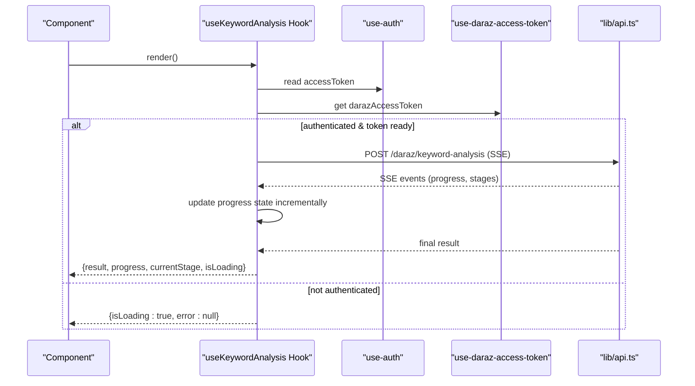

**Diagram sources**
- [use-keyword-analysis.ts:63-182](file://src/hooks/use-keyword-analysis.ts#L63-L182)
- [use-auth.tsx:31-88](file://src/hooks/use-auth.tsx#L31-L88)
- [use-daraz-access-token.ts:19-65](file://src/hooks/use-daraz-access-token.ts#L19-L65)
- [api.ts:2197-2230](file://src/lib/api.ts#L2197-L2230)

## Detailed Component Analysis

### Theme Management: use-theme and use-color-scheme
- use-theme reads the current color scheme and returns the corresponding Colors object (light or dark). It falls back to light if the scheme is unknown.
- use-color-scheme re-exports React Native's hook on native platforms. On web, it ensures client-side hydration before returning the scheme to avoid mismatches during static rendering.


**Diagram sources**
- [use-theme.ts:9-14](file://src/hooks/use-theme.ts#L9-L14)
- [use-color-scheme.ts:1-2](file://src/hooks/use-color-scheme.ts#L1-L2)
- [use-color-scheme.web.ts:7-21](file://src/hooks/use-color-scheme.web.ts#L7-L21)
- [theme.ts:117-141](file://src/constants/theme.ts#L117-L141)

**Section sources**
- [use-theme.ts:9-14](file://src/hooks/use-theme.ts#L9-L14)
- [use-color-scheme.ts:1-2](file://src/hooks/use-color-scheme.ts#L1-L2)
- [use-color-scheme.web.ts:7-21](file://src/hooks/use-color-scheme.web.ts#L7-L21)
- [theme.ts:117-141](file://src/constants/theme.ts#L117-L141)

### Animation Timing: use-stagger
- Provides a factory function that returns an entrance animation based on device accessibility settings. When reduced motion is enabled, it returns undefined to skip animations.

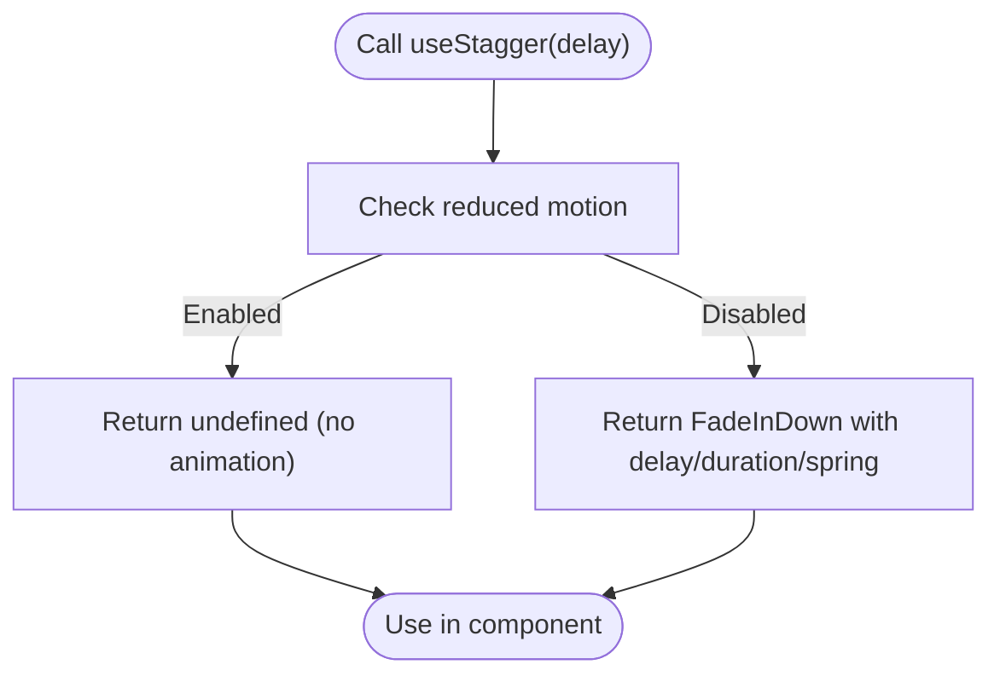

**Diagram sources**
- [use-stagger.ts:9-13](file://src/hooks/use-stagger.ts#L9-L13)

**Section sources**
- [use-stagger.ts:9-13](file://src/hooks/use-stagger.ts#L9-L13)

### Search: use-catalog-search
- Encapsulates paginated search with:
  - Query normalization and enable/disable gating
  - Pagination state (current page, total pages, total products)
  - Deduplication of results by item_id
  - Loading states for initial load vs "load more"
  - Error handling using ApiError messages
  - refetch and loadMore actions


**Diagram sources**
- [use-catalog-search.ts:38-149](file://src/hooks/use-catalog-search.ts#L38-L149)
- [api.ts:53-77](file://src/lib/api.ts#L53-L77)

**Section sources**
- [use-catalog-search.ts:38-149](file://src/hooks/use-catalog-search.ts#L38-L149)

### Authentication: use-auth
- Persists and hydrates an access token from secure storage.
- Exposes session and token values plus sign-in/sign-up/sign-out methods.
- Throws if used outside its provider.

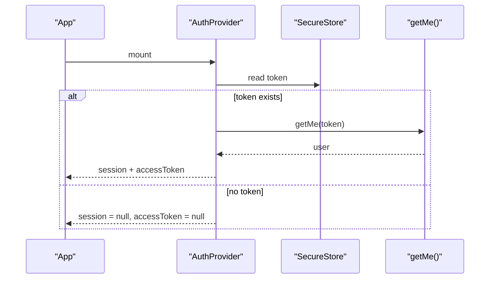

**Diagram sources**
- [use-auth.tsx:31-88](file://src/hooks/use-auth.tsx#L31-L88)
- [api.ts:338-342](file://src/lib/api.ts#L338-L342)

**Section sources**
- [use-auth.tsx:31-88](file://src/hooks/use-auth.tsx#L31-L88)

### Data Fetching Patterns: use-products and use-product
- Both hooks:
  - Wait for accessToken before making requests
  - Manage isLoading, error, and data state
  - Provide refetch via a reloadKey increment
  - Use cancellation flags to prevent state updates after unmount

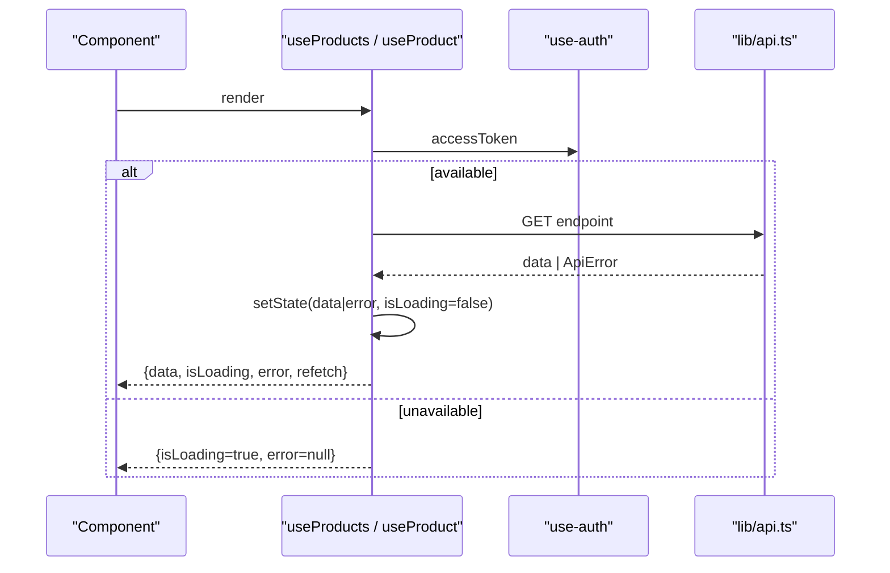

**Diagram sources**
- [use-products.ts:16-57](file://src/hooks/use-products.ts#L16-L57)
- [use-product.ts:16-51](file://src/hooks/use-product.ts#L16-L51)
- [api.ts:53-77](file://src/lib/api.ts#L53-L77)

**Section sources**
- [use-products.ts:16-57](file://src/hooks/use-products.ts#L16-L57)
- [use-product.ts:16-51](file://src/hooks/use-product.ts#L16-L51)

### Marketplace Tokens and Products: Daraz and Shopify
- Token resolvers:
  - use-daraz-access-token and use-shopify-access-token fetch connections and extract encrypted_access_token for the respective platform.
  - They expose isConnected, isLoading, error, and refetch.
- Product hooks:
  - Map raw marketplace responses into a unified Product type.
  - De-duplicate products by id.
  - Compose isLoading and error from both token resolution and product fetching.

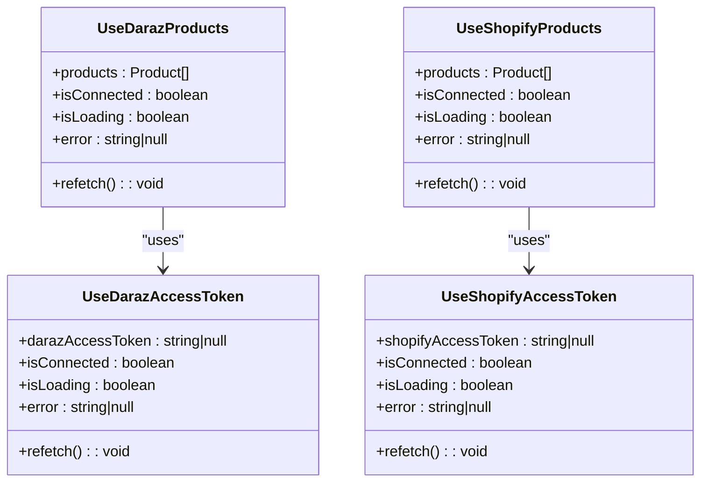

**Diagram sources**
- [use-daraz-access-token.ts:19-65](file://src/hooks/use-daraz-access-token.ts#L19-L65)
- [use-shopify-access-token.ts:6-30](file://src/hooks/use-shopify-access-token.ts#L6-L30)
- [use-daraz-products.ts:120-183](file://src/hooks/use-daraz-products.ts#L120-L183)
- [use-shopify-products.ts:27-49](file://src/hooks/use-shopify-products.ts#L27-L49)

**Section sources**
- [use-daraz-access-token.ts:19-65](file://src/hooks/use-daraz-access-token.ts#L19-L65)
- [use-shopify-access-token.ts:6-30](file://src/hooks/use-shopify-access-token.ts#L6-L30)
- [use-daraz-products.ts:120-183](file://src/hooks/use-daraz-products.ts#L120-L183)
- [use-shopify-products.ts:27-49](file://src/hooks/use-shopify-products.ts#L27-L49)

### API Layer: Centralized Requests and Errors
- request wraps fetch with error extraction and ApiError throwing for non-ok responses.
- Streaming support for server-sent events via XHR on native and ReadableStream on web.
- streamToResult orchestrates SSE streams to produce a final result or error.

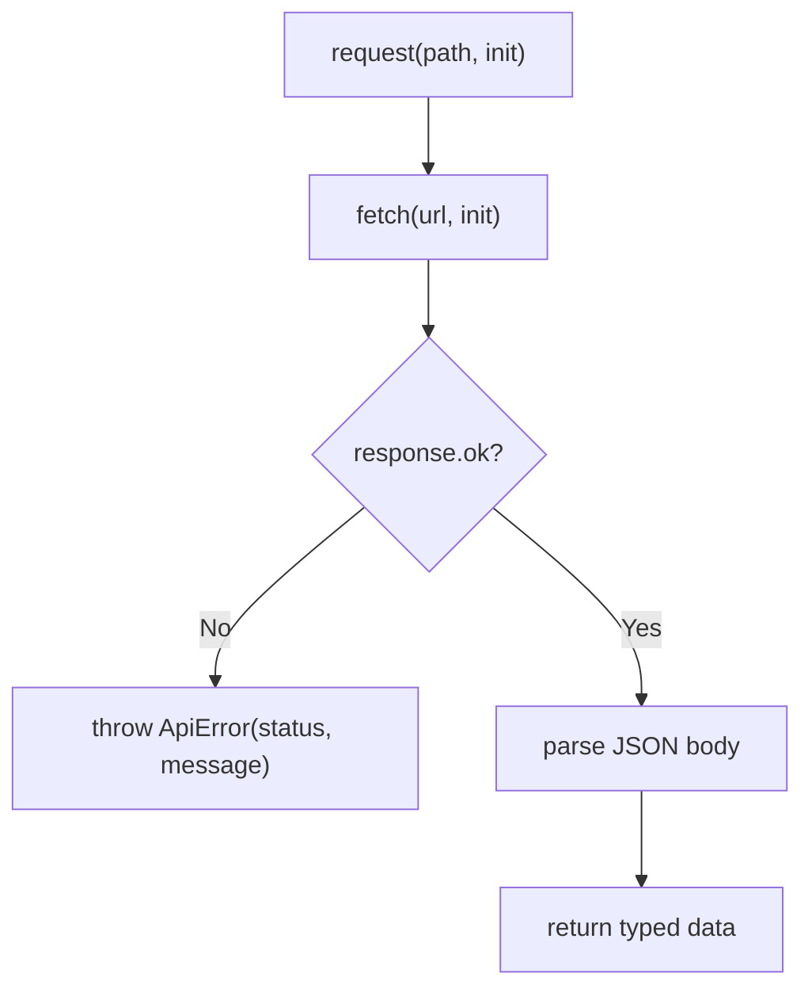

**Diagram sources**
- [api.ts:53-77](file://src/lib/api.ts#L53-L77)
- [api.ts:215-286](file://src/lib/api.ts#L215-L286)

**Section sources**
- [api.ts:53-77](file://src/lib/api.ts#L53-L77)
- [api.ts:215-286](file://src/lib/api.ts#L215-L286)

## Finance Module Hooks

### Financial Dashboard Hook: useFinancialDashboard
- Provides comprehensive financial overview including revenue, payouts, fees, and profit metrics
- Integrates with Daraz financial dashboard API using dual authentication
- Supports configurable date ranges (default 30 days)
- Returns structured dashboard data with fee breakdowns and cash flow trends


**Diagram sources**
- [use-finance-dashboard.ts:18-75](file://src/hooks/use-finance-dashboard.ts#L18-L75)
- [api.ts:1723-1732](file://src/lib/api.ts#L1723-L1732)

**Section sources**
- [use-finance-dashboard.ts:18-75](file://src/hooks/use-finance-dashboard.ts#L18-L75)
- [api.ts:1723-1732](file://src/lib/api.ts#L1723-L1732)

### Transaction Hook: useFinancialTransactions
- Manages transaction details with pagination support
- Accepts date range parameters (startDate, endDate) and optional pagination
- Returns structured transaction data with detailed order information
- Handles large datasets through page-based loading


**Diagram sources**
- [use-finance-transactions.ts:25-85](file://src/hooks/use-finance-transactions.ts#L25-L85)
- [api.ts:1734-1749](file://src/lib/api.ts#L1734-L1749)

**Section sources**
- [use-finance-transactions.ts:25-85](file://src/hooks/use-finance-transactions.ts#L25-L85)
- [api.ts:1734-1749](file://src/lib/api.ts#L1734-L1749)

### Payout Analytics Hook: usePayoutAnalytics
- Tracks payout status and amounts across different periods
- Categorizes payouts into paid, upcoming, pending, and failed states
- Provides aggregated financial metrics for payout analysis
- Supports date range filtering for historical analysis


**Diagram sources**
- [use-finance-payouts.ts:23-77](file://src/hooks/use-finance-payouts.ts#L23-L77)
- [api.ts:1751-1764](file://src/lib/api.ts#L1751-L1764)

**Section sources**
- [use-finance-payouts.ts:23-77](file://src/hooks/use-finance-payouts.ts#L23-L77)
- [api.ts:1751-1764](file://src/lib/api.ts#L1751-L1764)

### Fee Breakdown Hook: useFeeBreakdown
- Analyzes fee structure and effective fee rates
- Breaks down commissions, payment fees, shipping fees, and other charges
- Calculates net payout after all deductions
- Provides insights into cost optimization opportunities

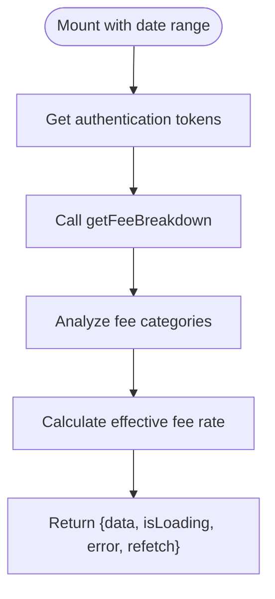

**Diagram sources**
- [use-finance-fees.ts:23-77](file://src/hooks/use-finance-fees.ts#L23-L77)
- [api.ts:1766-1779](file://src/lib/api.ts#L1766-L1779)

**Section sources**
- [use-finance-fees.ts:23-77](file://src/hooks/use-finance-fees.ts#L23-L77)
- [api.ts:1766-1779](file://src/lib/api.ts#L1766-L1779)

### Profit Analytics Hook: useProfitAnalytics
- Tracks profitability metrics over specified time periods
- Calculates revenue, costs, and net profit margins
- Provides order count correlation with financial performance
- Enables trend analysis for business decision-making

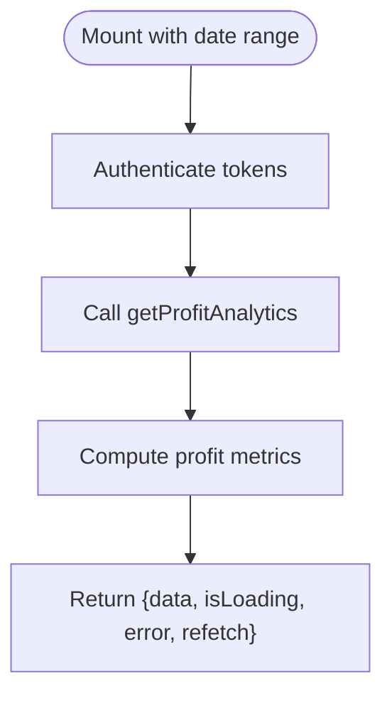

**Diagram sources**
- [use-finance-profit.ts:23-77](file://src/hooks/use-finance-profit.ts#L23-L77)
- [api.ts:1781-1794](file://src/lib/api.ts#L1781-L1794)

**Section sources**
- [use-finance-profit.ts:23-77](file://src/hooks/use-finance-profit.ts#L23-L77)
- [api.ts:1781-1794](file://src/lib/api.ts#L1781-L1794)

### Cash Flow Hook: useCashFlow
- Monitors daily cash inflows and outflows
- Tracks net cash position over configurable time periods
- Provides visualizable data for cash flow charts
- Supports flexible date range selection (default 30 days)

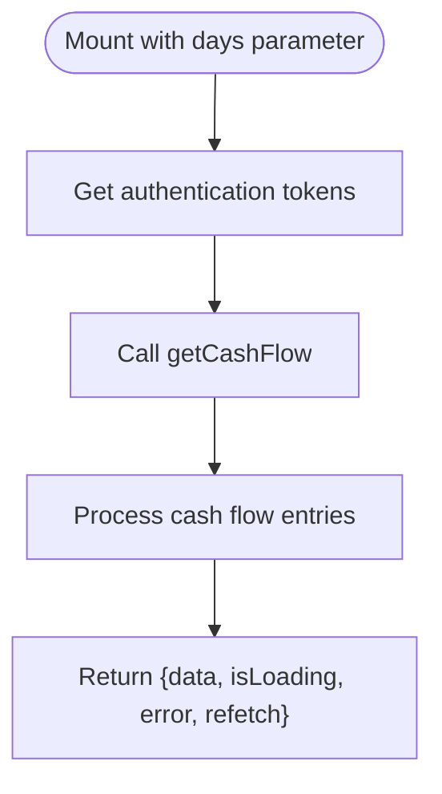

**Diagram sources**
- [use-finance-cashflow.ts:18-69](file://src/hooks/use-finance-cashflow.ts#L18-L69)
- [api.ts:1796-1805](file://src/lib/api.ts#L1796-L1805)

**Section sources**
- [use-finance-cashflow.ts:18-69](file://src/hooks/use-finance-cashflow.ts#L18-L69)
- [api.ts:1796-1805](file://src/lib/api.ts#L1796-L1805)

### Settlement Reconciliation Hook: useSettlementReconciliation
- Reconciles individual payout settlements with expected amounts
- Identifies discrepancies between calculated and actual payouts
- Provides detailed order-level breakdown for settlement analysis
- Supports dispute resolution through detailed reconciliation data

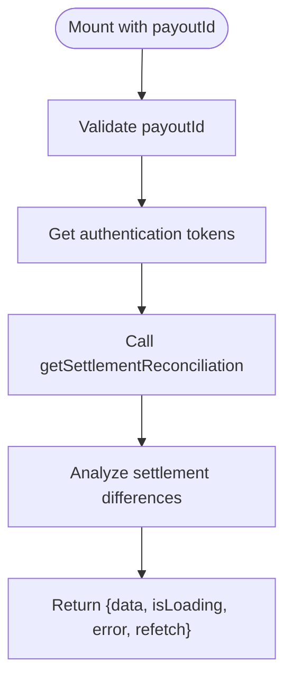

**Diagram sources**
- [use-finance-settlement.ts:18-73](file://src/hooks/use-finance-settlement.ts#L18-L73)
- [api.ts:1807-1816](file://src/lib/api.ts#L1807-L1816)

**Section sources**
- [use-finance-settlement.ts:18-73](file://src/hooks/use-finance-settlement.ts#L18-L73)
- [api.ts:1807-1816](file://src/lib/api.ts#L1807-L1816)

## Expense Management Hook

### Expense CRUD Hook: useExpenses
- Provides complete CRUD operations for product expense management
- Implements optimistic UI updates for immediate feedback without waiting for server response
- Supports platform-specific filtering (Daraz, Shopify, All) and SKU-based filtering
- Integrates with authentication system for secure expense operations
- Returns structured expense data with loading states and error handling

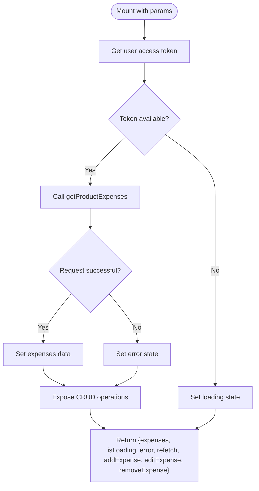

**Diagram sources**
- [use-expenses.ts:30-100](file://src/hooks/use-expenses.ts#L30-L100)
- [api.ts:1852-1912](file://src/lib/api.ts#L1852-L1912)

**Section sources**
- [use-expenses.ts:30-100](file://src/hooks/use-expenses.ts#L30-L100)
- [api.ts:1852-1912](file://src/lib/api.ts#L1852-L1912)

### Expense List Component: ExpensesScreen
- Displays filtered expense list with platform-specific views
- Shows total expense calculations and platform filtering options
- Integrates with product catalogs for image display and SKU lookup
- Provides delete functionality with confirmation dialogs
- Uses finance kit components for consistent styling and empty states

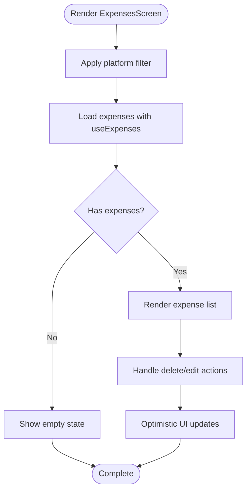

**Diagram sources**
- [expenses.tsx:26-194](file://src/app/(app)/expenses.tsx#L26-L194)
- [use-expenses.ts:30-100](file://src/hooks/use-expenses.ts#L30-L100)

**Section sources**
- [expenses.tsx:26-194](file://src/app/(app)/expenses.tsx#L26-L194)
- [use-expenses.ts:30-100](file://src/hooks/use-expenses.ts#L30-L100)

### Expense Form Component: ExpenseFormScreen
- Provides comprehensive form for creating and editing expenses
- Includes product picker modal with search functionality
- Supports platform-specific product selection (Daraz/Shopify)
- Implements form validation with field-level error handling
- Integrates with product catalogs for real-time product availability

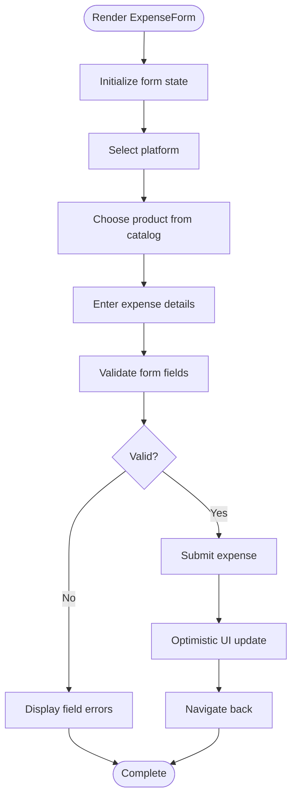

**Diagram sources**
- [expense-form.tsx:34-435](file://src/app/(app)/expense-form.tsx#L34-L435)
- [use-expenses.ts:30-100](file://src/hooks/use-expenses.ts#L30-L100)

**Section sources**
- [expense-form.tsx:34-435](file://src/app/(app)/expense-form.tsx#L34-L435)
- [use-expenses.ts:30-100](file://src/hooks/use-expenses.ts#L30-L100)

## Keyword Analysis Hook

### Advanced Keyword Analysis Hook: useKeywordAnalysis
- Implements sophisticated nine-stage AI-powered keyword analysis pipeline with real-time progress tracking
- Uses Server-Sent Events (SSE) streaming for continuous progress updates during long-running analysis (30-90 seconds)
- Integrates with both user authentication and Daraz marketplace access tokens for comprehensive analysis
- Provides granular progress tracking through incremental state updates for each pipeline stage
- Features robust error handling with retry capabilities and optimistic UI states
- Returns structured analysis results including winning keywords, competitor analysis, and seed keywords

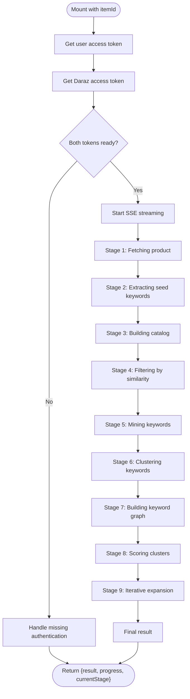

**Diagram sources**
- [use-keyword-analysis.ts:63-182](file://src/hooks/use-keyword-analysis.ts#L63-L182)
- [keyword-analysis-kit.tsx:19-29](file://src/components/keyword-analysis-kit.tsx#L19-L29)
- [api.ts:2197-2230](file://src/lib/api.ts#L2197-L2230)

**Section sources**
- [use-keyword-analysis.ts:63-182](file://src/hooks/use-keyword-analysis.ts#L63-L182)
- [keyword-analysis-kit.tsx:19-29](file://src/components/keyword-analysis-kit.tsx#L19-L29)
- [api.ts:2197-2230](file://src/lib/api.ts#L2197-L2230)

### Keyword Analysis Pipeline Stages
The nine-stage analysis pipeline processes keyword intelligence through sophisticated AI algorithms:

1. **Fetching Product**: Retrieves user's product information and metadata
2. **Extracting Seed Keywords**: Identifies initial keyword candidates from product data
3. **Building Catalog**: Scans competitor products to build comprehensive market catalog
4. **Filtering by Similarity**: Filters relevant products based on similarity algorithms
5. **Mining Keywords**: Discovers high-value keyword opportunities through advanced mining
6. **Clustering Keywords**: Groups related keywords into semantic clusters
7. **Building Keyword Graph**: Creates network graph showing keyword relationships
8. **Scoring Clusters**: Ranks keyword clusters based on competitive advantage
9. **Iterative Expansion**: Expands search through iterative refinement cycles

### Keyword Analysis Progress Tracking
- Real-time progress updates through SSE streaming events
- Incremental state updates for each pipeline stage completion
- Visual progress indicators with stage-specific summaries
- Robust error handling with retry mechanisms
- Optimistic UI updates for seamless user experience

### Keyword Analysis Results
- **Winning Keywords**: Top-performing keywords with scoring metrics
- **Competitor Analysis**: Repeat competitor products with appearance counts
- **Seed Keywords**: Initial keyword seeds used in analysis
- **Market Intelligence**: Catalog size, relevant products, and iteration metrics

**Section sources**
- [use-keyword-analysis.ts:63-182](file://src/hooks/use-keyword-analysis.ts#L63-L182)
- [keyword-analysis.tsx:35-307](file://src/app/(app)/keyword-analysis.tsx#L35-L307)
- [keyword-analysis-kit.tsx:19-512](file://src/components/keyword-analysis-kit.tsx#L19-L512)
- [api.ts:2160-2230](file://src/lib/api.ts#L2160-L2230)

## Dependency Analysis
- Theming depends on use-color-scheme and theme constants.
- Data hooks depend on use-auth for tokens and lib/api for network calls.
- Marketplace product hooks depend on their respective token resolvers and the API layer.
- Catalog search depends on auth and API, with local deduplication and pagination logic.
- Finance Module: All finance hooks depend on both user authentication and Daraz marketplace tokens, with specialized API endpoints for financial data.
- **Expense Management**: The use-expenses hook depends on user authentication and provides direct API integration for expense operations with optimistic UI updates.
- **Keyword Analysis**: The use-keyword-analysis hook requires both user authentication and Daraz marketplace tokens, with sophisticated SSE streaming for real-time progress tracking.

```mermaid
graph LR
useTheme["use-theme.ts"] --> useColor["use-color-scheme.*"]
useTheme --> themeConst["constants/theme.ts"]
useCatalog["use-catalog-search.ts"] --> useAuth["use-auth.tsx"]
useCatalog --> api["lib/api.ts"]
useProducts["use-products.ts"] --> useAuth
useProducts --> api
useProduct["use-product.ts"] --> useAuth
useProduct --> api
darazTok["use-daraz-access-token.ts"] --> api
shopTok["use-shopify-access-token.ts"] --> api
darazProd["use-daraz-products.ts"] --> darazTok
darazProd --> api
shopProd["use-shopify-products.ts"] --> shopTok
shopProd --> api
useFinanceDash["use-finance-dashboard.ts"] --> useAuth
useFinanceDash --> darazTok
useFinanceDash --> api
useFinanceTrans["use-finance-transactions.ts"] --> useAuth
useFinanceTrans --> darazTok
useFinanceTrans --> api
useFinancePayouts["use-finance-payouts.ts"] --> useAuth
useFinancePayouts --> darazTok
useFinancePayouts --> api
useFinanceFees["use-finance-fees.ts"] --> useAuth
useFinanceFees --> darazTok
useFinanceFees --> api
useFinanceProfit["use-finance-profit.ts"] --> useAuth
useFinanceProfit --> darazTok
useFinanceProfit --> api
useFinanceCashflow["use-finance-cashflow.ts"] --> useAuth
useFinanceCashflow --> darazTok
useFinanceCashflow --> api
useFinanceSettlement["use-finance-settlement.ts"] --> useAuth
useFinanceSettlement --> darazTok
useFinanceSettlement --> api
useExpenses["use-expenses.ts"] --> useAuth
useExpenses --> api
expensesScreen["expenses.tsx"] --> useExpenses
expenseForm["expense-form.tsx"] --> useExpenses
useKeywordAnalysis["use-keyword-analysis.ts"] --> useAuth
useKeywordAnalysis --> darazTok
useKeywordAnalysis --> api
keywordAnalysisScreen["keyword-analysis.tsx"] --> useKeywordAnalysis
keywordAnalysisKit["keyword-analysis-kit.tsx"] --> useKeywordAnalysis
```

**Diagram sources**
- [use-theme.ts:9-14](file://src/hooks/use-theme.ts#L9-L14)
- [use-color-scheme.ts:1-2](file://src/hooks/use-color-scheme.ts#L1-L2)
- [use-color-scheme.web.ts:7-21](file://src/hooks/use-color-scheme.web.ts#L7-L21)
- [theme.ts:117-141](file://src/constants/theme.ts#L117-L141)
- [use-catalog-search.ts:38-149](file://src/hooks/use-catalog-search.ts#L38-L149)
- [use-auth.tsx:31-88](file://src/hooks/use-auth.tsx#L31-L88)
- [use-products.ts:16-57](file://src/hooks/use-products.ts#L16-L57)
- [use-product.ts:16-51](file://src/hooks/use-product.ts#L16-L51)
- [use-daraz-access-token.ts:19-65](file://src/hooks/use-daraz-access-token.ts#L19-L65)
- [use-shopify-access-token.ts:6-30](file://src/hooks/use-shopify-access-token.ts#L6-L30)
- [use-daraz-products.ts:120-183](file://src/hooks/use-daraz-products.ts#L120-L183)
- [use-shopify-products.ts:27-49](file://src/hooks/use-shopify-products.ts#L27-L49)
- [use-finance-dashboard.ts:18-75](file://src/hooks/use-finance-dashboard.ts#L18-L75)
- [use-finance-transactions.ts:25-85](file://src/hooks/use-finance-transactions.ts#L25-L85)
- [use-finance-payouts.ts:23-77](file://src/hooks/use-finance-payouts.ts#L23-L77)
- [use-finance-fees.ts:23-77](file://src/hooks/use-finance-fees.ts#L23-L77)
- [use-finance-profit.ts:23-77](file://src/hooks/use-finance-profit.ts#L23-L77)
- [use-finance-cashflow.ts:18-69](file://src/hooks/use-finance-cashflow.ts#L18-L69)
- [use-finance-settlement.ts:18-73](file://src/hooks/use-finance-settlement.ts#L18-L73)
- [use-expenses.ts:30-100](file://src/hooks/use-expenses.ts#L30-L100)
- [use-keyword-analysis.ts:63-182](file://src/hooks/use-keyword-analysis.ts#L63-L182)
- [expenses.tsx:26-194](file://src/app/(app)/expenses.tsx#L26-L194)
- [expense-form.tsx:34-435](file://src/app/(app)/expense-form.tsx#L34-L435)
- [keyword-analysis.tsx:35-307](file://src/app/(app)/keyword-analysis.tsx#L35-L307)
- [keyword-analysis-kit.tsx:19-512](file://src/components/keyword-analysis-kit.tsx#L19-L512)
- [api.ts:53-77](file://src/lib/api.ts#L53-L77)

**Section sources**
- [use-theme.ts:9-14](file://src/hooks/use-theme.ts#L9-L14)
- [use-catalog-search.ts:38-149](file://src/hooks/use-catalog-search.ts#L38-L149)
- [use-auth.tsx:31-88](file://src/hooks/use-auth.tsx#L31-L88)
- [use-products.ts:16-57](file://src/hooks/use-products.ts#L16-L57)
- [use-product.ts:16-51](file://src/hooks/use-product.ts#L16-L51)
- [use-daraz-access-token.ts:19-65](file://src/hooks/use-daraz-access-token.ts#L19-L65)
- [use-shopify-access-token.ts:6-30](file://src/hooks/use-shopify-access-token.ts#L6-L30)
- [use-daraz-products.ts:120-183](file://src/hooks/use-daraz-products.ts#L120-L183)
- [use-shopify-products.ts:27-49](file://src/hooks/use-shopify-products.ts#L27-L49)
- [use-finance-dashboard.ts:18-75](file://src/hooks/use-finance-dashboard.ts#L18-L75)
- [use-finance-transactions.ts:25-85](file://src/hooks/use-finance-transactions.ts#L25-L85)
- [use-finance-payouts.ts:23-77](file://src/hooks/use-finance-payouts.ts#L23-L77)
- [use-finance-fees.ts:23-77](file://src/hooks/use-finance-fees.ts#L23-L77)
- [use-finance-profit.ts:23-77](file://src/hooks/use-finance-profit.ts#L23-L77)
- [use-finance-cashflow.ts:18-69](file://src/hooks/use-finance-cashflow.ts#L18-L69)
- [use-finance-settlement.ts:18-73](file://src/hooks/use-finance-settlement.ts#L18-L73)
- [use-expenses.ts:30-100](file://src/hooks/use-expenses.ts#L30-L100)
- [use-keyword-analysis.ts:63-182](file://src/hooks/use-keyword-analysis.ts#L63-L182)
- [expenses.tsx:26-194](file://src/app/(app)/expenses.tsx#L26-L194)
- [expense-form.tsx:34-435](file://src/app/(app)/expense-form.tsx#L34-L435)
- [keyword-analysis.tsx:35-307](file://src/app/(app)/keyword-analysis.tsx#L35-L307)
- [keyword-analysis-kit.tsx:19-512](file://src/components/keyword-analysis-kit.tsx#L19-L512)
- [api.ts:53-77](file://src/lib/api.ts#L53-L77)

## Performance Considerations
- Avoid redundant requests:
  - Data hooks wait for accessToken before firing requests.
  - Marketplace product hooks gate on token resolution completion.
  - Finance hooks implement dual token validation before making financial API calls.
  - **Expense hook** implements efficient filtering and caching for expense lists.
  - **Keyword analysis hook** uses request key deduplication to prevent duplicate analyses.
- Prevent race conditions:
  - use-catalog-search uses requestId refs to ignore stale responses.
  - Data hooks use cancellation flags to prevent state updates after unmount.
  - Finance hooks use cancellation patterns specific to financial data consistency.
  - **Expense hook** uses optimistic updates to prevent UI flickering during mutations.
  - **Keyword analysis hook** implements proper cleanup with cancelled flags for SSE streams.
- Minimize re-renders:
  - Memoize derived values (e.g., suggested prompts) where applicable.
  - Keep stable callbacks for refetch to avoid unnecessary effect triggers.
  - Finance components provide optimized chart rendering with memoization.
  - **Expense components** use useMemo for expensive calculations like total amounts and product image lookups.
  - **Keyword analysis components** use useMemo for computed values like completed stage indices and max scores.
- Respect accessibility:
  - use-stagger skips animations when reduced motion is enabled.
- **Finance-specific optimizations**:
  - Efficient date range calculations for financial periods
  - Optimized data transformation for large financial datasets
  - Memory-efficient chart data processing
- **Expense-specific optimizations**:
  - Optimistic UI updates for immediate user feedback
  - Efficient product image mapping from multiple marketplaces
  - Platform-specific filtering without full re-fetching
- **Keyword analysis-specific optimizations**:
  - SSE streaming for real-time progress without polling
  - Incremental state updates for smooth UI transitions
  - Efficient progress calculation and stage detection
  - Memory management for long-running analysis processes

## Troubleshooting Guide
Common issues and how they are handled:
- Network failures:
  - The API layer throws ApiError with human-readable messages extracted from backend error bodies.
- Unauthenticated requests:
  - Data hooks check for accessToken before calling APIs; if missing, they remain in loading state without firing requests.
  - Finance hooks validate both user and marketplace tokens before financial API calls.
  - **Expense hook** validates authentication before any expense operations.
  - **Keyword analysis hook** validates both user and Daraz tokens before starting analysis.
- Stale updates:
  - Request IDs and cancellation flags ensure old responses do not overwrite newer state.
- Missing marketplace connection:
  - Token resolver hooks set isConnected to false and clear products when no connection is found.
  - Finance hooks handle missing Daraz connections gracefully with appropriate error states.
- Web hydration mismatch:
  - use-color-scheme.web delays returning the scheme until after hydration to avoid flash of wrong theme.
- **Finance-specific issues**:
  - Date range validation for financial periods
  - Currency conversion and formatting issues
  - Large dataset handling for financial reports
  - Settlement discrepancy detection and reporting
- **Expense-specific issues**:
  - Product selection validation and platform compatibility
  - Form validation for expense amounts and categories
  - Image loading and fallback handling for products
  - Optimistic update rollback on API failures
- **Keyword analysis-specific issues**:
  - SSE connection failures and retry mechanisms
  - Long-running process timeout handling
  - Progress tracking state synchronization
  - Token refresh during extended analysis sessions
  - Memory management for large analysis datasets

**Section sources**
- [api.ts:5-13](file://src/lib/api.ts#L5-L13)
- [api.ts:53-77](file://src/lib/api.ts#L53-L77)
- [use-products.ts:25-54](file://src/hooks/use-products.ts#L25-L54)
- [use-product.ts:25-48](file://src/hooks/use-product.ts#L25-L48)
- [use-catalog-search.ts:59-100](file://src/hooks/use-catalog-search.ts#L59-L100)
- [use-daraz-products.ts:139-180](file://src/hooks/use-daraz-products.ts#L139-L180)
- [use-shopify-products.ts:36-46](file://src/hooks/use-shopify-products.ts#L36-L46)
- [use-color-scheme.web.ts:7-21](file://src/hooks/use-color-scheme.web.ts#L7-L21)
- [use-finance-dashboard.ts:56-67](file://src/hooks/use-finance-dashboard.ts#L56-L67)
- [use-finance-transactions.ts:65-76](file://src/hooks/use-finance-transactions.ts#L65-L76)
- [use-finance-payouts.ts:61-70](file://src/hooks/use-finance-payouts.ts#L61-L70)
- [use-finance-fees.ts:61-70](file://src/hooks/use-finance-fees.ts#L61-L70)
- [use-finance-profit.ts:61-70](file://src/hooks/use-finance-profit.ts#L61-L70)
- [use-finance-cashflow.ts:54-63](file://src/hooks/use-finance-cashflow.ts#L54-L63)
- [use-finance-settlement.ts:56-67](file://src/hooks/use-finance-settlement.ts#L56-L67)
- [use-expenses.ts:68-97](file://src/hooks/use-expenses.ts#L68-L97)
- [use-keyword-analysis.ts:151-171](file://src/hooks/use-keyword-analysis.ts#L151-L171)
- [expense-form.tsx:135-172](file://src/app/(app)/expense-form.tsx#L135-L172)

## Conclusion
The application employs a consistent, testable pattern for custom hooks:
- Separate concerns: theming, utilities, auth, data fetching, and marketplace integration.
- Centralize networking and error handling in lib/api.
- Gate requests on authentication and connection readiness.
- Provide predictable state shapes with isLoading, error, and refetch for all data hooks.
- Enhanced with comprehensive finance module: Seven specialized hooks providing complete financial data management for Daraz marketplace integration, including dashboard analytics, transaction tracking, payout management, fee analysis, profit monitoring, cash flow tracking, and settlement reconciliation.
- **Added expense management**: Dedicated hook providing full CRUD operations for product expenses with optimistic UI updates, platform filtering, and seamless integration with product catalogs.
- **Added keyword analysis**: Sophisticated nine-stage AI-powered keyword analysis hook implementing real-time progress tracking through SSE streaming, comprehensive error handling, and advanced result visualization for competitive market intelligence.
This structure makes it straightforward to add new features, test hooks in isolation, and maintain reliable UX across platforms.

## Appendices

### Creating a New Custom Hook: Guidelines
Follow these steps to create a new hook aligned with existing patterns:
- Inputs and options:
  - Accept parameters that affect behavior (e.g., ids, filters, enabled flag).
  - For finance hooks: Include date ranges, pagination parameters, and financial period specifications.
  - **For expense-like hooks**: Include filtering parameters and optimistic update options.
  - **For streaming hooks**: Include progress tracking options and event handler configurations.
- Dependencies:
  - Use use-auth for tokens when calling protected endpoints.
  - Use marketplace token resolvers if integrating with Daraz/Shopify.
  - For finance hooks: Combine user authentication with marketplace-specific tokens.
  - **For expense-like hooks**: Use direct authentication without marketplace tokens.
  - **For streaming hooks**: Implement proper cleanup and cancellation handling.
- State shape:
  - Include data, isLoading, error, and refetch. For lists, include pagination fields as needed.
  - For finance hooks: Include financial metrics, date ranges, and currency formatting.
  - **For expense-like hooks**: Include optimistic update state and mutation functions.
  - **For streaming hooks**: Include progress tracking state, current stage, and streaming indicators.
- Effects:
  - Guard effects on required inputs (e.g., accessToken).
  - Use cancellation flags to avoid state updates after unmount.
  - For finance hooks: Implement financial data validation and currency conversion.
  - **For expense-like hooks**: Implement optimistic UI updates with rollback on failure.
  - **For streaming hooks**: Implement proper SSE connection management and error recovery.
- API calls:
  - Call functions from lib/api and handle ApiError consistently.
  - For finance hooks: Use specialized financial API endpoints with proper authentication headers.
  - **For expense-like hooks**: Use standard REST endpoints with optimistic updates.
  - **For streaming hooks**: Use SSE endpoints with proper event handlers and cleanup.
- Cleanup:
  - Close resources (e.g., sockets) in effect cleanup.
  - **For streaming hooks**: Ensure proper disconnection and memory cleanup.
- Testing:
  - Mock use-auth and lib/api functions.
  - Assert state transitions for loading, success, and error paths.
  - For async flows, advance timers or await promises in tests.
  - For finance hooks: Test financial calculations, date range handling, and currency formatting.
  - **For expense-like hooks**: Test optimistic updates, form validation, and error handling.
  - **For streaming hooks**: Test SSE event handling, progress tracking, and cleanup scenarios.

### Example: Building a Paginated List Hook
Conceptual flow for a new list hook:
```mermaid
flowchart TD
Start(["Mount with options"]) --> Guard{"enabled && required inputs?"}
Guard -- No --> Idle["Set empty state, return"]
Guard -- Yes --> Load["setLoading(true), setError(null)"]
Load --> Fetch["call API with page/token"]
Fetch --> Success{"ok?"}
Success -- No --> Err["setError(ApiError.message), setLoading(false)"]
Success -- Yes --> Update["setState(data), setLoading(false)"]
Err --> Return(["Expose {data, isLoading, error, refetch}"])
Update --> Return
Idle --> Return
```

### Expense Hook Implementation Pattern
All expense-related hooks follow a consistent pattern for managing product expenses:

```mermaid
flowchart TD
Start(["Expense Hook Mount"]) --> GetAuth["Get user access token"]
GetAuth --> Validate{"Token valid?"}
Validate -- No --> HandleMissing["Handle missing authentication"]
Validate -- Yes --> FetchData["Call expense API"]
FetchData --> ProcessData["Process expense data"]
ProcessData --> SetState["Set state with data"]
SetState --> Mutations["Expose CRUD operations"]
Mutations --> Return["Return hook interface"]
HandleMissing --> Return
```

**Diagram sources**
- [use-expenses.ts:30-100](file://src/hooks/use-expenses.ts#L30-L100)
- [api.ts:1852-1912](file://src/lib/api.ts#L1852-L1912)

### Keyword Analysis Hook Implementation Pattern
The keyword analysis hook implements a sophisticated nine-stage pipeline with real-time progress tracking:

```mermaid
flowchart TD
Start(["Keyword Analysis Hook Mount"]) --> GetAuth["Get user access token"]
GetAuth --> GetDaraz["Get Daraz access token"]
GetDaraz --> Validate{"Both tokens valid?"}
Validate -- No --> HandleMissing["Handle missing authentication"]
Validate -- Yes --> StartSSE["Start SSE streaming"]
StartSSE --> Pipeline["Execute nine-stage pipeline"]
Pipeline --> Progress["Track real-time progress"]
Progress --> Result["Receive final result"]
Result --> Cleanup["Cleanup resources"]
Cleanup --> Return["Return {result, progress, currentStage}"]
HandleMissing --> Return
```

**Diagram sources**
- [use-keyword-analysis.ts:63-182](file://src/hooks/use-keyword-analysis.ts#L63-L182)
- [api.ts:2197-2230](file://src/lib/api.ts#L2197-L2230)

### Component Integration Examples
The hooks integrate with specialized components for displaying and managing data:

- **Expense Components**: FlatList with platform filtering, total calculations, and delete confirmations
- **Expense Form Components**: Comprehensive forms with product picker, validation, and optimistic updates
- **Keyword Analysis Components**: Advanced stepper with nine-stage progress tracking, real-time updates, and comprehensive result visualization
- **Product Integration**: Seamless integration with marketplace product catalogs for image display and SKU lookup
- **Error States**: Consistent error handling with retry functionality and field-level validation
- **Loading States**: Optimized loading indicators for both list and form operations

**Section sources**
- [expenses.tsx:26-194](file://src/app/(app)/expenses.tsx#L26-L194)
- [expense-form.tsx:34-435](file://src/app/(app)/expense-form.tsx#L34-L435)
- [use-expenses.ts:30-100](file://src/hooks/use-expenses.ts#L30-L100)
- [keyword-analysis.tsx:35-307](file://src/app/(app)/keyword-analysis.tsx#L35-L307)
- [keyword-analysis-kit.tsx:19-512](file://src/components/keyword-analysis-kit.tsx#L19-L512)
- [use-keyword-analysis.ts:63-182](file://src/hooks/use-keyword-analysis.ts#L63-L182)