# Hooks & State Management

<cite>
**Referenced Files in This Document**
- [use-theme.ts](file://src/hooks/use-theme.ts)
- [use-color-scheme.ts](file://src/hooks/use-color-scheme.ts)
- [use-color-scheme.web.ts](file://src/hooks/use-color-scheme.web.ts)
- [theme.ts](file://src/constants/theme.ts)
- [use-stagger.ts](file://src/hooks/use-stagger.ts)
- [use-catalog-search.ts](file://src/hooks/use-catalog-search.ts)
- [use-auth.tsx](file://src/hooks/use-auth.tsx)
- [use-products.ts](file://src/hooks/use-products.ts)
- [use-product.ts](file://src/hooks/use-product.ts)
- [use-daraz-access-token.ts](file://src/hooks/use-daraz-access-token.ts)
- [use-shopify-access-token.ts](file://src/hooks/use-shopify-access-token.ts)
- [use-daraz-products.ts](file://src/hooks/use-daraz-products.ts)
- [use-shopify-products.ts](file://src/hooks/use-shopify-products.ts)
- [use-finance-dashboard.ts](file://src/hooks/use-finance-dashboard.ts)
- [use-finance-transactions.ts](file://src/hooks/use-finance-transactions.ts)
- [use-finance-payouts.ts](file://src/hooks/use-finance-payouts.ts)
- [use-finance-fees.ts](file://src/hooks/use-finance-fees.ts)
- [use-finance-profit.ts](file://src/hooks/use-finance-profit.ts)
- [use-finance-cashflow.ts](file://src/hooks/use-finance-cashflow.ts)
- [use-finance-settlement.ts](file://src/hooks/use-finance-settlement.ts)
- [finance-kit.tsx](file://src/components/finance-kit.tsx)
- [finance-charts.tsx](file://src/components/finance-charts.tsx)
- [api.ts](file://src/lib/api.ts)
</cite>

## Update Summary
**Changes Made**
- Added comprehensive documentation for seven new finance-specific hooks
- Updated architecture overview to include finance module integration
- Enhanced data fetching patterns section with finance examples
- Added finance-specific state management patterns and error handling
- Included finance component integration examples

## Table of Contents
1. Introduction
2. Project Structure
3. Core Components
4. Architecture Overview
5. Detailed Component Analysis
6. Finance Module Hooks
7. Dependency Analysis
8. Performance Considerations
9. Troubleshooting Guide
10. Conclusion
11. Appendices

## Introduction
This document explains the custom hooks and state management patterns used across the application, with a focus on:
- Theme management (light/dark mode) via use-theme and use-color-scheme
- Utility hooks for animations (use-stagger) and search (use-catalog-search)
- A consistent data fetching pattern for API interactions
- **New**: Comprehensive finance module hooks for Daraz marketplace financial data
- State synchronization strategies and performance optimizations
- Error handling and loading states
- Guidance for creating new custom hooks, testing them, and debugging state issues

## Project Structure
The hooks live under src/hooks and are organized by feature or concern:
- Theming: use-theme, use-color-scheme (platform-specific), theme constants
- Utilities: use-stagger for animation timing
- Data fetching: use-auth, use-products, use-product, marketplace token resolvers, platform product fetchers, catalog search
- **Finance Module**: Seven specialized hooks for financial dashboard, transactions, payouts, fees, profit analytics, cash flow, and settlement reconciliation
- API layer: centralized request helpers, error types, streaming support

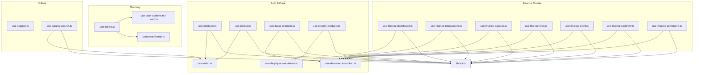

**Diagram sources**
- [use-theme.ts:9-14](file://src/hooks/use-theme.ts#L9-L14)
- [use-color-scheme.ts:1-2](file://src/hooks/use-color-scheme.ts#L1-L2)
- [use-color-scheme.web.ts:7-21](file://src/hooks/use-color-scheme.web.ts#L7-L21)
- [theme.ts:117-141](file://src/constants/theme.ts#L117-L141)
- [use-stagger.ts:9-13](file://src/hooks/use-stagger.ts#L9-L13)
- [use-catalog-search.ts:38-149](file://src/hooks/use-catalog-search.ts#L38-L149)
- [use-auth.tsx:31-88](file://src/hooks/use-auth.tsx#L31-L88)
- [use-products.ts:16-57](file://src/hooks/use-products.ts#L16-L57)
- [use-product.ts:16-51](file://src/hooks/use-product.ts#L16-L51)
- [use-daraz-access-token.ts:19-65](file://src/hooks/use-daraz-access-token.ts#L19-L65)
- [use-shopify-access-token.ts:6-30](file://src/hooks/use-shopify-access-token.ts#L6-L30)
- [use-daraz-products.ts:120-183](file://src/hooks/use-daraz-products.ts#L120-L183)
- [use-shopify-products.ts:27-49](file://src/hooks/use-shopify-products.ts#L27-L49)
- [use-finance-dashboard.ts:18-75](file://src/hooks/use-finance-dashboard.ts#L18-L75)
- [use-finance-transactions.ts:25-85](file://src/hooks/use-finance-transactions.ts#L25-L85)
- [use-finance-payouts.ts:23-77](file://src/hooks/use-finance-payouts.ts#L23-L77)
- [use-finance-fees.ts:23-77](file://src/hooks/use-finance-fees.ts#L23-L77)
- [use-finance-profit.ts:23-77](file://src/hooks/use-finance-profit.ts#L23-L77)
- [use-finance-cashflow.ts:18-69](file://src/hooks/use-finance-cashflow.ts#L18-L69)
- [use-finance-settlement.ts:18-73](file://src/hooks/use-finance-settlement.ts#L18-L73)
- [api.ts:53-77](file://src/lib/api.ts#L53-L77)

**Section sources**
- [use-theme.ts:9-14](file://src/hooks/use-theme.ts#L9-L14)
- [use-color-scheme.ts:1-2](file://src/hooks/use-color-scheme.ts#L1-L2)
- [use-color-scheme.web.ts:7-21](file://src/hooks/use-color-scheme.web.ts#L7-L21)
- [theme.ts:117-141](file://src/constants/theme.ts#L117-L141)
- [use-stagger.ts:9-13](file://src/hooks/use-stagger.ts#L9-L13)
- [use-catalog-search.ts:38-149](file://src/hooks/use-catalog-search.ts#L38-L149)
- [use-auth.tsx:31-88](file://src/hooks/use-auth.tsx#L31-L88)
- [use-products.ts:16-57](file://src/hooks/use-products.ts#L16-L57)
- [use-product.ts:16-51](file://src/hooks/use-product.ts#L16-L51)
- [use-daraz-access-token.ts:19-65](file://src/hooks/use-daraz-access-token.ts#L19-L65)
- [use-shopify-access-token.ts:6-30](file://src/hooks/use-shopify-access-token.ts#L6-L30)
- [use-daraz-products.ts:120-183](file://src/hooks/use-daraz-products.ts#L120-L183)
- [use-shopify-products.ts:27-49](file://src/hooks/use-shopify-products.ts#L27-L49)
- [use-finance-dashboard.ts:18-75](file://src/hooks/use-finance-dashboard.ts#L18-L75)
- [use-finance-transactions.ts:25-85](file://src/hooks/use-finance-transactions.ts#L25-L85)
- [use-finance-payouts.ts:23-77](file://src/hooks/use-finance-payouts.ts#L23-L77)
- [use-finance-fees.ts:23-77](file://src/hooks/use-finance-fees.ts#L23-L77)
- [use-finance-profit.ts:23-77](file://src/hooks/use-finance-profit.ts#L23-L77)
- [use-finance-cashflow.ts:18-69](file://src/hooks/use-finance-cashflow.ts#L18-L69)
- [use-finance-settlement.ts:18-73](file://src/hooks/use-finance-settlement.ts#L18-L73)
- [api.ts:53-77](file://src/lib/api.ts#L53-L77)

## Core Components
- Theme management:
  - use-theme resolves the current color scheme and returns the matching color palette from constants.
  - use-color-scheme delegates to React Native's hook; on web it hydrates safely to avoid SSR mismatch.
- Animation utility:
  - use-stagger provides a function that returns an entrance animation only when reduced motion is not enabled.
- Search:
  - use-catalog-search encapsulates paginated, deduplicated search with loading/error states and refetch/loadMore controls.
- Authentication:
  - AuthProvider manages session and access token persistence and hydration from secure storage.
- Data fetching:
  - use-products and use-product follow a consistent pattern: guard on accessToken, manage isLoading/error, expose refetch.
  - Marketplace token resolvers (Daraz/Shopify) centralize connection checks and expose isConnected/loading/error.
  - Platform product hooks map raw responses into a unified Product shape and de-duplicate items.
- **Finance Module**: Seven specialized hooks providing comprehensive financial data management for Daraz marketplace integration.

**Section sources**
- [use-theme.ts:9-14](file://src/hooks/use-theme.ts#L9-L14)
- [use-color-scheme.web.ts:7-21](file://src/hooks/use-color-scheme.web.ts#L7-L21)
- [use-stagger.ts:9-13](file://src/hooks/use-stagger.ts#L9-L13)
- [use-catalog-search.ts:38-149](file://src/hooks/use-catalog-search.ts#L38-L149)
- [use-auth.tsx:31-88](file://src/hooks/use-auth.tsx#L31-L88)
- [use-products.ts:16-57](file://src/hooks/use-products.ts#L16-L57)
- [use-product.ts:16-51](file://src/hooks/use-product.ts#L16-L51)
- [use-daraz-access-token.ts:19-65](file://src/hooks/use-daraz-access-token.ts#L19-L65)
- [use-shopify-access-token.ts:6-30](file://src/hooks/use-shopify-access-token.ts#L6-L30)
- [use-daraz-products.ts:120-183](file://src/hooks/use-daraz-products.ts#L120-L183)
- [use-shopify-products.ts:27-49](file://src/hooks/use-shopify-products.ts#L27-L49)

## Architecture Overview
The application uses a layered approach:
- UI components consume hooks for theme, animations, and data.
- Hooks depend on a shared authentication context for tokens.
- Data fetching hooks call a centralized API module that handles errors, headers, and streaming where needed.
- Marketplace integrations resolve per-platform tokens before fetching products.
- **Finance Module**: Specialized hooks integrate with Daraz financial APIs using dual authentication (user access token + Daraz access token).

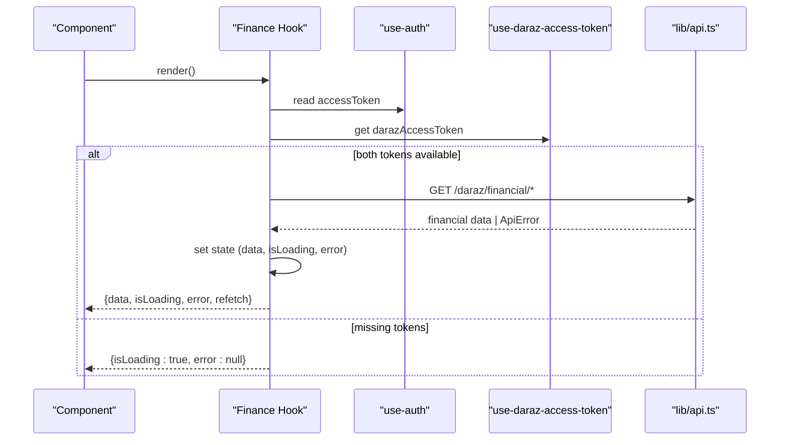

**Diagram sources**
- [use-finance-dashboard.ts:18-75](file://src/hooks/use-finance-dashboard.ts#L18-L75)
- [use-finance-transactions.ts:25-85](file://src/hooks/use-finance-transactions.ts#L25-L85)
- [use-auth.tsx:31-88](file://src/hooks/use-auth.tsx#L31-L88)
- [use-daraz-access-token.ts:19-65](file://src/hooks/use-daraz-access-token.ts#L19-L65)
- [api.ts:1723-1816](file://src/lib/api.ts#L1723-L1816)

## Detailed Component Analysis

### Theme Management: use-theme and use-color-scheme
- use-theme reads the current color scheme and returns the corresponding Colors object (light or dark). It falls back to light if the scheme is unknown.
- use-color-scheme re-exports React Native's hook on native platforms. On web, it ensures client-side hydration before returning the scheme to avoid mismatches during static rendering.

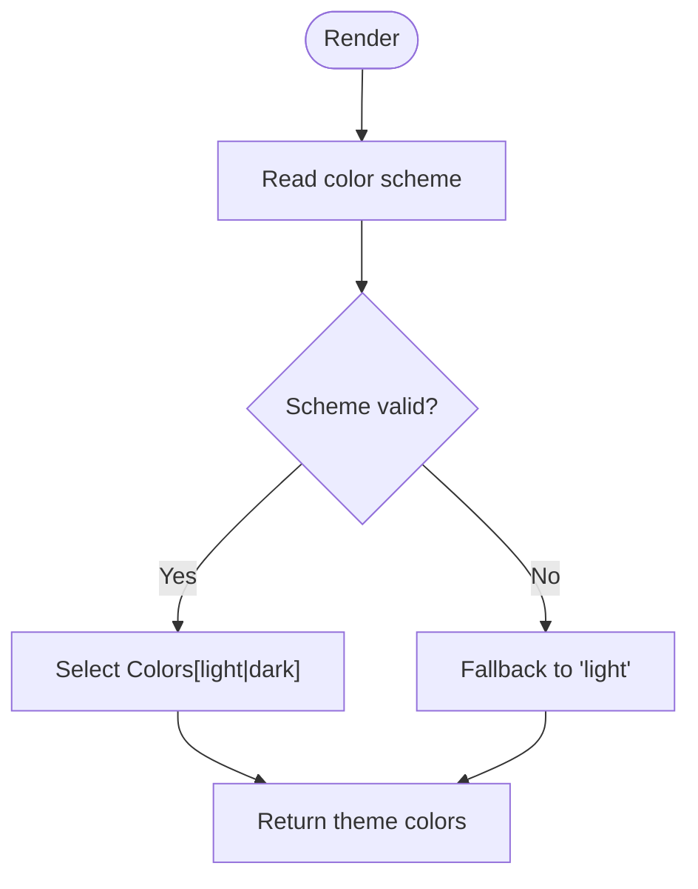

**Diagram sources**
- [use-theme.ts:9-14](file://src/hooks/use-theme.ts#L9-L14)
- [use-color-scheme.ts:1-2](file://src/hooks/use-color-scheme.ts#L1-L2)
- [use-color-scheme.web.ts:7-21](file://src/hooks/use-color-scheme.web.ts#L7-L21)
- [theme.ts:117-141](file://src/constants/theme.ts#L117-L141)

**Section sources**
- [use-theme.ts:9-14](file://src/hooks/use-theme.ts#L9-L14)
- [use-color-scheme.ts:1-2](file://src/hooks/use-color-scheme.ts#L1-L2)
- [use-color-scheme.web.ts:7-21](file://src/hooks/use-color-scheme.web.ts#L7-L21)
- [theme.ts:117-141](file://src/constants/theme.ts#L117-L141)

### Animation Timing: use-stagger
- Provides a factory function that returns an entrance animation based on device accessibility settings. When reduced motion is enabled, it returns undefined to skip animations.

**Diagram sources**
- [use-stagger.ts:9-13](file://src/hooks/use-stagger.ts#L9-L13)

**Section sources**
- [use-stagger.ts:9-13](file://src/hooks/use-stagger.ts#L9-L13)

### Search: use-catalog-search
- Encapsulates paginated search with:
  - Query normalization and enable/disable gating
  - Pagination state (current page, total pages, total products)
  - Deduplication of results by item_id
  - Loading states for initial load vs "load more"
  - Error handling using ApiError messages
  - refetch and loadMore actions

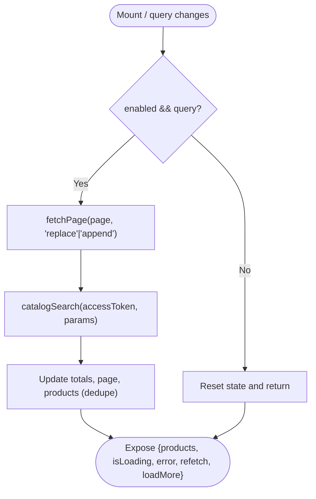

**Diagram sources**
- [use-catalog-search.ts:38-149](file://src/hooks/use-catalog-search.ts#L38-L149)
- [api.ts:53-77](file://src/lib/api.ts#L53-L77)

**Section sources**
- [use-catalog-search.ts:38-149](file://src/hooks/use-catalog-search.ts#L38-L149)

### Authentication: use-auth
- Persists and hydrates an access token from secure storage.
- Exposes session and token values plus sign-in/sign-up/sign-out methods.
- Throws if used outside its provider.

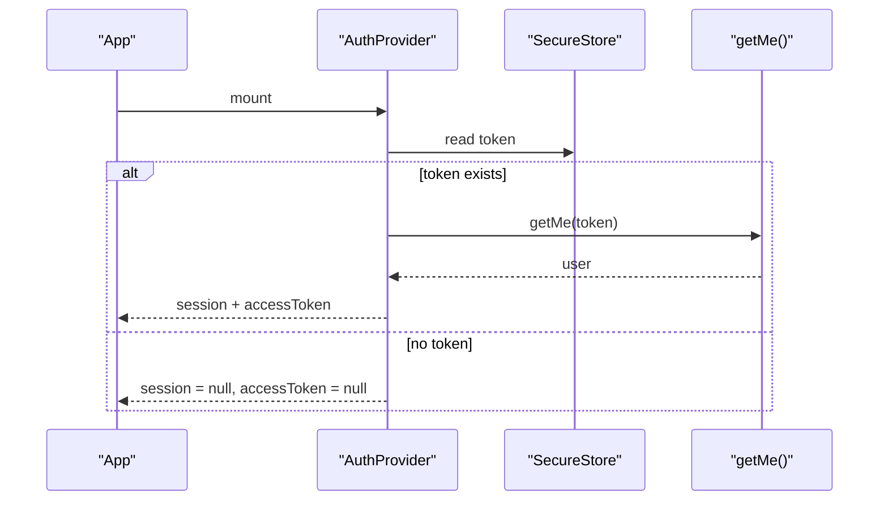

**Diagram sources**
- [use-auth.tsx:31-88](file://src/hooks/use-auth.tsx#L31-L88)
- [api.ts:338-342](file://src/lib/api.ts#L338-L342)

**Section sources**
- [use-auth.tsx:31-88](file://src/hooks/use-auth.tsx#L31-L88)

### Data Fetching Patterns: use-products and use-product
- Both hooks:
  - Wait for accessToken before making requests
  - Manage isLoading, error, and data state
  - Provide refetch via a reloadKey increment
  - Use cancellation flags to prevent state updates after unmount

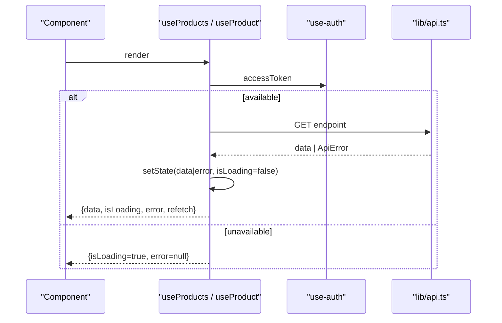

**Diagram sources**
- [use-products.ts:16-57](file://src/hooks/use-products.ts#L16-L57)
- [use-product.ts:16-51](file://src/hooks/use-product.ts#L16-L51)
- [api.ts:53-77](file://src/lib/api.ts#L53-L77)

**Section sources**
- [use-products.ts:16-57](file://src/hooks/use-products.ts#L16-L57)
- [use-product.ts:16-51](file://src/hooks/use-product.ts#L16-L51)

### Marketplace Tokens and Products: Daraz and Shopify
- Token resolvers:
  - use-daraz-access-token and use-shopify-access-token fetch connections and extract encrypted_access_token for the respective platform.
  - They expose isConnected, isLoading, error, and refetch.
- Product hooks:
  - Map raw marketplace responses into a unified Product type.
  - De-duplicate products by id.
  - Compose isLoading and error from both token resolution and product fetching.

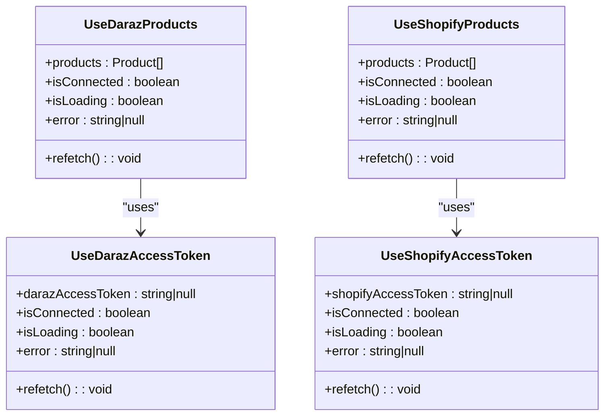

**Diagram sources**
- [use-daraz-access-token.ts:19-65](file://src/hooks/use-daraz-access-token.ts#L19-L65)
- [use-shopify-access-token.ts:6-30](file://src/hooks/use-shopify-access-token.ts#L6-L30)
- [use-daraz-products.ts:120-183](file://src/hooks/use-daraz-products.ts#L120-L183)
- [use-shopify-products.ts:27-49](file://src/hooks/use-shopify-products.ts#L27-L49)

**Section sources**
- [use-daraz-access-token.ts:19-65](file://src/hooks/use-daraz-access-token.ts#L19-L65)
- [use-shopify-access-token.ts:6-30](file://src/hooks/use-shopify-access-token.ts#L6-L30)
- [use-daraz-products.ts:120-183](file://src/hooks/use-daraz-products.ts#L120-L183)
- [use-shopify-products.ts:27-49](file://src/hooks/use-shopify-products.ts#L27-L49)

### API Layer: Centralized Requests and Errors
- request wraps fetch with error extraction and ApiError throwing for non-ok responses.
- Streaming support for server-sent events via XHR on native and ReadableStream on web.
- streamToResult orchestrates SSE streams to produce a final result or error.

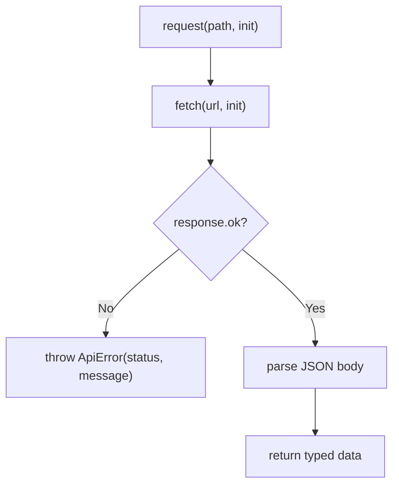

**Diagram sources**
- [api.ts:53-77](file://src/lib/api.ts#L53-L77)
- [api.ts:215-286](file://src/lib/api.ts#L215-L286)

**Section sources**
- [api.ts:53-77](file://src/lib/api.ts#L53-L77)
- [api.ts:215-286](file://src/lib/api.ts#L215-L286)

## Finance Module Hooks

### Financial Dashboard Hook: useFinancialDashboard
- Provides comprehensive financial overview including revenue, payouts, fees, and profit metrics
- Integrates with Daraz financial dashboard API using dual authentication
- Supports configurable date ranges (default 30 days)
- Returns structured dashboard data with fee breakdowns and cash flow trends

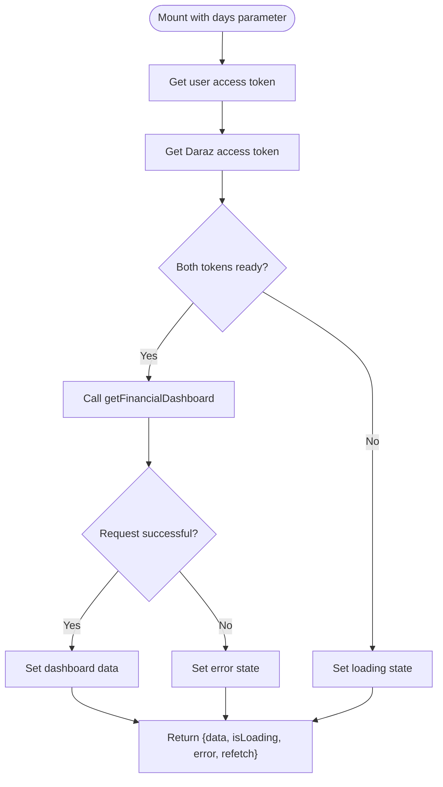

**Diagram sources**
- [use-finance-dashboard.ts:18-75](file://src/hooks/use-finance-dashboard.ts#L18-L75)
- [api.ts:1723-1732](file://src/lib/api.ts#L1723-L1732)

**Section sources**
- [use-finance-dashboard.ts:18-75](file://src/hooks/use-finance-dashboard.ts#L18-L75)
- [api.ts:1723-1732](file://src/lib/api.ts#L1723-L1732)

### Transaction Hook: useFinancialTransactions
- Manages transaction details with pagination support
- Accepts date range parameters (startDate, endDate) and optional pagination
- Returns structured transaction data with detailed order information
- Handles large datasets through page-based loading

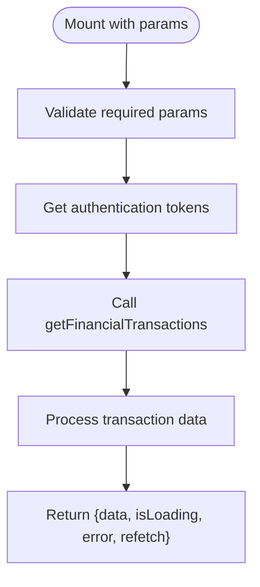

**Diagram sources**
- [use-finance-transactions.ts:25-85](file://src/hooks/use-finance-transactions.ts#L25-L85)
- [api.ts:1734-1749](file://src/lib/api.ts#L1734-L1749)

**Section sources**
- [use-finance-transactions.ts:25-85](file://src/hooks/use-finance-transactions.ts#L25-L85)
- [api.ts:1734-1749](file://src/lib/api.ts#L1734-L1749)

### Payout Analytics Hook: usePayoutAnalytics
- Tracks payout status and amounts across different periods
- Categorizes payouts into paid, upcoming, pending, and failed states
- Provides aggregated financial metrics for payout analysis
- Supports date range filtering for historical analysis

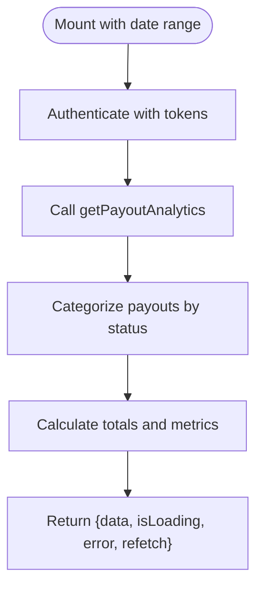

**Diagram sources**
- [use-finance-payouts.ts:23-77](file://src/hooks/use-finance-payouts.ts#L23-L77)
- [api.ts:1751-1764](file://src/lib/api.ts#L1751-L1764)

**Section sources**
- [use-finance-payouts.ts:23-77](file://src/hooks/use-finance-payouts.ts#L23-L77)
- [api.ts:1751-1764](file://src/lib/api.ts#L1751-L1764)

### Fee Breakdown Hook: useFeeBreakdown
- Analyzes fee structure and effective fee rates
- Breaks down commissions, payment fees, shipping fees, and other charges
- Calculates net payout after all deductions
- Provides insights into cost optimization opportunities

**Diagram sources**
- [use-finance-fees.ts:23-77](file://src/hooks/use-finance-fees.ts#L23-L77)
- [api.ts:1766-1779](file://src/lib/api.ts#L1766-L1779)

**Section sources**
- [use-finance-fees.ts:23-77](file://src/hooks/use-finance-fees.ts#L23-L77)
- [api.ts:1766-1779](file://src/lib/api.ts#L1766-L1779)

### Profit Analytics Hook: useProfitAnalytics
- Tracks profitability metrics over specified time periods
- Calculates revenue, costs, and net profit margins
- Provides order count correlation with financial performance
- Enables trend analysis for business decision-making

**Diagram sources**
- [use-finance-profit.ts:23-77](file://src/hooks/use-finance-profit.ts#L23-L77)
- [api.ts:1781-1794](file://src/lib/api.ts#L1781-L1794)

**Section sources**
- [use-finance-profit.ts:23-77](file://src/hooks/use-finance-profit.ts#L23-L77)
- [api.ts:1781-1794](file://src/lib/api.ts#L1781-L1794)

### Cash Flow Hook: useCashFlow
- Monitors daily cash inflows and outflows
- Tracks net cash position over configurable time periods
- Provides visualizable data for cash flow charts
- Supports flexible date range selection (default 30 days)

**Diagram sources**
- [use-finance-cashflow.ts:18-69](file://src/hooks/use-finance-cashflow.ts#L18-L69)
- [api.ts:1796-1805](file://src/lib/api.ts#L1796-L1805)

**Section sources**
- [use-finance-cashflow.ts:18-69](file://src/hooks/use-finance-cashflow.ts#L18-L69)
- [api.ts:1796-1805](file://src/lib/api.ts#L1796-L1805)

### Settlement Reconciliation Hook: useSettlementReconciliation
- Reconciles individual payout settlements with expected amounts
- Identifies discrepancies between calculated and actual payouts
- Provides detailed order-level breakdown for settlement analysis
- Supports dispute resolution through detailed reconciliation data

**Diagram sources**
- [use-finance-settlement.ts:18-73](file://src/hooks/use-finance-settlement.ts#L18-L73)
- [api.ts:1807-1816](file://src/lib/api.ts#L1807-L1816)

**Section sources**
- [use-finance-settlement.ts:18-73](file://src/hooks/use-finance-settlement.ts#L18-L73)
- [api.ts:1807-1816](file://src/lib/api.ts#L1807-L1816)

## Dependency Analysis
- Theming depends on use-color-scheme and theme constants.
- Data hooks depend on use-auth for tokens and lib/api for network calls.
- Marketplace product hooks depend on their respective token resolvers and the API layer.
- Catalog search depends on auth and API, with local deduplication and pagination logic.
- **Finance Module**: All finance hooks depend on both user authentication and Daraz marketplace tokens, with specialized API endpoints for financial data.

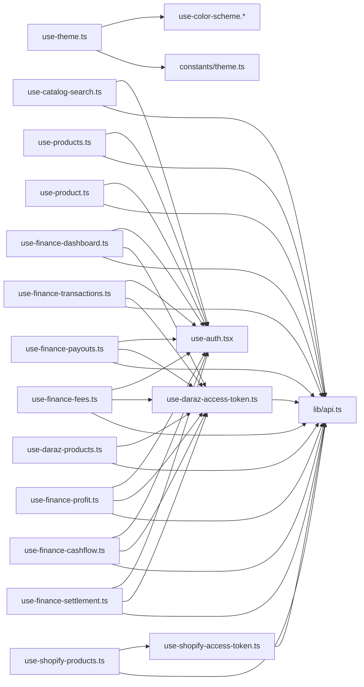

**Diagram sources**
- [use-theme.ts:9-14](file://src/hooks/use-theme.ts#L9-L14)
- [use-color-scheme.ts:1-2](file://src/hooks/use-color-scheme.ts#L1-L2)
- [use-color-scheme.web.ts:7-21](file://src/hooks/use-color-scheme.web.ts#L7-L21)
- [theme.ts:117-141](file://src/constants/theme.ts#L117-L141)
- [use-catalog-search.ts:38-149](file://src/hooks/use-catalog-search.ts#L38-L149)
- [use-auth.tsx:31-88](file://src/hooks/use-auth.tsx#L31-L88)
- [use-products.ts:16-57](file://src/hooks/use-products.ts#L16-L57)
- [use-product.ts:16-51](file://src/hooks/use-product.ts#L16-L51)
- [use-daraz-access-token.ts:19-65](file://src/hooks/use-daraz-access-token.ts#L19-L65)
- [use-shopify-access-token.ts:6-30](file://src/hooks/use-shopify-access-token.ts#L6-L30)
- [use-daraz-products.ts:120-183](file://src/hooks/use-daraz-products.ts#L120-L183)
- [use-shopify-products.ts:27-49](file://src/hooks/use-shopify-products.ts#L27-L49)
- [use-finance-dashboard.ts:18-75](file://src/hooks/use-finance-dashboard.ts#L18-L75)
- [use-finance-transactions.ts:25-85](file://src/hooks/use-finance-transactions.ts#L25-L85)
- [use-finance-payouts.ts:23-77](file://src/hooks/use-finance-payouts.ts#L23-L77)
- [use-finance-fees.ts:23-77](file://src/hooks/use-finance-fees.ts#L23-L77)
- [use-finance-profit.ts:23-77](file://src/hooks/use-finance-profit.ts#L23-L77)
- [use-finance-cashflow.ts:18-69](file://src/hooks/use-finance-cashflow.ts#L18-L69)
- [use-finance-settlement.ts:18-73](file://src/hooks/use-finance-settlement.ts#L18-L73)
- [api.ts:53-77](file://src/lib/api.ts#L53-L77)

**Section sources**
- [use-theme.ts:9-14](file://src/hooks/use-theme.ts#L9-L14)
- [use-catalog-search.ts:38-149](file://src/hooks/use-catalog-search.ts#L38-L149)
- [use-auth.tsx:31-88](file://src/hooks/use-auth.tsx#L31-L88)
- [use-products.ts:16-57](file://src/hooks/use-products.ts#L16-L57)
- [use-product.ts:16-51](file://src/hooks/use-product.ts#L16-L51)
- [use-daraz-access-token.ts:19-65](file://src/hooks/use-daraz-access-token.ts#L19-L65)
- [use-shopify-access-token.ts:6-30](file://src/hooks/use-shopify-access-token.ts#L6-L30)
- [use-daraz-products.ts:120-183](file://src/hooks/use-daraz-products.ts#L120-L183)
- [use-shopify-products.ts:27-49](file://src/hooks/use-shopify-products.ts#L27-L49)
- [use-finance-dashboard.ts:18-75](file://src/hooks/use-finance-dashboard.ts#L18-L75)
- [use-finance-transactions.ts:25-85](file://src/hooks/use-finance-transactions.ts#L25-L85)
- [use-finance-payouts.ts:23-77](file://src/hooks/use-finance-payouts.ts#L23-L77)
- [use-finance-fees.ts:23-77](file://src/hooks/use-finance-fees.ts#L23-L77)
- [use-finance-profit.ts:23-77](file://src/hooks/use-finance-profit.ts#L23-L77)
- [use-finance-cashflow.ts:18-69](file://src/hooks/use-finance-cashflow.ts#L18-L69)
- [use-finance-settlement.ts:18-73](file://src/hooks/use-finance-settlement.ts#L18-L73)
- [api.ts:53-77](file://src/lib/api.ts#L53-L77)

## Performance Considerations
- Avoid redundant requests:
  - Data hooks wait for accessToken before firing requests.
  - Marketplace product hooks gate on token resolution completion.
  - **Finance hooks** implement dual token validation before making financial API calls.
- Prevent race conditions:
  - use-catalog-search uses requestId refs to ignore stale responses.
  - Data hooks use cancellation flags to avoid state updates after unmount.
  - **Finance hooks** use cancellation patterns specific to financial data consistency.
- Minimize re-renders:
  - Memoize derived values (e.g., suggested prompts) where applicable.
  - Keep stable callbacks for refetch to avoid unnecessary effect triggers.
  - **Finance components** provide optimized chart rendering with memoization.
- Respect accessibility:
  - use-stagger skips animations when reduced motion is enabled.
- **Finance-specific optimizations**:
  - Efficient date range calculations for financial periods
  - Optimized data transformation for large financial datasets
  - Memory-efficient chart data processing

[No sources needed since this section provides general guidance]

## Troubleshooting Guide
Common issues and how they are handled:
- Network failures:
  - The API layer throws ApiError with human-readable messages extracted from backend error bodies.
- Unauthenticated requests:
  - Data hooks check for accessToken before calling APIs; if missing, they remain in loading state without firing requests.
  - **Finance hooks** validate both user and marketplace tokens before financial API calls.
- Stale updates:
  - Request IDs and cancellation flags ensure old responses do not overwrite newer state.
- Missing marketplace connection:
  - Token resolver hooks set isConnected to false and clear products when no connection is found.
  - **Finance hooks** handle missing Daraz connections gracefully with appropriate error states.
- Web hydration mismatch:
  - use-color-scheme.web delays returning the scheme until after hydration to avoid flash of wrong theme.
- **Finance-specific issues**:
  - Date range validation for financial periods
  - Currency conversion and formatting issues
  - Large dataset handling for financial reports
  - Settlement discrepancy detection and reporting

**Section sources**
- [api.ts:5-13](file://src/lib/api.ts#L5-L13)
- [api.ts:53-77](file://src/lib/api.ts#L53-L77)
- [use-products.ts:25-54](file://src/hooks/use-products.ts#L25-L54)
- [use-product.ts:25-48](file://src/hooks/use-product.ts#L25-L48)
- [use-catalog-search.ts:59-100](file://src/hooks/use-catalog-search.ts#L59-L100)
- [use-daraz-products.ts:139-180](file://src/hooks/use-daraz-products.ts#L139-L180)
- [use-shopify-products.ts:36-46](file://src/hooks/use-shopify-products.ts#L36-L46)
- [use-color-scheme.web.ts:7-21](file://src/hooks/use-color-scheme.web.ts#L7-L21)
- [use-finance-dashboard.ts:56-67](file://src/hooks/use-finance-dashboard.ts#L56-L67)
- [use-finance-transactions.ts:65-76](file://src/hooks/use-finance-transactions.ts#L65-L76)
- [use-finance-payouts.ts:61-70](file://src/hooks/use-finance-payouts.ts#L61-L70)
- [use-finance-fees.ts:61-70](file://src/hooks/use-finance-fees.ts#L61-L70)
- [use-finance-profit.ts:61-70](file://src/hooks/use-finance-profit.ts#L61-L70)
- [use-finance-cashflow.ts:54-63](file://src/hooks/use-finance-cashflow.ts#L54-L63)
- [use-finance-settlement.ts:56-67](file://src/hooks/use-finance-settlement.ts#L56-L67)

## Conclusion
The application employs a consistent, testable pattern for custom hooks:
- Separate concerns: theming, utilities, auth, data fetching, and marketplace integration.
- Centralize networking and error handling in lib/api.
- Gate requests on authentication and connection readiness.
- Provide predictable state shapes with isLoading, error, and refetch for all data hooks.
- **Enhanced with comprehensive finance module**: Seven specialized hooks providing complete financial data management for Daraz marketplace integration, including dashboard analytics, transaction tracking, payout management, fee analysis, profit monitoring, cash flow tracking, and settlement reconciliation.
This structure makes it straightforward to add new features, test hooks in isolation, and maintain reliable UX across platforms.

[No sources needed since this section summarizes without analyzing specific files]

## Appendices

### Creating a New Custom Hook: Guidelines
Follow these steps to create a new hook aligned with existing patterns:
- Inputs and options:
  - Accept parameters that affect behavior (e.g., ids, filters, enabled flag).
  - **For finance hooks**: Include date ranges, pagination parameters, and financial period specifications.
- Dependencies:
  - Use use-auth for tokens when calling protected endpoints.
  - Use marketplace token resolvers if integrating with Daraz/Shopify.
  - **For finance hooks**: Combine user authentication with marketplace-specific tokens.
- State shape:
  - Include data, isLoading, error, and refetch. For lists, include pagination fields as needed.
  - **For finance hooks**: Include financial metrics, date ranges, and currency formatting.
- Effects:
  - Guard effects on required inputs (e.g., accessToken).
  - Use cancellation flags to avoid state updates after unmount.
  - **For finance hooks**: Implement financial data validation and currency conversion.
- API calls:
  - Call functions from lib/api and handle ApiError consistently.
  - **For finance hooks**: Use specialized financial API endpoints with proper authentication headers.
- Cleanup:
  - Close resources (e.g., sockets) in effect cleanup.
- Testing:
  - Mock use-auth and lib/api functions.
  - Assert state transitions for loading, success, and error paths.
  - For async flows, advance timers or await promises in tests.
  - **For finance hooks**: Test financial calculations, date range handling, and currency formatting.

[No sources needed since this section provides general guidance]

### Example: Building a Paginated List Hook
Conceptual flow for a new list hook:
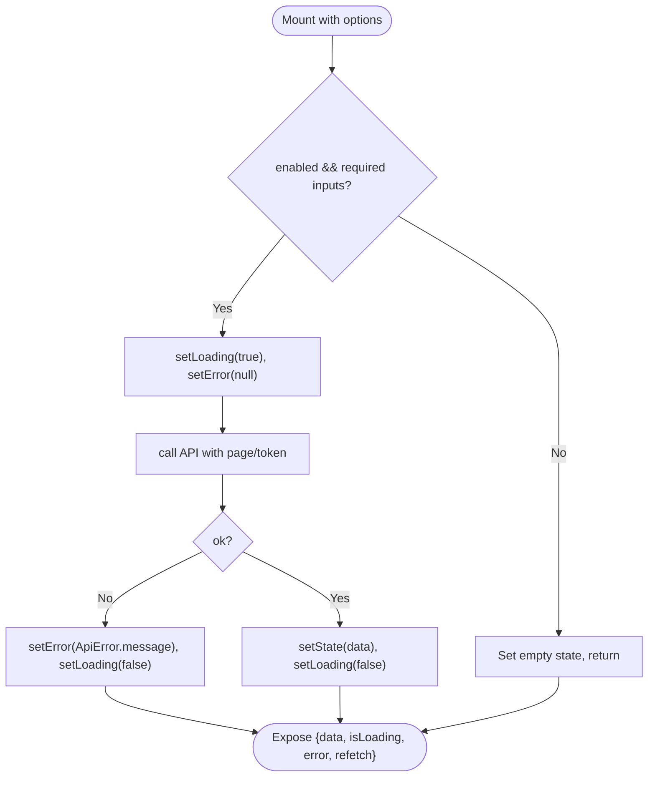

[No sources needed since this diagram shows conceptual workflow, not actual code structure]

### Finance Hook Implementation Pattern
All finance hooks follow a consistent pattern for managing financial data:

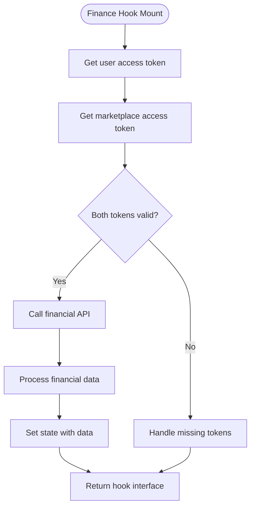

**Diagram sources**
- [use-finance-dashboard.ts:18-75](file://src/hooks/use-finance-dashboard.ts#L18-L75)
- [use-finance-transactions.ts:25-85](file://src/hooks/use-finance-transactions.ts#L25-L85)
- [use-finance-payouts.ts:23-77](file://src/hooks/use-finance-payouts.ts#L23-L77)
- [use-finance-fees.ts:23-77](file://src/hooks/use-finance-fees.ts#L23-L77)
- [use-finance-profit.ts:23-77](file://src/hooks/use-finance-profit.ts#L23-L77)
- [use-finance-cashflow.ts:18-69](file://src/hooks/use-finance-cashflow.ts#L18-L69)
- [use-finance-settlement.ts:18-73](file://src/hooks/use-finance-settlement.ts#L18-L73)

[No sources needed since this diagram shows conceptual workflow, not actual code structure]

### Finance Component Integration
The finance hooks integrate with specialized components for displaying financial data:

- **Finance Kit Components**: KPI cards, status badges, date range selectors, and financial gauges
- **Chart Components**: Area charts, donut charts, bar charts, and stacked visualizations
- **Error States**: Consistent error handling with retry functionality
- **Skeleton Loading**: Optimized loading states for financial data

**Section sources**
- [finance-kit.tsx:27-608](file://src/components/finance-kit.tsx#L27-L608)
- [finance-charts.tsx:22-396](file://src/components/finance-charts.tsx#L22-L396)