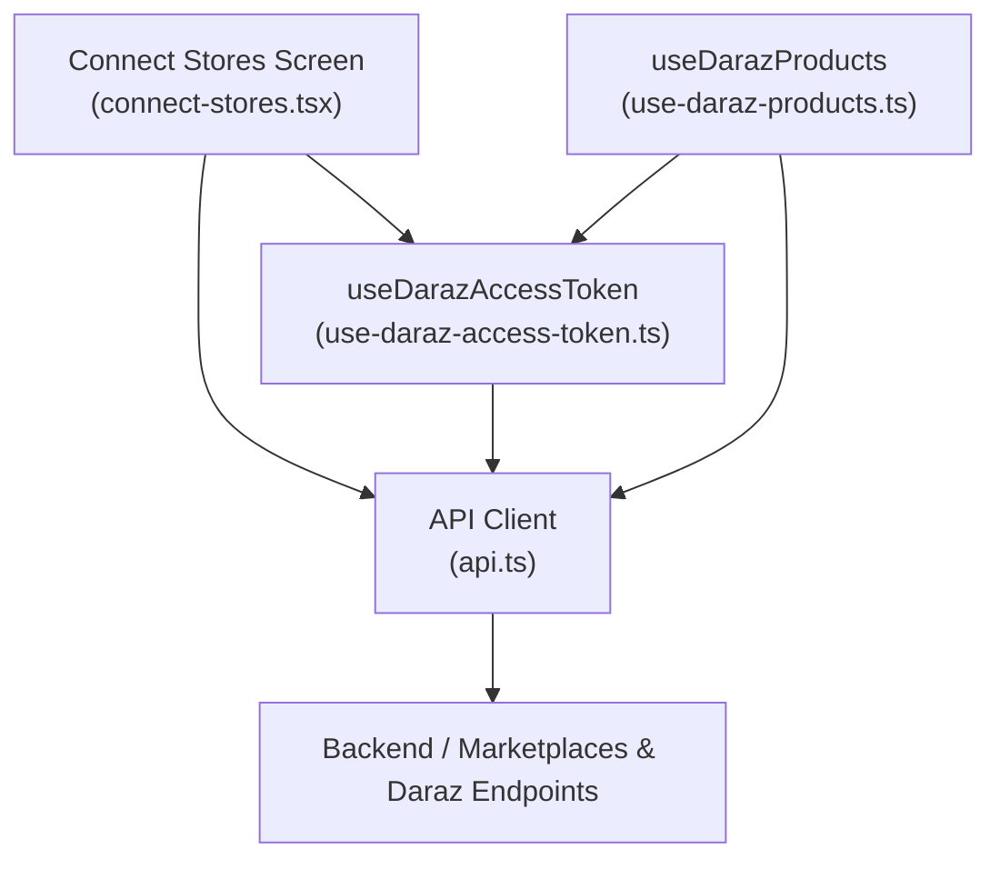
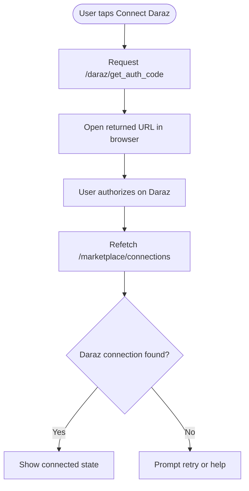
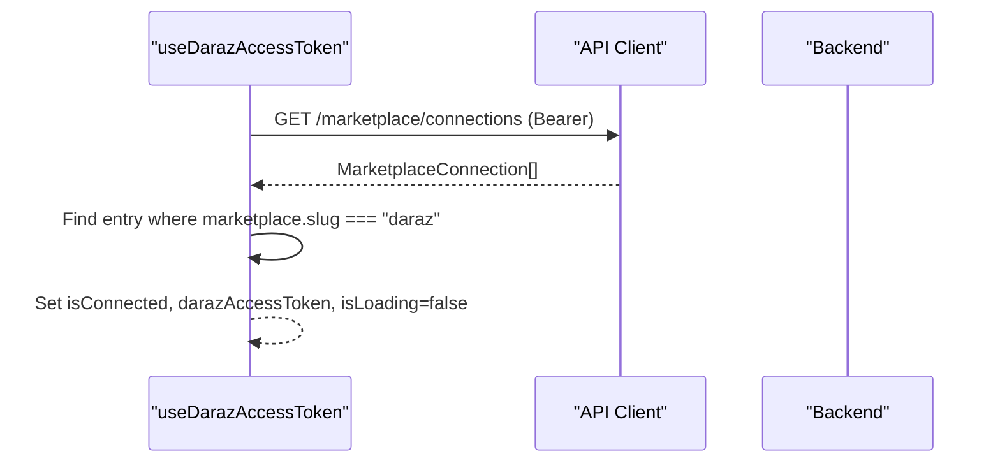
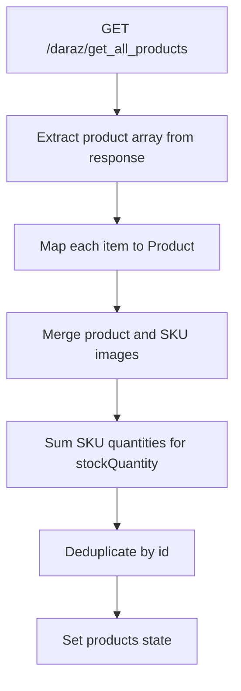
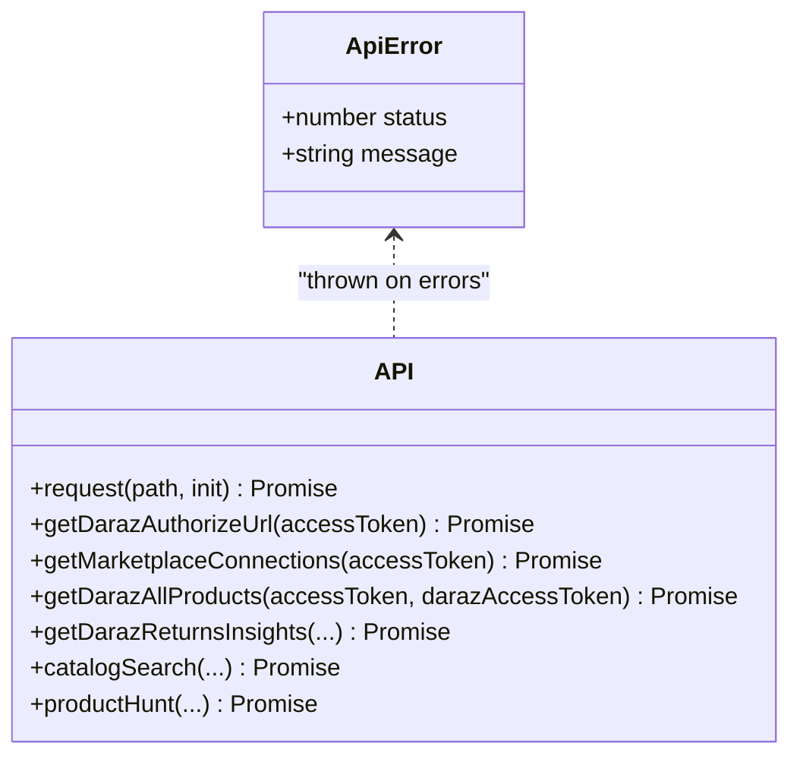
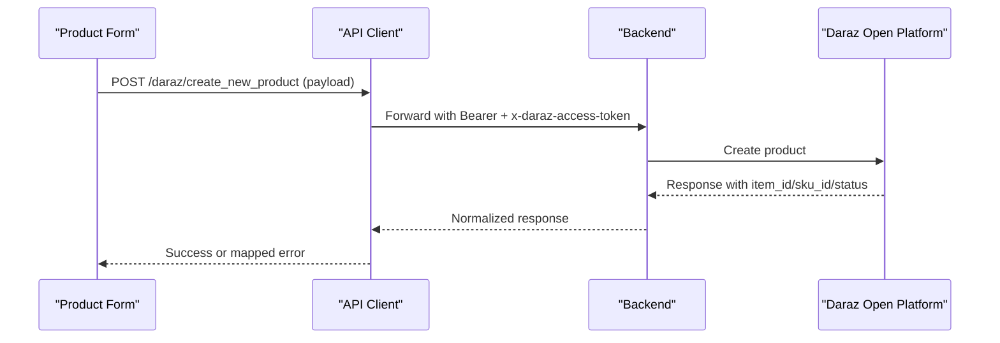
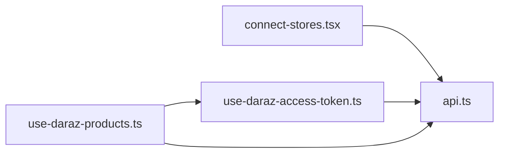

# Daraz Integration

<cite>
**Referenced Files in This Document**
- [use-daraz-access-token.ts](file://src/hooks/use-daraz-access-token.ts)
- [use-daraz-products.ts](file://src/hooks/use-daraz-products.ts)
- [api.ts](file://src/lib/api.ts)
- [connect-stores.tsx](file://src/app/(app)/connect-stores.tsx)
- [channels.ts](file://src/constants/channels.ts)
</cite>

## Table of Contents
1. [Introduction](#introduction)
2. [Project Structure](#project-structure)
3. [Core Components](#core-components)
4. [Architecture Overview](#architecture-overview)
5. [Detailed Component Analysis](#detailed-component-analysis)
6. [Dependency Analysis](#dependency-analysis)
7. [Performance Considerations](#performance-considerations)
8. [Troubleshooting Guide](#troubleshooting-guide)
9. [Conclusion](#conclusion)

## Introduction
This document explains the Daraz marketplace integration implemented in the application. It covers:
- OAuth authorization flow to obtain and use a Daraz access token
- Access token management via marketplace connections
- Product synchronization from Daraz, including data mapping and inventory handling
- API client configuration and request handling for Daraz endpoints
- Examples for fetching products and managing listings
- Error handling strategies for API limitations and connectivity issues
- Platform-specific considerations and regional differences
- Troubleshooting and debugging guidance

## Project Structure
The Daraz integration spans UI, hooks, and API utilities:
- UI initiates OAuth and displays connected status
- Hooks resolve tokens and fetch product data
- API layer handles HTTP requests, streaming, and normalization



**Diagram sources**
- [connect-stores.tsx:41-72](file://src/app/(app)/connect-stores.tsx#L41-L72)
- [use-daraz-access-token.ts:18-64](file://src/hooks/use-daraz-access-token.ts#L18-L64)
- [use-daraz-products.ts:120-183](file://src/hooks/use-daraz-products.ts#L120-L183)
- [api.ts:374-459](file://src/lib/api.ts#L374-L459)

**Section sources**
- [connect-stores.tsx:41-72](file://src/app/(app)/connect-stores.tsx#L41-L72)
- [use-daraz-access-token.ts:18-64](file://src/hooks/use-daraz-access-token.ts#L18-L64)
- [use-daraz-products.ts:120-183](file://src/hooks/use-daraz-products.ts#L120-L183)
- [api.ts:374-459](file://src/lib/api.ts#L374-L459)

## Core Components
- OAuth initiation: The Connect Stores screen triggers the Daraz OAuth flow by requesting an authorize URL and opening it in an in-app browser. After completion, the app refetches marketplace connections to detect the new connection.
- Token resolution: A hook queries marketplace connections to find the encrypted access token for Daraz and exposes connection state and error messages.
- Product sync: A hook uses the resolved token to fetch all products, normalizes them into a unified Product type, deduplicates by ID, and exposes loading/error states.
- API client: Centralized request helper with robust error extraction, SSE streaming support, and typed helpers for Daraz endpoints.

**Section sources**
- [connect-stores.tsx:41-72](file://src/app/(app)/connect-stores.tsx#L41-L72)
- [use-daraz-access-token.ts:18-64](file://src/hooks/use-daraz-access-token.ts#L18-L64)
- [use-daraz-products.ts:19-96](file://src/hooks/use-daraz-products.ts#L19-L96)
- [api.ts:53-77](file://src/lib/api.ts#L53-L77)

## Architecture Overview
End-to-end flow from user action to synchronized product list:

```mermaid
sequenceDiagram
participant User as "User"
participant UI as "Connect Stores Screen"
participant API as "API Client"
participant Backend as "Backend"
participant Daraz as "Daraz Open Platform"
User->>UI : Tap "Connect Daraz"
UI->>API : GET /daraz/get_auth_code (Bearer token)
API-->>UI : 302 redirect URL
UI->>Daraz : Open Browser at authorize URL
Note over UI,Daraz : User authorizes on Daraz; backend callback stores encrypted_access_token
UI->>API : GET /marketplace/connections (Bearer token)
API-->>UI : Connections list
UI->>UI : Detect Daraz connection and show connected
UI->>API : GET /daraz/get_all_products (Bearer + x-daraz-access-token)
API-->>UI : Raw product payload
UI->>UI : Normalize to Product[], deduplicate, render
```

**Diagram sources**
- [connect-stores.tsx:41-72](file://src/app/(app)/connect-stores.tsx#L41-L72)
- [api.ts:374-400](file://src/lib/api.ts#L374-L400)
- [api.ts:368-372](file://src/lib/api.ts#L368-L372)
- [api.ts:448-459](file://src/lib/api.ts#L448-L459)
- [use-daraz-products.ts:120-183](file://src/hooks/use-daraz-products.ts#L120-L183)

## Detailed Component Analysis

### OAuth Authorization Flow
- The Connect Stores screen calls the API to obtain a Daraz OAuth authorize URL protected by the user’s session token.
- The app opens the returned URL in an in-app browser. After the user completes authorization on Daraz, the backend stores an encrypted access token tied to the merchant’s connection.
- The screen then refreshes marketplace connections to reflect the newly established link.



**Diagram sources**
- [connect-stores.tsx:41-72](file://src/app/(app)/connect-stores.tsx#L41-L72)
- [api.ts:374-400](file://src/lib/api.ts#L374-L400)
- [api.ts:368-372](file://src/lib/api.ts#L368-L372)

**Section sources**
- [connect-stores.tsx:41-72](file://src/app/(app)/connect-stores.tsx#L41-L72)
- [api.ts:374-400](file://src/lib/api.ts#L374-L400)

### Access Token Management
- The token hook retrieves marketplace connections using the authenticated session token.
- It filters for the Daraz marketplace slug and extracts the encrypted access token if present.
- Exposes connection status, loading state, and errors to consumers.



**Diagram sources**
- [use-daraz-access-token.ts:18-64](file://src/hooks/use-daraz-access-token.ts#L18-L64)
- [api.ts:368-372](file://src/lib/api.ts#L368-L372)

**Section sources**
- [use-daraz-access-token.ts:18-64](file://src/hooks/use-daraz-access-token.ts#L18-L64)
- [api.ts:368-372](file://src/lib/api.ts#L368-L372)

### Product Synchronization and Data Mapping
- Fetches all products using the stored encrypted access token alongside the session bearer token.
- Normalizes the raw response shape to handle variations in wrapping.
- Maps fields to a unified Product model:
  - Title/description prefer English variants when available
  - Price is normalized from SKU-level special_price or price
  - Images are merged from product-level and SKU-level arrays and deduplicated
  - Inventory stockQuantity sums SKU quantities
  - Category, brand, model, warrantyType, and URL are extracted from attributes/SKU
- Deduplicates products by ID to avoid duplicates in the catalog view.



**Diagram sources**
- [use-daraz-products.ts:19-96](file://src/hooks/use-daraz-products.ts#L19-L96)
- [use-daraz-products.ts:98-113](file://src/hooks/use-daraz-products.ts#L98-L113)
- [use-daraz-products.ts:120-183](file://src/hooks/use-daraz-products.ts#L120-L183)
- [api.ts:448-459](file://src/lib/api.ts#L448-L459)

**Section sources**
- [use-daraz-products.ts:19-96](file://src/hooks/use-daraz-products.ts#L19-L96)
- [use-daraz-products.ts:98-113](file://src/hooks/use-daraz-products.ts#L98-L113)
- [use-daraz-products.ts:120-183](file://src/hooks/use-daraz-products.ts#L120-L183)
- [api.ts:448-459](file://src/lib/api.ts#L448-L459)

### API Client Configuration and Request Handling
- Centralized request function wraps fetch with consistent error extraction and network failure handling.
- Supports Server-Sent Events (SSE) streaming for long-running operations.
- Provides typed helpers for Daraz endpoints:
  - OAuth authorize URL retrieval
  - Marketplace connections listing
  - Product listing retrieval
  - Reverse orders and returns insights streaming
  - Catalog search and product hunt
  - Image migration and product creation helpers



**Diagram sources**
- [api.ts:5-13](file://src/lib/api.ts#L5-L13)
- [api.ts:53-77](file://src/lib/api.ts#L53-L77)
- [api.ts:374-400](file://src/lib/api.ts#L374-L400)
- [api.ts:368-372](file://src/lib/api.ts#L368-L372)
- [api.ts:448-459](file://src/lib/api.ts#L448-L459)
- [api.ts:1257-1281](file://src/lib/api.ts#L1257-L1281)
- [api.ts:1556-1582](file://src/lib/api.ts#L1556-L1582)

**Section sources**
- [api.ts:5-13](file://src/lib/api.ts#L5-L13)
- [api.ts:53-77](file://src/lib/api.ts#L53-L77)
- [api.ts:374-400](file://src/lib/api.ts#L374-L400)
- [api.ts:368-372](file://src/lib/api.ts#L368-L372)
- [api.ts:448-459](file://src/lib/api.ts#L448-L459)
- [api.ts:1257-1281](file://src/lib/api.ts#L1257-L1281)
- [api.ts:1556-1582](file://src/lib/api.ts#L1556-L1582)

### Listing Creation and Image Migration
- Creating a new Daraz product sends a structured payload including category, title, images, attributes, and SKUs.
- Responses are normalized to extract identifiers and status codes; non-zero codes are surfaced as validation errors.
- Image migration endpoint converts local image references to platform-hosted URLs required by Daraz.



**Diagram sources**
- [api.ts:983-1005](file://src/lib/api.ts#L983-L1005)
- [api.ts:941-951](file://src/lib/api.ts#L941-L951)

**Section sources**
- [api.ts:941-951](file://src/lib/api.ts#L941-L951)
- [api.ts:983-1005](file://src/lib/api.ts#L983-L1005)

### Regional Marketplace Differences
- Channel metadata includes Daraz among supported channels, indicating cross-marketplace support.
- The integration treats Daraz as a distinct channel with its own OAuth flow and endpoints, enabling region-specific marketplaces behind a unified interface.

**Section sources**
- [channels.ts:1-26](file://src/constants/channels.ts#L1-L26)

## Dependency Analysis
Key dependencies and relationships:
- UI depends on API helpers to start OAuth and refresh connections
- Token hook depends on marketplace connections endpoint
- Product hook depends on both token hook and product listing endpoint
- API layer centralizes networking, error handling, and streaming



**Diagram sources**
- [connect-stores.tsx:41-72](file://src/app/(app)/connect-stores.tsx#L41-L72)
- [use-daraz-access-token.ts:18-64](file://src/hooks/use-daraz-access-token.ts#L18-L64)
- [use-daraz-products.ts:120-183](file://src/hooks/use-daraz-products.ts#L120-L183)
- [api.ts:368-459](file://src/lib/api.ts#L368-L459)

**Section sources**
- [connect-stores.tsx:41-72](file://src/app/(app)/connect-stores.tsx#L41-L72)
- [use-daraz-access-token.ts:18-64](file://src/hooks/use-daraz-access-token.ts#L18-L64)
- [use-daraz-products.ts:120-183](file://src/hooks/use-daraz-products.ts#L120-L183)
- [api.ts:368-459](file://src/lib/api.ts#L368-L459)

## Performance Considerations
- Avoid redundant requests: The token hook caches connection state per component lifecycle and supports explicit refetching.
- Defensive parsing: Product extraction tolerates multiple response shapes to reduce failures due to upstream changes.
- Deduplication: Products are deduplicated by ID to prevent duplicate entries in lists.
- Streaming: Long-running operations (returns insights, review analysis) use SSE to provide progress updates without blocking the UI.

[No sources needed since this section provides general guidance]

## Troubleshooting Guide
Common issues and resolutions:
- Network connectivity failures:
  - Symptom: Generic “Could not reach the server” errors during OAuth or data fetches.
  - Cause: Unreachable backend or transient network issues.
  - Resolution: Verify connectivity, retry, and ensure correct base URL configuration.
- OAuth start failures:
  - Symptom: Non-2xx responses when requesting the authorize URL.
  - Cause: Authentication or backend misconfiguration.
  - Resolution: Confirm session token validity and backend OAuth settings; retry after resolving.
- Missing Daraz connection:
  - Symptom: No encrypted access token found after authorization.
  - Cause: Callback did not complete or connection not persisted.
  - Resolution: Reopen the browser flow and refetch connections; check backend logs for callback handling.
- Product fetch errors:
  - Symptom: Errors while retrieving all products.
  - Cause: Invalid token, rate limits, or upstream API issues.
  - Resolution: Inspect error messages, retry, and validate token presence; consider backoff on repeated failures.
- Listing creation rejections:
  - Symptom: Validation errors or missing identifiers after creating a product.
  - Cause: Incomplete payload or Daraz validation rules.
  - Resolution: Review mapped attributes and SKU fields; adjust payload accordingly.

**Section sources**
- [api.ts:53-77](file://src/lib/api.ts#L53-L77)
- [api.ts:374-400](file://src/lib/api.ts#L374-L400)
- [use-daraz-access-token.ts:47-54](file://src/hooks/use-daraz-access-token.ts#L47-L54)
- [use-daraz-products.ts:165-172](file://src/hooks/use-daraz-products.ts#L165-L172)
- [api.ts:983-1005](file://src/lib/api.ts#L983-L1005)

## Conclusion
The Daraz integration provides a robust, user-friendly path to connect merchants, manage access tokens, and synchronize product catalogs. The architecture separates concerns across UI, hooks, and a centralized API client, ensuring maintainability and resilience. With defensive parsing, deduplication, and streaming support, the system handles real-world variability and long-running tasks effectively. For ongoing reliability, monitor error paths, validate payloads, and ensure backend OAuth callbacks persist connections correctly.

[No sources needed since this section summarizes without analyzing specific files]