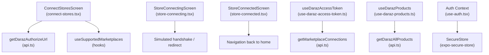
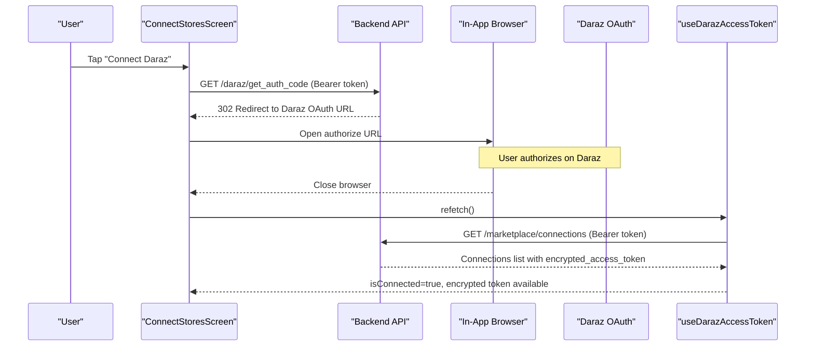
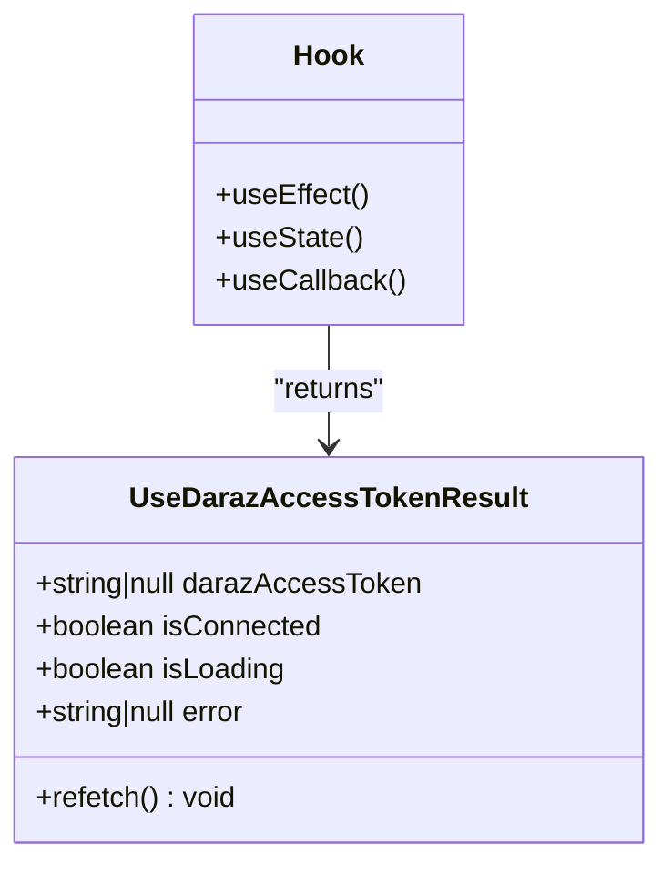
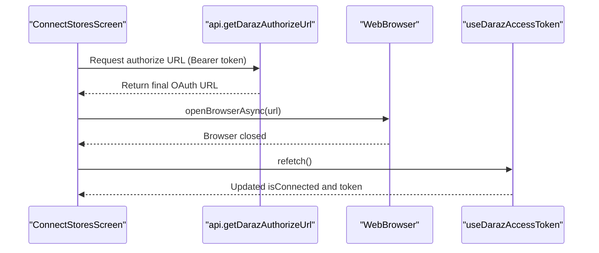
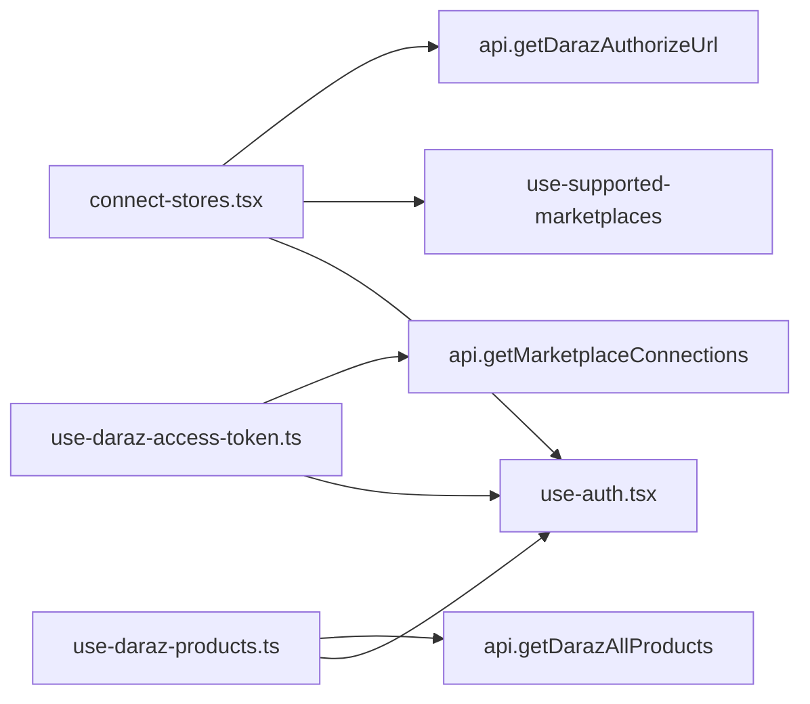

# Daraz OAuth Authentication

<cite>
**Referenced Files in This Document**
- [use-daraz-access-token.ts](file://src/hooks/use-daraz-access-token.ts)
- [connect-stores.tsx](file://src/app/(app)/connect-stores.tsx)
- [store-connecting.tsx](file://src/app/(app)/store-connecting.tsx)
- [store-connected.tsx](file://src/app/(app)/store-connected.tsx)
- [api.ts](file://src/lib/api.ts)
- [use-auth.tsx](file://src/hooks/use-auth.tsx)
- [use-daraz-products.ts](file://src/hooks/use-daraz-products.ts)
</cite>

## Table of Contents
1. [Introduction](#introduction)
2. [Project Structure](#project-structure)
3. [Core Components](#core-components)
4. [Architecture Overview](#architecture-overview)
5. [Detailed Component Analysis](#detailed-component-analysis)
6. [Dependency Analysis](#dependency-analysis)
7. [Performance Considerations](#performance-considerations)
8. [Troubleshooting Guide](#troubleshooting-guide)
9. [Conclusion](#conclusion)

## Introduction
This document explains the Daraz OAuth authentication flow used by the application, focusing on how a merchant connects their Daraz store, how the app obtains and uses an access token, and how secure token storage and transmission are handled end-to-end. It also documents the useDarazAccessToken hook’s state management for connection status, loading states, and error handling, and provides practical examples for checking connection status, handling failures, and implementing reconnection logic. Finally, it outlines security considerations and troubleshooting guidance for common issues such as expired tokens and network connectivity problems.

## Project Structure
The Daraz OAuth integration spans UI screens, hooks, and API utilities:
- UI screens handle user actions to initiate or complete the connection flow.
- Hooks encapsulate token resolution, connection checks, and data fetching.
- The API layer performs authenticated requests to backend endpoints that orchestrate OAuth and marketplace operations.

**Diagram sources**
- [connect-stores.tsx:41-72](file://src/app/(app)/connect-stores.tsx#L41-L72)
- [api.ts:368-400](file://src/lib/api.ts#L368-L400)
- [store-connecting.tsx:29-68](file://src/app/(app)/store-connecting.tsx#L29-L68)
- [store-connected.tsx:14-75](file://src/app/(app)/store-connected.tsx#L14-L75)
- [use-daraz-access-token.ts:18-65](file://src/hooks/use-daraz-access-token.ts#L18-L65)
- [use-daraz-products.ts:115-183](file://src/hooks/use-daraz-products.ts#L115-L183)
- [use-auth.tsx:31-82](file://src/hooks/use-auth.tsx#L31-L82)

**Section sources**
- [connect-stores.tsx:1-320](file://src/app/(app)/connect-stores.tsx#L1-L320)
- [store-connecting.tsx:1-184](file://src/app/(app)/store-connecting.tsx#L1-L184)
- [store-connected.tsx:1-153](file://src/app/(app)/store-connected.tsx#L1-L153)
- [use-daraz-access-token.ts:1-66](file://src/hooks/use-daraz-access-token.ts#L1-L66)
- [api.ts:326-400](file://src/lib/api.ts#L326-L400)
- [use-auth.tsx:1-91](file://src/hooks/use-auth.tsx#L1-L91)

## Core Components
- useDarazAccessToken hook: Resolves whether the current merchant has an active Daraz connection and retrieves the encrypted access token stored by the backend. It manages isLoading, isConnected, error, and exposes refetch to refresh state after OAuth completion.
- connect-stores screen: Initiates the Daraz OAuth flow by requesting an authorize URL from the backend and opening it in an in-app browser. After the browser closes, it triggers a refetch to detect the new connection.
- store-connecting screen: Provides visual feedback during connection; for non-Daraz channels it simulates steps before navigating to success. For Shopify, it initiates OAuth similarly to Daraz.
- store-connected screen: Confirms successful connection and guides users into data import.
- API layer: Implements getDarazAuthorizeUrl (returns final OAuth URL), getMarketplaceConnections (returns connections including encrypted_access_token), and Daraz product retrieval with the encrypted token passed via a custom header.
- Auth context: Manages the user session token using SecureStore and hydrates the session at app start.

**Section sources**
- [use-daraz-access-token.ts:18-65](file://src/hooks/use-daraz-access-token.ts#L18-L65)
- [connect-stores.tsx:41-72](file://src/app/(app)/connect-stores.tsx#L41-L72)
- [store-connecting.tsx:29-68](file://src/app/(app)/store-connecting.tsx#L29-L68)
- [store-connected.tsx:14-75](file://src/app/(app)/store-connected.tsx#L14-L75)
- [api.ts:368-400](file://src/lib/api.ts#L368-L400)
- [use-auth.tsx:31-82](file://src/hooks/use-auth.tsx#L31-L82)

## Architecture Overview
The Daraz OAuth flow is split between the frontend and backend:
- Frontend requests an OAuth authorize URL from the backend using the user’s session token.
- The backend responds with a redirect to Daraz’s OAuth page.
- The frontend opens this URL in an in-app browser.
- After authorization completes on Daraz’s side, the backend stores an encrypted access token associated with the merchant’s Daraz connection.
- The frontend periodically or explicitly refetches marketplace connections to detect the new connection and retrieve the encrypted token.
- Subsequent Daraz API calls include both the user session token and the encrypted access token to authenticate with Daraz via the backend.

**Diagram sources**
- [connect-stores.tsx:41-72](file://src/app/(app)/connect-stores.tsx#L41-L72)
- [api.ts:368-400](file://src/lib/api.ts#L368-L400)
- [use-daraz-access-token.ts:29-62](file://src/hooks/use-daraz-access-token.ts#L29-L62)

## Detailed Component Analysis

### useDarazAccessToken Hook
Responsibilities:
- Wait for the user session token to be available before making requests.
- Fetch marketplace connections and locate the Daraz connection with an encrypted access token.
- Manage local state: darazAccessToken, isConnected, isLoading, error, and provide refetch.

State management:
- isLoading starts true and becomes false after the request settles.
- isConnected is set based on whether a Daraz connection with an encrypted token exists.
- error captures human-readable messages from ApiError or fallback messages.
- refetch increments a reloadKey to trigger a fresh fetch.

Data flow:
- Calls getMarketplaceConnections(accessToken).
- Finds connection where marketplace.slug === "daraz" and encrypted_access_token is present.
- Sets state accordingly and clears errors on retry.

Complexity:
- O(n) scan over connections to find the Daraz entry; n is typically small.

Optimization opportunities:
- Cache connections briefly to avoid repeated network calls when switching screens.
- Debounce rapid refetches if needed.

Error handling:
- Uses ApiError to surface server messages; otherwise shows a friendly message.
- Ensures cleanup via cancellation flag to prevent state updates after unmount.

**Section sources**
- [use-daraz-access-token.ts:18-65](file://src/hooks/use-daraz-access-token.ts#L18-L65)

#### Class-like structure of useDarazAccessToken

**Diagram sources**
- [use-daraz-access-token.ts:6-16](file://src/hooks/use-daraz-access-token.ts#L6-L16)
- [use-daraz-access-token.ts:18-65](file://src/hooks/use-daraz-access-token.ts#L18-L65)

### Connect Stores Screen (Daraz Flow)
Responsibilities:
- Display supported marketplaces and sort connected ones first.
- Initiate Daraz OAuth by calling getDarazAuthorizeUrl and opening the result in an in-app browser.
- On browser close, trigger refetch to update connection state.

Flow:
- handleConnect detects Daraz slug, sets connectingId, calls getDarazAuthorizeUrl, opens browser, then refetches.
- Errors are captured and displayed; connectingId is cleared in finally.

Reconnection logic:
- If the connection fails to appear after browser close, users can retry by tapping the marketplace card again or refreshing the list.

**Section sources**
- [connect-stores.tsx:41-72](file://src/app/(app)/connect-stores.tsx#L41-L72)
- [connect-stores.tsx:150-215](file://src/app/(app)/connect-stores.tsx#L150-L215)

#### Sequence: Daraz OAuth initiation

**Diagram sources**
- [connect-stores.tsx:41-72](file://src/app/(app)/connect-stores.tsx#L41-L72)
- [api.ts:374-400](file://src/lib/api.ts#L374-L400)
- [use-daraz-access-token.ts:29-62](file://src/hooks/use-daraz-access-token.ts#L29-L62)

### Store Connecting Screen
Responsibilities:
- Provide step-by-step visual feedback during connection.
- For Shopify, call getShopifyAuthorizeUrl and navigate to success upon completion.
- For other platforms (including Daraz), simulate steps and then navigate to success.

Note:
- The Daraz OAuth initiation occurs in the Connect Stores screen; this screen handles UX and navigation.

**Section sources**
- [store-connecting.tsx:29-68](file://src/app/(app)/store-connecting.tsx#L29-L68)
- [store-connecting.tsx:70-89](file://src/app/(app)/store-connecting.tsx#L70-L89)

### Store Connected Screen
Responsibilities:
- Confirm successful connection and guide users to continue data import.
- Allow connecting another store.

**Section sources**
- [store-connected.tsx:14-75](file://src/app/(app)/store-connected.tsx#L14-L75)

### API Layer: Token Acquisition and Usage
- getDarazAuthorizeUrl: Requests an OAuth authorize URL from the backend using the user’s session token. The response redirects to Daraz’s OAuth page; the final URL is returned to the frontend.
- getMarketplaceConnections: Retrieves all marketplace connections for the authenticated user, including encrypted_access_token fields.
- getDarazAllProducts: Calls the backend to fetch products, passing both the user session token (Authorization header) and the encrypted Daraz access token (custom header x-daraz-access-token).

Security note:
- The encrypted access token is never persisted in the app; it is retrieved per session from the backend and transmitted only via secure headers to the backend.

**Section sources**
- [api.ts:368-400](file://src/lib/api.ts#L368-L400)
- [api.ts:448-459](file://src/lib/api.ts#L448-L459)

### Auth Context and Secure Storage
- The app stores the user session token in SecureStore and hydrates the session on launch.
- If the stored token is invalid or expired, it is removed and the user is logged out.
- This ensures that subsequent API calls (including OAuth initiation and connection checks) are authenticated securely.

**Section sources**
- [use-auth.tsx:31-82](file://src/hooks/use-auth.tsx#L31-L82)

## Dependency Analysis
The following diagram shows key dependencies among components involved in the Daraz OAuth flow:

**Diagram sources**
- [connect-stores.tsx:41-72](file://src/app/(app)/connect-stores.tsx#L41-L72)
- [use-daraz-access-token.ts:29-62](file://src/hooks/use-daraz-access-token.ts#L29-L62)
- [use-daraz-products.ts:115-183](file://src/hooks/use-daraz-products.ts#L115-L183)
- [api.ts:368-400](file://src/lib/api.ts#L368-L400)
- [api.ts:448-459](file://src/lib/api.ts#L448-L459)
- [use-auth.tsx:31-82](file://src/hooks/use-auth.tsx#L31-L82)

**Section sources**
- [connect-stores.tsx:41-72](file://src/app/(app)/connect-stores.tsx#L41-L72)
- [use-daraz-access-token.ts:29-62](file://src/hooks/use-daraz-access-token.ts#L29-L62)
- [use-daraz-products.ts:115-183](file://src/hooks/use-daraz-products.ts#L115-L183)
- [api.ts:368-400](file://src/lib/api.ts#L368-L400)
- [api.ts:448-459](file://src/lib/api.ts#L448-L459)
- [use-auth.tsx:31-82](file://src/hooks/use-auth.tsx#L31-L82)

## Performance Considerations
- Avoid redundant refetches: The refetch mechanism uses a reloadKey to force re-execution; ensure it is called only when necessary (e.g., after OAuth completion or explicit user action).
- Minimize network calls: Cache marketplace connections locally for short durations to reduce repeated requests while navigating between screens.
- Defer heavy operations: Product fetching should wait until the connection is resolved to avoid unnecessary work.

[No sources needed since this section provides general guidance]

## Troubleshooting Guide
Common issues and resolutions:
- Expired or invalid session token:
  - Symptom: Unable to start OAuth or fetch connections.
  - Resolution: Re-authenticate; the auth context will clear invalid tokens from SecureStore and prompt login.
- Network connectivity problems:
  - Symptom: “Could not reach the server” errors during OAuth initiation or connection checks.
  - Resolution: Check device network settings; retry after reconnecting.
- OAuth did not complete:
  - Symptom: No connection appears after closing the browser.
  - Resolution: Ensure the backend callback is configured correctly; retry initiating OAuth and verify the browser returns to the app.
- Missing encrypted access token:
  - Symptom: isConnected remains false even after OAuth.
  - Resolution: Verify the backend created a Daraz connection and stored the encrypted token; call refetch to refresh state.
- Product fetch failures:
  - Symptom: Error loading Daraz products.
  - Resolution: Confirm the connection exists and the encrypted token is present; retry fetching; check backend logs for Daraz API errors.

Examples:
- Checking connection status:
  - Use isConnected from useDarazAccessToken to conditionally render features or prompts.
- Handling authentication failures:
  - Display error.message from ApiError; offer a retry button that calls refetch.
- Implementing reconnection logic:
  - On error, show a retry action; on success, proceed to data import or feature usage.

**Section sources**
- [use-daraz-access-token.ts:47-57](file://src/hooks/use-daraz-access-token.ts#L47-L57)
- [connect-stores.tsx:65-71](file://src/app/(app)/connect-stores.tsx#L65-L71)
- [api.ts:53-77](file://src/lib/api.ts#L53-L77)
- [use-auth.tsx:35-53](file://src/hooks/use-auth.tsx#L35-L53)

## Security Considerations
- Session token storage:
  - The user session token is stored in SecureStore, providing platform-level encryption and isolation.
- Encrypted access token handling:
  - The encrypted access token is retrieved from the backend per session and never persisted in the app.
  - It is transmitted only via secure headers to the backend for Daraz API calls.
- Transmission security:
  - All API calls use HTTPS and include Authorization headers with the user session token.
  - Custom headers carry the encrypted token only to trusted backend endpoints.
- Error exposure:
  - Errors are sanitized to avoid leaking sensitive information; user-facing messages are generic unless derived from structured server responses.

[No sources needed since this section summarizes security practices without analyzing specific files]

## Conclusion
The Daraz OAuth integration leverages a clean separation between UI, hooks, and API utilities. The useDarazAccessToken hook centralizes connection state and token resolution, enabling consistent behavior across features that depend on Daraz data. Secure storage and transmission practices protect sensitive credentials, while robust error handling and refetch mechanisms support reliable reconnection flows. By following the patterns documented here, developers can extend the integration confidently and maintain a secure, user-friendly experience.

[No sources needed since this section summarizes without analyzing specific files]