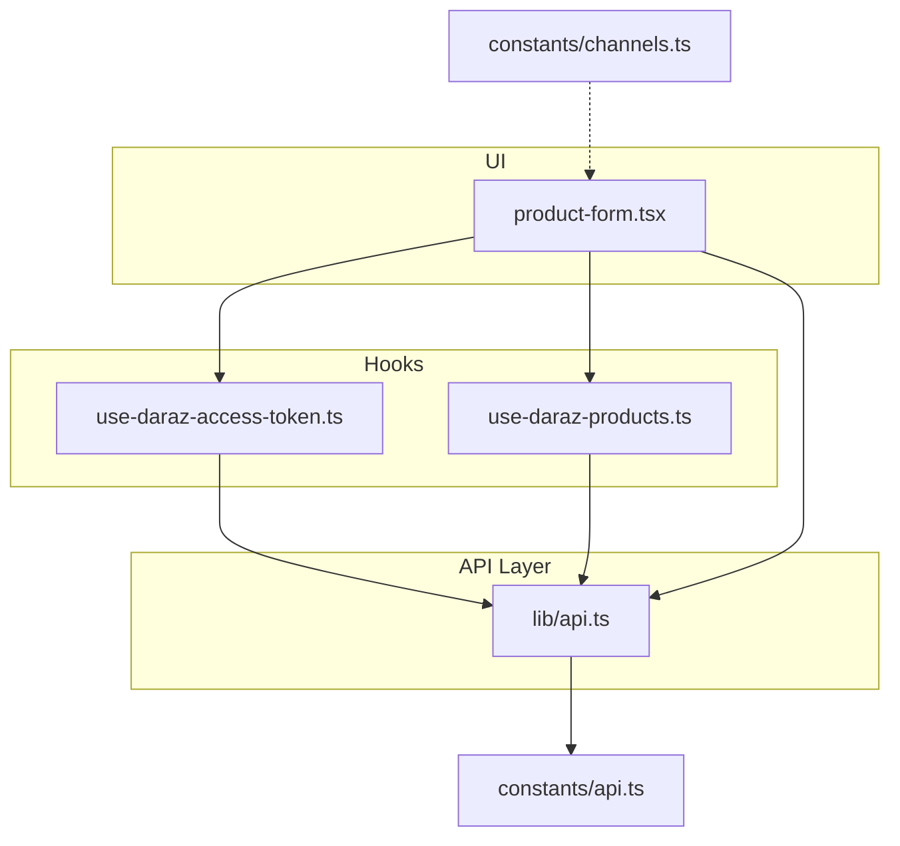
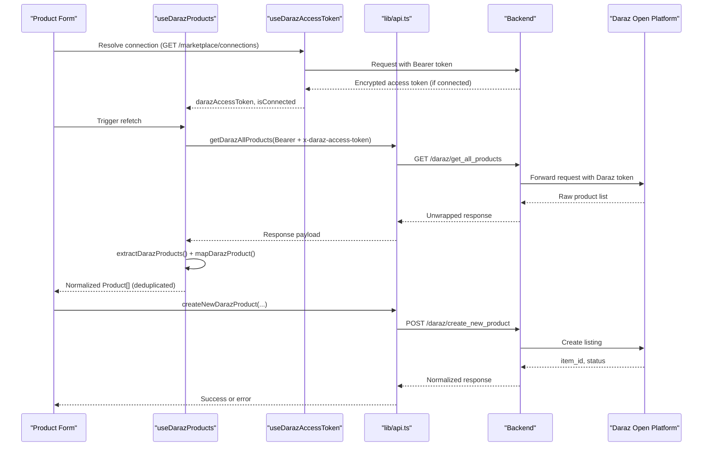
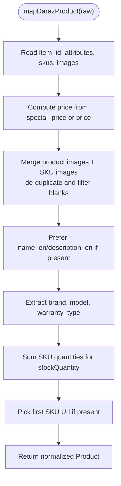
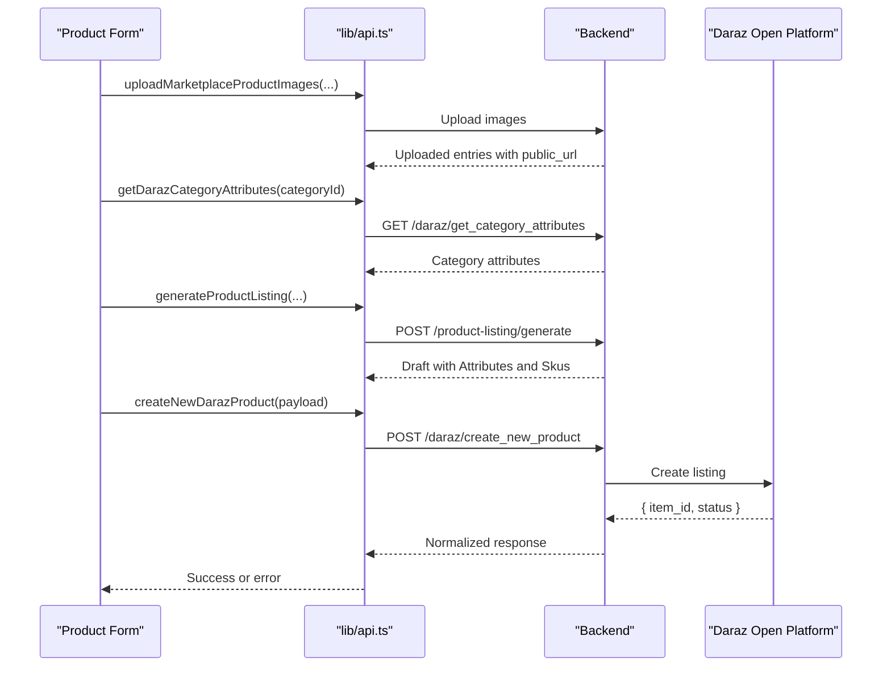
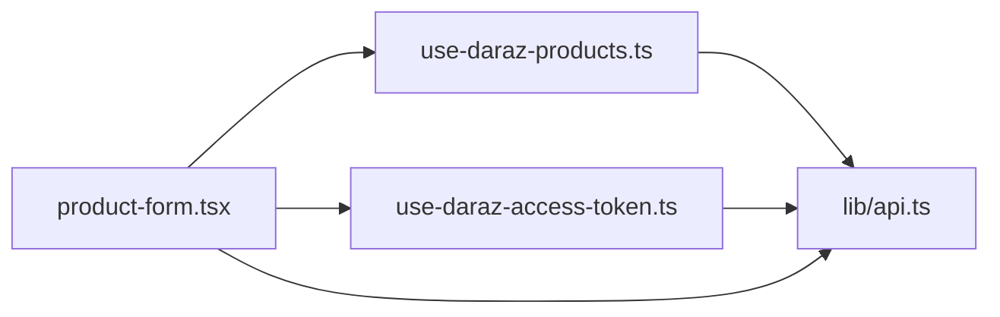

# Daraz Product Synchronization

<cite>
**Referenced Files in This Document**
- [use-daraz-products.ts](file://src/hooks/use-daraz-products.ts)
- [use-daraz-access-token.ts](file://src/hooks/use-daraz-access-token.ts)
- [api.ts](file://src/lib/api.ts)
- [channels.ts](file://src/constants/channels.ts)
- [api.ts (constants)](file://src/constants/api.ts)
- [product-form.tsx](file://src/app/(app)/product-form.tsx)
</cite>

## Table of Contents
1. Introduction
2. Project Structure
3. Core Components
4. Architecture Overview
5. Detailed Component Analysis
6. Dependency Analysis
7. Performance Considerations
8. Troubleshooting Guide
9. Conclusion
10. Appendices

## Introduction
This document explains the Daraz product synchronization functionality in the application. It covers how products are fetched from Daraz, how inventory is represented and managed, and how listings are created and updated between the app and the Daraz marketplace. It also documents the useDarazProducts hook implementation, including mapping, transformation, error handling, API endpoints used for product operations, and guidance on performance and conflict resolution.

## Project Structure
The Daraz sync feature spans hooks, API utilities, and UI components:
- Hooks manage authentication, connection state, and data fetching for Daraz products.
- The API layer defines typed requests/responses and normalizes marketplace payloads.
- The product form orchestrates image upload, attribute generation, and listing creation to Daraz.

**Diagram sources**
- [use-daraz-access-token.ts:1-66](file://src/hooks/use-daraz-access-token.ts#L1-L66)
- [use-daraz-products.ts:1-184](file://src/hooks/use-daraz-products.ts#L1-L184)
- [api.ts:344-459](file://src/lib/api.ts#L344-L459)
- [api.ts:1109-1153](file://src/lib/api.ts#L1109-L1153)
- [api.ts:983-1006](file://src/lib/api.ts#L983-L1006)
- [product-form.tsx:415-790](file://src/app/(app)/product-form.tsx#L415-L790)
- [api.ts (constants):1-16](file://src/constants/api.ts#L1-L16)
- [channels.ts:1-26](file://src/constants/channels.ts#L1-L26)

**Section sources**
- [use-daraz-access-token.ts:1-66](file://src/hooks/use-daraz-access-token.ts#L1-L66)
- [use-daraz-products.ts:1-184](file://src/hooks/use-daraz-products.ts#L1-L184)
- [api.ts:344-459](file://src/lib/api.ts#L344-L459)
- [api.ts:1109-1153](file://src/lib/api.ts#L1109-L1153)
- [api.ts:983-1006](file://src/lib/api.ts#L983-L1006)
- [product-form.tsx:415-790](file://src/app/(app)/product-form.tsx#L415-L790)
- [api.ts (constants):1-16](file://src/constants/api.ts#L1-L16)
- [channels.ts:1-26](file://src/constants/channels.ts#L1-L26)

## Core Components
- useDarazAccessToken: Resolves a merchant’s Daraz connection and encrypted access token via GET /marketplace/connections.
- useDarazProducts: Fetches the full Daraz catalog using the resolved token, maps raw items to the app’s Product type, deduplicates by id, and exposes loading/error states.
- API module: Provides typed functions for marketplace connections, product retrieval, product creation/update/delete, category/attribute discovery, and image migration.
- Product form: Orchestrates image upload, AI-assisted attribute generation, and submission to create a Daraz listing.

Key responsibilities:
- Authentication and connection resolution
- Data normalization and mapping
- Error handling with user-friendly messages
- Listing creation workflow with marketplace-specific attributes

**Section sources**
- [use-daraz-access-token.ts:18-65](file://src/hooks/use-daraz-access-token.ts#L18-L65)
- [use-daraz-products.ts:19-183](file://src/hooks/use-daraz-products.ts#L19-L183)
- [api.ts:344-459](file://src/lib/api.ts#L344-L459)
- [api.ts:1109-1153](file://src/lib/api.ts#L1109-L1153)
- [api.ts:983-1006](file://src/lib/api.ts#L983-L1006)
- [product-form.tsx:415-790](file://src/app/(app)/product-form.tsx#L415-L790)

## Architecture Overview
The synchronization flow consists of three phases:
1. Connection resolution: Obtain the merchant’s Daraz access token.
2. Catalog fetch and mapping: Retrieve all products and normalize them into the app’s Product model.
3. Listing creation/update: Upload images, generate attributes, and publish to Daraz.

**Diagram sources**
- [use-daraz-access-token.ts:29-62](file://src/hooks/use-daraz-access-token.ts#L29-L62)
- [use-daraz-products.ts:139-180](file://src/hooks/use-daraz-products.ts#L139-L180)
- [api.ts:368-459](file://src/lib/api.ts#L368-L459)
- [api.ts:983-1006](file://src/lib/api.ts#L983-L1006)
- [product-form.tsx:756-790](file://src/app/(app)/product-form.tsx#L756-L790)

## Detailed Component Analysis

### useDarazProducts Hook
Responsibilities:
- Wait for auth and connection resolution before fetching.
- Call GET /daraz/get_all_products with both Bearer and x-daraz-access-token headers.
- Extract the product array from flexible response shapes.
- Map each raw item to the internal Product model, including price parsing, image gallery merging, and stock aggregation across SKUs.
- Deduplicate products by id to avoid duplicates from marketplace feeds.
- Expose isLoading, error, and refetch capabilities.

Mapping highlights:
- Title/description prefer English variants when available.
- Images combine product-level and SKU-level images, de-duplicated and filtered.
- StockQuantity sums SKU quantities where present.
- URL taken from first SKU if available.

Error handling:
- Propagates ApiError messages; otherwise shows a generic message.
- Ensures loading state is cleared even on cancellation.

**Section sources**
- [use-daraz-products.ts:19-96](file://src/hooks/use-daraz-products.ts#L19-L96)
- [use-daraz-products.ts:98-113](file://src/hooks/use-daraz-products.ts#L98-L113)
- [use-daraz-products.ts:120-183](file://src/hooks/use-daraz-products.ts#L120-L183)
- [api.ts:448-459](file://src/lib/api.ts#L448-L459)
- [api.ts:496-505](file://src/lib/api.ts#L496-L505)

#### Mapping Flowchart

**Diagram sources**
- [use-daraz-products.ts:30-96](file://src/hooks/use-daraz-products.ts#L30-L96)

### useDarazAccessToken Hook
Responsibilities:
- Fetch GET /marketplace/connections to find a Daraz connection with an encrypted_access_token.
- Set isConnected based on presence of a valid connection.
- Provide refetch capability to re-resolve the connection.

Error handling:
- Converts backend errors to ApiError and surfaces a user-friendly message.

**Section sources**
- [use-daraz-access-token.ts:18-65](file://src/hooks/use-daraz-access-token.ts#L18-L65)
- [api.ts:368-372](file://src/lib/api.ts#L368-L372)

### API Endpoints and Types
Authentication and connections:
- GET /auth/me
- GET /marketplace/
- GET /marketplace/connections

Daraz product operations:
- GET /daraz/get_all_products (requires Bearer and x-daraz-access-token)
- POST /daraz/create_new_product (requires Bearer and x-daraz-access-token)
- GET /daraz/get_all_categories
- GET /daraz/get_category_attributes?primary_category_id=...&language_code=en_US

Local product management:
- GET /product/get_products
- GET /product/get_product/{id}
- POST /product/create_product
- PUT /product/update_product
- DELETE /product/delete_product/{id}

Image and listing helpers:
- Image upload/migration endpoints used by the product form (paths abstracted through helper functions).
- POST /product-listing/generate for AI-assisted listing draft generation.

Request/response formats:
- All authenticated endpoints include Authorization: Bearer <token>.
- Daraz endpoints additionally require header x-daraz-access-token set to the connection’s encrypted_access_token.
- Responses are normalized by the API layer; many endpoints return untyped bodies that callers must parse defensively.

**Section sources**
- [api.ts:317-372](file://src/lib/api.ts#L317-L372)
- [api.ts:374-459](file://src/lib/api.ts#L374-L459)
- [api.ts:629-638](file://src/lib/api.ts#L629-L638)
- [api.ts:722-784](file://src/lib/api.ts#L722-L784)
- [api.ts:983-1006](file://src/lib/api.ts#L983-L1006)
- [api.ts:1109-1153](file://src/lib/api.ts#L1109-L1153)

### Listing Creation Workflow (Daraz)
Steps:
1. Select images and optionally upload/migrate them to Daraz storage.
2. Fetch category attributes for the selected primary category.
3. Generate a listing draft via AI (optional), then fill mandatory attributes.
4. Build a DarazCreateProductPayload with PrimaryCategory, Title, Images, Attributes, and Skus.
5. Submit to POST /daraz/create_new_product.
6. Handle success (item_id returned) or errors (non-zero code or missing item_id).

**Diagram sources**
- [product-form.tsx:415-790](file://src/app/(app)/product-form.tsx#L415-L790)
- [api.ts:629-638](file://src/lib/api.ts#L629-L638)
- [api.ts:780-784](file://src/lib/api.ts#L780-L784)
- [api.ts:983-1006](file://src/lib/api.ts#L983-L1006)

**Section sources**
- [product-form.tsx:415-790](file://src/app/(app)/product-form.tsx#L415-L790)
- [api.ts:629-638](file://src/lib/api.ts#L629-L638)
- [api.ts:780-784](file://src/lib/api.ts#L780-L784)
- [api.ts:983-1006](file://src/lib/api.ts#L983-L1006)

## Dependency Analysis
Coupling and cohesion:
- useDarazProducts depends on useDarazAccessToken for connection state and on lib/api.ts for network calls and normalization.
- lib/api.ts centralizes HTTP logic, error extraction, and SSE streaming support; it is reused across features.
- product-form.tsx composes multiple API calls to orchestrate listing creation.

External dependencies:
- Daraz Open Platform APIs accessed via backend proxies.
- React Native/web fetch and XHR for streaming.

Potential circular dependencies:
- None observed; hooks depend on API, not vice versa.

**Diagram sources**
- [use-daraz-products.ts:1-184](file://src/hooks/use-daraz-products.ts#L1-L184)
- [use-daraz-access-token.ts:1-66](file://src/hooks/use-daraz-access-token.ts#L1-L66)
- [api.ts:1-1583](file://src/lib/api.ts#L1-L1583)
- [product-form.tsx:415-790](file://src/app/(app)/product-form.tsx#L415-L790)

**Section sources**
- [use-daraz-products.ts:1-184](file://src/hooks/use-daraz-products.ts#L1-L184)
- [use-daraz-access-token.ts:1-66](file://src/hooks/use-daraz-access-token.ts#L1-L66)
- [api.ts:1-1583](file://src/lib/api.ts#L1-L1583)
- [product-form.tsx:415-790](file://src/app/(app)/product-form.tsx#L415-L790)

## Performance Considerations
- Avoid redundant requests: useDarazProducts waits for connection resolution before fetching, preventing unnecessary calls.
- Deduplication: Products are deduplicated by id to reduce UI duplication and processing overhead.
- Defensive parsing: Flexible response extraction avoids crashes and reduces retries due to malformed payloads.
- Streaming: For long-running tasks (e.g., returns insights, review analysis), SSE streams provide progress updates without blocking UI.
- Batch operations: The current product listing creation is per-item; for large catalogs, consider batching at the backend level (e.g., batch create/update endpoints) and paginating reads.
- Image handling: Migrate images once and reuse URLs; clean up temporary uploads after successful publication to minimize storage costs.

[No sources needed since this section provides general guidance]

## Troubleshooting Guide
Common issues and resolutions:
- No Daraz connection: Ensure GET /marketplace/connections returns a connection with encrypted_access_token for slug "daraz".
- Token errors: If token resolution fails, surface the ApiError message and prompt the user to reconnect.
- Product fetch failures: Check headers (Bearer and x-daraz-access-token) and network connectivity; fallback to generic error message.
- Listing creation failures: Non-zero code or missing item_id indicates Daraz rejection; inspect error message and adjust attributes/SKUs accordingly.
- Image migration failures: If migrated URL equals input URL or is missing, treat as failure and clean up uploaded paths.

Error handling patterns:
- Centralized ApiError with status and message.
- SSE error events converted to ApiError with detail extraction.
- User-facing messages derived from backend detail or nested daraz_details arrays.

**Section sources**
- [api.ts:5-51](file://src/lib/api.ts#L5-L51)
- [api.ts:206-286](file://src/lib/api.ts#L206-L286)
- [use-daraz-access-token.ts:47-54](file://src/hooks/use-daraz-access-token.ts#L47-L54)
- [use-daraz-products.ts:165-172](file://src/hooks/use-daraz-products.ts#L165-L172)
- [api.ts:954-1006](file://src/lib/api.ts#L954-L1006)

## Conclusion
The Daraz synchronization layer combines robust connection management, resilient data fetching, and careful normalization to present a consistent Product model to the app. The useDarazProducts hook encapsulates the complexity of fetching and mapping marketplace data, while the API layer standardizes requests, responses, and error handling. Listing creation leverages AI-assisted drafting and marketplace-specific attributes to ensure compliant and high-quality Daraz listings. For large catalogs, consider backend batching and pagination strategies to improve performance and reliability.

[No sources needed since this section summarizes without analyzing specific files]

## Appendices

### API Endpoints Summary
- Authentication and sessions:
  - GET /auth/me
  - POST /auth/login
  - POST /auth/signup
- Marketplace connections:
  - GET /marketplace/
  - GET /marketplace/connections
- Daraz products:
  - GET /daraz/get_all_products
  - POST /daraz/create_new_product
  - GET /daraz/get_all_categories
  - GET /daraz/get_category_attributes
- Local products:
  - GET /product/get_products
  - GET /product/get_product/{id}
  - POST /product/create_product
  - PUT /product/update_product
  - DELETE /product/delete_product/{id}
- Listing generation:
  - POST /product-listing/generate

Headers:
- Authorization: Bearer <accessToken>
- x-daraz-access-token: <encrypted_access_token> (for Daraz endpoints)

**Section sources**
- [api.ts:317-372](file://src/lib/api.ts#L317-L372)
- [api.ts:374-459](file://src/lib/api.ts#L374-L459)
- [api.ts:629-638](file://src/lib/api.ts#L629-L638)
- [api.ts:722-784](file://src/lib/api.ts#L722-L784)
- [api.ts:983-1006](file://src/lib/api.ts#L983-L1006)
- [api.ts:1109-1153](file://src/lib/api.ts#L1109-L1153)

### Handling Sync Conflicts and Data Consistency
- Idempotency: Use stable identifiers (item_id) to detect and reconcile duplicates; dedupeProductsById ensures unique entries.
- Conflict resolution strategy:
  - Prefer source-of-truth fields: For titles/descriptions, prefer English variants when available.
  - Inventory reconciliation: Sum SKU quantities for stockQuantity; update local inventory only after successful marketplace write.
  - Attribute validation: Validate mandatory attributes against category definitions before submission.
- Multi-marketplace consistency:
  - Maintain platform metadata (e.g., platform field) to distinguish sources.
  - When updating across marketplaces, apply changes atomically where possible and roll back on partial failures.

[No sources needed since this section provides general guidance]