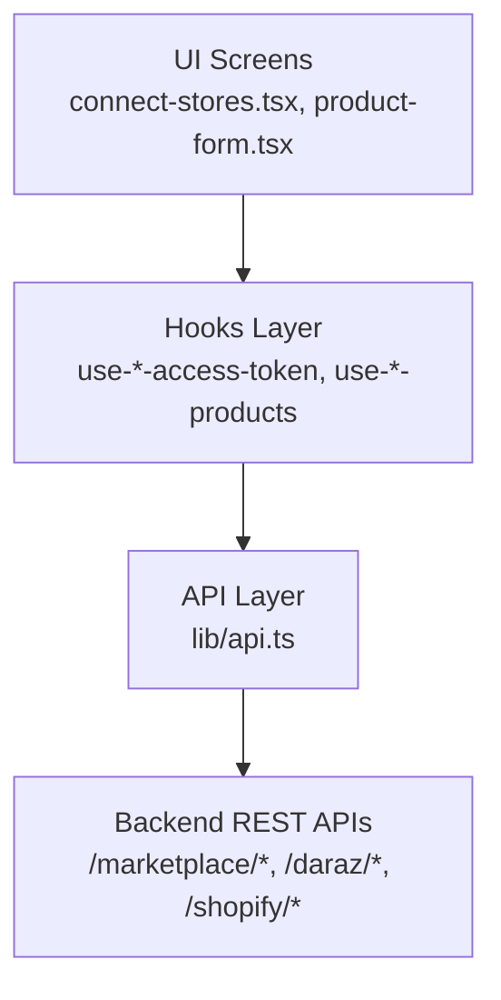
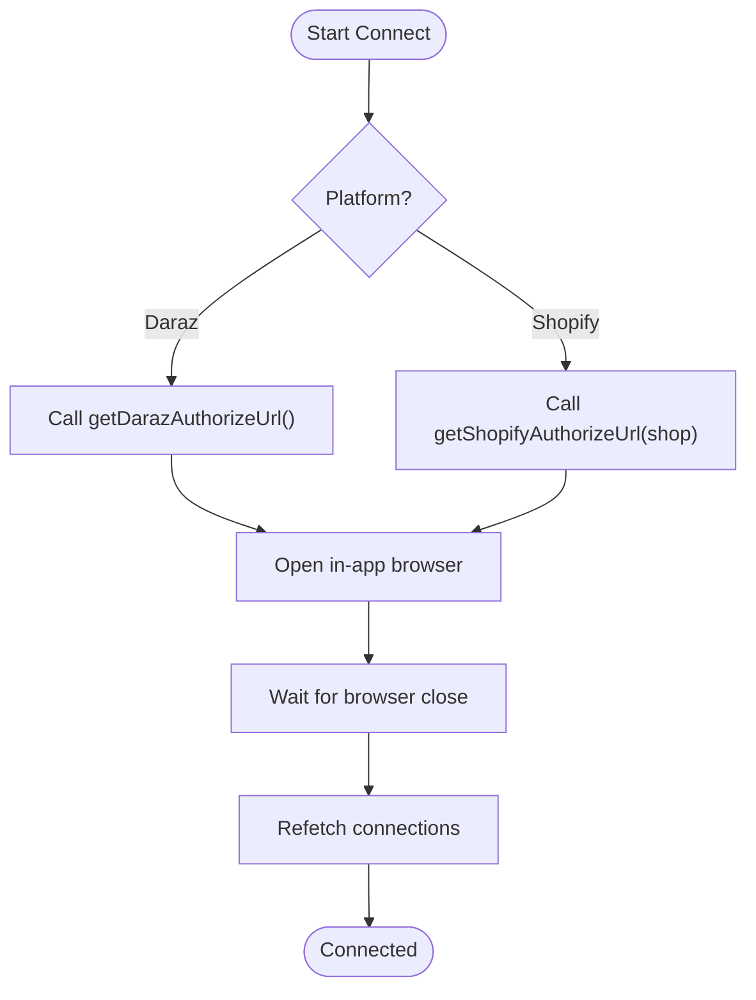
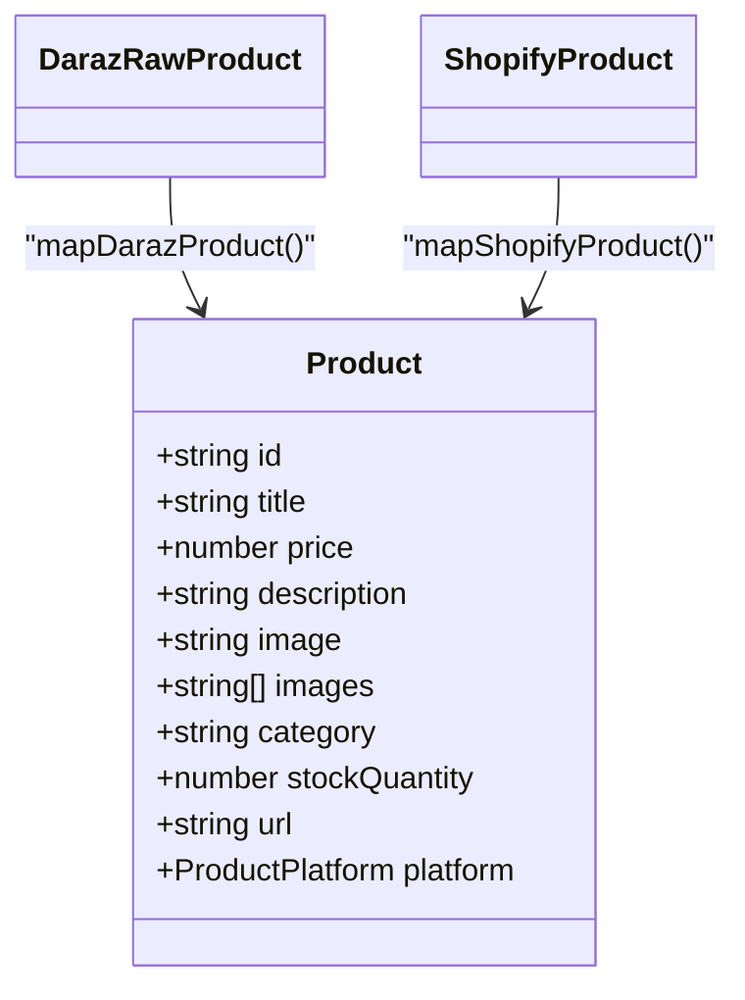
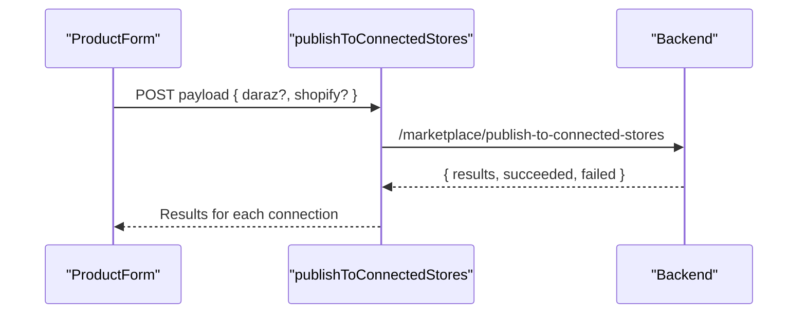
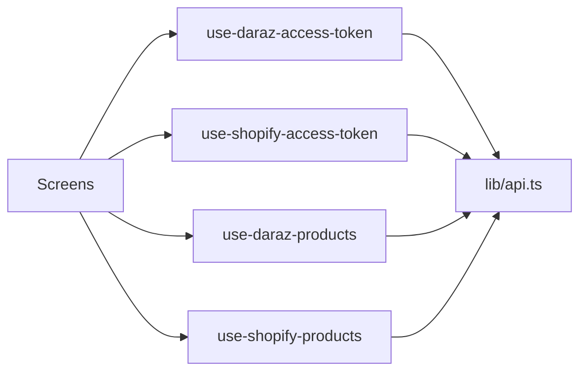

# Marketplace Adapter Pattern

<cite>
**Referenced Files in This Document**
- [api.ts](file://src/lib/api.ts)
- [use-supported-marketplaces.ts](file://src/hooks/use-supported-marketplaces.ts)
- [use-daraz-access-token.ts](file://src/hooks/use-daraz-access-token.ts)
- [use-shopify-access-token.ts](file://src/hooks/use-shopify-access-token.ts)
- [use-daraz-products.ts](file://src/hooks/use-daraz-products.ts)
- [use-shopify-products.ts](file://src/hooks/use-shopify-products.ts)
- [connect-stores.tsx](file://src/app/(app)/connect-stores.tsx)
- [product-form.tsx](file://src/app/(app)/product-form.tsx)
</cite>

## Table of Contents
1. [Introduction](#introduction)
2. [Project Structure](#project-structure)
3. [Core Components](#core-components)
4. [Architecture Overview](#architecture-overview)
5. [Detailed Component Analysis](#detailed-component-analysis)
6. [Dependency Analysis](#dependency-analysis)
7. [Performance Considerations](#performance-considerations)
8. [Troubleshooting Guide](#troubleshooting-guide)
9. [Conclusion](#conclusion)
10. [Appendices](#appendices)

## Introduction
This document explains the marketplace adapter pattern used to integrate multiple marketplaces (currently Daraz and Shopify) into a single application. The pattern standardizes how the app discovers supported marketplaces, authenticates with them via OAuth, retrieves data, maps it to a common internal model, and publishes listings. It also provides guidance for adding new marketplaces consistently.

## Project Structure
The marketplace integration spans three layers:
- API layer: HTTP clients, types, and adapters for each marketplace’s endpoints.
- Hooks layer: React hooks that encapsulate authentication state, data fetching, mapping, and error handling per marketplace.
- UI layer: Screens that drive connection flows and display marketplace-specific data using a unified product model.



**Diagram sources**
- [connect-stores.tsx:41-66](file://src/app/(app)/connect-stores.tsx#L41-L66)
- [use-daraz-access-token.ts:18-64](file://src/hooks/use-daraz-access-token.ts#L18-L64)
- [use-shopify-access-token.ts:14-29](file://src/hooks/use-shopify-access-token.ts#L14-L29)
- [api.ts:344-372](file://src/lib/api.ts#L344-L372)
- [api.ts:448-459](file://src/lib/api.ts#L448-L459)
- [api.ts:1072-1107](file://src/lib/api.ts#L1072-L1107)

**Section sources**
- [connect-stores.tsx:41-66](file://src/app/(app)/connect-stores.tsx#L41-L66)
- [product-form.tsx:129-151](file://src/app/(app)/product-form.tsx#L129-L151)
- [api.ts:344-372](file://src/lib/api.ts#L344-L372)

## Core Components
- Marketplace metadata and discovery:
  - A standardized Marketplace type describes id, name, slug, url, logo_url, and is_connected.
  - Discovery endpoint returns all available marketplaces for the authenticated user.
- Connection management:
  - Connections are retrieved by merchant and include encrypted access tokens and associated marketplace info.
  - Per-marketplace hooks resolve the relevant token from connections and expose isConnected, isLoading, error, and refetch.
- Data retrieval and mapping:
  - Each marketplace has dedicated hooks that fetch raw data and map it to a common Product type.
  - Deduplication ensures consistent lists when sources contain duplicates.
- Publishing:
  - A unified publish endpoint accepts payloads tailored per marketplace and returns per-connection results.

Key responsibilities:
- lib/api.ts: Centralized HTTP client, types, and marketplace-specific request functions.
- Hooks: Encapsulate auth-aware fetching, token resolution, mapping, and error states.
- UI screens: Orchestrate OAuth flows and present unified product views.

**Section sources**
- [api.ts:344-372](file://src/lib/api.ts#L344-L372)
- [use-daraz-access-token.ts:18-64](file://src/hooks/use-daraz-access-token.ts#L18-L64)
- [use-shopify-access-token.ts:14-29](file://src/hooks/use-shopify-access-token.ts#L14-L29)
- [use-daraz-products.ts:120-183](file://src/hooks/use-daraz-products.ts#L120-L183)
- [use-shopify-products.ts:27-49](file://src/hooks/use-shopify-products.ts#L27-L49)
- [api.ts:1101-1107](file://src/lib/api.ts#L1101-L1107)

## Architecture Overview
The adapter pattern separates platform-specific logic behind a common interface:
- Discovery: GET /marketplace/ returns supported marketplaces.
- Authentication: Platform-specific authorize endpoints return redirect URLs; after user consent, the backend stores encrypted tokens.
- Access: Per-marketplace hooks read encrypted tokens from connections and pass them as headers to platform endpoints.
- Mapping: Raw responses are normalized to a shared Product model.
- Publishing: A single endpoint dispatches to connected marketplaces based on payload shape.

```mermaid
sequenceDiagram
participant U as "User"
participant UI as "ConnectStoresScreen"
participant API as "lib/api.ts"
participant BE as "Backend"
participant MK as "Marketplace OAuth"
U->>UI : Tap Connect on Marketplace
UI->>API : getDarazAuthorizeUrl(accessToken) or getShopifyAuthorizeUrl(...)
API->>BE : POST/GET /{platform}/get_auth_code (Bearer)
BE-->>API : 302 Redirect URL
API-->>UI : authorizeUrl
UI->>MK : Open Browser at authorizeUrl
Note over MK,BE : User authorizes; backend stores encrypted_access_token
UI->>API : getMarketplaceConnections(accessToken)
API->>BE : GET /marketplace/connections
BE-->>API : [{encrypted_access_token, marketplace}]
API-->>UI : Tokens + status
```

**Diagram sources**
- [connect-stores.tsx:41-66](file://src/app/(app)/connect-stores.tsx#L41-L66)
- [api.ts:374-436](file://src/lib/api.ts#L374-L436)
- [api.ts:353-372](file://src/lib/api.ts#L353-L372)

## Detailed Component Analysis

### Marketplace Metadata and Discovery
- Types:
  - Marketplace: id, name, slug, url, logo_url, is_connected.
  - MarketplaceConnection: id, marketplace_id, merchant_id, connected_at, encrypted_access_token, marketplace.
- Endpoints:
  - GET /marketplace/ returns supported marketplaces.
  - GET /marketplace/connections returns active connections for the current merchant.

Usage patterns:
- useSupportedMarketplaces hook fetches and caches marketplace list with loading/error states.
- UI sorts connected marketplaces first and renders connect cards.

**Section sources**
- [api.ts:344-372](file://src/lib/api.ts#L344-L372)
- [use-supported-marketplaces.ts:15-53](file://src/hooks/use-supported-marketplaces.ts#L15-L53)
- [connect-stores.tsx:34-39](file://src/app/(app)/connect-stores.tsx#L34-L39)

### Adapter Registration and Discovery Mechanism
- Registration is implicit through backend endpoints:
  - Adding a new marketplace requires exposing /{slug}/get_auth_code and related resource endpoints.
- Discovery is driven by /marketplace/ and /marketplace/connections:
  - Frontend adapts dynamically to any marketplace returned by /marketplace/.
  - Per-marketplace hooks filter connections by marketplace.slug and presence of encrypted_access_token.

Implementation notes:
- For new marketplaces, add a hook similar to useDarazAccessToken/useShopifyAccessToken that resolves the token from connections and exposes a uniform interface.
- Ensure UI components handle unknown slugs gracefully (e.g., generic connecting flow).

**Section sources**
- [use-daraz-access-token.ts:18-64](file://src/hooks/use-daraz-access-token.ts#L18-L64)
- [use-shopify-access-token.ts:14-29](file://src/hooks/use-shopify-access-token.ts#L14-L29)
- [connect-stores.tsx:41-66](file://src/app/(app)/connect-stores.tsx#L41-L66)

### OAuth Flow Patterns
- Daraz:
  - Start authorization via getDarazAuthorizeUrl(accessToken), which returns a redirect URL to Daraz’s OAuth page.
  - Open in-app browser; after completion, refetch connections to detect encrypted_access_token.
- Shopify:
  - Start authorization via getShopifyAuthorizeUrl(accessToken, shop), returning a redirect URL to Shopify’s OAuth page.
  - Same post-consent flow: refetch connections to obtain encrypted_access_token.

Common steps:
- Bearer-protected calls to backend to initiate OAuth.
- In-app browser opens marketplace authorize page.
- After redirect completes, refresh connection state and proceed.



**Diagram sources**
- [connect-stores.tsx:41-66](file://src/app/(app)/connect-stores.tsx#L41-L66)
- [api.ts:374-436](file://src/lib/api.ts#L374-L436)

**Section sources**
- [connect-stores.tsx:41-66](file://src/app/(app)/connect-stores.tsx#L41-L66)
- [api.ts:374-436](file://src/lib/api.ts#L374-L436)

### Data Mapping to a Common Model
- Unified Product type includes fields like id, title, price, description, image(s), category, stockQuantity, url, and platform marker.
- Daraz mapping:
  - Extracts item_id, attributes (name/description variants), SKU images, price from special_price or price, and sums SKU quantities for stock.
  - Normalizes titles/descriptions preferring English variants when available.
- Shopify mapping:
  - Aggregates images from images array and featuredImage.
  - Derives price from first variant and sets category from productType or category.name.

Deduplication:
- dedupeProductsById ensures stable lists when sources contain duplicate entries.



**Diagram sources**
- [api.ts:468-494](file://src/lib/api.ts#L468-L494)
- [use-daraz-products.ts:30-96](file://src/hooks/use-daraz-products.ts#L30-L96)
- [use-shopify-products.ts:7-25](file://src/hooks/use-shopify-products.ts#L7-L25)

**Section sources**
- [api.ts:468-494](file://src/lib/api.ts#L468-L494)
- [use-daraz-products.ts:30-96](file://src/hooks/use-daraz-products.ts#L30-L96)
- [use-shopify-products.ts:7-25](file://src/hooks/use-shopify-products.ts#L7-L25)
- [api.ts:496-505](file://src/lib/api.ts#L496-L505)

### Error Handling Strategy
- Centralized ApiError wraps network and server errors with human-readable messages.
- extractErrorMessage normalizes backend error bodies (including nested details) into concise strings.
- SSE error handling uses sseErrorMessage to surface details from streaming endpoints.
- Per-hook error states provide user feedback and retry mechanisms.

Best practices:
- Always wrap requests with try/catch or .catch to set error state.
- Use refetch to recover from transient failures.
- Surface specific messages where possible (e.g., missing shop domain).

**Section sources**
- [api.ts:5-77](file://src/lib/api.ts#L5-L77)
- [api.ts:206-213](file://src/lib/api.ts#L206-L213)
- [use-daraz-access-token.ts:47-54](file://src/hooks/use-daraz-access-token.ts#L47-L54)
- [use-shopify-access-token.ts:24-25](file://src/hooks/use-shopify-access-token.ts#L24-L25)

### Publishing to Connected Stores
- publishToConnectedStores accepts a payload with optional daraz and shopify sections.
- Backend routes to appropriate adapters based on provided fields and returns per-connection results.
- UI can show success/failure per connection and allow retries.



**Diagram sources**
- [api.ts:1101-1107](file://src/lib/api.ts#L1101-L1107)
- [product-form.tsx:129-151](file://src/app/(app)/product-form.tsx#L129-L151)

**Section sources**
- [api.ts:1101-1107](file://src/lib/api.ts#L1101-L1107)
- [product-form.tsx:129-151](file://src/app/(app)/product-form.tsx#L129-L151)

## Dependency Analysis
- UI depends on hooks for stateful operations (auth, connections, products).
- Hooks depend on lib/api.ts for HTTP calls and types.
- lib/api.ts depends on constants for base URL and defines cross-cutting utilities (error extraction, SSE handling).
- Per-marketplace hooks depend on connection hooks to resolve encrypted tokens.



**Diagram sources**
- [use-daraz-access-token.ts:18-64](file://src/hooks/use-daraz-access-token.ts#L18-L64)
- [use-shopify-access-token.ts:14-29](file://src/hooks/use-shopify-access-token.ts#L14-L29)
- [use-daraz-products.ts:120-183](file://src/hooks/use-daraz-products.ts#L120-L183)
- [use-shopify-products.ts:27-49](file://src/hooks/use-shopify-products.ts#L27-L49)
- [api.ts:344-372](file://src/lib/api.ts#L344-L372)

**Section sources**
- [use-daraz-products.ts:120-183](file://src/hooks/use-daraz-products.ts#L120-L183)
- [use-shopify-products.ts:27-49](file://src/hooks/use-shopify-products.ts#L27-L49)
- [api.ts:344-372](file://src/lib/api.ts#L344-L372)

## Performance Considerations
- Avoid redundant requests:
  - Use refetch keys to trigger targeted reloads rather than full re-renders.
  - Defer fetching until access tokens are resolved to prevent unnecessary calls.
- Minimize mapping overhead:
  - Map only necessary fields and deduplicate once per batch.
- Streaming endpoints:
  - Leverage SSE for long-running tasks to keep UI responsive and informative.

[No sources needed since this section provides general guidance]

## Troubleshooting Guide
Common issues and resolutions:
- No marketplaces available:
  - Verify /marketplace/ returns data; check authentication and backend configuration.
- OAuth fails to start:
  - Ensure Bearer token is valid; inspect response status and error message from authorize endpoints.
- Token not found after OAuth:
  - Confirm backend callback stored encrypted_access_token; call getMarketplaceConnections again.
- Products not loading:
  - Check isConnected flag; ensure platform-specific endpoints are reachable and headers include x-* access token.
- Publishing failures:
  - Inspect per-connection results; retry failed connections and validate payload structure.

**Section sources**
- [use-supported-marketplaces.ts:25-53](file://src/hooks/use-supported-marketplaces.ts#L25-L53)
- [connect-stores.tsx:57-66](file://src/app/(app)/connect-stores.tsx#L57-L66)
- [use-daraz-products.ts:139-183](file://src/hooks/use-daraz-products.ts#L139-L183)
- [use-shopify-products.ts:36-49](file://src/hooks/use-shopify-products.ts#L36-L49)

## Conclusion
The marketplace adapter pattern centralizes platform differences behind a consistent interface, enabling seamless addition of new marketplaces. By standardizing discovery, OAuth initiation, token resolution, data mapping, and publishing, the system remains extensible and maintainable. Follow the established conventions to implement new adapters efficiently and reliably.

[No sources needed since this section summarizes without analyzing specific files]

## Appendices

### Step-by-Step Guide: Implementing a New Marketplace Adapter
1. Define types:
   - Add marketplace-specific request/response types in lib/api.ts if needed.
   - Ensure Product mapping covers required fields.
2. Expose discovery and connections:
   - Backend must support /marketplace/ and /marketplace/connections including the new slug.
3. Implement OAuth initiation:
   - Add getNewPlatformAuthorizeUrl(accessToken, params?) in lib/api.ts.
   - Update connect-stores.tsx to handle the new slug and open the authorize URL.
4. Create access token hook:
   - Build useNewPlatformAccessToken that filters connections by slug and extracts encrypted_access_token.
5. Implement data fetching and mapping:
   - Add getNewPlatformProducts and mapNewPlatformProduct to produce Product[].
   - Use dedupeProductsById for stable lists.
6. Enable publishing:
   - Extend publishToConnectedStores payload to accept the new platform’s create format.
7. Test end-to-end:
   - Validate OAuth flow, token resolution, product listing, and publishing.

**Section sources**
- [api.ts:374-436](file://src/lib/api.ts#L374-L436)
- [connect-stores.tsx:41-66](file://src/app/(app)/connect-stores.tsx#L41-L66)
- [use-daraz-access-token.ts:18-64](file://src/hooks/use-daraz-access-token.ts#L18-L64)
- [use-daraz-products.ts:120-183](file://src/hooks/use-daraz-products.ts#L120-L183)
- [api.ts:1101-1107](file://src/lib/api.ts#L1101-L1107)

### Marketplace Metadata Structure and Configuration Options
- Marketplace:
  - id: string
  - name: string
  - slug: string
  - url: string
  - logo_url: string
  - is_connected?: boolean
- MarketplaceConnection:
  - id: string
  - marketplace_id: string
  - merchant_id: string
  - connected_at: string
  - encrypted_access_token?: string | null
  - marketplace?: Marketplace | null

These structures are returned by /marketplace/ and /marketplace/connections respectively.

**Section sources**
- [api.ts:344-372](file://src/lib/api.ts#L344-L372)

### Testing Strategies and Mock Data Setup
- Unit tests for mappers:
  - Validate mapDarazProduct and mapShopifyProduct against sample payloads to ensure correct field extraction and defaults.
- Hook tests:
  - Mock getMarketplaceConnections and platform endpoints to verify loading, error, and refetch behavior.
- Integration tests:
  - Simulate OAuth flow by mocking authorize endpoints and verifying connection state updates.
- Mock data:
  - Prepare representative payloads for products, categories, and publish responses to cover edge cases (missing fields, duplicates, empty arrays).

[No sources needed since this section provides general guidance]

### Examples: Extending the System with Additional Marketplace Support
- Add a new slug in backend metadata so /marketplace/ includes it.
- Implement getNewPlatformAuthorizeUrl in lib/api.ts and handle it in connect-stores.tsx.
- Create useNewPlatformAccessToken hook mirroring existing patterns.
- Add getNewPlatformProducts and mapping function to produce Product[].
- Update publishToConnectedStores to accept the new platform’s payload shape.

**Section sources**
- [connect-stores.tsx:41-66](file://src/app/(app)/connect-stores.tsx#L41-L66)
- [api.ts:374-436](file://src/lib/api.ts#L374-L436)
- [use-daraz-access-token.ts:18-64](file://src/hooks/use-daraz-access-token.ts#L18-L64)
- [use-daraz-products.ts:120-183](file://src/hooks/use-daraz-products.ts#L120-L183)
- [api.ts:1101-1107](file://src/lib/api.ts#L1101-L1107)