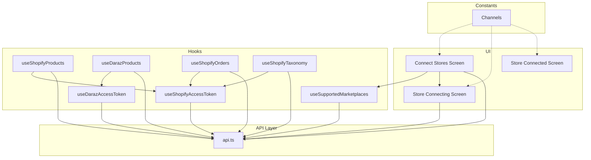
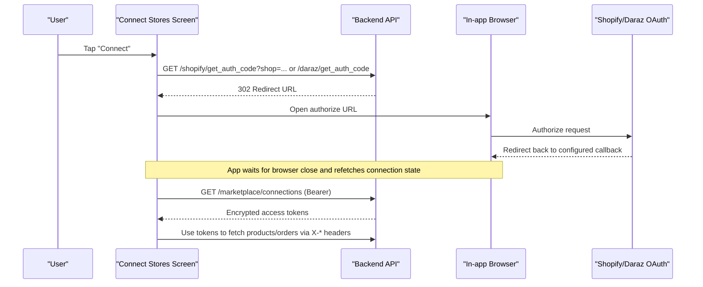
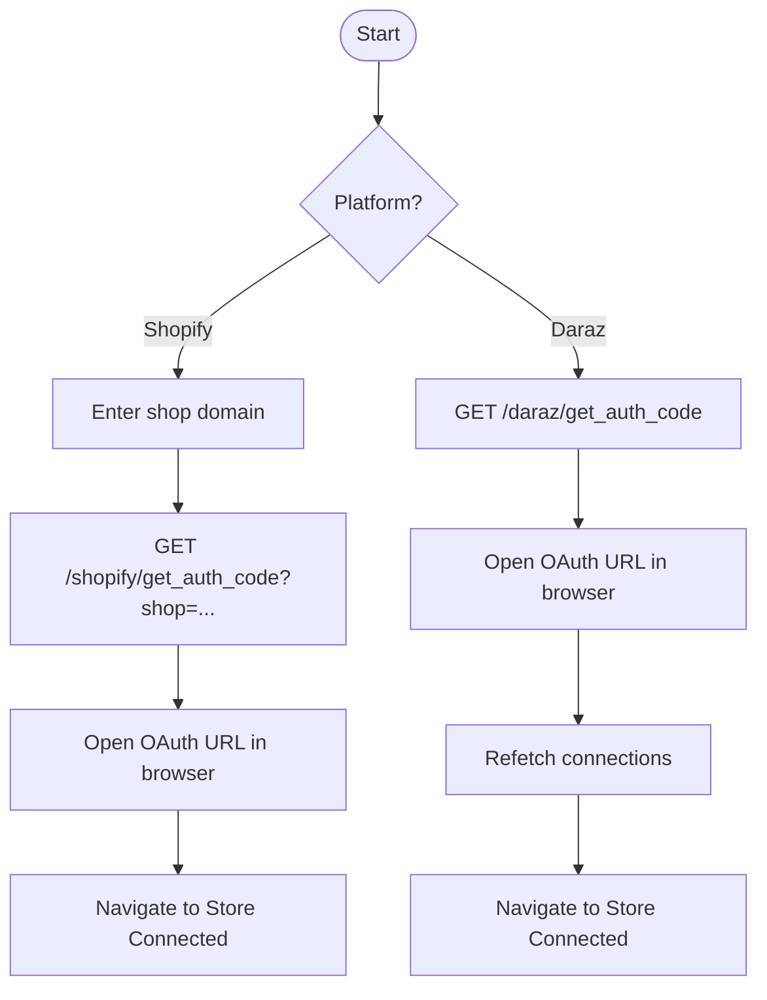
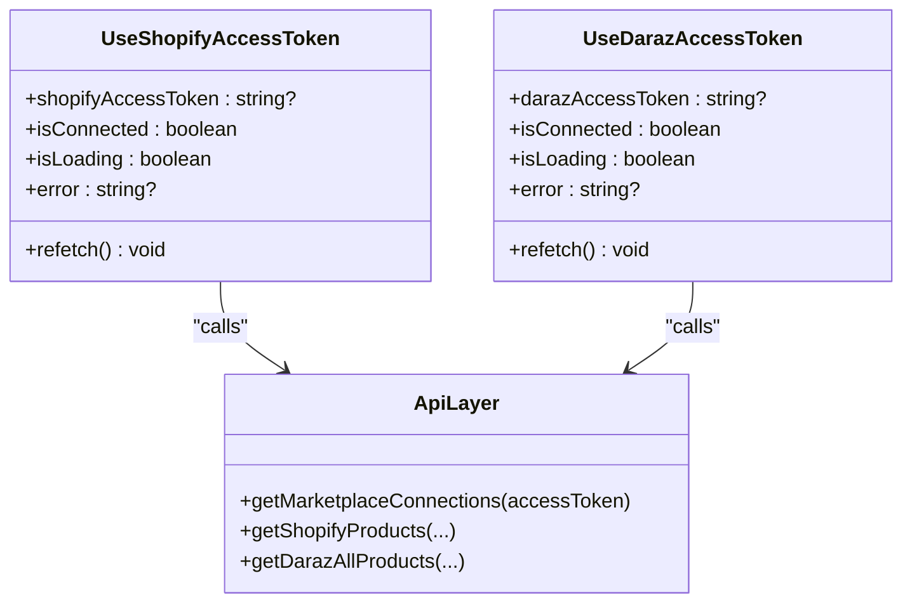
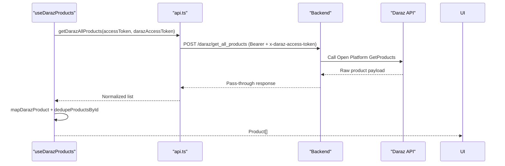
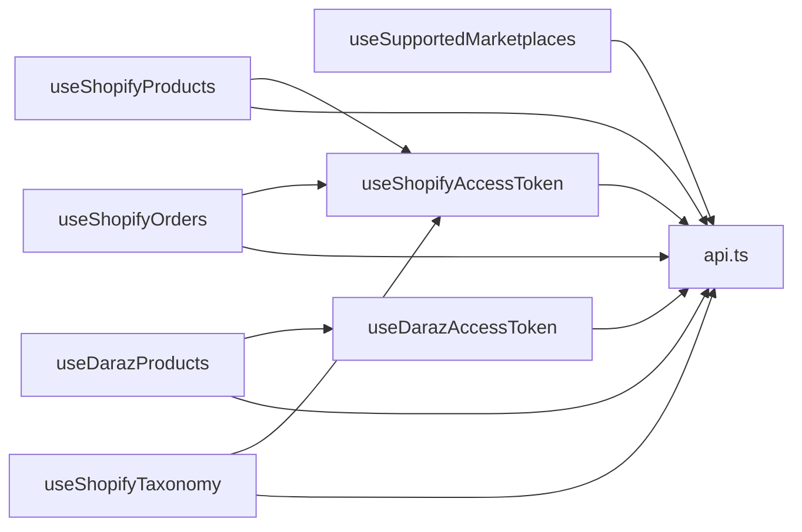

# Marketplace Integration

<cite>
**Referenced Files in This Document**
- [connect-stores.tsx](file://src/app/(app)/connect-stores.tsx)
- [store-connecting.tsx](file://src/app/(app)/store-connecting.tsx)
- [store-connected.tsx](file://src/app/(app)/store-connected.tsx)
- [use-supported-marketplaces.ts](file://src/hooks/use-supported-marketplaces.ts)
- [use-shopify-access-token.ts](file://src/hooks/use-shopify-access-token.ts)
- [use-daraz-access-token.ts](file://src/hooks/use-daraz-access-token.ts)
- [use-shopify-products.ts](file://src/hooks/use-shopify-products.ts)
- [use-daraz-products.ts](file://src/hooks/use-daraz-products.ts)
- [use-shopify-orders.ts](file://src/hooks/use-shopify-orders.ts)
- [use-shopify-taxonomy.ts](file://src/hooks/use-shopify-taxonomy.ts)
- [channels.ts](file://src/constants/channels.ts)
- [api.ts](file://src/lib/api.ts)
</cite>

## Table of Contents
1. Introduction
2. Project Structure
3. Core Components
4. Architecture Overview
5. Detailed Component Analysis
6. Dependency Analysis
7. Performance Considerations
8. Troubleshooting Guide
9. Conclusion

## Introduction
This document explains the marketplace integration capabilities for connecting and synchronizing data with Shopify and Daraz. It covers the store connection flows (including OAuth), access token management, supported marketplaces and requirements, product synchronization and data mapping, error handling strategies, platform-specific considerations, and troubleshooting techniques.

## Project Structure
The marketplace integration spans UI screens, hooks, constants, and a centralized API layer:
- UI screens handle user flows for connecting stores and showing connection status.
- Hooks encapsulate per-marketplace logic: resolving tokens, fetching products/orders, and managing state.
- Constants define channel metadata and ordering.
- The API layer provides HTTP clients, SSE streaming helpers, and typed interfaces for marketplace endpoints.

**Diagram sources**
- [connect-stores.tsx:25-72](file://src/app/(app)/connect-stores.tsx#L25-L72)
- [store-connecting.tsx:19-68](file://src/app/(app)/store-connecting.tsx#L19-L68)
- [store-connected.tsx:14-79](file://src/app/(app)/store-connected.tsx#L14-L79)
- [use-supported-marketplaces.ts:16-53](file://src/hooks/use-supported-marketplaces.ts#L16-L53)
- [use-shopify-access-token.ts:6-30](file://src/hooks/use-shopify-access-token.ts#L6-L30)
- [use-daraz-access-token.ts:19-65](file://src/hooks/use-daraz-access-token.ts#L19-L65)
- [use-shopify-products.ts:27-49](file://src/hooks/use-shopify-products.ts#L27-L49)
- [use-daraz-products.ts:120-183](file://src/hooks/use-daraz-products.ts#L120-L183)
- [use-shopify-orders.ts:7-26](file://src/hooks/use-shopify-orders.ts#L7-L26)
- [use-shopify-taxonomy.ts:7-38](file://src/hooks/use-shopify-taxonomy.ts#L7-L38)
- [channels.ts:1-26](file://src/constants/channels.ts#L1-L26)
- [api.ts:344-436](file://src/lib/api.ts#L344-L436)

**Section sources**
- [connect-stores.tsx:25-72](file://src/app/(app)/connect-stores.tsx#L25-L72)
- [store-connecting.tsx:19-68](file://src/app/(app)/store-connecting.tsx#L19-L68)
- [store-connected.tsx:14-79](file://src/app/(app)/store-connected.tsx#L14-L79)
- [use-supported-marketplaces.ts:16-53](file://src/hooks/use-supported-marketplaces.ts#L16-L53)
- [use-shopify-access-token.ts:6-30](file://src/hooks/use-shopify-access-token.ts#L6-L30)
- [use-daraz-access-token.ts:19-65](file://src/hooks/use-daraz-access-token.ts#L19-L65)
- [use-shopify-products.ts:27-49](file://src/hooks/use-shopify-products.ts#L27-L49)
- [use-daraz-products.ts:120-183](file://src/hooks/use-daraz-products.ts#L120-L183)
- [use-shopify-orders.ts:7-26](file://src/hooks/use-shopify-orders.ts#L7-L26)
- [use-shopify-taxonomy.ts:7-38](file://src/hooks/use-shopify-taxonomy.ts#L7-L38)
- [channels.ts:1-26](file://src/constants/channels.ts#L1-L26)
- [api.ts:344-436](file://src/lib/api.ts#L344-L436)

## Core Components
- Store connection screens:
  - Connect Stores lists available marketplaces and initiates connections.
  - Store Connecting handles OAuth redirects and shows progress steps.
  - Store Connected confirms success and indicates what will be synced.
- Access token resolution:
  - useShopifyAccessToken and useDarazAccessToken fetch encrypted tokens from the backend via /marketplace/connections and expose isConnected flags.
- Product and order sync:
  - useShopifyProducts and useDarazProducts fetch and normalize catalog items into a unified Product type.
  - useShopifyOrders retrieves orders for connected Shopify stores.
- Supported marketplaces:
  - useSupportedMarketplaces enumerates available channels and their connection states.
  - Channels defines display metadata and ordering.

**Section sources**
- [connect-stores.tsx:25-72](file://src/app/(app)/connect-stores.tsx#L25-L72)
- [store-connecting.tsx:19-68](file://src/app/(app)/store-connecting.tsx#L19-L68)
- [store-connected.tsx:14-79](file://src/app/(app)/store-connected.tsx#L14-L79)
- [use-shopify-access-token.ts:6-30](file://src/hooks/use-shopify-access-token.ts#L6-L30)
- [use-daraz-access-token.ts:19-65](file://src/hooks/use-daraz-access-token.ts#L19-L65)
- [use-shopify-products.ts:27-49](file://src/hooks/use-shopify-products.ts#L27-L49)
- [use-daraz-products.ts:120-183](file://src/hooks/use-daraz-products.ts#L120-L183)
- [use-shopify-orders.ts:7-26](file://src/hooks/use-shopify-orders.ts#L7-L26)
- [use-supported-marketplaces.ts:16-53](file://src/hooks/use-supported-marketplaces.ts#L16-L53)
- [channels.ts:1-26](file://src/constants/channels.ts#L1-L26)

## Architecture Overview
The app uses a Bearer-protected backend to manage marketplace integrations. UI triggers initiate OAuth flows that redirect users to platform authorization pages. After authorization, the backend records encrypted access tokens which are later used by hooks to call marketplace APIs through the app’s backend.

**Diagram sources**
- [connect-stores.tsx:41-72](file://src/app/(app)/connect-stores.tsx#L41-L72)
- [store-connecting.tsx:31-68](file://src/app/(app)/store-connecting.tsx#L31-L68)
- [api.ts:374-436](file://src/lib/api.ts#L374-L436)
- [api.ts:368-372](file://src/lib/api.ts#L368-L372)

## Detailed Component Analysis

### Store Connection Flow (Shopify and Daraz)
- Shopify:
  - User enters shop domain on Connect Stores; navigation passes to Store Connecting.
  - Store Connecting calls getShopifyAuthorizeUrl to obtain an OAuth redirect URL and opens it in the browser.
  - After completion, the app navigates to Store Connected and can refresh connections.
- Daraz:
  - From Connect Stores, the app calls getDarazAuthorizeUrl to open Daraz’s OAuth page.
  - After closing the browser, the app refetches connections to detect the new link.

**Diagram sources**
- [connect-stores.tsx:41-72](file://src/app/(app)/connect-stores.tsx#L41-L72)
- [store-connecting.tsx:31-68](file://src/app/(app)/store-connecting.tsx#L31-L68)
- [api.ts:374-436](file://src/lib/api.ts#L374-L436)

**Section sources**
- [connect-stores.tsx:41-93](file://src/app/(app)/connect-stores.tsx#L41-L93)
- [store-connecting.tsx:31-68](file://src/app/(app)/store-connecting.tsx#L31-L68)
- [api.ts:374-436](file://src/lib/api.ts#L374-L436)

### Access Token Management and Secure Storage
- Tokens are stored server-side as encrypted_access_token within marketplace connections.
- Hooks retrieve them by calling /marketplace/connections with the user’s Bearer token.
- For each marketplace, a dedicated hook exposes:
  - isConnected flag based on presence of an encrypted token.
  - A refetch method to re-resolve tokens after connection changes.
- When calling marketplace endpoints, the app attaches the encrypted token via a custom header (e.g., x-daraz-access-token, x-shopify-access-token).

**Diagram sources**
- [use-shopify-access-token.ts:6-30](file://src/hooks/use-shopify-access-token.ts#L6-L30)
- [use-daraz-access-token.ts:19-65](file://src/hooks/use-daraz-access-token.ts#L19-L65)
- [api.ts:368-372](file://src/lib/api.ts#L368-L372)
- [api.ts:1072-1093](file://src/lib/api.ts#L1072-L1093)

**Section sources**
- [use-shopify-access-token.ts:6-30](file://src/hooks/use-shopify-access-token.ts#L6-L30)
- [use-daraz-access-token.ts:19-65](file://src/hooks/use-daraz-access-token.ts#L19-L65)
- [api.ts:368-372](file://src/lib/api.ts#L368-L372)
- [api.ts:1072-1093](file://src/lib/api.ts#L1072-L1093)

### Supported Marketplaces and Requirements
- Supported channels include Shopify, Daraz, and Amazon (metadata only for Amazon at this time).
- Requirements:
  - Shopify: Requires a valid shop domain and successful OAuth flow.
  - Daraz: Requires completing OAuth via the provided authorize endpoint.
  - Amazon: Listed but not yet implemented for live connections in the current code paths.

**Section sources**
- [channels.ts:1-26](file://src/constants/channels.ts#L1-L26)
- [connect-stores.tsx:41-72](file://src/app/(app)/connect-stores.tsx#L41-L72)
- [store-connecting.tsx:31-68](file://src/app/(app)/store-connecting.tsx#L31-L68)

### Product Synchronization and Data Mapping
- Shopify:
  - Products are fetched via /shopify/get_all_products using the encrypted Shopify access token passed in a custom header.
  - Products are mapped to a unified Product shape, including images, price, category, stock quantity, and platform tag.
- Daraz:
  - Products are fetched via /daraz/get_all_products using the encrypted Daraz access token passed in a custom header.
  - Raw responses are normalized to extract item_id, attributes, skus, images, prices, and URLs, then mapped to Product.
  - Returns insights and reverse orders are also supported via SSE streams and specific endpoints.

**Diagram sources**
- [use-daraz-products.ts:120-183](file://src/hooks/use-daraz-products.ts#L120-L183)
- [api.ts:448-459](file://src/lib/api.ts#L448-L459)
- [api.ts:983-1006](file://src/lib/api.ts#L983-L1006)

**Section sources**
- [use-shopify-products.ts:7-49](file://src/hooks/use-shopify-products.ts#L7-L49)
- [use-daraz-products.ts:19-96](file://src/hooks/use-daraz-products.ts#L19-L96)
- [use-daraz-products.ts:120-183](file://src/hooks/use-daraz-products.ts#L120-L183)
- [api.ts:1076-1093](file://src/lib/api.ts#L1076-L1093)
- [api.ts:448-459](file://src/lib/api.ts#L448-L459)

### Implementing a New Marketplace Adapter
Follow these patterns to add a new marketplace:
- Define channel metadata in channels if needed.
- Add OAuth entry points in the API layer (similar to getShopifyAuthorizeUrl/getDarazAuthorizeUrl).
- Create a hook to resolve the encrypted access token from /marketplace/connections.
- Implement data-fetching functions that pass the encrypted token via a custom header.
- Map raw responses to the unified Product type and deduplicate where necessary.
- Wire up UI flows in connect-stores and store-connecting to trigger the new adapter.

**Section sources**
- [channels.ts:1-26](file://src/constants/channels.ts#L1-L26)
- [api.ts:374-436](file://src/lib/api.ts#L374-L436)
- [use-shopify-access-token.ts:6-30](file://src/hooks/use-shopify-access-token.ts#L6-L30)
- [use-daraz-access-token.ts:19-65](file://src/hooks/use-daraz-access-token.ts#L19-L65)
- [use-shopify-products.ts:27-49](file://src/hooks/use-shopify-products.ts#L27-L49)
- [use-daraz-products.ts:120-183](file://src/hooks/use-daraz-products.ts#L120-L183)

### Error Handling Strategies
- Network failures:
  - The request wrapper catches fetch errors and throws ApiError with a user-friendly message.
  - SSE requests use XHR on non-web platforms and provide consistent error handling.
- API errors:
  - Non-OK responses throw ApiError with messages extracted from backend detail structures.
  - SSE error events are converted to ApiError with detail extraction.
- Rate limiting and retries:
  - No built-in retry/backoff is present in the current client; implement exponential backoff at the hook level for transient errors (e.g., 429/5xx).
  - Consider debouncing rapid refetches and batching operations where appropriate.

**Section sources**
- [api.ts:53-77](file://src/lib/api.ts#L53-L77)
- [api.ts:215-286](file://src/lib/api.ts#L215-L286)
- [use-supported-marketplaces.ts:25-50](file://src/hooks/use-supported-marketplaces.ts#L25-L50)
- [use-daraz-products.ts:155-175](file://src/hooks/use-daraz-products.ts#L155-L175)

### Platform-Specific Considerations and Limitations
- Shopify:
  - Requires a valid shop domain; OAuth handled via backend redirect.
  - Products, categories, collections, and orders are supported via dedicated endpoints.
- Daraz:
  - Uses encrypted access tokens passed via a custom header.
  - Product creation and returns insights leverage SSE streams for long-running tasks.
  - Image migration utilities exist to move images between storage locations.
- Amazon:
  - Metadata exists but no active integration endpoints are invoked in the current flows.

**Section sources**
- [store-connecting.tsx:31-68](file://src/app/(app)/store-connecting.tsx#L31-L68)
- [api.ts:1076-1093](file://src/lib/api.ts#L1076-L1093)
- [api.ts:1196-1281](file://src/lib/api.ts#L1196-L1281)
- [api.ts:915-952](file://src/lib/api.ts#L915-L952)
- [channels.ts:1-26](file://src/constants/channels.ts#L1-L26)

## Dependency Analysis
The following diagram highlights key dependencies among hooks and the API layer:

**Diagram sources**
- [use-supported-marketplaces.ts:16-53](file://src/hooks/use-supported-marketplaces.ts#L16-L53)
- [use-shopify-access-token.ts:6-30](file://src/hooks/use-shopify-access-token.ts#L6-L30)
- [use-daraz-access-token.ts:19-65](file://src/hooks/use-daraz-access-token.ts#L19-L65)
- [use-shopify-products.ts:27-49](file://src/hooks/use-shopify-products.ts#L27-L49)
- [use-daraz-products.ts:120-183](file://src/hooks/use-daraz-products.ts#L120-L183)
- [use-shopify-orders.ts:7-26](file://src/hooks/use-shopify-orders.ts#L7-L26)
- [use-shopify-taxonomy.ts:7-38](file://src/hooks/use-shopify-taxonomy.ts#L7-L38)
- [api.ts:368-372](file://src/lib/api.ts#L368-L372)

**Section sources**
- [use-supported-marketplaces.ts:16-53](file://src/hooks/use-supported-marketplaces.ts#L16-L53)
- [use-shopify-access-token.ts:6-30](file://src/hooks/use-shopify-access-token.ts#L6-L30)
- [use-daraz-access-token.ts:19-65](file://src/hooks/use-daraz-access-token.ts#L19-L65)
- [use-shopify-products.ts:27-49](file://src/hooks/use-shopify-products.ts#L27-L49)
- [use-daraz-products.ts:120-183](file://src/hooks/use-daraz-products.ts#L120-L183)
- [use-shopify-orders.ts:7-26](file://src/hooks/use-shopify-orders.ts#L7-L26)
- [use-shopify-taxonomy.ts:7-38](file://src/hooks/use-shopify-taxonomy.ts#L7-L38)
- [api.ts:368-372](file://src/lib/api.ts#L368-L372)

## Performance Considerations
- Avoid redundant network calls:
  - Use refetch keys to invalidate caches only when necessary.
  - Coalesce multiple refetches triggered by UI actions.
- Optimize product listing:
  - Deduplicate products by id to prevent duplicate entries.
  - Prefer minimal payloads; avoid loading large image arrays unless needed.
- Streaming features:
  - Leverage SSE for long-running tasks (returns insights, review analysis) to keep UI responsive.
- Caching strategy:
  - Consider local caching of taxonomy and collections to reduce repeated requests.

[No sources needed since this section provides general guidance]

## Troubleshooting Guide
Common issues and debugging steps:
- Cannot reach server:
  - Check network connectivity; the API layer throws a friendly error when fetch fails.
- OAuth flow does not complete:
  - Ensure the backend callback URL is correctly configured for the platform.
  - Verify that the app refetches connections after closing the browser.
- Missing encrypted access token:
  - Confirm that the marketplace connection exists and is marked as connected.
  - Re-run the connection flow and verify /marketplace/connections returns the token.
- Product load failures:
  - Inspect the error message from ApiError; check for rate limits or invalid scopes.
  - Validate that the correct encrypted token is attached via the custom header.
- SSE stream ends without result:
  - Ensure the backend emits a complete event; otherwise, the client rejects with a generic message.

**Section sources**
- [api.ts:53-77](file://src/lib/api.ts#L53-L77)
- [api.ts:215-286](file://src/lib/api.ts#L215-L286)
- [connect-stores.tsx:57-72](file://src/app/(app)/connect-stores.tsx#L57-L72)
- [store-connecting.tsx:47-68](file://src/app/(app)/store-connecting.tsx#L47-L68)
- [use-daraz-products.ts:155-175](file://src/hooks/use-daraz-products.ts#L155-L175)

## Conclusion
The marketplace integration provides robust support for connecting Shopify and Daraz stores through secure OAuth flows and server-managed encrypted tokens. Products and orders are synchronized via well-defined API endpoints and normalized into a unified model. Error handling is consistent across requests and streams. To extend support to additional marketplaces, follow the established patterns for OAuth, token resolution, data fetching, and mapping.

[No sources needed since this section summarizes without analyzing specific files]