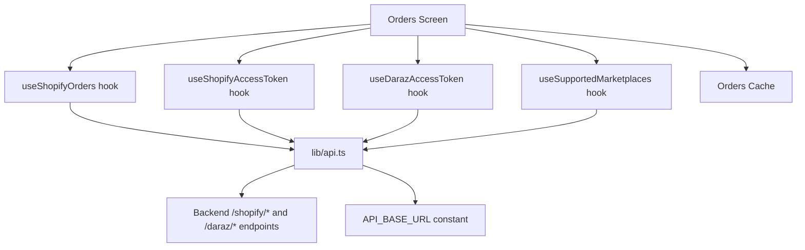
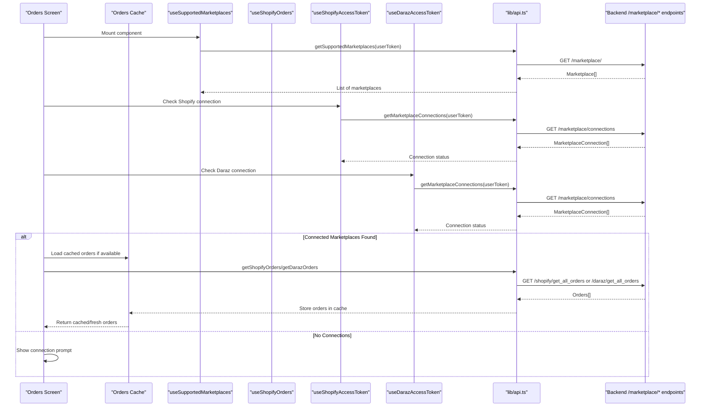
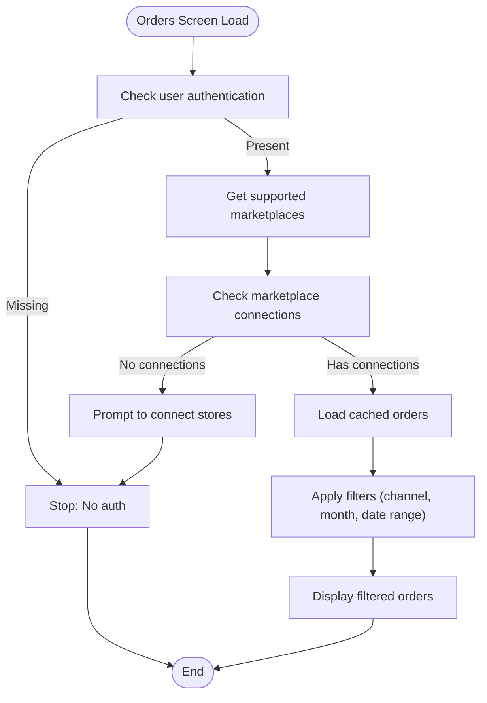
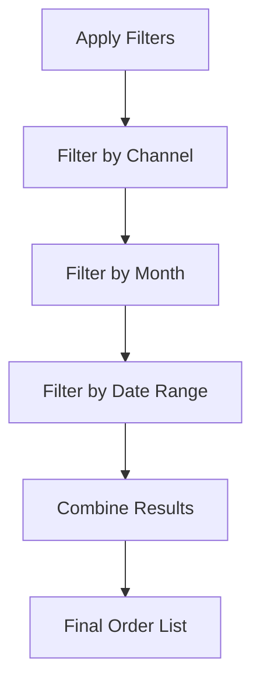

# Order Management

<cite>
**Referenced Files in This Document**
- [use-shopify-orders.ts](file://src/hooks/use-shopify-orders.ts)
- [use-shopify-access-token.ts](file://src/hooks/use-shopify-access-token.ts)
- [use-supported-marketplaces.ts](file://src/hooks/use-supported-marketplaces.ts)
- [orders.tsx](file://src/app/(app)/orders.tsx)
- [order-detail.tsx](file://src/app/(app)/order-detail.tsx)
- [api.ts](file://src/lib/api.ts)
- [api.ts (constants)](file://src/constants/api.ts)
- [channels.ts](file://src/constants/channels.ts)
</cite>

## Update Summary
**Changes Made**
- Added multi-marketplace support with unified order management for Shopify and Daraz
- Implemented enhanced filtering with month-based selection and custom date ranges
- Added caching mechanisms for improved performance and offline support
- Enhanced UI with real-time status updates and optimistic loading states
- Expanded order detail view to support multiple marketplace formats

## Table of Contents
1. Introduction
2. Project Structure
3. Core Components
4. Architecture Overview
5. Detailed Component Analysis
6. Multi-Marketplace Support
7. Enhanced Filtering and Search
8. Performance Optimizations
9. Error Handling and Recovery
10. Conclusion

## Introduction
This document explains the comprehensive order management functionality implemented in the application, supporting multiple marketplaces including Shopify and Daraz. It covers how orders are retrieved from connected stores, how connection and authentication work across different platforms, and how the UI layer consumes and displays order data with advanced filtering capabilities. The system provides robust order processing workflows including creation, modification, cancellation, fulfillment updates, event handling, synchronization patterns, conflict resolution, error handling, retry strategies, and logging.

## Project Structure
The enhanced order management system is implemented through:
- A unified orders screen supporting multiple marketplaces
- Individual hooks for each marketplace's access token management
- A marketplace discovery hook for supported platforms
- API modules with typed models and HTTP calls for each marketplace
- Constants for base URL configuration and channel metadata
- Caching mechanisms for improved performance

**Diagram sources**
- [orders.tsx:122-271](file://src/app/(app)/orders.tsx#L122-L271)
- [use-shopify-orders.ts:7-26](file://src/hooks/use-shopify-orders.ts#L7-L26)
- [use-shopify-access-token.ts:6-30](file://src/hooks/use-shopify-access-token.ts#L6-L30)
- [use-supported-marketplaces.ts:16-53](file://src/hooks/use-supported-marketplaces.ts#L16-L53)
- [api.ts:1182-1206](file://src/lib/api.ts#L1182-L1206)

**Section sources**
- [orders.tsx:122-271](file://src/app/(app)/orders.tsx#L122-L271)
- [use-shopify-orders.ts:7-26](file://src/hooks/use-shopify-orders.ts#L7-L26)
- [use-shopify-access-token.ts:6-30](file://src/hooks/use-shopify-access-token.ts#L6-L30)
- [use-supported-marketplaces.ts:16-53](file://src/hooks/use-supported-marketplaces.ts#L16-L53)
- [api.ts:1182-1206](file://src/lib/api.ts#L1182-L1206)

## Core Components
- **Unified Orders Screen**: Manages state for loading, errors, and fetching orders from multiple marketplaces with advanced filtering
- **useShopifyOrders**: Manages Shopify-specific order state and retrieval
- **useShopifyAccessToken**: Retrieves encrypted Shopify access tokens and manages connection status
- **useSupportedMarketplaces**: Discovers and manages supported marketplace connections
- **Order Detail Screen**: Displays detailed information for individual orders from any marketplace
- **API Layer**: Provides typed functions for marketplace-specific operations with unified error handling

Key responsibilities:
- **Multi-channel data retrieval**: Fetching orders from Shopify, Daraz, and other connected marketplaces
- **Connection management**: Ensuring valid access tokens exist for each marketplace
- **Advanced filtering**: Month-based selection and custom date range filtering
- **Performance optimization**: Caching orders per marketplace for faster subsequent loads
- **Error handling**: Normalizing API errors into user-friendly messages across all marketplaces
- **State management**: Loading states, error states, and refetch triggers with optimistic updates

**Section sources**
- [orders.tsx:122-271](file://src/app/(app)/orders.tsx#L122-L271)
- [use-shopify-orders.ts:7-26](file://src/hooks/use-shopify-orders.ts#L7-L26)
- [use-shopify-access-token.ts:6-30](file://src/hooks/use-shopify-access-token.ts#L6-L30)
- [use-supported-marketplaces.ts:16-53](file://src/hooks/use-supported-marketplaces.ts#L16-L53)
- [order-detail.tsx:19-75](file://src/app/(app)/order-detail.tsx#L19-L75)

## Architecture Overview
The enhanced order retrieval flow uses a layered approach with multi-marketplace support:
- The unified Orders screen consumes marketplace data and provides filtering capabilities
- Individual hooks manage authentication and connection status for each marketplace
- The API layer constructs appropriate headers for each marketplace's requirements
- Caching mechanisms improve performance by storing orders per marketplace
- Real-time updates provide immediate feedback during data refreshes

**Diagram sources**
- [orders.tsx:216-271](file://src/app/(app)/orders.tsx#L216-L271)
- [use-shopify-access-token.ts:14-27](file://src/hooks/use-shopify-access-token.ts#L14-L27)
- [use-supported-marketplaces.ts:25-50](file://src/hooks/use-supported-marketplaces.ts#L25-L50)
- [api.ts:399-403](file://src/lib/api.ts#L399-L403)

## Detailed Component Analysis

### Unified Orders Screen with Multi-Marketplace Support
The main orders screen now supports multiple marketplaces with advanced filtering capabilities:

- **Marketplace Discovery**: Automatically detects connected marketplaces and their status
- **Channel Selection**: Allows users to filter orders by specific marketplace or view all
- **Advanced Filtering**: Implements month-based selection and custom date range filtering
- **Caching Strategy**: Stores orders per marketplace for improved performance
- **Real-time Updates**: Shows "Updating orders..." status during refreshes

**Diagram sources**
- [orders.tsx:216-271](file://src/app/(app)/orders.tsx#L216-L271)

**Section sources**
- [orders.tsx:122-271](file://src/app/(app)/orders.tsx#L122-L271)

### Enhanced Filtering System
The filtering system provides multiple ways to narrow down orders:

- **Month-based filtering**: Extracts months from order dates and creates selectable options
- **Date range filtering**: Allows custom start and end date selection with validation
- **Channel filtering**: Filters by specific marketplace (Shopify, Daraz, etc.)
- **Combined filtering**: All filters work together for precise order selection

**Diagram sources**
- [orders.tsx:174-201](file://src/app/(app)/orders.tsx#L174-L201)

**Section sources**
- [orders.tsx:174-201](file://src/app/(app)/orders.tsx#L174-L201)

### Caching Mechanisms
The system implements intelligent caching to improve performance:

- **Per-channel caching**: Orders are cached separately for each marketplace
- **Automatic cache usage**: Cached orders are displayed immediately while fresh data loads
- **Cache invalidation**: Cache is refreshed when connections change or manual refresh occurs
- **Memory management**: Uses Map data structure for efficient cache operations

**Section sources**
- [orders.tsx:38-39](file://src/app/(app)/orders.tsx#L38-L39)
- [orders.tsx:221-237](file://src/app/(app)/orders.tsx#L221-L237)

### Real-time Status Updates
The UI provides immediate feedback during operations:

- **Loading states**: Shows appropriate loading indicators during data fetch
- **Update notifications**: Displays "Updating orders..." during refresh operations
- **Error states**: Provides clear error messages with retry options
- **Optimistic updates**: Shows cached data immediately while refreshing

**Section sources**
- [orders.tsx:536-552](file://src/app/(app)/orders.tsx#L536-L552)

### Multi-Marketplace Order Detail View
The order detail screen handles different marketplace formats:

- **Unified interface**: Same UI regardless of marketplace source
- **Format adaptation**: Handles different field names and structures between marketplaces
- **Rich display**: Shows order details, items, shipping information, and status
- **Marketplace-specific features**: Displays unique fields like buyer notes for Daraz orders

**Section sources**
- [order-detail.tsx:19-75](file://src/app/(app)/order-detail.tsx#L19-L75)

## Multi-Marketplace Support

### Supported Marketplaces
The system currently supports:
- **Shopify**: Full order management with line items, customer details, and fulfillment status
- **Daraz**: Comprehensive order handling with shipping addresses, buyer notes, and payment methods
- **Extensible architecture**: Designed to easily add new marketplace support

### Marketplace Connection Management
- **Automatic discovery**: Detects connected marketplaces and their status
- **Token management**: Securely handles encrypted access tokens for each marketplace
- **Connection validation**: Verifies marketplace connections before attempting API calls
- **Error recovery**: Gracefully handles connection failures with user feedback

### Unified Data Model
The system normalizes marketplace-specific data into common structures:
- **Order abstraction**: Common order properties across all marketplaces
- **Line item standardization**: Unified product and quantity representation
- **Customer information**: Consistent customer data format
- **Status mapping**: Maps marketplace-specific statuses to common states

**Section sources**
- [channels.ts:1-26](file://src/constants/channels.ts#L1-L26)
- [api.ts:1092-1104](file://src/lib/api.ts#L1092-L1104)
- [api.ts:1140-1166](file://src/lib/api.ts#L1140-L1166)

## Enhanced Filtering and Search

### Month-Based Filtering
- **Automatic extraction**: Parses order dates to extract year-month combinations
- **Dynamic options**: Creates filterable month options based on actual order data
- **User-friendly labels**: Formats month selections for easy understanding
- **Default behavior**: "All time" option shows all orders without month filtering

### Custom Date Range Filtering
- **Flexible date selection**: Users can select specific start and end dates
- **Validation**: Ensures logical date ranges and proper formatting
- **Real-time filtering**: Updates order list immediately when date range changes
- **Clear functionality**: Easy way to reset date filters

### Combined Filtering Logic
- **Hierarchical filtering**: Channel → Month → Date Range
- **Performance optimization**: Efficient filtering algorithms for large order sets
- **Visual feedback**: Clear indication of active filters and results count
- **Reset capabilities**: Easy ways to clear individual or all filters

**Section sources**
- [orders.tsx:107-120](file://src/app/(app)/orders.tsx#L107-L120)
- [orders.tsx:174-201](file://src/app/(app)/orders.tsx#L174-L201)
- [orders.tsx:374-498](file://src/app/(app)/orders.tsx#L374-L498)

## Performance Optimizations

### Caching Strategy
- **In-memory caching**: Uses JavaScript Map for fast order storage and retrieval
- **Per-channel isolation**: Separate caches for each marketplace prevent data conflicts
- **Automatic population**: Cache is populated during initial order loading
- **Selective invalidation**: Cache updates only when necessary

### Request Optimization
- **Concurrent requests**: Loads multiple marketplace orders simultaneously
- **Conditional loading**: Only requests data for connected marketplaces
- **Cancellation support**: Prevents memory leaks with request cancellation
- **Error resilience**: Continues loading other marketplaces if one fails

### UI Performance
- **Memoized computations**: Uses useMemo for expensive filtering operations
- **Efficient rendering**: Optimizes list rendering with proper key management
- **Progressive loading**: Shows cached data immediately while refreshing
- **Memory management**: Proper cleanup of event listeners and timers

**Section sources**
- [orders.tsx:38-39](file://src/app/(app)/orders.tsx#L38-L39)
- [orders.tsx:174-201](file://src/app/(app)/orders.tsx#L174-L201)
- [orders.tsx:216-271](file://src/app/(app)/orders.tsx#L216-L271)

## Error Handling and Recovery

### Comprehensive Error Management
- **Network errors**: Handles connectivity issues with user-friendly messages
- **Authentication errors**: Manages expired or invalid tokens gracefully
- **Marketplace-specific errors**: Provides context-aware error messages
- **Fallback strategies**: Attempts alternative approaches when primary methods fail

### User Experience Enhancements
- **Clear error messages**: Translates technical errors into understandable language
- **Retry mechanisms**: Provides easy ways to retry failed operations
- **Graceful degradation**: Shows partial data when some marketplaces fail
- **Connection prompts**: Guides users to reconnect when needed

### Logging and Debugging
- **Structured logging**: Logs important events for debugging purposes
- **Error tracking**: Captures detailed error information for troubleshooting
- **Performance monitoring**: Tracks loading times and operation success rates
- **Development tools**: Includes console logs for development debugging

**Section sources**
- [orders.tsx:249-256](file://src/app/(app)/orders.tsx#L249-L256)
- [orders.tsx:554-565](file://src/app/(app)/orders.tsx#L554-L565)
- [api.ts:53-77](file://src/lib/api.ts#L53-L77)

## Conclusion
The enhanced order management system provides comprehensive multi-marketplace support with advanced filtering, caching, and real-time updates. The implementation successfully addresses the expanded order management capabilities including multi-marketplace support, enhanced filtering with month-based selection and custom date ranges, real-time order status updates, and improved UI with optimistic updates and caching mechanisms.

The system maintains backward compatibility while adding powerful new features that significantly improve the user experience for managing orders across multiple sales channels. The modular architecture ensures easy extensibility for additional marketplaces and features while maintaining consistent performance and reliability standards.

Future enhancements could include real-time WebSocket updates for live order status changes, advanced analytics and reporting capabilities, bulk order operations, and integration with external fulfillment systems. The current foundation provides a solid base for these potential improvements while maintaining the clean, maintainable code structure established in the existing implementation.