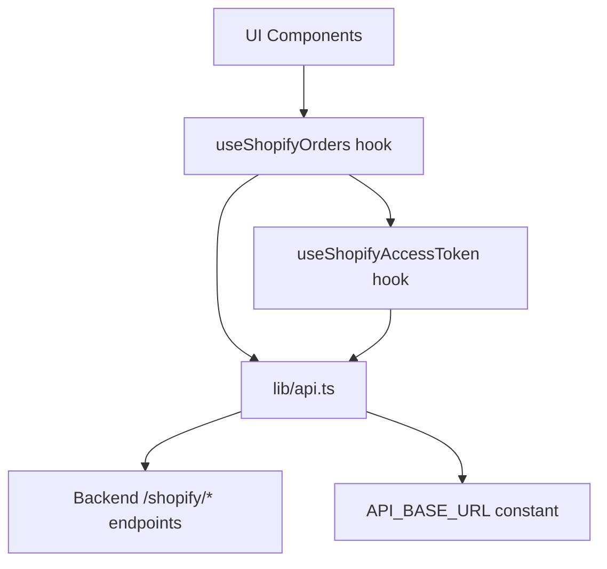
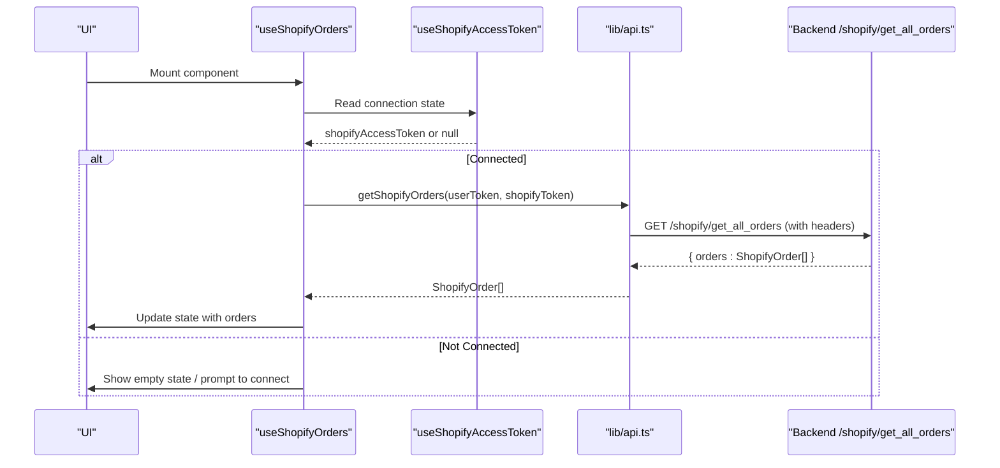
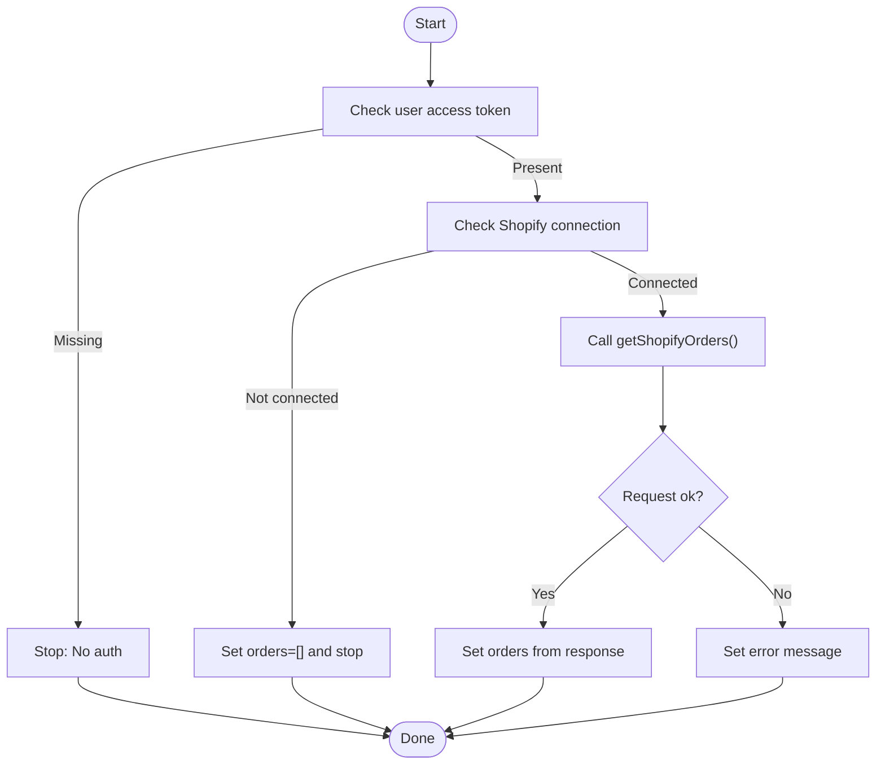
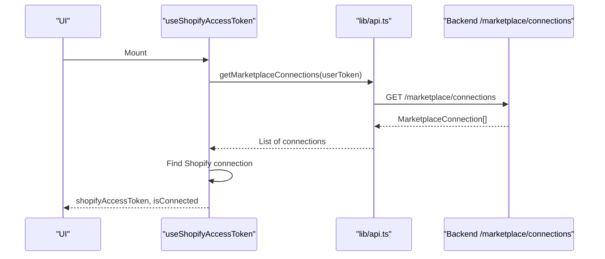
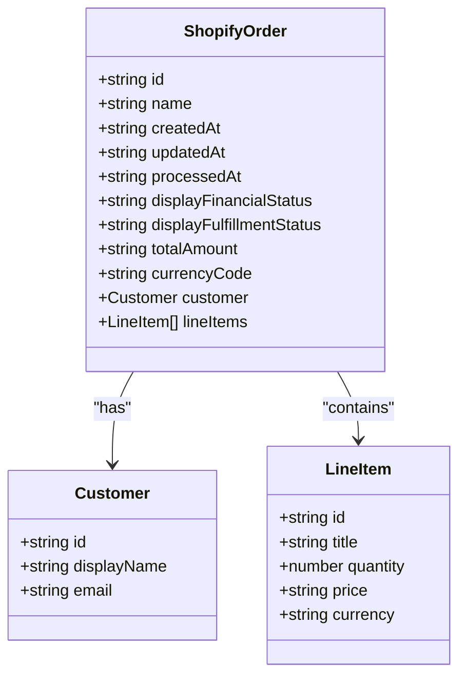
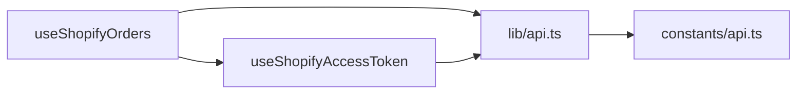

# Order Management

<cite>
**Referenced Files in This Document**
- [use-shopify-orders.ts](file://src/hooks/use-shopify-orders.ts)
- [use-shopify-access-token.ts](file://src/hooks/use-shopify-access-token.ts)
- [api.ts](file://src/lib/api.ts)
- [api.ts (constants)](file://src/constants/api.ts)
- [channels.ts](file://src/constants/channels.ts)
</cite>

## Table of Contents
1. Introduction
2. Project Structure
3. Core Components
4. Architecture Overview
5. Detailed Component Analysis
6. Dependency Analysis
7. Performance Considerations
8. Troubleshooting Guide
9. Conclusion

## Introduction
This document explains the Shopify order management functionality implemented in the application. It covers how orders are retrieved, how connection and authentication work, and how the UI layer consumes order data. It also provides guidance on extending the system to support order processing workflows such as creation, modification, cancellation, fulfillment updates, event handling, synchronization patterns, conflict resolution, error handling, retry strategies, and logging. Where applicable, it maps concepts to Shopify-specific order elements like line items, shipping details, and payment status using the types and endpoints present in the codebase.

## Project Structure
The Shopify order feature is primarily implemented through:
- A React hook that fetches orders from the backend
- A hook that retrieves the Shopify access token for a connected store
- An API module that defines typed models and HTTP calls
- Constants for base URL configuration and channel metadata

**Diagram sources**
- [use-shopify-orders.ts:7-25](file://src/hooks/use-shopify-orders.ts#L7-L25)
- [use-shopify-access-token.ts:6-29](file://src/hooks/use-shopify-access-token.ts#L6-L29)
- [api.ts:1091-1093](file://src/lib/api.ts#L1091-L1093)
- [api.ts:1072-1074](file://src/lib/api.ts#L1072-L1074)
- [api.ts (constants):10-15](file://src/constants/api.ts#L10-L15)

**Section sources**
- [use-shopify-orders.ts:7-25](file://src/hooks/use-shopify-orders.ts#L7-L25)
- [use-shopify-access-token.ts:6-29](file://src/hooks/use-shopify-access-token.ts#L6-L29)
- [api.ts:1091-1093](file://src/lib/api.ts#L1091-L1093)
- [api.ts:1072-1074](file://src/lib/api.ts#L1072-L1074)
- [api.ts (constants):10-15](file://src/constants/api.ts#L10-L15)

## Core Components
- useShopifyOrders: Manages state for loading, errors, and fetching Shopify orders. It depends on authentication and the Shopify access token, then calls the backend to retrieve orders.
- useShopifyAccessToken: Retrieves the encrypted Shopify access token from marketplace connections and exposes connection status.
- lib/api.ts: Defines the ShopifyOrder type, helper headers for Shopify requests, and the getShopifyOrders function that calls the backend endpoint.
- constants/api.ts: Provides the backend base URL used by all API calls.
- constants/channels.ts: Documents the Shopify channel identity used across the app.

Key responsibilities:
- Data retrieval: Fetching orders via getShopifyOrders
- Connection management: Ensuring a valid Shopify access token exists
- Error handling: Normalizing API errors into user-friendly messages
- State management: Loading states, error states, and refetch triggers

**Section sources**
- [use-shopify-orders.ts:7-25](file://src/hooks/use-shopify-orders.ts#L7-L25)
- [use-shopify-access-token.ts:6-29](file://src/hooks/use-shopify-access-token.ts#L6-L29)
- [api.ts:1058-1070](file://src/lib/api.ts#L1058-L1070)
- [api.ts:1091-1093](file://src/lib/api.ts#L1091-L1093)
- [api.ts (constants):10-15](file://src/constants/api.ts#L10-L15)
- [channels.ts:1-25](file://src/constants/channels.ts#L1-L25)

## Architecture Overview
The order retrieval flow uses a layered approach:
- The UI consumes useShopifyOrders to display orders
- The hook ensures an authenticated session and a Shopify connection
- The API module constructs headers with both the user’s access token and the Shopify access token
- The backend endpoint returns a list of orders mapped to the ShopifyOrder type

**Diagram sources**
- [use-shopify-orders.ts:15-24](file://src/hooks/use-shopify-orders.ts#L15-L24)
- [use-shopify-access-token.ts:14-27](file://src/hooks/use-shopify-access-token.ts#L14-L27)
- [api.ts:1072-1093](file://src/lib/api.ts#L1072-L1093)

## Detailed Component Analysis

### Shopify Order Retrieval Flow
- Authentication and connection:
  - The hook reads the user’s access token and checks for a Shopify connection
  - If no connection exists, it sets an empty order list and stops loading
- Data fetching:
  - Calls getShopifyOrders with both tokens
  - Sets loading state before request and clears error state
  - Updates local state with returned orders
- Error handling:
  - Catches ApiError instances and surfaces a user-friendly message
  - Uses finally to ensure loading state is cleared

**Diagram sources**
- [use-shopify-orders.ts:15-24](file://src/hooks/use-shopify-orders.ts#L15-L24)

**Section sources**
- [use-shopify-orders.ts:7-25](file://src/hooks/use-shopify-orders.ts#L7-L25)

### Shopify Access Token Management
- Purpose: Retrieve the encrypted Shopify access token from marketplace connections
- Behavior:
  - Reads user access token
  - Calls getMarketplaceConnections to find a Shopify connection
  - Exposes isConnected flag based on presence of encrypted_access_token
  - Supports refetch to refresh connection state

**Diagram sources**
- [use-shopify-access-token.ts:14-27](file://src/hooks/use-shopify-access-token.ts#L14-L27)
- [api.ts:368-372](file://src/lib/api.ts#L368-L372)

**Section sources**
- [use-shopify-access-token.ts:6-29](file://src/hooks/use-shopify-access-token.ts#L6-L29)
- [api.ts:368-372](file://src/lib/api.ts#L368-L372)

### API Layer and ShopifyOrder Model
- Headers:
  - shopifyHeaders combines Authorization and x-shopify-access-token for secure Shopify calls
- Endpoints:
  - getShopifyOrders calls /shopify/get_all_orders and returns an array of ShopifyOrder
- Model:
  - ShopifyOrder includes id, name, timestamps, financial and fulfillment statuses, totals, currency, customer info, and lineItems

**Diagram sources**
- [api.ts:1058-1070](file://src/lib/api.ts#L1058-L1070)

**Section sources**
- [api.ts:1072-1093](file://src/lib/api.ts#L1072-L1093)
- [api.ts:1058-1070](file://src/lib/api.ts#L1058-L1070)

### Channel Identity
- Channels define platform identities and benefits; Shopify is listed with its benefit description
- Used to identify and label Shopify-related features consistently

**Section sources**
- [channels.ts:1-25](file://src/constants/channels.ts#L1-L25)

## Dependency Analysis
- useShopifyOrders depends on:
  - useAuth (via useAuth import)
  - useShopifyAccessToken
  - lib/api.ts for getShopifyOrders and ApiError
- useShopifyAccessToken depends on:
  - useAuth
  - lib/api.ts for getMarketplaceConnections
- lib/api.ts depends on:
  - constants/api.ts for API_BASE_URL
  - Platform detection for streaming behavior (not directly used here but part of the module)

**Diagram sources**
- [use-shopify-orders.ts:1-5](file://src/hooks/use-shopify-orders.ts#L1-L5)
- [use-shopify-access-token.ts:1-4](file://src/hooks/use-shopify-access-token.ts#L1-L4)
- [api.ts:1-3](file://src/lib/api.ts#L1-L3)

**Section sources**
- [use-shopify-orders.ts:1-5](file://src/hooks/use-shopify-orders.ts#L1-L5)
- [use-shopify-access-token.ts:1-4](file://src/hooks/use-shopify-access-token.ts#L1-L4)
- [api.ts:1-3](file://src/lib/api.ts#L1-L3)

## Performance Considerations
- Avoid redundant requests:
  - The hooks guard against unnecessary calls when tokens are missing or still loading
- Refetch strategy:
  - Use the provided refetch functions to trigger fresh data loads after connection changes or manual refresh actions
- Error resilience:
  - Centralized error extraction ensures consistent messaging without heavy client-side parsing overhead
- Streaming readiness:
  - The API module supports SSE for long-running operations; while not used for orders currently, this pattern can be extended for real-time order events

[No sources needed since this section provides general guidance]

## Troubleshooting Guide
Common issues and resolutions:
- No Shopify connection:
  - Ensure getMarketplaceConnections returns a Shopify entry with encrypted_access_token
  - The hook will set orders to an empty array and show connection status
- Network failures:
  - ApiError wraps network errors with a friendly message; verify API_BASE_URL and connectivity
- Authentication problems:
  - Confirm user access token is present and valid; the hooks short-circuit if missing
- Request failures:
  - Inspect ApiError.status and message; handle non-2xx responses appropriately in UI

Operational tips:
- Use refetch to revalidate after reconnecting stores or changing environment settings
- Log errors at the hook level for debugging; centralize logs where possible

**Section sources**
- [use-shopify-orders.ts:15-24](file://src/hooks/use-shopify-orders.ts#L15-L24)
- [use-shopify-access-token.ts:14-27](file://src/hooks/use-shopify-access-token.ts#L14-L27)
- [api.ts:53-77](file://src/lib/api.ts#L53-L77)

## Conclusion
The current implementation provides robust order retrieval for Shopify-connected stores through well-structured hooks and a typed API layer. It handles authentication, connection discovery, and error normalization effectively. To extend order management capabilities (creation, modification, cancellation, fulfillment updates, events, synchronization), follow the established patterns: add new API functions in lib/api.ts, create hooks for state and lifecycle management, and integrate them into UI components with consistent error handling and refetch strategies.

[No sources needed since this section summarizes without analyzing specific files]