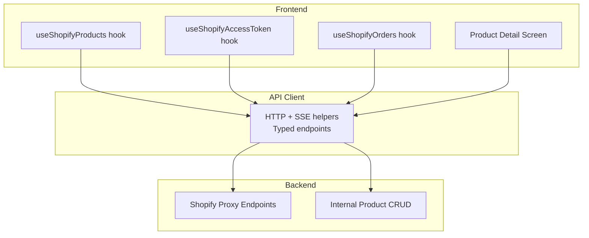
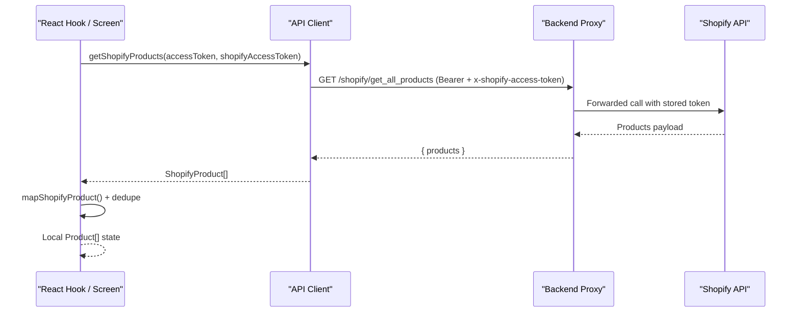
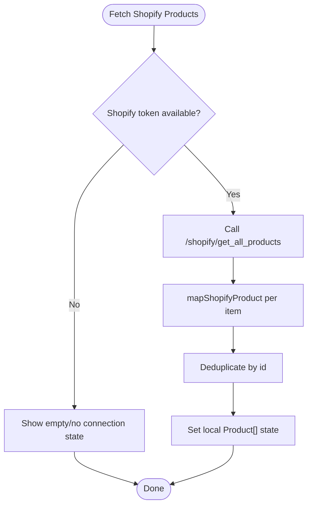
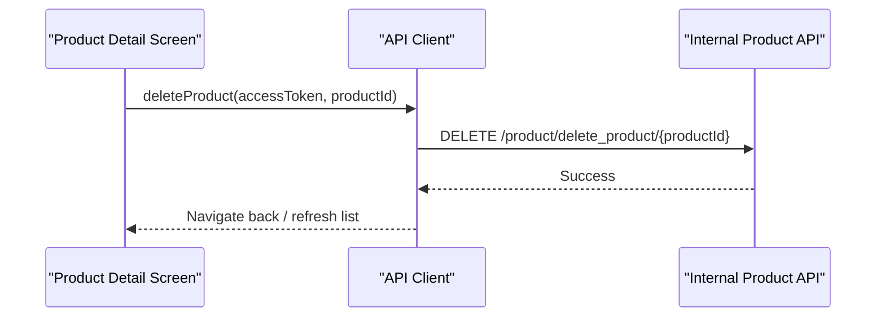
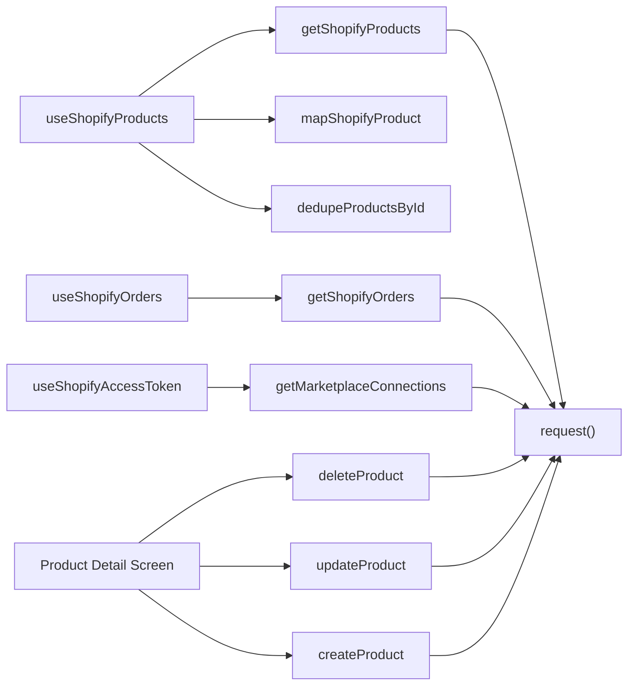

# Product Synchronization

<cite>
**Referenced Files in This Document**
- [api.ts](file://src/lib/api.ts)
- [use-shopify-products.ts](file://src/hooks/use-shopify-products.ts)
- [use-shopify-access-token.ts](file://src/hooks/use-shopify-access-token.ts)
- [use-shopify-orders.ts](file://src/hooks/use-shopify-orders.ts)
- [product-detail.tsx](file://src/app/(app)/product-detail.tsx)
</cite>

## Table of Contents
1. [Introduction](#introduction)
2. [Project Structure](#project-structure)
3. [Core Components](#core-components)
4. [Architecture Overview](#architecture-overview)
5. [Detailed Component Analysis](#detailed-component-analysis)
6. [Dependency Analysis](#dependency-analysis)
7. [Performance Considerations](#performance-considerations)
8. [Troubleshooting Guide](#troubleshooting-guide)
9. [Conclusion](#conclusion)
10. [Appendices](#appendices)

## Introduction
This document explains how product synchronization with Shopify is implemented in the application. It covers:
- How products are fetched from Shopify via a backend proxy, including connection handling and error management.
- How Shopify product responses are mapped to the internal product model used by the app.
- Inventory-related fields that are surfaced during mapping.
- Operations for creating, updating, and deleting products through the backend.
- Performance considerations when working with large catalogs.
- Error handling strategies and best practices for robust sync flows.
- Real-time update mechanisms available via server-sent events (SSE) and websockets in the broader system.

## Project Structure
The Shopify integration spans a small set of focused modules:
- API client layer: HTTP requests, streaming, and typed endpoints for Shopify and internal product operations.
- React hooks: Encapsulate fetching, connection state, and data mapping for Shopify products and orders.
- UI usage: A product detail screen demonstrates create/update/delete flows using the same API client.

**Diagram sources**
- [use-shopify-products.ts:27-49](file://src/hooks/use-shopify-products.ts#L27-L49)
- [use-shopify-access-token.ts:6-30](file://src/hooks/use-shopify-access-token.ts#L6-L30)
- [use-shopify-orders.ts:7-26](file://src/hooks/use-shopify-orders.ts#L7-L26)
- [api.ts:53-77](file://src/lib/api.ts#L53-L77)
- [api.ts:1072-1107](file://src/lib/api.ts#L1072-L1107)
- [api.ts:1109-1153](file://src/lib/api.ts#L1109-L1153)
- [product-detail.tsx:74-84](file://src/app/(app)/product-detail.tsx#L74-L84)

**Section sources**
- [use-shopify-products.ts:27-49](file://src/hooks/use-shopify-products.ts#L27-L49)
- [use-shopify-access-token.ts:6-30](file://src/hooks/use-shopify-access-token.ts#L6-L30)
- [use-shopify-orders.ts:7-26](file://src/hooks/use-shopify-orders.ts#L7-L26)
- [api.ts:53-77](file://src/lib/api.ts#L53-L77)
- [api.ts:1072-1107](file://src/lib/api.ts#L1072-L1107)
- [api.ts:1109-1153](file://src/lib/api.ts#L1109-L1153)
- [product-detail.tsx:74-84](file://src/app/(app)/product-detail.tsx#L74-L84)

## Core Components
- Shopify product fetcher hook: Retrieves products from the backend’s Shopify proxy, maps them to the internal product model, deduplicates, and exposes loading/error states plus refetch capability.
- Shopify access token hook: Resolves whether a Shopify connection exists and provides the encrypted access token needed for Shopify calls.
- Shopify orders hook: Fetches orders from the Shopify proxy similarly to products.
- API client: Provides typed functions for Shopify endpoints, internal product CRUD, and shared request/streaming utilities.
- Product detail screen: Demonstrates deletion flow using the internal product API.

Key responsibilities:
- Connection discovery and token resolution.
- Data normalization from Shopify response shapes to the internal product model.
- Centralized error handling and user-facing messages.
- Consistent refetch pattern across features.

**Section sources**
- [use-shopify-products.ts:7-49](file://src/hooks/use-shopify-products.ts#L7-L49)
- [use-shopify-access-token.ts:6-30](file://src/hooks/use-shopify-access-token.ts#L6-L30)
- [use-shopify-orders.ts:7-26](file://src/hooks/use-shopify-orders.ts#L7-L26)
- [api.ts:1072-1107](file://src/lib/api.ts#L1072-L1107)
- [api.ts:1109-1153](file://src/lib/api.ts#L1109-L1153)
- [product-detail.tsx:74-84](file://src/app/(app)/product-detail.tsx#L74-L84)

## Architecture Overview
The frontend uses React hooks to orchestrate data fetching and state. The API client abstracts HTTP and streaming details and exposes typed endpoints. The backend proxies Shopify API calls and manages internal product persistence.

**Diagram sources**
- [use-shopify-products.ts:27-49](file://src/hooks/use-shopify-products.ts#L27-L49)
- [api.ts:1072-1078](file://src/lib/api.ts#L1072-L1078)

**Section sources**
- [use-shopify-products.ts:27-49](file://src/hooks/use-shopify-products.ts#L27-L49)
- [api.ts:1072-1078](file://src/lib/api.ts#L1072-L1078)

## Detailed Component Analysis

### Shopify Product Fetching and Mapping
- Connection check: The access token hook queries marketplace connections to find an active Shopify connection and returns its encrypted access token.
- Product retrieval: The products hook calls the Shopify proxy endpoint with both the user’s bearer token and the Shopify access token header.
- Mapping: Each Shopify product is transformed into the internal product model, consolidating images, price, category, stock quantity, and platform tag.
- Deduplication: Results are deduplicated by ID before setting local state.

**Diagram sources**
- [use-shopify-access-token.ts:14-27](file://src/hooks/use-shopify-access-token.ts#L14-L27)
- [use-shopify-products.ts:27-49](file://src/hooks/use-shopify-products.ts#L27-L49)
- [api.ts:1072-1078](file://src/lib/api.ts#L1072-L1078)

**Section sources**
- [use-shopify-access-token.ts:14-27](file://src/hooks/use-shopify-access-token.ts#L14-L27)
- [use-shopify-products.ts:7-49](file://src/hooks/use-shopify-products.ts#L7-L49)
- [api.ts:1072-1078](file://src/lib/api.ts#L1072-L1078)

### Inventory Management and Variant Handling
- Stock quantity: The mapping logic surfaces inventory via either a top-level total inventory field or falls back to the first variant’s inventory quantity if present.
- Price: Uses the first variant’s price when available.
- Variants: While variants are not persisted individually in the internal model, their key attributes influence displayed price and stock.

Notes:
- The current mapping does not persist per-variant changes; updates should be applied at the product level via the internal product API and then reflected on Shopify through the backend’s proxy.

**Section sources**
- [use-shopify-products.ts:7-25](file://src/hooks/use-shopify-products.ts#L7-L25)

### Product Catalog Operations
- Fetch all products: Use the Shopify proxy endpoint to retrieve the full catalog.
- Fetch single product: Use the product-by-id endpoint to retrieve a specific product.
- Create product: Use the internal product creation endpoint to add a new product to the system.
- Update product: Use the internal product update endpoint to modify existing product data.
- Delete product: Use the internal product delete endpoint to remove a product.

**Diagram sources**
- [product-detail.tsx:74-84](file://src/app/(app)/product-detail.tsx#L74-L84)
- [api.ts:1148-1153](file://src/lib/api.ts#L1148-L1153)

**Section sources**
- [api.ts:1076-1107](file://src/lib/api.ts#L1076-L1107)
- [api.ts:1109-1153](file://src/lib/api.ts#L1109-L1153)
- [product-detail.tsx:74-84](file://src/app/(app)/product-detail.tsx#L74-L84)

### Real-Time Updates and Change Detection
- Server-Sent Events (SSE): The API client includes robust SSE support for streaming events, enabling real-time progress and completion signals for long-running operations.
- Websocket-based chat: The product chat feature parses event streams and JSON payloads to deliver live updates.

Use cases:
- Streaming progress for heavy operations (e.g., insights generation).
- Live notifications or incremental updates where supported by the backend.

**Section sources**
- [api.ts:79-137](file://src/lib/api.ts#L79-L137)
- [api.ts:144-200](file://src/lib/api.ts#L144-L200)
- [api.ts:215-280](file://src/lib/api.ts#L215-L280)
- [use-product-chat.ts:29-72](file://src/hooks/use-product-chat.ts#L29-L72)

## Dependency Analysis
The following diagram shows how components depend on each other and on the API client.

**Diagram sources**
- [use-shopify-products.ts:27-49](file://src/hooks/use-shopify-products.ts#L27-L49)
- [use-shopify-access-token.ts:14-27](file://src/hooks/use-shopify-access-token.ts#L14-L27)
- [use-shopify-orders.ts:15-24](file://src/hooks/use-shopify-orders.ts#L15-L24)
- [api.ts:53-77](file://src/lib/api.ts#L53-L77)
- [api.ts:1072-1107](file://src/lib/api.ts#L1072-L1107)
- [api.ts:1109-1153](file://src/lib/api.ts#L1109-L1153)

**Section sources**
- [use-shopify-products.ts:27-49](file://src/hooks/use-shopify-products.ts#L27-L49)
- [use-shopify-access-token.ts:14-27](file://src/hooks/use-shopify-access-token.ts#L14-L27)
- [use-shopify-orders.ts:15-24](file://src/hooks/use-shopify-orders.ts#L15-L24)
- [api.ts:53-77](file://src/lib/api.ts#L53-L77)
- [api.ts:1072-1107](file://src/lib/api.ts#L1072-L1107)
- [api.ts:1109-1153](file://src/lib/api.ts#L1109-L1153)

## Performance Considerations
- Batch fetching: Prefer bulk endpoints like “get all products” over repeated individual lookups when building lists.
- Deduplication: Apply client-side deduplication by product ID to avoid duplicate entries after mapping.
- Caching and refetching: Use the provided refetch mechanism to refresh data only when necessary (e.g., after a mutation or explicit user action).
- Pagination and filtering: For very large catalogs, consider implementing pagination and filtering on the backend side and exposing query parameters to limit payload size.
- Streaming for long operations: Leverage SSE to provide incremental progress and avoid blocking the UI during heavy tasks.

[No sources needed since this section provides general guidance]

## Troubleshooting Guide
Common issues and resolutions:
- Network errors: The API client throws a typed error when the server cannot be reached; surface a friendly message and offer retry.
- Authentication failures: Ensure both the user bearer token and the Shopify access token header are present for Shopify endpoints.
- Empty results: If no products load, verify the Shopify connection status and token availability before retrying.
- Mutation errors: For create/update/delete operations, handle typed errors and display concise messages to users.

Operational tips:
- Always wrap async calls with loading and error states.
- Use refetch to revalidate data after successful mutations.
- Log structured errors for debugging while keeping user messages simple.

**Section sources**
- [api.ts:53-77](file://src/lib/api.ts#L53-L77)
- [use-shopify-products.ts:36-49](file://src/hooks/use-shopify-products.ts#L36-L49)
- [use-shopify-access-token.ts:14-27](file://src/hooks/use-shopify-access-token.ts#L14-L27)
- [product-detail.tsx:74-84](file://src/app/(app)/product-detail.tsx#L74-L84)

## Conclusion
The Shopify product synchronization in this application is built around a clean separation of concerns:
- Hooks manage connection state, data fetching, and mapping to the internal model.
- The API client centralizes HTTP and streaming logic and exposes typed endpoints for both Shopify and internal product operations.
- The UI leverages these abstractions to provide a consistent experience for browsing, updating, and managing products.

For large catalogs, adopt backend-driven pagination/filtering and leverage streaming for long-running tasks. Robust error handling and clear user feedback ensure reliability and usability.

[No sources needed since this section summarizes without analyzing specific files]

## Appendices

### Example Workflows

- Fetch product catalog from Shopify
  - Resolve Shopify connection and token.
  - Call the Shopify proxy endpoint to retrieve all products.
  - Map to internal model and deduplicate.
  - Display in the UI; allow refetch on demand.

- Update product information
  - Build the updated product object.
  - Call the internal update endpoint.
  - Handle success/failure and refresh the view.

- Handle product variants
  - During mapping, derive price and stock from the first variant when available.
  - For variant-specific updates, apply changes at the product level via the internal API and rely on the backend to propagate to Shopify.

[No sources needed since this section provides conceptual examples]