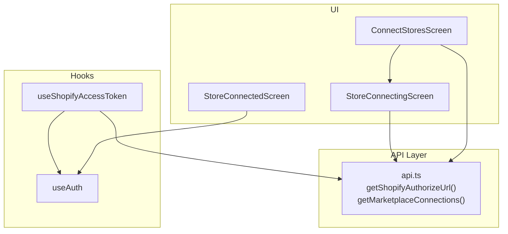
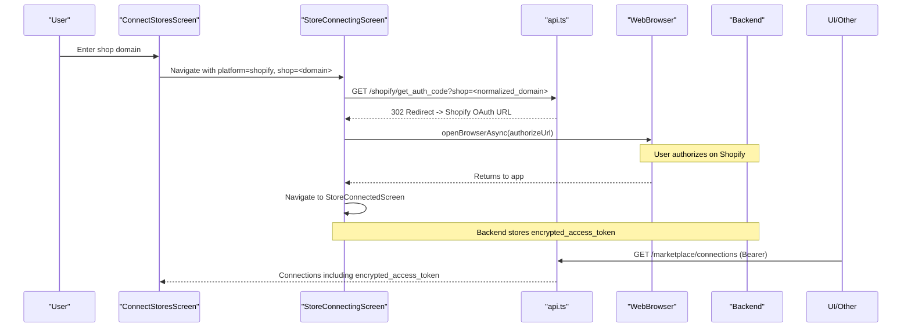
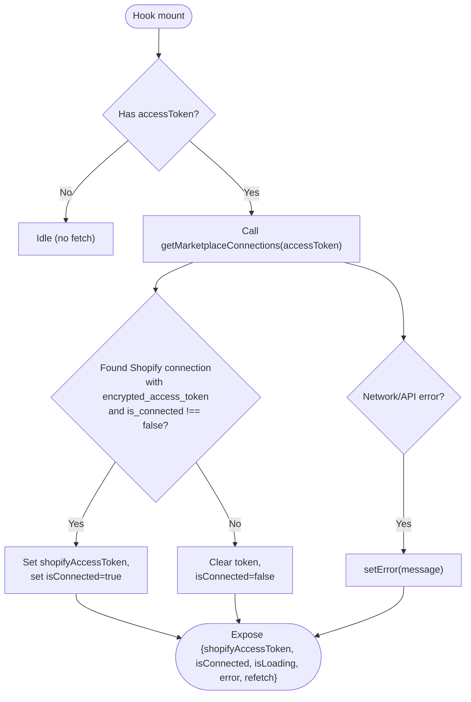
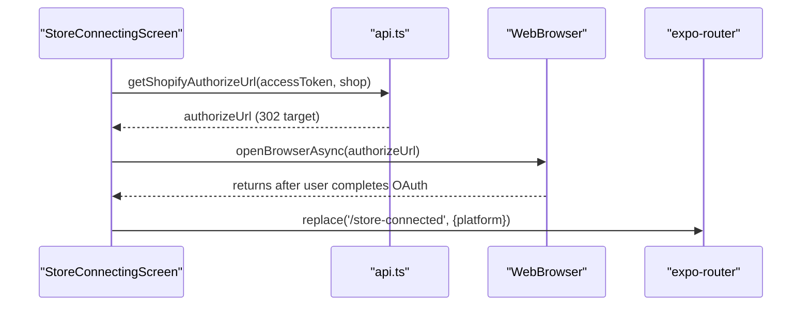
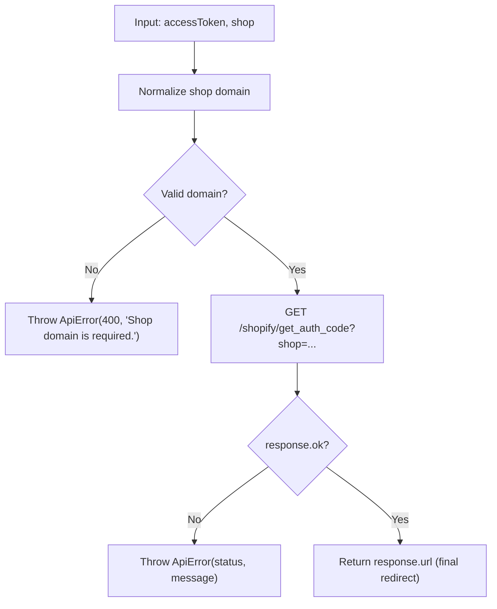
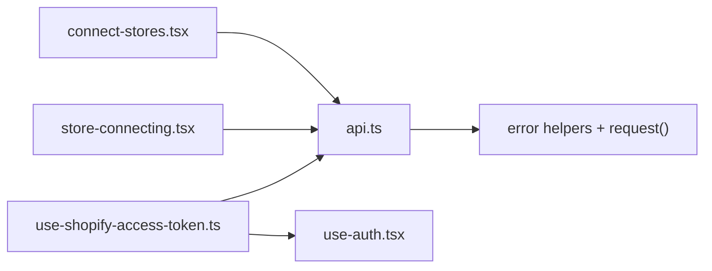

# Shopify Authentication & Token Management

<cite>
**Referenced Files in This Document**
- [use-shopify-access-token.ts](file://src/hooks/use-shopify-access-token.ts)
- [connect-stores.tsx](file://src/app/(app)/connect-stores.tsx)
- [store-connecting.tsx](file://src/app/(app)/store-connecting.tsx)
- [store-connected.tsx](file://src/app/(app)/store-connected.tsx)
- [api.ts](file://src/lib/api.ts)
- [use-auth.tsx](file://src/hooks/use-auth.tsx)
</cite>

## Table of Contents
1. Introduction
2. Project Structure
3. Core Components
4. Architecture Overview
5. Detailed Component Analysis
6. Dependency Analysis
7. Performance Considerations
8. Troubleshooting Guide
9. Conclusion

## Introduction
This document explains how the application implements Shopify authentication and access token management. It covers:
- The OAuth flow from domain validation to authorization code exchange and secure token storage
- The useShopifyAccessToken hook for connection state, error handling, and refetch behavior
- Examples of checking store connections, handling errors, and reconnecting
- Security considerations for encrypted tokens and session persistence
- Troubleshooting common issues such as invalid domains, expired tokens, and network failures

## Project Structure
The Shopify integration spans UI screens, a React hook, and API utilities:
- Screens guide users through connecting a Shopify store and display success or errors
- A hook retrieves and caches the encrypted Shopify access token per merchant session
- API functions call backend endpoints that orchestrate Shopify OAuth redirects and return encrypted tokens

**Diagram sources**
- [connect-stores.tsx:41-93](file://src/app/(app)/connect-stores.tsx#L41-L93)
- [store-connecting.tsx:31-68](file://src/app/(app)/store-connecting.tsx#L31-L68)
- [use-shopify-access-token.ts:6-29](file://src/hooks/use-shopify-access-token.ts#L6-L29)
- [api.ts:368-436](file://src/lib/api.ts#L368-L436)
- [use-auth.tsx:31-81](file://src/hooks/use-auth.tsx#L31-L81)

**Section sources**
- [connect-stores.tsx:25-93](file://src/app/(app)/connect-stores.tsx#L25-L93)
- [store-connecting.tsx:19-68](file://src/app/(app)/store-connecting.tsx#L19-L68)
- [use-shopify-access-token.ts:6-29](file://src/hooks/use-shopify-access-token.ts#L6-L29)
- [api.ts:368-436](file://src/lib/api.ts#L368-L436)
- [use-auth.tsx:31-81](file://src/hooks/use-auth.tsx#L31-L81)

## Core Components
- useShopifyAccessToken hook: Fetches marketplace connections for the signed-in user, finds the Shopify connection, and exposes an encrypted access token, loading/error states, and a refetch function.
- ConnectStoresScreen: Collects the Shopify domain, validates it, and navigates to the connecting screen.
- StoreConnectingScreen: Calls the backend to obtain a Shopify OAuth authorize URL, opens it in a browser, then navigates to a success screen.
- api.ts: Provides Bearer-protected calls to get an OAuth authorize URL and list marketplace connections; normalizes shop domains and throws typed ApiError instances on failures.
- use-auth.tsx: Manages the app’s session token using SecureStore and provides sign-in/sign-out flows.

Key responsibilities:
- Domain normalization and validation before initiating OAuth
- Securely storing the app-level access token via SecureStore
- Retrieving encrypted Shopify tokens from the server after successful OAuth
- Exposing connection state and errors to UI components

**Section sources**
- [use-shopify-access-token.ts:6-29](file://src/hooks/use-shopify-access-token.ts#L6-L29)
- [connect-stores.tsx:74-93](file://src/app/(app)/connect-stores.tsx#L74-L93)
- [store-connecting.tsx:31-68](file://src/app/(app)/store-connecting.tsx#L31-L68)
- [api.ts:368-436](file://src/lib/api.ts#L368-L436)
- [use-auth.tsx:31-81](file://src/hooks/use-auth.tsx#L31-L81)

## Architecture Overview
The Shopify OAuth flow is implemented with a server-side redirect strategy:
- The client collects the shop domain and calls a protected endpoint to obtain a Shopify OAuth authorize URL
- The app opens the authorize URL in a browser (via expo-web-browser)
- After user consent, the backend stores an encrypted access token linked to the merchant
- The client can query marketplace connections to retrieve the encrypted token for subsequent API calls

**Diagram sources**
- [connect-stores.tsx:74-93](file://src/app/(app)/connect-stores.tsx#L74-L93)
- [store-connecting.tsx:31-68](file://src/app/(app)/store-connecting.tsx#L31-L68)
- [api.ts:402-436](file://src/lib/api.ts#L402-L436)
- [api.ts:368-372](file://src/lib/api.ts#L368-L372)

## Detailed Component Analysis

### useShopifyAccessToken Hook
Responsibilities:
- Derives the current merchant’s access token from useAuth
- Fetches marketplace connections and locates the Shopify entry
- Exposes isConnected based on presence of an encrypted access token and active connection flag
- Provides isLoading and error states, plus a refetch trigger

Behavior highlights:
- Skips fetching if no app access token is present
- Uses a reload key to force refetch when needed
- Normalizes error messages by wrapping non-ApiError cases

**Diagram sources**
- [use-shopify-access-token.ts:6-29](file://src/hooks/use-shopify-access-token.ts#L6-L29)
- [api.ts:368-372](file://src/lib/api.ts#L368-L372)

**Section sources**
- [use-shopify-access-token.ts:6-29](file://src/hooks/use-shopify-access-token.ts#L6-L29)

### ConnectStoresScreen (Domain Collection and Navigation)
Responsibilities:
- Presents available marketplaces and handles Shopify selection
- Validates and normalizes the shop domain input
- Navigates to the connecting screen with platform and shop parameters

Validation and UX:
- Strips protocol and trailing slashes to normalize the domain
- Shows inline errors for missing or invalid input
- Disables controls while connecting to prevent duplicate actions

**Section sources**
- [connect-stores.tsx:41-93](file://src/app/(app)/connect-stores.tsx#L41-L93)
- [connect-stores.tsx:102-149](file://src/app/(app)/connect-stores.tsx#L102-L149)

### StoreConnectingScreen (OAuth Flow Orchestration)
Responsibilities:
- For Shopify, calls the backend to obtain an OAuth authorize URL
- Opens the URL in the system browser
- On completion, navigates to the connected success screen
- Displays step-by-step progress and error feedback

Flow details:
- Guards against missing shop domain or missing app access token
- Uses a ref to ensure the OAuth request runs only once per mount
- Advances checklist steps while the request is in flight

**Diagram sources**
- [store-connecting.tsx:31-68](file://src/app/(app)/store-connecting.tsx#L31-L68)
- [api.ts:402-436](file://src/lib/api.ts#L402-L436)

**Section sources**
- [store-connecting.tsx:19-68](file://src/app/(app)/store-connecting.tsx#L19-L68)

### API Layer (Authorization Code Exchange and Connection Lookup)
Key functions:
- getShopifyAuthorizeUrl: Normalizes the shop domain, calls the protected endpoint, and returns the final redirect URL
- getMarketplaceConnections: Retrieves all marketplace connections for the authenticated merchant, including encrypted tokens

Error handling:
- Network failures throw ApiError with status 0 and a user-friendly message
- Non-OK responses throw ApiError with the HTTP status and extracted message
- Domain validation rejects empty inputs early

**Diagram sources**
- [api.ts:402-436](file://src/lib/api.ts#L402-L436)
- [api.ts:53-77](file://src/lib/api.ts#L53-L77)

**Section sources**
- [api.ts:368-436](file://src/lib/api.ts#L368-L436)
- [api.ts:53-77](file://src/lib/api.ts#L53-L77)

### Session Persistence and Token Storage
- App-level access tokens are stored securely using SecureStore
- On app launch, the stored token is validated by calling the me endpoint; invalid/expired tokens clear the session
- Sign-in persists the token; sign-out deletes it

Security notes:
- Tokens are stored in SecureStore, which leverages platform-native secure storage
- The app-level token is required for all protected endpoints, including marketplace operations

**Section sources**
- [use-auth.tsx:31-81](file://src/hooks/use-auth.tsx#L31-L81)

## Dependency Analysis
- UI screens depend on hooks for state and navigation
- Hooks depend on the API layer for data retrieval and OAuth initiation
- API layer depends on environment configuration for base URLs and uses a centralized error extraction utility

**Diagram sources**
- [connect-stores.tsx:41-93](file://src/app/(app)/connect-stores.tsx#L41-L93)
- [store-connecting.tsx:31-68](file://src/app/(app)/store-connecting.tsx#L31-L68)
- [use-shopify-access-token.ts:6-29](file://src/hooks/use-shopify-access-token.ts#L6-L29)
- [api.ts:53-77](file://src/lib/api.ts#L53-L77)

**Section sources**
- [connect-stores.tsx:41-93](file://src/app/(app)/connect-stores.tsx#L41-L93)
- [store-connecting.tsx:31-68](file://src/app/(app)/store-connecting.tsx#L31-L68)
- [use-shopify-access-token.ts:6-29](file://src/hooks/use-shopify-access-token.ts#L6-L29)
- [api.ts:53-77](file://src/lib/api.ts#L53-L77)

## Performance Considerations
- Avoid redundant OAuth requests: the connecting screen uses a ref to ensure the OAuth call runs once per mount
- Debounce or guard refetch triggers where appropriate to prevent excessive calls to marketplace endpoints
- Keep UI responsive by showing loading states during network requests and disabling interactive elements during transitions

[No sources needed since this section provides general guidance]

## Troubleshooting Guide
Common issues and resolutions:

- Invalid or empty shop domain
  - Symptom: Immediate error before network call
  - Resolution: Ensure the domain is provided without protocol and trailing slashes; the UI normalizes input, but callers should validate before submission
  - Relevant paths: [store-connecting.tsx:35-42](file://src/app/(app)/store-connecting.tsx#L35-L42), [api.ts:409-412](file://src/lib/api.ts#L409-L412)

- Network failures or unreachable server
  - Symptom: Generic “Could not reach the server” error
  - Resolution: Check device connectivity and API base URL configuration; retry with refetch or re-initiate OAuth
  - Relevant paths: [api.ts:53-62](file://src/lib/api.ts#L53-L62), [api.ts:414-426](file://src/lib/api.ts#L414-L426)

- Non-OK HTTP responses during OAuth initiation
  - Symptom: Errors like “Could not start the Shopify connection (status)”
  - Resolution: Verify merchant session validity and backend configuration; retry after resolving auth/session issues
  - Relevant paths: [api.ts:428-433](file://src/lib/api.ts#L428-L433)

- Expired or invalid app session token
  - Symptom: Authenticated calls fail; UI may prompt to log in again
  - Resolution: Re-authenticate to refresh the app access token; the app clears invalid tokens automatically
  - Relevant paths: [use-auth.tsx:35-53](file://src/hooks/use-auth.tsx#L35-L53)

- No Shopify connection found after OAuth
  - Symptom: isConnected remains false even after completing OAuth
  - Resolution: Use the hook’s refetch to reload connections; verify backend stored encrypted_access_token; check marketplace.is_connected flag
  - Relevant paths: [use-shopify-access-token.ts:14-27](file://src/hooks/use-shopify-access-token.ts#L14-L27)

- Reconnection logic
  - Pattern: Provide a refetch button or automatic retry on error; disable controls during in-flight requests to avoid duplicates
  - Relevant paths: [connect-stores.tsx:153-187](file://src/app/(app)/connect-stores.tsx#L153-L187), [use-shopify-access-token.ts:12-12](file://src/hooks/use-shopify-access-token.ts#L12-L12)

**Section sources**
- [store-connecting.tsx:35-42](file://src/app/(app)/store-connecting.tsx#L35-L42)
- [api.ts:53-62](file://src/lib/api.ts#L53-L62)
- [api.ts:409-433](file://src/lib/api.ts#L409-L433)
- [use-auth.tsx:35-53](file://src/hooks/use-auth.tsx#L35-L53)
- [use-shopify-access-token.ts:12-27](file://src/hooks/use-shopify-access-token.ts#L12-L27)
- [connect-stores.tsx:153-187](file://src/app/(app)/connect-stores.tsx#L153-L187)

## Conclusion
The implementation separates concerns cleanly:
- UI screens manage user input and navigation
- The hook encapsulates connection state and error handling
- The API layer centralizes OAuth initiation and connection retrieval with robust error handling
- Session persistence is handled securely via SecureStore

By following the patterns shown here—validating inputs, using Bearer tokens for protected endpoints, opening OAuth in a browser, and querying encrypted tokens post-OAuth—you can reliably connect Shopify stores and maintain secure, resilient sessions.

[No sources needed since this section summarizes without analyzing specific files]