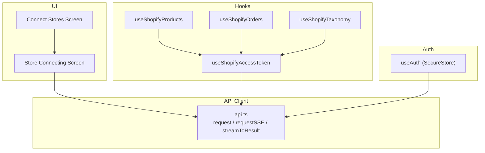
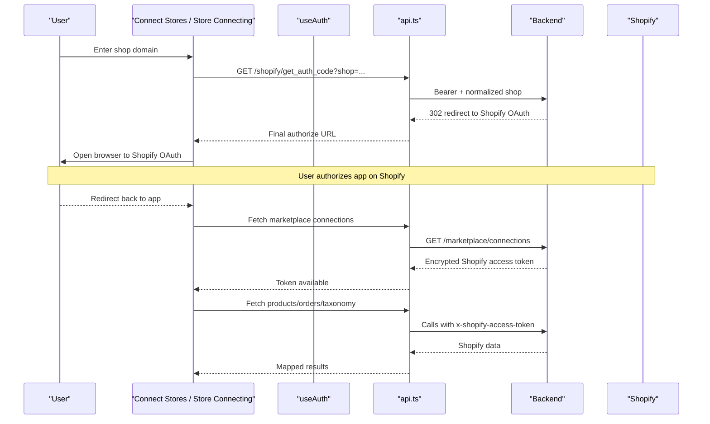
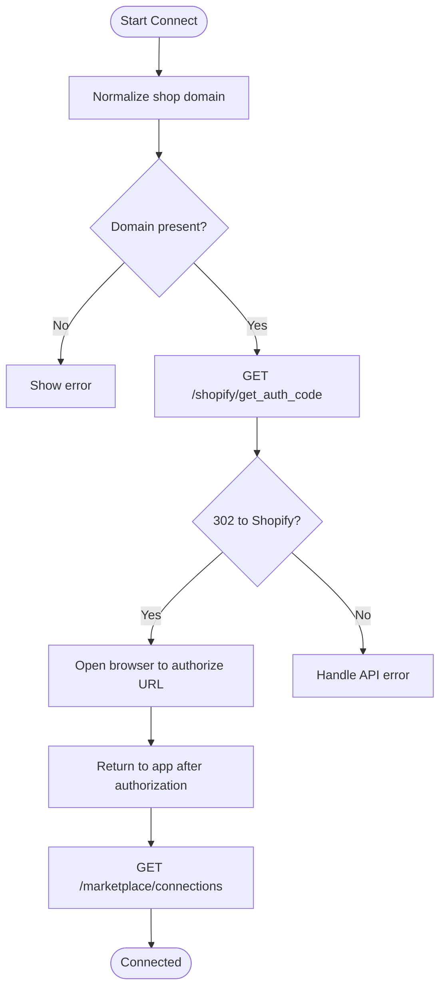
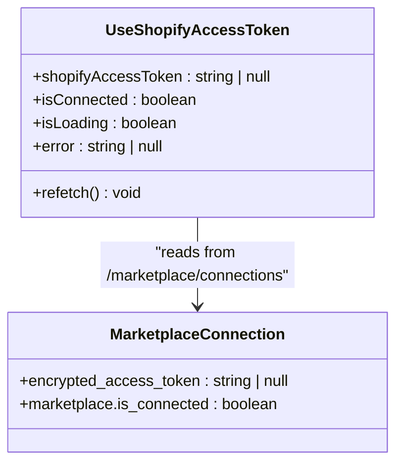
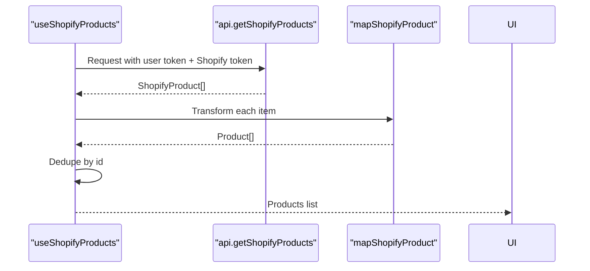
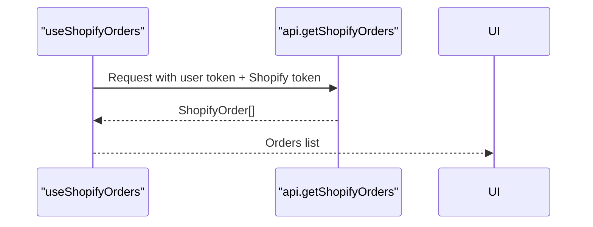
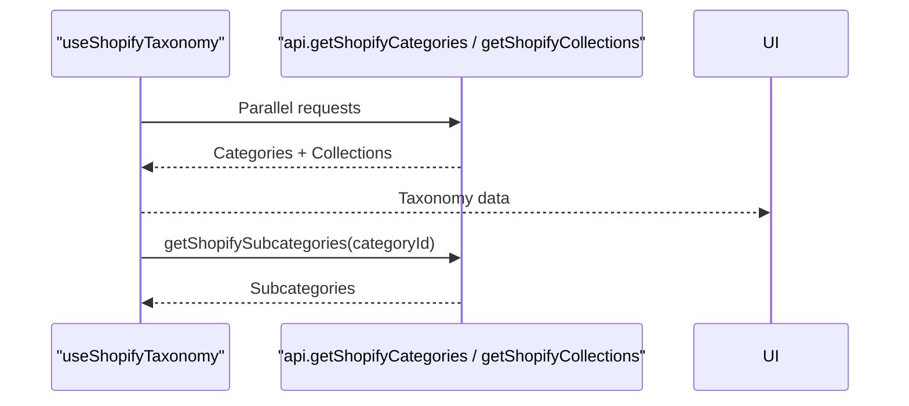
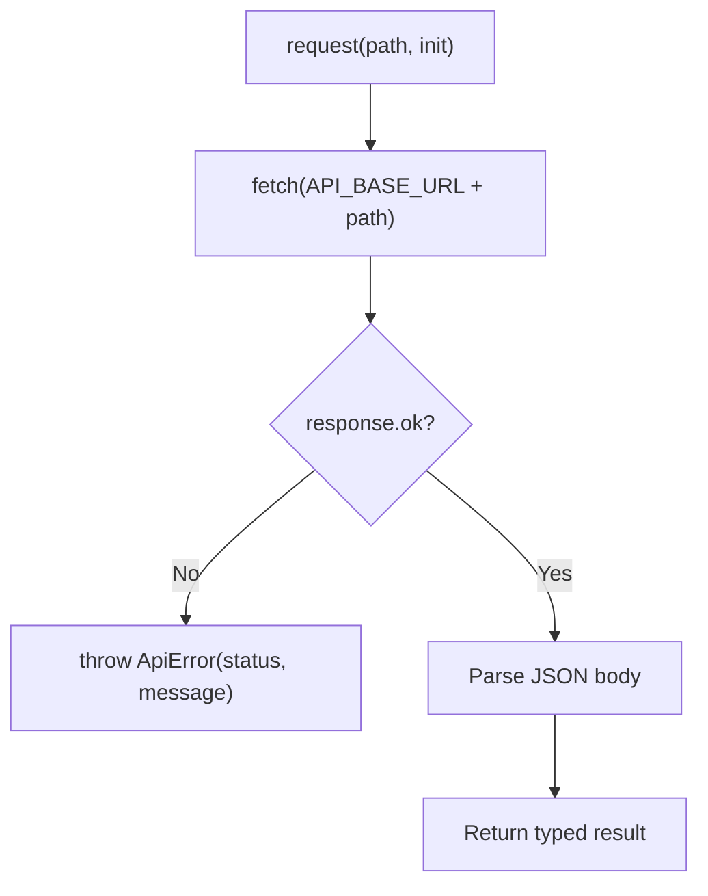
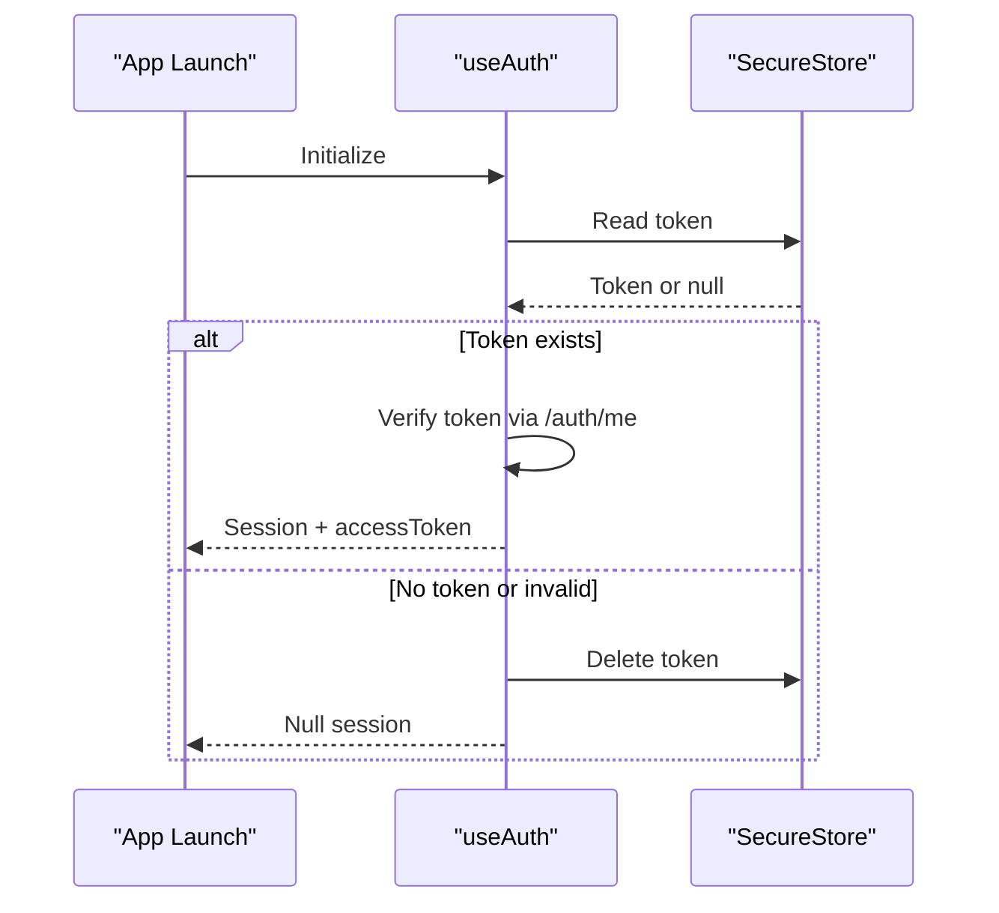
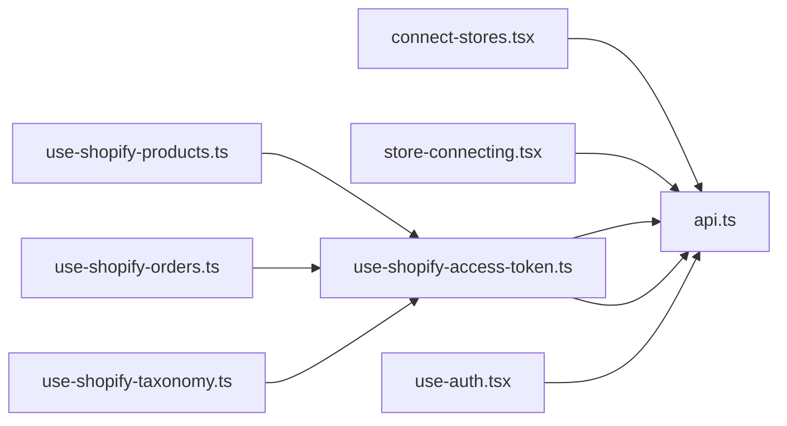

# Shopify Integration

<cite>
**Referenced Files in This Document**
- [api.ts](file://src/lib/api.ts)
- [use-auth.tsx](file://src/hooks/use-auth.tsx)
- [connect-stores.tsx](file://src/app/(app)/connect-stores.tsx)
- [store-connecting.tsx](file://src/app/(app)/store-connecting.tsx)
- [use-shopify-access-token.ts](file://src/hooks/use-shopify-access-token.ts)
- [use-shopify-products.ts](file://src/hooks/use-shopify-products.ts)
- [use-shopify-orders.ts](file://src/hooks/use-shopify-orders.ts)
- [use-shopify-taxonomy.ts](file://src/hooks/use-shopify-taxonomy.ts)
</cite>

## Table of Contents
1. Introduction
2. Project Structure
3. Core Components
4. Architecture Overview
5. Detailed Component Analysis
6. Dependency Analysis
7. Performance Considerations
8. Troubleshooting Guide
9. Conclusion

## Introduction
This document explains the Shopify integration implemented in the application. It covers:
- OAuth flow for connecting a Shopify store, including domain validation and access token management
- Product synchronization mechanisms: data mapping, inventory fields, and order processing
- The API client implementation with error handling and streaming support
- Examples for fetching products, managing orders, and accessing taxonomy data
- Secure storage of credentials and session management
- Limitations and real-time sync capabilities
- Troubleshooting common issues and debugging techniques

## Project Structure
The Shopify integration is primarily implemented in React hooks and a centralized API client:
- UI flows for connecting stores and initiating OAuth live in app screens
- Hooks encapsulate connection state, product fetching, order fetching, and taxonomy retrieval
- A single API client module defines HTTP helpers, types, and all marketplace endpoints

**Diagram sources**
- [connect-stores.tsx:41-93](file://src/app/(app)/connect-stores.tsx#L41-L93)
- [store-connecting.tsx:29-68](file://src/app/(app)/store-connecting.tsx#L29-L68)
- [use-shopify-access-token.ts:6-29](file://src/hooks/use-shopify-access-token.ts#L6-L29)
- [use-shopify-products.ts:27-49](file://src/hooks/use-shopify-products.ts#L27-L49)
- [use-shopify-orders.ts:7-26](file://src/hooks/use-shopify-orders.ts#L7-L26)
- [use-shopify-taxonomy.ts:7-38](file://src/hooks/use-shopify-taxonomy.ts#L7-L38)
- [api.ts:53-77](file://src/lib/api.ts#L53-L77)
- [api.ts:215-286](file://src/lib/api.ts#L215-L286)

**Section sources**
- [connect-stores.tsx:41-93](file://src/app/(app)/connect-stores.tsx#L41-L93)
- [store-connecting.tsx:29-68](file://src/app/(app)/store-connecting.tsx#L29-L68)
- [use-shopify-access-token.ts:6-29](file://src/hooks/use-shopify-access-token.ts#L6-L29)
- [use-shopify-products.ts:27-49](file://src/hooks/use-shopify-products.ts#L27-L49)
- [use-shopify-orders.ts:7-26](file://src/hooks/use-shopify-orders.ts#L7-L26)
- [use-shopify-taxonomy.ts:7-38](file://src/hooks/use-shopify-taxonomy.ts#L7-L38)
- [api.ts:53-77](file://src/lib/api.ts#L53-L77)
- [api.ts:215-286](file://src/lib/api.ts#L215-L286)

## Core Components
- OAuth initiation and domain validation:
  - The Connect Stores screen prompts for a Shopify domain, normalizes it, and navigates to the Store Connecting screen.
  - The Store Connecting screen calls the backend to obtain an OAuth authorize URL and opens it in the system browser.
- Access token management:
  - After connection, the encrypted Shopify access token is stored server-side and retrieved via marketplace connections.
  - The useShopifyAccessToken hook fetches and caches this token per user session.
- Data fetching:
  - Products, orders, categories, collections, and subcategories are fetched through typed API functions that attach both the user’s bearer token and the Shopify access token.
- Mapping and deduplication:
  - Shopify product responses are mapped into a unified Product model; duplicates by id are removed.

**Section sources**
- [connect-stores.tsx:74-93](file://src/app/(app)/connect-stores.tsx#L74-L93)
- [store-connecting.tsx:29-68](file://src/app/(app)/store-connecting.tsx#L29-L68)
- [use-shopify-access-token.ts:6-29](file://src/hooks/use-shopify-access-token.ts#L6-L29)
- [use-shopify-products.ts:7-25](file://src/hooks/use-shopify-products.ts#L7-L25)
- [api.ts:405-436](file://src/lib/api.ts#L405-L436)
- [api.ts:1076-1093](file://src/lib/api.ts#L1076-L1093)

## Architecture Overview
The integration follows a layered approach:
- UI screens orchestrate user actions and display status
- Hooks manage state, dependencies, and side effects
- The API client centralizes HTTP requests, error normalization, and streaming
- Backend endpoints handle OAuth redirects and proxy calls to Shopify using stored tokens

**Diagram sources**
- [connect-stores.tsx:74-93](file://src/app/(app)/connect-stores.tsx#L74-L93)
- [store-connecting.tsx:29-68](file://src/app/(app)/store-connecting.tsx#L29-L68)
- [api.ts:405-436](file://src/lib/api.ts#L405-L436)
- [api.ts:368-372](file://src/lib/api.ts#L368-L372)
- [api.ts:1076-1093](file://src/lib/api.ts#L1076-L1093)

## Detailed Component Analysis

### OAuth Flow and Domain Validation
- Domain normalization:
  - The UI strips protocol and trailing slashes before passing the shop parameter to the backend.
- Authorization URL generation:
  - The backend returns a 302 redirect to Shopify’s OAuth page; the client uses the final response URL to open the browser.
- Post-authorization:
  - After returning to the app, the client refreshes marketplace connections to retrieve the encrypted Shopify access token.

**Diagram sources**
- [connect-stores.tsx:74-93](file://src/app/(app)/connect-stores.tsx#L74-L93)
- [store-connecting.tsx:29-68](file://src/app/(app)/store-connecting.tsx#L29-L68)
- [api.ts:405-436](file://src/lib/api.ts#L405-L436)

**Section sources**
- [connect-stores.tsx:74-93](file://src/app/(app)/connect-stores.tsx#L74-L93)
- [store-connecting.tsx:29-68](file://src/app/(app)/store-connecting.tsx#L29-L68)
- [api.ts:405-436](file://src/lib/api.ts#L405-L436)

### Access Token Management
- Retrieval:
  - The hook queries marketplace connections and selects the Shopify entry with an encrypted access token and active connection flag.
- Usage:
  - All subsequent Shopify API calls include both the user’s bearer token and the Shopify access token header.

**Diagram sources**
- [use-shopify-access-token.ts:6-29](file://src/hooks/use-shopify-access-token.ts#L6-L29)
- [api.ts:359-372](file://src/lib/api.ts#L359-L372)

**Section sources**
- [use-shopify-access-token.ts:6-29](file://src/hooks/use-shopify-access-token.ts#L6-L29)
- [api.ts:359-372](file://src/lib/api.ts#L359-L372)

### Product Synchronization and Data Mapping
- Fetching products:
  - The hook retrieves Shopify products and maps them to a unified Product type, consolidating images and extracting price and stock quantity.
- Deduplication:
  - Duplicate products by id are removed to ensure stable lists.
- Inventory:
  - StockQuantity is derived from totalInventory or the first variant’s inventoryQuantity when available.

**Diagram sources**
- [use-shopify-products.ts:7-49](file://src/hooks/use-shopify-products.ts#L7-L49)
- [api.ts:1076-1078](file://src/lib/api.ts#L1076-L1078)
- [api.ts:496-505](file://src/lib/api.ts#L496-L505)

**Section sources**
- [use-shopify-products.ts:7-49](file://src/hooks/use-shopify-products.ts#L7-L49)
- [api.ts:496-505](file://src/lib/api.ts#L496-L505)
- [api.ts:1076-1078](file://src/lib/api.ts#L1076-L1078)

### Order Processing
- Fetching orders:
  - Orders are retrieved via a dedicated endpoint that requires both authentication headers.
- Data shape:
  - Orders include identifiers, timestamps, financial and fulfillment statuses, totals, currency, customer info, and line items.

**Diagram sources**
- [use-shopify-orders.ts:7-26](file://src/hooks/use-shopify-orders.ts#L7-L26)
- [api.ts:1091-1093](file://src/lib/api.ts#L1091-L1093)

**Section sources**
- [use-shopify-orders.ts:7-26](file://src/hooks/use-shopify-orders.ts#L7-L26)
- [api.ts:1091-1093](file://src/lib/api.ts#L1091-L1093)

### Shopify Taxonomy and Collections
- Categories and collections:
  - The hook fetches top-level categories and collections concurrently.
- Subcategories:
  - A helper function retrieves subcategories for a given category id.

**Diagram sources**
- [use-shopify-taxonomy.ts:7-38](file://src/hooks/use-shopify-taxonomy.ts#L7-L38)
- [api.ts:1082-1090](file://src/lib/api.ts#L1082-L1090)

**Section sources**
- [use-shopify-taxonomy.ts:7-38](file://src/hooks/use-shopify-taxonomy.ts#L7-L38)
- [api.ts:1082-1090](file://src/lib/api.ts#L1082-L1090)

### API Client Implementation and Error Handling
- Unified request wrapper:
  - Normalizes network errors and parses JSON bodies; throws typed ApiError with status and message.
- Streaming support:
  - Server-sent events are consumed via ReadableStream on web and XMLHttpRequest progress on native platforms.
  - A stream-to-result helper resolves on a complete event and rejects on error events or stream termination without completion.
- Rate limiting:
  - No explicit rate limiting is implemented in the client; callers should avoid excessive polling and rely on UI-triggered refetches.

**Diagram sources**
- [api.ts:53-77](file://src/lib/api.ts#L53-L77)
- [api.ts:215-286](file://src/lib/api.ts#L215-L286)

**Section sources**
- [api.ts:53-77](file://src/lib/api.ts#L53-L77)
- [api.ts:215-286](file://src/lib/api.ts#L215-L286)

### Secure Storage and Session Management
- Authentication tokens:
  - The app stores the user’s access token securely using platform secure storage and hydrates the session on launch.
- Invalid token handling:
  - If the stored token fails validation, it is cleared and the user is logged out.

**Diagram sources**
- [use-auth.tsx:31-82](file://src/hooks/use-auth.tsx#L31-L82)

**Section sources**
- [use-auth.tsx:31-82](file://src/hooks/use-auth.tsx#L31-L82)

## Dependency Analysis
- Hooks depend on:
  - Authentication context for the user’s bearer token
  - API client for marketplace operations and Shopify endpoints
- API client depends on:
  - Base URL configuration
  - Platform-specific streaming implementations
- Screens depend on:
  - Hooks for state and side effects
  - API client for initiating OAuth and data retrieval

**Diagram sources**
- [connect-stores.tsx:41-93](file://src/app/(app)/connect-stores.tsx#L41-L93)
- [store-connecting.tsx:29-68](file://src/app/(app)/store-connecting.tsx#L29-L68)
- [use-shopify-access-token.ts:6-29](file://src/hooks/use-shopify-access-token.ts#L6-L29)
- [use-shopify-products.ts:27-49](file://src/hooks/use-shopify-products.ts#L27-L49)
- [use-shopify-orders.ts:7-26](file://src/hooks/use-shopify-orders.ts#L7-L26)
- [use-shopify-taxonomy.ts:7-38](file://src/hooks/use-shopify-taxonomy.ts#L7-L38)
- [use-auth.tsx:31-82](file://src/hooks/use-auth.tsx#L31-L82)
- [api.ts:53-77](file://src/lib/api.ts#L53-L77)

**Section sources**
- [connect-stores.tsx:41-93](file://src/app/(app)/connect-stores.tsx#L41-L93)
- [store-connecting.tsx:29-68](file://src/app/(app)/store-connecting.tsx#L29-L68)
- [use-shopify-access-token.ts:6-29](file://src/hooks/use-shopify-access-token.ts#L6-L29)
- [use-shopify-products.ts:27-49](file://src/hooks/use-shopify-products.ts#L27-L49)
- [use-shopify-orders.ts:7-26](file://src/hooks/use-shopify-orders.ts#L7-L26)
- [use-shopify-taxonomy.ts:7-38](file://src/hooks/use-shopify-taxonomy.ts#L7-L38)
- [use-auth.tsx:31-82](file://src/hooks/use-auth.tsx#L31-L82)
- [api.ts:53-77](file://src/lib/api.ts#L53-L77)

## Performance Considerations
- Avoid redundant polling:
  - Hooks expose refetch methods; trigger them explicitly after connection changes or user actions.
- Batch reads:
  - Taxonomy hook fetches categories and collections in parallel to reduce latency.
- Deduplication:
  - Products are deduplicated by id to prevent duplicate entries in lists.
- Streaming:
  - For long-running tasks elsewhere in the app, SSE streams provide incremental updates; similar patterns can be used if Shopify-related analytics become available.

[No sources needed since this section provides general guidance]

## Troubleshooting Guide
Common issues and how to address them:
- Network reachability:
  - The request wrapper throws a generic “Could not reach the server” error when fetch fails; verify connectivity and base URL.
- Non-OK responses:
  - Errors are wrapped in ApiError with status and a human-readable message extracted from the response body.
- Missing or invalid shop domain:
  - Ensure the domain is provided and normalized; the API enforces presence and format checks.
- Connection state:
  - If no Shopify access token is found, data hooks return empty results; re-check marketplace connections after OAuth completes.
- Streaming failures:
  - Streams resolve only on a “complete” event; if the stream ends without completion, an error is thrown.

Practical steps:
- Inspect ApiError messages for actionable details
- Re-run marketplace connections to refresh tokens
- Retry failed requests after transient network issues
- For streaming features, ensure the environment supports the required transport (ReadableStream vs XHR)

**Section sources**
- [api.ts:53-77](file://src/lib/api.ts#L53-L77)
- [api.ts:215-286](file://src/lib/api.ts#L215-L286)
- [api.ts:405-436](file://src/lib/api.ts#L405-L436)
- [use-shopify-access-token.ts:6-29](file://src/hooks/use-shopify-access-token.ts#L6-L29)

## Conclusion
The Shopify integration provides a robust, modular approach to connecting stores, managing tokens, and synchronizing data:
- OAuth is initiated via a backend-provided authorize URL with validated shop domains
- Access tokens are securely managed server-side and accessed through marketplace connections
- Products, orders, and taxonomy data are fetched with consistent error handling and streaming support
- Data mapping ensures compatibility across components and deduplication maintains list integrity
- While webhook handling and real-time sync are not implemented in the current codebase, the streaming infrastructure is in place for future enhancements

[No sources needed since this section summarizes without analyzing specific files]