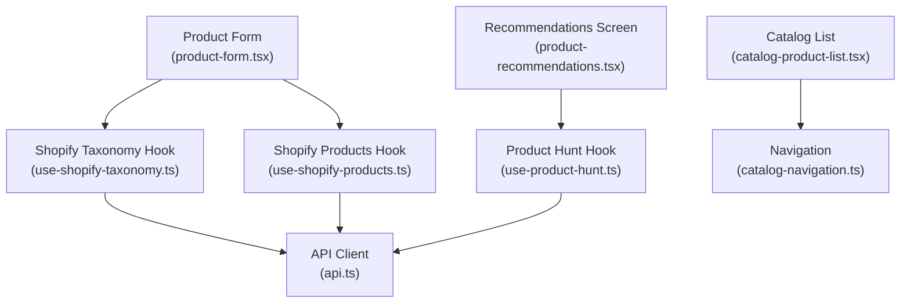
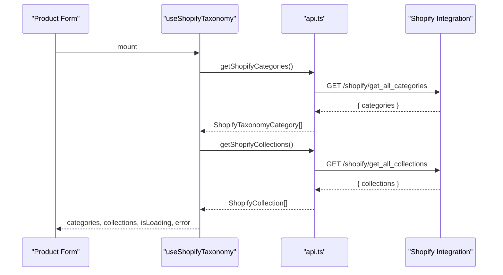
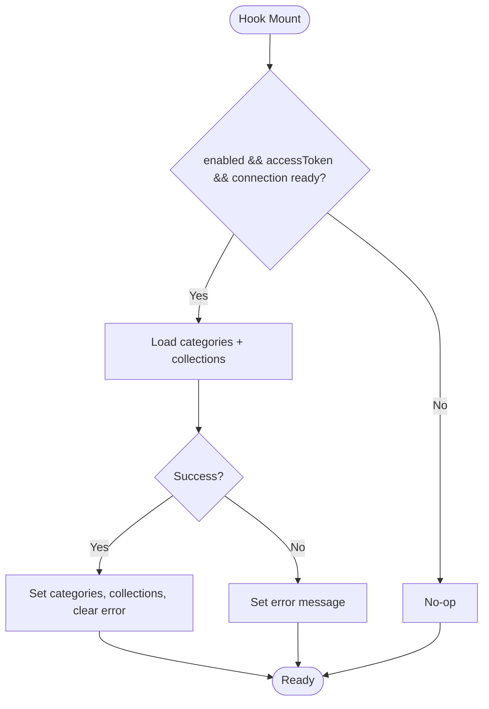
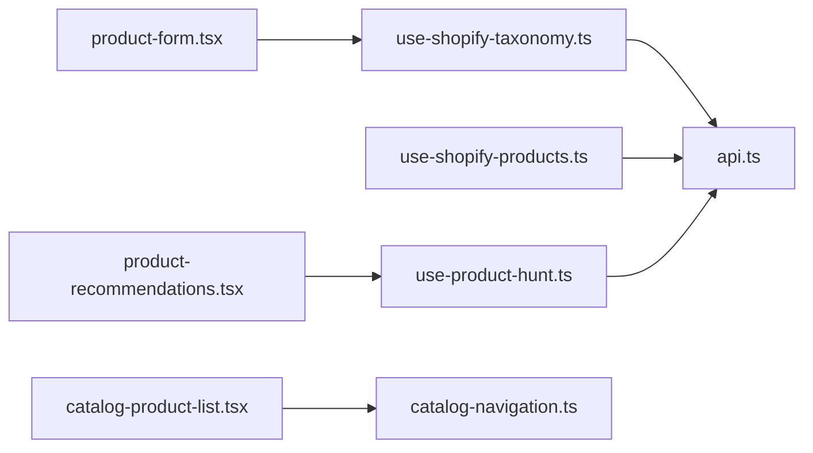

# Shopify Taxonomy & Categories

<cite>
**Referenced Files in This Document**
- [use-shopify-taxonomy.ts](file://src/hooks/use-shopify-taxonomy.ts)
- [api.ts](file://src/lib/api.ts)
- [use-shopify-products.ts](file://src/hooks/use-shopify-products.ts)
- [product-form.tsx](file://src/app/(app)/product-form.tsx)
- [catalog-navigation.ts](file://src/lib/catalog-navigation.ts)
- [catalog-product-list.tsx](file://src/components/catalog-product-list.tsx)
- [catalog-product-row.tsx](file://src/components/catalog-product-row.tsx)
- [product-recommendations.tsx](file://src/app/(app)/product-recommendations.tsx)
- [use-product-hunt.ts](file://src/hooks/use-product-hunt.ts)
</cite>

## Table of Contents
1. [Introduction](#introduction)
2. [Project Structure](#project-structure)
3. [Core Components](#core-components)
4. [Architecture Overview](#architecture-overview)
5. [Detailed Component Analysis](#detailed-component-analysis)
6. [Dependency Analysis](#dependency-analysis)
7. [Performance Considerations](#performance-considerations)
8. [Troubleshooting Guide](#troubleshooting-guide)
9. [Conclusion](#conclusion)
10. [Appendices](#appendices)

## Introduction
This document explains how the application integrates with Shopify’s taxonomy and categories to power product categorization, filtering, search optimization, catalog organization, and category-based recommendations. It covers the data structures for Shopify categories and collections, how they map to internal product classification fields, and how UI components consume this data. It also provides guidance on performance considerations for large category trees and caching strategies for taxonomy data.

## Project Structure
The Shopify taxonomy integration spans hooks, API clients, and UI screens:
- Hooks fetch and manage Shopify taxonomy and products.
- The API layer defines types and endpoints for categories, subcategories, collections, and products.
- UI screens provide interactive category selection, collection assignment, and display of categorized products.

**Diagram sources**
- [product-form.tsx:1021-1100](file://src/app/(app)/product-form.tsx#L1021-L1100)
- [use-shopify-taxonomy.ts:7-38](file://src/hooks/use-shopify-taxonomy.ts#L7-L38)
- [api.ts:1076-1090](file://src/lib/api.ts#L1076-L1090)
- [use-shopify-products.ts:7-49](file://src/hooks/use-shopify-products.ts#L7-L49)
- [product-recommendations.tsx:11-69](file://src/app/(app)/product-recommendations.tsx#L11-L69)
- [use-product-hunt.ts:41-139](file://src/hooks/use-product-hunt.ts#L41-L139)
- [catalog-product-list.tsx:25-108](file://src/components/catalog-product-list.tsx#L25-L108)
- [catalog-navigation.ts:7-33](file://src/lib/catalog-navigation.ts#L7-L33)

**Section sources**
- [use-shopify-taxonomy.ts:7-38](file://src/hooks/use-shopify-taxonomy.ts#L7-L38)
- [api.ts:1013-1090](file://src/lib/api.ts#L1013-L1090)
- [product-form.tsx:1021-1100](file://src/app/(app)/product-form.tsx#L1021-L1100)
- [use-shopify-products.ts:7-49](file://src/hooks/use-shopify-products.ts#L7-L49)
- [product-recommendations.tsx:11-69](file://src/app/(app)/product-recommendations.tsx#L11-L69)
- [use-product-hunt.ts:41-139](file://src/hooks/use-product-hunt.ts#L41-L139)
- [catalog-product-list.tsx:25-108](file://src/components/catalog-product-list.tsx#L25-L108)
- [catalog-navigation.ts:7-33](file://src/lib/catalog-navigation.ts#L7-L33)

## Core Components
- Shopify taxonomy hook: loads top-level categories and collections, supports fetching subcategories by ID, and exposes refetch capability.
- API client: defines typed models for Shopify categories, collections, variants, and products; provides functions to fetch categories, subcategories, collections, and products.
- Product mapping: maps Shopify product data into a normalized internal product model, including category derivation from Shopify category or product type.
- UI integration: product form allows selecting Shopify taxonomy categories and assigning multiple collections; catalog list and navigation support browsing and opening product details.

Key responsibilities:
- Data loading and error handling for taxonomy and collections.
- Normalization of external marketplace payloads into consistent internal types.
- User interactions for category selection and collection assignment.

**Section sources**
- [use-shopify-taxonomy.ts:7-38](file://src/hooks/use-shopify-taxonomy.ts#L7-L38)
- [api.ts:1013-1090](file://src/lib/api.ts#L1013-L1090)
- [use-shopify-products.ts:7-49](file://src/hooks/use-shopify-products.ts#L7-L49)
- [product-form.tsx:1021-1100](file://src/app/(app)/product-form.tsx#L1021-L1100)

## Architecture Overview
The system composes hooks that call API functions to retrieve Shopify taxonomy and products. The product form consumes taxonomy to let users select a category and assign collections. Recommendations are driven by a separate product hunt flow that returns curated items based on niche and filters.

**Diagram sources**
- [use-shopify-taxonomy.ts:17-30](file://src/hooks/use-shopify-taxonomy.ts#L17-L30)
- [api.ts:1082-1090](file://src/lib/api.ts#L1082-L1090)

**Section sources**
- [use-shopify-taxonomy.ts:17-30](file://src/hooks/use-shopify-taxonomy.ts#L17-L30)
- [api.ts:1082-1090](file://src/lib/api.ts#L1082-L1090)

## Detailed Component Analysis

### Shopify Taxonomy Hook
Responsibilities:
- Fetches top-level categories and collections concurrently.
- Provides a method to fetch subcategories for a given category ID.
- Exposes connection state, loading, errors, and refetch triggers.

Data flow:
- On mount (or when enabled), it calls API functions to load categories and collections.
- Errors are captured and surfaced to the UI.
- Subcategory retrieval is triggered on demand.

**Diagram sources**
- [use-shopify-taxonomy.ts:17-30](file://src/hooks/use-shopify-taxonomy.ts#L17-L30)

**Section sources**
- [use-shopify-taxonomy.ts:7-38](file://src/hooks/use-shopify-taxonomy.ts#L7-L38)

### API Types and Endpoints
Types:
- ShopifyTaxonomyCategory: id, name, optional fullName.
- ShopifyCollection: id, title, handle, description, image.
- ShopifyProduct: includes category, productType, tags, images, variants.
- CatalogProductItem: used for catalog/search results with categories array.

Endpoints:
- GET /shopify/get_all_categories -> ShopifyTaxonomyCategory[]
- GET /shopify/get_subcategories/{categoryId} -> ShopifyTaxonomyCategory[]
- GET /shopify/get_all_collections -> ShopifyCollection[]
- GET /shopify/get_all_products -> ShopifyProduct[]

Usage:
- Hooks call these endpoints to populate UI state.
- Product mapping uses ShopifyProduct fields to derive internal Product fields.

**Section sources**
- [api.ts:1013-1090](file://src/lib/api.ts#L1013-L1090)
- [api.ts:1368-1434](file://src/lib/api.ts#L1368-L1434)

### Product Mapping and Internal Classification
Mapping logic:
- Images are consolidated from product images and featured image.
- Price is derived from the first variant price.
- Category is set from Shopify category name if present; otherwise falls back to productType or a default label.
- Stock quantity is inferred from total inventory or variant inventory.
- Platform is tagged as shopify.

Implications:
- Internal Product.category reflects Shopify’s taxonomy or product type, enabling consistent filtering and search across platforms.
- Tags remain available for additional classification and filtering.

**Section sources**
- [use-shopify-products.ts:7-25](file://src/hooks/use-shopify-products.ts#L7-L25)
- [api.ts:468-494](file://src/lib/api.ts#L468-L494)

### Product Form: Category Selection and Collections
Features:
- Modal to select a Shopify taxonomy category; displays name and optional full path.
- Multi-select for Shopify collections to group products within the storefront.
- Vendor and tags fields for additional metadata.

Behavior:
- Selecting a category updates both the selected ID and a human-readable label.
- Collections are toggled via chips; errors and loading states are surfaced.

**Section sources**
- [product-form.tsx:1021-1100](file://src/app/(app)/product-form.tsx#L1021-L1100)

### Catalog Display and Navigation
Components:
- CatalogProductList renders paginated lists with refresh and load-more behavior.
- CatalogProductRow shows product thumbnail, title, rating/reviews, stock status, price, discount, and chevron.
- Navigation utilities normalize URLs and route to product detail pages.

Integration:
- Recommendation screen drives list rendering using product hunt results.
- Catalog rows navigate to detail pages with normalized product data.

**Section sources**
- [catalog-product-list.tsx:25-108](file://src/components/catalog-product-list.tsx#L25-L108)
- [catalog-product-row.tsx:10-101](file://src/components/catalog-product-row.tsx#L10-L101)
- [catalog-navigation.ts:7-33](file://src/lib/catalog-navigation.ts#L7-L33)
- [product-recommendations.tsx:11-69](file://src/app/(app)/product-recommendations.tsx#L11-L69)

### Category-Based Recommendations
Flow:
- Recommendations screen accepts a niche parameter and invokes product hunt.
- Hook fetches recommended products and subcategories, deduplicates items, and manages pagination.
- Results are displayed via CatalogProductList with summary labels and empty/error states.

**Section sources**
- [product-recommendations.tsx:11-69](file://src/app/(app)/product-recommendations.tsx#L11-L69)
- [use-product-hunt.ts:41-139](file://src/hooks/use-product-hunt.ts#L41-L139)

## Dependency Analysis

**Diagram sources**
- [product-form.tsx:1021-1100](file://src/app/(app)/product-form.tsx#L1021-L1100)
- [use-shopify-taxonomy.ts:7-38](file://src/hooks/use-shopify-taxonomy.ts#L7-L38)
- [api.ts:1076-1090](file://src/lib/api.ts#L1076-L1090)
- [use-shopify-products.ts:7-49](file://src/hooks/use-shopify-products.ts#L7-L49)
- [product-recommendations.tsx:11-69](file://src/app/(app)/product-recommendations.tsx#L11-L69)
- [use-product-hunt.ts:41-139](file://src/hooks/use-product-hunt.ts#L41-L139)
- [catalog-product-list.tsx:25-108](file://src/components/catalog-product-list.tsx#L25-L108)
- [catalog-navigation.ts:7-33](file://src/lib/catalog-navigation.ts#L7-L33)

**Section sources**
- [product-form.tsx:1021-1100](file://src/app/(app)/product-form.tsx#L1021-L1100)
- [use-shopify-taxonomy.ts:7-38](file://src/hooks/use-shopify-taxonomy.ts#L7-L38)
- [api.ts:1076-1090](file://src/lib/api.ts#L1076-L1090)
- [use-shopify-products.ts:7-49](file://src/hooks/use-shopify-products.ts#L7-L49)
- [product-recommendations.tsx:11-69](file://src/app/(app)/product-recommendations.tsx#L11-L69)
- [use-product-hunt.ts:41-139](file://src/hooks/use-product-hunt.ts#L41-L139)
- [catalog-product-list.tsx:25-108](file://src/components/catalog-product-list.tsx#L25-L108)
- [catalog-navigation.ts:7-33](file://src/lib/catalog-navigation.ts#L7-L33)

## Performance Considerations
- Concurrent loading: The taxonomy hook loads categories and collections in parallel to reduce latency.
- Pagination and incremental loading: Catalog lists use pagination and load-more patterns to keep UI responsive.
- Deduplication: Product lists deduplicate by IDs to avoid redundant entries.
- Error resilience: Hooks surface errors and allow retry via refetch.

Caching strategies:
- In-memory caching: Maintain fetched taxonomy in hook state to avoid repeated network calls during a session.
- Debounced refetch: Trigger refetch only when necessary (e.g., after successful publish or explicit user action).
- Conditional loading: Skip requests when not enabled or when access tokens are missing.
- Local persistence (optional): Persist taxonomy cache to storage for faster cold starts; invalidate on token changes or periodic intervals.

Large category trees:
- Lazy load subcategories: Only fetch children when a parent is expanded.
- Virtualized lists: Use efficient list rendering for deep hierarchies.
- Server-side pagination: If backend supports, paginate category trees to limit payload size.

[No sources needed since this section provides general guidance]

## Troubleshooting Guide
Common issues and resolutions:
- No categories/collections loaded: Verify authentication tokens and connection status; use refetch to retry.
- Empty recommendation results: Ensure niche parameter is provided and valid; check filters like min rating, reviews, and max price.
- URL navigation failures: Ensure product URLs are normalized to absolute HTTPS; confirm routing parameters are correctly passed.

Error handling:
- API errors are wrapped in ApiError with messages extracted from server responses.
- Hooks catch errors and expose them to UI for user feedback.

**Section sources**
- [use-shopify-taxonomy.ts:17-30](file://src/hooks/use-shopify-taxonomy.ts#L17-L30)
- [use-product-hunt.ts:64-97](file://src/hooks/use-product-hunt.ts#L64-L97)
- [catalog-navigation.ts:14-18](file://src/lib/catalog-navigation.ts#L14-L18)
- [api.ts:5-13](file://src/lib/api.ts#L5-L13)

## Conclusion
The application integrates Shopify taxonomy and collections to enable robust product categorization, filtering, and recommendations. The hooks centralize data fetching and state management, while the API layer provides strongly-typed contracts and endpoints. The product form offers intuitive category selection and collection assignment, and the catalog screens deliver efficient browsing and navigation. For scalability, adopt lazy loading, pagination, and caching strategies to handle large category trees and frequent taxonomy updates.

[No sources needed since this section summarizes without analyzing specific files]

## Appendices

### Accessing Category Data
- Use the taxonomy hook to retrieve categories and collections; call getSubcategories with a category ID to expand hierarchies.
- Map Shopify categories to internal Product.category during product ingestion to maintain consistent classification.

**Section sources**
- [use-shopify-taxonomy.ts:7-38](file://src/hooks/use-shopify-taxonomy.ts#L7-L38)
- [use-shopify-products.ts:7-25](file://src/hooks/use-shopify-products.ts#L7-L25)

### Mapping Shopify Categories to Internal Taxonomies
- Derive internal category from Shopify category name; fallback to productType or default label.
- Preserve tags for additional classification and filtering.

**Section sources**
- [use-shopify-products.ts:7-25](file://src/hooks/use-shopify-products.ts#L7-L25)

### Implementing Category-Based Recommendations
- Provide a niche to the product hunt hook to fetch curated products and subcategories.
- Render results with pagination and summary labels; handle empty and error states.

**Section sources**
- [product-recommendations.tsx:11-69](file://src/app/(app)/product-recommendations.tsx#L11-L69)
- [use-product-hunt.ts:41-139](file://src/hooks/use-product-hunt.ts#L41-L139)

### Best Practices for Consistent Categorization Across Marketplaces
- Normalize incoming marketplace payloads to internal types before storing or displaying.
- Enforce required fields and validate inputs at the API boundary.
- Use consistent category labels and paths to ensure cross-marketplace coherence.
- Leverage collections for grouping and tagging for flexible classification.

**Section sources**
- [api.ts:1447-1524](file://src/lib/api.ts#L1447-L1524)
- [product-form.tsx:1092-1100](file://src/app/(app)/product-form.tsx#L1092-L1100)