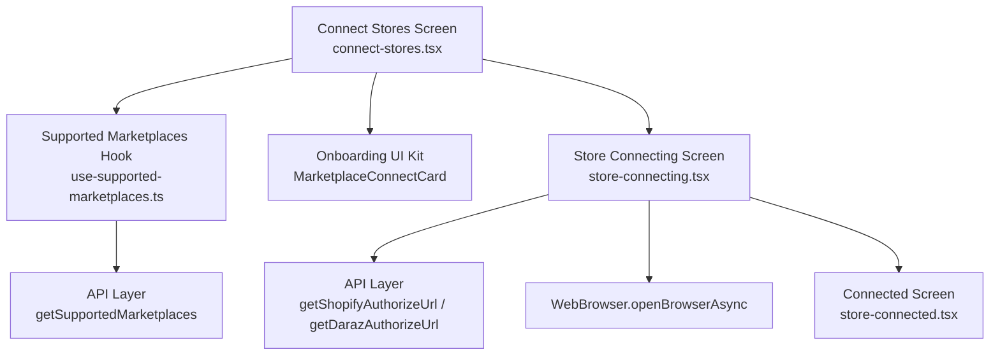
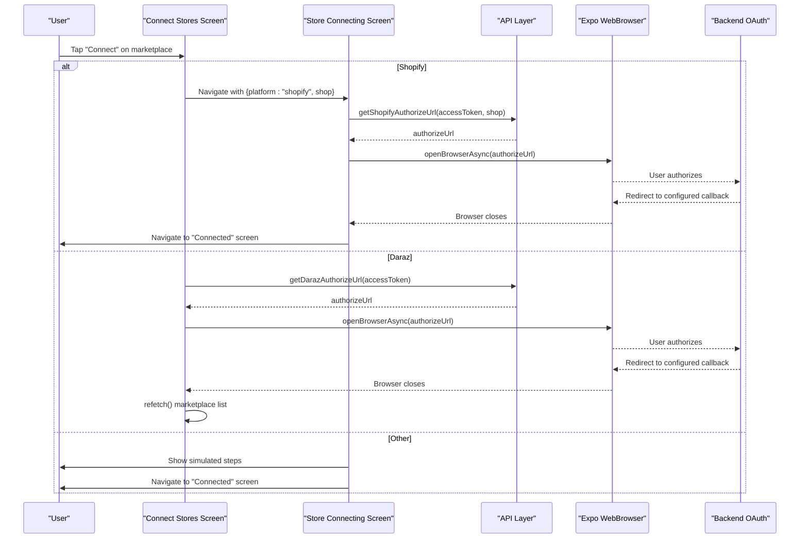
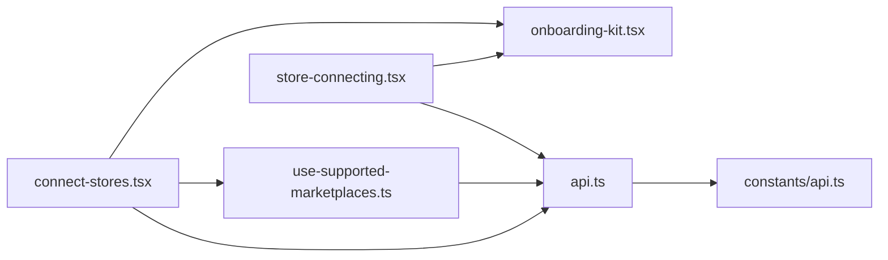

# Store Connection Management

<cite>
**Referenced Files in This Document**
- [connect-stores.tsx](file://src/app/(app)/connect-stores.tsx)
- [store-connecting.tsx](file://src/app/(app)/store-connecting.tsx)
- [store-connected.tsx](file://src/app/(app)/store-connected.tsx)
- [use-supported-marketplaces.ts](file://src/hooks/use-supported-marketplaces.ts)
- [use-shopify-access-token.ts](file://src/hooks/use-shopify-access-token.ts)
- [api.ts](file://src/lib/api.ts)
- [channels.ts](file://src/constants/channels.ts)
- [onboarding-kit.tsx](file://src/components/onboarding-kit.tsx)
- [api.ts (constants)](file://src/constants/api.ts)
</cite>

## Table of Contents
1. Introduction
2. Project Structure
3. Core Components
4. Architecture Overview
5. Detailed Component Analysis
6. Dependency Analysis
7. Performance Considerations
8. Troubleshooting Guide
9. Conclusion
10. Appendices

## Introduction
This document explains the store connection management system that lets users connect multiple marketplaces from within the app. It covers:
- The user interface flow for marketplace selection and connection status display
- OAuth authorization flows using Expo WebBrowser for secure authentication
- Error handling strategies for network failures, invalid credentials, and API rate limiting
- How to implement new marketplace connections following established patterns
- Platform-specific considerations for iOS and Android web browser integration
- Troubleshooting guides and debugging techniques for OAuth flows

## Project Structure
The store connection feature spans screens, hooks, UI components, and an API layer:
- Screens: Connect stores list, connecting progress, and connected confirmation
- Hooks: Fetch supported marketplaces and Shopify access tokens
- API: Centralized HTTP client with error normalization and OAuth URL helpers
- Constants: Channel metadata and base URL configuration
- UI Kit: Reusable cards, badges, and step indicators

**Diagram sources**
- [connect-stores.tsx:25-93](file://src/app/(app)/connect-stores.tsx#L25-L93)
- [store-connecting.tsx:19-68](file://src/app/(app)/store-connecting.tsx#L19-L68)
- [use-supported-marketplaces.ts:16-52](file://src/hooks/use-supported-marketplaces.ts#L16-L52)
- [api.ts:353-436](file://src/lib/api.ts#L353-L436)
- [onboarding-kit.tsx:101-147](file://src/components/onboarding-kit.tsx#L101-L147)

**Section sources**
- [connect-stores.tsx:25-93](file://src/app/(app)/connect-stores.tsx#L25-L93)
- [store-connecting.tsx:19-68](file://src/app/(app)/store-connecting.tsx#L19-L68)
- [use-supported-marketplaces.ts:16-52](file://src/hooks/use-supported-marketplaces.ts#L16-L52)
- [api.ts:353-436](file://src/lib/api.ts#L353-L436)
- [onboarding-kit.tsx:101-147](file://src/components/onboarding-kit.tsx#L101-L147)

## Core Components
- Marketplace selection screen: Displays available marketplaces, sorts connected ones first, shows loading/error states, and handles per-marketplace connect actions.
- Connecting screen: Shows a checklist of steps, opens the platform’s OAuth page via WebBrowser, and navigates to a success screen on completion or shows errors.
- Connected screen: Confirms successful connection and indicates what data will be synced.
- Supported marketplaces hook: Fetches marketplace list with bearer token, manages loading/error state, and exposes refetch.
- API layer: Normalizes errors, provides OAuth URL endpoints for Daraz and Shopify, and centralizes fetch/XHR logic.

**Section sources**
- [connect-stores.tsx:25-93](file://src/app/(app)/connect-stores.tsx#L25-L93)
- [store-connecting.tsx:19-68](file://src/app/(app)/store-connecting.tsx#L19-L68)
- [store-connected.tsx:14-79](file://src/app/(app)/store-connected.tsx#L14-L79)
- [use-supported-marketplaces.ts:16-52](file://src/hooks/use-supported-marketplaces.ts#L16-L52)
- [api.ts:53-77](file://src/lib/api.ts#L53-L77)

## Architecture Overview
The connection flow is split by platform:
- Shopify: User enters shop domain; app calls backend to obtain an OAuth authorize URL; WebBrowser opens it; after completion, navigate to connected screen.
- Daraz: App calls backend to obtain an OAuth authorize URL; WebBrowser opens it; after completion, refresh marketplace list to reflect new connection.
- Other platforms: Simulated handshake steps then navigate to connected screen.

**Diagram sources**
- [connect-stores.tsx:41-72](file://src/app/(app)/connect-stores.tsx#L41-L72)
- [store-connecting.tsx:31-68](file://src/app/(app)/store-connecting.tsx#L31-L68)
- [api.ts:379-436](file://src/lib/api.ts#L379-L436)

## Detailed Component Analysis

### Marketplace Selection Screen
Responsibilities:
- Load supported marketplaces and sort them so connected stores appear first
- Handle special flows for Shopify (domain input modal) and Daraz (direct OAuth)
- Display loading, empty, and error states with retry support
- Manage per-card connecting state and show errors inline

Key behaviors:
- For Shopify: Opens a modal to collect shop domain, validates input, and navigates to the connecting screen
- For Daraz: Calls backend to get OAuth URL, opens WebBrowser, then refetches marketplace list
- For other platforms: Navigates to connecting screen where simulated steps run

Error handling:
- Wraps API calls and displays ApiError messages when present
- Provides retry via refresh control

Platform notes:
- Uses WebBrowser.openBrowserAsync to launch external browser for OAuth

**Section sources**
- [connect-stores.tsx:25-93](file://src/app/(app)/connect-stores.tsx#L25-L93)
- [connect-stores.tsx:99-230](file://src/app/(app)/connect-stores.tsx#L99-L230)

### Connecting Screen
Responsibilities:
- Validate inputs (shop domain, auth token) before starting OAuth
- For Shopify: call backend to obtain OAuth URL and open WebBrowser
- For non-Shopify: simulate a multi-step handshake and then navigate to connected screen
- Surface errors and allow cancellation

Flow highlights:
- Validates shop domain and presence of access token
- Sets step statuses based on progress and errors
- On success, navigates to connected screen with channel context

Error handling:
- Converts network/API errors into user-friendly messages
- Guards against double-starts using a ref flag

**Section sources**
- [store-connecting.tsx:19-68](file://src/app/(app)/store-connecting.tsx#L19-L68)
- [store-connecting.tsx:70-89](file://src/app/(app)/store-connecting.tsx#L70-L89)
- [store-connecting.tsx:91-133](file://src/app/(app)/store-connecting.tsx#L91-L133)

### Connected Screen
Responsibilities:
- Confirm successful connection
- Show channel badge and sync tags
- Provide navigation back to main flow or to connect more stores

Behavior:
- Reads channel from route params and resolves channel metadata
- Offers primary action to continue to data import

**Section sources**
- [store-connected.tsx:14-79](file://src/app/(app)/store-connected.tsx#L14-L79)

### Supported Marketplaces Hook
Responsibilities:
- Fetch marketplace list with bearer token
- Manage loading and error states
- Expose refetch to trigger re-fetch

Behavior:
- Waits for access token before making request
- Normalizes errors to human-readable messages
- Supports manual refresh via key-based re-render

**Section sources**
- [use-supported-marketplaces.ts:16-52](file://src/hooks/use-supported-marketplaces.ts#L16-L52)

### API Layer
Responsibilities:
- Centralized HTTP client with robust error extraction
- SSE streaming utilities (not used directly by connection flows but part of shared infrastructure)
- OAuth URL helpers for Daraz and Shopify
- Type definitions for marketplace entities

OAuth helpers:
- getDarazAuthorizeUrl: Returns final redirect URL after server-side 302
- getShopifyAuthorizeUrl: Accepts shop parameter, returns final redirect URL

Error handling:
- Network errors: status 0 with friendly message
- HTTP errors: status code and extracted detail/message
- SSE errors: normalized via sseErrorMessage

**Section sources**
- [api.ts:53-77](file://src/lib/api.ts#L53-L77)
- [api.ts:379-436](file://src/lib/api.ts#L379-L436)
- [api.ts:206-213](file://src/lib/api.ts#L206-L213)

### UI Components
- MarketplaceConnectCard: Displays marketplace name/logo/url, disabled states for connected/connecting, and triggers connect action
- ExecutionStep: Animated step indicator for connecting screen
- SyncStatusPill and Tag: Status and tag visuals for connected screen

**Section sources**
- [onboarding-kit.tsx:101-147](file://src/components/onboarding-kit.tsx#L101-L147)
- [onboarding-kit.tsx:171-215](file://src/components/onboarding-kit.tsx#L171-L215)
- [onboarding-kit.tsx:149-167](file://src/components/onboarding-kit.tsx#L149-L167)

## Dependency Analysis
High-level dependencies:
- Screens depend on hooks for data and auth context
- Hooks depend on API layer for requests
- API layer depends on constants for base URL
- Screens use UI kit for consistent visuals

**Diagram sources**
- [connect-stores.tsx:25-93](file://src/app/(app)/connect-stores.tsx#L25-L93)
- [store-connecting.tsx:19-68](file://src/app/(app)/store-connecting.tsx#L19-L68)
- [use-supported-marketplaces.ts:16-52](file://src/hooks/use-supported-marketplaces.ts#L16-L52)
- [api.ts:353-436](file://src/lib/api.ts#L353-L436)
- [api.ts (constants):10-15](file://src/constants/api.ts#L10-L15)

**Section sources**
- [connect-stores.tsx:25-93](file://src/app/(app)/connect-stores.tsx#L25-L93)
- [store-connecting.tsx:19-68](file://src/app/(app)/store-connecting.tsx#L19-L68)
- [use-supported-marketplaces.ts:16-52](file://src/hooks/use-supported-marketplaces.ts#L16-L52)
- [api.ts:353-436](file://src/lib/api.ts#L353-L436)
- [api.ts (constants):10-15](file://src/constants/api.ts#L10-L15)

## Performance Considerations
- Avoid redundant OAuth calls: The connecting screen uses a ref to prevent duplicate starts.
- Minimize re-renders: Sorting marketplaces is memoized to avoid unnecessary list rebuilds.
- Efficient refresh: The marketplace hook supports refetch via a key increment to avoid full component remounts.
- Lightweight UI: Cards disable buttons during connecting to prevent repeated taps.

[No sources needed since this section provides general guidance]

## Troubleshooting Guide

Common issues and resolutions:
- Network failures:
  - Symptom: “Could not reach the server” or generic request failure
  - Cause: No internet, wrong base URL, or firewall blocking
  - Resolution: Verify device connectivity and correct API_BASE_URL for the environment
  - Where handled: Centralized error extraction and ApiError wrapping

- Invalid credentials or expired session:
  - Symptom: Authentication-related errors when fetching marketplace list or initiating OAuth
  - Cause: Missing or invalid access token
  - Resolution: Ensure user is logged in; re-authenticate if necessary
  - Where handled: Screens check accessToken before proceeding; hook waits for token

- API rate limiting:
  - Symptom: HTTP errors with status codes indicating throttling
  - Cause: Backend rate limits on OAuth endpoints or marketplace listing
  - Resolution: Retry after delay; inform user to try again later
  - Where handled: ApiError carries status and message; UI surfaces retry options

- Shopify domain validation:
  - Symptom: Error prompting to enter shop domain
  - Cause: Empty or malformed domain
  - Resolution: Enter a valid domain without protocol or trailing path
  - Where handled: Input normalization and validation in connect and connecting screens

- WebBrowser not opening:
  - Symptom: OAuth page fails to launch
  - Cause: Platform/browser configuration or missing scheme handlers
  - Resolution: Check platform settings; ensure expo-web-browser is configured; test on device vs simulator

Debugging techniques:
- Log authorize URLs before launching WebBrowser to verify correctness
- Use console logs around API calls to inspect payloads and responses
- Inspect ApiError instances for status and message details
- Test with different networks (Wi-Fi, cellular) to isolate connectivity issues
- Validate backend callbacks are correctly configured for each marketplace

**Section sources**
- [api.ts:53-77](file://src/lib/api.ts#L53-L77)
- [api.ts:379-436](file://src/lib/api.ts#L379-L436)
- [connect-stores.tsx:41-93](file://src/app/(app)/connect-stores.tsx#L41-L93)
- [store-connecting.tsx:31-68](file://src/app/(app)/store-connecting.tsx#L31-L68)

## Conclusion
The store connection system provides a clear, secure, and extensible flow for connecting multiple marketplaces. It leverages Expo WebBrowser for OAuth, centralizes error handling, and offers consistent UI feedback across platforms. By following the established patterns, you can add new marketplace integrations with minimal friction while maintaining a robust user experience.

[No sources needed since this section summarizes without analyzing specific files]

## Appendices

### Implementing a New Marketplace Connection
Follow these steps to add a new marketplace:
1. Define channel metadata in channels if needed for branding and labels
2. Add an API helper in api.ts to obtain the OAuth authorize URL from your backend
3. Update connect-stores.tsx to handle the new slug:
   - If it requires a domain or extra input, add a prompt similar to Shopify
   - Otherwise, navigate to store-connecting.tsx with the platform slug
4. In store-connecting.tsx:
   - Add platform-specific logic to call the new API helper and open WebBrowser
   - Optionally add simulated steps for non-OAuth flows
   - Navigate to store-connected.tsx on success
5. Update MarketplaceConnectCard usage to render the new marketplace from the list
6. Test on both iOS and Android devices/simulators

**Section sources**
- [channels.ts:1-26](file://src/constants/channels.ts#L1-L26)
- [api.ts:379-436](file://src/lib/api.ts#L379-L436)
- [connect-stores.tsx:41-93](file://src/app/(app)/connect-stores.tsx#L41-L93)
- [store-connecting.tsx:31-68](file://src/app/(app)/store-connecting.tsx#L31-L68)
- [onboarding-kit.tsx:101-147](file://src/components/onboarding-kit.tsx#L101-L147)

### Platform-Specific Considerations for iOS and Android
- Base URL configuration:
  - Android emulator may require a specific host alias; physical devices need LAN IP or remote endpoint
  - Environment variable override available for custom backend endpoints
- WebBrowser behavior:
  - Ensure schemes and redirects are allowed in platform settings
  - Test OAuth callbacks on real devices to confirm redirection works as expected

**Section sources**
- [api.ts (constants):10-15](file://src/constants/api.ts#L10-L15)