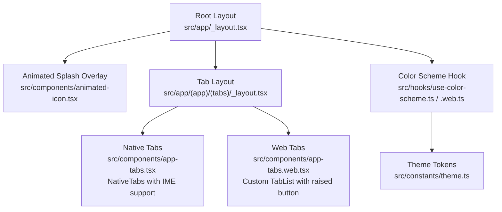
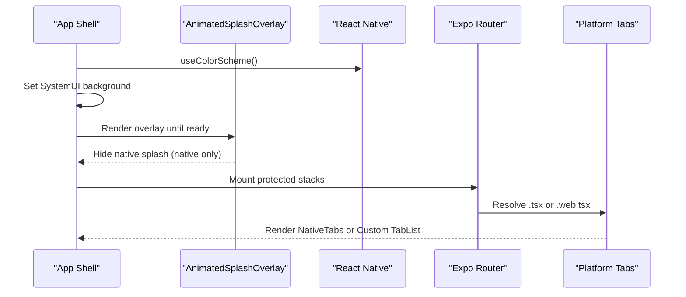
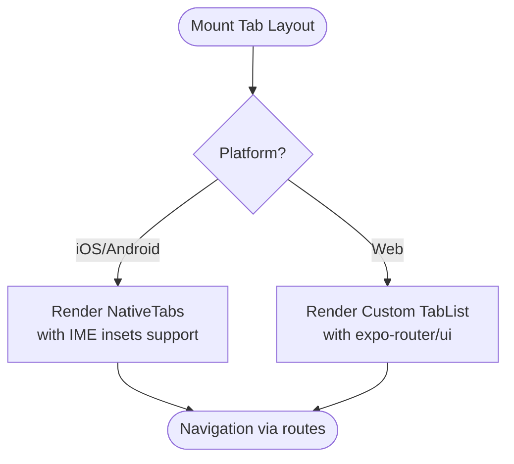
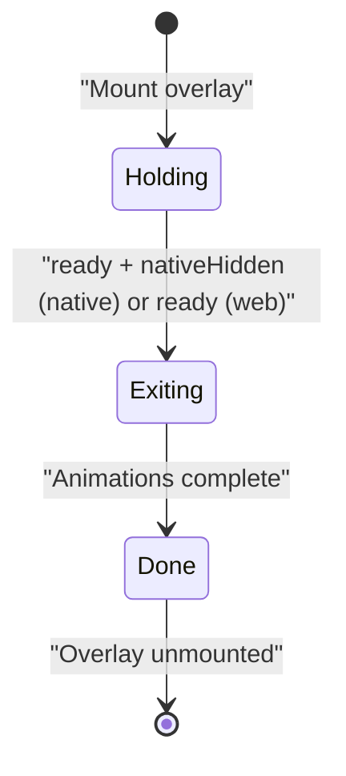
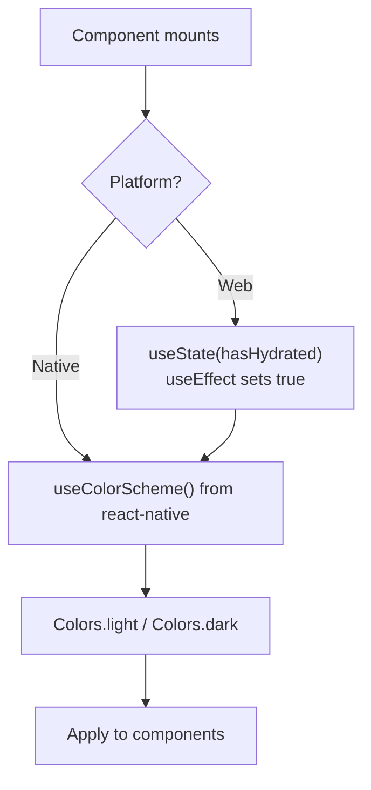
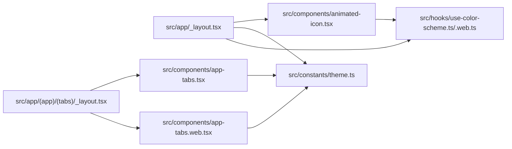

# Platform Specifics

<cite>
**Referenced Files in This Document**
- [app.json](file://app.json)
- [src/app/_layout.tsx](file://src/app/_layout.tsx)
- [src/app/(app)/(tabs)/_layout.tsx](file://src/app/(app)/(tabs)/_layout.tsx)
- [src/components/app-tabs.tsx](file://src/components/app-tabs.tsx)
- [src/components/app-tabs.web.tsx](file://src/components/app-tabs.web.tsx)
- [src/components/animated-icon.tsx](file://src/components/animated-icon.tsx)
- [src/components/animated-icon.web.tsx](file://src/components/animated-icon.web.tsx)
- [src/hooks/use-color-scheme.ts](file://src/hooks/use-color-scheme.ts)
- [src/hooks/use-color-scheme.web.ts](file://src/hooks/use-color-scheme.web.ts)
- [src/constants/theme.ts](file://src/constants/theme.ts)
</cite>

## Update Summary
**Changes Made**
- Updated navigation patterns section to reflect new Expo Router APIs and NativeTabs implementation
- Enhanced IME insets handling documentation for improved keyboard interaction
- Added details about unstable-native-tabs usage and platform-specific behaviors
- Updated web tab implementation details with expo-router/ui components

## Table of Contents
1. Introduction
2. Project Structure
3. Core Components
4. Architecture Overview
5. Detailed Component Analysis
6. Dependency Analysis
7. Performance Considerations
8. Troubleshooting Guide
9. Conclusion
10. Appendices

## Introduction
This document explains platform-specific implementations and adaptations across web, iOS, and Android for the application. It focuses on:
- Web-specific tab bar implementation versus native mobile tabs using modern Expo Router APIs
- Color scheme handling differences between platforms
- Animated icon/splash behavior and browser compatibility considerations
- Platform detection patterns and conditional rendering strategies
- Expo configuration for platform-specific settings
- Deployment considerations per platform
- Testing guidance and handling platform-specific bugs

## Project Structure
The app uses Expo Router with a root layout that gates navigation based on authentication state and shows an animated splash overlay until fonts and session are ready. The tab bar is implemented differently per platform using modern Expo Router APIs:
- Native (iOS/Android): Uses `NativeTabs` from `expo-router/unstable-native-tabs` with enhanced IME insets support
- Web: Uses a custom web tab bar built on `expo-router/ui` Tabs with floating pill-style design

**Diagram sources**
- [src/app/_layout.tsx:18-56](file://src/app/_layout.tsx#L18-L56)
- [src/app/(app)/(tabs)/_layout.tsx:1-8](file://src/app/(app)/(tabs)/_layout.tsx#L1-L8)
- [src/components/app-tabs.tsx:1-65](file://src/components/app-tabs.tsx#L1-L65)
- [src/components/app-tabs.web.tsx:1-170](file://src/components/app-tabs.web.tsx#L1-L170)
- [src/components/animated-icon.tsx:27-126](file://src/components/animated-icon.tsx#L27-L126)
- [src/hooks/use-color-scheme.ts:1-2](file://src/hooks/use-color-scheme.ts#L1-L2)
- [src/hooks/use-color-scheme.web.ts:1-22](file://src/hooks/use-color-scheme.web.ts#L1-L22)
- [src/constants/theme.ts:117-141](file://src/constants/theme.ts#L117-L141)

**Section sources**
- [src/app/_layout.tsx:18-56](file://src/app/_layout.tsx#L18-L56)
- [src/app/(app)/(tabs)/_layout.tsx:1-8](file://src/app/(app)/(tabs)/_layout.tsx#L1-L8)

## Core Components
- Root layout orchestrates theme provider, font loading, system UI background color, and splash overlay lifecycle.
- Tab layouts delegate to platform-specific tab components via file suffix resolution (.tsx vs .web.tsx).
- Animated splash/icon components bridge native splash and in-app animations, with a lighter web variant.
- Color scheme hooks abstract platform differences; the web hook ensures hydration safety for static rendering.
- Theme constants define tokens used by both native and web components.

Key responsibilities:
- Root layout: prevent auto-hide splash, set system UI background, mount providers, render navigator.
- Tabs: native uses `NativeTabs` with IME insets support; web renders a floating pill-style bar with a raised center action.
- Splash: native hides OS splash after fonts/auth; web overlays themed content without native APIs.
- Color scheme: native delegates to React Native; web defers to client-side detection after hydration.

**Section sources**
- [src/app/_layout.tsx:18-56](file://src/app/_layout.tsx#L18-L56)
- [src/components/app-tabs.tsx:1-65](file://src/components/app-tabs.tsx#L1-L65)
- [src/components/app-tabs.web.tsx:1-170](file://src/components/app-tabs.web.tsx#L1-L170)
- [src/components/animated-icon.tsx:27-126](file://src/components/animated-icon.tsx#L27-L126)
- [src/components/animated-icon.web.tsx:25-131](file://src/components/animated-icon.web.tsx#L25-L131)
- [src/hooks/use-color-scheme.ts:1-2](file://src/hooks/use-color-scheme.ts#L1-L2)
- [src/hooks/use-color-scheme.web.ts:1-22](file://src/hooks/use-color-scheme.web.ts#L1-L22)
- [src/constants/theme.ts:117-141](file://src/constants/theme.ts#L117-L141)

## Architecture Overview
The runtime flow coordinates splash, fonts, auth, and navigation while respecting platform capabilities and modern Expo Router APIs.

**Diagram sources**
- [src/app/_layout.tsx:18-56](file://src/app/_layout.tsx#L18-L56)
- [src/components/animated-icon.tsx:27-126](file://src/components/animated-icon.tsx#L27-L126)
- [src/components/app-tabs.tsx:1-65](file://src/components/app-tabs.tsx#L1-L65)
- [src/components/app-tabs.web.tsx:1-170](file://src/components/app-tabs.web.tsx#L1-L170)

## Detailed Component Analysis

### Modern Expo Router Navigation Patterns
**Updated** The navigation system now leverages Expo Router's latest APIs for improved cross-platform consistency and enhanced keyboard handling.

- **Native Implementation**: Uses `NativeTabs` from `expo-router/unstable-native-tabs` with `tabBarRespectsIMEInsets={true}` for proper keyboard handling
- **Web Implementation**: Uses `expo-router/ui` components (`Tabs`, `TabList`, `TabTrigger`) with custom styling for a floating pill design
- **Route Consistency**: Both platforms maintain identical route names for seamless navigation switching

**Diagram sources**
- [src/app/(app)/(tabs)/_layout.tsx:1-8](file://src/app/(app)/(tabs)/_layout.tsx#L1-L8)
- [src/components/app-tabs.tsx:1-65](file://src/components/app-tabs.tsx#L1-L65)
- [src/components/app-tabs.web.tsx:1-170](file://src/components/app-tabs.web.tsx#L1-L170)

**Section sources**
- [src/components/app-tabs.tsx:1-65](file://src/components/app-tabs.tsx#L1-L65)
- [src/components/app-tabs.web.tsx:1-170](file://src/components/app-tabs.web.tsx#L1-L170)

### Enhanced IME Insets Handling
**Updated** The native tab bar now includes improved Input Method Editor (IME) insets handling for better keyboard interaction experiences.

- **IME Support**: `tabBarRespectsIMEInsets={true}` ensures the tab bar properly adjusts when keyboards appear
- **Cross-Platform Consistency**: Both iOS and Android benefit from consistent keyboard avoidance behavior
- **Performance Optimization**: Native-level inset handling provides smooth transitions without layout thrashing

**Section sources**
- [src/components/app-tabs.tsx:12-16](file://src/components/app-tabs.tsx#L12-L16)

### Web Tab Bar Implementation
The web implementation provides a sophisticated floating pill-style tab bar with enhanced visual hierarchy.

- **Floating Design**: Uses absolute positioning with bottom alignment for a modern pill-shaped container
- **Raised Center Button**: The "Ask Tijarah" button floats above the tab bar with a circular design and primary color treatment
- **Responsive Layout**: Adapts to different screen sizes with maximum content width constraints
- **Accessibility**: Maintains proper focus states and press interactions across all tab items

**Section sources**
- [src/components/app-tabs.web.tsx:24-51](file://src/components/app-tabs.web.tsx#L24-L51)
- [src/components/app-tabs.web.tsx:77-99](file://src/components/app-tabs.web.tsx#L77-L99)
- [src/components/app-tabs.web.tsx:101-109](file://src/components/app-tabs.web.tsx#L101-L109)

### Animated Icon and Splash Behavior
- Native: Bridges the native splash screen with an in-app animated overlay that fades out after fonts and session are ready. Hides the native splash once the overlay mounts.
- Web: Provides a similar visual experience without native splash APIs; uses reanimated for pulse/glow effects and image assets.

**Diagram sources**
- [src/components/animated-icon.tsx:27-126](file://src/components/animated-icon.tsx#L27-L126)
- [src/components/animated-icon.web.tsx:25-131](file://src/components/animated-icon.web.tsx#L25-L131)

**Section sources**
- [src/components/animated-icon.tsx:27-126](file://src/components/animated-icon.tsx#L27-L126)
- [src/components/animated-icon.web.tsx:25-131](file://src/components/animated-icon.web.tsx#L25-L131)

### Color Scheme Handling
- Native: Delegates to React Native's useColorScheme.
- Web: Overrides to ensure correct value after hydration to avoid mismatch during static rendering.
- Theme tokens provide light/dark palettes consumed by components.

**Diagram sources**
- [src/hooks/use-color-scheme.ts:1-2](file://src/hooks/use-color-scheme.ts#L1-L2)
- [src/hooks/use-color-scheme.web.ts:1-22](file://src/hooks/use-color-scheme.web.ts#L1-L22)
- [src/constants/theme.ts:117-141](file://src/constants/theme.ts#L117-L141)

**Section sources**
- [src/hooks/use-color-scheme.ts:1-2](file://src/hooks/use-color-scheme.ts#L1-L2)
- [src/hooks/use-color-scheme.web.ts:1-22](file://src/hooks/use-color-scheme.web.ts#L1-L22)
- [src/constants/theme.ts:117-141](file://src/constants/theme.ts#L117-L141)

### Platform Detection Patterns and Conditional Rendering
- File suffix resolution: app-tabs.tsx for native, app-tabs.web.tsx for web.
- Platform.select used in theme for fonts and insets.
- Conditional logic in UI for keyboard handling and picker modes where applicable.

Examples of usage:
- Font families and spacing/insets selection by platform.
- KeyboardAvoidingView behavior differs by OS.
- Date/time picker mode varies by platform.

**Section sources**
- [src/constants/theme.ts:145-168](file://src/constants/theme.ts#L145-L168)
- [src/constants/theme.ts:261-262](file://src/constants/theme.ts#L261-L262)

### Expo Configuration (app.json)
Key platform-specific settings:
- Global: name, slug, version, orientation, scheme, userInterfaceStyle, backgroundColor
- iOS: icon asset
- Android: adaptive icon assets, background color, predictive back gesture toggle
- Web: output type and favicon
- Plugins: router, splash screen (with dark mode variants), fonts, secure store, datetime picker
- Experiments: typed routes enabled, React compiler disabled

These settings control app identity, appearance, and capabilities per platform.

**Section sources**
- [app.json:1-56](file://app.json#L1-L56)

## Dependency Analysis
The following diagram maps key dependencies among core files involved in platform specifics.

**Diagram sources**
- [src/app/_layout.tsx:18-56](file://src/app/_layout.tsx#L18-L56)
- [src/app/(app)/(tabs)/_layout.tsx:1-8](file://src/app/(app)/(tabs)/_layout.tsx#L1-L8)
- [src/components/app-tabs.tsx:1-65](file://src/components/app-tabs.tsx#L1-L65)
- [src/components/app-tabs.web.tsx:1-170](file://src/components/app-tabs.web.tsx#L1-L170)
- [src/components/animated-icon.tsx:27-126](file://src/components/animated-icon.tsx#L27-L126)
- [src/hooks/use-color-scheme.ts:1-2](file://src/hooks/use-color-scheme.ts#L1-L2)
- [src/hooks/use-color-scheme.web.ts:1-22](file://src/hooks/use-color-scheme.web.ts#L1-L22)
- [src/constants/theme.ts:117-141](file://src/constants/theme.ts#L117-L141)

**Section sources**
- [src/app/_layout.tsx:18-56](file://src/app/_layout.tsx#L18-L56)
- [src/app/(app)/(tabs)/_layout.tsx:1-8](file://src/app/(app)/(tabs)/_layout.tsx#L1-L8)
- [src/components/app-tabs.tsx:1-65](file://src/components/app-tabs.tsx#L1-L65)
- [src/components/app-tabs.web.tsx:1-170](file://src/components/app-tabs.web.tsx#L1-L170)
- [src/components/animated-icon.tsx:27-126](file://src/components/animated-icon.tsx#L27-L126)
- [src/hooks/use-color-scheme.ts:1-2](file://src/hooks/use-color-scheme.ts#L1-L2)
- [src/hooks/use-color-scheme.web.ts:1-22](file://src/hooks/use-color-scheme.web.ts#L1-L22)
- [src/constants/theme.ts:117-141](file://src/constants/theme.ts#L117-L141)

## Performance Considerations
- Avoid heavy work during splash; keep animations short and cancel them when exiting.
- Use shared values and derived styles for smooth transitions on web and native.
- Prefer platform-native components where available (e.g., NativeTabs with IME support) to reduce custom layout costs.
- On web, defer color scheme evaluation until after hydration to prevent layout shifts.
- Leverage unstable-native-tabs for optimal performance on mobile platforms.

## Troubleshooting Guide
Common issues and resolutions:
- Flash of wrong theme on web: Ensure the web color scheme hook returns a default before hydration completes.
- Splash not hiding on native: Verify the overlay mounts and calls hideAsync; confirm fonts loaded before showing content.
- Mismatched tab visuals: Confirm the correct file suffix resolves (.tsx vs .web.tsx) and route names match.
- Picker/keyboard differences: Adjust behavior and modes per platform where necessary.
- IME insets issues: Verify `tabBarRespectsIMEInsets={true}` is set for proper keyboard handling on native platforms.

**Section sources**
- [src/hooks/use-color-scheme.web.ts:1-22](file://src/hooks/use-color-scheme.web.ts#L1-L22)
- [src/components/animated-icon.tsx:27-126](file://src/components/animated-icon.tsx#L27-L126)
- [src/app/(app)/(tabs)/_layout.tsx:1-8](file://src/app/(app)/(tabs)/_layout.tsx#L1-L8)
- [src/components/app-tabs.tsx:12-16](file://src/components/app-tabs.tsx#L12-L16)

## Conclusion
The app achieves consistent UX across platforms by:
- Using modern Expo Router APIs for native tabs with enhanced IME insets support
- Implementing a sophisticated web tab bar with floating pill design and raised center button
- Centralizing theme tokens and color scheme hooks
- Leveraging Expo configuration for platform capabilities
Following the patterns here will help maintain parity, performance, and reliability across web, iOS, and Android.

## Appendices

### Deployment Considerations
- Web: Static output configured; ensure favicon and assets are included; verify routing works in static hosting environments.
- iOS: Provide appropriate icon; review any required permissions if adding features later.
- Android: Configure adaptive icons and background color; consider predictive back gesture behavior.

**Section sources**
- [app.json:1-56](file://app.json#L1-L56)

### Testing Across Platforms
- Test tab navigation on both native and web to ensure route parity.
- Validate splash behavior on native devices/emulators and web browsers.
- Check color scheme switching on all platforms; verify no flash or mismatch occurs.
- Test input behaviors (keyboard avoidance, pickers) on iOS and Android.
- Verify IME insets handling on native platforms when keyboards appear.
- Test the floating pill tab bar responsiveness on various web screen sizes.