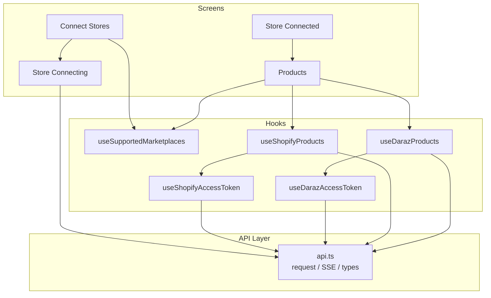
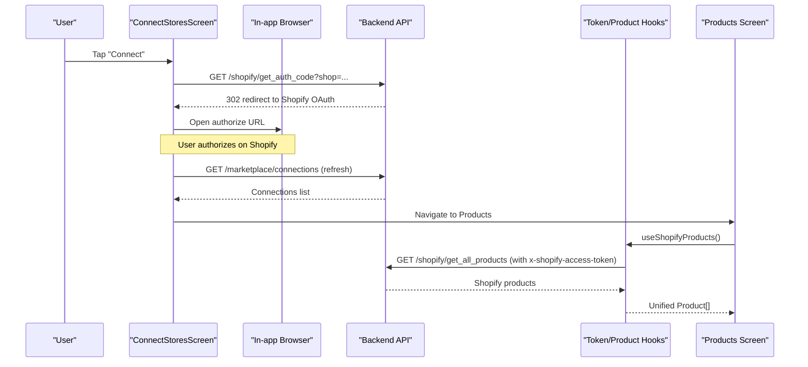
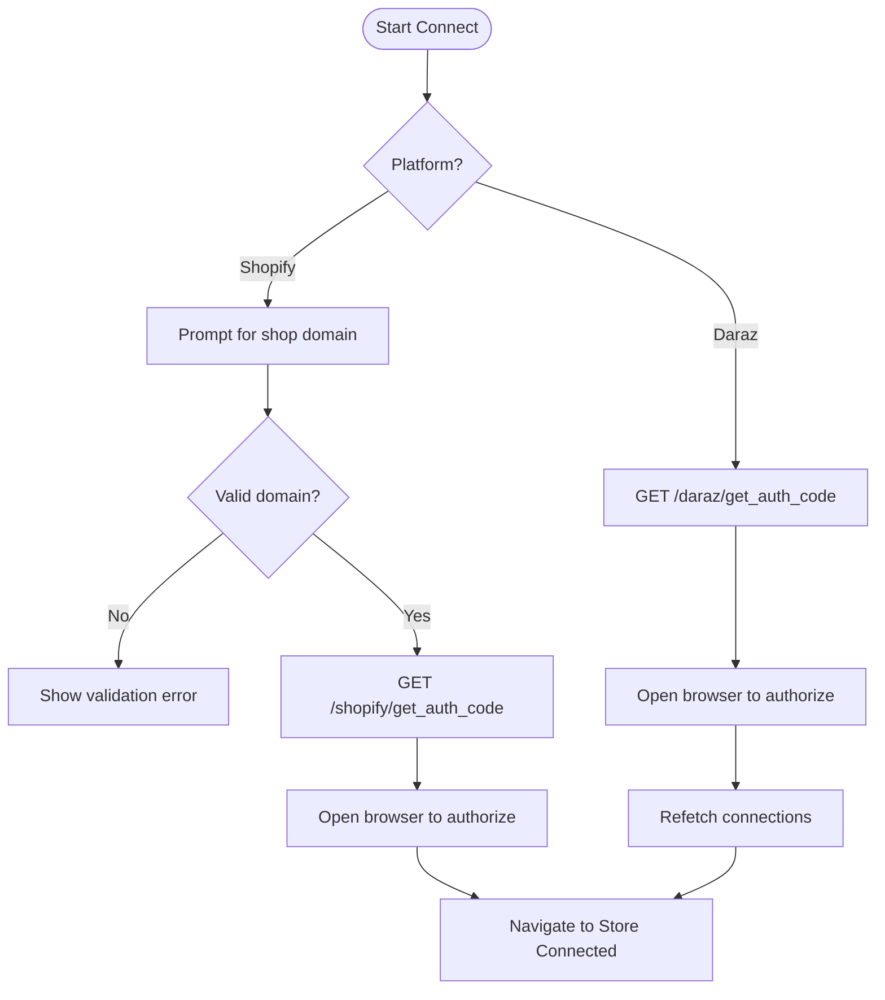
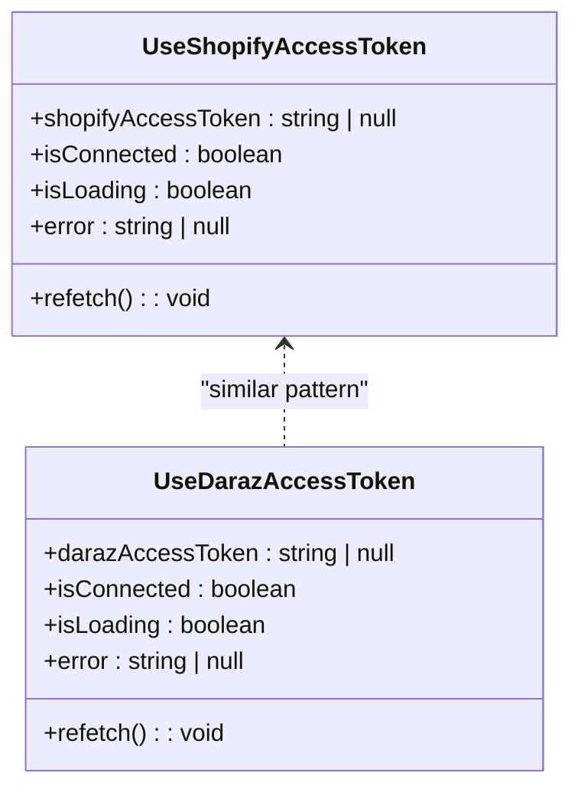
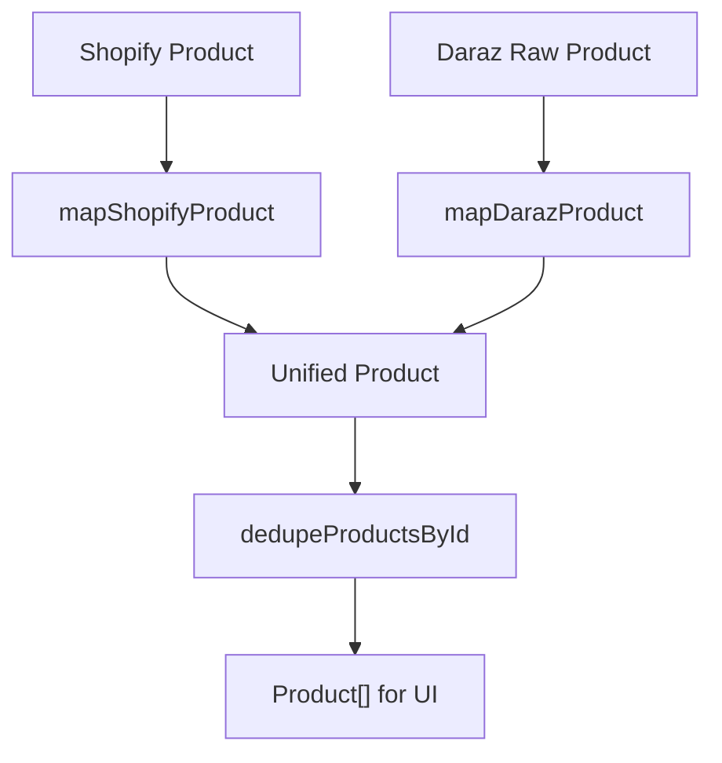
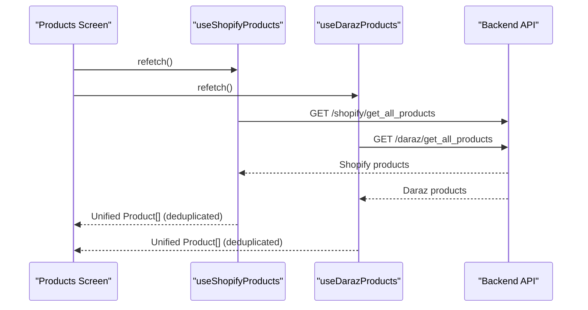
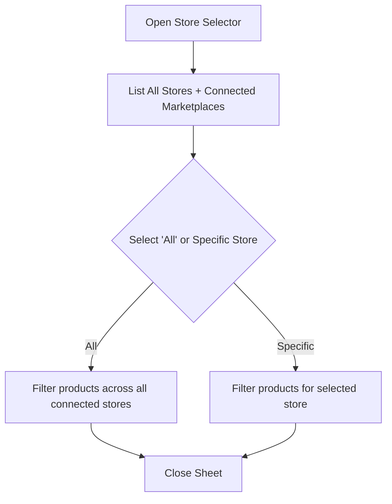
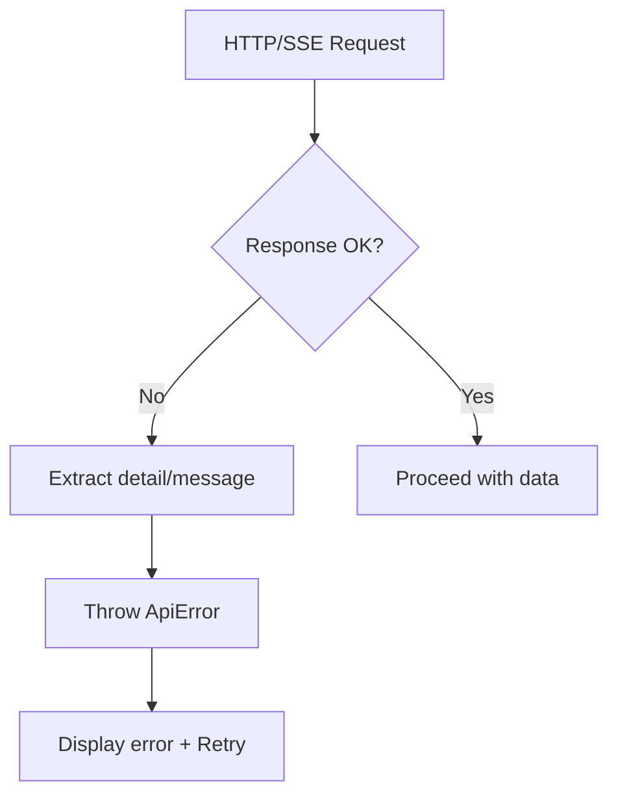
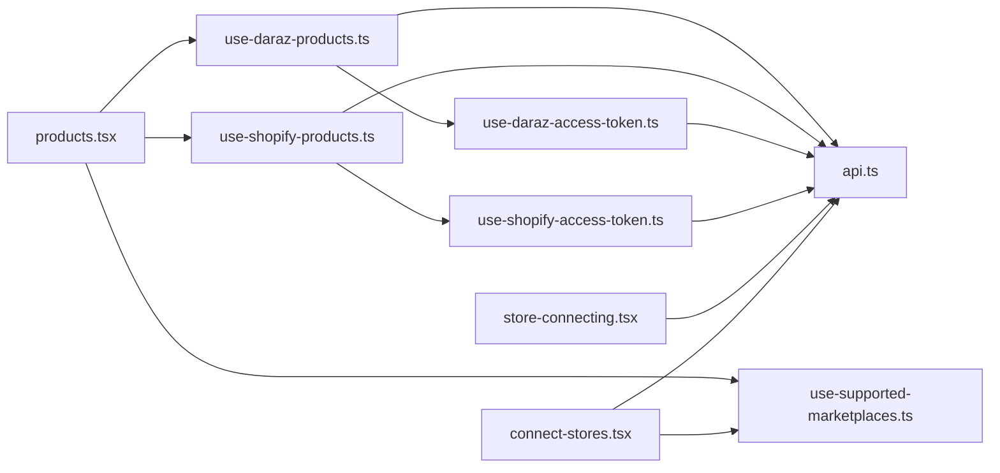

# Multi-Marketplace Synchronization

<cite>
**Referenced Files in This Document**
- [connect-stores.tsx](file://src/app/(app)/connect-stores.tsx)
- [store-connecting.tsx](file://src/app/(app)/store-connecting.tsx)
- [store-connected.tsx](file://src/app/(app)/store-connected.tsx)
- [products.tsx](file://src/app/(app)/(tabs)/products.tsx)
- [store-selector-sheet.tsx](file://src/components/store-selector-sheet.tsx)
- [channels.ts](file://src/constants/channels.ts)
- [use-supported-marketplaces.ts](file://src/hooks/use-supported-marketplaces.ts)
- [use-shopify-access-token.ts](file://src/hooks/use-shopify-access-token.ts)
- [use-daraz-access-token.ts](file://src/hooks/use-daraz-access-token.ts)
- [use-shopify-products.ts](file://src/hooks/use-shopify-products.ts)
- [use-daraz-products.ts](file://src/hooks/use-daraz-products.ts)
- [api.ts](file://src/lib/api.ts)
</cite>

## Table of Contents
1. Introduction
2. Project Structure
3. Core Components
4. Architecture Overview
5. Detailed Component Analysis
6. Dependency Analysis
7. Performance Considerations
8. Troubleshooting Guide
9. Conclusion

## Introduction
This document explains the multi-marketplace product synchronization system that unifies data from Shopify and Daraz into a single product model, with Amazon defined as a supported channel for future expansion. It covers connection establishment (including OAuth flows), credential management, synchronization strategies (conflict resolution via deduplication, data transformation, and update propagation), marketplace-specific field mappings, error handling, retry mechanisms, status monitoring, and the store selection interface for managing multiple marketplaces simultaneously.

## Project Structure
The app is organized by feature areas:
- App screens handle user flows for connecting stores and viewing products.
- Hooks encapsulate marketplace-specific logic (connections, tokens, product fetching).
- The API layer centralizes HTTP calls, streaming, error normalization, and type definitions.
- Constants define channels and ordering.
- UI components provide reusable store selection and presentation.

**Diagram sources**
- [connect-stores.tsx:25-72](file://src/app/(app)/connect-stores.tsx#L25-L72)
- [store-connecting.tsx:19-82](file://src/app/(app)/store-connecting.tsx#L19-L82)
- [store-connected.tsx:14-79](file://src/app/(app)/store-connected.tsx#L14-L79)
- [products.tsx:29-87](file://src/app/(app)/(tabs)/products.tsx#L29-L87)
- [use-supported-marketplaces.ts:16-53](file://src/hooks/use-supported-marketplaces.ts#L16-L53)
- [use-shopify-access-token.ts:6-30](file://src/hooks/use-shopify-access-token.ts#L6-L30)
- [use-daraz-access-token.ts:19-65](file://src/hooks/use-daraz-access-token.ts#L19-L65)
- [use-shopify-products.ts:27-49](file://src/hooks/use-shopify-products.ts#L27-L49)
- [use-daraz-products.ts:120-183](file://src/hooks/use-daraz-products.ts#L120-L183)
- [api.ts:53-77](file://src/lib/api.ts#L53-L77)

**Section sources**
- [connect-stores.tsx:25-72](file://src/app/(app)/connect-stores.tsx#L25-L72)
- [store-connecting.tsx:19-82](file://src/app/(app)/store-connecting.tsx#L19-L82)
- [store-connected.tsx:14-79](file://src/app/(app)/store-connected.tsx#L14-L79)
- [products.tsx:29-87](file://src/app/(app)/(tabs)/products.tsx#L29-L87)
- [use-supported-marketplaces.ts:16-53](file://src/hooks/use-supported-marketplaces.ts#L16-L53)
- [use-shopify-access-token.ts:6-30](file://src/hooks/use-shopify-access-token.ts#L6-L30)
- [use-daraz-access-token.ts:19-65](file://src/hooks/use-daraz-access-token.ts#L19-L65)
- [use-shopify-products.ts:27-49](file://src/hooks/use-shopify-products.ts#L27-L49)
- [use-daraz-products.ts:120-183](file://src/hooks/use-daraz-products.ts#L120-L183)
- [api.ts:53-77](file://src/lib/api.ts#L53-L77)

## Core Components
- Connection discovery and listing: Supported marketplaces are fetched and sorted to show connected stores first.
- OAuth initiation:
  - Shopify: Collects shop domain, requests an authorize URL, opens browser, then navigates to success screen.
  - Daraz: Requests an authorize URL and opens browser; after completion, refreshes state.
- Token resolution:
  - Shopify access token is retrieved from stored connections.
  - Daraz access token is similarly resolved and reused for product fetches.
- Product synchronization:
  - Shopify products are fetched using the stored Shopify access token and mapped to the unified Product model.
  - Daraz products are fetched using the stored Daraz access token, normalized, and mapped to the unified Product model.
- Store selection: A bottom sheet allows filtering by “All Stores” or a specific connected marketplace.

**Section sources**
- [connect-stores.tsx:25-72](file://src/app/(app)/connect-stores.tsx#L25-L72)
- [store-connecting.tsx:19-82](file://src/app/(app)/store-connecting.tsx#L19-L82)
- [use-shopify-access-token.ts:6-30](file://src/hooks/use-shopify-access-token.ts#L6-L30)
- [use-daraz-access-token.ts:19-65](file://src/hooks/use-daraz-access-token.ts#L19-L65)
- [use-shopify-products.ts:27-49](file://src/hooks/use-shopify-products.ts#L27-L49)
- [use-daraz-products.ts:120-183](file://src/hooks/use-daraz-products.ts#L120-L183)
- [store-selector-sheet.tsx:22-129](file://src/components/store-selector-sheet.tsx#L22-L129)

## Architecture Overview
The system uses a layered architecture:
- UI screens orchestrate user interactions and navigation.
- React hooks manage per-marketplace state, token resolution, and data fetching.
- The API layer provides typed functions for REST and SSE endpoints, normalizes errors, and handles platform differences.

**Diagram sources**
- [connect-stores.tsx:41-72](file://src/app/(app)/connect-stores.tsx#L41-L72)
- [store-connecting.tsx:31-68](file://src/app/(app)/store-connecting.tsx#L31-L68)
- [use-shopify-products.ts:27-49](file://src/hooks/use-shopify-products.ts#L27-L49)
- [api.ts:405-436](file://src/lib/api.ts#L405-L436)
- [api.ts:1076-1078](file://src/lib/api.ts#L1076-L1078)

## Detailed Component Analysis

### Connection Establishment and OAuth Flows
- Shopify flow:
  - The connect screen prompts for the shop domain, validates it, and navigates to the connecting screen.
  - The connecting screen requests an authorize URL from the backend and opens it in the browser. After authorization, it navigates to the connected success screen.
- Daraz flow:
  - The connect screen requests an authorize URL and opens it in the browser. After closing the browser, it refetches marketplace connections to reflect the new connection.

**Diagram sources**
- [connect-stores.tsx:41-72](file://src/app/(app)/connect-stores.tsx#L41-L72)
- [store-connecting.tsx:31-68](file://src/app/(app)/store-connecting.tsx#L31-L68)
- [api.ts:379-400](file://src/lib/api.ts#L379-L400)
- [api.ts:405-436](file://src/lib/api.ts#L405-L436)

**Section sources**
- [connect-stores.tsx:41-72](file://src/app/(app)/connect-stores.tsx#L41-L72)
- [store-connecting.tsx:31-68](file://src/app/(app)/store-connecting.tsx#L31-L68)
- [api.ts:379-400](file://src/lib/api.ts#L379-L400)
- [api.ts:405-436](file://src/lib/api.ts#L405-L436)

### Credential Management
- Tokens are stored as encrypted access tokens in marketplace connections and retrieved via a dedicated hook per marketplace.
- Shopify token retrieval:
  - Fetches connections and finds the Shopify entry with an encrypted access token.
- Daraz token retrieval:
  - Similar process for Daraz, exposing isConnected and the token for subsequent product operations.

**Diagram sources**
- [use-shopify-access-token.ts:6-30](file://src/hooks/use-shopify-access-token.ts#L6-L30)
- [use-daraz-access-token.ts:19-65](file://src/hooks/use-daraz-access-token.ts#L19-L65)

**Section sources**
- [use-shopify-access-token.ts:6-30](file://src/hooks/use-shopify-access-token.ts#L6-L30)
- [use-daraz-access-token.ts:19-65](file://src/hooks/use-daraz-access-token.ts#L19-L65)

### Data Transformation and Unified Product Model
- Unified Product model includes fields like title, price, description, image(s), category, brand/model/warranty (for Daraz), stockQuantity, url, and platform origin.
- Shopify mapping:
  - Extracts images from variants and featured image, sets price from the first variant, and maps category and inventory.
- Daraz mapping:
  - Extracts item_id, attributes (name/description with English fallback), SKU-level pricing and images, aggregates stock quantity across SKUs, and preserves brand/model/warranty.

**Diagram sources**
- [use-shopify-products.ts:7-25](file://src/hooks/use-shopify-products.ts#L7-L25)
- [use-daraz-products.ts:30-96](file://src/hooks/use-daraz-products.ts#L30-L96)
- [api.ts:468-494](file://src/lib/api.ts#L468-L494)
- [api.ts:497-505](file://src/lib/api.ts#L497-L505)

**Section sources**
- [use-shopify-products.ts:7-25](file://src/hooks/use-shopify-products.ts#L7-L25)
- [use-daraz-products.ts:30-96](file://src/hooks/use-daraz-products.ts#L30-L96)
- [api.ts:468-494](file://src/lib/api.ts#L468-L494)
- [api.ts:497-505](file://src/lib/api.ts#L497-L505)

### Synchronization Strategies
- Conflict resolution:
  - Duplicate product IDs are removed client-side using a deduplication function to ensure consistent lists.
- Update propagation:
  - Refresh actions trigger refetch of marketplace connections and product lists to keep UI current.
- Marketplace-specific updates:
  - Shopify and Daraz product lists are refreshed independently based on their respective connection states.

**Diagram sources**
- [products.tsx:82-87](file://src/app/(app)/(tabs)/products.tsx#L82-L87)
- [use-shopify-products.ts:27-49](file://src/hooks/use-shopify-products.ts#L27-L49)
- [use-daraz-products.ts:120-183](file://src/hooks/use-daraz-products.ts#L120-L183)
- [api.ts:1076-1078](file://src/lib/api.ts#L1076-L1078)
- [api.ts:449-459](file://src/lib/api.ts#L449-L459)

**Section sources**
- [products.tsx:82-87](file://src/app/(app)/(tabs)/products.tsx#L82-L87)
- [use-shopify-products.ts:27-49](file://src/hooks/use-shopify-products.ts#L27-L49)
- [use-daraz-products.ts:120-183](file://src/hooks/use-daraz-products.ts#L120-L183)
- [api.ts:497-505](file://src/lib/api.ts#L497-L505)

### Store Selection Interface
- The store selector sheet displays “All Stores” and each connected marketplace with logos.
- Users can filter the product view by selecting a specific store or all connected stores.
- The sheet integrates with the same marketplace data source used by the connect screen.

**Diagram sources**
- [store-selector-sheet.tsx:22-129](file://src/components/store-selector-sheet.tsx#L22-L129)
- [products.tsx:57-76](file://src/app/(app)/(tabs)/products.tsx#L57-L76)

**Section sources**
- [store-selector-sheet.tsx:22-129](file://src/components/store-selector-sheet.tsx#L22-L129)
- [products.tsx:57-76](file://src/app/(app)/(tabs)/products.tsx#L57-L76)

### Error Handling and Retry Mechanisms
- API errors are wrapped in ApiError with human-readable messages extracted from server responses.
- Screens display errors with retry options:
  - Connect stores screen shows retry when loading marketplaces fails.
  - Products screen shows per-marketplace errors with retry buttons.
- Streaming endpoints (e.g., returns insights, review analysis) use SSE with explicit error events and fallback messages.

**Diagram sources**
- [api.ts:53-77](file://src/lib/api.ts#L53-L77)
- [api.ts:215-250](file://src/lib/api.ts#L215-L250)
- [connect-stores.tsx:177-188](file://src/app/(app)/connect-stores.tsx#L177-L188)
- [products.tsx:164-175](file://src/app/(app)/(tabs)/products.tsx#L164-L175)

**Section sources**
- [api.ts:53-77](file://src/lib/api.ts#L53-L77)
- [api.ts:215-250](file://src/lib/api.ts#L215-L250)
- [connect-stores.tsx:177-188](file://src/app/(app)/connect-stores.tsx#L177-L188)
- [products.tsx:164-175](file://src/app/(app)/(tabs)/products.tsx#L164-L175)

### Status Monitoring
- Loading states are tracked per hook and screen:
  - useSupportedMarketplaces tracks marketplace list loading.
  - useShopifyAccessToken and useDarazAccessToken track token resolution.
  - useShopifyProducts and useDarazProducts track product fetching.
- UI reflects these states with spinners and disabled controls during operations.

**Section sources**
- [use-supported-marketplaces.ts:16-53](file://src/hooks/use-supported-marketplaces.ts#L16-L53)
- [use-shopify-access-token.ts:6-30](file://src/hooks/use-shopify-access-token.ts#L6-L30)
- [use-daraz-access-token.ts:19-65](file://src/hooks/use-daraz-access-token.ts#L19-L65)
- [use-shopify-products.ts:27-49](file://src/hooks/use-shopify-products.ts#L27-L49)
- [use-daraz-products.ts:120-183](file://src/hooks/use-daraz-products.ts#L120-L183)

## Dependency Analysis
The following diagram shows key dependencies between screens, hooks, and the API layer.

**Diagram sources**
- [connect-stores.tsx:25-72](file://src/app/(app)/connect-stores.tsx#L25-L72)
- [store-connecting.tsx:19-82](file://src/app/(app)/store-connecting.tsx#L19-L82)
- [products.tsx:29-87](file://src/app/(app)/(tabs)/products.tsx#L29-L87)
- [use-shopify-products.ts:27-49](file://src/hooks/use-shopify-products.ts#L27-L49)
- [use-daraz-products.ts:120-183](file://src/hooks/use-daraz-products.ts#L120-L183)
- [use-shopify-access-token.ts:6-30](file://src/hooks/use-shopify-access-token.ts#L6-L30)
- [use-daraz-access-token.ts:19-65](file://src/hooks/use-daraz-access-token.ts#L19-L65)
- [use-supported-marketplaces.ts:16-53](file://src/hooks/use-supported-marketplaces.ts#L16-L53)
- [api.ts:53-77](file://src/lib/api.ts#L53-L77)

**Section sources**
- [connect-stores.tsx:25-72](file://src/app/(app)/connect-stores.tsx#L25-L72)
- [store-connecting.tsx:19-82](file://src/app/(app)/store-connecting.tsx#L19-L82)
- [products.tsx:29-87](file://src/app/(app)/(tabs)/products.tsx#L29-L87)
- [use-shopify-products.ts:27-49](file://src/hooks/use-shopify-products.ts#L27-L49)
- [use-daraz-products.ts:120-183](file://src/hooks/use-daraz-products.ts#L120-L183)
- [use-shopify-access-token.ts:6-30](file://src/hooks/use-shopify-access-token.ts#L6-L30)
- [use-daraz-access-token.ts:19-65](file://src/hooks/use-daraz-access-token.ts#L19-L65)
- [use-supported-marketplaces.ts:16-53](file://src/hooks/use-supported-marketplaces.ts#L16-L53)
- [api.ts:53-77](file://src/lib/api.ts#L53-L77)

## Performance Considerations
- Minimize redundant network calls by leveraging connection state before fetching products.
- Use deduplication to avoid duplicate entries in product lists.
- Prefer incremental UI updates with loading states and retry options to improve perceived performance.
- For large catalogs, consider pagination or lazy loading at the backend level (not implemented here).

[No sources needed since this section provides general guidance]

## Troubleshooting Guide
Common issues and resolutions:
- Cannot reach server:
  - Network connectivity problems result in generic “Could not reach the server” errors. Verify internet connection and retry.
- Authorization failures:
  - Invalid or expired tokens lead to authentication errors. Re-authenticate via the connect flow.
- Domain validation errors:
  - Shopify requires a valid domain; ensure format without protocol/path.
- No products available:
  - Ensure the marketplace is connected and has products; check connection status and refresh.

**Section sources**
- [api.ts:53-77](file://src/lib/api.ts#L53-L77)
- [connect-stores.tsx:74-93](file://src/app/(app)/connect-stores.tsx#L74-L93)
- [store-connecting.tsx:31-68](file://src/app/(app)/store-connecting.tsx#L31-L68)
- [products.tsx:164-175](file://src/app/(app)/(tabs)/products.tsx#L164-L175)

## Conclusion
The multi-marketplace synchronization system provides a robust foundation for connecting Shopify and Daraz stores, normalizing their product data into a unified model, and presenting it through a cohesive UI. OAuth flows are streamlined, credentials are securely managed via stored tokens, and synchronization leverages deduplication and refresh mechanisms. The store selection interface enables users to manage multiple marketplaces simultaneously. Future enhancements can include Amazon integration, advanced conflict resolution, and richer update propagation strategies.

[No sources needed since this section summarizes without analyzing specific files]