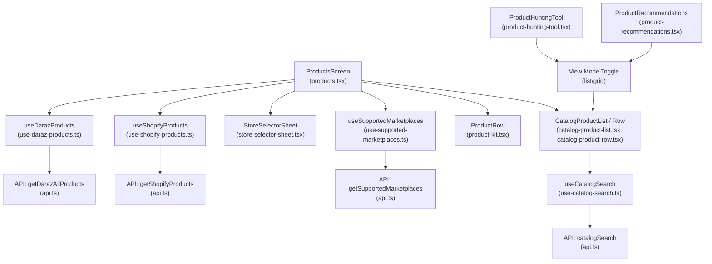
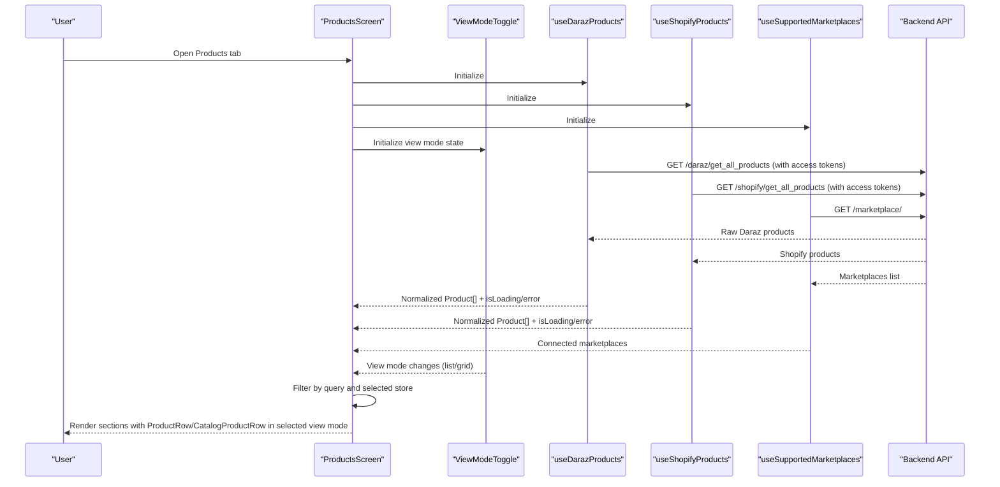
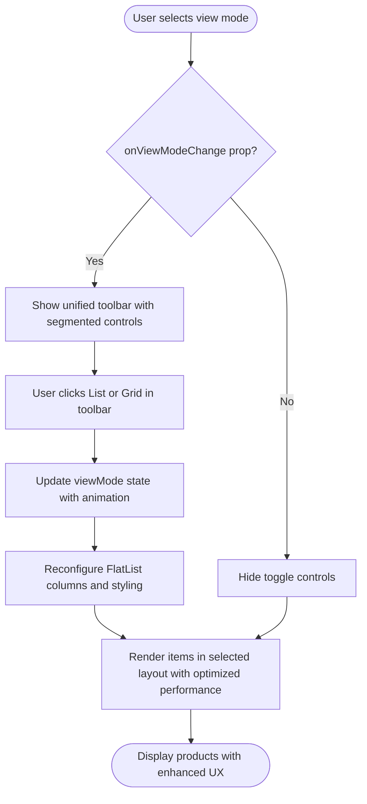
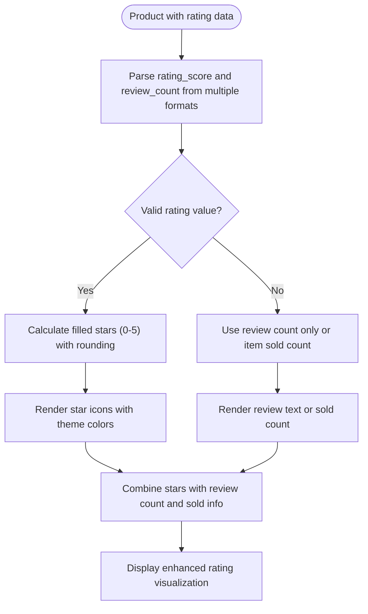
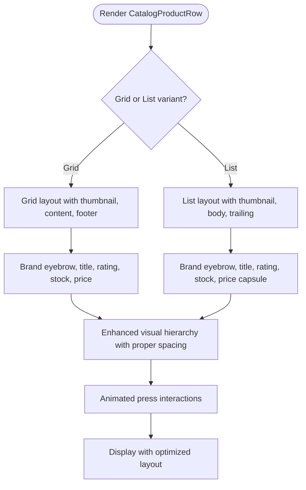
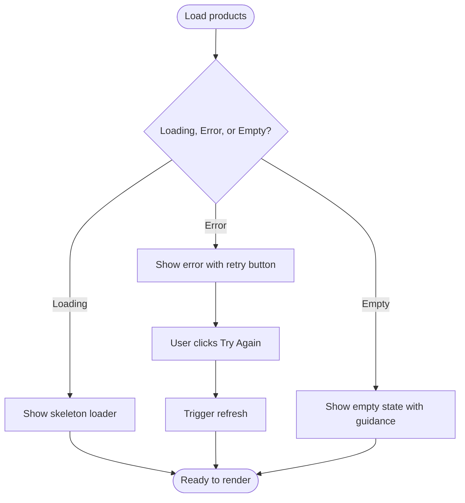
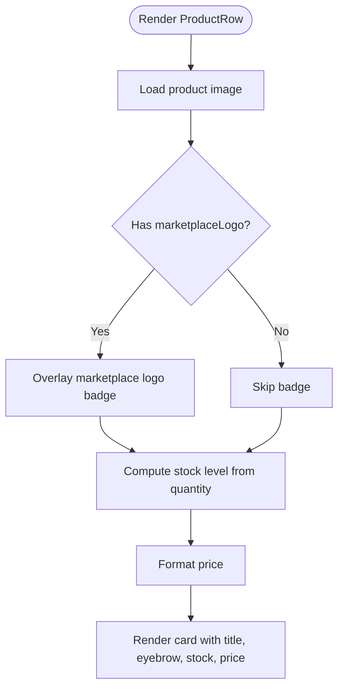
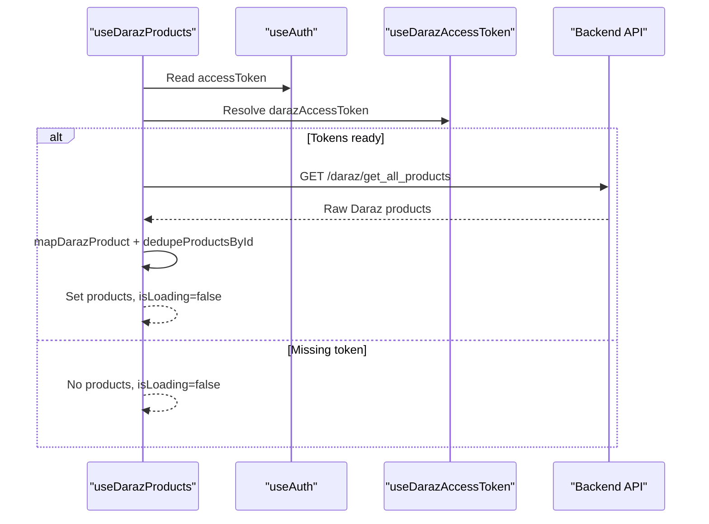
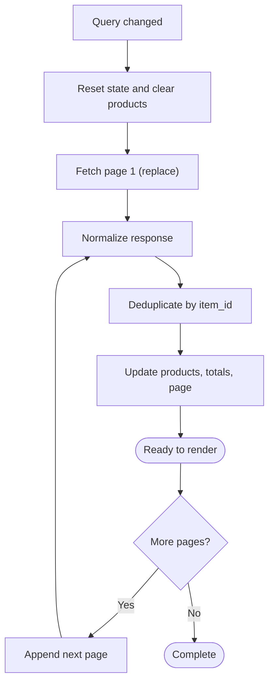
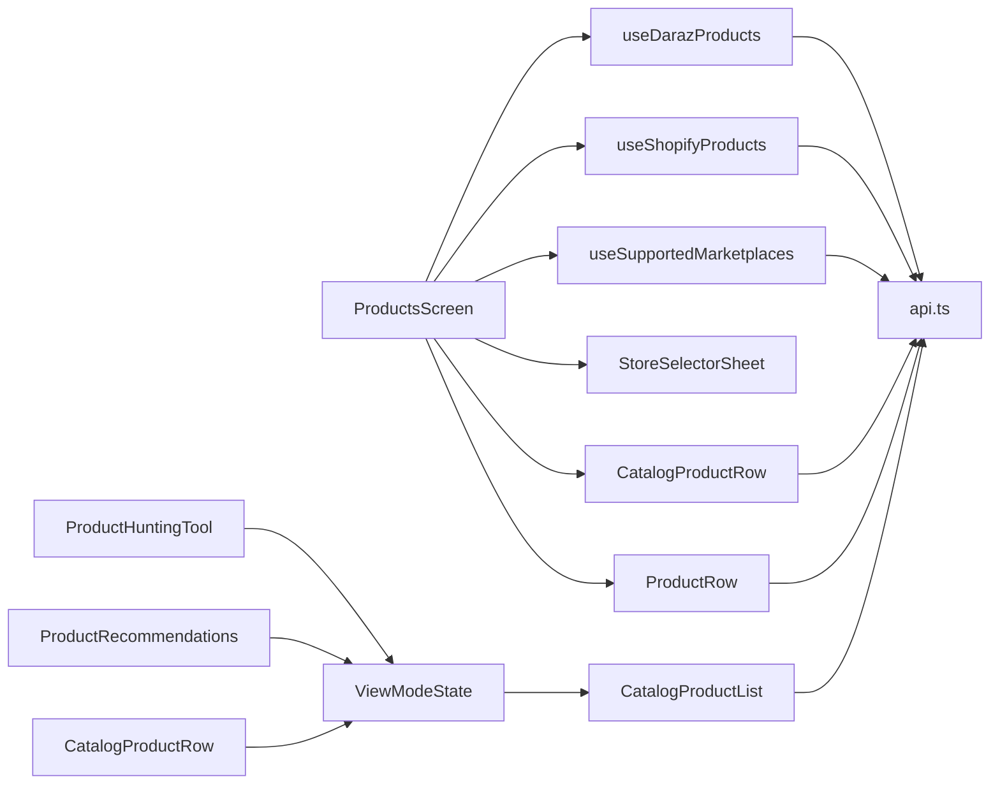

# Product Catalog & Browsing

<cite>
**Referenced Files in This Document**
- [products.tsx](file://src/app/(app)/(tabs)/products.tsx)
- [catalog-product-list.tsx](file://src/components/catalog-product-list.tsx)
- [catalog-product-row.tsx](file://src/components/catalog-product-row.tsx)
- [product-kit.tsx](file://src/components/product-kit.tsx)
- [store-selector-sheet.tsx](file://src/components/store-selector-sheet.tsx)
- [use-catalog-search.ts](file://src/hooks/use-catalog-search.ts)
- [use-daraz-products.ts](file://src/hooks/use-daraz-products.ts)
- [use-shopify-products.ts](file://src/hooks/use-shopify-products.ts)
- [use-supported-marketplaces.ts](file://src/hooks/use-supported-marketplaces.ts)
- [product-hunting-tool.tsx](file://src/app/(app)/product-hunting-tool.tsx)
- [product-recommendations.tsx](file://src/app/(app)/product-recommendations.tsx)
- [api.ts](file://src/lib/api.ts)
- [channels.ts](file://src/constants/channels.ts)
</cite>

## Update Summary
**Changes Made**
- Enhanced catalog product display components with improved grid and list view layouts featuring dynamic switching capabilities
- Implemented comprehensive rating visualization system with star displays and review counts across all product components
- Added unified toolbar integration with segmented view mode controls for seamless layout switching
- Improved empty and error states with better user experience and retry functionality
- Refactored product rows for enhanced visual hierarchy and spacing across different display modes
- Integrated view mode state management across product hunting tool and recommendations screens

## Table of Contents
1. Introduction
2. Project Structure
3. Core Components
4. Architecture Overview
5. Detailed Component Analysis
6. Dependency Analysis
7. Performance Considerations
8. Troubleshooting Guide
9. Conclusion

## Introduction
This document explains the product catalog browsing functionality that unifies products from multiple marketplaces (Daraz and Shopify) into a single interface. It covers how products are fetched, searched, filtered, and rendered; marketplace-specific rendering with logos and source attribution; store selection; error handling; loading states; and performance optimizations such as pagination, deduplication, and efficient re-rendering for large lists.

**Updated** The system now features enhanced catalog product display components with comprehensive grid and list view layouts, sophisticated rating visualization with star displays and review counts, unified toolbar integration for seamless view mode switching, improved empty and error states, and refactored product rows optimized for better visual hierarchy and spacing across different display modes.

## Project Structure
The catalog feature spans screens, hooks, components, and API utilities:
- Screen orchestration and UI composition: Products screen, Product Hunting Tool, Recommendations
- Marketplace data fetching hooks: Daraz and Shopify
- Store selector component for filtering by connected marketplace
- Unified list and row components for rendering catalog items with advanced view mode support
- Centralized API layer for requests, normalization, and error handling

**Diagram sources**
- [products.tsx:29-80](file://src/app/(app)/(tabs)/products.tsx#L29-L80)
- [use-daraz-products.ts:120-183](file://src/hooks/use-daraz-products.ts#L120-L183)
- [use-shopify-products.ts:27-49](file://src/hooks/use-shopify-products.ts#L27-L49)
- [store-selector-sheet.tsx:22-131](file://src/components/store-selector-sheet.tsx#L22-L131)
- [use-supported-marketplaces.ts:16-53](file://src/hooks/use-supported-marketplaces.ts#L16-L53)
- [product-kit.tsx:26-127](file://src/components/product-kit.tsx#L26-L127)
- [catalog-product-list.tsx:25-109](file://src/components/catalog-product-list.tsx#L25-L109)
- [catalog-product-row.tsx:10-101](file://src/components/catalog-product-row.tsx#L10-L101)
- [use-catalog-search.ts:38-148](file://src/hooks/use-catalog-search.ts#L38-L148)
- [product-hunting-tool.tsx:17-139](file://src/app/(app)/product-hunting-tool.tsx#L17-L139)
- [product-recommendations.tsx:12-73](file://src/app/(app)/product-recommendations.tsx#L12-L73)

**Section sources**
- [products.tsx:29-80](file://src/app/(app)/(tabs)/products.tsx#L29-L80)
- [api.ts:344-357](file://src/lib/api.ts#L344-L357)
- [api.ts:448-459](file://src/lib/api.ts#L448-L459)
- [api.ts:1076-1078](file://src/lib/api.ts#L1076-L1078)
- [api.ts:1556-1568](file://src/lib/api.ts#L1556-L1568)

## Core Components
- Products screen: Orchestrates fetching from Daraz and Shopify, applies local search and store filters, renders sections per marketplace, and provides refresh/retry flows.
- Store selector sheet: Modal bottom sheet to filter by connected marketplace, showing logos and allowing navigation to connect stores.
- Product rows: Two row components—unified catalog row with advanced view mode support and marketplace-aware row with provenance badge and stock status.
- Hooks:
  - useDarazProducts: Resolves connection token and fetches full Daraz catalog, mapping raw responses to a normalized Product shape.
  - useShopifyProducts: Resolves connection token and fetches Shopify products, mapping to normalized Product shape.
  - useSupportedMarketplaces: Fetches supported and connected marketplaces for display and filtering.
  - useCatalogSearch: Paginated search over the unified catalog endpoint with query, sort, and price filters.
- **Enhanced** View mode toggle: Comprehensive system supporting dynamic switching between list and grid layouts with state management across screens, unified toolbar integration, and improved visual feedback.

**Section sources**
- [products.tsx:29-80](file://src/app/(app)/(tabs)/products.tsx#L29-L80)
- [store-selector-sheet.tsx:22-131](file://src/components/store-selector-sheet.tsx#L22-L131)
- [product-kit.tsx:26-127](file://src/components/product-kit.tsx#L26-L127)
- [catalog-product-row.tsx:10-101](file://src/components/catalog-product-row.tsx#L10-L101)
- [use-daraz-products.ts:120-183](file://src/hooks/use-daraz-products.ts#L120-L183)
- [use-shopify-products.ts:27-49](file://src/hooks/use-shopify-products.ts#L27-L49)
- [use-supported-marketplaces.ts:16-53](file://src/hooks/use-supported-marketplaces.ts#L16-L53)
- [use-catalog-search.ts:38-148](file://src/hooks/use-catalog-search.ts#L38-L148)
- [catalog-product-list.tsx:20-25](file://src/components/catalog-product-list.tsx#L20-L25)

## Architecture Overview
The system composes marketplace-specific data into a unified view with flexible rendering modes:
- The Products screen calls marketplace hooks to fetch products and marketplaces.
- Each hook handles authentication tokens, network requests, normalization, deduplication, and error states.
- The UI renders separate sections per marketplace when connected, with a shared store selector to filter by marketplace.
- A unified catalog search hook supports paginated queries against a backend catalog endpoint.
- **Enhanced** View mode toggle system provides consistent list/grid switching across all product browsing screens with unified toolbar integration and improved user experience.

**Diagram sources**
- [products.tsx:29-80](file://src/app/(app)/(tabs)/products.tsx#L29-L80)
- [use-daraz-products.ts:120-183](file://src/hooks/use-daraz-products.ts#L120-L183)
- [use-shopify-products.ts:27-49](file://src/hooks/use-shopify-products.ts#L27-L49)
- [use-supported-marketplaces.ts:16-53](file://src/hooks/use-supported-marketplaces.ts#L16-L53)
- [catalog-product-list.tsx:20-25](file://src/components/catalog-product-list.tsx#L20-L25)
- [product-hunting-tool.tsx:22-139](file://src/app/(app)/product-hunting-tool.tsx#L22-L139)
- [product-recommendations.tsx:16-73](file://src/app/(app)/product-recommendations.tsx#L16-L73)

## Detailed Component Analysis

### Products Screen: Orchestration and Filtering
- Fetches Daraz and Shopify products via dedicated hooks and retrieves connected marketplaces.
- Applies real-time local filtering by title or category using a memoized function.
- Renders marketplace sections conditionally based on connection state and selected store.
- Provides pull-to-refresh and retry actions per marketplace.

Key behaviors:
- Real-time query filtering across both marketplaces.
- Store filtering via StoreSelectorSheet; only connected marketplaces are selectable.
- Provenance badges show marketplace logos next to product thumbnails.

**Section sources**
- [products.tsx:19-27](file://src/app/(app)/(tabs)/products.tsx#L19-L27)
- [products.tsx:29-80](file://src/app/(app)/(tabs)/products.tsx#L29-L80)
- [products.tsx:137-234](file://src/app/(app)/(tabs)/products.tsx#L137-L234)

### Store Selector Sheet: Marketplace Filtering
- Displays "All Stores" plus each connected marketplace with its logo.
- Supports retry on load errors and navigates to Connect Stores.
- Emits selection back to the parent to filter displayed products.

**Section sources**
- [store-selector-sheet.tsx:22-131](file://src/components/store-selector-sheet.tsx#L22-L131)
- [store-selector-sheet.tsx:133-159](file://src/components/store-selector-sheet.tsx#L133-L159)

### Enhanced View Mode Toggle System: Dynamic Layout Switching
- **Enhanced** Comprehensive view mode toggle supporting list and grid layouts with unified toolbar integration
- Implemented in CatalogProductList component with configurable props and segmented control UI
- State management handled at screen level (ProductHuntingTool, ProductRecommendations) with persistent state
- Visual feedback with active/inactive button states, theme integration, and smooth transitions
- Responsive layout switching with FlatList column configuration and optimized re-rendering

**Diagram sources**
- [catalog-product-list.tsx:20-25](file://src/components/catalog-product-list.tsx#L20-25)
- [catalog-product-list.tsx:71-113](file://src/components/catalog-product-list.tsx#L71-L113)
- [product-hunting-tool.tsx:22-139](file://src/app/(app)/product-hunting-tool.tsx#L22-L139)
- [product-recommendations.tsx:16-73](file://src/app/(app)/product-recommendations.tsx#L16-L73)

**Section sources**
- [catalog-product-list.tsx:20-25](file://src/components/catalog-product-list.tsx#L20-25)
- [catalog-product-list.tsx:71-113](file://src/components/catalog-product-list.tsx#L71-L113)
- [product-hunting-tool.tsx:22-139](file://src/app/(app)/product-hunting-tool.tsx#L22-L139)
- [product-recommendations.tsx:16-73](file://src/app/(app)/product-recommendations.tsx#L16-L73)

### Enhanced Rating Visualization: Star Display and Review Counts
- **Enhanced** Comprehensive rating visualization with star icons and review counts across all product components
- Supports multiple rating formats: numeric ratings, review counts, or combined display with intelligent parsing
- Dynamic star rendering based on parsed rating values with proper rounding and theme-aware color coding
- Graceful fallback handling for missing or invalid rating data with smart defaults
- Integration with both catalog products and marketplace-specific products

**Diagram sources**
- [catalog-product-row.tsx:29-57](file://src/components/catalog-product-row.tsx#L29-L57)
- [product-kit.tsx:57-86](file://src/components/product-kit.tsx#L57-L86)
- [api.ts:1450-1528](file://src/lib/api.ts#L1450-L1528)

**Section sources**
- [catalog-product-row.tsx:29-57](file://src/components/catalog-product-row.tsx#L29-L57)
- [product-kit.tsx:57-86](file://src/components/product-kit.tsx#L57-L86)

### Enhanced Product Rows: Improved Visual Hierarchy and Spacing
- **Enhanced** CatalogProductRow with sophisticated grid and list variants featuring improved visual hierarchy
- Grid variant includes thumbnail image, brand/seller eyebrow, enhanced rating display, stock status, and pricing with discount indicators
- List variant maintains compact design with thumbnail, content area, and trailing price information
- Animated press interactions with smooth scaling effects and theme-aware border colors
- Optimized spacing and typography for better readability across different screen sizes

**Diagram sources**
- [catalog-product-row.tsx:66-179](file://src/components/catalog-product-row.tsx#L66-L179)
- [catalog-product-row.tsx:181-309](file://src/components/catalog-product-row.tsx#L181-L309)

**Section sources**
- [catalog-product-row.tsx:10-179](file://src/components/catalog-product-row.tsx#L10-L179)

### Enhanced Empty and Error States: Better User Experience
- **Enhanced** Integrated empty and error states with improved user experience and clear action paths
- Error states include descriptive messages, retry buttons, and consistent visual styling
- Empty states provide helpful guidance with contextual messages and icons
- Pull-to-refresh functionality integrated directly into state views for better usability
- Theme-aware styling with appropriate colors and spacing for consistency

**Diagram sources**
- [catalog-product-list.tsx:52-157](file://src/components/catalog-product-list.tsx#L52-L157)

**Section sources**
- [catalog-product-list.tsx:52-157](file://src/components/catalog-product-list.tsx#L52-L157)

### Marketplace-Specific Rendering and Attribution
- ProductRow shows thumbnail, brand/category eyebrow, stock status, formatted price, and an overlay marketplace logo badge for provenance.
- Stock level is derived from inventory fields and presented with color-coded indicators.
- CatalogProductRow displays unified catalog items with enhanced rating visualization, reviews, discount, and stock status in both list and grid modes.

**Diagram sources**
- [product-kit.tsx:26-127](file://src/components/product-kit.tsx#L26-L127)
- [product-kit.tsx:11-23](file://src/components/product-kit.tsx#L11-L23)

**Section sources**
- [product-kit.tsx:26-127](file://src/components/product-kit.tsx#L26-L127)
- [catalog-product-row.tsx:10-101](file://src/components/catalog-product-row.tsx#L10-L101)

### Data Fetching: Daraz and Shopify
- useDarazProducts:
  - Waits for merchant access token and Daraz connection token.
  - Calls backend to retrieve all Daraz products, maps raw response to normalized Product, and deduplicates by id.
  - Exposes isLoading, error, isConnected, and refetch.
- useShopifyProducts:
  - Waits for merchant access token and Shopify connection token.
  - Calls backend to retrieve Shopify products, maps to normalized Product, and deduplicates.
  - Exposes isLoading, error, isConnected, and refetch.

**Diagram sources**
- [use-daraz-products.ts:120-183](file://src/hooks/use-daraz-products.ts#L120-L183)
- [api.ts:448-459](file://src/lib/api.ts#L448-L459)

**Section sources**
- [use-daraz-products.ts:30-96](file://src/hooks/use-daraz-products.ts#L30-L96)
- [use-daraz-products.ts:120-183](file://src/hooks/use-daraz-products.ts#L120-L183)
- [use-shopify-products.ts:7-25](file://src/hooks/use-shopify-products.ts#L7-L25)
- [use-shopify-products.ts:27-49](file://src/hooks/use-shopify-products.ts#L27-L49)
- [api.ts:448-459](file://src/lib/api.ts#L448-L459)
- [api.ts:1076-1078](file://src/lib/api.ts#L1076-L1078)

### Unified Catalog Search: Real-Time Query Processing and Pagination
- useCatalogSearch:
  - Debounces implicitly by resetting state when query changes.
  - Calls catalogSearch with page, max_pages, sort_by, and price range.
  - Deduplicates results by item_id and appends pages while tracking total pages.
  - Exposes isLoading, isLoadingMore, hasMore, error, refetch, and loadMore.
- API:
  - catalogSearch posts to a catalog search endpoint and normalizes responses, including available filters and subcategories.

**Diagram sources**
- [use-catalog-search.ts:38-148](file://src/hooks/use-catalog-search.ts#L38-L148)
- [api.ts:1556-1568](file://src/lib/api.ts#L1556-L1568)

**Section sources**
- [use-catalog-search.ts:38-148](file://src/hooks/use-catalog-search.ts#L38-L148)
- [api.ts:1368-1418](file://src/lib/api.ts#L1368-L1418)
- [api.ts:1526-1568](file://src/lib/api.ts#L1526-L1568)

### Enhanced List Rendering and Loading States
- CatalogProductList:
  - Shows skeleton while initial load, enhanced error block with retry if first load fails, improved empty state message, and FlatList with pull-to-refresh and infinite scroll.
  - **Enhanced** Unified toolbar with segmented view mode controls for seamless list/grid switching
  - Renders CatalogProductRow for each item and triggers navigation to detail
- ProductRow:
  - Renders marketplace-aware rows with provenance badge and stock status

**Section sources**
- [catalog-product-list.tsx:25-109](file://src/components/catalog-product-list.tsx#L25-L109)
- [product-kit.tsx:26-127](file://src/components/product-kit.tsx#L26-L127)

### Data Models and Normalization
- Product:
  - Unified model used by marketplace hooks and rows, including optional platform, brand, model, warrantyType, stockQuantity, and images array.
- CatalogProductItem:
  - Unified model for catalog search results, including name, image, price, discount, ratings, seller info, categories, and availability flags.
- **Enhanced** Rating and Review Parsing:
  - Improved normalization handles multiple field names: `rating_score`, `ratingScore`, `review_count`, `review`
  - Flexible type conversion supporting strings, numbers, and null values
  - Safe defaults for missing or invalid data
- Normalization:
  - mapDarazProduct and mapShopifyProduct convert marketplace-specific payloads into Product.
  - normalizeCatalogProduct adapts varied field names and ensures safe defaults.
  - dedupeProductsById and dedupeCatalogProducts prevent duplicates in lists.

**Section sources**
- [api.ts:468-505](file://src/lib/api.ts#L468-L505)
- [api.ts:1368-1418](file://src/lib/api.ts#L1368-L1418)
- [api.ts:1446-1524](file://src/lib/api.ts#L1446-L1524)
- [use-daraz-products.ts:30-96](file://src/hooks/use-daraz-products.ts#L30-L96)
- [use-shopify-products.ts:7-25](file://src/hooks/use-shopify-products.ts#L7-L25)

## Dependency Analysis
- Products screen depends on:
  - useDarazProducts and useShopifyProducts for data
  - useSupportedMarketplaces for store options
  - StoreSelectorSheet for UI filtering
  - ProductRow and CatalogProductRow for rendering
- **Enhanced** View mode dependencies:
  - Screens manage view mode state locally with persistent state management
  - CatalogProductList receives view mode props and callbacks with unified toolbar integration
  - Consistent implementation across ProductHuntingTool and ProductRecommendations
- Hooks depend on:
  - Authentication context for access tokens
  - API module for endpoints and normalization
- API module centralizes:
  - HTTP request handling and SSE streaming
  - Error extraction and ApiError propagation
  - Endpoint functions for marketplaces and catalog search

**Diagram sources**
- [products.tsx:29-80](file://src/app/(app)/(tabs)/products.tsx#L29-L80)
- [use-daraz-products.ts:120-183](file://src/hooks/use-daraz-products.ts#L120-L183)
- [use-shopify-products.ts:27-49](file://src/hooks/use-shopify-products.ts#L27-L49)
- [use-supported-marketplaces.ts:16-53](file://src/hooks/use-supported-marketplaces.ts#L16-L53)
- [product-hunting-tool.tsx:22-139](file://src/app/(app)/product-hunting-tool.tsx#L22-L139)
- [product-recommendations.tsx:16-73](file://src/app/(app)/product-recommendations.tsx#L16-L73)

**Section sources**
- [products.tsx:29-80](file://src/app/(app)/(tabs)/products.tsx#L29-L80)
- [api.ts:5-77](file://src/lib/api.ts#L5-L77)

## Performance Considerations
- Pagination:
  - useCatalogSearch uses page-based pagination with append mode and tracks total pages to enable infinite scrolling.
- Deduplication:
  - dedupeProductsById and dedupeCatalogProducts ensure no duplicate entries appear in lists.
- Efficient Re-rendering:
  - Memoized filtering in the Products screen avoids unnecessary recalculations.
  - FlatList in CatalogProductList optimizes large list rendering.
  - **Enhanced** View mode switching uses FlatList key prop to force re-render with optimal performance and smooth transitions.
- Image Handling:
  - expo-image is used for optimized image loading and caching.
- Request Guarding:
  - Hooks guard against concurrent requests using refs and cancellation patterns to avoid race conditions.
- Local Search:
  - Real-time filtering runs client-side for responsiveness; consider moving heavy filtering to the server for very large datasets.
- **Enhanced** View Mode Optimization:
  - Grid layout uses numColumns prop for native optimization with responsive column configuration
  - List separators only rendered in list mode to reduce overhead
  - Conditional rendering of view toggle controls based on prop presence
  - Smooth animations and transitions for better user experience
  - Optimized re-rendering with proper key management

[No sources needed since this section provides general guidance]

## Troubleshooting Guide
Common issues and resolutions:
- Network errors:
  - ApiError wraps HTTP failures with human-readable messages extracted from backend error bodies.
  - Retry buttons are provided in list and store selector components.
- Missing marketplace connections:
  - If no access tokens are present, hooks return empty lists and do not trigger requests.
  - Use the store selector's "Manage connected stores" link to navigate to connection flows.
- Empty states:
  - When no products exist, friendly messages guide users to connect stores or adjust filters.
- Streaming endpoints:
  - For long-running operations, SSE streams provide progress events; errors surface through streamToResult.
- **Enhanced** View Mode Issues:
  - If view mode toggle doesn't appear, ensure onViewModeChange prop is provided to CatalogProductList
  - Grid layout may require sufficient screen width for two-column display
  - State persistence across screen navigation requires additional implementation
  - Toolbar integration requires proper prop passing for segmented controls

**Section sources**
- [api.ts:5-77](file://src/lib/api.ts#L5-L77)
- [api.ts:206-286](file://src/lib/api.ts#L206-L286)
- [store-selector-sheet.tsx:71-99](file://src/components/store-selector-sheet.tsx#L71-L99)
- [catalog-product-list.tsx:40-72](file://src/components/catalog-product-list.tsx#L40-L72)

## Conclusion
The product catalog browsing feature integrates Daraz and Shopify products into a cohesive interface with robust search, filtering, and marketplace attribution. It leverages reusable hooks for data fetching and normalization, a centralized API layer for consistent error handling, and performant list rendering with pagination and deduplication. The store selector enables targeted filtering by connected marketplace, while clear loading and error states improve user experience.

**Enhanced** Recent improvements include comprehensive catalog product display components with sophisticated grid and list view layouts featuring dynamic switching capabilities, enhanced rating visualization with star displays and review counts across all product components, unified toolbar integration for seamless view mode switching, improved empty and error states with better user experience, and refactored product rows optimized for better visual hierarchy and spacing across different display modes. These enhancements provide a more flexible, intuitive, and visually appealing browsing experience across all product discovery screens including the main products tab, product hunting tool, and recommendations views. Future enhancements can include server-side filtering for large catalogs, expanded marketplace support, persistent view mode preferences, and additional customization options for the display layouts.