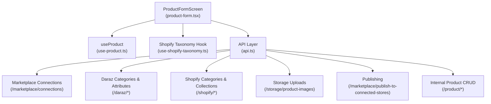
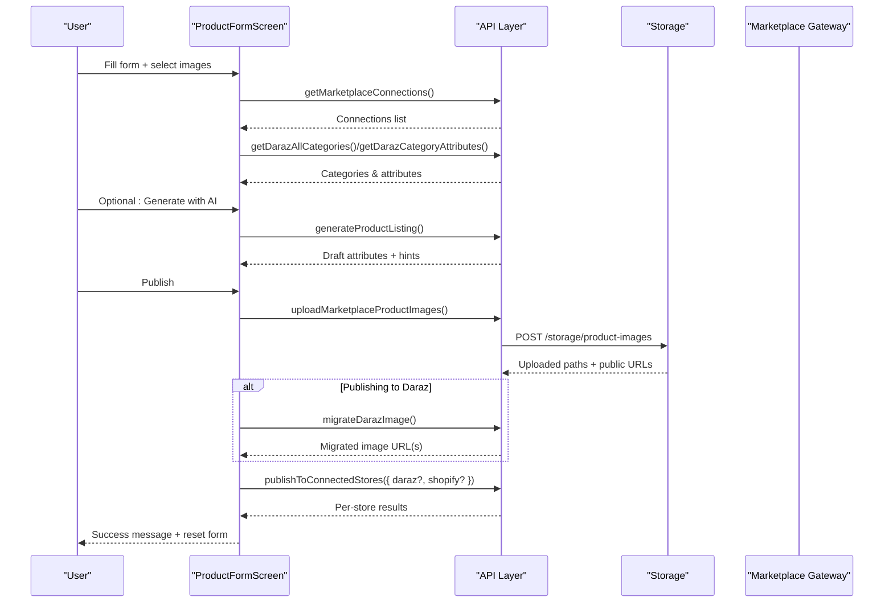
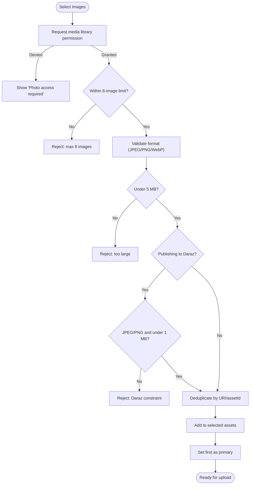
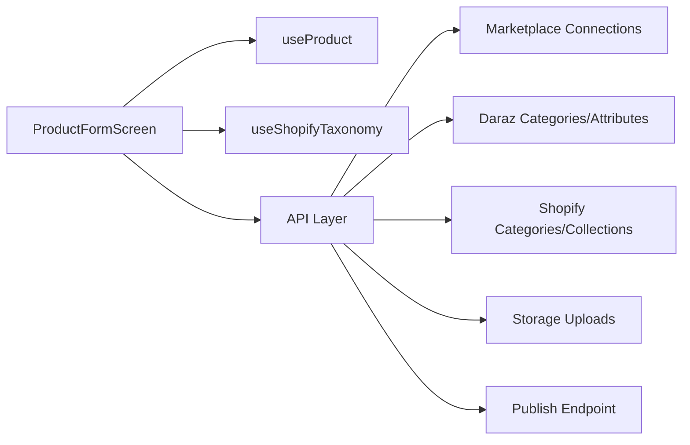

# Product Creation & Editing

<cite>
**Referenced Files in This Document**
- [product-form.tsx](file://src/app/(app)/product-form.tsx)
- [api.ts](file://src/lib/api.ts)
- [use-product.ts](file://src/hooks/use-product.ts)
- [use-shopify-taxonomy.ts](file://src/hooks/use-shopify-taxonomy.ts)
- [api.ts (constants)](file://src/constants/api.ts)
</cite>

## Table of Contents
1. [Introduction](#introduction)
2. [Project Structure](#project-structure)
3. [Core Components](#core-components)
4. [Architecture Overview](#architecture-overview)
5. [Detailed Component Analysis](#detailed-component-analysis)
6. [Dependency Analysis](#dependency-analysis)
7. [Performance Considerations](#performance-considerations)
8. [Troubleshooting Guide](#troubleshooting-guide)
9. [Conclusion](#conclusion)
10. [Appendices](#appendices)

## Introduction
This document explains the product creation and editing form system used to create, edit, and publish products to connected marketplaces (Daraz and Shopify). It covers input validation, image upload handling, data submission workflows, marketplace-specific fields, AI-assisted listing generation, error handling, success feedback, draft-like behaviors, and multi-step publishing flows.

## Project Structure
The product form is implemented as a single screen component that orchestrates:
- Form state and UI for core fields (title, price, description, images, categories)
- Marketplace selection and category selection (Daraz tree navigation and Shopify taxonomy)
- Image selection, validation, and preparation for upload
- AI-assisted attribute generation for Daraz listings
- Validation and submission to internal product storage or direct marketplace publishing
- Error and progress messaging

**Diagram sources**
- [product-form.tsx:65-120](file://src/app/(app)/product-form.tsx#L65-L120)
- [api.ts:368-436](file://src/lib/api.ts#L368-L436)
- [api.ts:722-784](file://src/lib/api.ts#L722-L784)
- [api.ts:821-874](file://src/lib/api.ts#L821-L874)
- [api.ts:1101-1146](file://src/lib/api.ts#L1101-L1146)

**Section sources**
- [product-form.tsx:65-120](file://src/app/(app)/product-form.tsx#L65-L120)
- [api.ts:368-436](file://src/lib/api.ts#L368-L436)
- [api.ts:722-784](file://src/lib/api.ts#L722-L784)
- [api.ts:821-874](file://src/lib/api.ts#L821-L874)
- [api.ts:1101-1146](file://src/lib/api.ts#L1101-L1146)

## Core Components
- ProductFormScreen: Central UI and workflow controller for creating/editing products and publishing to marketplaces.
- useProduct hook: Fetches an existing product by ID for edit mode.
- useShopifyTaxonomy hook: Loads Shopify categories and collections when publishing to Shopify.
- API layer: Encapsulates HTTP requests, SSE streaming, error extraction, and typed payloads for marketplace integrations.

Key responsibilities:
- Manage local form state and validation errors
- Load and manage marketplace connections and categories
- Handle image selection, validation, and upload preparation
- Generate marketplace-specific attributes (Daraz) with optional AI assistance
- Validate and submit either to internal product storage or directly to connected stores

**Section sources**
- [product-form.tsx:65-120](file://src/app/(app)/product-form.tsx#L65-L120)
- [use-product.ts:1-52](file://src/hooks/use-product.ts#L1-L52)
- [use-shopify-taxonomy.ts:1-39](file://src/hooks/use-shopify-taxonomy.ts#L1-L39)
- [api.ts:5-77](file://src/lib/api.ts#L5-L77)

## Architecture Overview
The form supports two primary flows:
1) Save to internal product storage (edit/create):
   - Validates required fields
   - Calls create/update endpoints
   - Navigates back on success

2) Publish to one or more connected marketplaces:
   - Validates platform-specific requirements (categories, attributes, inventory)
   - Uploads images to storage, migrates for Daraz if needed
   - Builds marketplace-specific payloads
   - Publishes via a bulk endpoint and reports per-store results

**Diagram sources**
- [product-form.tsx:122-227](file://src/app/(app)/product-form.tsx#L122-L227)
- [product-form.tsx:409-472](file://src/app/(app)/product-form.tsx#L409-L472)
- [product-form.tsx:519-629](file://src/app/(app)/product-form.tsx#L519-L629)
- [api.ts:722-784](file://src/lib/api.ts#L722-L784)
- [api.ts:821-874](file://src/lib/api.ts#L821-L874)
- [api.ts:915-952](file://src/lib/api.ts#L915-L952)
- [api.ts:1101-1107](file://src/lib/api.ts#L1101-L1107)

## Detailed Component Analysis

### Product Data Model and Field Mapping
- Internal Product model includes title, price, description, image, category, plus optional metadata like brand/model/warrantyType and stockQuantity for Daraz-sourced items.
- The form maps UI inputs to:
  - Title, Price, Description, Category, Image URL (edit mode)
  - Platform-specific fields:
    - Shopify: quantity, vendor, tags, collections, category
    - Daraz: dynamic attributes based on selected category; mandatory flags drive validation

Field mapping highlights:
- Title and description are reused across platforms where applicable
- Shopify uses HTML description and structured media inputs
- Daraz requires PrimaryCategory, Images (migrated), Attributes, and Skus with sale properties

**Section sources**
- [api.ts:468-494](file://src/lib/api.ts#L468-L494)
- [api.ts:554-560](file://src/lib/api.ts#L554-L560)
- [api.ts:1033-1043](file://src/lib/api.ts#L1033-L1043)
- [product-form.tsx:841-867](file://src/app/(app)/product-form.tsx#L841-L867)

### Input Validation Rules
- Title: minimum length enforced
- Price: must be a valid positive number
- Description: required
- Image: at least one image required for both save and publish flows
- Category:
  - Daraz: leaf category required when publishing to Daraz
  - Shopify: category required when publishing to Shopify
- Inventory: non-negative integer for Shopify
- Mandatory Daraz attributes: validated before publish

Validation is centralized and returns field-level errors displayed inline.

**Section sources**
- [product-form.tsx:826-839](file://src/app/(app)/product-form.tsx#L826-L839)
- [product-form.tsx:500-512](file://src/app/(app)/product-form.tsx#L500-L512)
- [product-form.tsx:716-726](file://src/app/(app)/product-form.tsx#L716-L726)

### Image Upload Handling and Optimization
- Supported formats: JPEG, PNG, WebP
- General size limit: up to 5 MB per image
- Daraz-specific constraints: only JPEG/PNG and up to 1 MB per image
- Maximum images: 8
- Duplicate detection prevents re-selecting the same asset
- On selection, images are validated and stored locally; first image becomes primary
- During publish:
  - Images uploaded to storage via multipart request
  - For Daraz, images are migrated to a marketplace-compatible URL
  - Temporary uploads are cleaned up after successful publish

**Diagram sources**
- [product-form.tsx:273-323](file://src/app/(app)/product-form.tsx#L273-L323)
- [api.ts:821-874](file://src/lib/api.ts#L821-L874)

**Section sources**
- [product-form.tsx:273-323](file://src/app/(app)/product-form.tsx#L273-L323)
- [api.ts:821-874](file://src/lib/api.ts#L821-L874)

### Data Submission Workflows

#### Save to Internal Product Storage
- Validates core fields
- In edit mode, calls update with id and url from the loaded product
- In create mode, calls create with empty url placeholder
- On success, navigates back

**Section sources**
- [product-form.tsx:841-867](file://src/app/(app)/product-form.tsx#L841-L867)
- [api.ts:1121-1146](file://src/lib/api.ts#L1121-L1146)

#### Publish to One Marketplace
- Validates platform-specific requirements
- Uploads images and migrates for Daraz
- Builds payload:
  - Daraz: PrimaryCategory, Title, Images (migrated), Attributes, Skus with sale properties
  - Shopify: title, descriptionHtml, vendor, tags, collections, category, inventory, price, images
- Calls bulk publish endpoint and handles per-store results

**Section sources**
- [product-form.tsx:681-824](file://src/app/(app)/product-form.tsx#L681-L824)
- [api.ts:1101-1107](file://src/lib/api.ts#L1101-L1107)

#### Publish to All Connected Stores
- Requires active connections for both Daraz and Shopify
- Enforces mandatory Daraz attributes and Shopify inventory rules
- Reuses upload/migrate logic and builds combined payload
- Reports partial failures per store and cleans up temporary images

**Section sources**
- [product-form.tsx:473-629](file://src/app/(app)/product-form.tsx#L473-L629)
- [api.ts:915-952](file://src/lib/api.ts#L915-L952)

### Marketplace-Specific Fields and Validation
- Daraz:
  - Dynamic attributes fetched from category; mandatory fields marked with asterisk
  - Automatic mapping for name/title/description fields
  - Date/time attributes supported via date picker with stage-based selection
  - Sale properties separated into SKU attributes
- Shopify:
  - Category selection from taxonomy
  - Collections multi-select
  - Vendor and comma-separated tags
  - Inventory quantity validated as non-negative integer

**Section sources**
- [product-form.tsx:190-227](file://src/app/(app)/product-form.tsx#L190-L227)
- [product-form.tsx:344-367](file://src/app/(app)/product-form.tsx#L344-L367)
- [product-form.tsx:1102-1155](file://src/app/(app)/product-form.tsx#L1102-L1155)
- [use-shopify-taxonomy.ts:17-30](file://src/hooks/use-shopify-taxonomy.ts#L17-L30)

### AI-Assisted Listing Generation
- Available when publishing to Daraz with images and a selected category
- Requires category attributes to load successfully
- Uploads images once, then calls generation endpoint with category ID, image URLs, attributes, and optional hints
- Populates missing fields and marks AI-generated values
- Provides user guidance when additional input is required

**Section sources**
- [product-form.tsx:368-472](file://src/app/(app)/product-form.tsx#L368-L472)
- [api.ts:629-638](file://src/lib/api.ts#L629-L638)

### Multi-Step Forms, Draft Saving, and Reset Behaviors
- Multi-step behavior:
  - Category selection modal for Daraz (tree navigation) and Shopify (taxonomy list)
  - Attribute entry flow driven by category attributes
  - Optional AI generation step before final publish
- Draft saving:
  - No explicit draft persistence; unsaved changes remain in local state until publish/save
  - Prepared images are cached with a signature to avoid re-uploading during the session
- Reset behavior:
  - After successful publish, form resets all fields and clears prepared images
  - Errors are cleared on new attempts

**Section sources**
- [product-form.tsx:234-254](file://src/app/(app)/product-form.tsx#L234-L254)
- [product-form.tsx:998-1031](file://src/app/(app)/product-form.tsx#L998-L1031)
- [product-form.tsx:1174-1187](file://src/app/(app)/product-form.tsx#L1174-L1187)

### Error Handling and Success Feedback
- Field-level errors displayed inline next to inputs
- Global form errors shown above action buttons
- Progress states during publish: loading connections, validating, uploading images, migrating images, creating product, completed, failed
- Success messages indicate number of stores published and any failures
- Cleanup of temporary images on failure or discard

**Section sources**
- [product-form.tsx:88-106](file://src/app/(app)/product-form.tsx#L88-L106)
- [product-form.tsx:519-629](file://src/app/(app)/product-form.tsx#L519-L629)
- [product-form.tsx:632-680](file://src/app/(app)/product-form.tsx#L632-L680)
- [product-form.tsx:728-824](file://src/app/(app)/product-form.tsx#L728-L824)

## Dependency Analysis
- ProductFormScreen depends on:
  - Authentication context for access tokens
  - useProduct for edit mode prefill
  - useShopifyTaxonomy for Shopify categories/collections
  - API layer for marketplace connections, categories, attributes, uploads, and publishing
- API layer centralizes:
  - Request/response handling and error extraction
  - SSE streaming support for long-running operations
  - Type definitions and normalization for marketplace responses

**Diagram sources**
- [product-form.tsx:65-120](file://src/app/(app)/product-form.tsx#L65-L120)
- [api.ts:368-436](file://src/lib/api.ts#L368-L436)
- [api.ts:722-784](file://src/lib/api.ts#L722-L784)
- [api.ts:821-874](file://src/lib/api.ts#L821-L874)
- [api.ts:1101-1107](file://src/lib/api.ts#L1101-L1107)

**Section sources**
- [product-form.tsx:65-120](file://src/app/(app)/product-form.tsx#L65-L120)
- [api.ts:368-436](file://src/lib/api.ts#L368-L436)
- [api.ts:722-784](file://src/lib/api.ts#L722-L784)
- [api.ts:821-874](file://src/lib/api.ts#L821-L874)
- [api.ts:1101-1107](file://src/lib/api.ts#L1101-L1107)

## Performance Considerations
- Image selection limits and format checks prevent excessive uploads
- Prepared images are cached within the session to avoid redundant uploads
- Daraz image migration runs per image; batching is not implemented but progress updates inform users
- SSE streaming infrastructure exists for long-running tasks; current publish flow uses standard requests with progress detail strings
- Avoid unnecessary refetches by gating category/attribute loads on connection and platform selection

[No sources needed since this section provides general guidance]

## Troubleshooting Guide
Common issues and resolutions:
- Photo access denied: Grant permissions to select images
- Unsupported image format: Use JPEG, PNG, or WebP
- Image too large: Keep under 5 MB; for Daraz, under 1 MB and JPEG/PNG only
- Missing category: Select a leaf category for Daraz or a Shopify category before publishing
- Missing mandatory attributes: Complete all required Daraz attributes indicated with asterisks
- Connection inactive: Ensure encrypted access tokens exist for selected marketplace
- Publish failures: Review per-store error messages; retry after correcting invalid fields

Error display locations:
- Inline field errors near inputs
- Global form error banner above actions
- Progress detail text during upload/migration steps

**Section sources**
- [product-form.tsx:273-323](file://src/app/(app)/product-form.tsx#L273-L323)
- [product-form.tsx:500-512](file://src/app/(app)/product-form.tsx#L500-L512)
- [product-form.tsx:716-726](file://src/app/(app)/product-form.tsx#L716-L726)
- [product-form.tsx:88-106](file://src/app/(app)/product-form.tsx#L88-L106)

## Conclusion
The product creation and editing system provides a robust, marketplace-aware workflow for building listings. It enforces strict validation, supports AI-assisted attribute generation, and handles complex image pipelines including format checks, size limits, and marketplace-specific migrations. Users can save products internally or publish directly to connected stores, with clear feedback and error handling throughout the process.

[No sources needed since this section summarizes without analyzing specific files]

## Appendices

### API Endpoints Used by the Form
- Marketplace connections: GET /marketplace/connections
- Daraz categories: GET /daraz/get_all_categories
- Daraz attributes: GET /daraz/get_category_attributes
- Shopify categories/collections: GET /shopify/get_all_categories, /shopify/get_all_collections
- Image upload: POST /storage/product-images
- Image cleanup: POST /storage/product-images/cleanup
- Daraz image migration: POST /daraz/migrate_image
- AI listing generation: POST /product-listing/generate
- Bulk publish: POST /marketplace/publish-to-connected-stores
- Internal product CRUD: POST /product/create_product, PUT /product/update_product, GET /product/get_product/{id}

**Section sources**
- [api.ts:368-436](file://src/lib/api.ts#L368-L436)
- [api.ts:722-784](file://src/lib/api.ts#L722-L784)
- [api.ts:821-874](file://src/lib/api.ts#L821-L874)
- [api.ts:902-952](file://src/lib/api.ts#L902-L952)
- [api.ts:629-638](file://src/lib/api.ts#L629-L638)
- [api.ts:1101-1146](file://src/lib/api.ts#L1101-L1146)

### Environment Configuration
- Backend base URL configured via environment variable or defaults for web/simulator/emulator environments

**Section sources**
- [api.ts (constants):1-16](file://src/constants/api.ts#L1-L16)