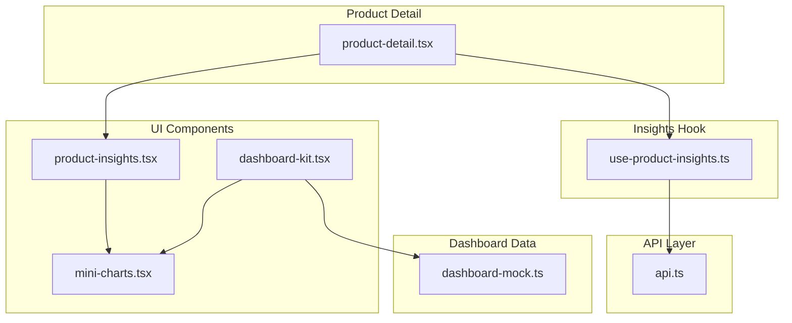
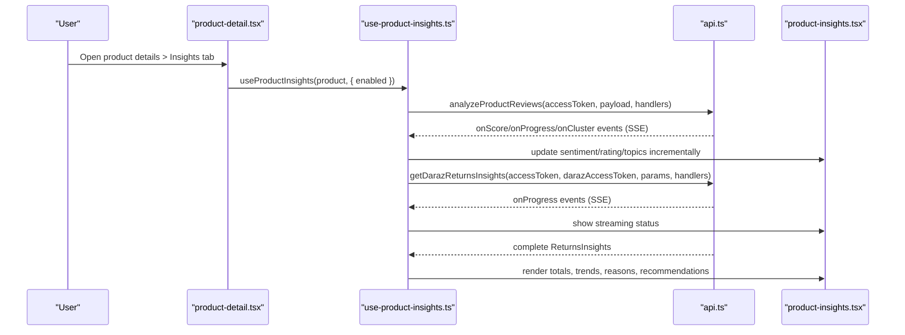
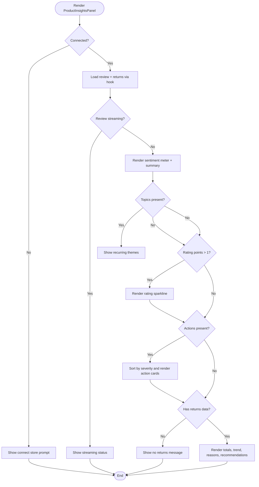
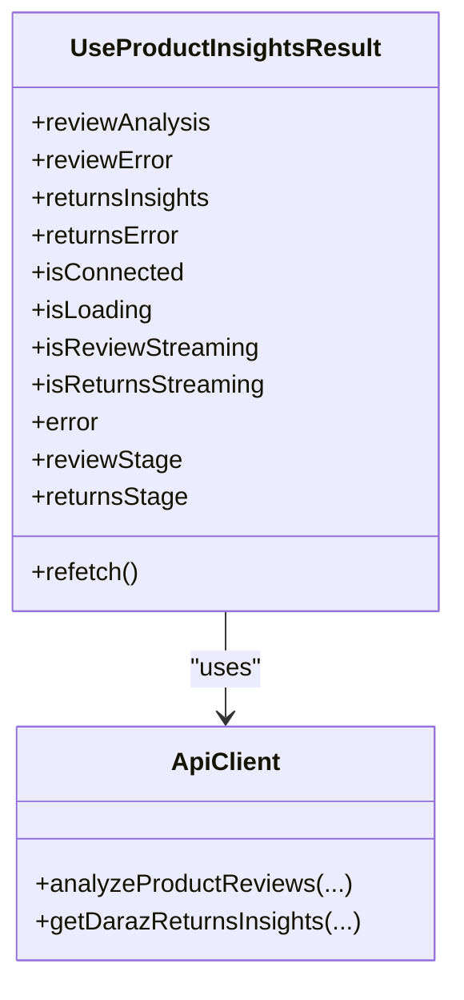
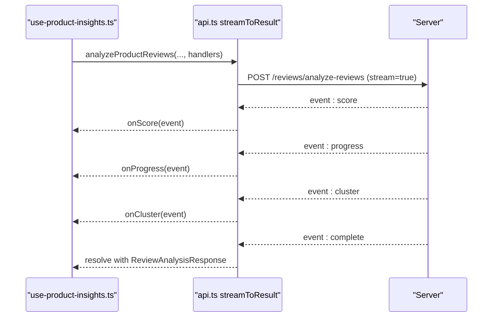
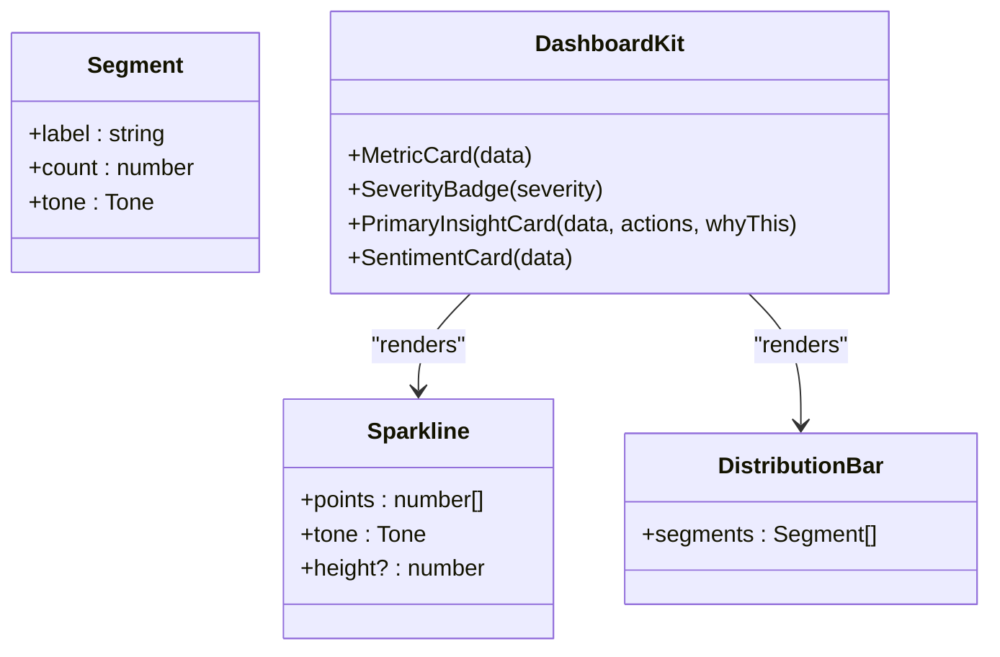
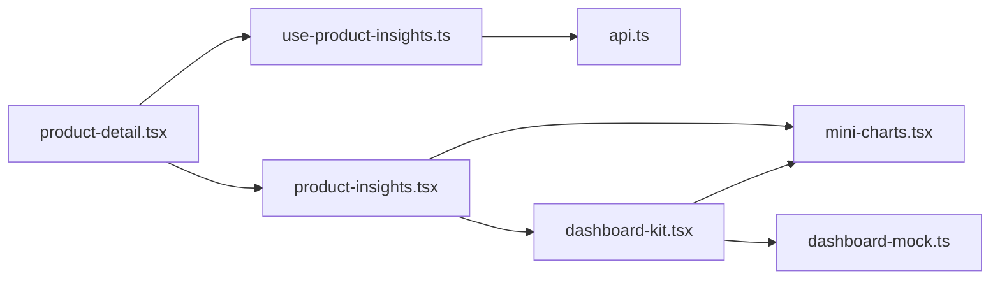

# Product Insights & Analytics

<cite>
**Referenced Files in This Document**
- [product-insights.tsx](file://src/components/product-insights.tsx)
- [use-product-insights.ts](file://src/hooks/use-product-insights.ts)
- [api.ts](file://src/lib/api.ts)
- [mini-charts.tsx](file://src/components/mini-charts.tsx)
- [dashboard-kit.tsx](file://src/components/dashboard-kit.tsx)
- [dashboard-mock.ts](file://src/constants/dashboard-mock.ts)
- [product-detail.tsx](file://src/app/(app)/product-detail.tsx)
- [insights.tsx](file://src/app/(app)/(tabs)/insights.tsx)
</cite>

## Table of Contents
1. [Introduction](#introduction)
2. [Project Structure](#project-structure)
3. [Core Components](#core-components)
4. [Architecture Overview](#architecture-overview)
5. [Detailed Component Analysis](#detailed-component-analysis)
6. [Dependency Analysis](#dependency-analysis)
7. [Performance Considerations](#performance-considerations)
8. [Troubleshooting Guide](#troubleshooting-guide)
9. [Conclusion](#conclusion)
10. [Appendices](#appendices)

## Introduction
This document explains the AI-powered product insights and analytics system implemented in the application. It covers how product performance metrics are calculated and displayed, including sales trends, inventory levels, and customer engagement data. It documents the insight generation algorithms (review sentiment analysis and returns intelligence), the recommendation engine that produces actionable business insights, and the visualization components used to present charts, graphs, and key performance indicators. It also provides examples of insight types such as pricing recommendations, stock level alerts, and market trend analysis, and addresses real-time data updates via streaming, historical comparisons, and export considerations for reporting.

## Project Structure
The analytics feature spans UI components, hooks, API clients, and mock dashboard assets:
- Product-level insights panel renders review sentiment, rating trends, recommended actions, and return analytics with sparklines and distribution bars.
- A hook orchestrates two independent SSE streams: review analysis and returns insights, handling progress events and final results.
- The API layer implements a robust SSE client supporting both web and React Native environments, plus typed request/response models for reviews and returns.
- Dashboard kit and mini-charts provide reusable visualizations and design tokens for KPIs, severity badges, and agent-driven insights.
- Mock dashboard data defines example insight cards, inventory risks, and feature graphs for the executive dashboard.

**Diagram sources**
- [product-detail.tsx:25-65](file://src/app/(app)/product-detail.tsx#L25-L65)
- [use-product-insights.ts:92-165](file://src/hooks/use-product-insights.ts#L92-L165)
- [api.ts:116-286](file://src/lib/api.ts#L116-L286)
- [product-insights.tsx:99-181](file://src/components/product-insights.tsx#L99-L181)
- [mini-charts.tsx:30-84](file://src/components/mini-charts.tsx#L30-L84)
- [dashboard-kit.tsx:38-71](file://src/components/dashboard-kit.tsx#L38-L71)
- [dashboard-mock.ts:113-149](file://src/constants/dashboard-mock.ts#L113-L149)

**Section sources**
- [product-detail.tsx:25-65](file://src/app/(app)/product-detail.tsx#L25-L65)
- [use-product-insights.ts:92-165](file://src/hooks/use-product-insights.ts#L92-L165)
- [api.ts:116-286](file://src/lib/api.ts#L116-L286)
- [product-insights.tsx:99-181](file://src/components/product-insights.tsx#L99-L181)
- [mini-charts.tsx:30-84](file://src/components/mini-charts.tsx#L30-L84)
- [dashboard-kit.tsx:38-71](file://src/components/dashboard-kit.tsx#L38-L71)
- [dashboard-mock.ts:113-149](file://src/constants/dashboard-mock.ts#L113-L149)

## Core Components
- ProductInsightsPanel: Displays sentiment score, recurring themes, rating trend sparkline, recommended actions, and returns analytics (units sold/returned, return rate, refund amount, dispute rate, monthly returns trend, top reasons, and recommendations).
- useProductInsights hook: Orchestrates SSE-based review analysis and returns insights, surfaces loading/streaming states, errors, and refetch capability.
- API SSE client: Parses text/event-stream frames, supports incremental events (score, progress, cluster) and final complete/error events across platforms.
- Visualization primitives: Sparkline and DistributionBar render compact trend and composition visuals; dashboard-kit provides KPI cards, severity badges, and insight cards.
- Dashboard mock data: Defines example insights, inventory risks, and feature graphs for the home dashboard.

Key responsibilities:
- Real-time streaming updates for long-running analyses.
- Independent error handling per data source so partial failures do not hide available data.
- Reusable, theme-aware visualizations without external chart libraries.

**Section sources**
- [product-insights.tsx:99-403](file://src/components/product-insights.tsx#L99-L403)
- [use-product-insights.ts:48-117](file://src/hooks/use-product-insights.ts#L48-L117)
- [api.ts:79-286](file://src/lib/api.ts#L79-L286)
- [mini-charts.tsx:30-84](file://src/components/mini-charts.tsx#L30-L84)
- [dashboard-kit.tsx:38-71](file://src/components/dashboard-kit.tsx#L38-L71)
- [dashboard-mock.ts:113-149](file://src/constants/dashboard-mock.ts#L113-L149)

## Architecture Overview
The system uses a layered architecture:
- Presentation layer: Product detail screen hosts tabs; Insights tab renders ProductInsightsPanel.
- State orchestration: useProductInsights manages fetch lifecycle, SSE event handling, and local state.
- Data layer: api.ts provides typed functions for review analysis and returns insights using SSE streaming.
- Visualization layer: mini-charts and dashboard-kit render metrics and trends consistently.

**Diagram sources**
- [product-detail.tsx:54-65](file://src/app/(app)/product-detail.tsx#L54-L65)
- [use-product-insights.ts:165-255](file://src/hooks/use-product-insights.ts#L165-L255)
- [api.ts:1342-1364](file://src/lib/api.ts#L1342-L1364)
- [api.ts:1257-1281](file://src/lib/api.ts#L1257-L1281)
- [product-insights.tsx:163-181](file://src/components/product-insights.tsx#L163-L181)

## Detailed Component Analysis

### ProductInsightsPanel
- Renders a sentiment meter with three zones (needs attention, mixed signal, strong) based on thresholds.
- Shows recurring themes as tags and a rating trend sparkline over months.
- Presents recommended actions sorted by severity with affected review counts.
- Displays returns analytics: units sold/returned, return rate, refunded amount, dispute rate, monthly returns trend, top return reasons with likely causes, and recommendations.
- Handles streaming status while SSE is active and shows retry options on errors.

**Diagram sources**
- [product-insights.tsx:99-181](file://src/components/product-insights.tsx#L99-L181)
- [product-insights.tsx:196-403](file://src/components/product-insights.tsx#L196-L403)

**Section sources**
- [product-insights.tsx:99-403](file://src/components/product-insights.tsx#L99-L403)

### useProductInsights Hook
- Manages connection state and token resolution for Daraz.
- Triggers two independent SSE streams:
  - Review analysis: emits score, progress, and cluster events; accumulates topics and debug info; updates sentiment and rating trend incrementally.
  - Returns insights: emits progress events for fetching returns/orders; resolves to full ReturnsInsights object.
- Uses Promise.allSettled to handle independent success/failure per stream.
- Provides refetch capability and guards against duplicate fetches per productId and reloadKey.

**Diagram sources**
- [use-product-insights.ts:48-71](file://src/hooks/use-product-insights.ts#L48-L71)
- [api.ts:1342-1364](file://src/lib/api.ts#L1342-L1364)
- [api.ts:1257-1281](file://src/lib/api.ts#L1257-L1281)

**Section sources**
- [use-product-insights.ts:92-277](file://src/hooks/use-product-insights.ts#L92-L277)

### API Layer and Streaming Client
- Implements a unified SSE client that:
  - Reads text/event-stream frames from fetch or XHR depending on platform.
  - Dispatches named events (e.g., score, progress, cluster, complete, error).
  - Wraps streaming calls into promises that resolve on complete or reject on error.
- Exposes typed endpoints:
  - analyzeProductReviews: POST /reviews/analyze-reviews with streaming handlers.
  - getDarazReturnsInsights: GET /daraz/returns_insights?stream=true with progress events.
- Error extraction normalizes backend error bodies into user-friendly messages.

**Diagram sources**
- [api.ts:116-286](file://src/lib/api.ts#L116-L286)
- [api.ts:1342-1364](file://src/lib/api.ts#L1342-L1364)

**Section sources**
- [api.ts:79-286](file://src/lib/api.ts#L79-L286)
- [api.ts:1257-1281](file://src/lib/api.ts#L1257-L1281)
- [api.ts:1342-1364](file://src/lib/api.ts#L1342-L1364)

### Visualization Components
- Sparkline: Minimal bar-style trend visualization using theme colors and opacity gradients for recency emphasis.
- DistributionBar: Horizontal stacked bar representing count distributions (e.g., inventory health segments).
- Dashboard kit: Metric cards, severity badges, primary insight cards, and sentiment summaries for the home dashboard.

**Diagram sources**
- [mini-charts.tsx:30-84](file://src/components/mini-charts.tsx#L30-L84)
- [dashboard-kit.tsx:105-137](file://src/components/dashboard-kit.tsx#L105-L137)
- [dashboard-kit.tsx:183-244](file://src/components/dashboard-kit.tsx#L183-L244)
- [dashboard-kit.tsx:311-331](file://src/components/dashboard-kit.tsx#L311-L331)

**Section sources**
- [mini-charts.tsx:30-84](file://src/components/mini-charts.tsx#L30-L84)
- [dashboard-kit.tsx:38-71](file://src/components/dashboard-kit.tsx#L38-L71)
- [dashboard-kit.tsx:105-137](file://src/components/dashboard-kit.tsx#L105-L137)
- [dashboard-kit.tsx:183-244](file://src/components/dashboard-kit.tsx#L183-L244)
- [dashboard-kit.tsx:311-331](file://src/components/dashboard-kit.tsx#L311-L331)

### Insight Generation Algorithms and Recommendations
- Review analysis pipeline:
  - Deduplication and clustering of reviews produce topic labels and sizes.
  - Early score emission provides sentiment_score and rating_trend increments.
  - Final result includes summary, topics, action_plan items (issue, severity, affected_review_count, recommendation), and cluster_debug metadata.
- Returns insights pipeline:
  - Fetches returns and orders within a date range (default trailing month).
  - Computes total_units_sold, total_units_returned, overall_return_rate, total_refund_amount, dispute_rate, refund_request_rate.
  - Aggregates return_reason_breakdown with reason, count, percentage, and likely_cause.
  - Produces monthly_trend entries and recommendations list.

Examples of insight types:
- Pricing recommendations: surfaced via action_plan recommendations tied to issues like margin erosion or discounting effects.
- Stock level alerts: represented in dashboard mock as inventory risks with severity and projected stockout timelines.
- Market trend analysis: reflected in rating_trend and monthly returns trend sparklines.

**Section sources**
- [use-product-insights.ts:165-255](file://src/hooks/use-product-insights.ts#L165-L255)
- [api.ts:1283-1364](file://src/lib/api.ts#L1283-L1364)
- [dashboard-mock.ts:113-149](file://src/constants/dashboard-mock.ts#L113-L149)

## Dependency Analysis
- ProductDetailScreen depends on:
  - useProductInsights for insights data and streaming states.
  - ProductInsightsPanel for rendering insights.
  - SegmentedTabs for switching between Details, Insights, and Chat tabs.
- useProductInsights depends on:
  - useAuth for access token.
  - useDarazAccessToken for marketplace connection.
  - api.ts for SSE-based review analysis and returns insights.
- ProductInsightsPanel depends on:
  - mini-charts for Sparkline and tone color resolution.
  - dashboard-kit for SeverityBadge.
  - theme hooks for styling.
- Dashboard kit depends on:
  - mini-charts for Sparkline and DistributionBar.
  - dashboard-mock for sample data structures and values.

**Diagram sources**
- [product-detail.tsx:25-65](file://src/app/(app)/product-detail.tsx#L25-L65)
- [use-product-insights.ts:92-165](file://src/hooks/use-product-insights.ts#L92-L165)
- [product-insights.tsx:99-181](file://src/components/product-insights.tsx#L99-L181)
- [dashboard-kit.tsx:38-71](file://src/components/dashboard-kit.tsx#L38-L71)
- [dashboard-mock.ts:113-149](file://src/constants/dashboard-mock.ts#L113-L149)

**Section sources**
- [product-detail.tsx:25-65](file://src/app/(app)/product-detail.tsx#L25-L65)
- [use-product-insights.ts:92-165](file://src/hooks/use-product-insights.ts#L92-L165)
- [product-insights.tsx:99-181](file://src/components/product-insights.tsx#L99-L181)
- [dashboard-kit.tsx:38-71](file://src/components/dashboard-kit.tsx#L38-L71)
- [dashboard-mock.ts:113-149](file://src/constants/dashboard-mock.ts#L113-L149)

## Performance Considerations
- Streaming reduces perceived latency by emitting early signals (score, progress, clusters) before completion.
- Independent error handling prevents one failing stream from blocking the other.
- Debounced refetch via reloadKey avoids redundant network calls when toggling enabled state.
- Minimal chart implementation avoids heavy dependencies and improves rendering performance on mobile.

[No sources needed since this section provides general guidance]

## Troubleshooting Guide
Common issues and resolutions:
- Connection not established: Ensure Daraz marketplace connection exists; the panel prompts to connect stores if missing.
- Review analysis failure: Retry via refetch; check network connectivity and backend availability.
- Returns insights failure: Inspect progress events to identify stage (fetching returns vs orders); retry after resolving connectivity or permissions.
- Streaming not supported: On certain environments, fallback paths ensure behavior; verify platform capabilities.

**Section sources**
- [product-insights.tsx:130-161](file://src/components/product-insights.tsx#L130-L161)
- [use-product-insights.ts:225-255](file://src/hooks/use-product-insights.ts#L225-L255)
- [api.ts:144-204](file://src/lib/api.ts#L144-L204)

## Conclusion
The product insights and analytics system combines real-time streaming APIs with lightweight visualization components to deliver actionable business intelligence. It surfaces sentiment scores, rating trends, recommended actions, and comprehensive returns analytics, enabling merchants to monitor performance, identify risks, and act on AI-generated recommendations. The modular architecture separates concerns across presentation, state orchestration, and data layers, ensuring scalability and maintainability.

[No sources needed since this section summarizes without analyzing specific files]

## Appendices

### Example Insight Types
- Pricing recommendations: Derived from action_plan items addressing margin erosion due to fees or discounting.
- Stock level alerts: Represented as inventory risks with severity and projected stockout timelines.
- Market trend analysis: Captured through rating_trend and monthly returns trend sparklines.

**Section sources**
- [dashboard-mock.ts:113-149](file://src/constants/dashboard-mock.ts#L113-L149)
- [api.ts:1283-1364](file://src/lib/api.ts#L1283-L1364)

### Real-Time Updates and Historical Comparisons
- Real-time updates: SSE streams emit incremental events for score, progress, and clusters, updating UI immediately.
- Historical comparisons: Rating trend and monthly returns trend provide time-series context for performance evaluation.

**Section sources**
- [use-product-insights.ts:165-255](file://src/hooks/use-product-insights.ts#L165-L255)
- [api.ts:1342-1364](file://src/lib/api.ts#L1342-L1364)
- [api.ts:1257-1281](file://src/lib/api.ts#L1257-L1281)

### Export Capabilities for Business Reporting
- Current implementation focuses on in-app visualization and does not include built-in export functionality.
- To add exports, consider serializing ReturnsInsights and ReviewAnalysisResponse to CSV/JSON and providing share/download actions in the UI.

[No sources needed since this section provides general guidance]