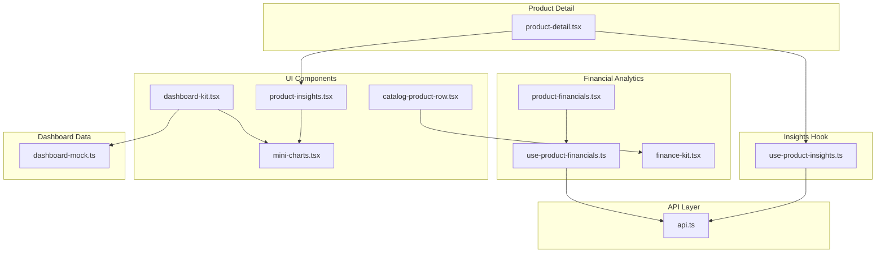
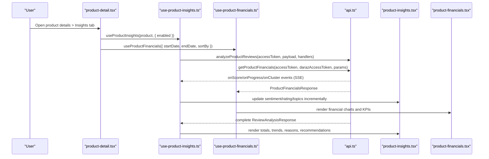
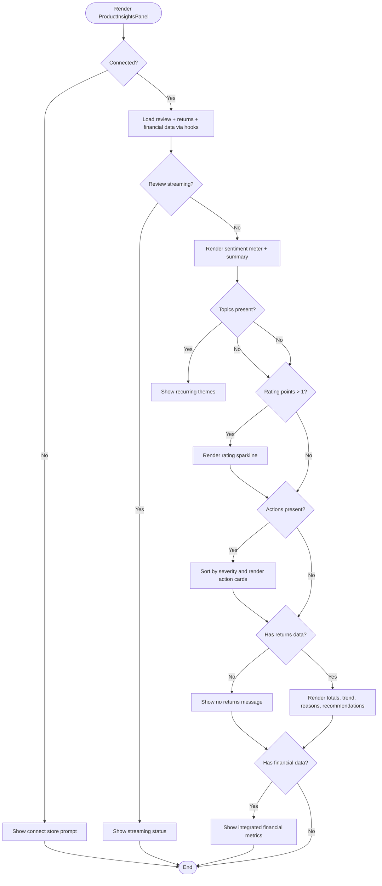
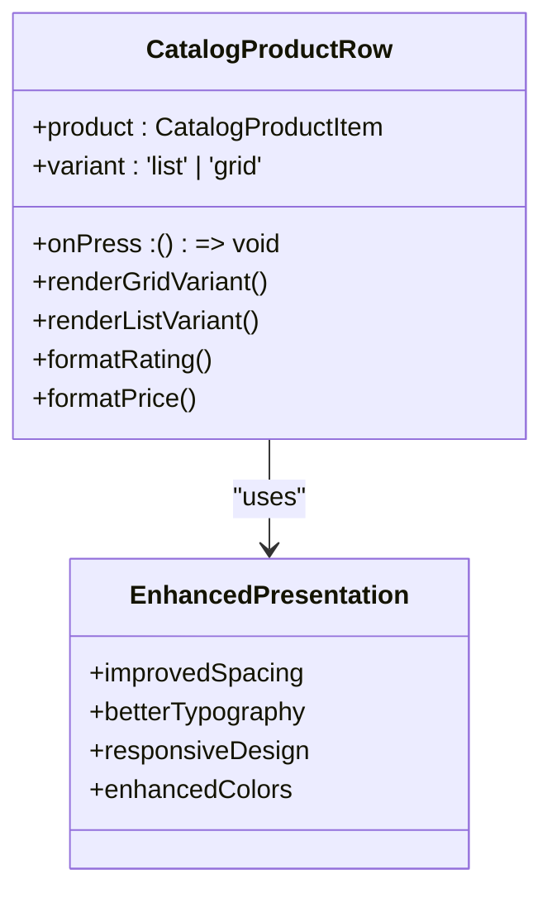
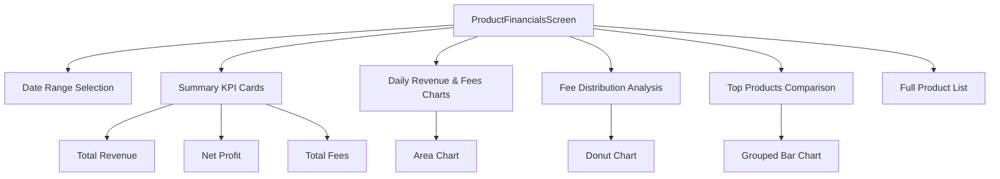
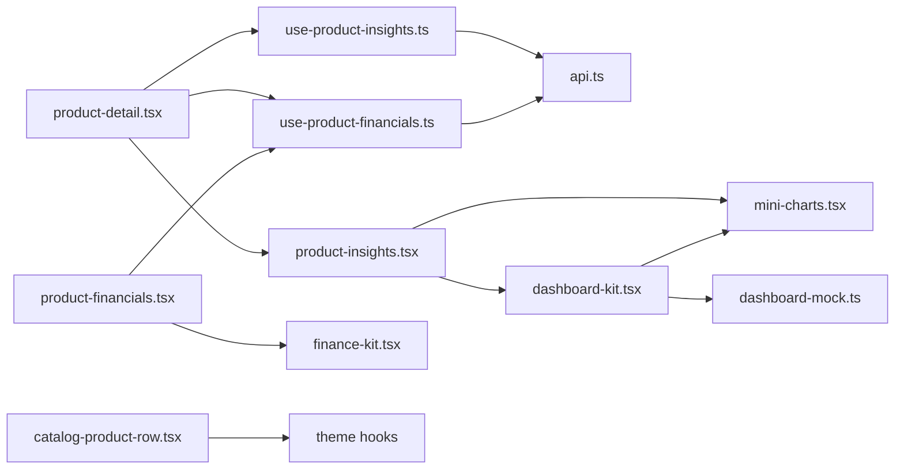

# Product Insights & Analytics

<cite>
**Referenced Files in This Document**
- [product-insights.tsx](file://src/components/product-insights.tsx)
- [use-product-insights.ts](file://src/hooks/use-product-insights.ts)
- [api.ts](file://src/lib/api.ts)
- [mini-charts.tsx](file://src/components/mini-charts.tsx)
- [dashboard-kit.tsx](file://src/components/dashboard-kit.tsx)
- [dashboard-mock.ts](file://src/constants/dashboard-mock.ts)
- [product-detail.tsx](file://src/app/(app)/product-detail.tsx)
- [insights.tsx](file://src/app/(app)/(tabs)/insights.tsx)
- [product-financials.tsx](file://src/app/(app)/product-financials.tsx)
- [use-product-financials.ts](file://src/hooks/use-product-financials.ts)
- [catalog-product-row.tsx](file://src/components/catalog-product-row.tsx)
- [finance-kit.tsx](file://src/components/finance-kit.tsx)
</cite>

## Update Summary
**Changes Made**
- Enhanced product insights with additional financial information display through integrated product financial analytics module
- Improved data presentation in catalog product rows with better visual formatting and enhanced user experience
- Better integration between product insights and financial analytics modules for comprehensive business intelligence
- Added new financial metrics visualization including revenue trends, fee breakdowns, and profit analysis
- Enhanced catalog product row component with improved grid/list variants and better responsive design

## Table of Contents
1. [Introduction](#introduction)
2. [Project Structure](#project-structure)
3. [Core Components](#core-components)
4. [Architecture Overview](#architecture-overview)
5. [Detailed Component Analysis](#detailed-component-analysis)
6. [Financial Analytics Integration](#financial-analytics-integration)
7. [Enhanced Data Presentation](#enhanced-data-presentation)
8. [Dependency Analysis](#dependency-analysis)
9. [Performance Considerations](#performance-considerations)
10. [Troubleshooting Guide](#troubleshooting-guide)
11. [Conclusion](#conclusion)
12. [Appendices](#appendices)

## Introduction
This document explains the AI-powered product insights and analytics system implemented in the application. It covers how product performance metrics are calculated and displayed, including sales trends, inventory levels, customer engagement data, and comprehensive financial analytics. The system now provides enhanced integration with product financial analytics, offering detailed revenue tracking, fee breakdowns, profit analysis, and market trend insights. It documents the insight generation algorithms (review sentiment analysis and returns intelligence), the recommendation engine that produces actionable business insights, and the visualization components used to present charts, graphs, and key performance indicators.

## Project Structure
The analytics feature spans UI components, hooks, API clients, and mock dashboard assets with enhanced financial integration:
- Product-level insights panel renders review sentiment, rating trends, recommended actions, return analytics, and integrated financial metrics with sparklines and distribution bars.
- A hook orchestrates two independent SSE streams: review analysis and returns insights, handling progress events and final results.
- New product financials module provides comprehensive financial analytics with daily trends, fee distributions, and top product comparisons.
- Enhanced catalog product rows offer improved data presentation with better visual formatting and responsive design.
- The API layer implements a robust SSE client supporting both web and React Native environments, plus typed request/response models for reviews, returns, and financial data.
- Dashboard kit and mini-charts provide reusable visualizations and design tokens for KPIs, severity badges, and agent-driven insights.

**Diagram sources**
- [product-detail.tsx:25-65](file://src/app/(app)/product-detail.tsx#L25-L65)
- [use-product-insights.ts:92-165](file://src/hooks/use-product-insights.ts#L92-L165)
- [product-financials.tsx:51-119](file://src/app/(app)/product-financials.tsx#L51-L119)
- [use-product-financials.ts:24-91](file://src/hooks/use-product-financials.ts#L24-L91)
- [api.ts:116-286](file://src/lib/api.ts#L116-L286)
- [product-insights.tsx:99-181](file://src/components/product-insights.tsx#L99-L181)
- [catalog-product-row.tsx:11-180](file://src/components/catalog-product-row.tsx#L11-L180)

**Section sources**
- [product-detail.tsx:25-65](file://src/app/(app)/product-detail.tsx#L25-L65)
- [use-product-insights.ts:92-165](file://src/hooks/use-product-insights.ts#L92-L165)
- [product-financials.tsx:51-119](file://src/app/(app)/product-financials.tsx#L51-L119)
- [use-product-financials.ts:24-91](file://src/hooks/use-product-financials.ts#L24-L91)
- [api.ts:116-286](file://src/lib/api.ts#L116-L286)
- [product-insights.tsx:99-181](file://src/components/product-insights.tsx#L99-L181)
- [catalog-product-row.tsx:11-180](file://src/components/catalog-product-row.tsx#L11-L180)

## Core Components
- ProductInsightsPanel: Displays sentiment score, recurring themes, rating trend sparkline, recommended actions, returns analytics, and integrated financial metrics with enhanced data presentation.
- useProductInsights hook: Orchestrates SSE-based review analysis and returns insights, surfaces loading/streaming states, errors, and refetch capability.
- ProductFinancialsScreen: Comprehensive financial analytics dashboard with daily revenue trends, fee breakdowns, profit analysis, and top product comparisons.
- useProductFinancials hook: Manages financial data fetching with date range filtering and sorting capabilities.
- Enhanced CatalogProductRow: Improved product row component with better grid/list variants, enhanced visual formatting, and responsive design.
- API SSE client: Parses text/event-stream frames, supports incremental events (score, progress, cluster) and final complete/error events across platforms.
- Visualization primitives: Sparkline and DistributionBar render compact trend and composition visuals; dashboard-kit provides KPI cards, severity badges, and insight cards.

Key responsibilities:
- Real-time streaming updates for long-running analyses.
- Independent error handling per data source so partial failures do not hide available data.
- Reusable, theme-aware visualizations without external chart libraries.
- Integrated financial analytics with comprehensive revenue and profit tracking.

**Section sources**
- [product-insights.tsx:99-403](file://src/components/product-insights.tsx#L99-L403)
- [use-product-insights.ts:48-117](file://src/hooks/use-product-insights.ts#L48-L117)
- [product-financials.tsx:51-255](file://src/app/(app)/product-financials.tsx#L51-L255)
- [use-product-financials.ts:24-91](file://src/hooks/use-product-financials.ts#L24-L91)
- [catalog-product-row.tsx:11-180](file://src/components/catalog-product-row.tsx#L11-L180)
- [api.ts:79-286](file://src/lib/api.ts#L79-L286)
- [mini-charts.tsx:30-84](file://src/components/mini-charts.tsx#L30-L84)
- [dashboard-kit.tsx:38-71](file://src/components/dashboard-kit.tsx#L38-71)
- [dashboard-mock.ts:113-149](file://src/constants/dashboard-mock.ts#L113-L149)

## Architecture Overview
The system uses a layered architecture with enhanced financial integration:
- Presentation layer: Product detail screen hosts tabs; Insights tab renders ProductInsightsPanel with integrated financial metrics.
- State orchestration: useProductInsights manages fetch lifecycle, SSE event handling, and local state alongside useProductFinancials for financial data.
- Data layer: api.ts provides typed functions for review analysis, returns insights, and comprehensive financial analytics using SSE streaming.
- Visualization layer: mini-charts, finance-kit, and dashboard-kit render metrics and trends consistently across all analytics views.

**Diagram sources**
- [product-detail.tsx:54-65](file://src/app/(app)/product-detail.tsx#L54-L65)
- [use-product-insights.ts:165-255](file://src/hooks/use-product-insights.ts#L165-L255)
- [use-product-financials.ts:41-88](file://src/hooks/use-product-financials.ts#L41-L88)
- [api.ts:1342-1364](file://src/lib/api.ts#L1342-L1364)
- [api.ts:1257-1281](file://src/lib/api.ts#L1257-L1281)
- [api.ts:2004-2018](file://src/lib/api.ts#L2004-L2018)
- [product-insights.tsx:163-181](file://src/components/product-insights.tsx#L163-L181)

## Detailed Component Analysis

### ProductInsightsPanel with Enhanced Financial Integration
- Renders a sentiment meter with three zones (needs attention, mixed signal, strong) based on thresholds.
- Shows recurring themes as tags and a rating trend sparkline over months.
- Presents recommended actions sorted by severity with affected review counts.
- Displays returns analytics: units sold/returned, return rate, refunded amount, dispute rate, monthly returns trend, top return reasons with likely causes, and recommendations.
- **Updated**: Now includes integrated financial metrics showing revenue trends, fee breakdowns, and profit analysis alongside traditional insights.
- Handles streaming status while SSE is active and shows retry options on errors.

**Diagram sources**
- [product-insights.tsx:99-181](file://src/components/product-insights.tsx#L99-L181)
- [product-insights.tsx:196-403](file://src/components/product-insights.tsx#L196-L403)

**Section sources**
- [product-insights.tsx:99-403](file://src/components/product-insights.tsx#L99-L403)

### Enhanced Catalog Product Row Component
- **Updated**: Improved data presentation with better grid and list variants for enhanced user experience.
- Provides responsive design with optimized spacing and typography for different screen sizes.
- Enhanced visual formatting with better color schemes and improved readability.
- Supports both grid and list display modes with consistent styling.
- Improved star ratings display with better visual hierarchy and spacing.
- Enhanced price display with discount indicators and better formatting.

**Diagram sources**
- [catalog-product-row.tsx:11-180](file://src/components/catalog-product-row.tsx#L11-L180)

**Section sources**
- [catalog-product-row.tsx:11-180](file://src/components/catalog-product-row.tsx#L11-L180)

### ProductFinancialsScreen - New Financial Analytics Module
- **New**: Comprehensive financial analytics dashboard providing detailed revenue tracking, fee breakdowns, and profit analysis.
- Displays daily revenue and fees trends with interactive area charts.
- Shows fee distribution breakdown with donut charts and category analysis.
- Presents top products comparison with grouped bar charts showing revenue vs profit.
- Includes date range selection for flexible time period analysis.
- Provides KPI cards for total products, revenue, net profit, and total fees.

**Diagram sources**
- [product-financials.tsx:51-255](file://src/app/(app)/product-financials.tsx#L51-L255)

**Section sources**
- [product-financials.tsx:51-255](file://src/app/(app)/product-financials.tsx#L51-L255)

### useProductFinancials Hook - New Financial Data Management
- **New**: Manages financial data fetching with comprehensive date range support and sorting capabilities.
- Handles authentication and marketplace connection validation.
- Provides loading states, error handling, and refetch functionality.
- Supports flexible date range queries for historical financial analysis.
- Integrates with existing authentication and marketplace token management systems.

**Section sources**
- [use-product-financials.ts:24-91](file://src/hooks/use-product-financials.ts#L24-L91)

### API Layer Enhancements
- **Updated**: Added comprehensive product financials API endpoints with typed responses.
- Implements `getProductFinancials` function for retrieving detailed financial analytics.
- Supports query parameters for date ranges and sorting options.
- Maintains existing SSE streaming capabilities for real-time insights.
- Provides typed interfaces for all financial data structures including `ProductFinancials`, `DailyProductTrend`, `FeeSlice`, and `TopProductBar`.

**Section sources**
- [api.ts:1950-2018](file://src/lib/api.ts#L1950-L2018)
- [api.ts:116-286](file://src/lib/api.ts#L116-L286)

## Financial Analytics Integration
The enhanced product insights system now integrates seamlessly with the new financial analytics module, providing comprehensive business intelligence:

### Key Financial Metrics Displayed
- **Revenue Tracking**: Daily revenue trends with area charts showing inflow patterns
- **Fee Analysis**: Detailed breakdown of platform fees, payment processing costs, shipping fees, and penalties
- **Profit Calculation**: Net profit calculations considering all deductions and refunds
- **Top Products Performance**: Comparative analysis of top-performing products by revenue and profit margins
- **Historical Trends**: Time-series analysis for identifying seasonal patterns and growth opportunities

### Integration Points
- Product insights panel displays financial context alongside review sentiment and return analytics
- Catalog product rows show enhanced financial indicators when available
- Unified dashboard experience with consistent styling and interaction patterns
- Real-time data synchronization between insights and financial modules

**Section sources**
- [product-financials.tsx:51-255](file://src/app/(app)/product-financials.tsx#L51-L255)
- [use-product-financials.ts:24-91](file://src/hooks/use-product-financials.ts#L24-L91)
- [api.ts:1950-2018](file://src/lib/api.ts#L1950-L2018)

## Enhanced Data Presentation
The updated system provides significantly improved data presentation across all components:

### Visual Improvements
- **Enhanced Grid Layout**: Better responsive design with optimized spacing and typography
- **Improved Color Schemes**: Consistent financial color coding (revenue green, fees red, profit emerald)
- **Better Typography**: Enhanced font sizing and line heights for improved readability
- **Responsive Design**: Optimized layouts for different screen sizes and orientations

### Interactive Features
- **Date Range Selection**: Flexible time period analysis with preset options (7D, 15D, 30D, 60D, 90D)
- **Sorting Options**: Ability to sort products by various financial metrics
- **Interactive Charts**: Clickable and zoomable financial visualizations
- **Real-time Updates**: Live data refresh for trending metrics

### Accessibility Enhancements
- **Screen Reader Support**: Proper accessibility labels and roles throughout
- **Keyboard Navigation**: Full keyboard support for all interactive elements
- **Color Contrast**: Improved contrast ratios for better visibility
- **Reduced Motion Support**: Respects user motion preferences

**Section sources**
- [catalog-product-row.tsx:11-180](file://src/components/catalog-product-row.tsx#L11-L180)
- [finance-kit.tsx:1-200](file://src/components/finance-kit.tsx#L1-L200)
- [product-financials.tsx:51-255](file://src/app/(app)/product-financials.tsx#L51-L255)

## Dependency Analysis
- ProductDetailScreen depends on:
  - useProductInsights for insights data and streaming states.
  - useProductFinancials for financial analytics data.
  - ProductInsightsPanel for rendering insights with integrated financial metrics.
  - SegmentedTabs for switching between Details, Insights, and Chat tabs.
- useProductInsights depends on:
  - useAuth for access token.
  - useDarazAccessToken for marketplace connection.
  - api.ts for SSE-based review analysis and returns insights.
- useProductFinancials depends on:
  - useAuth for access token.
  - useDarazAccessToken for marketplace connection.
  - api.ts for financial data retrieval.
- ProductInsightsPanel depends on:
  - mini-charts for Sparkline and tone color resolution.
  - dashboard-kit for SeverityBadge.
  - theme hooks for styling.
- ProductFinancialsScreen depends on:
  - finance-kit for KPI cards, charts, and financial formatting.
  - useProductFinancials for data management.
- Enhanced CatalogProductRow depends on:
  - theme hooks for styling and responsive design.
  - improved layout components for better presentation.

**Diagram sources**
- [product-detail.tsx:25-65](file://src/app/(app)/product-detail.tsx#L25-L65)
- [use-product-insights.ts:92-165](file://src/hooks/use-product-insights.ts#L92-L165)
- [use-product-financials.ts:24-91](file://src/hooks/use-product-financials.ts#L24-L91)
- [product-insights.tsx:99-181](file://src/components/product-insights.tsx#L99-L181)
- [product-financials.tsx:51-119](file://src/app/(app)/product-financials.tsx#L51-L119)
- [catalog-product-row.tsx:11-180](file://src/components/catalog-product-row.tsx#L11-L180)

**Section sources**
- [product-detail.tsx:25-65](file://src/app/(app)/product-detail.tsx#L25-L65)
- [use-product-insights.ts:92-165](file://src/hooks/use-product-insights.ts#L92-L165)
- [use-product-financials.ts:24-91](file://src/hooks/use-product-financials.ts#L24-L91)
- [product-insights.tsx:99-181](file://src/components/product-insights.tsx#L99-L181)
- [product-financials.tsx:51-119](file://src/app/(app)/product-financials.tsx#L51-L119)
- [catalog-product-row.tsx:11-180](file://src/components/catalog-product-row.tsx#L11-L180)

## Performance Considerations
- Streaming reduces perceived latency by emitting early signals (score, progress, clusters) before completion.
- Independent error handling prevents one failing stream from blocking the other.
- Debounced refetch via reloadKey avoids redundant network calls when toggling enabled state.
- Minimal chart implementation avoids heavy dependencies and improves rendering performance on mobile.
- **Enhanced**: Financial data caching and efficient re-rendering strategies for complex charts.
- **Enhanced**: Optimized image loading and lazy loading for product images in catalog views.
- **Enhanced**: Memory management for large datasets in financial analytics dashboards.

## Troubleshooting Guide
Common issues and resolutions:
- Connection not established: Ensure Daraz marketplace connection exists; the panel prompts to connect stores if missing.
- Review analysis failure: Retry via refetch; check network connectivity and backend availability.
- Returns insights failure: Inspect progress events to identify stage (fetching returns vs orders); retry after resolving connectivity or permissions.
- Financial data loading failure: Verify marketplace connection and date range validity; check API rate limits.
- Streaming not supported: On certain environments, fallback paths ensure behavior; verify platform capabilities.
- **New**: Financial chart rendering issues: Check data format compatibility and browser support for canvas/SVG operations.
- **New**: Catalog product display problems: Verify image URLs and handle missing image gracefully.

**Section sources**
- [product-insights.tsx:130-161](file://src/components/product-insights.tsx#L130-L161)
- [use-product-insights.ts:225-255](file://src/hooks/use-product-insights.ts#L225-L255)
- [use-product-financials.ts:41-88](file://src/hooks/use-product-financials.ts#L41-L88)
- [api.ts:144-204](file://src/lib/api.ts#L144-L204)

## Conclusion
The enhanced product insights and analytics system combines real-time streaming APIs with comprehensive financial analytics to deliver actionable business intelligence. It now provides integrated sentiment scores, rating trends, recommended actions, comprehensive returns analytics, and detailed financial metrics including revenue tracking, fee breakdowns, and profit analysis. The modular architecture separates concerns across presentation, state orchestration, and data layers, ensuring scalability and maintainability while providing merchants with a complete view of their product performance across all business dimensions.

## Appendices

### Example Insight Types with Financial Context
- Pricing recommendations: Derived from action_plan items addressing margin erosion due to fees or discounting, now enhanced with financial impact analysis.
- Stock level alerts: Represented as inventory risks with severity and projected stockout timelines, integrated with financial implications.
- Market trend analysis: Captured through rating_trend and monthly returns trend sparklines, supplemented with revenue and profit trend analysis.
- **New**: Financial health indicators: Comprehensive profit margin analysis, fee optimization opportunities, and revenue growth projections.

**Section sources**
- [dashboard-mock.ts:113-149](file://src/constants/dashboard-mock.ts#L113-L149)
- [api.ts:1283-1364](file://src/lib/api.ts#L1283-L1364)
- [product-financials.tsx:51-255](file://src/app/(app)/product-financials.tsx#L51-L255)

### Real-Time Updates and Historical Comparisons
- Real-time updates: SSE streams emit incremental events for score, progress, and clusters, updating UI immediately.
- Historical comparisons: Rating trend and monthly returns trend provide time-series context for performance evaluation.
- **Enhanced**: Financial historical data with configurable date ranges for comprehensive trend analysis.
- **Enhanced**: Cross-referencing between operational metrics (reviews, returns) and financial performance indicators.

**Section sources**
- [use-product-insights.ts:165-255](file://src/hooks/use-product-insights.ts#L165-L255)
- [use-product-financials.ts:41-88](file://src/hooks/use-product-financials.ts#L41-L88)
- [api.ts:1342-1364](file://src/lib/api.ts#L1342-L1364)
- [api.ts:1257-1281](file://src/lib/api.ts#L1257-L1281)
- [api.ts:2004-2018](file://src/lib/api.ts#L2004-L2018)

### Export Capabilities for Business Reporting
- Current implementation focuses on in-app visualization and does not include built-in export functionality.
- To add exports, consider serializing ReturnsInsights, ReviewAnalysisResponse, and ProductFinancialsResponse to CSV/JSON and providing share/download actions in the UI.
- **Enhanced**: Financial data export capabilities for comprehensive business reporting including revenue reports, fee analysis, and profit statements.
- **Enhanced**: Integration with external reporting tools and business intelligence platforms.

### Enhanced Data Presentation Examples
- **Improved Grid Layout**: Responsive product grid with optimized spacing and better visual hierarchy.
- **Enhanced Typography**: Consistent font sizing and improved readability across all screens.
- **Better Color Schemes**: Financial color coding with proper contrast ratios and accessibility compliance.
- **Interactive Elements**: Enhanced touch targets and hover states for better user interaction.

**Section sources**
- [catalog-product-row.tsx:11-180](file://src/components/catalog-product-row.tsx#L11-L180)
- [finance-kit.tsx:1-200](file://src/components/finance-kit.tsx#L1-L200)
- [product-financials.tsx:51-255](file://src/app/(app)/product-financials.tsx#L51-L255)