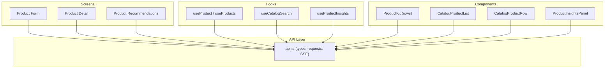
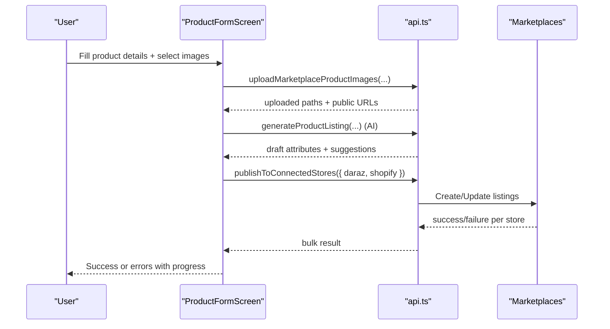
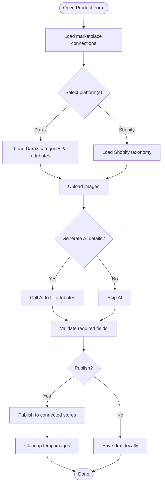
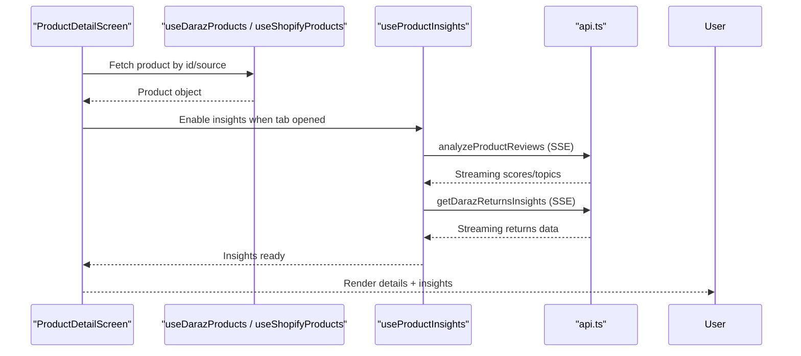
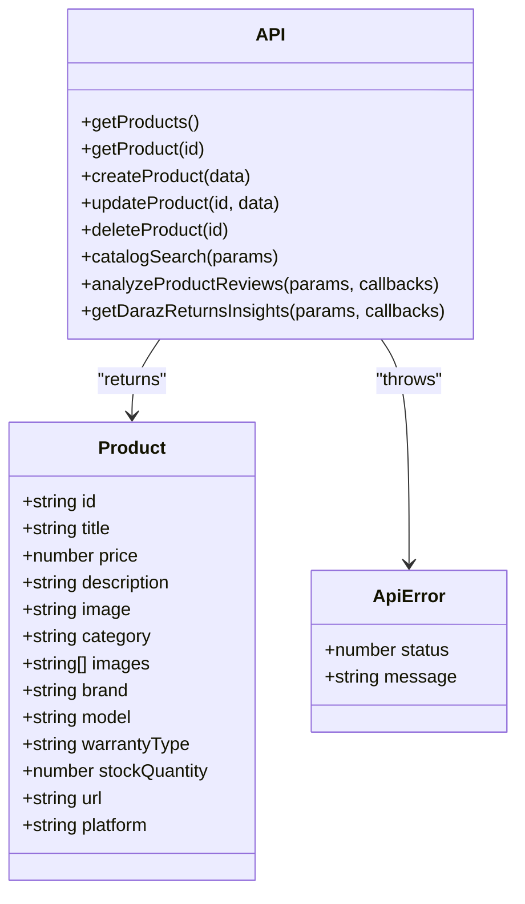
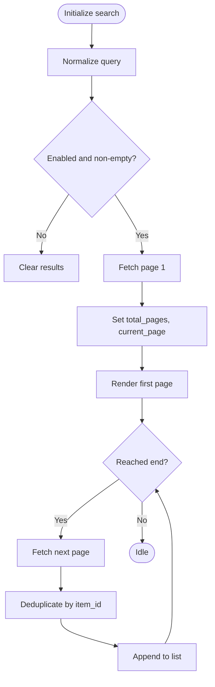
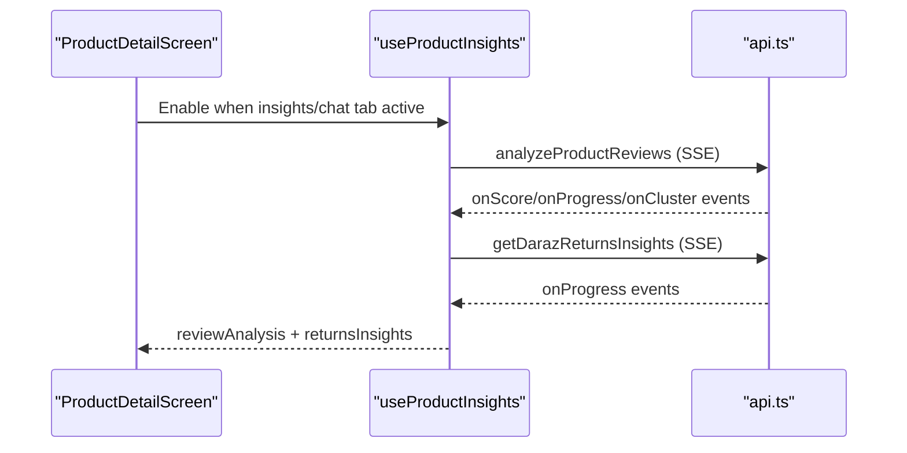
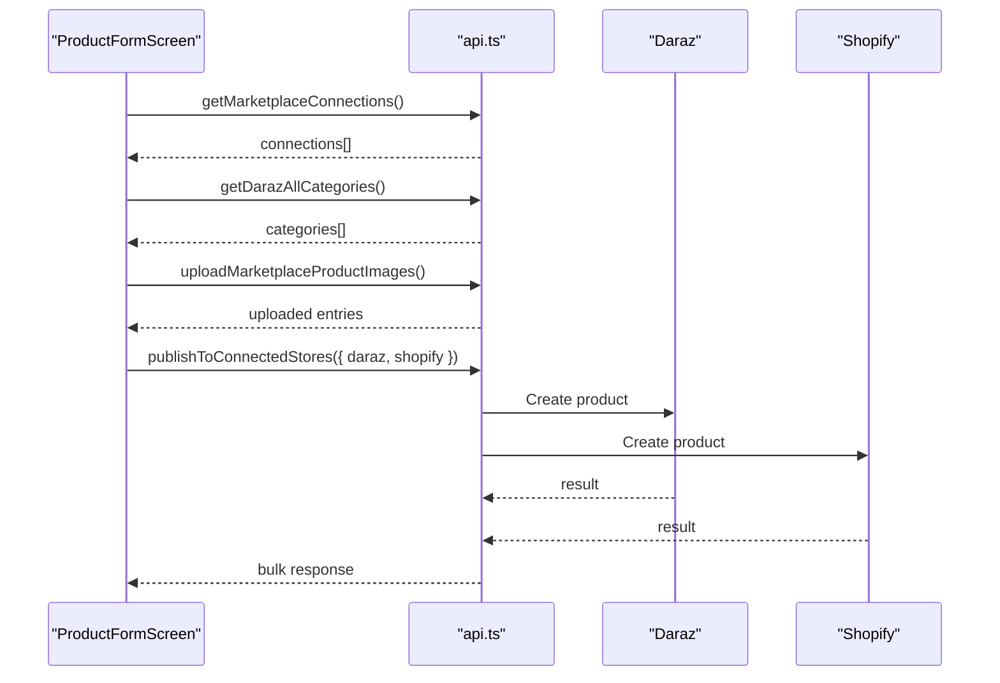
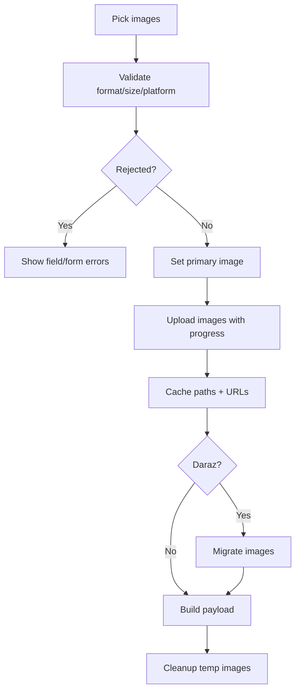
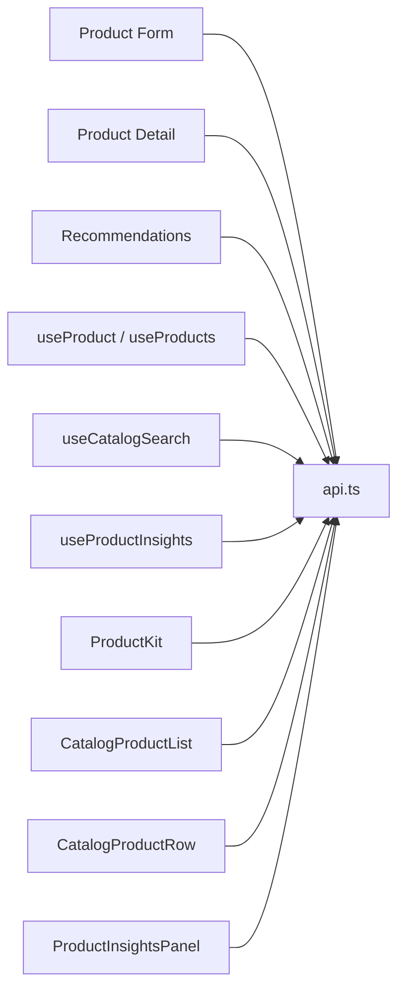

# Product Management

<cite>
**Referenced Files in This Document**
- [product-form.tsx](file://src/app/(app)/product-form.tsx)
- [product-detail.tsx](file://src/app/(app)/product-detail.tsx)
- [use-product.ts](file://src/hooks/use-product.ts)
- [use-products.ts](file://src/hooks/use-products.ts)
- [api.ts](file://src/lib/api.ts)
- [product-kit.tsx](file://src/components/product-kit.tsx)
- [catalog-product-list.tsx](file://src/components/catalog-product-list.tsx)
- [catalog-product-row.tsx](file://src/components/catalog-product-row.tsx)
- [use-catalog-search.ts](file://src/hooks/use-catalog-search.ts)
- [product-insights.tsx](file://src/components/product-insights.tsx)
- [use-product-insights.ts](file://src/hooks/use-product-insights.ts)
- [product-recommendations.tsx](file://src/app/(app)/product-recommendations.tsx)
</cite>

## Table of Contents
1. Introduction
2. Project Structure
3. Core Components
4. Architecture Overview
5. Detailed Component Analysis
6. Dependency Analysis
7. Performance Considerations
8. Troubleshooting Guide
9. Conclusion
10. Appendices

## Introduction
This document explains the product management system implemented in the application. It covers end-to-end CRUD workflows for products, the product form with image upload and validation, catalog browsing with search and filtering, AI-powered insights and recommendations, multi-marketplace synchronization (Daraz and Shopify), image handling and caching strategies, performance considerations for large catalogs, and guidance on extending the product model with custom fields.

## Project Structure
The product feature spans screens, hooks, components, and a shared API layer:
- Screens: product creation/editing, detail view, recommendations
- Hooks: data fetching and state orchestration for single product, all products, catalog search, insights
- Components: reusable UI for product rows, lists, insights panel
- API: typed models, HTTP helpers, SSE streaming, marketplace integrations

**Diagram sources**
- [product-form.tsx:1-120](file://src/app/(app)/product-form.tsx#L1-L120)
- [product-detail.tsx:1-60](file://src/app/(app)/product-detail.tsx#L1-L60)
- [product-recommendations.tsx:1-40](file://src/app/(app)/product-recommendations.tsx#L1-L40)
- [use-product.ts:1-52](file://src/hooks/use-product.ts#L1-L52)
- [use-products.ts:1-58](file://src/hooks/use-products.ts#L1-L58)
- [use-catalog-search.ts:1-60](file://src/hooks/use-catalog-search.ts#L1-L60)
- [use-product-insights.ts:1-120](file://src/hooks/use-product-insights.ts#L1-L120)
- [product-kit.tsx:1-60](file://src/components/product-kit.tsx#L1-L60)
- [catalog-product-list.tsx:1-40](file://src/components/catalog-product-list.tsx#L1-L40)
- [catalog-product-row.tsx:1-40](file://src/components/catalog-product-row.tsx#L1-L40)
- [product-insights.tsx:1-60](file://src/components/product-insights.tsx#L1-L60)
- [api.ts:1-120](file://src/lib/api.ts#L1-L120)

**Section sources**
- [product-form.tsx:1-120](file://src/app/(app)/product-form.tsx#L1-L120)
- [api.ts:1-120](file://src/lib/api.ts#L1-L120)

## Core Components
- Product Form: Creates/edits products, validates inputs, uploads images, generates listing details via AI, and publishes to Daraz and/or Shopify.
- Product Detail: Displays product information, supports editing/deleting local products, and shows AI insights and chat for Daraz-sourced items.
- Catalog Search: Paginated search across external catalog with filters and sorting; deduplication and incremental loading.
- Insights Panel: Streams review analysis and return analytics from backend using SSE; presents sentiment, topics, trends, and recommendations.
- Recommendations: Curated similar products based on category niche using a dedicated hook and list component.

**Section sources**
- [product-form.tsx:65-120](file://src/app/(app)/product-form.tsx#L65-L120)
- [product-detail.tsx:25-65](file://src/app/(app)/product-detail.tsx#L25-L65)
- [use-catalog-search.ts:38-115](file://src/hooks/use-catalog-search.ts#L38-L115)
- [product-insights.tsx:99-160](file://src/components/product-insights.tsx#L99-L160)
- [product-recommendations.tsx:11-40](file://src/app/(app)/product-recommendations.tsx#L11-L40)

## Architecture Overview
The system uses a React-based frontend with hooks that call a centralized API module. The API module handles authentication, error normalization, and streaming responses for long-running tasks. Marketplace integrations are abstracted behind typed functions and connection discovery.

**Diagram sources**
- [product-form.tsx:409-630](file://src/app/(app)/product-form.tsx#L409-L630)
- [api.ts:468-500](file://src/lib/api.ts#L468-L500)

## Detailed Component Analysis

### Product Creation and Editing (CRUD)
- Creation: Validate title, price, description, images; optionally generate attributes via AI; upload images; publish to selected marketplaces.
- Editing: Prefill form from existing product; update fields; re-publish changes if needed.
- Deletion: Confirm delete action; call delete endpoint; navigate back.

Key behaviors:
- Image selection enforces format, size limits, and platform-specific constraints; duplicates are rejected; primary image can be set.
- AI generation populates attributes based on selected Daraz category and images; user-required fields are highlighted.
- Publishing supports single-platform or both platforms with progress tracking and cleanup of temporary images.

**Diagram sources**
- [product-form.tsx:122-227](file://src/app/(app)/product-form.tsx#L122-L227)
- [product-form.tsx:274-323](file://src/app/(app)/product-form.tsx#L274-L323)
- [product-form.tsx:409-630](file://src/app/(app)/product-form.tsx#L409-L630)

**Section sources**
- [product-form.tsx:65-120](file://src/app/(app)/product-form.tsx#L65-L120)
- [product-form.tsx:274-323](file://src/app/(app)/product-form.tsx#L274-L323)
- [product-form.tsx:409-630](file://src/app/(app)/product-form.tsx#L409-L630)

### Product Detail View
- Displays product info, images carousel, brand/model badges, stock status, warranty, and marketplace link.
- Provides Edit/Delete actions for locally managed products.
- Integrates Insights and Chat tabs for Daraz-sourced products.

**Diagram sources**
- [product-detail.tsx:25-65](file://src/app/(app)/product-detail.tsx#L25-L65)
- [use-product-insights.ts:127-260](file://src/hooks/use-product-insights.ts#L127-L260)
- [api.ts:215-286](file://src/lib/api.ts#L215-L286)

**Section sources**
- [product-detail.tsx:25-65](file://src/app/(app)/product-detail.tsx#L25-L65)
- [product-detail.tsx:66-87](file://src/app/(app)/product-detail.tsx#L66-L87)

### Product Data Model and API Integration
- Product model includes core fields plus optional marketplace-derived fields (brand, model, warrantyType, stockQuantity, images).
- API module provides typed functions for auth, marketplace connections, product CRUD, catalog search, and streaming endpoints.
- Error handling normalizes backend messages into user-friendly strings.

**Diagram sources**
- [api.ts:468-494](file://src/lib/api.ts#L468-L494)
- [api.ts:5-13](file://src/lib/api.ts#L5-L13)

**Section sources**
- [api.ts:468-494](file://src/lib/api.ts#L468-L494)
- [use-product.ts:15-52](file://src/hooks/use-product.ts#L15-L52)
- [use-products.ts:15-58](file://src/hooks/use-products.ts#L15-L58)

### Product Catalog Browsing with Search and Filtering
- Paginated search with query, sort, and price range filters.
- Deduplication by item_id to avoid duplicates across pages.
- Infinite scroll support with loadMore and refresh controls.

**Diagram sources**
- [use-catalog-search.ts:38-115](file://src/hooks/use-catalog-search.ts#L38-L115)
- [catalog-product-list.tsx:74-108](file://src/components/catalog-product-list.tsx#L74-L108)

**Section sources**
- [use-catalog-search.ts:38-115](file://src/hooks/use-catalog-search.ts#L38-L115)
- [catalog-product-list.tsx:25-108](file://src/components/catalog-product-list.tsx#L25-L108)

### AI-Powered Insights and Recommendations
- Insights: Streams review analysis and return metrics; displays sentiment score, recurring themes, rating trend, recommended actions, and return reasons.
- Recommendations: Uses niche to fetch curated similar products; displays count and paginated list.

**Diagram sources**
- [use-product-insights.ts:127-260](file://src/hooks/use-product-insights.ts#L127-L260)
- [product-insights.tsx:99-160](file://src/components/product-insights.tsx#L99-L160)

**Section sources**
- [use-product-insights.ts:127-260](file://src/hooks/use-product-insights.ts#L127-L260)
- [product-insights.tsx:99-160](file://src/components/product-insights.tsx#L99-L160)
- [product-recommendations.tsx:11-40](file://src/app/(app)/product-recommendations.tsx#L11-L40)

### Multi-Marketplace Synchronization
- Connection discovery: Loads available marketplace connections and filters active ones.
- Category mapping: For Daraz, loads live categories and attributes; for Shopify, loads taxonomy.
- Publishing: Builds platform-specific payloads and calls a bulk publish function; handles partial failures and cleans up temporary images.

**Diagram sources**
- [product-form.tsx:122-187](file://src/app/(app)/product-form.tsx#L122-L187)
- [product-form.tsx:519-630](file://src/app/(app)/product-form.tsx#L519-L630)
- [api.ts:353-372](file://src/lib/api.ts#L353-L372)

**Section sources**
- [product-form.tsx:122-187](file://src/app/(app)/product-form.tsx#L122-L187)
- [product-form.tsx:519-630](file://src/app/(app)/product-form.tsx#L519-L630)

### Image Handling, Optimization, and Caching
- Selection: Enforces max count, supported formats, size limits, and platform-specific constraints; rejects duplicates.
- Upload: Uses a dedicated upload function with progress callbacks; caches uploaded paths and URLs to avoid re-uploads during the same session.
- Migration: For Daraz, migrates images to platform-specific storage before publishing.
- Cleanup: Removes temporary images after successful publish or on discard.

**Diagram sources**
- [product-form.tsx:274-323](file://src/app/(app)/product-form.tsx#L274-L323)
- [product-form.tsx:519-630](file://src/app/(app)/product-form.tsx#L519-L630)

**Section sources**
- [product-form.tsx:274-323](file://src/app/(app)/product-form.tsx#L274-L323)
- [product-form.tsx:519-630](file://src/app/(app)/product-form.tsx#L519-L630)

### Extending the Product Model and Adding Custom Fields
- Current model supports core fields plus marketplace-derived fields; additional fields can be added to the type definition and propagated through create/update flows.
- For marketplace-specific attributes (e.g., Daraz category attributes), the form dynamically renders attribute inputs and maps values into platform payloads.
- To add custom fields:
  - Extend the Product type in the API layer.
  - Update create/update functions to include new fields.
  - Add UI inputs in the product form and map them into payloads.
  - Ensure validation rules reflect new requirements.

**Section sources**
- [api.ts:468-494](file://src/lib/api.ts#L468-L494)
- [product-form.tsx:549-581](file://src/app/(app)/product-form.tsx#L549-L581)

## Dependency Analysis
- Screens depend on hooks for data fetching and state management.
- Hooks depend on the API layer for network operations and streaming.
- Components consume data from hooks and render UI; some components also navigate or trigger side effects.
- Marketplace integrations are encapsulated within the API layer and invoked by screens/hooks.

**Diagram sources**
- [product-form.tsx:1-120](file://src/app/(app)/product-form.tsx#L1-L120)
- [product-detail.tsx:1-60](file://src/app/(app)/product-detail.tsx#L1-L60)
- [product-recommendations.tsx:1-40](file://src/app/(app)/product-recommendations.tsx#L1-L40)
- [use-product.ts:1-52](file://src/hooks/use-product.ts#L1-L52)
- [use-products.ts:1-58](file://src/hooks/use-products.ts#L1-L58)
- [use-catalog-search.ts:1-60](file://src/hooks/use-catalog-search.ts#L1-L60)
- [use-product-insights.ts:1-120](file://src/hooks/use-product-insights.ts#L1-L120)
- [product-kit.tsx:1-60](file://src/components/product-kit.tsx#L1-L60)
- [catalog-product-list.tsx:1-40](file://src/components/catalog-product-list.tsx#L1-L40)
- [catalog-product-row.tsx:1-40](file://src/components/catalog-product-row.tsx#L1-L40)
- [product-insights.tsx:1-60](file://src/components/product-insights.tsx#L1-L60)
- [api.ts:1-120](file://src/lib/api.ts#L1-L120)

**Section sources**
- [api.ts:1-120](file://src/lib/api.ts#L1-L120)

## Performance Considerations
- Pagination and deduplication: Catalog search uses pagination and deduplicates by item_id to prevent redundant rendering.
- Incremental loading: Infinite scroll triggers loadMore only when needed; refresh control allows manual reloads.
- Streaming updates: Insights use SSE to provide real-time progress and partial results without blocking the UI.
- Image optimization: Enforce size/format limits; cache uploaded paths/URLs within a session; migrate images once per platform; clean up temporary files post-publish.
- Reduced motion: Respect reduced motion settings for animations to improve accessibility and performance on low-end devices.

[No sources needed since this section provides general guidance]

## Troubleshooting Guide
Common issues and resolutions:
- Authentication/connection errors: Ensure access token is present; retry failed requests; check marketplace connections.
- Image upload failures: Verify format and size limits; ensure permissions granted; handle partial failures and cleanup.
- Missing marketplace attributes: Complete required Daraz attributes before publishing; wait for attributes to load.
- Insights not loading: Confirm Daraz connection and product URL; refetch when necessary; handle streaming errors gracefully.
- Catalog search empty: Check query normalization and enabled state; refresh or adjust filters.

**Section sources**
- [product-form.tsx:122-187](file://src/app/(app)/product-form.tsx#L122-L187)
- [product-form.tsx:274-323](file://src/app/(app)/product-form.tsx#L274-L323)
- [product-form.tsx:519-630](file://src/app/(app)/product-form.tsx#L519-L630)
- [use-product-insights.ts:127-260](file://src/hooks/use-product-insights.ts#L127-L260)
- [use-catalog-search.ts:117-134](file://src/hooks/use-catalog-search.ts#L117-L134)

## Conclusion
The product management system provides a robust workflow for creating, editing, and deleting products, with strong support for multi-marketplace synchronization, AI-driven assistance, and insightful analytics. Image handling is optimized for performance and reliability, while catalog browsing scales through pagination and deduplication. The modular architecture enables easy extension of the product model and addition of custom fields.

[No sources needed since this section summarizes without analyzing specific files]

## Appendices

### API Endpoints and Types Summary
- Product CRUD: get_products, get_product/{id}, create_product, update_product, delete_product/{id}
- Marketplace: get_marketplace_connections, get_daraz_all_categories, get_shopify_taxonomy
- Insights: analyze_product_reviews (SSE), get_daraz_returns_insights (SSE)
- Catalog: catalog_search with pagination and filters

**Section sources**
- [api.ts:468-494](file://src/lib/api.ts#L468-L494)
- [api.ts:353-372](file://src/lib/api.ts#L353-L372)
- [use-product-insights.ts:127-260](file://src/hooks/use-product-insights.ts#L127-L260)
- [use-catalog-search.ts:38-115](file://src/hooks/use-catalog-search.ts#L38-L115)