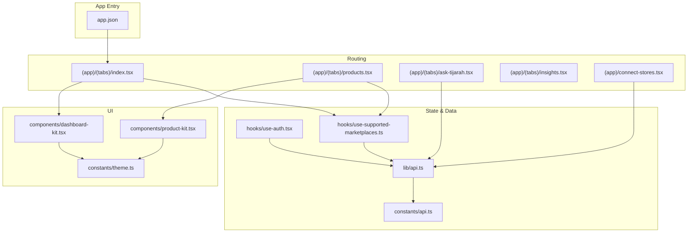
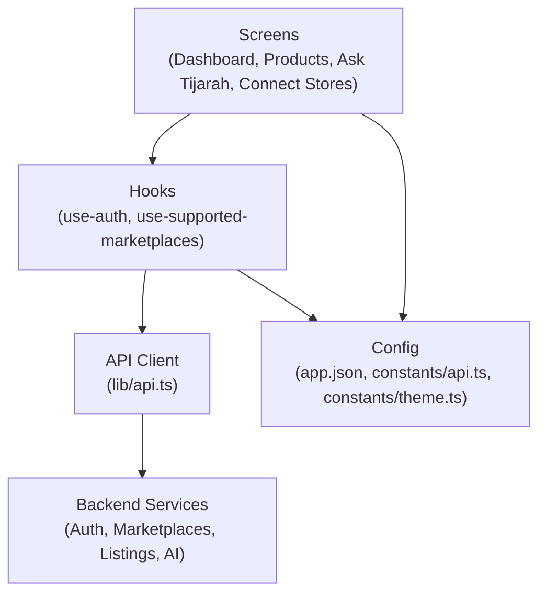
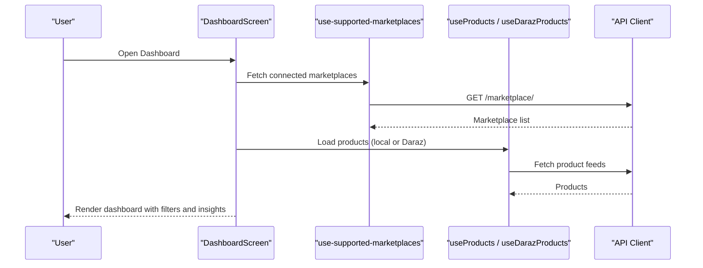
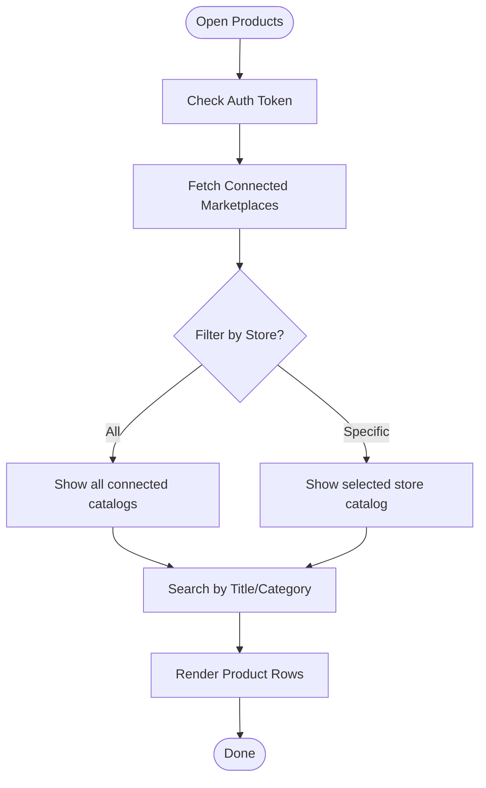
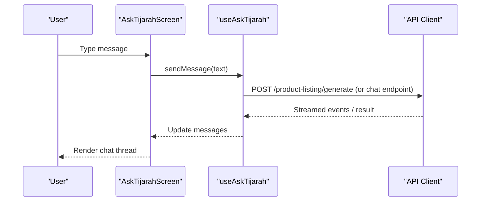
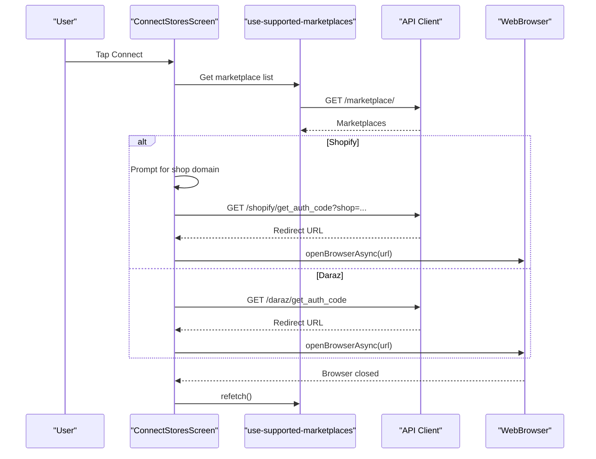
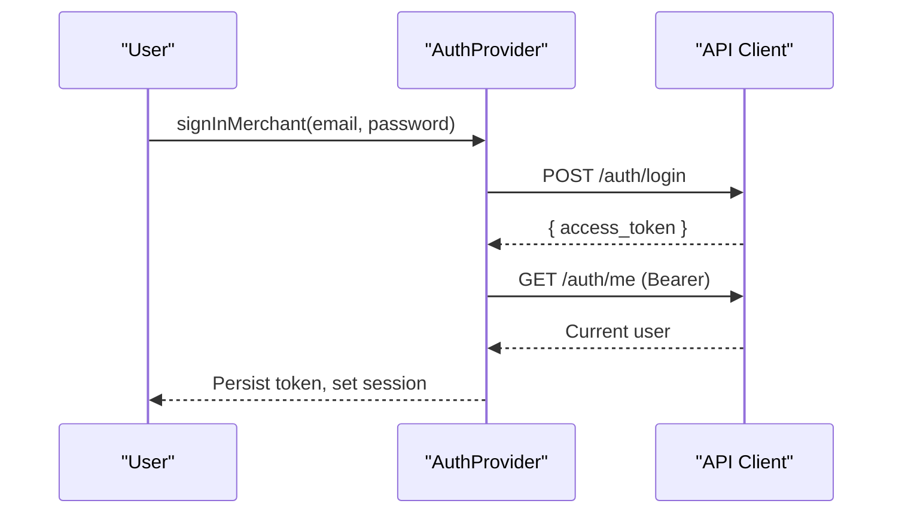
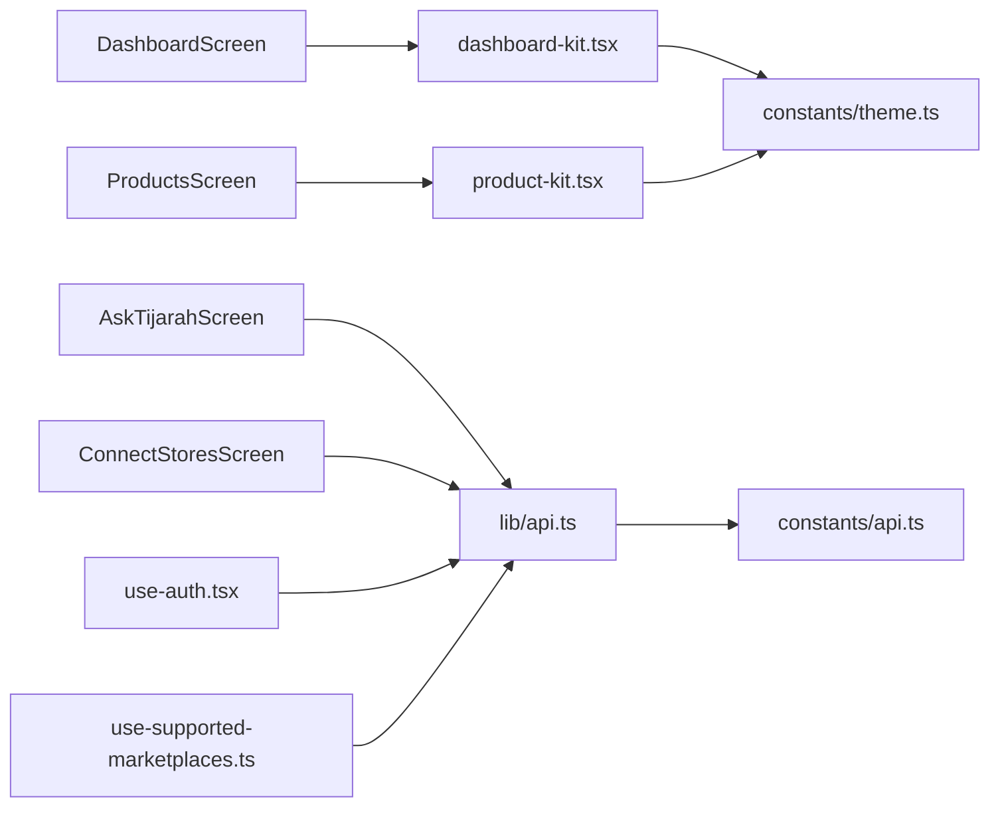

# Project Overview

<cite>
**Referenced Files in This Document**
- [README.md](file://README.md)
- [package.json](file://package.json)
- [app.json](file://app.json)
- [src/app/(app)/(tabs)/index.tsx](file://src/app/(app)/(tabs)/index.tsx)
- [src/app/(app)/(tabs)/products.tsx](file://src/app/(app)/(tabs)/products.tsx)
- [src/app/(app)/(tabs)/ask-tijarah.tsx](file://src/app/(app)/(tabs)/ask-tijarah.tsx)
- [src/app/(app)/(tabs)/insights.tsx](file://src/app/(app)/(tabs)/insights.tsx)
- [src/app/(app)/connect-stores.tsx](file://src/app/(app)/connect-stores.tsx)
- [src/hooks/use-auth.tsx](file://src/hooks/use-auth.tsx)
- [src/hooks/use-supported-marketplaces.ts](file://src/hooks/use-supported-marketplaces.ts)
- [src/components/dashboard-kit.tsx](file://src/components/dashboard-kit.tsx)
- [src/components/product-kit.tsx](file://src/components/product-kit.tsx)
- [src/lib/api.ts](file://src/lib/api.ts)
- [src/constants/api.ts](file://src/constants/api.ts)
- [src/constants/theme.ts](file://src/constants/theme.ts)
</cite>

## Table of Contents
1. Introduction
2. Project Structure
3. Core Components
4. Architecture Overview
5. Detailed Component Analysis
6. Dependency Analysis
7. Performance Considerations
8. Troubleshooting Guide
9. Conclusion

## Introduction
Tijarah AI is a mobile-first, AI-powered commerce hub designed for multi-marketplace sellers. It connects merchants’ stores on platforms such as Shopify and Daraz (with Amazon planned), centralizes product data, and delivers intelligent insights through an intuitive mobile interface. The app helps e-commerce merchants and business owners manage listings, monitor performance, and generate optimized listings with AI assistance—all from one place.

Key features include:
- Product management across connected marketplaces
- Business analytics and insights on the dashboard
- AI-powered listing generation to streamline catalog creation
- Marketplace integrations with secure OAuth flows
- A conversational “Ask Tijarah” assistant to explore your catalog and get recommendations

Technology stack highlights:
- Expo + React Native for cross-platform mobile development
- TypeScript for type safety and developer experience
- Modern mobile practices including file-based routing, hooks-driven state, and theme-aware UI

**Section sources**
- [README.md:1-57](file://README.md#L1-L57)
- [package.json:1-52](file://package.json#L1-L52)
- [app.json:1-52](file://app.json#L1-L52)

## Project Structure
The app follows Expo Router’s file-based routing under src/app, with feature-oriented folders for screens, shared components, hooks, constants, and a centralized API layer.

**Diagram sources**
- [app.json:1-52](file://app.json#L1-L52)
- [src/app/(app)/(tabs)/index.tsx:1-444](file://src/app/(app)/(tabs)/index.tsx#L1-L444)
- [src/app/(app)/(tabs)/products.tsx:1-351](file://src/app/(app)/(tabs)/products.tsx#L1-L351)
- [src/app/(app)/(tabs)/ask-tijarah.tsx:1-201](file://src/app/(app)/(tabs)/ask-tijarah.tsx#L1-L201)
- [src/app/(app)/(tabs)/insights.tsx:1-13](file://src/app/(app)/(tabs)/insights.tsx#L1-L13)
- [src/app/(app)/connect-stores.tsx:1-320](file://src/app/(app)/connect-stores.tsx#L1-L320)
- [src/hooks/use-auth.tsx:1-91](file://src/hooks/use-auth.tsx#L1-L91)
- [src/hooks/use-supported-marketplaces.ts:1-54](file://src/hooks/use-supported-marketplaces.ts#L1-L54)
- [src/lib/api.ts:1-800](file://src/lib/api.ts#L1-L800)
- [src/constants/api.ts:1-16](file://src/constants/api.ts#L1-L16)
- [src/components/dashboard-kit.tsx:1-604](file://src/components/dashboard-kit.tsx#L1-L604)
- [src/components/product-kit.tsx:1-206](file://src/components/product-kit.tsx#L1-L206)
- [src/constants/theme.ts:1-263](file://src/constants/theme.ts#L1-L263)

**Section sources**
- [src/app/(app)/(tabs)/index.tsx:1-444](file://src/app/(app)/(tabs)/index.tsx#L1-L444)
- [src/app/(app)/(tabs)/products.tsx:1-351](file://src/app/(app)/(tabs)/products.tsx#L1-L351)
- [src/app/(app)/connect-stores.tsx:1-320](file://src/app/(app)/connect-stores.tsx#L1-L320)
- [src/lib/api.ts:1-800](file://src/lib/api.ts#L1-L800)
- [src/constants/theme.ts:1-263](file://src/constants/theme.ts#L1-L263)

## Core Components
- Dashboard screen: Central hub showing business health, key metrics, inventory risks, sentiment, agent activity, recent products, and insight cards. Supports store filtering and date range selection.
- Products screen: Unified view of connected marketplace catalogs with search and per-store filtering.
- Ask Tijarah: Conversational AI chat scoped to the merchant’s catalog, with suggested prompts and conversation reset.
- Connect Stores: Onboarding flow to connect Shopify and Daraz via OAuth; shows connected vs. available marketplaces.
- Insights screen: Placeholder for future comprehensive AI insights feed.

These components are built with reusable UI primitives (dashboard kit, product rows) and powered by typed API calls and hooks for auth and marketplace state.

**Section sources**
- [src/app/(app)/(tabs)/index.tsx:1-444](file://src/app/(app)/(tabs)/index.tsx#L1-L444)
- [src/app/(app)/(tabs)/products.tsx:1-351](file://src/app/(app)/(tabs)/products.tsx#L1-L351)
- [src/app/(app)/(tabs)/ask-tijarah.tsx:1-201](file://src/app/(app)/(tabs)/ask-tijarah.tsx#L1-L201)
- [src/app/(app)/connect-stores.tsx:1-320](file://src/app/(app)/connect-stores.tsx#L1-L320)
- [src/app/(app)/(tabs)/insights.tsx:1-13](file://src/app/(app)/(tabs)/insights.tsx#L1-L13)
- [src/components/dashboard-kit.tsx:1-604](file://src/components/dashboard-kit.tsx#L1-L604)
- [src/components/product-kit.tsx:1-206](file://src/components/product-kit.tsx#L1-L206)

## Architecture Overview
Tijarah AI uses a layered architecture:
- Presentation: Expo Router screens and themed UI components
- State: Hooks for authentication, marketplace connections, and product data
- Integration: Typed API client with error handling and streaming support
- Configuration: App metadata, environment-based API base URL, and design tokens

**Diagram sources**
- [src/app/(app)/(tabs)/index.tsx:1-444](file://src/app/(app)/(tabs)/index.tsx#L1-L444)
- [src/app/(app)/(tabs)/products.tsx:1-351](file://src/app/(app)/(tabs)/products.tsx#L1-L351)
- [src/app/(app)/(tabs)/ask-tijarah.tsx:1-201](file://src/app/(app)/(tabs)/ask-tijarah.tsx#L1-L201)
- [src/app/(app)/connect-stores.tsx:1-320](file://src/app/(app)/connect-stores.tsx#L1-L320)
- [src/hooks/use-auth.tsx:1-91](file://src/hooks/use-auth.tsx#L1-L91)
- [src/hooks/use-supported-marketplaces.ts:1-54](file://src/hooks/use-supported-marketplaces.ts#L1-L54)
- [src/lib/api.ts:1-800](file://src/lib/api.ts#L1-L800)
- [src/constants/api.ts:1-16](file://src/constants/api.ts#L1-L16)
- [app.json:1-52](file://app.json#L1-L52)
- [src/constants/theme.ts:1-263](file://src/constants/theme.ts#L1-L263)

## Detailed Component Analysis

### Dashboard Screen
- Displays business health, profit metric, primary insight card, inventory risks, customer sentiment, agent activity, recent products, and feature graphs.
- Supports store selector to filter by connected marketplace and refresh controls to sync data.
- Uses dashboard kit components for consistent, semantic UI.

**Diagram sources**
- [src/app/(app)/(tabs)/index.tsx:1-444](file://src/app/(app)/(tabs)/index.tsx#L1-L444)
- [src/hooks/use-supported-marketplaces.ts:1-54](file://src/hooks/use-supported-marketplaces.ts#L1-L54)
- [src/lib/api.ts:344-357](file://src/lib/api.ts#L344-L357)

**Section sources**
- [src/app/(app)/(tabs)/index.tsx:1-444](file://src/app/(app)/(tabs)/index.tsx#L1-L444)
- [src/components/dashboard-kit.tsx:1-604](file://src/components/dashboard-kit.tsx#L1-L604)

### Products Screen
- Aggregates products from connected marketplaces (Daraz and Shopify).
- Provides search by title/category and per-store filtering.
- Shows loading states, errors with retry, and empty states.

**Diagram sources**
- [src/app/(app)/(tabs)/products.tsx:1-351](file://src/app/(app)/(tabs)/products.tsx#L1-L351)
- [src/components/product-kit.tsx:1-206](file://src/components/product-kit.tsx#L1-L206)

**Section sources**
- [src/app/(app)/(tabs)/products.tsx:1-351](file://src/app/(app)/(tabs)/products.tsx#L1-L351)
- [src/components/product-kit.tsx:1-206](file://src/components/product-kit.tsx#L1-L206)

### Ask Tijarah (AI Chat)
- Conversational interface scoped to the merchant’s catalog.
- Sends messages, displays thinking state, supports resetting conversations, and offers suggested prompt groups when no conversation exists.

**Diagram sources**
- [src/app/(app)/(tabs)/ask-tijarah.tsx:1-201](file://src/app/(app)/(tabs)/ask-tijarah.tsx#L1-L201)
- [src/lib/api.ts:629-638](file://src/lib/api.ts#L629-L638)

**Section sources**
- [src/app/(app)/(tabs)/ask-tijarah.tsx:1-201](file://src/app/(app)/(tabs)/ask-tijarah.tsx#L1-L201)

### Connect Stores
- Lists supported marketplaces, prioritizing already-connected ones.
- Handles Shopify domain input and opens Daraz OAuth in an in-app browser.
- Refetches marketplace state after connection completes.

**Diagram sources**
- [src/app/(app)/connect-stores.tsx:1-320](file://src/app/(app)/connect-stores.tsx#L1-L320)
- [src/lib/api.ts:374-436](file://src/lib/api.ts#L374-L436)

**Section sources**
- [src/app/(app)/connect-stores.tsx:1-320](file://src/app/(app)/connect-stores.tsx#L1-L320)
- [src/lib/api.ts:374-436](file://src/lib/api.ts#L374-L436)

### Authentication Flow
- Persists access token securely and hydrates session on launch.
- Provides sign-up, sign-in, and sign-out actions used across screens.

**Diagram sources**
- [src/hooks/use-auth.tsx:1-91](file://src/hooks/use-auth.tsx#L1-L91)
- [src/lib/api.ts:317-342](file://src/lib/api.ts#L317-L342)

**Section sources**
- [src/hooks/use-auth.tsx:1-91](file://src/hooks/use-auth.tsx#L1-L91)
- [src/lib/api.ts:317-342](file://src/lib/api.ts#L317-L342)

## Dependency Analysis
- Screens depend on hooks for state and data fetching.
- Hooks depend on the typed API client for network requests.
- API client depends on environment configuration for base URL and platform-specific streaming behavior.
- UI components depend on the theme system for consistent styling.

**Diagram sources**
- [src/app/(app)/(tabs)/index.tsx:1-444](file://src/app/(app)/(tabs)/index.tsx#L1-L444)
- [src/app/(app)/(tabs)/products.tsx:1-351](file://src/app/(app)/(tabs)/products.tsx#L1-L351)
- [src/app/(app)/(tabs)/ask-tijarah.tsx:1-201](file://src/app/(app)/(tabs)/ask-tijarah.tsx#L1-L201)
- [src/app/(app)/connect-stores.tsx:1-320](file://src/app/(app)/connect-stores.tsx#L1-L320)
- [src/hooks/use-auth.tsx:1-91](file://src/hooks/use-auth.tsx#L1-L91)
- [src/hooks/use-supported-marketplaces.ts:1-54](file://src/hooks/use-supported-marketplaces.ts#L1-L54)
- [src/lib/api.ts:1-800](file://src/lib/api.ts#L1-L800)
- [src/constants/api.ts:1-16](file://src/constants/api.ts#L1-L16)
- [src/components/dashboard-kit.tsx:1-604](file://src/components/dashboard-kit.tsx#L1-L604)
- [src/components/product-kit.tsx:1-206](file://src/components/product-kit.tsx#L1-L206)
- [src/constants/theme.ts:1-263](file://src/constants/theme.ts#L1-L263)

**Section sources**
- [src/lib/api.ts:1-800](file://src/lib/api.ts#L1-L800)
- [src/constants/api.ts:1-16](file://src/constants/api.ts#L1-L16)
- [src/constants/theme.ts:1-263](file://src/constants/theme.ts#L1-L263)

## Performance Considerations
- Prefer connected marketplace feeds where available to reduce local mock rendering and improve accuracy.
- Use memoization for derived lists (e.g., filtered products, connected marketplaces) to avoid unnecessary re-renders.
- Leverage skeleton loaders and refresh controls to keep UI responsive during network operations.
- Keep image sizes reasonable and use efficient image components provided by the SDK.

[No sources needed since this section provides general guidance]

## Troubleshooting Guide
- Network reachability: If the server cannot be reached, the API client throws a clear error; verify EXPO_PUBLIC_API_URL and device connectivity.
- Authentication issues: Ensure the access token is present and valid; invalid tokens are cleared automatically.
- Marketplace connection failures: Retry flows are exposed in screens; check OAuth redirects and backend availability.
- Empty states: When no products exist, screens show helpful prompts; ensure stores are connected and synced.

**Section sources**
- [src/lib/api.ts:53-77](file://src/lib/api.ts#L53-L77)
- [src/hooks/use-auth.tsx:27-53](file://src/hooks/use-auth.tsx#L27-L53)
- [src/app/(app)/connect-stores.tsx:41-72](file://src/app/(app)/connect-stores.tsx#L41-L72)
- [src/app/(app)/(tabs)/products.tsx:160-233](file://src/app/(app)/(tabs)/products.tsx#L160-L233)

## Conclusion
Tijarah AI consolidates multi-marketplace commerce into a single, intelligent mobile experience. With robust integrations for Shopify and Daraz, a strong foundation for AI-driven insights and listing generation, and a modern Expo/React Native/TypeScript stack, it equips merchants to manage their businesses efficiently and grow across channels.

[No sources needed since this section summarizes without analyzing specific files]